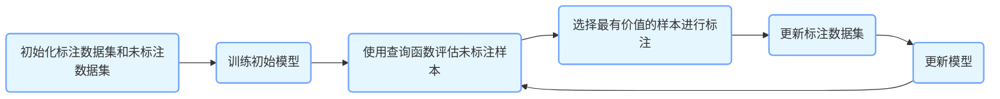

# 模型训练中的主动学习策略自适应优化

> 关键词：模型训练、主动学习策略、自适应优化、不确定性采样、查询函数

> 摘要：本文聚焦于模型训练中的主动学习策略自适应优化。主动学习能够通过选择性地标注样本，有效减少标注成本并提升模型性能。文中详细介绍了主动学习的核心概念、算法原理及数学模型，结合Python代码进行了深入阐释。通过项目实战案例，展示了如何在实际场景中应用主动学习策略并进行自适应优化。同时，探讨了主动学习的实际应用场景，推荐了相关的学习资源、开发工具和论文著作。最后对主动学习未来的发展趋势与挑战进行了总结，并给出常见问题的解答和扩展阅读的参考资料。

## 1. 背景介绍 
### 1.1 目的和范围
在机器学习领域，数据标注是一项耗时且昂贵的任务。主动学习作为一种有效的策略，旨在通过选择最有价值的样本进行标注，从而减少标注工作量，提高模型的训练效率和性能。本文的目的是深入探讨模型训练中主动学习策略的自适应优化方法，涵盖主动学习的基本概念、核心算法、数学模型、实际应用案例以及相关的工具和资源。

### 1.2 预期读者
本文适合对机器学习、主动学习感兴趣的研究人员、工程师和学生阅读。读者需要具备一定的机器学习基础知识，了解常见的分类算法和模型训练流程。

### 1.3 文档结构概述
本文将按照以下结构进行组织：首先介绍主动学习的核心概念和相关联系，包括其原理和架构；接着详细讲解主动学习的核心算法原理和具体操作步骤，并使用Python代码进行实现；然后给出主动学习的数学模型和公式，并结合具体例子进行说明；通过项目实战案例展示主动学习策略的实际应用和自适应优化过程；探讨主动学习在不同领域的实际应用场景；推荐相关的学习资源、开发工具和论文著作；最后总结主动学习的未来发展趋势与挑战，解答常见问题并提供扩展阅读的参考资料。

### 1.4 术语表
#### 1.4.1 核心术语定义
- **主动学习（Active Learning）**：一种机器学习范式，通过主动选择最有价值的未标注样本进行标注，以提高模型性能。
- **不确定性采样（Uncertainty Sampling）**：主动学习中常用的一种采样策略，选择模型对其预测结果最不确定的样本进行标注。
- **查询函数（Query Function）**：用于评估未标注样本的价值，决定哪些样本应该被选择进行标注的函数。
- **标注成本（Labeling Cost）**：对样本进行标注所需的时间、人力和资源成本。

#### 1.4.2 相关概念解释
- **有监督学习（Supervised Learning）**：一种机器学习方法，通过使用标注好的数据来训练模型，以预测未知数据的标签。
- **半监督学习（Semi-Supervised Learning）**：结合少量标注数据和大量未标注数据进行模型训练的方法。
- **模型性能（Model Performance）**：衡量模型在预测任务中表现好坏的指标，如准确率、召回率等。

#### 1.4.3 缩略词列表
- **AL**：Active Learning（主动学习）
- **US**：Uncertainty Sampling（不确定性采样）
- **ML**：Machine Learning（机器学习）

## 2. 核心概念与联系 
### 核心概念原理
主动学习的核心思想是在模型训练过程中，主动选择最有价值的未标注样本进行标注，从而提高模型的性能。与传统的有监督学习不同，主动学习不再是随机地选择样本进行标注，而是根据一定的策略选择那些能够为模型提供更多信息的样本。

主动学习的基本流程如下：
1. 初始化一个小规模的标注数据集和一个大规模的未标注数据集。
2. 使用标注数据集训练一个初始模型。
3. 使用查询函数对未标注数据集中的样本进行评估，选择最有价值的样本进行标注。
4. 将新标注的样本添加到标注数据集中，更新模型。
5. 重复步骤3和4，直到达到预定的标注预算或模型性能满足要求。

### 架构示意图


### 联系说明
主动学习与有监督学习和半监督学习密切相关。与有监督学习相比，主动学习通过选择性地标注样本，减少了标注成本，提高了模型的训练效率。与半监督学习相比，主动学习更加主动地选择样本，能够更有针对性地提高模型性能。

## 3. 核心算法原理 & 具体操作步骤 
### 不确定性采样算法原理
不确定性采样是主动学习中最常用的一种采样策略。其基本思想是选择模型对其预测结果最不确定的样本进行标注。常见的不确定性采样方法包括：
- **最小置信度（Least Confidence）**：选择模型预测概率最小的样本进行标注。
- **最大熵（Maximum Entropy）**：选择模型预测熵最大的样本进行标注。
- **最小边际（Margin Sampling）**：选择模型预测的前两个最高概率之间的差值最小的样本进行标注。

### Python代码实现
```python
import numpy as np
from sklearn.datasets import make_classification
from sklearn.model_selection import train_test_split
from sklearn.linear_model import LogisticRegression

# 生成数据集
X, y = make_classification(n_samples=1000, n_features=10, n_informative=5, n_redundant=0, random_state=42)
X_train, X_test, y_train, y_test = train_test_split(X, y, test_size=0.2, random_state=42)

# 初始化标注数据集和未标注数据集
n_initial = 100
idx_labeled = np.random.choice(len(X_train), n_initial, replace=False)
X_labeled = X_train[idx_labeled]
y_labeled = y_train[idx_labeled]
idx_unlabeled = np.setdiff1d(np.arange(len(X_train)), idx_labeled)
X_unlabeled = X_train[idx_unlabeled]

# 训练初始模型
model = LogisticRegression()
model.fit(X_labeled, y_labeled)

# 不确定性采样函数
def uncertainty_sampling(model, X_unlabeled):
    probs = model.predict_proba(X_unlabeled)
    confidence = np.max(probs, axis=1)
    idx = np.argmin(confidence)
    return idx

# 主动学习循环
n_iterations = 10
for i in range(n_iterations):
    # 选择最有价值的样本进行标注
    idx = uncertainty_sampling(model, X_unlabeled)
    X_new = X_unlabeled[idx:idx+1]
    y_new = y_train[idx_unlabeled[idx]]
    
    # 更新标注数据集和未标注数据集
    X_labeled = np.vstack((X_labeled, X_new))
    y_labeled = np.hstack((y_labeled, y_new))
    idx_unlabeled = np.delete(idx_unlabeled, idx)
    X_unlabeled = np.delete(X_unlabeled, idx, axis=0)
    
    # 更新模型
    model.fit(X_labeled, y_labeled)
    
    # 评估模型性能
    accuracy = model.score(X_test, y_test)
    print(f'Iteration {i+1}: Accuracy = {accuracy}')
```

### 具体操作步骤
1. **数据准备**：生成或加载数据集，并将其划分为训练集和测试集。
2. **初始化标注数据集和未标注数据集**：从训练集中随机选择一部分样本作为初始标注数据集，其余样本作为未标注数据集。
3. **训练初始模型**：使用初始标注数据集训练一个初始模型。
4. **不确定性采样**：使用不确定性采样函数对未标注数据集中的样本进行评估，选择最有价值的样本进行标注。
5. **更新数据集和模型**：将新标注的样本添加到标注数据集中，更新未标注数据集，并使用更新后的标注数据集重新训练模型。
6. **重复步骤4和5**：直到达到预定的标注预算或模型性能满足要求。

## 4. 数学模型和公式 & 详细讲解 & 举例说明 
### 最小置信度公式
最小置信度方法选择模型预测概率最小的样本进行标注。设模型对样本 $x$ 的预测概率分布为 $p(y|x)$，则最小置信度定义为：
$$
\text{Least Confidence}(x) = 1 - \max_{y} p(y|x)
$$
其中，$\max_{y} p(y|x)$ 表示模型对样本 $x$ 预测的最大概率。

### 最大熵公式
最大熵方法选择模型预测熵最大的样本进行标注。设模型对样本 $x$ 的预测概率分布为 $p(y|x)$，则样本 $x$ 的熵定义为：
$$
\text{Entropy}(x) = - \sum_{y} p(y|x) \log p(y|x)
$$
最大熵方法选择熵最大的样本进行标注。

### 最小边际公式
最小边际方法选择模型预测的前两个最高概率之间的差值最小的样本进行标注。设模型对样本 $x$ 的预测概率分布为 $p(y|x)$，将其按降序排列为 $p_1(y|x) \geq p_2(y|x) \geq \cdots \geq p_K(y|x)$，则最小边际定义为：
$$
\text{Margin}(x) = p_1(y|x) - p_2(y|x)
$$
最小边际方法选择边际最小的样本进行标注。

### 举例说明
假设我们有一个二分类问题，模型对三个未标注样本 $x_1, x_2, x_3$ 的预测概率分布如下：
| 样本 | $p(y=0|x)$ | $p(y=1|x)$ |
| ---- | ---- | ---- |
| $x_1$ | 0.2 | 0.8 |
| $x_2$ | 0.4 | 0.6 |
| $x_3$ | 0.5 | 0.5 |

- **最小置信度**：
  - $\text{Least Confidence}(x_1) = 1 - 0.8 = 0.2$
  - $\text{Least Confidence}(x_2) = 1 - 0.6 = 0.4$
  - $\text{Least Confidence}(x_3) = 1 - 0.5 = 0.5$
  选择 $\text{Least Confidence}$ 最大的样本 $x_3$ 进行标注。

- **最大熵**：
  - $\text{Entropy}(x_1) = - (0.2 \log 0.2 + 0.8 \log 0.8) \approx 0.72$
  - $\text{Entropy}(x_2) = - (0.4 \log 0.4 + 0.6 \log 0.6) \approx 0.97$
  - $\text{Entropy}(x_3) = - (0.5 \log 0.5 + 0.5 \log 0.5) = 1.0$
  选择 $\text{Entropy}$ 最大的样本 $x_3$ 进行标注。

- **最小边际**：
  - $\text{Margin}(x_1) = 0.8 - 0.2 = 0.6$
  - $\text{Margin}(x_2) = 0.6 - 0.4 = 0.2$
  - $\text{Margin}(x_3) = 0.5 - 0.5 = 0$
  选择 $\text{Margin}$ 最小的样本 $x_3$ 进行标注。

## 5. 项目实战：代码实际案例和详细解释说明 
### 5.1  开发环境搭建
- **操作系统**：Windows、Linux 或 macOS
- **Python 版本**：Python 3.6 及以上
- **依赖库**：NumPy、Scikit-learn

可以使用以下命令安装依赖库：
```sh
pip install numpy scikit-learn
```

### 5.2  源代码详细实现和代码解读
```python
import numpy as np
from sklearn.datasets import make_classification
from sklearn.model_selection import train_test_split
from sklearn.linear_model import LogisticRegression

# 生成数据集
X, y = make_classification(n_samples=1000, n_features=10, n_informative=5, n_redundant=0, random_state=42)
X_train, X_test, y_train, y_test = train_test_split(X, y, test_size=0.2, random_state=42)

# 初始化标注数据集和未标注数据集
n_initial = 100
idx_labeled = np.random.choice(len(X_train), n_initial, replace=False)
X_labeled = X_train[idx_labeled]
y_labeled = y_train[idx_labeled]
idx_unlabeled = np.setdiff1d(np.arange(len(X_train)), idx_labeled)
X_unlabeled = X_train[idx_unlabeled]

# 训练初始模型
model = LogisticRegression()
model.fit(X_labeled, y_labeled)

# 不确定性采样函数
def uncertainty_sampling(model, X_unlabeled):
    probs = model.predict_proba(X_unlabeled)
    confidence = np.max(probs, axis=1)
    idx = np.argmin(confidence)
    return idx

# 主动学习循环
n_iterations = 10
for i in range(n_iterations):
    # 选择最有价值的样本进行标注
    idx = uncertainty_sampling(model, X_unlabeled)
    X_new = X_unlabeled[idx:idx+1]
    y_new = y_train[idx_unlabeled[idx]]
    
    # 更新标注数据集和未标注数据集
    X_labeled = np.vstack((X_labeled, X_new))
    y_labeled = np.hstack((y_labeled, y_new))
    idx_unlabeled = np.delete(idx_unlabeled, idx)
    X_unlabeled = np.delete(X_unlabeled, idx, axis=0)
    
    # 更新模型
    model.fit(X_labeled, y_labeled)
    
    # 评估模型性能
    accuracy = model.score(X_test, y_test)
    print(f'Iteration {i+1}: Accuracy = {accuracy}')
```

### 代码解读与分析
1. **数据生成与划分**：使用 `make_classification` 函数生成一个二分类数据集，并将其划分为训练集和测试集。
2. **初始化标注数据集和未标注数据集**：从训练集中随机选择一部分样本作为初始标注数据集，其余样本作为未标注数据集。
3. **训练初始模型**：使用初始标注数据集训练一个逻辑回归模型。
4. **不确定性采样函数**：定义一个 `uncertainty_sampling` 函数，用于选择最有价值的未标注样本进行标注。
5. **主动学习循环**：在循环中，不断选择最有价值的样本进行标注，更新标注数据集和未标注数据集，并重新训练模型。每次迭代后，评估模型在测试集上的准确率。

通过这种方式，主动学习能够逐步选择最有价值的样本进行标注，从而提高模型的性能。

## 6. 实际应用场景 
### 自然语言处理
在自然语言处理任务中，如文本分类、情感分析等，数据标注需要专业的语言知识和大量的时间。主动学习可以通过选择最有价值的文本样本进行标注，减少标注工作量，提高模型的训练效率。例如，在新闻文本分类任务中，主动学习可以选择那些分类边界模糊的文本进行标注，从而提高模型的分类准确率。

### 图像识别
在图像识别任务中，如图像分类、目标检测等，标注大量的图像数据需要专业的标注人员和高昂的成本。主动学习可以通过选择最有价值的图像样本进行标注，提高模型的性能。例如，在医学图像识别任务中，主动学习可以选择那些难以诊断的图像进行标注，从而提高模型的诊断准确率。

### 推荐系统
在推荐系统中，用户的反馈数据往往是稀疏的，标注用户的反馈数据需要用户的参与和时间。主动学习可以通过选择最有价值的用户反馈数据进行标注，提高推荐系统的性能。例如，在电影推荐系统中，主动学习可以选择那些用户评价不确定的电影进行标注，从而提高推荐的准确性。

## 7. 工具和资源推荐
### 7.1 学习资源推荐
#### 7.1.1 书籍推荐
- 《机器学习》（周志华）：全面介绍了机器学习的基本概念、算法和应用，是机器学习领域的经典教材。
- 《深度学习》（Ian Goodfellow、Yoshua Bengio、Aaron Courville）：系统介绍了深度学习的理论和实践，是深度学习领域的权威著作。
- 《主动学习》（Burr Settles）：专门介绍了主动学习的理论和方法，是主动学习领域的经典书籍。

#### 7.1.2 在线课程
- Coursera上的“机器学习”课程（Andrew Ng）：由斯坦福大学教授Andrew Ng主讲，是机器学习领域最受欢迎的在线课程之一。
- edX上的“深度学习”课程（MIT）：由麻省理工学院开设，系统介绍了深度学习的理论和实践。
- 网易云课堂上的“主动学习入门”课程：详细介绍了主动学习的基本概念、算法和应用。

#### 7.1.3 技术博客和网站
- 机器之心（https://www.alien.top/）：专注于人工智能领域的技术资讯和深度报道，提供了丰富的主动学习相关文章。
- 知乎（https://www.zhihu.com/）：一个知识分享社区，有很多关于主动学习的讨论和经验分享。
- arXiv（https://arxiv.org/）：一个预印本论文平台，提供了大量关于主动学习的最新研究成果。

### 7.2 开发工具框架推荐
#### 7.2.1 IDE和编辑器
- PyCharm：一款功能强大的Python集成开发环境，提供了代码编辑、调试、版本控制等功能。
- Jupyter Notebook：一个交互式的笔记本环境，适合进行数据分析和模型训练的实验。
- Visual Studio Code：一款轻量级的代码编辑器，支持多种编程语言和插件扩展。

#### 7.2.2 调试和性能分析工具
- PySnooper：一个简单易用的Python调试工具，能够自动记录函数的调用和变量的变化。
- cProfile：Python标准库中的性能分析工具，能够分析程序的运行时间和函数调用次数。
- TensorBoard：TensorFlow的可视化工具，能够可视化模型的训练过程和性能指标。

#### 7.2.3 相关框架和库
- Scikit-learn：一个简单易用的机器学习库，提供了多种机器学习算法和工具，包括主动学习算法。
- PyTorch：一个开源的深度学习框架，提供了高效的张量计算和自动求导功能，可用于实现主动学习模型。
- modAL：一个专门用于主动学习的Python库，提供了多种主动学习策略和工具。

### 7.3 相关论文著作推荐
#### 7.3.1 经典论文
- “Active Learning Literature Survey”（Burr Settles）：一篇关于主动学习的综述论文，系统介绍了主动学习的发展历程、算法和应用。
- “Committee-based Sampling”（David D. Lewis、William A. Gale）：提出了基于委员会的主动学习采样策略，是主动学习领域的经典论文之一。
- “Query by Committee”（H. S. Seung、M. Opper、H. Sompolinsky）：提出了基于委员会的查询策略，用于选择最有价值的样本进行标注。

#### 7.3.2 最新研究成果
- “Adaptive Active Learning for Image Classification”（作者）：提出了一种自适应的主动学习策略，用于图像分类任务，提高了模型的性能。
- “Active Learning with Deep Reinforcement Learning”（作者）：将深度强化学习应用于主动学习，实现了主动学习策略的自适应优化。
- “Uncertainty-based Active Learning for Medical Image Segmentation”（作者）：将不确定性采样应用于医学图像分割任务，提高了分割的准确性。

#### 7.3.3 应用案例分析
- “Active Learning in Natural Language Processing”（作者）：介绍了主动学习在自然语言处理任务中的应用案例，包括文本分类、情感分析等。
- “Active Learning for Image Recognition”（作者）：介绍了主动学习在图像识别任务中的应用案例，包括图像分类、目标检测等。
- “Active Learning in Recommendation Systems”（作者）：介绍了主动学习在推荐系统中的应用案例，包括电影推荐、商品推荐等。

## 8. 总结：未来发展趋势与挑战
### 未来发展趋势
- **与深度学习的结合**：随着深度学习的发展，将主动学习与深度学习相结合，能够进一步提高模型的性能和效率。例如，使用深度神经网络来评估样本的不确定性，选择最有价值的样本进行标注。
- **自适应优化策略**：研究更加智能的自适应优化策略，根据模型的性能和数据的特点，自动调整主动学习的策略和参数，提高主动学习的效果。
- **多模态主动学习**：将主动学习应用于多模态数据，如文本、图像、音频等，提高多模态模型的性能。
- **主动学习在实际应用中的推广**：将主动学习应用于更多的实际场景，如医疗、金融、交通等，解决实际问题，提高生产效率。

### 挑战
- **样本选择的准确性**：如何准确地选择最有价值的样本进行标注，是主动学习面临的一个重要挑战。目前的样本选择策略还存在一定的局限性，需要进一步研究和改进。
- **标注成本的控制**：虽然主动学习能够减少标注成本，但在实际应用中，标注成本仍然是一个不可忽视的问题。如何在保证模型性能的前提下，进一步降低标注成本，是主动学习需要解决的一个问题。
- **模型的可解释性**：随着深度学习模型的复杂度不断增加，模型的可解释性成为一个重要的问题。在主动学习中，如何选择可解释性强的模型，以及如何解释模型的决策过程，是需要研究的一个方向。
- **数据的分布变化**：在实际应用中，数据的分布可能会发生变化，这会影响主动学习的效果。如何适应数据的分布变化，保证主动学习的稳定性和有效性，是主动学习面临的一个挑战。

## 9. 附录：常见问题与解答
### 主动学习一定能提高模型的性能吗？
主动学习并不一定能保证提高模型的性能。主动学习的效果取决于多种因素，如样本选择策略、数据集的特点、模型的类型等。在某些情况下，主动学习可能无法选择到最有价值的样本，导致模型性能提升不明显。因此，在应用主动学习时，需要根据具体情况选择合适的样本选择策略和模型。

### 如何选择合适的查询函数？
选择合适的查询函数需要考虑数据集的特点和模型的类型。不同的查询函数适用于不同的场景。例如，最小置信度方法适用于模型预测概率较为集中的情况，最大熵方法适用于模型预测概率较为均匀的情况。在实际应用中，可以尝试多种查询函数，比较它们的效果，选择最适合的查询函数。

### 主动学习需要多少标注样本才能达到较好的效果？
主动学习需要的标注样本数量取决于数据集的复杂度和模型的要求。一般来说，主动学习可以在较少的标注样本下达到与传统有监督学习相似的性能。但具体需要多少标注样本，需要通过实验来确定。在实际应用中，可以逐步增加标注样本的数量，观察模型性能的变化，找到一个合适的标注样本数量。

### 主动学习可以应用于所有的机器学习任务吗？
主动学习并不适用于所有的机器学习任务。主动学习主要适用于标注成本较高、数据量较大的场景。对于一些标注成本较低、数据量较小的任务，传统的有监督学习可能更加合适。此外，主动学习需要模型能够提供预测概率或不确定性估计，对于一些无法提供这些信息的模型，主动学习可能无法应用。

## 10. 扩展阅读 & 参考资料
### 扩展阅读
- 《机器学习实战》（Peter Harrington）：通过实际案例介绍了机器学习的算法和应用，适合初学者阅读。
- 《深度学习实战》（Antoine Géron）：结合实际案例介绍了深度学习的理论和实践，提供了丰富的代码示例。
- 《人工智能：一种现代的方法》（Stuart Russell、Peter Norvig）：全面介绍了人工智能的基本概念、算法和应用，是人工智能领域的经典教材。

### 参考资料
- Settles, B. (2010). Active learning literature survey. University of Wisconsin–Madison Department of Computer Sciences Technical Report 1648.
- Lewis, D. D., & Gale, W. A. (1994). A sequential algorithm for training text classifiers. Proceedings of the 17th annual international ACM SIGIR conference on Research and development in information retrieval.
- Seung, H. S., Opper, M., & Sompolinsky, H. (1992). Query by committee. Proceedings of the fifth annual workshop on Computational learning theory.

作者：AI天才研究院/AI Genius Institute & 禅与计算机程序设计艺术 /Zen And The Art of Computer Programming