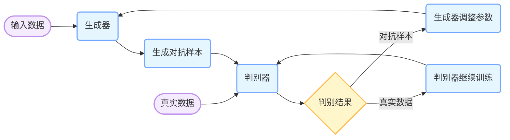

# 模型训练中的对抗学习技术在网络安全防御中的前沿应用

> 关键词：对抗学习技术、模型训练、网络安全防御、前沿应用、对抗样本

> 摘要：本文围绕模型训练中的对抗学习技术在网络安全防御中的前沿应用展开深入探讨。首先介绍了相关背景，包括研究目的、预期读者、文档结构和术语表等内容。接着阐述了对抗学习的核心概念、原理及架构，并给出相应的文本示意图和 Mermaid 流程图。详细讲解了核心算法原理及具体操作步骤，通过 Python 源代码进行示例。对相关数学模型和公式进行了详细说明，并举例阐释。结合项目实战，给出代码实际案例及详细解释。分析了对抗学习技术在网络安全防御中的实际应用场景，推荐了学习资源、开发工具框架和相关论文著作。最后总结了未来发展趋势与挑战，提供了常见问题解答和扩展阅读参考资料，旨在为网络安全领域的研究和实践提供全面而深入的指导。

## 1. 背景介绍 
### 1.1 目的和范围
在当今数字化时代，网络安全面临着日益严峻的挑战。恶意攻击手段层出不穷，传统的网络安全防御方法逐渐暴露出其局限性。模型训练中的对抗学习技术作为一种新兴的技术手段，为网络安全防御提供了新的思路和方法。本文的目的在于深入研究对抗学习技术在网络安全防御中的前沿应用，探讨其原理、算法、实际应用场景等方面的内容，为网络安全从业者和研究人员提供全面的参考和指导。本文的范围涵盖了对抗学习技术的基本概念、核心算法、数学模型，以及在网络安全防御各个领域的具体应用，同时还涉及到相关的学习资源、开发工具和研究成果等方面。

### 1.2 预期读者
本文的预期读者主要包括以下几类人群：
- 网络安全领域的专业从业者，如网络安全工程师、安全分析师等，他们可以通过本文了解对抗学习技术在网络安全防御中的实际应用，为实际工作提供新的技术手段和思路。
- 人工智能和机器学习领域的研究人员，他们可以深入研究对抗学习技术的原理和算法，探索其在网络安全领域的进一步应用和发展。
- 计算机科学专业的学生，他们可以通过本文了解前沿的技术知识，拓宽自己的知识面和视野，为未来的学习和研究打下基础。
- 对网络安全感兴趣的业余爱好者，他们可以通过本文初步了解对抗学习技术在网络安全防御中的应用，增加对网络安全的认识和理解。

### 1.3 文档结构概述
本文的文档结构如下：
- 背景介绍：介绍本文的研究目的、预期读者、文档结构和术语表等内容，为读者提供一个整体的了解。
- 核心概念与联系：阐述对抗学习的核心概念、原理及架构，给出文本示意图和 Mermaid 流程图，帮助读者理解对抗学习的基本原理。
- 核心算法原理 & 具体操作步骤：详细讲解对抗学习的核心算法原理，通过 Python 源代码进行示例，并给出具体的操作步骤。
- 数学模型和公式 & 详细讲解 & 举例说明：对对抗学习的数学模型和公式进行详细说明，并举例阐释，帮助读者深入理解其数学原理。
- 项目实战：代码实际案例和详细解释说明：结合实际项目，给出代码实际案例及详细解释，让读者了解对抗学习技术在实际应用中的具体实现。
- 实际应用场景：分析对抗学习技术在网络安全防御中的实际应用场景，包括入侵检测、恶意软件检测、数据加密等方面。
- 工具和资源推荐：推荐相关的学习资源、开发工具框架和论文著作，为读者提供进一步学习和研究的参考。
- 总结：未来发展趋势与挑战：总结对抗学习技术在网络安全防御中的未来发展趋势和面临的挑战，为读者提供前瞻性的思考。
- 附录：常见问题与解答：提供常见问题的解答，帮助读者解决在学习和实践过程中遇到的问题。
- 扩展阅读 & 参考资料：提供扩展阅读的建议和相关的参考资料，方便读者进一步深入研究。

### 1.4 术语表
#### 1.4.1 核心术语定义
- **对抗学习**：一种机器学习技术，通过让两个或多个模型相互对抗来提高模型的性能和鲁棒性。在对抗学习中，一个模型作为生成器，尝试生成与真实数据相似的数据；另一个模型作为判别器，尝试区分生成的数据和真实数据。
- **对抗样本**：通过对原始数据进行微小的、人眼难以察觉的扰动而生成的数据样本，这些样本可以欺骗机器学习模型，使其做出错误的预测。
- **生成对抗网络（GAN）**：一种常见的对抗学习模型，由生成器和判别器组成。生成器负责生成数据，判别器负责判断数据的真实性。通过不断的对抗训练，生成器和判别器的性能都会得到提高。
- **网络安全防御**：采取一系列措施来保护计算机网络免受未经授权的访问、攻击、破坏或数据泄露等威胁的过程。

#### 1.4.2 相关概念解释
- **机器学习模型的鲁棒性**：指机器学习模型在面对各种干扰和攻击时，仍能保持其性能和准确性的能力。对抗学习技术可以通过生成对抗样本来训练模型，提高模型的鲁棒性。
- **数据的真实性**：指数据是否真实反映了现实世界中的情况。在对抗学习中，判别器的任务就是判断数据的真实性，而生成器的任务是生成尽可能真实的数据。

#### 1.4.3 缩略词列表
- **GAN**：Generative Adversarial Networks（生成对抗网络）
- **ML**：Machine Learning（机器学习）
- **DL**：Deep Learning（深度学习）

## 2. 核心概念与联系 

### 核心概念原理
对抗学习的核心思想是通过两个或多个模型之间的对抗来提高模型的性能。在网络安全防御中，通常会使用生成对抗网络（GAN）的架构。GAN 由生成器（Generator）和判别器（Discriminator）组成。

生成器的任务是生成对抗样本，这些样本在外观上与正常数据相似，但实际上是经过精心设计的，旨在欺骗目标模型。例如，在图像识别领域，生成器可以生成一张看似正常的图片，但实际上包含了恶意信息，当目标模型对这张图片进行识别时，会做出错误的判断。

判别器的任务是区分生成器生成的对抗样本和真实的正常数据。判别器通过不断地学习和训练，提高自己的判别能力，以便能够准确地识别出对抗样本。

在训练过程中，生成器和判别器相互对抗。生成器试图生成更逼真的对抗样本，以欺骗判别器；而判别器则试图提高自己的判别能力，以准确地识别出对抗样本。通过这种不断的对抗训练，生成器和判别器的性能都会得到提高。

### 架构的文本示意图
```
输入数据 -> 生成器 -> 生成对抗样本
                      |
                      v
               判别器 <-> 真实数据
```
上述示意图展示了对抗学习的基本架构。输入数据经过生成器处理后生成对抗样本，判别器同时接收生成的对抗样本和真实数据，然后进行判别。判别器的输出结果会反馈给生成器，生成器根据反馈信息调整自己的参数，以生成更逼真的对抗样本。

### Mermaid 流程图

该流程图清晰地展示了对抗学习的训练过程。输入数据进入生成器生成对抗样本，判别器对对抗样本和真实数据进行判别，根据判别结果，生成器或判别器进行相应的调整或继续训练，如此循环往复，直到达到预期的训练效果。

## 3. 核心算法原理 & 具体操作步骤 

### 核心算法原理
在对抗学习中，最经典的算法是生成对抗网络（GAN）的训练算法。GAN 的训练目标是使生成器生成的样本尽可能接近真实数据，同时使判别器能够准确地区分生成样本和真实数据。

具体来说，GAN 的训练过程可以通过最小化以下目标函数来实现：

对于生成器 $G$ 和判别器 $D$，目标函数可以表示为：

$$\min_G \max_D V(D, G) = \mathbb{E}_{x \sim p_{data}(x)}[\log D(x)] + \mathbb{E}_{z \sim p_z(z)}[\log(1 - D(G(z)))]$$

其中，$p_{data}(x)$ 是真实数据的分布，$p_z(z)$ 是噪声的分布，$x$ 是真实数据，$z$ 是噪声，$G(z)$ 是生成器根据噪声 $z$ 生成的样本，$D(x)$ 是判别器对真实数据 $x$ 的判别结果，$D(G(z))$ 是判别器对生成样本 $G(z)$ 的判别结果。

生成器的目标是最小化 $V(D, G)$，即尽可能让判别器将生成的样本误判为真实数据；判别器的目标是最大化 $V(D, G)$，即尽可能准确地区分生成样本和真实数据。

### 具体操作步骤

#### 步骤 1：初始化模型参数
初始化生成器 $G$ 和判别器 $D$ 的参数 $\theta_G$ 和 $\theta_D$。

#### 步骤 2：循环训练
在每一轮训练中，执行以下操作：

##### 训练判别器
- 从真实数据分布 $p_{data}(x)$ 中采样一批真实数据 $x_1, x_2, \cdots, x_n$。
- 从噪声分布 $p_z(z)$ 中采样一批噪声 $z_1, z_2, \cdots, z_n$。
- 使用生成器 $G$ 根据噪声 $z_i$ 生成一批样本 $G(z_1), G(z_2), \cdots, G(z_n)$。
- 计算判别器的损失函数：
  $$L_D = -\frac{1}{n} \sum_{i=1}^{n} \log D(x_i) - \frac{1}{n} \sum_{i=1}^{n} \log(1 - D(G(z_i)))$$
- 使用梯度上升法更新判别器的参数 $\theta_D$：
  $$\theta_D \leftarrow \theta_D + \alpha_D \nabla_{\theta_D} L_D$$
  其中，$\alpha_D$ 是判别器的学习率。

##### 训练生成器
- 从噪声分布 $p_z(z)$ 中采样一批噪声 $z_1, z_2, \cdots, z_n$。
- 计算生成器的损失函数：
  $$L_G = -\frac{1}{n} \sum_{i=1}^{n} \log D(G(z_i))$$
- 使用梯度下降法更新生成器的参数 $\theta_G$：
  $$\theta_G \leftarrow \theta_G - \alpha_G \nabla_{\theta_G} L_G$$
  其中，$\alpha_G$ 是生成器的学习率。

#### 步骤 3：重复训练
重复步骤 2，直到达到预设的训练轮数或满足其他停止条件。

### Python 源代码示例
```python
import torch
import torch.nn as nn
import torch.optim as optim
import numpy as np

# 定义生成器
class Generator(nn.Module):
    def __init__(self, input_dim, output_dim):
        super(Generator, self).__init__()
        self.model = nn.Sequential(
            nn.Linear(input_dim, 128),
            nn.LeakyReLU(0.2),
            nn.Linear(128, output_dim),
            nn.Tanh()
        )

    def forward(self, z):
        return self.model(z)

# 定义判别器
class Discriminator(nn.Module):
    def __init__(self, input_dim):
        super(Discriminator, self).__init__()
        self.model = nn.Sequential(
            nn.Linear(input_dim, 128),
            nn.LeakyReLU(0.2),
            nn.Linear(128, 1),
            nn.Sigmoid()
        )

    def forward(self, x):
        return self.model(x)

# 超参数设置
input_dim = 100
output_dim = 28 * 28
batch_size = 32
epochs = 100
learning_rate_G = 0.0002
learning_rate_D = 0.0002

# 初始化生成器和判别器
generator = Generator(input_dim, output_dim)
discriminator = Discriminator(output_dim)

# 定义优化器和损失函数
optimizer_G = optim.Adam(generator.parameters(), lr=learning_rate_G)
optimizer_D = optim.Adam(discriminator.parameters(), lr=learning_rate_D)
criterion = nn.BCELoss()

# 模拟真实数据
real_data = torch.randn(batch_size, output_dim)

for epoch in range(epochs):
    # 训练判别器
    optimizer_D.zero_grad()

    # 真实数据
    real_labels = torch.ones(batch_size, 1)
    real_output = discriminator(real_data)
    d_real_loss = criterion(real_output, real_labels)

    # 生成数据
    z = torch.randn(batch_size, input_dim)
    fake_data = generator(z)
    fake_labels = torch.zeros(batch_size, 1)
    fake_output = discriminator(fake_data.detach())
    d_fake_loss = criterion(fake_output, fake_labels)

    # 判别器总损失
    d_loss = d_real_loss + d_fake_loss
    d_loss.backward()
    optimizer_D.step()

    # 训练生成器
    optimizer_G.zero_grad()
    fake_labels = torch.ones(batch_size, 1)
    fake_output = discriminator(fake_data)
    g_loss = criterion(fake_output, fake_labels)
    g_loss.backward()
    optimizer_G.step()

    if epoch % 10 == 0:
        print(f'Epoch [{epoch}/{epochs}], D_loss: {d_loss.item():.4f}, G_loss: {g_loss.item():.4f}')
```
上述代码实现了一个简单的生成对抗网络（GAN）的训练过程。首先定义了生成器和判别器的网络结构，然后设置了超参数，初始化了模型和优化器。在训练过程中，交替训练判别器和生成器，通过计算损失函数并使用梯度下降法更新模型参数。最后，每 10 个 epoch 打印一次判别器和生成器的损失值。

## 4. 数学模型和公式 & 详细讲解 & 举例说明 

### 数学模型和公式
在对抗学习中，生成对抗网络（GAN）的数学模型基于博弈论的思想，通过最小化和最大化目标函数来训练生成器和判别器。

如前文所述，GAN 的目标函数为：

$$\min_G \max_D V(D, G) = \mathbb{E}_{x \sim p_{data}(x)}[\log D(x)] + \mathbb{E}_{z \sim p_z(z)}[\log(1 - D(G(z)))]$$

### 详细讲解
- **$\mathbb{E}_{x \sim p_{data}(x)}[\log D(x)]$**：这一项表示判别器对真实数据的判别能力。$p_{data}(x)$ 是真实数据的分布，$D(x)$ 是判别器对真实数据 $x$ 的判别结果，取值范围在 $[0, 1]$ 之间。$\log D(x)$ 表示当判别器将真实数据正确判别的概率越大，这一项的值就越大。因此，判别器的目标是最大化这一项，即尽可能准确地识别出真实数据。
- **$\mathbb{E}_{z \sim p_z(z)}[\log(1 - D(G(z)))]$**：这一项表示判别器对生成数据的判别能力。$p_z(z)$ 是噪声的分布，$G(z)$ 是生成器根据噪声 $z$ 生成的样本，$D(G(z))$ 是判别器对生成样本 $G(z)$ 的判别结果。$\log(1 - D(G(z)))$ 表示当判别器将生成样本正确判别的概率越大，这一项的值就越大。因此，判别器的目标是最大化这一项，即尽可能准确地识别出生成样本。
- **生成器的目标**：生成器的目标是最小化 $V(D, G)$，即尽可能让判别器将生成的样本误判为真实数据。通过最小化 $\mathbb{E}_{z \sim p_z(z)}[\log(1 - D(G(z)))]$，生成器可以不断调整自己的参数，生成更逼真的样本。

### 举例说明
假设我们有一个简单的二分类问题，真实数据用 1 表示，生成数据用 0 表示。判别器的输出是一个概率值，表示输入数据为真实数据的概率。

- 真实数据：假设我们有一个真实数据样本 $x$，判别器对其的判别结果为 $D(x) = 0.9$，则 $\log D(x) = \log 0.9 \approx -0.105$。
- 生成数据：假设生成器根据噪声 $z$ 生成了一个样本 $G(z)$，判别器对其的判别结果为 $D(G(z)) = 0.1$，则 $\log(1 - D(G(z))) = \log(1 - 0.1) = \log 0.9 \approx -0.105$。

在训练过程中，判别器的目标是让 $\log D(x)$ 尽可能大，$\log(1 - D(G(z)))$ 也尽可能大；而生成器的目标是让 $\log(1 - D(G(z)))$ 尽可能小，即让判别器将生成样本误判为真实数据的概率尽可能大。

## 5. 项目实战：代码实际案例和详细解释说明 

### 5.1  开发环境搭建
在进行对抗学习技术在网络安全防御中的项目实战时，我们需要搭建相应的开发环境。以下是具体的搭建步骤：

#### 安装 Python
首先，需要安装 Python 环境。建议使用 Python 3.7 及以上版本。可以从 Python 官方网站（https://www.python.org/downloads/）下载适合自己操作系统的安装包，然后按照安装向导进行安装。

#### 安装深度学习框架
我们使用 PyTorch 作为深度学习框架，它提供了丰富的工具和函数，方便我们实现对抗学习模型。可以使用以下命令安装 PyTorch：
```bash
pip install torch torchvision
```

#### 安装其他必要的库
还需要安装一些其他必要的库，如 NumPy、Matplotlib 等。可以使用以下命令进行安装：
```bash
pip install numpy matplotlib
```

### 5.2  源代码详细实现和代码解读
以下是一个使用对抗学习技术进行入侵检测的代码示例：

```python
import torch
import torch.nn as nn
import torch.optim as optim
import numpy as np
from sklearn.model_selection import train_test_split
from sklearn.preprocessing import StandardScaler

# 加载数据集
def load_data():
    # 这里假设我们有一个包含入侵检测数据的 CSV 文件
    data = np.loadtxt('intrusion_detection_data.csv', delimiter=',')
    X = data[:, :-1]
    y = data[:, -1]
    return X, y

# 定义生成器
class Generator(nn.Module):
    def __init__(self, input_dim, output_dim):
        super(Generator, self).__init__()
        self.model = nn.Sequential(
            nn.Linear(input_dim, 128),
            nn.LeakyReLU(0.2),
            nn.Linear(128, output_dim),
            nn.Tanh()
        )

    def forward(self, z):
        return self.model(z)

# 定义判别器
class Discriminator(nn.Module):
    def __init__(self, input_dim):
        super(Discriminator, self).__init__()
        self.model = nn.Sequential(
            nn.Linear(input_dim, 128),
            nn.LeakyReLU(0.2),
            nn.Linear(128, 1),
            nn.Sigmoid()
        )

    def forward(self, x):
        return self.model(x)

# 超参数设置
input_dim = 10
output_dim = 10
batch_size = 32
epochs = 100
learning_rate_G = 0.0002
learning_rate_D = 0.0002

# 加载数据
X, y = load_data()
scaler = StandardScaler()
X = scaler.fit_transform(X)
X_train, X_test, y_train, y_test = train_test_split(X, y, test_size=0.2, random_state=42)

# 初始化生成器和判别器
generator = Generator(input_dim, output_dim)
discriminator = Discriminator(output_dim)

# 定义优化器和损失函数
optimizer_G = optim.Adam(generator.parameters(), lr=learning_rate_G)
optimizer_D = optim.Adam(discriminator.parameters(), lr=learning_rate_D)
criterion = nn.BCELoss()

# 训练过程
for epoch in range(epochs):
    num_batches = len(X_train) // batch_size
    for i in range(num_batches):
        # 训练判别器
        optimizer_D.zero_grad()

        # 真实数据
        real_data = torch.FloatTensor(X_train[i * batch_size: (i + 1) * batch_size])
        real_labels = torch.ones(batch_size, 1)
        real_output = discriminator(real_data)
        d_real_loss = criterion(real_output, real_labels)

        # 生成数据
        z = torch.randn(batch_size, input_dim)
        fake_data = generator(z)
        fake_labels = torch.zeros(batch_size, 1)
        fake_output = discriminator(fake_data.detach())
        d_fake_loss = criterion(fake_output, fake_labels)

        # 判别器总损失
        d_loss = d_real_loss + d_fake_loss
        d_loss.backward()
        optimizer_D.step()

        # 训练生成器
        optimizer_G.zero_grad()
        fake_labels = torch.ones(batch_size, 1)
        fake_output = discriminator(fake_data)
        g_loss = criterion(fake_output, fake_labels)
        g_loss.backward()
        optimizer_G.step()

    if epoch % 10 == 0:
        print(f'Epoch [{epoch}/{epochs}], D_loss: {d_loss.item():.4f}, G_loss: {g_loss.item():.4f}')
```

### 代码解读与分析
- **数据加载与预处理**：`load_data` 函数用于加载入侵检测数据集，并将其分为特征 $X$ 和标签 $y$。使用 `StandardScaler` 对数据进行标准化处理，以提高模型的训练效果。然后使用 `train_test_split` 函数将数据集分为训练集和测试集。
- **生成器和判别器的定义**：`Generator` 类和 `Discriminator` 类分别定义了生成器和判别器的网络结构。生成器将噪声向量映射到与真实数据相同维度的向量，判别器则对输入数据进行二分类，判断其是真实数据还是生成数据。
- **训练过程**：在每一轮训练中，交替训练判别器和生成器。训练判别器时，分别计算判别器对真实数据和生成数据的损失，然后将两者相加得到判别器的总损失，并使用梯度下降法更新判别器的参数。训练生成器时，计算生成器生成的数据被判别器误判为真实数据的损失，并使用梯度下降法更新生成器的参数。
- **损失函数和优化器**：使用二元交叉熵损失函数 `BCELoss` 来计算判别器和生成器的损失。使用 Adam 优化器来更新模型的参数。

通过以上代码和分析，我们可以看到如何使用对抗学习技术进行入侵检测。生成器可以生成模拟的入侵数据，帮助判别器更好地学习入侵数据的特征，从而提高入侵检测的准确性。

## 6. 实际应用场景 
对抗学习技术在网络安全防御中有许多实际应用场景，以下是一些常见的应用场景：

### 入侵检测
传统的入侵检测系统（IDS）通常基于规则或特征进行检测，对于新型的攻击方式可能无法及时发现。对抗学习技术可以生成模拟的入侵数据，用于训练入侵检测模型，提高模型对未知攻击的检测能力。通过不断地生成新的对抗样本，模型可以学习到更广泛的攻击模式，从而提高其鲁棒性和准确性。

### 恶意软件检测
恶意软件的变种不断涌现，传统的基于签名的检测方法往往难以应对。对抗学习技术可以用于生成恶意软件的变种，帮助检测模型学习到恶意软件的特征和变化规律。同时，也可以使用对抗学习来增强检测模型的鲁棒性，使其能够抵抗恶意软件的对抗攻击。

### 数据加密
在数据加密领域，对抗学习可以用于生成更安全的加密密钥。通过生成对抗网络，可以学习到数据的分布特征，并生成具有随机性和不可预测性的密钥。此外，对抗学习还可以用于检测加密数据中的异常，保护数据的安全性。

### 网络流量分析
网络流量中可能存在各种异常行为，如 DDoS 攻击、数据泄露等。对抗学习技术可以用于分析网络流量数据，生成模拟的异常流量，帮助模型学习到异常流量的特征。通过对网络流量的实时监测和分析，可以及时发现并防范潜在的安全威胁。

### 用户认证
在用户认证过程中，对抗学习可以用于生成模拟的攻击样本，测试认证系统的安全性。通过不断地对认证系统进行攻击测试，可以发现系统中存在的漏洞，并及时进行修复，提高用户认证的安全性。

## 7. 工具和资源推荐
### 7.1 学习资源推荐
#### 7.1.1 书籍推荐
- 《深度学习》（Deep Learning）：由 Ian Goodfellow、Yoshua Bengio 和 Aaron Courville 所著，是深度学习领域的经典教材，涵盖了对抗学习等多个重要主题。
- 《Python 深度学习》（Deep Learning with Python）：由 Francois Chollet 所著，介绍了如何使用 Python 和 Keras 进行深度学习实践，包括对抗学习的相关内容。
- 《生成对抗网络实战》（GANs in Action）：详细介绍了生成对抗网络的原理和应用，适合对对抗学习技术感兴趣的读者。

#### 7.1.2 在线课程
- Coursera 上的“深度学习专项课程”（Deep Learning Specialization）：由 Andrew Ng 教授授课，包括多个深度学习的主题，其中涉及到对抗学习的内容。
- edX 上的“人工智能基础”（Introduction to Artificial Intelligence）：提供了人工智能和机器学习的基础知识，也有关于对抗学习的相关介绍。
- Udemy 上的“生成对抗网络实战教程”（Hands-On Generative Adversarial Networks (GANs) with Python）：通过实际项目，详细讲解了生成对抗网络的实现和应用。

#### 7.1.3 技术博客和网站
- arXiv（https://arxiv.org/）：是一个预印本平台，提供了大量关于对抗学习和网络安全的最新研究论文。
- Medium（https://medium.com/）：有许多技术博客文章，涵盖了对抗学习技术的原理、应用和实践经验。
- Towards Data Science（https://towardsdatascience.com/）：专注于数据科学和机器学习领域，有很多关于对抗学习的优质文章。

### 7.2 开发工具框架推荐
#### 7.2.1 IDE和编辑器
- PyCharm：是一款专业的 Python 集成开发环境，提供了丰富的代码编辑、调试和版本控制等功能，适合开发对抗学习相关的项目。
- Jupyter Notebook：是一个交互式的开发环境，支持 Python 代码的实时运行和可视化展示，方便进行模型的训练和调试。
- Visual Studio Code：是一款轻量级的代码编辑器，支持多种编程语言和插件扩展，可用于开发和调试对抗学习代码。

#### 7.2.2 调试和性能分析工具
- TensorBoard：是 TensorFlow 提供的可视化工具，可以用于可视化模型的训练过程、损失函数变化等信息，帮助调试和优化模型。
- PyTorch Profiler：是 PyTorch 提供的性能分析工具，可以分析模型的运行时间、内存使用等情况，帮助优化模型的性能。
- NVIDIA Nsight Systems：是 NVIDIA 提供的性能分析工具，可用于分析 GPU 加速的深度学习模型的性能。

#### 7.2.3 相关框架和库
- PyTorch：是一个开源的深度学习框架，提供了丰富的工具和函数，方便实现对抗学习模型。
- TensorFlow：是另一个广泛使用的深度学习框架，也支持对抗学习的实现。
- Scikit-learn：是一个用于机器学习的 Python 库，提供了许多常用的机器学习算法和工具，可用于数据预处理和模型评估。

### 7.3 相关论文著作推荐
#### 7.3.1 经典论文
- “Generative Adversarial Nets”：由 Ian Goodfellow 等人发表，是生成对抗网络的开创性论文，介绍了 GAN 的基本原理和训练算法。
- “Explaining and Harnessing Adversarial Examples”：探讨了对抗样本的生成原理和应用，为对抗学习技术的发展奠定了基础。
- “Adversarial Machine Learning at Scale”：研究了大规模对抗学习的方法和应用，提出了一些改进的算法和技术。

#### 7.3.2 最新研究成果
- 在 arXiv 等预印本平台上，可以找到许多关于对抗学习在网络安全防御中的最新研究成果。例如，一些研究提出了新的对抗学习算法，用于提高入侵检测和恶意软件检测的准确性；另一些研究则探索了对抗学习在数据加密和用户认证中的应用。

#### 7.3.3 应用案例分析
- 一些学术会议和期刊上发表了许多关于对抗学习在网络安全防御中的应用案例分析。例如，在 ACM SIGSAC 等安全领域的会议上，会有相关的论文介绍如何使用对抗学习技术解决实际的网络安全问题。通过阅读这些应用案例分析，可以了解对抗学习技术在实际应用中的效果和挑战。

## 8. 总结：未来发展趋势与挑战
### 未来发展趋势
- **多模态对抗学习**：随着网络安全数据的多样性不断增加，未来的对抗学习技术将向多模态方向发展。例如，结合图像、文本、音频等多种模态的数据进行对抗学习，以提高网络安全防御的准确性和全面性。
- **自适应对抗学习**：网络攻击的方式和手段不断变化，未来的对抗学习技术需要具备自适应能力。即能够根据实时的攻击情况自动调整模型的参数和策略，以更好地应对未知的攻击。
- **与其他技术的融合**：对抗学习技术将与区块链、物联网、人工智能等其他技术进行深度融合。例如，结合区块链的去中心化和不可篡改特性，提高数据的安全性；结合物联网的感知能力，实现更全面的网络安全监测。

### 挑战
- **对抗样本的生成效率**：目前，生成对抗样本的效率还比较低，尤其是在处理大规模数据时。未来需要研究更高效的对抗样本生成算法，以提高对抗学习的训练效率。
- **模型的可解释性**：对抗学习模型通常是黑盒模型，其决策过程难以解释。在网络安全防御中，模型的可解释性非常重要，因为安全人员需要了解模型做出决策的依据。因此，如何提高对抗学习模型的可解释性是一个亟待解决的问题。
- **对抗攻击的防御能力**：虽然对抗学习技术可以用于生成对抗样本进行攻击，但同时也需要提高模型对对抗攻击的防御能力。目前，许多模型仍然容易受到对抗攻击的影响，如何增强模型的鲁棒性是未来研究的重点之一。

## 9. 附录：常见问题与解答
### 问题 1：对抗学习技术与传统机器学习技术有什么区别？
解答：传统机器学习技术主要是通过大量的标注数据进行模型训练，以学习数据的特征和模式。而对抗学习技术通过让两个或多个模型相互对抗，不断提高模型的性能和鲁棒性。对抗学习可以生成对抗样本，用于训练模型，使其能够更好地应对未知的攻击和干扰。

### 问题 2：对抗学习技术在网络安全防御中的应用有哪些局限性？
解答：对抗学习技术在网络安全防御中的应用存在一些局限性。例如，对抗样本的生成需要大量的计算资源和时间；对抗学习模型的可解释性较差，安全人员难以理解模型的决策过程；此外，对抗学习技术可能会被攻击者利用，生成更具攻击性的对抗样本。

### 问题 3：如何评估对抗学习模型在网络安全防御中的性能？
解答：可以从多个方面评估对抗学习模型在网络安全防御中的性能。例如，使用准确率、召回率、F1 值等指标来评估模型的分类性能；使用鲁棒性指标来评估模型对对抗攻击的抵抗能力；还可以通过实际的攻击测试来评估模型的防御效果。

### 问题 4：对抗学习技术是否可以完全替代传统的网络安全防御方法？
解答：对抗学习技术虽然具有很多优势，但不能完全替代传统的网络安全防御方法。传统的网络安全防御方法，如防火墙、入侵检测系统等，仍然是网络安全防御的重要组成部分。对抗学习技术可以作为一种补充手段，与传统方法相结合，提高网络安全防御的整体性能。

## 10. 扩展阅读 & 参考资料
### 扩展阅读
- 《人工智能安全》：深入探讨了人工智能技术在安全领域的应用和挑战，包括对抗学习技术在网络安全中的应用。
- 《网络安全前沿技术》：介绍了网络安全领域的最新技术和发展趋势，其中包含对抗学习技术的相关内容。
- 《机器学习实战》：通过实际项目，详细介绍了机器学习算法的实现和应用，有助于进一步理解对抗学习技术的原理和实践。

### 参考资料
- Goodfellow, I. J., Bengio, Y., & Courville, A. (2016). Deep Learning. MIT Press.
- Chollet, F. (2017). Deep Learning with Python. Manning Publications.
- Gulrajani, I., Ahmed, F., Arjovsky, M., Dumoulin, V., & Courville, A. C. (2017). Improved Training of Wasserstein GANs. arXiv preprint arXiv:1704.00028.
- Madry, A., Makelov, A., Schmidt, L., Tsipras, D., & Vladu, A. (2017). Towards Deep Learning Models Resistant to Adversarial Attacks. arXiv preprint arXiv:1706.06083.

作者：AI天才研究院/AI Genius Institute & 禅与计算机程序设计艺术 /Zen And The Art of Computer Programming