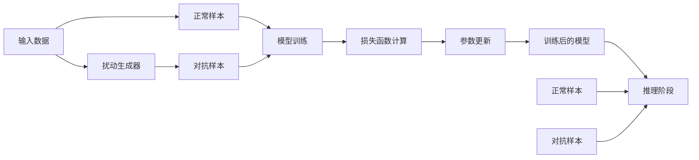

# 模型训练中的对抗训练策略在提高推理鲁棒性方面的创新

> 关键词：模型训练、对抗训练策略、推理鲁棒性、创新方法、对抗样本

> 摘要：本文聚焦于模型训练中的对抗训练策略在提高推理鲁棒性方面的创新。首先介绍了对抗训练及推理鲁棒性的背景知识，深入剖析了核心概念及其联系，详细阐述了相关算法原理与操作步骤，并结合数学模型进行理论支撑。通过项目实战展示了对抗训练策略在实际中的应用，探讨了其在不同场景下的实际用途。同时推荐了相关的学习资源、开发工具和论文著作。最后对未来发展趋势与挑战进行总结，旨在为相关领域的研究和实践提供全面且深入的参考，助力提升模型的推理鲁棒性。

## 1. 背景介绍 
### 1.1 目的和范围
在当今人工智能和机器学习领域，模型的性能评估不仅仅局限于其在正常数据上的准确率，推理鲁棒性也日益成为关键指标。推理鲁棒性指的是模型在面对各种干扰、噪声或对抗样本时，仍能保持稳定且准确的推理能力。然而，许多现有的模型在这方面表现不佳，容易受到对抗攻击的影响。本研究的目的在于深入探讨模型训练中的对抗训练策略，通过创新的方法来提高模型的推理鲁棒性。研究范围涵盖了对抗训练的基本原理、常见算法、数学模型，以及在实际项目中的应用和未来发展趋势。

### 1.2 预期读者
本文预期读者包括人工智能、机器学习领域的研究人员、工程师、学生，以及对模型鲁棒性和对抗训练感兴趣的技术爱好者。对于正在从事相关研究或开发工作的专业人士，本文将提供深入的技术分析和创新思路；对于初学者，将有助于他们了解对抗训练和推理鲁棒性的基本概念和重要性。

### 1.3 文档结构概述
本文将按照以下结构展开：首先介绍相关背景知识，包括目的、预期读者和术语表；接着阐述对抗训练和推理鲁棒性的核心概念及其联系；详细讲解核心算法原理和具体操作步骤，并结合Python代码进行说明；通过数学模型和公式进一步深入分析；通过项目实战展示对抗训练策略的实际应用；探讨其在不同场景下的实际用途；推荐相关的学习资源、开发工具和论文著作；最后对未来发展趋势与挑战进行总结，并提供常见问题解答和扩展阅读参考资料。

### 1.4 术语表
#### 1.4.1 核心术语定义
- **对抗训练（Adversarial Training）**：是一种在模型训练过程中引入对抗样本的训练方法，通过让模型学习如何应对这些对抗样本，从而提高模型的鲁棒性。
- **推理鲁棒性（Inference Robustness）**：指模型在推理阶段，面对各种干扰、噪声或对抗样本时，仍能保持稳定且准确的推理结果的能力。
- **对抗样本（Adversarial Examples）**：是指在原始样本的基础上，经过精心设计的微小扰动，使得模型对其产生错误分类的样本。

#### 1.4.2 相关概念解释
- **梯度上升（Gradient Ascent）**：是一种优化算法，用于寻找函数的最大值。在对抗训练中，常被用于生成对抗样本，通过不断增加损失函数的值来找到能够误导模型的扰动。
- **梯度下降（Gradient Descent）**：是一种优化算法，用于寻找函数的最小值。在模型训练中，通过不断减小损失函数的值来更新模型的参数，以提高模型的性能。

#### 1.4.3 缩略词列表
- **FGSM（Fast Gradient Sign Method）**：快速梯度符号法，是一种简单而有效的生成对抗样本的方法。
- **PGD（Projected Gradient Descent）**：投影梯度下降法，是一种更强大的生成对抗样本的方法，在FGSM的基础上进行了改进。

## 2. 核心概念与联系 

### 2.1 对抗训练的原理
对抗训练的核心思想是在模型训练过程中引入对抗样本，让模型学习如何应对这些具有挑战性的输入。传统的模型训练通常只关注正常数据上的性能，而忽略了模型在面对对抗样本时的脆弱性。对抗训练通过在训练数据中加入对抗样本，迫使模型学习到更具鲁棒性的特征表示，从而提高模型的推理鲁棒性。

### 2.2 推理鲁棒性的重要性
在实际应用中，模型往往会面临各种复杂的环境和数据。例如，在自动驾驶领域，传感器可能会受到噪声的干扰；在图像识别领域，图像可能会被恶意篡改。如果模型的推理鲁棒性不足，就可能会导致严重的后果。因此，提高模型的推理鲁棒性对于保障系统的安全性和可靠性至关重要。

### 2.3 对抗训练与推理鲁棒性的联系
对抗训练是提高推理鲁棒性的一种有效方法。通过在训练过程中引入对抗样本，模型可以学习到如何识别和抵抗这些干扰，从而在推理阶段能够更好地应对各种复杂情况。可以说，对抗训练是提高推理鲁棒性的一种主动防御策略。

### 2.4 核心概念原理和架构的文本示意图
```plaintext
输入数据
    |
    v
正常样本 ------+
               |
对抗样本 ------+---> 模型训练
               |
扰动生成器 ----+
    |
    v
损失函数计算
    |
    v
参数更新
    |
    v
训练后的模型 -----> 推理阶段（面对正常样本和对抗样本）
```

### 2.5 Mermaid 流程图


## 3. 核心算法原理 & 具体操作步骤 

### 3.1 FGSM（Fast Gradient Sign Method）算法原理
FGSM是一种简单而有效的生成对抗样本的方法。其基本思想是利用损失函数相对于输入样本的梯度信息，在梯度的方向上添加一个微小的扰动，从而得到对抗样本。具体步骤如下：
1. 计算损失函数 $L(\theta, x, y)$ 相对于输入样本 $x$ 的梯度 $\nabla_x L(\theta, x, y)$，其中 $\theta$ 是模型的参数，$y$ 是真实标签。
2. 计算扰动 $\delta = \epsilon \cdot \text{sign}(\nabla_x L(\theta, x, y))$，其中 $\epsilon$ 是一个控制扰动大小的超参数。
3. 生成对抗样本 $x' = x + \delta$。

### 3.2 FGSM 算法的 Python 实现
```python
import torch
import torch.nn as nn
import torch.optim as optim

# 定义一个简单的模型
class SimpleModel(nn.Module):
    def __init__(self):
        super(SimpleModel, self).__init__()
        self.fc1 = nn.Linear(784, 128)
        self.fc2 = nn.Linear(128, 10)

    def forward(self, x):
        x = x.view(-1, 784)
        x = torch.relu(self.fc1(x))
        x = self.fc2(x)
        return x

# 初始化模型
model = SimpleModel()
criterion = nn.CrossEntropyLoss()
optimizer = optim.SGD(model.parameters(), lr=0.01)

# FGSM 攻击函数
def fgsm_attack(image, epsilon, data_grad):
    # 收集数据梯度的符号
    sign_data_grad = data_grad.sign()
    # 通过调整输入图像的每个像素来创建扰动图像
    perturbed_image = image + epsilon * sign_data_grad
    # 使值保持在 [0, 1] 范围内
    perturbed_image = torch.clamp(perturbed_image, 0, 1)
    return perturbed_image

# 训练模型并进行对抗训练
def train_model(model, train_loader, epsilon, num_epochs=5):
    for epoch in range(num_epochs):
        for data, target in train_loader:
            data.requires_grad = True
            output = model(data)
            loss = criterion(output, target)
            optimizer.zero_grad()
            loss.backward()
            data_grad = data.grad.data
            perturbed_data = fgsm_attack(data, epsilon, data_grad)
            perturbed_output = model(perturbed_data)
            perturbed_loss = criterion(perturbed_output, target)
            total_loss = loss + perturbed_loss
            total_loss.backward()
            optimizer.step()
        print(f'Epoch {epoch + 1}/{num_epochs}, Loss: {total_loss.item()}')
```

### 3.3 PGD（Projected Gradient Descent）算法原理
PGD 是一种更强大的生成对抗样本的方法，它在 FGSM 的基础上进行了改进。PGD 通过多次迭代更新扰动，使得生成的对抗样本更具挑战性。具体步骤如下：
1. 初始化一个随机的扰动 $\delta_0$，并将其限制在一定的范围内。
2. 对于 $t = 1, 2, \cdots, T$（$T$ 是迭代次数）：
    - 计算损失函数 $L(\theta, x + \delta_t, y)$ 相对于 $\delta_t$ 的梯度 $\nabla_{\delta_t} L(\theta, x + \delta_t, y)$。
    - 更新扰动 $\delta_{t+1} = \text{clip}(\delta_t + \alpha \cdot \text{sign}(\nabla_{\delta_t} L(\theta, x + \delta_t, y)), -\epsilon, \epsilon)$，其中 $\alpha$ 是步长，$\epsilon$ 是扰动的最大限制。
3. 生成对抗样本 $x' = x + \delta_T$。

### 3.4 PGD 算法的 Python 实现
```python
# PGD 攻击函数
def pgd_attack(model, image, target, epsilon, alpha, num_iter):
    perturbed_image = image.clone()
    for _ in range(num_iter):
        perturbed_image.requires_grad = True
        output = model(perturbed_image)
        loss = criterion(output, target)
        optimizer.zero_grad()
        loss.backward()
        data_grad = perturbed_image.grad.data
        perturbed_image = perturbed_image + alpha * data_grad.sign()
        eta = torch.clamp(perturbed_image - image, min=-epsilon, max=epsilon)
        perturbed_image = torch.clamp(image + eta, 0, 1).detach()
    return perturbed_image

# 使用 PGD 进行对抗训练
def train_model_pgd(model, train_loader, epsilon, alpha, num_iter, num_epochs=5):
    for epoch in range(num_epochs):
        for data, target in train_loader:
            perturbed_data = pgd_attack(model, data, target, epsilon, alpha, num_iter)
            output = model(perturbed_data)
            loss = criterion(output, target)
            optimizer.zero_grad()
            loss.backward()
            optimizer.step()
        print(f'Epoch {epoch + 1}/{num_epochs}, Loss: {loss.item()}')
```

## 4. 数学模型和公式 & 详细讲解 & 举例说明 

### 4.1 损失函数的数学模型
在对抗训练中，常用的损失函数是交叉熵损失函数，其定义如下：
$$
L(\theta, x, y) = -\sum_{i=1}^{C} y_i \log(p_i)
$$
其中，$\theta$ 是模型的参数，$x$ 是输入样本，$y$ 是真实标签，$C$ 是类别数，$p_i$ 是模型预测的第 $i$ 个类别的概率。

### 4.2 FGSM 算法的数学公式
FGSM 算法的核心公式为：
$$
\delta = \epsilon \cdot \text{sign}(\nabla_x L(\theta, x, y))
$$
$$
x' = x + \delta
$$
其中，$\epsilon$ 是扰动的大小，$\nabla_x L(\theta, x, y)$ 是损失函数相对于输入样本 $x$ 的梯度，$\text{sign}$ 是符号函数。

### 4.3 FGSM 算法举例说明
假设我们有一个简单的二分类模型，输入样本 $x = [0.5, 0.3]$，真实标签 $y = [1, 0]$，模型的参数 $\theta$ 已知。首先计算损失函数 $L(\theta, x, y)$ 相对于 $x$ 的梯度 $\nabla_x L(\theta, x, y) = [0.2, -0.1]$。设 $\epsilon = 0.1$，则扰动 $\delta = \epsilon \cdot \text{sign}(\nabla_x L(\theta, x, y)) = [0.1, -0.1]$。生成的对抗样本 $x' = x + \delta = [0.6, 0.2]$。

### 4.4 PGD 算法的数学公式
PGD 算法的核心公式为：
$$
\delta_{t+1} = \text{clip}(\delta_t + \alpha \cdot \text{sign}(\nabla_{\delta_t} L(\theta, x + \delta_t, y)), -\epsilon, \epsilon)
$$
$$
x' = x + \delta_T
$$
其中，$\alpha$ 是步长，$T$ 是迭代次数，$\text{clip}$ 是裁剪函数，用于将扰动限制在 $[-\epsilon, \epsilon]$ 范围内。

### 4.5 PGD 算法举例说明
假设我们有一个输入样本 $x = [0.5, 0.3]$，真实标签 $y = [1, 0]$，模型的参数 $\theta$ 已知。初始化 $\delta_0 = [0, 0]$，$\epsilon = 0.1$，$\alpha = 0.01$，$T = 5$。在每次迭代中，计算损失函数 $L(\theta, x + \delta_t, y)$ 相对于 $\delta_t$ 的梯度 $\nabla_{\delta_t} L(\theta, x + \delta_t, y)$，并更新 $\delta_{t+1}$。经过 5 次迭代后，得到最终的扰动 $\delta_T$，生成对抗样本 $x' = x + \delta_T$。

## 5. 项目实战：代码实际案例和详细解释说明 

### 5.1  开发环境搭建
#### 5.1.1 安装 Python
首先，确保你已经安装了 Python 3.x 版本。可以从 Python 官方网站（https://www.python.org/downloads/） 下载并安装。

#### 5.1.2 安装 PyTorch
使用以下命令安装 PyTorch：
```sh
pip install torch torchvision
```

#### 5.1.3 安装其他依赖库
```sh
pip install numpy matplotlib
```

### 5.2  源代码详细实现和代码解读
#### 5.2.1 加载数据集
```python
import torch
import torchvision
import torchvision.transforms as transforms

# 定义数据预处理
transform = transforms.Compose([
    transforms.ToTensor(),
    transforms.Normalize((0.5,), (0.5,))
])

# 加载训练集
trainset = torchvision.datasets.MNIST(root='./data', train=True,
                                      download=True, transform=transform)
trainloader = torch.utils.data.DataLoader(trainset, batch_size=64,
                                          shuffle=True)

# 加载测试集
testset = torchvision.datasets.MNIST(root='./data', train=False,
                                     download=True, transform=transform)
testloader = torch.utils.data.DataLoader(testset, batch_size=64,
                                         shuffle=False)
```
这段代码使用 `torchvision` 库加载 MNIST 数据集，并进行数据预处理。将图像数据转换为张量，并进行归一化处理。

#### 5.2.2 定义模型
```python
import torch.nn as nn
import torch.nn.functional as F

class Net(nn.Module):
    def __init__(self):
        super(Net, self).__init__()
        self.conv1 = nn.Conv2d(1, 6, 5)
        self.pool = nn.MaxPool2d(2, 2)
        self.conv2 = nn.Conv2d(6, 16, 5)
        self.fc1 = nn.Linear(16 * 4 * 4, 120)
        self.fc2 = nn.Linear(120, 84)
        self.fc3 = nn.Linear(84, 10)

    def forward(self, x):
        x = self.pool(F.relu(self.conv1(x)))
        x = self.pool(F.relu(self.conv2(x)))
        x = x.view(-1, 16 * 4 * 4)
        x = F.relu(self.fc1(x))
        x = F.relu(self.fc2(x))
        x = self.fc3(x)
        return x

net = Net()
```
这段代码定义了一个简单的卷积神经网络模型，包含两个卷积层和三个全连接层。

#### 5.2.3 定义损失函数和优化器
```python
import torch.optim as optim

criterion = nn.CrossEntropyLoss()
optimizer = optim.SGD(net.parameters(), lr=0.001, momentum=0.9)
```
使用交叉熵损失函数和随机梯度下降优化器。

####