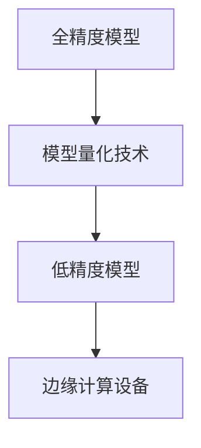

# 模型量化技术在边缘计算设备中的优化策略

> 关键词：模型量化技术、边缘计算设备、优化策略、深度学习模型、计算资源

> 摘要：本文围绕模型量化技术在边缘计算设备中的优化策略展开深入探讨。首先介绍了相关背景，包括目的范围、预期读者等内容。接着阐述了模型量化和边缘计算的核心概念及联系，详细讲解了核心算法原理并给出Python代码示例，通过数学模型和公式进行理论支持。在项目实战部分，给出代码实际案例及详细解释。同时，分析了模型量化技术在边缘计算设备中的实际应用场景，推荐了相关学习资源、开发工具框架和论文著作。最后总结了未来发展趋势与挑战，并对常见问题进行了解答，为在边缘计算设备上有效应用模型量化技术提供了全面的指导。

## 1. 背景介绍 
### 1.1 目的和范围
在当今数字化时代，边缘计算设备如智能手机、物联网传感器、智能摄像头等得到了广泛应用。这些设备通常具有有限的计算资源、存储容量和能源供应。然而，深度学习模型在图像识别、语音识别、自然语言处理等领域取得了巨大成功，但这些模型往往规模庞大、计算复杂，难以直接部署在边缘计算设备上。模型量化技术作为一种有效的优化手段，可以在不显著损失模型性能的前提下，减少模型的存储需求和计算量，提高模型在边缘计算设备上的运行效率。

本文的目的是深入探讨模型量化技术在边缘计算设备中的优化策略，包括核心概念、算法原理、数学模型、实际应用案例等方面。范围涵盖了常见的模型量化方法、适用于边缘计算设备的优化策略以及相关的工具和资源。

### 1.2 预期读者
本文预期读者包括从事深度学习、边缘计算领域的研究人员、工程师，以及对模型优化和边缘计算应用感兴趣的技术爱好者。对于希望将深度学习模型部署到边缘计算设备上的开发者，本文提供了详细的技术指导和实践经验。

### 1.3 文档结构概述
本文共分为十个部分。第一部分为背景介绍，阐述了文章的目的、范围、预期读者和文档结构。第二部分介绍模型量化和边缘计算的核心概念及联系，并给出相应的示意图和流程图。第三部分详细讲解核心算法原理，并使用Python代码进行具体实现。第四部分介绍数学模型和公式，并通过举例说明其应用。第五部分为项目实战，包括开发环境搭建、源代码实现和代码解读。第六部分分析模型量化技术在边缘计算设备中的实际应用场景。第七部分推荐相关的学习资源、开发工具框架和论文著作。第八部分总结未来发展趋势与挑战。第九部分为附录，解答常见问题。第十部分提供扩展阅读和参考资料。

### 1.4 术语表
#### 1.4.1 核心术语定义
- **模型量化技术**：将深度学习模型中的浮点参数和计算转换为低精度（如8位整数、4位整数等）表示的技术，以减少模型的存储需求和计算量。
- **边缘计算设备**：指靠近数据源或用户端的计算设备，如智能手机、物联网传感器、智能摄像头等，具有有限的计算资源和能源供应。
- **深度学习模型**：基于神经网络的机器学习模型，通过大量的数据进行训练，以实现图像识别、语音识别、自然语言处理等任务。
- **量化精度**：指量化后数据的表示精度，常见的量化精度有8位、4位、2位等。
- **量化误差**：指量化前后模型参数或计算结果的差异，量化误差过大会导致模型性能下降。

#### 1.4.2 相关概念解释
- **全精度模型**：使用浮点数据类型（如32位浮点数）表示模型参数和进行计算的模型。
- **低精度模型**：使用低精度数据类型（如8位整数、4位整数等）表示模型参数和进行计算的模型。
- **量化策略**：指选择合适的量化方法和量化精度的策略，以在减少计算量和存储需求的同时，尽量保持模型的性能。
- **硬件加速**：指利用特定的硬件设备（如GPU、FPGA等）来加速模型的计算过程。

#### 1.4.3 缩略词列表
- **DNN**：Deep Neural Network，深度神经网络
- **CNN**：Convolutional Neural Network，卷积神经网络
- **RNN**：Recurrent Neural Network，循环神经网络
- **GPU**：Graphics Processing Unit，图形处理器
- **FPGA**：Field-Programmable Gate Array，现场可编程门阵列

## 2. 核心概念与联系 

### 模型量化技术原理
模型量化技术的核心思想是将深度学习模型中的浮点参数和计算转换为低精度表示。在全精度模型中，参数通常使用32位浮点数表示，而量化后的模型可以使用8位整数、4位整数甚至更低的精度来表示参数。这样可以显著减少模型的存储需求和计算量。

例如，一个全精度的卷积层计算可以表示为：
$$
y = Wx + b
$$
其中，$W$ 是卷积核的权重矩阵，$x$ 是输入特征图，$b$ 是偏置项，$y$ 是输出特征图。在量化过程中，我们将 $W$、$x$ 和 $b$ 分别量化为低精度表示 $W_q$、$x_q$ 和 $b_q$，并在低精度下进行计算：
$$
y_q = W_qx_q + b_q
$$
最后，将量化后的输出 $y_q$ 反量化为浮点输出 $y$。

### 边缘计算设备特点
边缘计算设备通常具有以下特点：
- **计算资源有限**：边缘计算设备的处理器性能和内存容量相对较低，无法支持大规模的深度学习模型计算。
- **能源供应有限**：许多边缘计算设备依靠电池供电，因此需要尽可能减少能耗。
- **实时性要求高**：在一些应用场景中，如智能安防、自动驾驶等，需要边缘计算设备实时处理数据并给出结果。

### 模型量化技术与边缘计算设备的联系
模型量化技术可以有效解决边缘计算设备面临的计算资源和能源供应问题。通过将模型量化为低精度表示，可以减少模型的存储需求和计算量，从而降低边缘计算设备的计算负担和能耗。同时，量化后的模型可以在边缘计算设备上更快地运行，满足实时性要求。

### 文本示意图
```plaintext
全精度模型（32位浮点数）
       |
       | 模型量化技术
       v
低精度模型（8位整数等）
       |
       | 部署到
       v
边缘计算设备
```

### Mermaid 流程图


## 3. 核心算法原理 & 具体操作步骤 

### 核心算法原理
常见的模型量化方法有线性量化和非线性量化。这里主要介绍线性量化，其基本思想是将浮点数据映射到一个有限的整数范围内。

假设我们要将浮点数据 $x$ 量化为 $n$ 位整数 $x_q$，可以使用以下公式：
$$
x_q = \text{round}\left(\frac{x}{S} + Z\right)
$$
其中，$S$ 是缩放因子，$Z$ 是零点偏移，$\text{round}$ 是四舍五入函数。

反量化公式为：
$$
x = S(x_q - Z)
$$

### 具体操作步骤
1. **确定量化参数**：在量化之前，需要确定缩放因子 $S$ 和零点偏移 $Z$。通常可以通过统计数据的最大值 $x_{\text{max}}$ 和最小值 $x_{\text{min}}$ 来计算：
$$
S = \frac{x_{\text{max}} - x_{\text{min}}}{2^n - 1}
$$
$$
Z = \text{round}\left(-\frac{x_{\text{min}}}{S}\right)
$$
其中，$n$ 是量化位数。

2. **量化数据**：使用量化公式将浮点数据量化为整数数据。

3. **在低精度下进行计算**：在量化后的模型中，使用整数数据进行计算。

4. **反量化结果**：将计算结果反量化为浮点数据。

### Python 代码实现
```python
import numpy as np

def calculate_quantization_params(x, n_bits):
    """
    计算量化参数
    :param x: 浮点数据
    :param n_bits: 量化位数
    :return: 缩放因子和零点偏移
    """
    x_min = np.min(x)
    x_max = np.max(x)
    scale = (x_max - x_min) / (2**n_bits - 1)
    zero_point = np.round(-x_min / scale)
    return scale, zero_point

def quantize(x, scale, zero_point, n_bits):
    """
    量化数据
    :param x: 浮点数据
    :param scale: 缩放因子
    :param zero_point: 零点偏移
    :param n_bits: 量化位数
    :return: 量化后的整数数据
    """
    x_q = np.round(x / scale + zero_point)
    x_q = np.clip(x_q, 0, 2**n_bits - 1).astype(np.int32)
    return x_q

def dequantize(x_q, scale, zero_point):
    """
    反量化数据
    :param x_q: 量化后的整数数据
    :param scale: 缩放因子
    :param zero_point: 零点偏移
    :return: 反量化后的浮点数据
    """
    x = scale * (x_q - zero_point)
    return x

# 示例数据
x = np.random.randn(100)

# 量化参数
n_bits = 8
scale, zero_point = calculate_quantization_params(x, n_bits)

# 量化数据
x_q = quantize(x, scale, zero_point, n_bits)

# 反量化数据
x_dequantized = dequantize(x_q, scale, zero_point)

# 计算量化误差
quantization_error = np.mean(np.abs(x - x_dequantized))
print(f"量化误差: {quantization_error}")
```

## 4. 数学模型和公式 & 详细讲解 & 举例说明 

### 线性量化公式
如前文所述，线性量化的公式为：
$$
x_q = \text{round}\left(\frac{x}{S} + Z\right)
$$
$$
x = S(x_q - Z)
$$
其中，$x$ 是浮点数据，$x_q$ 是量化后的整数数据，$S$ 是缩放因子，$Z$ 是零点偏移。

### 缩放因子和零点偏移的计算
缩放因子 $S$ 和零点偏移 $Z$ 可以通过数据的最大值 $x_{\text{max}}$ 和最小值 $x_{\text{min}}$ 来计算：
$$
S = \frac{x_{\text{max}} - x_{\text{min}}}{2^n - 1}
$$
$$
Z = \text{round}\left(-\frac{x_{\text{min}}}{S}\right)
$$
其中，$n$ 是量化位数。

### 量化误差分析
量化误差是指量化前后数据的差异。可以使用均方误差（MSE）或平均绝对误差（MAE）来衡量量化误差。

均方误差公式为：
$$
\text{MSE} = \frac{1}{N}\sum_{i=1}^{N}(x_i - x_{i,\text{dequantized}})^2
$$
平均绝对误差公式为：
$$
\text{MAE} = \frac{1}{N}\sum_{i=1}^{N}|x_i - x_{i,\text{dequantized}}|
$$
其中，$x_i$ 是原始浮点数据，$x_{i,\text{dequantized}}$ 是反量化后的浮点数据，$N$ 是数据的数量。

### 举例说明
假设我们有一组浮点数据 $x = [1.2, 2.3, 3.4, 4.5, 5.6]$，要将其量化为 8 位整数。

1. **计算量化参数**：
    - $x_{\text{min}} = 1.2$，$x_{\text{max}} = 5.6$
    - $S = \frac{5.6 - 1.2}{2^8 - 1} \approx 0.017$
    - $Z = \text{round}\left(-\frac{1.2}{0.017}\right) \approx -71$

2. **量化数据**：
    - 对于 $x_1 = 1.2$，$x_{q1} = \text{round}\left(\frac{1.2}{0.017} - 71\right) \approx 0$
    - 对于 $x_2 = 2.3$，$x_{q2} = \text{round}\left(\frac{2.3}{0.017} - 71\right) \approx 64$
    - 以此类推，得到量化后的数据 $x_q = [0, 64, 128, 192, 255]$

3. **反量化数据**：
    - 对于 $x_{q1} = 0$，$x_{1,\text{dequantized}} = 0.017\times(0 + 71) \approx 1.21$
    - 对于 $x_{q2} = 64$，$x_{2,\text{dequantized}} = 0.017\times(64 + 71) \approx 2.29$
    - 以此类推，得到反量化后的数据 $x_{\text{dequantized}} = [1.21, 2.29, 3.39, 4.49, 5.6]$

4. **计算量化误差**：
    - $\text{MAE} = \frac{1}{5}(|1.2 - 1.21| + |2.3 - 2.29| + |3.4 - 3.39| + |4.5 - 4.49| + |5.6 - 5.6|) = 0.004$

## 5. 项目实战：代码实际案例和详细解释说明 

### 5.1  开发环境搭建
- **操作系统**：建议使用Ubuntu 18.04或更高版本。
- **Python版本**：Python 3.6或更高版本。
- **深度学习框架**：使用PyTorch进行模型训练和量化。可以使用以下命令安装PyTorch：
```bash
pip install torch torchvision
```
- **其他依赖库**：安装NumPy、Matplotlib等常用库：
```bash
pip install numpy matplotlib
```

### 5.2  源代码详细实现和代码解读
以下是一个使用PyTorch进行模型量化的示例代码：
```python
import torch
import torch.nn as nn
import torch.optim as optim
import torchvision
import torchvision.transforms as transforms
from torch.quantization import QuantStub, DeQuantStub

# 定义一个简单的卷积神经网络
class SimpleCNN(nn.Module):
    def __init__(self):
        super(SimpleCNN, self).__init__()
        self.quant = QuantStub()
        self.conv1 = nn.Conv2d(3, 6, 5)
        self.pool = nn.MaxPool2d(2, 2)
        self.conv2 = nn.Conv2d(6, 16, 5)
        self.fc1 = nn.Linear(16 * 5 * 5, 120)
        self.fc2 = nn.Linear(120, 84)
        self.fc3 = nn.Linear(84, 10)
        self.dequant = DeQuantStub()

    def forward(self, x):
        x = self.quant(x)
        x = self.pool(torch.relu(self.conv1(x)))
        x = self.pool(torch.relu(self.conv2(x)))
        x = x.view(-1, 16 * 5 * 5)
        x = torch.relu(self.fc1(x))
        x = torch.relu(self.fc2(x))
        x = self.fc3(x)
        x = self.dequant(x)
        return x

# 数据预处理
transform = transforms.Compose(
    [transforms.ToTensor(),
     transforms.Normalize((0.5, 0.5, 0.5), (0.5, 0.5, 0.5))])

# 加载数据集
trainset = torchvision.datasets.CIFAR10(root='./data', train=True,
                                        download=True, transform=transform)
trainloader = torch.utils.data.DataLoader(trainset, batch_size=4,
                                          shuffle=True, num_workers=2)

testset = torchvision.datasets.CIFAR10(root='./data', train=False,
                                       download=True, transform=transform)
testloader = torch.utils.data.DataLoader(testset, batch_size=4,
                                         shuffle=False, num_workers=2)

# 初始化模型
net = SimpleCNN()

# 定义损失函数和优化器
criterion = nn.CrossEntropyLoss()
optimizer = optim.SGD(net.parameters(), lr=0.001, momentum=0.9)

# 训练模型
for epoch in range(2):  # 训练2个epoch
    running_loss = 0.0
    for i, data in enumerate(trainloader, 0):
        inputs, labels = data
        optimizer.zero_grad()
        outputs = net(inputs)
        loss = criterion(outputs, labels)
        loss.backward()
        optimizer.step()

        running_loss += loss.item()
        if i % 2000 == 1999:    # 每2000个batch打印一次损失
            print(f'[{epoch + 1}, {i + 1:5d}] loss: {running_loss / 2000:.3f}')
            running_loss = 0.0

print('Finished Training')

# 模型量化
net.qconfig = torch.quantization.get_default_qconfig('fbgemm')
torch.quantization.prepare(net, inplace=True)
torch.quantization.convert(net, inplace=True)

# 测试量化后的模型
correct = 0
total = 0
with torch.no_grad():
    for data in testloader:
        images, labels = data
        outputs = net(images)
        _, predicted = torch.max(outputs.data, 1)
        total += labels.size(0)
        correct += (predicted == labels).sum().item()

print(f'Accuracy of the quantized network on the 10000 test images: {100 * correct / total}%')
```

### 5.3  代码解读与分析
1. **模型定义**：定义了一个简单的卷积神经网络 `SimpleCNN`，并在网络中添加了 `QuantStub` 和 `DeQuantStub` 用于量化和反量化操作。
2. **数据加载**：使用 `torchvision` 加载CIFAR-10数据集，并进行数据预处理。
3. **模型训练**：使用交叉熵损失函数和随机梯度下降优化器对模型进行训练。
4. **模型量化**：设置量化配置，使用 `torch.quantization.prepare` 对模型进行准备，然后使用 `torch.quantization.convert` 将模型转换为量化模型。
5. **模型测试**：测试量化后的模型在测试集上的准确率。

通过以上步骤，我们可以将一个全精度的深度学习模型量化为低精度模型，并在边缘计算设备上进行部署。

## 6. 实际应用场景 
### 智能安防
在智能安防领域，边缘计算设备如智能摄像头需要实时处理视频流，进行目标检测、人脸识别等任务。模型量化技术可以减少模型的存储需求和计算量，使这些任务能够在边缘设备上高效运行。例如，将一个基于深度学习的人脸识别模型量化后，可以在低功耗的智能摄像头中实时识别进出人员的身份。

### 物联网
在物联网场景中，大量的传感器设备需要对采集到的数据进行实时分析和处理。由于这些设备的计算资源有限，使用模型量化技术可以将复杂的数据分析模型部署到边缘设备上。例如，在工业物联网中，传感器可以实时监测设备的运行状态，通过量化后的模型进行故障预测，及时发现潜在的问题。

### 智能家居
智能家居设备如智能音箱、智能门锁等也需要具备一定的智能处理能力。模型量化技术可以将语音识别、图像识别等模型优化后部署到这些设备上，提高设备的响应速度和智能化水平。例如，智能音箱可以使用量化后的语音识别模型实时识别用户的语音指令，并做出相应的响应。

### 自动驾驶
在自动驾驶领域，车辆需要实时处理大量的传感器数据，如摄像头、雷达等。模型量化技术可以减少模型的计算量，提高系统的实时性和可靠性。例如，将目标检测模型量化后，可以在车辆的边缘计算单元上快速检测出道路上的障碍物和其他车辆，为自动驾驶决策提供支持。

## 7. 工具和资源推荐
### 7.1 学习资源推荐
#### 7.1.1 书籍推荐
- 《深度学习》（Deep Learning）：由Ian Goodfellow、Yoshua Bengio和Aaron Courville撰写，是深度学习领域的经典教材，涵盖了深度学习的基本原理、算法和应用。
- 《动手学深度学习》（Dive into Deep Learning）：由李沐、Aston Zhang等人撰写，以动手实践为导向，介绍了深度学习的理论和实践，包含大量的代码示例。
- 《神经网络与深度学习》（Neural Networks and Deep Learning）：由Michael Nielsen撰写，以通俗易懂的方式介绍了神经网络和深度学习的基本概念和算法。

#### 7.1.2 在线课程
- Coursera上的“深度学习专项课程”（Deep Learning Specialization）：由Andrew Ng教授讲授，涵盖了深度学习的各个方面，包括神经网络基础、卷积神经网络、循环神经网络等。
- edX上的“人工智能基础”（Fundamentals of Artificial Intelligence）：介绍了人工智能的基本概念、算法和应用，包括深度学习、机器学习等内容。
- 哔哩哔哩上的“李宏毅机器学习课程”：由台湾大学李宏毅教授讲授，课程内容生动有趣，适合初学者学习。

#### 7.1.3 技术博客和网站
- Medium：一个技术博客平台，上面有许多深度学习和边缘计算领域的优秀文章。
- Towards Data Science：专注于数据科学和机器学习领域的博客网站，提供了大量的技术文章和实践经验。
- arXiv：一个预印本论文库，包含了许多最新的深度学习和边缘计算研究成果。

### 7.2 开发工具框架推荐
#### 7.2.1 IDE和编辑器
- PyCharm：一款专业的Python集成开发环境，提供了丰富的代码编辑、调试和版本控制功能。
- Jupyter Notebook：一个交互式的开发环境，适合进行数据分析和模型实验。
- Visual Studio Code：一款轻量级的代码编辑器，支持多种编程语言和插件扩展。

#### 7.2.2 调试和性能分析工具
- PyTorch Profiler：PyTorch自带的性能分析工具，可以帮助用户分析模型的计算性能和内存使用情况。
- TensorBoard：TensorFlow的可视化工具，也可以用于PyTorch模型的可视化和性能分析。
- NVIDIA Nsight Systems：一款用于GPU性能分析的工具，可以帮助用户优化模型在GPU上的运行效率。

#### 7.2.3 相关框架和库
- PyTorch：一个开源的深度学习框架，提供了丰富的神经网络层和优化算法，支持模型量化和边缘计算。
- TensorFlow：另一个流行的深度学习框架，也支持模型量化和边缘计算，提供了TensorFlow Lite用于在边缘设备上部署模型。
- ONNX：一个开放的神经网络交换格式，可以将不同深度学习框架训练的模型转换为统一的格式，方便在不同设备上部署。

### 7.3 相关论文著作推荐
#### 7.3.1 经典论文
- “Deep Compression: Compressing Deep Neural Networks with Pruning, Trained Quantization and Huffman Coding”：提出了一种将模型剪枝、量化和霍夫曼编码相结合的深度压缩方法，显著减少了模型的存储需求和计算量。
- “Quantization and Training of Neural Networks for Efficient Integer-Arithmetic-Only Inference”：介绍了一种在训练过程中进行量化的方法，使得模型在推理时只需要进行整数运算，提高了计算效率。
- “MobileNets: Efficient Convolutional Neural Networks for Mobile Vision Applications”：提出了一种轻量级的卷积神经网络架构MobileNet，适合在移动设备和边缘计算设备上运行。

#### 7.3.2 最新研究成果
- 在arXiv上搜索“model quantization”和“edge computing”可以找到许多最新的研究成果，包括新的量化方法、优化策略和应用案例。
- 参加相关的学术会议，如NeurIPS、ICML、CVPR等，可以了解到该领域的最新研究动态。

#### 7.3.3 应用案例分析
- 一些知名科技公司的博客和技术报告中会分享模型量化技术在边缘计算设备中的应用案例，如Google、Microsoft、NVIDIA等公司的官方博客。
- 研究机构和高校的研究报告也会介绍一些实际应用场景中的模型量化优化方案。

## 8. 总结：未来发展趋势与挑战
### 未来发展趋势
- **更低的量化精度**：未来模型量化技术将朝着更低的量化精度发展，如2位、1位量化，以进一步减少模型的存储需求和计算量。
- **自适应量化**：根据不同的任务和数据特点，自适应地选择合适的量化方法和量化精度，以在保证模型性能的前提下，最大程度地提高计算效率。
- **硬件协同设计**：将模型量化技术与硬件设计相结合，开发专门用于低精度计算的硬件设备，提高边缘计算设备的性能和能效。
- **模型融合与集成**：将多个量化后的模型进行融合和集成，提高模型的性能和鲁棒性。

### 挑战
- **量化误差控制**：随着量化精度的降低，量化误差会逐渐增大，如何有效地控制量化误差，保证模型的性能是一个挑战。
- **硬件兼容性**：不同的边缘计算设备具有不同的硬件架构和指令集，如何确保量化后的模型能够在各种硬件设备上高效运行是一个问题。
- **模型训练难度**：在量化过程中，需要对模型进行重新训练以适应低精度表示，如何在保证训练效率的同时，提高模型的性能是一个挑战。
- **实时性要求**：在一些实时性要求较高的应用场景中，如何在保证模型计算速度的同时，满足实时性要求是一个挑战。

## 9. 附录：常见问题与解答
### 1. 模型量化会导致模型性能下降吗？
模型量化可能会导致一定的性能下降，因为量化过程中会引入量化误差。但是，通过合理选择量化方法和量化精度，并在量化后对模型进行微调，可以在减少计算量和存储需求的同时，尽量保持模型的性能。

### 2. 如何选择合适的量化精度？
选择合适的量化精度需要考虑多个因素，如模型的复杂度、任务的要求、边缘计算设备的性能等。一般来说，可以先尝试使用较高的量化精度（如8位），如果性能下降不明显，可以逐渐降低量化精度。同时，可以通过实验和调优来确定最佳的量化精度。

### 3. 模型量化可以在所有深度学习模型上应用吗？
模型量化可以应用于大多数深度学习模型，如卷积神经网络（CNN）、循环神经网络（RNN）等。但是，不同的模型对量化的敏感度不同，一些复杂的模型可能需要更精细的量化策略。

### 4. 量化后的模型可以在普通的CPU上运行吗？
可以，量化后的模型可以在普通的CPU上运行，并且由于计算量的减少，运行速度可能会更快。一些现代的CPU还支持专门的低精度计算指令，进一步提高了量化模型的运行效率。

### 5. 模型量化和模型剪枝有什么区别？
模型量化是将模型中的浮点参数和计算转换为低精度表示，以减少模型的存储需求和计算量。而模型剪枝是通过去除模型中不重要的参数和连接，来减少模型的复杂度和计算量。两者可以结合使用，进一步优化模型的性能。

## 10. 扩展阅读 & 参考资料
- Goodfellow, I., Bengio, Y., & Courville, A. (2016). Deep Learning. MIT Press.
- Zhang, A., Lipton, Z. C., Li, M., & Smola, A. J. (2020). Dive into Deep Learning.
- Nielsen, M. A. (2015). Neural Networks and Deep Learning. Determination Press.
- Han, S., Mao, H., & Dally, W. J. (2015). Deep Compression: Compressing Deep Neural Networks with Pruning, Trained Quantization and Huffman Coding. arXiv preprint arXiv:1510.00149.
- Jacob, B., Kligys, S., Chen, B., Zhu, M., Tang, M., Howard, A.,... & Kalenichenko, D. (2018). Quantization and Training of Neural Networks for Efficient Integer-Arithmetic-Only Inference. Proceedings of the IEEE Conference on Computer Vision and Pattern Recognition.
- Howard, A. G., Zhu, M., Chen, B., Kalenichenko, D., Wang, W., Weyand, T.,... & Adam, H. (2017). MobileNets: Efficient Convolutional Neural Networks for Mobile Vision Applications. arXiv preprint arXiv:1704.04861.

作者：AI天才研究院/AI Genius Institute & 禅与计算机程序设计艺术 /Zen And The Art of Computer Programming