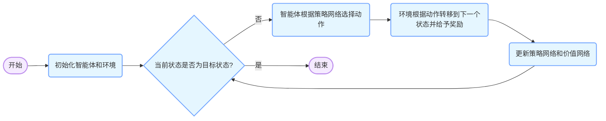

# 深度强化学习在推理路径规划中的应用

> 关键词：深度强化学习、推理路径规划、马尔可夫决策过程、策略网络、价值网络

> 摘要：本文深入探讨了深度强化学习在推理路径规划中的应用。首先介绍了相关背景知识，包括目的范围、预期读者、文档结构和术语表。接着阐述了深度强化学习和推理路径规划的核心概念及其联系，给出了原理和架构的文本示意图与Mermaid流程图。详细讲解了核心算法原理，并用Python代码进行说明。介绍了相关的数学模型和公式，并举例说明。通过项目实战，展示了代码的实际案例并进行详细解释。探讨了深度强化学习在推理路径规划中的实际应用场景，推荐了学习资源、开发工具框架和相关论文著作。最后总结了未来发展趋势与挑战，提供了常见问题解答和扩展阅读参考资料，旨在为相关领域的研究和实践提供全面而深入的指导。

## 1. 背景介绍 
### 1.1 目的和范围
深度强化学习作为机器学习领域的一个重要分支，近年来在诸多领域取得了显著的成果。推理路径规划则是在知识图谱、智能导航等场景中具有关键作用的任务。本文章的目的在于深入研究深度强化学习如何应用于推理路径规划，详细探讨其原理、算法、实际应用等方面。范围涵盖了从基本概念的介绍到实际项目的实现，以及相关工具和资源的推荐，为读者全面了解和掌握这一技术提供指导。

### 1.2 预期读者
本文预期读者包括人工智能、机器学习、计算机科学等相关专业的学生和研究人员，他们希望深入了解深度强化学习在推理路径规划中的应用原理和技术细节。同时，也适合从事智能系统开发、知识图谱构建等领域的工程师，为他们在实际项目中应用该技术提供参考。

### 1.3 文档结构概述
本文共分为十个部分。第一部分为背景介绍，阐述了文章的目的、预期读者、文档结构和术语表。第二部分介绍核心概念与联系，包括深度强化学习和推理路径规划的原理及架构。第三部分详细讲解核心算法原理，并给出Python源代码示例。第四部分介绍相关的数学模型和公式，并举例说明。第五部分通过项目实战，展示代码的实际案例并进行详细解释。第六部分探讨实际应用场景。第七部分推荐学习资源、开发工具框架和相关论文著作。第八部分总结未来发展趋势与挑战。第九部分为附录，提供常见问题解答。第十部分给出扩展阅读和参考资料。

### 1.4 术语表
#### 1.4.1 核心术语定义
- **深度强化学习（Deep Reinforcement Learning）**：结合了深度学习和强化学习的方法，通过深度神经网络来学习最优策略，以最大化长期累积奖励。
- **推理路径规划（Reasoning Path Planning）**：在给定的知识图谱或环境中，寻找从起始节点到目标节点的最优推理路径的过程。
- **马尔可夫决策过程（Markov Decision Process，MDP）**：一种用于描述智能体与环境交互的数学模型，其中当前状态的转移只依赖于当前状态和采取的动作。
- **策略网络（Policy Network）**：深度强化学习中用于生成动作的神经网络，根据当前状态输出动作的概率分布。
- **价值网络（Value Network）**：用于估计在某个状态下采取某个动作或遵循某个策略所能获得的长期累积奖励的神经网络。

#### 1.4.2 相关概念解释
- **智能体（Agent）**：在环境中进行决策和行动的实体，通过与环境交互来学习最优策略。
- **环境（Environment）**：智能体所处的外部世界，智能体的动作会影响环境的状态，并从环境中获得奖励反馈。
- **奖励（Reward）**：环境根据智能体的动作给予的即时反馈，用于指导智能体学习最优策略。
- **状态（State）**：描述环境在某一时刻的特征信息，智能体根据状态来选择动作。

#### 1.4.3 缩略词列表
- **MDP**：Markov Decision Process（马尔可夫决策过程）
- **DQN**：Deep Q-Network（深度Q网络）
- **A2C**：Advantage Actor-Critic（优势演员-评论家算法）
- **PPO**：Proximal Policy Optimization（近端策略优化算法）

## 2. 核心概念与联系 
### 深度强化学习原理
深度强化学习是强化学习与深度学习的结合。强化学习的核心是智能体与环境进行交互，智能体在每个时间步根据当前状态选择一个动作，环境根据该动作转移到下一个状态，并给予智能体一个奖励。智能体的目标是学习一个最优策略，使得长期累积奖励最大化。

深度学习则为强化学习提供了强大的函数逼近能力。通过深度神经网络，智能体可以学习到复杂的状态-动作映射关系。例如，在策略网络中，输入是环境的状态，输出是动作的概率分布；在价值网络中，输入是状态，输出是该状态下的价值估计。

### 推理路径规划原理
推理路径规划通常在知识图谱中进行。知识图谱是一种以图的形式表示知识的结构，其中节点表示实体，边表示实体之间的关系。推理路径规划的目标是在知识图谱中找到从起始实体到目标实体的最优路径，这个路径可以表示一系列的推理步骤。

### 核心概念联系
深度强化学习可以应用于推理路径规划中。将知识图谱看作环境，智能体在知识图谱中从起始节点开始，通过选择边（动作）来遍历图，每到达一个新的节点，环境会根据当前的状态和动作给予智能体一个奖励。智能体通过深度强化学习算法学习最优策略，从而找到从起始节点到目标节点的最优推理路径。

### 文本示意图
```plaintext
深度强化学习 <----> 推理路径规划
|                   |
| 智能体与环境交互  | 知识图谱遍历
|                   |
| 策略网络、价值网络| 起始节点、目标节点
|                   |
| 学习最优策略      | 寻找最优路径
```

### Mermaid流程图


## 3. 核心算法原理 & 具体操作步骤 
### 深度Q网络（DQN）算法原理
深度Q网络（DQN）是一种经典的深度强化学习算法，其核心思想是使用深度神经网络来近似Q值函数。Q值函数表示在某个状态下采取某个动作所能获得的长期累积奖励。

DQN的具体操作步骤如下：
1. 初始化一个深度神经网络作为Q网络，随机初始化网络参数。
2. 初始化一个经验回放缓冲区，用于存储智能体与环境的交互经验。
3. 对于每个训练周期：
    - 初始化环境，获取初始状态。
    - 对于每个时间步：
        - 根据当前状态，使用Q网络选择一个动作。可以采用ε-贪心策略，以一定的概率随机选择动作，以探索环境。
        - 执行动作，环境转移到下一个状态，并给予奖励。
        - 将当前状态、动作、奖励、下一个状态存储到经验回放缓冲区中。
        - 从经验回放缓冲区中随机采样一批经验。
        - 计算目标Q值：
            - 如果下一个状态是终止状态，则目标Q值等于奖励。
            - 否则，目标Q值等于奖励加上折扣因子乘以Q网络对下一个状态的最大Q值估计。
        - 使用均方误差损失函数计算预测Q值与目标Q值之间的误差。
        - 使用梯度下降算法更新Q网络的参数。

### Python源代码示例
```python
import numpy as np
import torch
import torch.nn as nn
import torch.optim as optim
import random

# 定义Q网络
class QNetwork(nn.Module):
    def __init__(self, state_size, action_size):
        super(QNetwork, self).__init__()
        self.fc1 = nn.Linear(state_size, 64)
        self.fc2 = nn.Linear(64, 64)
        self.fc3 = nn.Linear(64, action_size)

    def forward(self, x):
        x = torch.relu(self.fc1(x))
        x = torch.relu(self.fc2(x))
        return self.fc3(x)

# 定义经验回放缓冲区
class ReplayBuffer:
    def __init__(self, buffer_size):
        self.buffer = []
        self.buffer_size = buffer_size
        self.index = 0

    def add(self, state, action, reward, next_state, done):
        if len(self.buffer) < self.buffer_size:
            self.buffer.append(None)
        self.buffer[self.index] = (state, action, reward, next_state, done)
        self.index = (self.index + 1) % self.buffer_size

    def sample(self, batch_size):
        batch = random.sample(self.buffer, batch_size)
        states, actions, rewards, next_states, dones = zip(*batch)
        return np.array(states), np.array(actions), np.array(rewards), np.array(next_states), np.array(dones)

    def __len__(self):
        return len(self.buffer)

# 定义DQN智能体
class DQNAgent:
    def __init__(self, state_size, action_size, buffer_size=10000, batch_size=64, gamma=0.99, lr=0.001, epsilon=1.0, epsilon_decay=0.995, epsilon_min=0.01):
        self.state_size = state_size
        self.action_size = action_size
        self.buffer_size = buffer_size
        self.batch_size = batch_size
        self.gamma = gamma
        self.lr = lr
        self.epsilon = epsilon
        self.epsilon_decay = epsilon_decay
        self.epsilon_min = epsilon_min

        self.q_network = QNetwork(state_size, action_size)
        self.optimizer = optim.Adam(self.q_network.parameters(), lr=lr)
        self.replay_buffer = ReplayBuffer(buffer_size)

    def act(self, state):
        if np.random.rand() <= self.epsilon:
            return np.random.choice(self.action_size)
        state = torch.FloatTensor(state).unsqueeze(0)
        q_values = self.q_network(state)
        action = torch.argmax(q_values, dim=1).item()
        return action

    def train(self):
        if len(self.replay_buffer) < self.batch_size:
            return
        states, actions, rewards, next_states, dones = self.replay_buffer.sample(self.batch_size)
        states = torch.FloatTensor(states)
        actions = torch.LongTensor(actions)
        rewards = torch.FloatTensor(rewards)
        next_states = torch.FloatTensor(next_states)
        dones = torch.FloatTensor(dones)

        q_values = self.q_network(states)
        q_values = q_values.gather(1, actions.unsqueeze(1)).squeeze(1)

        next_q_values = self.q_network(next_states)
        next_q_values = next_q_values.max(1)[0]
        target_q_values = rewards + (1 - dones) * self.gamma * next_q_values

        loss = nn.MSELoss()(q_values, target_q_values)
        self.optimizer.zero_grad()
        loss.backward()
        self.optimizer.step()

        if self.epsilon > self.epsilon_min:
            self.epsilon *= self.epsilon_decay

# 示例使用
state_size = 4
action_size = 2
agent = DQNAgent(state_size, action_size)

# 模拟训练过程
for episode in range(100):
    state = np.random.rand(state_size)
    done = False
    while not done:
        action = agent.act(state)
        next_state = np.random.rand(state_size)
        reward = np.random.rand()
        done = np.random.choice([True, False])
        agent.replay_buffer.add(state, action, reward, next_state, done)
        agent.train()
        state = next_state
```

## 4. 数学模型和公式 & 详细讲解 & 举例说明 
### 马尔可夫决策过程（MDP）
马尔可夫决策过程是描述智能体与环境交互的数学模型，由一个五元组 $(S, A, P, R, \gamma)$ 表示，其中：
- $S$ 是状态空间，表示环境所有可能的状态集合。
- $A$ 是动作空间，表示智能体所有可能的动作集合。
- $P(s'|s, a)$ 是状态转移概率，表示在状态 $s$ 下采取动作 $a$ 后转移到状态 $s'$ 的概率。
- $R(s, a)$ 是奖励函数，表示在状态 $s$ 下采取动作 $a$ 所获得的即时奖励。
- $\gamma \in [0, 1]$ 是折扣因子，用于衡量未来奖励的重要性。

### 价值函数
- **状态价值函数 $V^{\pi}(s)$**：表示在策略 $\pi$ 下，从状态 $s$ 开始所能获得的长期累积奖励的期望，定义为：
$$V^{\pi}(s) = \mathbb{E}_{\pi}\left[\sum_{t=0}^{\infty}\gamma^{t}R(s_t, a_t) \big| s_0 = s\right]$$
其中，$\mathbb{E}_{\pi}$ 表示在策略 $\pi$ 下的期望，$s_t$ 是时间步 $t$ 的状态，$a_t$ 是时间步 $t$ 的动作。

- **动作价值函数 $Q^{\pi}(s, a)$**：表示在策略 $\pi$ 下，从状态 $s$ 采取动作 $a$ 后所能获得的长期累积奖励的期望，定义为：
$$Q^{\pi}(s, a) = \mathbb{E}_{\pi}\left[\sum_{t=0}^{\infty}\gamma^{t}R(s_t, a_t) \big| s_0 = s, a_0 = a\right]$$

### 贝尔曼方程
- **状态价值函数的贝尔曼方程**：
$$V^{\pi}(s) = \sum_{a \in A}\pi(a|s)\left[R(s, a) + \gamma\sum_{s' \in S}P(s'|s, a)V^{\pi}(s')\right]$$
该方程表示当前状态的价值等于在该状态下采取所有可能动作的价值的加权和，权重为策略 $\pi$ 下选择每个动作的概率。

- **动作价值函数的贝尔曼方程**：
$$Q^{\pi}(s, a) = R(s, a) + \gamma\sum_{s' \in S}P(s'|s, a)\sum_{a' \in A}\pi(a'|s')Q^{\pi}(s', a')$$
该方程表示在当前状态下采取某个动作的价值等于即时奖励加上折扣后的下一个状态的所有可能动作的价值的加权和。

### 最优价值函数和最优策略
- **最优状态价值函数 $V^*(s)$**：表示在所有可能的策略下，从状态 $s$ 开始所能获得的最大长期累积奖励的期望，即：
$$V^*(s) = \max_{\pi}V^{\pi}(s)$$

- **最优动作价值函数 $Q^*(s, a)$**：表示在所有可能的策略下，从状态 $s$ 采取动作 $a$ 后所能获得的最大长期累积奖励的期望，即：
$$Q^*(s, a) = \max_{\pi}Q^{\pi}(s, a)$$

最优策略 $\pi^*$ 可以通过最优动作价值函数得到：
$$\pi^*(a|s) = \begin{cases}
1, & \text{if } a = \arg\max_{a' \in A}Q^*(s, a') \\
0, & \text{otherwise}
\end{cases}$$

### 举例说明
假设一个简单的网格世界环境，智能体可以在一个 $3 \times 3$ 的网格中移动，目标是从左上角的网格移动到右下角的网格。状态 $s$ 可以表示智能体当前所在的网格位置，动作 $a$ 可以是上下左右四个方向的移动。

- 状态空间 $S$ 包含 $9$ 个状态，即 $S = \{(0, 0), (0, 1), \cdots, (2, 2)\}$。
- 动作空间 $A$ 包含 $4$ 个动作，即 $A = \{\text{up}, \text{down}, \text{left}, \text{right}\}$。
- 状态转移概率 $P(s'|s, a)$ 可以根据网格世界的规则确定，例如，如果智能体在边界位置，向边界外移动的动作会导致状态不变。
- 奖励函数 $R(s, a)$ 可以设置为：当智能体到达目标位置时，给予一个正奖励（例如 $10$）；否则，给予一个小的负奖励（例如 $-1$）。

通过求解贝尔曼方程，可以得到最优策略，使得智能体能够最快地从起始位置到达目标位置。

## 5. 项目实战：代码实际案例和详细解释说明 
### 5.1  开发环境搭建
#### 安装Python
首先需要安装Python，建议使用Python 3.7及以上版本。可以从Python官方网站（https://www.python.org/downloads/）下载安装包进行安装。

#### 安装必要的库
使用以下命令安装必要的库：
```sh
pip install torch numpy
```
其中，`torch` 是PyTorch深度学习框架，`numpy` 是用于数值计算的库。

### 5.2  源代码详细实现和代码解读
```python
import numpy as np
import torch
import torch.nn as nn
import torch.optim as optim
import random

# 定义知识图谱环境
class KnowledgeGraphEnv:
    def __init__(self):
        # 定义知识图谱的节点和边
        self.nodes = [0, 1, 2, 3, 4]
        self.edges = {
            0: [1, 2],
            1: [0, 3],
            2: [0, 4],
            3: [1],
            4: [2]
        }
        self.start_node = 0
        self.goal_node = 4
        self.current_node = self.start_node

    def reset(self):
        self.current_node = self.start_node
        return self.current_node

    def step(self, action):
        next_node = self.edges[self.current_node][action]
        done = (next_node == self.goal_node)
        if done:
            reward = 10
        else:
            reward = -1
        self.current_node = next_node
        return next_node, reward, done

# 定义Q网络
class QNetwork(nn.Module):
    def __init__(self, state_size, action_size):
        super(QNetwork, self).__init__()
        self.fc1 = nn.Linear(state_size, 64)
        self.fc2 = nn.Linear(64, 64)
        self.fc3 = nn.Linear(64, action_size)

    def forward(self, x):
        x = torch.relu(self.fc1(x))
        x = torch.relu(self.fc2(x))
        return self.fc3(x)

# 定义经验回放缓冲区
class ReplayBuffer:
    def __init__(self, buffer_size):
        self.buffer = []
        self.buffer_size = buffer_size
        self.index = 0

    def add(self, state, action, reward, next_state, done):
        if len(self.buffer) < self.buffer_size:
            self.buffer.append(None)
        self.buffer[self.index] = (state, action, reward, next_state, done)
        self.index = (self.index + 1) % self.buffer_size

    def sample(self, batch_size):
        batch = random.sample(self.buffer, batch_size)
        states, actions, rewards, next_states, dones = zip(*batch)
        return np.array(states), np.array(actions), np.array(rewards), np.array(next_states), np.array(dones)

    def __len__(self):
        return len(self.buffer)

# 定义DQN智能体
class DQNAgent:
    def __init__(self, state_size, action_size, buffer_size=10000, batch_size=64, gamma=0.99, lr=0.001, epsilon=1.0, epsilon_decay=0.995, epsilon_min=0.01):
        self.state_size = state_size
        self.action_size = action_size
        self.buffer_size = buffer_size
        self.batch_size = batch_size
        self.gamma = gamma
        self.lr = lr
        self.epsilon = epsilon
        self.epsilon_decay = epsilon_decay
        self.epsilon_min = epsilon_min

        self.q_network = QNetwork(state_size, action_size)
        self.optimizer = optim.Adam(self.q_network.parameters(), lr=lr)
        self.replay_buffer = ReplayBuffer(buffer_size)

    def act(self, state):
        if np.random.rand() <= self.epsilon:
            return np.random.choice(self.action_size)
        state = torch.FloatTensor([state]).unsqueeze(0)
        q_values = self.q_network(state)
        action = torch.argmax(q_values, dim=1).item()
        return action

    def train(self):
        if len(self.replay_buffer) < self.batch_size:
            return
        states, actions, rewards, next_states, dones = self.replay_buffer.sample(self.batch_size)
        states = torch.FloatTensor(states).unsqueeze(1)
        actions = torch.LongTensor(actions)
        rewards = torch.FloatTensor(rewards)
        next_states = torch.FloatTensor(next_states).unsqueeze(1)
        dones = torch.FloatTensor(dones)

        q_values = self.q_network(states)
        q_values = q_values.gather(1, actions.unsqueeze(1)).squeeze(1)

        next_q_values = self.q_network(next_states)
        next_q_values = next_q_values.max(1)[0]
        target_q_values = rewards + (1 - dones) * self.gamma * next_q_values

        loss = nn.MSELoss()(q_values, target_q_values)
        self.optimizer.zero_grad()
        loss.backward()
        self.optimizer.step()

        if self.epsilon > self.epsilon_min:
            self.epsilon *= self.epsilon_decay

# 主训练循环
if __name__ == "__main__":
    env = KnowledgeGraphEnv()
    state_size = 1
    action_size = len(env.edges[0])
    agent = DQNAgent(state_size, action_size)

    num_episodes = 1000
    for episode in range(num_episodes):
        state = env.reset()
        done = False
        total_reward = 0
        while not done:
            action = agent.act(state)
            next_state, reward, done = env.step(action)
            agent.replay_buffer.add(state, action, reward, next_state, done)
            agent.train()
            state = next_state
            total_reward += reward
        print(f"Episode {episode}: Total Reward = {total_reward}")
```

### 代码解读与分析
#### 知识图谱环境类 `KnowledgeGraphEnv`
- `__init__` 方法：初始化知识图谱的节点和边，设置起始节点和目标节点，并将当前节点初始化为起始节点。
- `reset` 方法：将当前节点重置为起始节点，并返回起始节点。
- `step` 方法：根据智能体选择的动作，转移到下一个节点。如果到达目标节点，给予正奖励；否则，给予负奖励。返回下一个节点、奖励和是否到达目标节点的标志。

#### Q网络类 `QNetwork`
- `__init__` 方法：定义一个三层全连接神经网络，输入层和隐藏层使用ReLU激活函数，输出层不使用激活函数。
- `forward` 方法：定义前向传播过程，输入状态，输出动作的Q值。

#### 经验回放缓冲区类 `ReplayBuffer`
- `__init__` 方法：初始化缓冲区的大小和索引。
- `add` 方法：将智能体与环境的交互经验（状态、动作、奖励、下一个状态、是否终止）添加到缓冲区中。
- `sample` 方法：从缓冲区中随机采样一批经验。
- `__len__` 方法：返回缓冲区中当前存储的经验数量。

#### DQN智能体类 `DQNAgent`
- `__init__` 方法：初始化智能体的参数，包括状态大小、动作大小、缓冲区大小、批量大小、折扣因子、学习率、探索率等。初始化Q网络、优化器和经验回放缓冲区。
- `act` 方法：根据当前状态选择动作。使用ε-贪心策略，以一定的概率随机选择动作，以探索环境；否则，选择Q值最大的动作。
- `train` 方法：从经验回放缓冲区中随机采样一批经验，计算目标Q值和预测Q值之间的误差，使用均方误差损失函数更新Q网络的参数。同时，逐渐降低探索率。

#### 主训练循环
在主训练循环中，创建知识图谱环境和DQN智能体，进行多个训练周期的训练。每个训练周期中，重置环境，智能体与环境交互，更新经验回放缓冲区和Q网络，直到到达目标节点或达到最大时间步。最后，打印每个训练周期的总奖励。

## 6. 实际应用场景 
### 知识图谱推理
在知识图谱中，深度强化学习可以用于推理路径规划，帮助智能体从已知的知识中推导出新的知识。例如，在生物医学知识图谱中，智能体可以通过寻找从疾病节点到治疗方法节点的最优推理路径，为医生提供治疗建议。

### 智能导航
在智能导航系统中，深度强化学习可以用于规划最优路径。智能体可以根据当前的位置和目标位置，在地图（可以看作是一种特殊的知识图谱）中寻找最优的导航路径。同时，考虑到交通状况、路况等因素，动态调整路径规划。

### 游戏AI
在游戏中，深度强化学习可以用于控制游戏角色的行动。例如，在策略游戏中，智能体可以通过推理路径规划，制定最优的战略决策，如资源分配、部队调动等，以取得游戏胜利。

### 推荐系统
在推荐系统中，深度强化学习可以用于为用户推荐最优的物品序列。智能体可以根据用户的历史行为和当前状态，在物品知识图谱中寻找最优的推荐路径，提高推荐的准确性和用户满意度。

## 7. 工具和资源推荐
### 7.1 学习资源推荐
#### 7.1.1 书籍推荐
- 《强化学习：原理与Python实现》：本书详细介绍了强化学习的基本原理和算法，并提供了Python代码实现，适合初学者入门。
- 《深度学习》：由Ian Goodfellow、Yoshua Bengio和Aaron Courville撰写，是深度学习领域的经典教材，涵盖了深度神经网络的原理、训练方法等内容。
- 《深度强化学习实战》：结合实际案例，介绍了深度强化学习在不同领域的应用，帮助读者将理论知识应用到实际项目中。

#### 7.1.2 在线课程
- Coursera上的“强化学习专项课程”：由Richard S. Sutton等知名学者授课，系统介绍了强化学习的理论和算法。
- edX上的“深度强化学习”课程：提供了深度强化学习的深入讲解和实践项目，帮助学习者掌握相关技术。
- B站等平台上有许多关于深度强化学习的视频教程，适合快速入门和学习。

#### 7.1.3 技术博客和网站
- OpenAI博客（https://openai.com/blog/）：OpenAI团队发布的关于人工智能和强化学习的最新研究成果和技术文章。
- Medium上的Towards Data Science专栏：有许多关于深度强化学习的高质量文章，涵盖了算法原理、应用案例等方面。
- 知乎上的相关专栏和话题：可以关注一些人工智能和强化学习领域的专家和博主，获取最新的技术动态和学习经验。

### 7.2 开发工具框架推荐
#### 7.2.1 IDE和编辑器
- PyCharm：一款功能强大的Python集成开发环境，提供了代码编辑、调试、版本控制等功能，适合Python开发。
- Jupyter Notebook：交互式的开发环境，支持代码、文本、图像等多种格式的展示，适合进行数据分析和模型实验。
- Visual Studio Code：轻量级的代码编辑器，支持多种编程语言和插件扩展，可用于深度强化学习项目的开发。

#### 7.2.2 调试和性能分析工具
- TensorBoard：TensorFlow提供的可视化工具，可以用于可视化训练过程中的损失函数、指标等信息，帮助调试和优化模型。
- PyTorch Profiler：PyTorch提供的性能分析工具，可以分析模型的计算时间、内存使用等情况，帮助优化模型性能。
- cProfile：Python内置的性能分析工具，可以分析Python代码的运行时间和函数调用情况。

#### 7.2.3 相关框架和库
- PyTorch：一个开源的深度学习框架，提供了丰富的神经网络层和优化算法，易于使用和扩展。
- TensorFlow：另一个广泛使用的深度学习框架，具有强大的分布式训练和部署能力。
- Stable Baselines3：基于PyTorch的深度强化学习库，提供了多种经典的强化学习算法的实现，方便快速上手和实验。

### 7.3 相关论文著作推荐
#### 7.3.1 经典论文
- “Playing Atari with Deep Reinforcement Learning”：首次提出了深度Q网络（DQN）算法，开启了深度强化学习的时代。
- “Asynchronous Methods for Deep Reinforcement Learning”：提出了异步优势演员-评论家（A3C）算法，提高了深度强化学习的训练效率。
- “Proximal Policy Optimization Algorithms”：提出了近端策略优化（PPO）算法，是一种高效的策略梯度算法。

#### 7.3.2 最新研究成果
- 关注NeurIPS、ICML、AAAI等顶级人工智能会议的论文，了解深度强化学习在推理路径规划等领域的最新研究进展。
- arXiv上也有许多预印本论文，及时发布了最新的研究成果。

#### 7.3.3 应用案例分析
- 一些知名企业和研究机构会发布关于深度强化学习在实际应用中的案例分析报告，如Google、DeepMind等。可以通过他们的官方网站或相关技术博客获取这些信息。

## 8. 总结：未来发展趋势与挑战
### 未来发展趋势
#### 多智能体深度强化学习
在复杂的推理路径规划场景中，多个智能体之间的协作和竞争将变得更加重要。多智能体深度强化学习可以用于解决多智能体之间的交互和协调问题，提高推理路径规划的效率和准确性。

#### 结合知识表示和推理
将深度强化学习与知识表示和推理技术相结合，可以更好地利用先验知识，提高智能体的推理能力。例如，将知识图谱中的逻辑规则融入到深度强化学习算法中，引导智能体进行更合理的决策。

#### 可解释性深度强化学习
随着深度强化学习在越来越多的关键领域得到应用，模型的可解释性变得越来越重要。未来的研究将致力于开发可解释性的深度强化学习算法，使得智能体的决策过程能够被人类理解和信任。

#### 自适应和持续学习
在实际应用中，环境和任务往往是动态变化的。深度强化学习模型需要具备自适应和持续学习的能力，能够在不断变化的环境中快速调整策略，以适应新的任务和挑战。

### 挑战
#### 样本效率问题
深度强化学习通常需要大量的样本进行训练，这在实际应用中可能会导致训练时间长、成本高的问题。提高样本效率是当前深度强化学习研究的一个重要挑战。

#### 环境建模和奖励设计
在推理路径规划中，准确地建模环境和设计合理的奖励函数是非常困难的。不合理的环境建模和奖励设计可能会导致智能体学习到次优的策略，甚至无法收敛到最优解。

#### 计算资源需求
深度强化学习模型通常需要大量的计算资源进行训练，尤其是在处理大规模知识图谱和复杂环境时。如何有效地利用计算资源，提高训练效率，是一个亟待解决的问题。

#### 安全性和可靠性
在一些关键应用场景中，如自动驾驶、医疗诊断等，深度强化学习模型的安全性和可靠性至关重要。如何确保模型在各种情况下都能做出正确的决策，避免出现安全事故，是一个具有挑战性的问题。

## 9. 附录：常见问题与解答
### 问题1：深度强化学习和传统强化学习有什么区别？
传统强化学习通常使用表格方法来表示价值函数和策略，适用于状态和动作空间较小的问题。而深度强化学习使用深度神经网络来近似价值函数和策略，能够处理高维、连续的状态和动作空间，适用于更复杂的问题。

### 问题2：如何选择合适的深度强化学习算法？
选择合适的深度强化学习算法需要考虑问题的特点，如状态和动作空间的大小、是否为连续空间、是否需要处理多智能体问题等。例如，对于离散动作空间的问题，DQN及其变种是一个不错的选择；对于连续动作空间的问题，可以考虑使用策略梯度算法，如A2C、PPO等。

### 问题3：如何设计合理的奖励函数？
设计合理的奖励函数需要考虑任务的目标和约束。奖励函数应该能够引导智能体朝着目标前进，同时避免不良行为。例如，在推理路径规划中，可以设置到达目标节点给予正奖励，每走一步给予小的负奖励，以鼓励智能体尽快找到最优路径。

### 问题4：深度强化学习模型的训练时间很长怎么办？
可以采取以下措施来缩短训练时间：
- 优化算法：选择高效的深度强化学习算法，如PPO等。
- 并行计算：使用GPU或分布式计算来加速训练过程。
- 数据增强：通过数据增强技术增加训练样本的多样性，提高样本效率。
- 预训练：使用预训练模型初始化网络参数，减少训练时间。

### 问题5：如何评估深度强化学习模型的性能？
可以使用以下指标来评估深度强化学习模型的性能：
- 累积奖励：在多个训练周期中，智能体获得的总奖励。
- 成功率：智能体在多个测试任务中成功完成任务的比例。
- 平均步数：智能体完成任务所需的平均步数。

## 10. 扩展阅读 & 参考资料
### 扩展阅读
- 《强化学习精要：核心算法与TensorFlow实现》
- 《深度强化学习：原理与Python实战》
- 《知识图谱：方法、实践与应用》

### 参考资料
- Richard S. Sutton, Andrew G. Barto. Reinforcement Learning: An Introduction.
- Volodymyr Mnih, Koray Kavukcuoglu, David Silver, et al. Playing Atari with Deep Reinforcement Learning.
- Prafulla Dhariwal, Christy Schulman, et al. Proximal Policy Optimization Algorithms.

作者：AI天才研究院/AI Genius Institute & 禅与计算机程序设计艺术 /Zen And The Art of Computer Programming