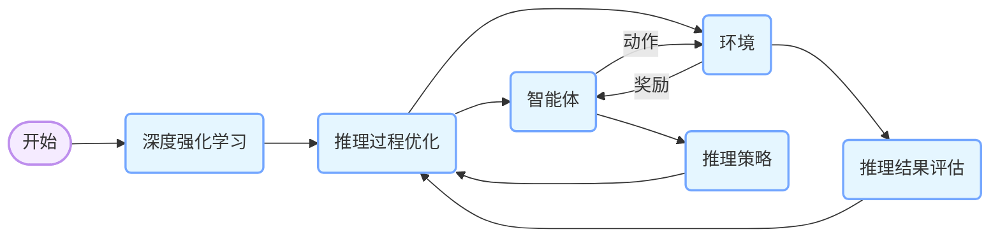

# 深度强化学习在推理过程优化中的作用

> 关键词：深度强化学习、推理过程优化、马尔可夫决策过程、策略网络、价值网络

> 摘要：本文深入探讨了深度强化学习在推理过程优化中的重要作用。首先介绍了深度强化学习和推理过程优化的背景知识，包括相关概念和术语。接着详细阐述了深度强化学习的核心概念、算法原理，通过数学模型和公式进行了理论分析，并给出了具体的Python代码示例。在项目实战部分，展示了如何搭建开发环境、实现代码并进行解读分析。还探讨了深度强化学习在推理过程优化中的实际应用场景，推荐了相关的学习资源、开发工具和论文著作。最后总结了未来发展趋势与挑战，解答了常见问题，并提供了扩展阅读和参考资料，旨在为读者全面呈现深度强化学习在推理过程优化领域的全貌。

## 1. 背景介绍 
### 1.1 目的和范围
本文章的主要目的是全面且深入地研究深度强化学习在推理过程优化中所起到的作用。我们将详细剖析深度强化学习的原理、算法以及其如何应用于推理过程，通过理论分析、代码实现和实际案例展示，揭示其在不同领域推理优化中的潜力和效果。范围涵盖了深度强化学习的基本概念、核心算法、数学模型，以及在多个实际场景中的应用，同时会推荐相关的学习资源和开发工具，为读者提供一个完整的知识体系。

### 1.2 预期读者
本文预期读者包括对人工智能、机器学习尤其是深度强化学习感兴趣的研究人员、开发者和学生。对于正在从事推理过程优化相关项目的专业人士，本文提供了理论支持和实践指导；对于初学者，本文将帮助他们建立起对深度强化学习和推理过程优化的基本认识和理解。

### 1.3 文档结构概述
本文将按照以下结构进行组织：首先介绍背景知识，包括目的、预期读者和文档结构，以及相关术语的定义和解释。接着阐述深度强化学习的核心概念及其与推理过程优化的联系，并给出相应的示意图和流程图。然后详细讲解核心算法原理，使用Python代码进行说明，同时给出数学模型和公式进行理论分析。在项目实战部分，展示如何搭建开发环境、实现代码并进行解读。之后探讨深度强化学习在推理过程优化中的实际应用场景。再推荐相关的学习资源、开发工具和论文著作。最后总结未来发展趋势与挑战，解答常见问题，并提供扩展阅读和参考资料。

### 1.4 术语表
#### 1.4.1 核心术语定义
- **深度强化学习（Deep Reinforcement Learning）**：结合了深度学习和强化学习的方法，利用深度神经网络来近似强化学习中的策略函数或价值函数，以解决复杂的决策问题。
- **推理过程优化（Inference Process Optimization）**：对推理过程进行改进和调整，以提高推理的效率、准确性和可靠性，降低资源消耗。
- **马尔可夫决策过程（Markov Decision Process，MDP）**：一种用于描述决策过程的数学模型，具有马尔可夫性质，即系统的下一状态只依赖于当前状态和当前动作。
- **策略网络（Policy Network）**：在深度强化学习中，用于生成动作策略的深度神经网络，它根据当前状态输出动作的概率分布。
- **价值网络（Value Network）**：用于估计状态价值或动作价值的深度神经网络，帮助智能体评估不同状态或动作的优劣。

#### 1.4.2 相关概念解释
- **智能体（Agent）**：在强化学习中，智能体是能够感知环境状态并采取动作的实体，其目标是通过与环境的交互最大化累积奖励。
- **环境（Environment）**：智能体所处的外部世界，它根据智能体的动作提供新的状态和奖励信号。
- **奖励（Reward）**：环境给予智能体的反馈信号，用于衡量智能体动作的好坏，智能体的目标是最大化长期累积奖励。
- **状态（State）**：描述环境当前情况的一组变量，智能体根据状态来决定采取的动作。

#### 1.4.3 缩略词列表
- **MDP**：Markov Decision Process（马尔可夫决策过程）
- **DQN**：Deep Q-Network（深度Q网络）
- **A2C**：Advantage Actor-Critic（优势演员 - 评论家算法）
- **PPO**：Proximal Policy Optimization（近端策略优化算法）

## 2. 核心概念与联系 

### 深度强化学习核心概念
深度强化学习是强化学习与深度学习的结合。强化学习是一种通过智能体与环境进行交互，根据环境反馈的奖励信号来学习最优策略的机器学习方法。而深度学习则提供了强大的函数逼近能力，能够处理高维、复杂的数据。

在深度强化学习中，智能体的目标是在环境中找到一个最优策略 $\pi$，使得长期累积奖励 $R = \sum_{t=0}^{T} \gamma^t r_t$ 最大化，其中 $r_t$ 是在时间步 $t$ 时获得的奖励，$\gamma$ 是折扣因子，用于平衡即时奖励和未来奖励。

### 推理过程优化核心概念
推理过程优化旨在提高推理的效率和准确性。在许多领域，如自然语言处理、计算机视觉和知识图谱等，推理是一个重要的环节。推理过程通常涉及从已知信息中推导出新的结论，优化的目标包括减少推理时间、降低资源消耗、提高推理结果的准确性等。

### 两者联系
深度强化学习可以应用于推理过程优化，通过学习最优的推理策略来提高推理效率和准确性。智能体可以将推理过程视为一个与环境交互的过程，每一步推理操作视为一个动作，推理结果的好坏通过奖励信号来反馈。例如，在知识图谱推理中，智能体可以根据当前的图谱状态选择合适的推理规则或路径，环境根据推理结果给予相应的奖励，智能体通过不断学习来优化推理策略。

### 文本示意图
```plaintext
深度强化学习
    |
    | 应用于
    v
推理过程优化
    |
    | 包含
    v
智能体 <-> 环境
    |         |
    | 动作    | 奖励
    v         v
    推理策略  推理结果评估
```

### Mermaid 流程图


## 3. 核心算法原理 & 具体操作步骤 

### 深度Q网络（DQN）算法原理
深度Q网络（DQN）是深度强化学习中的经典算法，它通过深度神经网络来近似Q值函数 $Q(s,a)$，表示在状态 $s$ 下采取动作 $a$ 的预期累积奖励。

DQN的目标是最小化损失函数 $L(\theta) = \mathbb{E}[(r + \gamma \max_{a'} Q(s',a';\theta^-) - Q(s,a;\theta))^2]$，其中 $\theta$ 是Q网络的参数，$\theta^-$ 是目标网络的参数，$r$ 是即时奖励，$\gamma$ 是折扣因子，$s'$ 是下一个状态。

### 具体操作步骤
1. **初始化**：初始化Q网络 $Q(s,a;\theta)$ 和目标网络 $Q(s,a;\theta^-)$，并将 $\theta^-$ 初始化为 $\theta$。初始化经验回放缓冲区 $D$。
2. **与环境交互**：在每个时间步 $t$，智能体根据当前状态 $s_t$ 从Q网络中选择动作 $a_t$，并执行该动作，得到即时奖励 $r_t$ 和下一个状态 $s_{t+1}$。
3. **存储经验**：将经验 $(s_t,a_t,r_t,s_{t+1})$ 存储到经验回放缓冲区 $D$ 中。
4. **经验回放**：从经验回放缓冲区 $D$ 中随机采样一批经验 $(s_i,a_i,r_i,s_{i+1})$。
5. **计算目标值**：对于每个采样的经验，计算目标值 $y_i = r_i + \gamma \max_{a'} Q(s_{i+1},a';\theta^-)$。
6. **更新Q网络**：使用梯度下降法更新Q网络的参数 $\theta$，以最小化损失函数 $L(\theta)$。
7. **更新目标网络**：每隔一定的时间步，将目标网络的参数 $\theta^-$ 更新为 $\theta$。

### Python代码实现
```python
import torch
import torch.nn as nn
import torch.optim as optim
import numpy as np
import random

# 定义Q网络
class QNetwork(nn.Module):
    def __init__(self, input_dim, output_dim):
        super(QNetwork, self).__init__()
        self.fc1 = nn.Linear(input_dim, 64)
        self.fc2 = nn.Linear(64, 64)
        self.fc3 = nn.Linear(64, output_dim)

    def forward(self, x):
        x = torch.relu(self.fc1(x))
        x = torch.relu(self.fc2(x))
        return self.fc3(x)

# 定义DQN智能体
class DQNAgent:
    def __init__(self, input_dim, output_dim, learning_rate=0.001, gamma=0.99, epsilon=1.0, epsilon_decay=0.995, epsilon_min=0.01, batch_size=64, memory_size=10000):
        self.input_dim = input_dim
        self.output_dim = output_dim
        self.learning_rate = learning_rate
        self.gamma = gamma
        self.epsilon = epsilon
        self.epsilon_decay = epsilon_decay
        self.epsilon_min = epsilon_min
        self.batch_size = batch_size
        self.memory = []
        self.memory_size = memory_size

        self.q_network = QNetwork(input_dim, output_dim)
        self.target_network = QNetwork(input_dim, output_dim)
        self.target_network.load_state_dict(self.q_network.state_dict())
        self.optimizer = optim.Adam(self.q_network.parameters(), lr=learning_rate)

    def remember(self, state, action, reward, next_state):
        if len(self.memory) > self.memory_size:
            self.memory.pop(0)
        self.memory.append((state, action, reward, next_state))

    def act(self, state):
        if np.random.rand() <= self.epsilon:
            return random.randrange(self.output_dim)
        state = torch.FloatTensor(state).unsqueeze(0)
        q_values = self.q_network(state)
        action = torch.argmax(q_values).item()
        return action

    def replay(self):
        if len(self.memory) < self.batch_size:
            return
        minibatch = random.sample(self.memory, self.batch_size)
        states, actions, rewards, next_states = zip(*minibatch)

        states = torch.FloatTensor(states)
        actions = torch.LongTensor(actions)
        rewards = torch.FloatTensor(rewards)
        next_states = torch.FloatTensor(next_states)

        q_values = self.q_network(states)
        next_q_values = self.target_network(next_states)
        max_next_q_values = torch.max(next_q_values, dim=1)[0]

        targets = q_values.clone()
        for i in range(self.batch_size):
            targets[i][actions[i]] = rewards[i] + self.gamma * max_next_q_values[i]

        loss = nn.MSELoss()(q_values, targets)
        self.optimizer.zero_grad()
        loss.backward()
        self.optimizer.step()

        if self.epsilon > self.epsilon_min:
            self.epsilon *= self.epsilon_decay

    def update_target_network(self):
        self.target_network.load_state_dict(self.q_network.state_dict())
```

## 4. 数学模型和公式 & 详细讲解 & 举例说明 

### 马尔可夫决策过程（MDP）
马尔可夫决策过程是一个五元组 $(S,A,P,R,\gamma)$，其中：
- $S$ 是状态空间，表示环境的所有可能状态。
- $A$ 是动作空间，表示智能体可以采取的所有可能动作。
- $P(s'|s,a)$ 是状态转移概率，表示在状态 $s$ 下采取动作 $a$ 后转移到状态 $s'$ 的概率。
- $R(s,a)$ 是奖励函数，表示在状态 $s$ 下采取动作 $a$ 后获得的即时奖励。
- $\gamma$ 是折扣因子，用于平衡即时奖励和未来奖励，取值范围为 $[0,1]$。

### 价值函数
- **状态价值函数 $V^{\pi}(s)$**：表示在策略 $\pi$ 下，从状态 $s$ 开始的预期累积奖励，定义为：
$$V^{\pi}(s) = \mathbb{E}_{\pi} \left[ \sum_{t=0}^{\infty} \gamma^t r_t | s_0 = s \right]$$
- **动作价值函数 $Q^{\pi}(s,a)$**：表示在策略 $\pi$ 下，从状态 $s$ 采取动作 $a$ 后，再按照策略 $\pi$ 继续执行的预期累积奖励，定义为：
$$Q^{\pi}(s,a) = \mathbb{E}_{\pi} \left[ \sum_{t=0}^{\infty} \gamma^t r_t | s_0 = s, a_0 = a \right]$$

### 贝尔曼方程
- **状态价值函数的贝尔曼方程**：
$$V^{\pi}(s) = \sum_{a \in A} \pi(a|s) \left( R(s,a) + \gamma \sum_{s' \in S} P(s'|s,a) V^{\pi}(s') \right)$$
- **动作价值函数的贝尔曼方程**：
$$Q^{\pi}(s,a) = R(s,a) + \gamma \sum_{s' \in S} P(s'|s,a) \sum_{a' \in A} \pi(a'|s') Q^{\pi}(s',a')$$

### 最优价值函数和最优策略
- 最优状态价值函数 $V^*(s)$ 定义为：
$$V^*(s) = \max_{\pi} V^{\pi}(s)$$
- 最优动作价值函数 $Q^*(s,a)$ 定义为：
$$Q^*(s,a) = \max_{\pi} Q^{\pi}(s,a)$$
- 最优策略 $\pi^*$ 满足：
$$\pi^*(a|s) = \begin{cases} 1, & \text{if } a = \arg \max_{a'} Q^*(s,a') \\ 0, & \text{otherwise} \end{cases}$$

### 举例说明
假设有一个简单的网格世界环境，智能体可以在一个 $3 \times 3$ 的网格中移动，目标是从左上角的起点移动到右下角的终点。状态 $s$ 可以用智能体在网格中的位置 $(x,y)$ 表示，动作 $a$ 包括上、下、左、右四个方向。奖励函数 $R(s,a)$ 可以定义为：如果智能体到达终点，获得奖励 $+1$；如果智能体撞到墙壁，获得奖励 $-1$；其他情况获得奖励 $0$。

在这个环境中，我们可以使用深度强化学习算法来学习最优策略。例如，使用DQN算法，智能体通过不断与环境交互，学习到在不同状态下采取最优动作，以最大化累积奖励。

## 5. 项目实战：代码实际案例和详细解释说明 

### 5.1  开发环境搭建
#### 安装Python
首先确保你已经安装了Python 3.6或更高版本。可以从Python官方网站（https://www.python.org/downloads/） 下载并安装。

#### 安装依赖库
我们需要安装一些必要的Python库，包括 `torch`、`numpy` 和 `random`。可以使用以下命令进行安装：
```bash
pip install torch numpy
```

### 5.2  源代码详细实现和代码解读
以下是一个完整的使用DQN算法解决简单网格世界问题的代码示例：
```python
import torch
import torch.nn as nn
import torch.optim as optim
import numpy as np
import random

# 定义Q网络
class QNetwork(nn.Module):
    def __init__(self, input_dim, output_dim):
        super(QNetwork, self).__init__()
        self.fc1 = nn.Linear(input_dim, 64)
        self.fc2 = nn.Linear(64, 64)
        self.fc3 = nn.Linear(64, output_dim)

    def forward(self, x):
        x = torch.relu(self.fc1(x))
        x = torch.relu(self.fc2(x))
        return self.fc3(x)

# 定义DQN智能体
class DQNAgent:
    def __init__(self, input_dim, output_dim, learning_rate=0.001, gamma=0.99, epsilon=1.0, epsilon_decay=0.995, epsilon_min=0.01, batch_size=64, memory_size=10000):
        self.input_dim = input_dim
        self.output_dim = output_dim
        self.learning_rate = learning_rate
        self.gamma = gamma
        self.epsilon = epsilon
        self.epsilon_decay = epsilon_decay
        self.epsilon_min = epsilon_min
        self.batch_size = batch_size
        self.memory = []
        self.memory_size = memory_size

        self.q_network = QNetwork(input_dim, output_dim)
        self.target_network = QNetwork(input_dim, output_dim)
        self.target_network.load_state_dict(self.q_network.state_dict())
        self.optimizer = optim.Adam(self.q_network.parameters(), lr=learning_rate)

    def remember(self, state, action, reward, next_state):
        if len(self.memory) > self.memory_size:
            self.memory.pop(0)
        self.memory.append((state, action, reward, next_state))

    def act(self, state):
        if np.random.rand() <= self.epsilon:
            return random.randrange(self.output_dim)
        state = torch.FloatTensor(state).unsqueeze(0)
        q_values = self.q_network(state)
        action = torch.argmax(q_values).item()
        return action

    def replay(self):
        if len(self.memory) < self.batch_size:
            return
        minibatch = random.sample(self.memory, self.batch_size)
        states, actions, rewards, next_states = zip(*minibatch)

        states = torch.FloatTensor(states)
        actions = torch.LongTensor(actions)
        rewards = torch.FloatTensor(rewards)
        next_states = torch.FloatTensor(next_states)

        q_values = self.q_network(states)
        next_q_values = self.target_network(next_states)
        max_next_q_values = torch.max(next_q_values, dim=1)[0]

        targets = q_values.clone()
        for i in range(self.batch_size):
            targets[i][actions[i]] = rewards[i] + self.gamma * max_next_q_values[i]

        loss = nn.MSELoss()(q_values, targets)
        self.optimizer.zero_grad()
        loss.backward()
        self.optimizer.step()

        if self.epsilon > self.epsilon_min:
            self.epsilon *= self.epsilon_decay

    def update_target_network(self):
        self.target_network.load_state_dict(self.q_network.state_dict())

# 定义网格世界环境
class GridWorld:
    def __init__(self, size=3):
        self.size = size
        self.state = (0, 0)
        self.goal = (size - 1, size - 1)

    def reset(self):
        self.state = (0, 0)
        return np.array(self.state)

    def step(self, action):
        x, y = self.state
        if action == 0:  # 上
            x = max(0, x - 1)
        elif action == 1:  # 下
            x = min(self.size - 1, x + 1)
        elif action == 2:  # 左
            y = max(0, y - 1)
        elif action == 3:  # 右
            y = min(self.size - 1, y + 1)

        self.state = (x, y)
        if self.state == self.goal:
            reward = 1
            done = True
        else:
            reward = 0
            done = False

        next_state = np.array(self.state)
        return next_state, reward, done

# 训练智能体
env = GridWorld()
input_dim = 2
output_dim = 4
agent = DQNAgent(input_dim, output_dim)

num_episodes = 1000
for episode in range(num_episodes):
    state = env.reset()
    done = False
    total_reward = 0
    while not done:
        action = agent.act(state)
        next_state, reward, done = env.step(action)
        agent.remember(state, action, reward, next_state)
        agent.replay()
        state = next_state
        total_reward += reward
    if episode % 10 == 0:
        agent.update_target_network()
    print(f"Episode {episode}: Total Reward = {total_reward}")
```

### 5.3  代码解读与分析
#### QNetwork类
这是一个简单的三层全连接神经网络，用于近似Q值函数。输入层的维度为 `input_dim`，输出层的维度为 `output_dim`，中间有两个隐藏层，每个隐藏层有64个神经元。使用ReLU激活函数增加网络的非线性。

#### DQNAgent类
- `__init__` 方法：初始化智能体的参数，包括学习率、折扣因子、探索率等。同时初始化Q网络和目标网络，并将目标网络的参数初始化为Q网络的参数。
- `remember` 方法：将智能体的经验 $(s,a,r,s')$ 存储到经验回放缓冲区中。
- `act` 方法：根据当前状态选择动作。以一定的概率 $\epsilon$ 进行随机探索，否则选择Q值最大的动作。
- `replay` 方法：从经验回放缓冲区中随机采样一批经验，计算目标值，并使用梯度下降法更新Q网络的参数。同时，逐渐降低探索率 $\epsilon$。
- `update_target_network` 方法：每隔一定的时间步，将目标网络的参数更新为Q网络的参数。

#### GridWorld类
这是一个简单的网格世界环境，智能体可以在 $3 \times 3$ 的网格中移动。`reset` 方法将智能体的状态重置为起点，`step` 方法根据智能体的动作更新状态，并返回下一个状态、奖励和是否完成的标志。

#### 训练过程
在训练过程中，智能体与环境进行交互，不断学习最优策略。每个回合开始时，环境重置，智能体根据当前状态选择动作，执行动作后获得奖励和下一个状态，将经验存储到经验回放缓冲区中，并进行经验回放更新Q网络。每隔10个回合，更新目标网络的参数。

## 6. 实际应用场景 
### 自然语言处理中的推理优化
在自然语言处理中，推理过程通常涉及文本生成、问答系统、机器翻译等任务。深度强化学习可以用于优化这些任务中的推理策略。例如，在文本生成任务中，智能体可以根据当前的文本状态选择合适的词汇进行生成，通过奖励信号来评估生成文本的质量，从而学习到更优的生成策略。在问答系统中，智能体可以根据问题和知识库的状态选择合适的推理规则或答案，提高问答的准确性和效率。

### 计算机视觉中的推理优化
在计算机视觉中，推理过程包括目标检测、图像分类、语义分割等任务。深度强化学习可以用于优化这些任务中的推理过程。例如，在目标检测任务中，智能体可以根据图像的特征和当前的检测状态选择合适的检测框，通过奖励信号来评估检测的准确性和效率，从而学习到更优的检测策略。在图像分类任务中，智能体可以根据图像的特征选择合适的分类器，提高分类的准确性。

### 知识图谱中的推理优化
知识图谱是一种用于表示实体和关系的图结构，推理是知识图谱中的重要任务之一。深度强化学习可以用于优化知识图谱中的推理过程。例如，智能体可以根据知识图谱的状态选择合适的推理规则或路径，通过奖励信号来评估推理结果的准确性和可靠性，从而学习到更优的推理策略。在知识图谱补全任务中，智能体可以根据已有的知识图谱信息预测缺失的关系，提高知识图谱的完整性。

### 机器人控制中的推理优化
在机器人控制中，推理过程包括路径规划、动作决策等任务。深度强化学习可以用于优化这些任务中的推理过程。例如，在路径规划任务中，智能体可以根据机器人的当前位置和目标位置，以及环境的信息选择合适的路径，通过奖励信号来评估路径的优劣，从而学习到更优的路径规划策略。在动作决策任务中，智能体可以根据机器人的当前状态和环境的反馈选择合适的动作，提高机器人的控制效率和灵活性。

## 7. 工具和资源推荐
### 7.1 学习资源推荐
#### 7.1.1 书籍推荐
- 《Reinforcement Learning: An Introduction》（第二版）：这是一本经典的强化学习教材，由Richard S. Sutton和Andrew G. Barto编写。该书全面介绍了强化学习的基本概念、算法和应用，是学习强化学习的必读之作。
- 《Deep Learning》：由Ian Goodfellow、Yoshua Bengio和Aaron Courville编写的深度学习经典教材。该书涵盖了深度学习的各个方面，包括神经网络、卷积神经网络、循环神经网络等，对于理解深度强化学习中的深度学习部分非常有帮助。
- 《Artificial Intelligence: A Modern Approach》（第四版）：这是一本广泛使用的人工智能教材，由Stuart Russell和Peter Norvig编写。该书介绍了人工智能的各个领域，包括搜索、知识表示、推理、机器学习等，对于全面了解人工智能和深度强化学习的背景知识非常有帮助。

#### 7.1.2 在线课程
- Coursera上的“Reinforcement Learning Specialization”：由University of Alberta提供的强化学习专项课程，包括四门课程，从基础的强化学习概念到高级的深度强化学习算法都有涉及。
- edX上的“Deep Learning MicroMasters Program”：由BerkeleyX提供的深度学习微硕士项目，包括多门深度学习课程，其中也涵盖了深度强化学习的内容。
- OpenAI Gym官方文档和教程：OpenAI Gym是一个用于开发和比较强化学习算法的工具包，其官方文档和教程提供了丰富的强化学习实践资源。

#### 7.1.3 技术博客和网站
- OpenAI博客：OpenAI是人工智能领域的领先研究机构，其博客发布了许多关于深度强化学习的最新研究成果和技术文章。
- DeepMind博客：DeepMind是另一家在人工智能领域具有重要影响力的研究机构，其博客也发布了许多关于深度强化学习的前沿研究和应用案例。
- Medium上的“Towards Data Science”：这是一个专注于数据科学和机器学习的技术博客平台，上面有许多关于深度强化学习的优质文章和教程。

### 7.2 开发工具框架推荐
#### 7.2.1 IDE和编辑器
- PyCharm：一款专业的Python集成开发环境，提供了丰富的代码编辑、调试、版本控制等功能，非常适合Python开发。
- Jupyter Notebook：一个交互式的开发环境，支持Python代码的编写、运行和可视化，非常适合进行数据分析和机器学习实验。
- Visual Studio Code：一款轻量级的代码编辑器，支持多种编程语言和插件，具有丰富的扩展功能，也可以用于Python开发。

#### 7.2.2 调试和性能分析工具
- TensorBoard：TensorFlow提供的可视化工具，可以用于监控训练过程中的损失函数、准确率等指标，以及可视化模型的结构和参数。
- PyTorch Profiler：PyTorch提供的性能分析工具，可以用于分析模型的计算时间、内存使用等性能指标，帮助优化模型性能。
- cProfile：Python标准库中的性能分析工具，可以用于分析Python代码的运行时间和函数调用情况。

#### 7.2.3 相关框架和库
- PyTorch：一个开源的深度学习框架，提供了丰富的深度学习模型和算法，支持GPU加速，非常适合深度强化学习的开发。
- TensorFlow：另一个广泛使用的深度学习框架，具有强大的分布式训练和部署能力，也可以用于深度强化学习的开发。
- Stable Baselines3：一个基于PyTorch的深度强化学习库，提供了多种经典的深度强化学习算法的实现，方便快速开发和实验。

### 7.3 相关论文著作推荐
#### 7.3.1 经典论文
- “Human-level control through deep reinforcement learning”：由DeepMind团队发表在Nature杂志上的论文，介绍了深度Q网络（DQN）算法，并证明了其在Atari游戏中的优异表现。
- “Asynchronous Methods for Deep Reinforcement Learning”：由OpenAI团队发表的论文，提出了异步优势演员 - 评论家（A3C）算法，提高了深度强化学习的训练效率。
- “Proximal Policy Optimization Algorithms”：由OpenAI团队发表的论文，提出了近端策略优化（PPO）算法，是一种高效的策略优化算法。

#### 7.3.2 最新研究成果
- 关注NeurIPS、ICML、AAAI等顶级人工智能会议的论文，这些会议每年都会发表许多关于深度强化学习的最新研究成果。
- 关注arXiv预印本平台，上面有许多研究人员发布的最新研究论文，包括深度强化学习在各个领域的应用和算法改进。

#### 7.3.3 应用案例分析
- 《Deep Reinforcement Learning Hands-On》（第二版）：该书提供了许多深度强化学习的实际应用案例，包括游戏、机器人控制、金融等领域，通过实际案例帮助读者理解深度强化学习的应用场景和开发过程。
- 各大科技公司的技术博客和研究报告，如Google、Facebook、Microsoft等，会发布一些关于深度强化学习在实际业务中的应用案例和经验分享。

## 8. 总结：未来发展趋势与挑战
### 未来发展趋势
#### 与其他技术的融合
深度强化学习将与其他技术，如计算机视觉、自然语言处理、知识图谱等进一步融合，形成更强大的智能系统。例如，在智能机器人领域，深度强化学习可以与计算机视觉技术结合，使机器人能够更好地感知环境并做出决策；在智能客服领域，深度强化学习可以与自然语言处理技术结合，提高客服的智能水平和服务质量。

#### 多智能体强化学习
多智能体强化学习将成为未来的研究热点之一。在多智能体环境中，多个智能体需要相互协作或竞争，以实现共同的目标。多智能体强化学习可以应用于交通控制、物流调度、游戏等领域，提高系统的整体性能和效率。

#### 强化学习在复杂环境中的应用
随着技术的发展，深度强化学习将应用于更加复杂的环境中，如医疗、金融、能源等领域。在这些领域中，环境具有高度的不确定性和复杂性，需要深度强化学习算法具有更强的适应性和鲁棒性。

### 挑战
#### 样本效率问题
深度强化学习通常需要大量的样本进行训练，样本效率较低。在实际应用中，获取大量的样本可能是困难和昂贵的。因此，提高深度强化学习的样本效率是一个亟待解决的问题。

#### 可解释性问题
深度强化学习模型通常是黑盒模型，难以解释其决策过程和结果。在一些对可解释性要求较高的领域，如医疗、金融等，可解释性问题成为了深度强化学习应用的障碍。因此，提高深度强化学习模型的可解释性是一个重要的研究方向。

#### 环境建模问题
在实际应用中，准确地建模环境是一个挑战。环境可能具有不确定性、动态性和复杂性，难以用精确的数学模型来描述。不准确的环境建模可能导致深度强化学习算法的性能下降。因此，研究更加准确和灵活的环境建模方法是必要的。

## 9. 附录：常见问题与解答
### 问题1：深度强化学习和传统强化学习有什么区别？
深度强化学习结合了深度学习和强化学习的方法，使用深度神经网络来近似强化学习中的策略函数或价值函数。与传统强化学习相比，深度强化学习能够处理高维、复杂的数据，具有更强的表示能力和泛化能力。传统强化学习通常使用表格方法或简单的函数逼近器，适用于状态空间和动作空间较小的问题。

### 问题2：深度强化学习需要哪些数学基础？
深度强化学习需要一定的数学基础，包括线性代数、概率论、微积分等。线性代数用于处理向量、矩阵等数据结构，概率论用于处理随机变量和概率分布，微积分用于优化算法和计算梯度。此外，了解马尔可夫决策过程、贝尔曼方程等强化学习的基本理论也是必要的。

### 问题3：如何选择合适的深度强化学习算法？
选择合适的深度强化学习算法需要考虑多个因素，如问题的类型、状态空间和动作空间的大小、样本效率要求等。对于离散动作空间的问题，可以考虑使用DQN、PPO等算法；对于连续动作空间的问题，可以考虑使用DDPG、TD3等算法。如果样本效率要求较高，可以选择A2C、PPO等算法。

### 问题4：深度强化学习的训练过程中可能会遇到哪些问题？
深度强化学习的训练过程中可能会遇到以下问题：
- **收敛问题**：深度强化学习算法可能会出现不收敛或收敛速度慢的问题，这可能是由于学习率设置不当、网络结构不合理等原因导致的。
- **过拟合问题**：深度强化学习模型可能会出现过拟合的问题，即模型在训练数据上表现良好，但在测试数据上表现不佳。这可能是由于训练数据不足、模型复杂度过高等原因导致的。
- **探索与利用平衡问题**：在深度强化学习中，智能体需要在探索新的动作和利用已有的经验之间进行平衡。如果探索不足，智能体可能会陷入局部最优解；如果探索过度，智能体可能会浪费大量的时间和资源。

## 10. 扩展阅读 & 参考资料
### 扩展阅读
- 《Deep Reinforcement Learning in Action》：该书提供了更多深度强化学习的实际应用案例和代码实现，帮助读者进一步掌握深度强化学习的开发技巧。
- 《Algorithms for Reinforcement Learning》：该书详细介绍了强化学习的各种算法，包括理论分析和代码实现，适合对强化学习算法原理感兴趣的读者。

### 参考资料
- Sutton, R. S., & Barto, A. G. (2018). Reinforcement Learning: An Introduction (Second Edition). MIT Press.
- Goodfellow, I., Bengio, Y., & Courville, A. (2016). Deep Learning. MIT Press.
- Mnih, V., Kavukcuoglu, K., Silver, D., Rusu, A. A., Veness, J., Bellemare, M. G.,... & Petersen, S. (2015). Human-level control through deep reinforcement learning. Nature, 518(7540), 529-533.
- Mnih, V., Badia, A. P., Mirza, M., Graves, A., Lillicrap, T., Harley, T.,... & Kavukcuoglu, K. (2016). Asynchronous Methods for Deep Reinforcement Learning. arXiv preprint arXiv:1602.01783.
- Schulman, J., Wolski, F., Dhariwal, P., Radford, A., & Klimov, O. (2017). Proximal Policy Optimization Algorithms. arXiv preprint arXiv:1707.06347.

作者：AI天才研究院/AI Genius Institute & 禅与计算机程序设计艺术 /Zen And The Art of Computer Programming