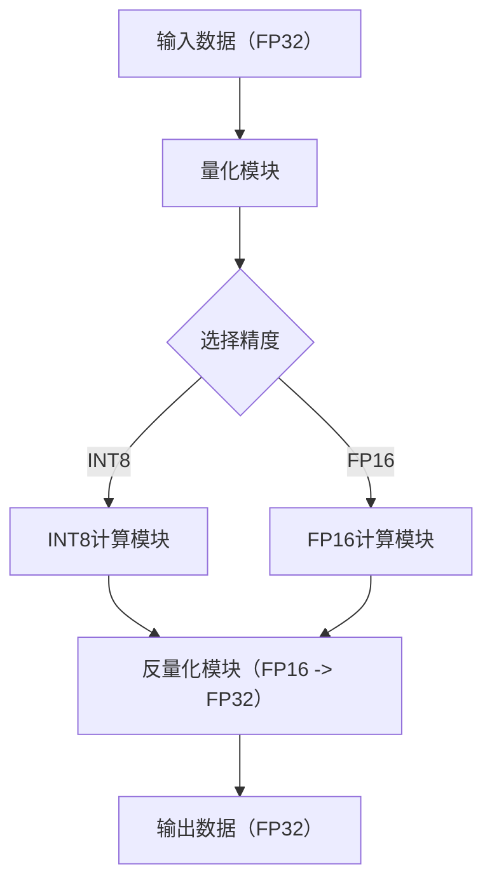

# 混合精度量化在移动端AI加速中的实践

> 关键词：混合精度量化、移动端AI、AI加速、量化算法、神经网络

> 摘要：本文围绕混合精度量化在移动端AI加速中的实践展开深入探讨。首先介绍了混合精度量化及移动端AI加速的背景信息，包括目的、预期读者等。接着详细阐述了混合精度量化的核心概念与联系，给出了原理和架构的文本示意图及Mermaid流程图。然后深入讲解了核心算法原理，并用Python源代码进行了详细阐述，同时介绍了相关数学模型和公式。通过项目实战，展示了在移动端实现混合精度量化加速AI的具体代码案例及详细解释。还探讨了实际应用场景，推荐了相关的学习资源、开发工具框架以及论文著作。最后总结了未来发展趋势与挑战，解答了常见问题并提供了扩展阅读和参考资料，旨在为相关领域的开发者和研究者提供全面且深入的技术指导。

## 1. 背景介绍 
### 1.1 目的和范围
随着人工智能技术的不断发展，移动端AI应用越来越广泛，如拍照识别、智能语音助手等。然而，移动端设备的计算资源和存储资源相对有限，传统的高精度神经网络模型在移动端运行时会面临计算速度慢、能耗高、内存占用大等问题。混合精度量化作为一种有效的模型压缩和加速技术，能够在不显著损失模型精度的前提下，大幅减少模型的计算量和存储量，从而提高移动端AI的运行效率。

本文的范围主要涵盖混合精度量化的基本概念、核心算法原理、数学模型，以及如何在移动端AI场景中应用混合精度量化技术进行加速，同时通过项目实战展示具体的实现过程和效果。

### 1.2 预期读者
本文预期读者包括对移动端AI加速技术感兴趣的人工智能开发者、深度学习研究者、移动应用开发工程师，以及相关专业的学生和技术爱好者。希望通过本文的介绍，读者能够深入理解混合精度量化的原理和实现方法，并将其应用到实际的移动端AI项目中。

### 1.3 文档结构概述
本文首先介绍混合精度量化和移动端AI加速的背景知识，包括相关术语和概念。接着详细阐述混合精度量化的核心概念和联系，通过文本示意图和Mermaid流程图展示其原理和架构。然后讲解核心算法原理，并使用Python源代码进行详细说明，同时介绍相关的数学模型和公式。通过项目实战部分，展示在移动端实现混合精度量化加速AI的具体代码案例和详细解释。之后探讨混合精度量化在移动端AI中的实际应用场景，推荐相关的学习资源、开发工具框架和论文著作。最后总结未来发展趋势与挑战，解答常见问题并提供扩展阅读和参考资料。

### 1.4 术语表
#### 1.4.1 核心术语定义
- **混合精度量化**：在神经网络中，同时使用不同精度的数据类型（如32位浮点数、16位浮点数、8位整数等）来表示模型的参数和计算过程，以在精度和计算效率之间取得平衡。
- **移动端AI**：指在移动设备（如智能手机、平板电脑等）上运行的人工智能应用和算法，通常需要考虑设备的资源限制和实时性要求。
- **量化**：将连续的数值（如浮点数）映射到有限的离散数值集合（如整数）的过程，从而减少数据的表示位数和计算量。
- **模型压缩**：通过各种技术（如量化、剪枝等）减少神经网络模型的参数数量和存储量，以便在资源受限的设备上运行。
- **AI加速**：采用各种优化技术（如硬件加速、算法优化等）提高人工智能算法的运行速度和效率。

#### 1.4.2 相关概念解释
- **神经网络**：一种模仿人类神经系统的计算模型，由大量的神经元组成，通过多层的连接和计算来实现复杂的模式识别和预测任务。
- **浮点数**：一种用于表示实数的计算机数据类型，通常具有较高的精度，但占用的存储空间较大。
- **整数**：一种离散的数据类型，占用的存储空间较小，计算速度相对较快。
- **前向传播**：在神经网络中，输入数据从输入层经过中间层（隐藏层）逐步传递到输出层的计算过程。
- **反向传播**：在神经网络训练过程中，根据输出结果与真实标签的误差，从输出层向输入层反向计算梯度，以更新模型参数的过程。

#### 1.4.3 缩略词列表
- **FP32**：32位浮点数（Floating Point 32）
- **FP16**：16位浮点数（Floating Point 16）
- **INT8**：8位整数（Integer 8）
- **DNN**：深度神经网络（Deep Neural Network）
- **CNN**：卷积神经网络（Convolutional Neural Network）
- **RNN**：循环神经网络（Recurrent Neural Network）

## 2. 核心概念与联系 

### 混合精度量化的原理
混合精度量化的核心思想是在神经网络中根据不同层或不同操作的特点，选择合适的数据精度进行计算和存储。一般来说，输入层和输出层可能需要较高的精度来保证数据的准确性，而中间层的计算可以使用较低的精度来减少计算量和存储量。

例如，在一个典型的卷积神经网络中，卷积层和全连接层的计算量较大，可以使用8位整数（INT8）进行量化，而在某些对精度要求较高的层（如激活函数层）可以使用16位浮点数（FP16）。通过这种方式，可以在不显著损失模型精度的前提下，大幅提高计算效率。

### 混合精度量化的架构
混合精度量化的架构主要包括量化模块、反量化模块和计算模块。量化模块负责将高精度的数据（如32位浮点数）转换为低精度的数据（如8位整数），反量化模块则将低精度的数据转换回高精度的数据，以便进行后续的计算。计算模块则使用量化后的数据进行计算，提高计算速度。

以下是混合精度量化架构的文本示意图：

```plaintext
输入数据（FP32） -> 量化模块（FP32 -> INT8/FP16） -> 计算模块（INT8/FP16计算） -> 反量化模块（INT8/FP16 -> FP32） -> 输出数据（FP32）
```

### Mermaid流程图


## 3. 核心算法原理 & 具体操作步骤 

### 量化算法原理
量化算法的核心是将连续的浮点数映射到有限的离散整数集合中。常见的量化方法有线性量化和非线性量化，这里主要介绍线性量化。

线性量化的基本公式为：
$$q = \text{round}(\frac{r}{s} + z)$$
其中，$r$ 是原始的浮点数，$s$ 是缩放因子，$z$ 是零点偏移，$q$ 是量化后的整数。

反量化的公式为：
$$r = s \times (q - z)$$

### Python源代码实现
以下是一个简单的线性量化和反量化的Python实现：

```python
import numpy as np

def linear_quantize(x, scale, zero_point, bitwidth=8):
    """
    线性量化函数
    :param x: 输入的浮点数数组
    :param scale: 缩放因子
    :param zero_point: 零点偏移
    :param bitwidth: 量化位数，默认为8位
    :return: 量化后的整数数组
    """
    qmin = 0
    qmax = 2 ** bitwidth - 1
    q = np.round(x / scale + zero_point).astype(np.int32)
    q = np.clip(q, qmin, qmax)
    return q

def linear_dequantize(q, scale, zero_point):
    """
    线性反量化函数
    :param q: 量化后的整数数组
    :param scale: 缩放因子
    :param zero_point: 零点偏移
    :return: 反量化后的浮点数数组
    """
    return scale * (q - zero_point)

# 示例
x = np.array([1.0, 2.0, 3.0, 4.0], dtype=np.float32)
scale = 0.1
zero_point = 0
q = linear_quantize(x, scale, zero_point)
r = linear_dequantize(q, scale, zero_point)

print("原始数据:", x)
print("量化后的数据:", q)
print("反量化后的数据:", r)
```

### 具体操作步骤
1. **确定量化范围**：首先需要确定输入数据的最小值和最大值，以计算缩放因子和零点偏移。
2. **计算缩放因子和零点偏移**：根据量化范围和量化位数，计算缩放因子和零点偏移。
3. **量化数据**：使用线性量化公式将输入的浮点数数据转换为整数数据。
4. **进行计算**：使用量化后的整数数据进行计算，提高计算效率。
5. **反量化数据**：在需要使用高精度数据的地方，使用线性反量化公式将量化后的整数数据转换回浮点数数据。

## 4. 数学模型和公式 & 详细讲解 & 举例说明 

### 量化误差分析
量化过程会引入一定的误差，误差的大小与缩放因子、零点偏移和量化位数有关。量化误差可以用均方误差（MSE）来衡量：
$$\text{MSE} = \frac{1}{N} \sum_{i=1}^{N} (r_i - \hat{r}_i)^2$$
其中，$r_i$ 是原始的浮点数，$\hat{r}_i$ 是反量化后的浮点数，$N$ 是数据的数量。

### 缩放因子和零点偏移的计算
缩放因子 $s$ 和零点偏移 $z$ 可以根据输入数据的最小值 $r_{\min}$ 和最大值 $r_{\max}$ 以及量化位数 $b$ 来计算。

对于无符号整数量化（$q \in [0, 2^b - 1]$），缩放因子和零点偏移的计算公式为：
$$s = \frac{r_{\max} - r_{\min}}{2^b - 1}$$
$$z = \text{round}(\frac{r_{\min}}{s})$$

### 举例说明
假设输入数据的范围是 $[-1.0, 1.0]$，量化位数为8位（$b = 8$）。

1. 计算缩放因子：
$$s = \frac{1.0 - (-1.0)}{2^8 - 1} = \frac{2.0}{255} \approx 0.00784$$

2. 计算零点偏移：
$$z = \text{round}(\frac{-1.0}{0.00784}) \approx -128$$

3. 假设有一个输入数据 $r = 0.5$，进行量化：
$$q = \text{round}(\frac{0.5}{0.00784} - 128) \approx \text{round}(63.77 - 128) \approx -64$$

4. 进行反量化：
$$\hat{r} = 0.00784 \times (-64 + 128) = 0.00784 \times 64 = 0.50176$$

可以看到，反量化后的数据与原始数据存在一定的误差。

## 5. 项目实战：代码实际案例和详细解释说明 

### 5.1  开发环境搭建
- **操作系统**：推荐使用Ubuntu 18.04或更高版本。
- **Python版本**：Python 3.6或更高版本。
- **深度学习框架**：TensorFlow 2.x或PyTorch 1.7或更高版本。
- **移动端开发工具**：Android Studio（用于Android开发）或Xcode（用于iOS开发）。

### 5.2  源代码详细实现和代码解读
以下是一个使用TensorFlow进行混合精度量化的示例代码：

```python
import tensorflow as tf
from tensorflow.keras import layers, models

# 构建一个简单的卷积神经网络模型
def create_model():
    model = models.Sequential([
        layers.Conv2D(32, (3, 3), activation='relu', input_shape=(32, 32, 3)),
        layers.MaxPooling2D((2, 2)),
        layers.Conv2D(64, (3, 3), activation='relu'),
        layers.MaxPooling2D((2, 2)),
        layers.Flatten(),
        layers.Dense(64, activation='relu'),
        layers.Dense(10)
    ])
    model.compile(optimizer='adam',
                  loss=tf.keras.losses.SparseCategoricalCrossentropy(from_logits=True),
                  metrics=['accuracy'])
    return model

# 加载数据集
(train_images, train_labels), (test_images, test_labels) = tf.keras.datasets.cifar10.load_data()
train_images, test_images = train_images / 255.0, test_images / 255.0

# 创建模型
model = create_model()

# 训练模型
model.fit(train_images, train_labels, epochs=5, validation_data=(test_images, test_labels))

# 量化模型
converter = tf.lite.TFLiteConverter.from_keras_model(model)
converter.optimizations = [tf.lite.Optimize.DEFAULT]
tflite_quant_model = converter.convert()

# 保存量化后的模型
with open('quantized_model.tflite', 'wb') as f:
    f.write(tflite_quant_model)
```

### 代码解读与分析
1. **模型构建**：使用`tf.keras`构建一个简单的卷积神经网络模型，包括卷积层、池化层、全连接层等。
2. **数据集加载**：使用`tf.keras.datasets.cifar10`加载CIFAR-10数据集，并对数据进行归一化处理。
3. **模型训练**：使用`model.fit`方法对模型进行训练，指定训练数据、训练轮数和验证数据。
4. **模型量化**：使用`tf.lite.TFLiteConverter`将Keras模型转换为TensorFlow Lite模型，并设置优化选项为`tf.lite.Optimize.DEFAULT`，表示使用默认的量化策略。
5. **保存量化后的模型**：将量化后的模型保存为`.tflite`文件。

通过上述步骤，可以将一个普通的Keras模型转换为量化后的TensorFlow Lite模型，从而在移动端设备上实现加速。

## 6. 实际应用场景 
### 拍照识别
在拍照应用中，混合精度量化可以加速图像分类、目标检测等任务。例如，在手机拍照时，实时对拍摄的图像进行分类，判断图像中的物体类型（如风景、人物、动物等）。通过使用混合精度量化技术，可以减少模型的计算量和存储量，提高分类的速度，从而实现实时反馈。

### 智能语音助手
在智能语音助手应用中，混合精度量化可以加速语音识别、自然语言处理等任务。例如，当用户说出语音指令时，语音助手需要快速将语音转换为文本，并理解用户的意图。通过量化模型，可以减少计算资源的消耗，提高语音识别和处理的速度，从而实现更流畅的交互体验。

### 增强现实（AR）
在AR应用中，混合精度量化可以加速场景识别、物体跟踪等任务。例如，在AR游戏中，需要实时识别场景中的物体，并进行跟踪和交互。通过使用量化后的模型，可以提高计算效率，减少延迟，从而实现更逼真的AR效果。

## 7. 工具和资源推荐
### 7.1 学习资源推荐
#### 7.1.1 书籍推荐
- 《深度学习》（Deep Learning）：由Ian Goodfellow、Yoshua Bengio和Aaron Courville合著，是深度学习领域的经典教材，涵盖了深度学习的基本原理、算法和应用。
- 《Python深度学习》（Deep Learning with Python）：由Francois Chollet（Keras的作者）编写，通过实际的代码示例介绍了如何使用Python和Keras进行深度学习开发。
- 《动手学深度学习》（Dive into Deep Learning）：由李沐等人编写，提供了丰富的代码示例和详细的讲解，适合初学者学习深度学习。

#### 7.1.2 在线课程
- Coursera上的“深度学习专项课程”（Deep Learning Specialization）：由Andrew Ng教授讲授，包括神经网络和深度学习、改善深层神经网络、结构化机器学习项目等多个课程。
- edX上的“强化学习基础”（Fundamentals of Reinforcement Learning）：介绍了强化学习的基本概念、算法和应用。
- 哔哩哔哩上的“吴恩达深度学习视频”：有很多用户上传了吴恩达深度学习课程的视频，方便大家学习。

#### 7.1.3 技术博客和网站
- Medium：上面有很多关于深度学习、人工智能的技术博客文章，涵盖了最新的研究成果和实践经验。
- arXiv：一个预印本平台，提供了大量的学术论文，包括深度学习、量化算法等方面的研究。
- TensorFlow官方文档：详细介绍了TensorFlow的使用方法和各种功能，包括模型量化、移动端开发等。

### 7.2 开发工具框架推荐
#### 7.2.1 IDE和编辑器
- PyCharm：一款专业的Python集成开发环境，提供了丰富的代码编辑、调试、版本控制等功能。
- Visual Studio Code：一款轻量级的代码编辑器，支持多种编程语言，有很多插件可以扩展功能。
- Jupyter Notebook：一种交互式的开发环境，适合进行数据分析、模型训练和实验。

#### 7.2.2 调试和性能分析工具
- TensorBoard：TensorFlow的可视化工具，可以用于查看模型的训练过程、损失函数曲线、网络结构等。
- NVIDIA Nsight Systems：用于分析GPU应用程序的性能，帮助开发者优化代码，提高运行效率。
- PyTorch Profiler：PyTorch的性能分析工具，可以分析模型的计算时间、内存占用等。

#### 7.2.3 相关框架和库
- TensorFlow Lite：TensorFlow的轻量级版本，专门用于在移动设备和嵌入式设备上运行深度学习模型，支持模型量化和优化。
- PyTorch Mobile：PyTorch的移动端版本，提供了在移动设备上运行PyTorch模型的能力，支持混合精度量化。
- ONNX：开放神经网络交换格式，用于在不同的深度学习框架之间转换模型，方便模型的部署和优化。

### 7.3 相关论文著作推荐
#### 7.3.1 经典论文
- “Quantization and Training of Neural Networks for Efficient Integer-Arithmetic-Only Inference”：介绍了一种用于神经网络量化的方法，实现了仅使用整数运算的高效推理。
- “Deep Compression: Compressing Deep Neural Networks with Pruning, Trained Quantization and Huffman Coding”：提出了一种综合的模型压缩方法，包括剪枝、量化和霍夫曼编码。

#### 7.3.2 最新研究成果
- 关注arXiv上关于混合精度量化、移动端AI加速的最新论文，了解该领域的最新研究进展。
- 参加国际学术会议（如NeurIPS、ICML、CVPR等），获取最新的研究成果和技术报告。

#### 7.3.3 应用案例分析
- 查看相关公司（如Google、Apple、NVIDIA等）的技术博客和研究报告，了解他们在移动端AI加速方面的实践经验和应用案例。

## 8. 总结：未来发展趋势与挑战
### 未来发展趋势
- **更精细的量化策略**：未来的混合精度量化技术将更加注重不同层、不同操作的特点，采用更精细的量化策略，以在保证模型精度的前提下，进一步提高计算效率。
- **硬件与算法的协同优化**：随着硬件技术的不断发展，如专用的AI芯片、移动端GPU的性能提升，混合精度量化技术将与硬件进行更紧密的协同优化，充分发挥硬件的计算能力。
- **端到端的量化方案**：未来的量化方案将更加注重端到端的优化，从数据采集、模型训练到模型推理的整个过程进行量化，提高系统的整体性能。

### 挑战
- **精度损失控制**：在量化过程中，如何有效地控制精度损失是一个关键挑战。需要不断研究和改进量化算法，以在提高计算效率的同时，保证模型的精度。
- **硬件兼容性**：不同的硬件平台对量化数据的支持方式和计算能力不同，如何确保混合精度量化技术在各种硬件平台上都能高效运行是一个挑战。
- **模型复杂度增加**：随着深度学习模型的复杂度不断增加，量化过程的计算量和难度也会相应增加，需要开发更高效的量化算法和工具。

## 9. 附录：常见问题与解答
### 问题1：混合精度量化会显著降低模型的精度吗？
答：混合精度量化在设计上会尽量减少对模型精度的影响。通过合理选择量化策略和调整量化参数，可以在不显著降低模型精度的前提下，实现计算效率的提升。在一些实际应用中，精度损失可能在可接受的范围内。

### 问题2：如何选择合适的量化位数？
答：选择合适的量化位数需要综合考虑模型的复杂度、计算资源和精度要求。一般来说，对于计算量较大的层（如卷积层、全连接层）可以使用较低的量化位数（如8位整数），而对于对精度要求较高的层（如激活函数层）可以使用较高的量化位数（如16位浮点数）。可以通过实验和调优来确定最佳的量化位数。

### 问题3：混合精度量化在不同的深度学习框架中实现方式有什么不同？
答：不同的深度学习框架对混合精度量化的实现方式可能会有所不同。例如，TensorFlow提供了`tf.lite.TFLiteConverter`来进行模型量化，而PyTorch则提供了`torch.quantization`模块。在具体实现时，需要参考相应框架的文档和教程。

## 10. 扩展阅读 & 参考资料
- 《神经网络与深度学习》，邱锡鹏著
- TensorFlow官方文档：https://www.tensorflow.org/
- PyTorch官方文档：https://pytorch.org/
- arXiv：https://arxiv.org/
- Medium：https://medium.com/

作者：AI天才研究院/AI Genius Institute & 禅与计算机程序设计艺术 /Zen And The Art of Computer Programming