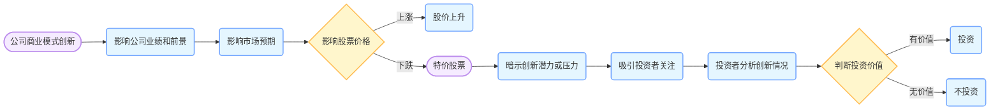

# 特价股票与公司商业模式创新的关联性研究

> 关键词：特价股票、公司商业模式创新、关联性、股票估值、企业发展策略

> 摘要：本文聚焦于特价股票与公司商业模式创新之间的关联性。通过深入剖析特价股票的形成机制和公司商业模式创新的核心要素，运用数学模型、算法原理以及实际案例，全面探讨两者之间的相互影响和内在联系。旨在为投资者提供决策参考，帮助企业更好地制定商业模式创新策略以提升股票价值，同时揭示该领域的未来发展趋势与面临的挑战。

## 1. 背景介绍 
### 1.1 目的和范围
本研究的目的在于深入探究特价股票与公司商业模式创新之间的关联，明确商业模式创新如何影响股票价格形成特价，以及特价股票背后反映出的公司商业模式创新潜力和问题。研究范围涵盖不同行业的上市公司，分析它们在商业模式创新过程中股票价格的波动情况，以及特价股票所对应的公司商业模式特征。

### 1.2 预期读者
本文预期读者包括股票投资者、金融分析师、企业管理者以及对商业模式创新和金融市场感兴趣的研究人员。投资者可以从本文中获取关于特价股票投资价值和风险的分析，为投资决策提供依据；金融分析师能够借鉴本文的研究方法和结论，进行更深入的市场分析；企业管理者可以了解商业模式创新对股票价格的影响，从而优化企业发展战略；研究人员则可以将本文作为进一步研究的基础。

### 1.3 文档结构概述
本文首先介绍核心概念与联系，阐述特价股票和公司商业模式创新的定义、原理及相互关系，并通过文本示意图和 Mermaid 流程图展示。接着详细讲解核心算法原理和具体操作步骤，运用 Python 代码进行阐述。然后介绍数学模型和公式，并结合具体例子说明。在项目实战部分，通过实际案例展示开发环境搭建、源代码实现及代码解读。之后分析实际应用场景，推荐相关工具和资源。最后总结未来发展趋势与挑战，解答常见问题，并提供扩展阅读和参考资料。

### 1.4 术语表
#### 1.4.1 核心术语定义
- **特价股票**：指在股票市场中，价格相对其内在价值或同行业其他股票价格明显偏低的股票。这种低价可能是由于市场短期波动、公司负面事件、行业竞争等多种因素导致。
- **公司商业模式创新**：公司对其运营模式、盈利方式、客户价值主张等方面进行根本性的变革和重新设计，以适应市场变化、提高竞争力和创造新的价值。

#### 1.4.2 相关概念解释
- **股票内在价值**：是指股票未来预期现金流的现值，通过对公司的财务状况、盈利能力、发展前景等因素进行综合评估得出。
- **商业模式要素**：包括客户细分、价值主张、渠道通路、客户关系、收入来源、核心资源、关键业务、重要合作和成本结构等。

#### 1.4.3 缩略词列表
- **DCF**：Discounted Cash Flow，折现现金流，一种用于评估股票内在价值的方法。
- **PE**：Price-to-Earnings Ratio，市盈率，股票价格与每股收益的比率，反映市场对公司盈利的预期。

## 2. 核心概念与联系 

### 2.1 特价股票的原理
特价股票的形成通常与市场供需关系、投资者情绪、公司基本面变化等因素有关。从市场供需角度来看，如果某只股票的供给突然增加，而需求相对不足，就会导致股价下跌形成特价。投资者情绪也会对股价产生重要影响，当市场出现恐慌情绪时，投资者可能会过度抛售股票，使股价偏离其内在价值。公司基本面的变化，如业绩下滑、重大负面事件等，也会使投资者对公司未来发展预期降低，从而导致股价下跌。

### 2.2 公司商业模式创新的原理
公司商业模式创新的核心在于创造新的价值。通过重新定义客户细分、提供独特的价值主张、优化渠道通路等方式，公司可以开拓新的市场、提高客户满意度和忠诚度，从而增加收入和利润。例如，互联网企业通过免费增值模式，先为用户提供基础免费服务，吸引大量用户，然后通过增值服务实现盈利。

### 2.3 两者的联系
公司商业模式创新可能会导致股票价格的波动。如果创新成功，公司的盈利能力和发展前景将得到提升，市场对公司的预期也会提高，从而推动股价上涨。相反，如果创新失败，公司可能会面临巨大的成本压力和市场风险，股价可能会下跌形成特价。另一方面，特价股票可能暗示公司正在进行商业模式创新或面临创新的压力。一些具有创新潜力但暂时被市场低估的公司，其股票可能成为特价股票。投资者可以通过分析公司的商业模式创新情况，判断特价股票是否具有投资价值。

### 2.4 文本示意图
特价股票与公司商业模式创新的关系可以用以下文本示意图表示：

公司商业模式创新 -- 影响公司业绩和发展前景 -- 影响市场预期 -- 影响股票价格 -- 形成特价股票或推动股价上涨

特价股票 -- 可能暗示公司商业模式创新潜力或面临创新压力 -- 吸引投资者关注 -- 投资者分析公司商业模式创新情况 -- 判断投资价值

### 2.5 Mermaid 流程图


## 3. 核心算法原理 & 具体操作步骤 

### 3.1 股票内在价值评估算法
股票内在价值评估是判断股票是否为特价股票的重要依据。常用的方法是折现现金流（DCF）法。

#### 3.1.1 算法原理
DCF 法的基本原理是将股票未来预期的现金流折现到当前时刻，得到股票的内在价值。其公式为：

$$V = \sum_{t=1}^{n} \frac{CF_t}{(1 + r)^t} + \frac{TV}{(1 + r)^n}$$

其中，$V$ 表示股票的内在价值，$CF_t$ 表示第 $t$ 期的现金流，$r$ 表示折现率，$n$ 表示预测期数，$TV$ 表示终值。

#### 3.1.2 Python 代码实现
```python
import numpy as np

def dcf_valuation(cash_flows, discount_rate, terminal_value, years):
    present_values = []
    for t in range(1, years + 1):
        present_value = cash_flows[t - 1] / ((1 + discount_rate) ** t)
        present_values.append(present_value)
    terminal_present_value = terminal_value / ((1 + discount_rate) ** years)
    intrinsic_value = np.sum(present_values) + terminal_present_value
    return intrinsic_value

# 示例参数
cash_flows = [100, 120, 150, 180, 200]  # 未来 5 年的现金流
discount_rate = 0.1  # 折现率为 10%
terminal_value = 3000  # 终值
years = 5  # 预测期数

intrinsic_value = dcf_valuation(cash_flows, discount_rate, terminal_value, years)
print(f"股票的内在价值为: {intrinsic_value}")
```

### 3.2 商业模式创新评估算法
评估公司商业模式创新可以从多个维度进行，如创新投入、创新成果、市场反应等。这里我们采用综合评分法。

#### 3.2.1 算法原理
综合评分法是根据多个评估指标对公司商业模式创新进行评分，每个指标赋予一定的权重，最后将各指标得分加权求和得到综合评分。

#### 3.2.2 Python 代码实现
```python
def innovation_score(innovation_input_score, innovation_output_score, market_response_score):
    weights = [0.3, 0.4, 0.3]  # 各指标权重
    scores = [innovation_input_score, innovation_output_score, market_response_score]
    total_score = np.dot(weights, scores)
    return total_score

# 示例得分
innovation_input_score = 80
innovation_output_score = 85
market_response_score = 90

score = innovation_score(innovation_input_score, innovation_output_score, market_response_score)
print(f"公司商业模式创新综合评分为: {score}")
```

### 3.3 关联性分析算法
通过计算特价股票与公司商业模式创新综合评分之间的相关性，可以分析两者之间的关联程度。常用的方法是皮尔逊相关系数。

#### 3.3.1 算法原理
皮尔逊相关系数用于衡量两个变量之间的线性相关程度，其取值范围为 $[-1, 1]$。当相关系数为 1 时，表示两个变量完全正相关；当相关系数为 -1 时，表示两个变量完全负相关；当相关系数为 0 时，表示两个变量之间不存在线性相关关系。

#### 3.3.2 Python 代码实现
```python
from scipy.stats import pearsonr

# 示例数据
stock_prices = [10, 12, 15, 18, 20]  # 特价股票价格
innovation_scores = [70, 75, 80, 85, 90]  # 公司商业模式创新综合评分

correlation, p_value = pearsonr(stock_prices, innovation_scores)
print(f"特价股票与公司商业模式创新的皮尔逊相关系数为: {correlation}")
print(f"p 值为: {p_value}")
```

## 4. 数学模型和公式 & 详细讲解 & 举例说明 

### 4.1 股票内在价值评估模型
#### 4.1.1 公式
$$V = \sum_{t=1}^{n} \frac{CF_t}{(1 + r)^t} + \frac{TV}{(1 + r)^n}$$

#### 4.1.2 详细讲解
- $CF_t$：第 $t$ 期的现金流，是公司在未来第 $t$ 年预计产生的现金流入减去现金流出的净额。现金流的预测需要考虑公司的业务模式、市场需求、竞争状况等因素。
- $r$：折现率，反映了投资者对资金时间价值和投资风险的要求。折现率通常根据市场利率、公司的风险水平等因素确定。
- $n$：预测期数，是对公司未来现金流进行预测的年数。预测期数的选择需要根据公司的行业特点、发展阶段等因素确定。
- $TV$：终值，是预测期结束后公司的价值。终值的计算通常采用永续增长模型，即假设公司在预测期结束后以一个固定的增长率持续增长。

#### 4.1.3 举例说明
假设一家公司未来 5 年的现金流分别为 100 万元、120 万元、150 万元、180 万元和 200 万元，折现率为 10%，预测期结束后公司的终值为 3000 万元。则该公司股票的内在价值为：

$$
\begin{align*}
V &= \frac{100}{(1 + 0.1)^1} + \frac{120}{(1 + 0.1)^2} + \frac{150}{(1 + 0.1)^3} + \frac{180}{(1 + 0.1)^4} + \frac{200}{(1 + 0.1)^5} + \frac{3000}{(1 + 0.1)^5}\\
&= 90.91 + 99.17 + 112.70 + 122.94 + 124.18 + 1862.76\\
&= 2312.66 \text{（万元）}
\end{align*}
$$

### 4.2 商业模式创新评估模型
#### 4.2.1 公式
$$S = w_1S_1 + w_2S_2 + w_3S_3$$

其中，$S$ 表示公司商业模式创新综合评分，$w_1$、$w_2$、$w_3$ 分别表示创新投入、创新成果、市场反应三个指标的权重，$S_1$、$S_2$、$S_3$ 分别表示三个指标的得分。

#### 4.2.2 详细讲解
- 创新投入指标：可以用研发费用占营业收入的比例、研发人员占总员工数的比例等指标来衡量。创新投入越高，说明公司对商业模式创新的重视程度越高。
- 创新成果指标：可以用专利数量、新产品销售收入占比等指标来衡量。创新成果越多，说明公司的商业模式创新取得了较好的效果。
- 市场反应指标：可以用市场份额增长率、客户满意度等指标来衡量。市场反应越好，说明公司的商业模式创新得到了市场的认可。

#### 4.2.3 举例说明
假设创新投入、创新成果、市场反应三个指标的权重分别为 0.3、0.4、0.3，某公司这三个指标的得分分别为 80 分、85 分、90 分。则该公司商业模式创新综合评分为：

$$S = 0.3 \times 80 + 0.4 \times 85 + 0.3 \times 90 = 24 + 34 + 27 = 85 \text{（分）}$$

### 4.3 关联性分析模型
#### 4.3.1 公式
$$r_{xy} = \frac{\sum_{i=1}^{n} (x_i - \bar{x})(y_i - \bar{y})}{\sqrt{\sum_{i=1}^{n} (x_i - \bar{x})^2 \sum_{i=1}^{n} (y_i - \bar{y})^2}}$$

其中，$r_{xy}$ 表示变量 $x$ 和 $y$ 的皮尔逊相关系数，$x_i$ 和 $y_i$ 分别表示变量 $x$ 和 $y$ 的第 $i$ 个观测值，$\bar{x}$ 和 $\bar{y}$ 分别表示变量 $x$ 和 $y$ 的均值，$n$ 表示观测值的数量。

#### 4.3.2 详细讲解
皮尔逊相关系数通过计算两个变量的协方差与它们标准差的乘积的比值来衡量它们之间的线性相关程度。协方差反映了两个变量的变化趋势是否一致，标准差反映了变量的离散程度。

#### 4.3.3 举例说明
假设我们有 5 只特价股票的价格和对应的公司商业模式创新综合评分数据如下：

| 股票编号 | 股票价格（元） | 商业模式创新综合评分（分） |
| ---- | ---- | ---- |
| 1 | 10 | 70 |
| 2 | 12 | 75 |
| 3 | 15 | 80 |
| 4 | 18 | 85 |
| 5 | 20 | 90 |

首先计算股票价格和商业模式创新综合评分的均值：

$$\bar{x} = \frac{10 + 12 + 15 + 18 + 20}{5} = 15$$

$$\bar{y} = \frac{70 + 75 + 80 + 85 + 90}{5} = 80$$

然后计算分子和分母：

$$
\begin{align*}
\sum_{i=1}^{5} (x_i - \bar{x})(y_i - \bar{y}) &= (10 - 15)(70 - 80) + (12 - 15)(75 - 80) + (15 - 15)(80 - 80) + (18 - 15)(85 - 80) + (20 - 15)(90 - 80)\\
&= (-5)(-10) + (-3)(-5) + 0 + 3 \times 5 + 5 \times 10\\
&= 50 + 15 + 0 + 15 + 50\\
&= 130
\end{align*}
$$

$$
\begin{align*}
\sum_{i=1}^{5} (x_i - \bar{x})^2 &= (10 - 15)^2 + (12 - 15)^2 + (15 - 15)^2 + (18 - 15)^2 + (20 - 15)^2\\
&= 25 + 9 + 0 + 9 + 25\\
&= 68
\end{align*}
$$

$$
\begin{align*}
\sum_{i=1}^{5} (y_i - \bar{y})^2 &= (70 - 80)^2 + (75 - 80)^2 + (80 - 80)^2 + (85 - 80)^2 + (90 - 80)^2\\
&= 100 + 25 + 0 + 25 + 100\\
&= 250
\end{align*}
$$

最后计算皮尔逊相关系数：

$$r_{xy} = \frac{130}{\sqrt{68 \times 250}} \approx 0.98$$

说明特价股票价格与公司商业模式创新综合评分之间存在很强的正相关关系。

## 5. 项目实战：代码实际案例和详细解释说明 

### 5.1  开发环境搭建
#### 5.1.1 安装 Python
首先需要安装 Python 开发环境，建议使用 Python 3.7 及以上版本。可以从 Python 官方网站（https://www.python.org/downloads/）下载适合自己操作系统的安装包进行安装。

#### 5.1.2 安装必要的库
使用以下命令安装本项目所需的库：
```sh
pip install numpy scipy
```

### 5.2  源代码详细实现和代码解读
#### 5.2.1 股票内在价值评估代码
```python
import numpy as np

def dcf_valuation(cash_flows, discount_rate, terminal_value, years):
    present_values = []
    for t in range(1, years + 1):
        present_value = cash_flows[t - 1] / ((1 + discount_rate) ** t)
        present_values.append(present_value)
    terminal_present_value = terminal_value / ((1 + discount_rate) ** years)
    intrinsic_value = np.sum(present_values) + terminal_present_value
    return intrinsic_value

# 示例参数
cash_flows = [100, 120, 150, 180, 200]  # 未来 5 年的现金流
discount_rate = 0.1  # 折现率为 10%
terminal_value = 3000  # 终值
years = 5  # 预测期数

intrinsic_value = dcf_valuation(cash_flows, discount_rate, terminal_value, years)
print(f"股票的内在价值为: {intrinsic_value}")
```
代码解读：
- `dcf_valuation` 函数接受四个参数：`cash_flows` 表示未来各期的现金流，`discount_rate` 表示折现率，`terminal_value` 表示终值，`years` 表示预测期数。
- 在函数内部，使用循环计算每一期现金流的现值，并将其存储在 `present_values` 列表中。
- 计算终值的现值 `terminal_present_value`。
- 将各期现金流的现值和终值的现值相加，得到股票的内在价值 `intrinsic_value`。

#### 5.2.2 商业模式创新评估代码
```python
def innovation_score(innovation_input_score, innovation_output_score, market_response_score):
    weights = [0.3, 0.4, 0.3]  # 各指标权重
    scores = [innovation_input_score, innovation_output_score, market_response_score]
    total_score = np.dot(weights, scores)
    return total_score

# 示例得分
innovation_input_score = 80
innovation_output_score = 85
market_response_score = 90

score = innovation_score(innovation_input_score, innovation_output_score, market_response_score)
print(f"公司商业模式创新综合评分为: {score}")
```
代码解读：
- `innovation_score` 函数接受三个参数：`innovation_input_score` 表示创新投入指标得分，`innovation_output_score` 表示创新成果指标得分，`market_response_score` 表示市场反应指标得分。
- 定义各指标的权重 `weights`。
- 将各指标得分存储在 `scores` 列表中。
- 使用 `np.dot` 函数计算加权和，得到公司商业模式创新综合评分 `total_score`。

#### 5.2.3 关联性分析代码
```python
from scipy.stats import pearsonr

# 示例数据
stock_prices = [10, 12, 15, 18, 20]  # 特价股票价格
innovation_scores = [70, 75, 80, 85, 90]  # 公司商业模式创新综合评分

correlation, p_value = pearsonr(stock_prices, innovation_scores)
print(f"特价股票与公司商业模式创新的皮尔逊相关系数为: {correlation}")
print(f"p 值为: {p_value}")
```
代码解读：
- 导入 `pearsonr` 函数用于计算皮尔逊相关系数。
- 定义示例数据 `stock_prices` 和 `innovation_scores`。
- 调用 `pearsonr` 函数计算相关系数 `correlation` 和 p 值 `p_value`。
- 打印相关系数和 p 值。

### 5.3  代码解读与分析
通过上述代码，我们可以实现对股票内在价值的评估、公司商业模式创新的评估以及两者之间关联性的分析。股票内在价值评估代码基于折现现金流法，能够帮助我们判断股票是否被低估或高估。商业模式创新评估代码通过综合评分法，对公司的商业模式创新进行量化评估。关联性分析代码使用皮尔逊相关系数，分析特价股票与公司商业模式创新之间的线性相关程度。这些代码可以为投资者和企业管理者提供有价值的决策依据。

## 6. 实际应用场景 
### 6.1 投资者决策
投资者可以利用本文的研究方法和模型，筛选出具有投资价值的特价股票。通过评估公司的商业模式创新情况，判断股票价格的低估是否是由于公司正在进行有潜力的商业模式创新导致的。如果是，投资者可以在股票价格较低时买入，等待公司商业模式创新取得成功，股价上涨后获利。

### 6.2 企业战略制定
企业管理者可以通过分析特价股票与商业模式创新的关联性，了解市场对公司商业模式创新的反应。如果公司股票成为特价股票，管理者可以反思商业模式创新策略是否存在问题，及时调整创新方向和重点。同时，企业也可以根据市场对创新的需求，加大商业模式创新投入，提升公司的竞争力和股票价值。

### 6.3 金融分析师研究
金融分析师可以运用本文的方法和模型，对不同行业的上市公司进行研究和分析。通过比较不同公司的商业模式创新水平和股票价格表现，为投资者提供专业的投资建议。同时，分析师还可以关注行业内的商业模式创新趋势，预测未来的市场变化。

## 7. 工具和资源推荐
### 7.1 学习资源推荐
#### 7.1.1 书籍推荐
- 《商业模式新生代》：本书介绍了商业模式的基本概念、设计方法和创新策略，通过大量的案例和图表，帮助读者理解和应用商业模式创新。
- 《聪明的投资者》：价值投资领域的经典著作，介绍了股票投资的基本原理和方法，包括如何评估股票的内在价值和选择有投资价值的股票。
- 《金融市场与金融机构》：系统介绍了金融市场和金融机构的基本概念、运作机制和风险管理，为读者提供了金融领域的基础知识。

#### 7.1.2 在线课程
- Coursera 上的“Financial Markets”：由耶鲁大学教授 Robert Shiller 授课，介绍了金融市场的基本原理、资产定价模型和风险管理等内容。
- edX 上的“Introduction to Python Programming”：适合初学者学习 Python 编程语言，掌握基本的编程语法和数据处理方法。
- Udemy 上的“Investment Banking: Valuation, LBO, M&A”：介绍了投资银行的估值方法、杠杆收购和并购交易等内容，对于金融从业者和投资者有很大的帮助。

#### 7.1.3 技术博客和网站
- Seeking Alpha：提供股票市场分析、投资建议和公司研究报告等内容，是投资者获取信息和交流的重要平台。
- Medium：有很多金融和技术领域的博主分享自己的经验和见解，可以帮助读者了解最新的行业动态和研究成果。
- Python 官方文档：是学习 Python 编程语言的权威资料，提供了详细的语法说明和示例代码。

### 7.2 开发工具框架推荐
#### 7.2.1 IDE和编辑器
- PyCharm：一款专业的 Python 集成开发环境，提供了代码编辑、调试、版本控制等功能，适合开发大型 Python 项目。
- Jupyter Notebook：一种交互式的开发环境，支持 Python、R 等多种编程语言，适合数据分析和机器学习项目的开发。
- Visual Studio Code：一款轻量级的代码编辑器，支持多种编程语言和插件扩展，适合快速开发和调试代码。

#### 7.2.2 调试和性能分析工具
- pdb：Python 内置的调试器，可以帮助开发者定位和解决代码中的问题。
- cProfile：Python 内置的性能分析工具，可以分析代码的运行时间和函数调用情况，帮助开发者优化代码性能。
- Py-Spy：一款跨平台的 Python 性能分析工具，可以实时监测 Python 程序的性能，找出性能瓶颈。

#### 7.2.3 相关框架和库
- NumPy：Python 中用于科学计算的基础库，提供了高效的数组操作和数学函数。
- Pandas：用于数据处理和分析的库，提供了 DataFrame 和 Series 等数据结构，方便进行数据清洗、转换和分析。
- Scikit-learn：用于机器学习的库，提供了各种机器学习算法和工具，如分类、回归、聚类等。

### 7.3 相关论文著作推荐
#### 7.3.1 经典论文
- “The Capital Asset Pricing Model: Theory and Evidence”：由 Eugene F. Fama 和 Kenneth R. French 撰写，介绍了资本资产定价模型的理论和实证研究，是金融领域的经典论文之一。
- “The Theory of the Growth of the Firm”：由 Edith Penrose 撰写，提出了企业成长理论，对企业战略和商业模式创新有重要的启示。
- “The Innovator's Dilemma: When New Technologies Cause Great Firms to Fail”：由 Clayton M. Christensen 撰写，探讨了创新对企业的影响，提出了颠覆性创新的概念。

#### 7.3.2 最新研究成果
- 关注《Journal of Financial Economics》、《Management Science》等学术期刊，这些期刊发表了很多关于金融市场、企业管理和商业模式创新的最新研究成果。
- 参加相关的学术会议，如美国金融协会（AFA）年会、管理科学协会（INFORMS）年会等，了解最新的研究动态和前沿问题。

#### 7.3.3 应用案例分析
- 《哈佛商业评论》：发表了很多企业商业模式创新的案例分析，通过实际案例介绍了不同行业的企业如何进行商业模式创新，以及创新带来的影响和挑战。
- 各大咨询公司的研究报告，如麦肯锡、波士顿咨询集团等，提供了很多行业分析和企业案例，对于了解行业趋势和企业实践有很大的帮助。

## 8. 总结：未来发展趋势与挑战
### 8.1 未来发展趋势
#### 8.1.1 技术驱动的商业模式创新
随着人工智能、大数据、区块链等技术的不断发展，企业将越来越多地利用这些技术进行商业模式创新。例如，人工智能可以帮助企业实现精准营销和个性化服务，大数据可以为企业提供决策支持和风险预警，区块链可以实现供应链金融和数据共享等。

#### 8.1.2 跨界融合的商业模式创新
不同行业之间的界限将越来越模糊，企业将通过跨界融合的方式进行商业模式创新。例如，传统制造业企业可以与互联网企业合作，开展智能制造和工业互联网业务；金融企业可以与科技企业合作，推出金融科技产品和服务。

#### 8.1.3 可持续发展的商业模式创新
随着社会对环境保护和社会责任的关注度不断提高，企业将越来越注重可持续发展的商业模式创新。例如，企业可以通过开发绿色产品和服务、采用循环经济模式等方式，实现经济效益和社会效益的双赢。

### 8.2 挑战
#### 8.2.1 技术创新的不确定性
技术创新具有很大的不确定性，企业在进行商业模式创新时，可能会面临技术难题、市场接受度低等问题。例如，一些新兴技术可能需要较长的时间才能成熟和应用，企业在投入大量资源进行研发后，可能无法获得预期的回报。

#### 8.2.2 市场竞争的加剧
随着商业模式创新的不断涌现，市场竞争将越来越激烈。企业需要不断提升自身的创新能力和竞争力，才能在市场中立足。同时，企业还需要应对来自竞争对手的模仿和挑战，保护自己的创新成果。

#### 8.2.3 法律法规的限制
商业模式创新可能会涉及到一些法律法规的问题，如数据隐私保护、知识产权保护等。企业在进行商业模式创新时，需要遵守相关的法律法规，避免违法行为带来的风险。

## 9. 附录：常见问题与解答
### 9.1 如何确定股票的内在价值？
股票的内在价值可以通过多种方法进行评估，如折现现金流法、市盈率法、市净率法等。折现现金流法是最常用的方法之一，它通过预测股票未来的现金流，并将其折现到当前时刻，得到股票的内在价值。在使用折现现金流法时，需要对未来现金流、折现率和终值等参数进行合理的估计。

### 9.2 商业模式创新评估指标如何选择？
商业模式创新评估指标的选择需要根据企业的行业特点、发展阶段和创新目标等因素来确定。一般来说，可以从创新投入、创新成果、市场反应等维度选择指标。创新投入指标可以用研发费用占营业收入的比例、研发人员占总员工数的比例等；创新成果指标可以用专利数量、新产品销售收入占比等；市场反应指标可以用市场份额增长率、客户满意度等。

### 9.3 特价股票一定具有投资价值吗？
特价股票不一定具有投资价值。特价股票的形成可能是由于多种因素导致的，如市场短期波动、公司负面事件、行业竞争等。在投资特价股票时，需要对公司的基本面和商业模式创新情况进行深入分析，判断股票价格的低估是否是由于公司具有潜在的投资价值。如果公司存在严重的经营问题或商业模式创新失败的风险，那么特价股票可能并不具有投资价值。

### 9.4 如何提高公司的商业模式创新能力？
提高公司的商业模式创新能力可以从以下几个方面入手：
- 培养创新文化：营造鼓励创新、容忍失败的企业文化，激发员工的创新积极性。
- 加强研发投入：加大对研发的投入，吸引优秀的研发人才，提高公司的技术创新能力。
- 关注市场变化：及时了解市场需求和竞争态势的变化，调整公司的商业模式。
- 开展合作创新：与其他企业、高校、科研机构等开展合作，共同进行商业模式创新。

## 10. 扩展阅读 & 参考资料
### 10.1 扩展阅读
- 《创新者的解答》：由 Clayton M. Christensen 撰写，进一步探讨了企业如何应对颠覆性创新，提供了具体的策略和方法。
- 《金融炼金术》：由 George Soros 撰写，介绍了作者的投资理念和方法，以及对金融市场的独特见解。
- 《指数基金投资指南》：由银行螺丝钉撰写，介绍了指数基金的投资原理和方法，适合普通投资者学习。

### 10.2 参考资料
- 上市公司的年报、季报等财务报告，这些报告可以提供公司的财务状况、经营业绩等信息。
- 证券交易所的官方网站，如上海证券交易所、深圳证券交易所等，提供了股票市场的行情数据和相关信息。
- 金融数据提供商，如 Wind、东方财富等，提供了丰富的金融数据和分析工具。

作者：AI天才研究院/AI Genius Institute & 禅与计算机程序设计艺术 /Zen And The Art of Computer Programming