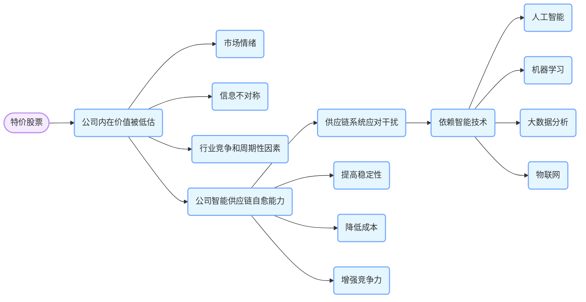

# 特价股票与公司智能供应链自愈能力的关系探讨

> 关键词：特价股票、公司智能供应链、自愈能力、供应链管理、股票价值评估

> 摘要：本文旨在深入探讨特价股票与公司智能供应链自愈能力之间的关系。通过对核心概念的阐述、算法原理的分析、数学模型的构建以及实际案例的研究，揭示两者之间潜在的联系和影响机制。同时，提供了在该领域进行研究和实践所需的工具、资源推荐，对未来发展趋势和挑战进行了总结，为投资者和企业管理者提供有价值的参考和决策依据。

## 1. 背景介绍 
### 1.1 目的和范围
本研究的主要目的是全面分析特价股票与公司智能供应链自愈能力之间的内在联系。通过探讨这种关系，帮助投资者更准确地评估股票的价值和潜在风险，同时为企业管理者提供改进供应链管理的思路，以增强公司的竞争力和市场价值。研究范围涵盖了特价股票的定义、成因，公司智能供应链自愈能力的概念、评估方法，以及两者之间相互作用的机制和影响。

### 1.2 预期读者
本文的预期读者包括投资者、金融分析师、企业管理者、供应链专家以及对股票市场和供应链管理感兴趣的研究人员。投资者可以从本文中获取关于如何利用公司供应链信息进行股票投资决策的方法和建议；金融分析师可以借鉴文中的分析框架和方法，提高对股票的分析和评估能力；企业管理者可以了解智能供应链自愈能力对公司市场价值的影响，从而优化供应链管理策略；供应链专家可以从股票市场的角度深入研究供应链管理的重要性和发展方向；研究人员可以将本文作为进一步研究的基础，拓展相关领域的学术研究。

### 1.3 文档结构概述
本文将按照以下结构进行阐述：首先介绍核心概念，包括特价股票和公司智能供应链自愈能力的定义和相关联系；接着详细讲解核心算法原理和具体操作步骤，通过 Python 代码进行示例；然后构建数学模型和公式，对两者关系进行量化分析，并举例说明；之后通过实际项目案例，展示如何在实际中应用相关理论和方法；再探讨实际应用场景，说明两者关系在不同领域的应用价值；提供工具和资源推荐，帮助读者进一步学习和实践；最后总结未来发展趋势和挑战，并解答常见问题，提供扩展阅读和参考资料。

### 1.4 术语表
#### 1.4.1 核心术语定义
- **特价股票**：指市场价格明显低于其内在价值的股票。这种价格差异可能是由于市场短期波动、投资者情绪、公司短期负面事件等因素导致，但公司本身具有一定的发展潜力和价值。
- **公司智能供应链自愈能力**：指公司的供应链系统在面临各种内外部干扰和风险时，能够通过智能技术和自动化手段，快速识别问题、调整运营策略、恢复正常运作，并在一定程度上优化供应链绩效的能力。

#### 1.4.2 相关概念解释
- **供应链管理**：是对供应链中的物流、信息流和资金流进行计划、组织、协调和控制的过程，旨在提高供应链的效率和效益，满足客户需求。
- **智能技术**：包括人工智能、机器学习、大数据分析、物联网等技术，这些技术可以使供应链系统更加智能化、自动化和自适应。
- **供应链自愈**：强调供应链在遭受破坏或干扰后，能够自动恢复到正常状态的能力，类似于生物体的自愈功能。

#### 1.4.3 缩略词列表
- **AI**：Artificial Intelligence，人工智能
- **ML**：Machine Learning，机器学习
- **IoT**：Internet of Things，物联网
- **SCM**：Supply Chain Management，供应链管理

## 2. 核心概念与联系 

### 2.1 特价股票的概念和成因
特价股票通常是指那些在市场上被低估的股票，其市场价格低于其内在价值。内在价值是指根据公司的基本面分析，如财务状况、盈利能力、市场竞争力等因素所估算出的股票价值。特价股票的成因主要包括以下几个方面：
- **市场情绪影响**：投资者的恐慌、贪婪等情绪会导致股票价格的过度波动。当市场整体下跌或公司出现短期负面消息时，投资者可能会过度抛售股票，导致股价低于其实际价值。
- **信息不对称**：部分投资者可能无法获取公司的全部信息，或者对公司的信息解读存在偏差。这可能导致一些具有潜在价值的公司股票被低估。
- **行业竞争和周期性因素**：某些行业可能面临激烈的竞争或周期性波动，导致公司的短期业绩不佳，从而使股票价格下跌。但如果公司具有较强的竞争力和适应能力，其股票可能被低估。

### 2.2 公司智能供应链自愈能力的概念和重要性
公司智能供应链自愈能力是指公司的供应链系统在面对各种内外部干扰时，能够迅速做出反应，自动调整运营策略，恢复正常运作，并在一定程度上优化供应链绩效的能力。这种能力主要依赖于智能技术的应用，如人工智能、机器学习、大数据分析和物联网等。

智能供应链自愈能力的重要性体现在以下几个方面：
- **提高供应链的稳定性**：能够快速应对供应链中的各种风险和干扰，如自然灾害、供应商故障、需求波动等，减少供应链中断的时间和影响，保证产品的供应和交付。
- **降低成本**：通过优化供应链流程、提高库存管理效率、减少浪费等方式，降低供应链的运营成本。
- **增强企业竞争力**：能够及时响应客户需求，提供高质量的产品和服务，提高客户满意度，从而增强企业在市场中的竞争力。

### 2.3 特价股票与公司智能供应链自愈能力的联系
特价股票与公司智能供应链自愈能力之间存在着密切的联系。具有较强智能供应链自愈能力的公司，在面对各种风险和挑战时，能够更好地保持供应链的稳定和高效运作，从而保证公司的盈利能力和市场竞争力。这可能使得公司的实际价值高于其当前的市场价格，导致股票被低估，成为特价股票。

另一方面，市场对公司智能供应链自愈能力的认知和评估也会影响股票价格。如果市场未能充分认识到公司的智能供应链自愈能力，或者对其评估不足，可能会导致股票价格低于其内在价值。因此，投资者可以通过分析公司的智能供应链自愈能力，来发现潜在的特价股票。

### 2.4 核心概念原理和架构的文本示意图
```plaintext
特价股票 <-- 公司内在价值被低估
            |
            | 受多种因素影响
            |
            |-- 市场情绪
            |-- 信息不对称
            |-- 行业竞争和周期性因素
            |
            | 与公司智能供应链自愈能力相关
            |
公司智能供应链自愈能力 <-- 供应链系统应对干扰
            |
            | 依赖智能技术
            |
            |-- 人工智能
            |-- 机器学习
            |-- 大数据分析
            |-- 物联网
            |
            | 带来多种优势
            |
            |-- 提高稳定性
            |-- 降低成本
            |-- 增强竞争力
```

### 2.5 Mermaid 流程图


## 3. 核心算法原理 & 具体操作步骤 

### 3.1 评估公司智能供应链自愈能力的算法原理
评估公司智能供应链自愈能力可以采用多指标综合评价法。该方法通过选取多个与智能供应链自愈能力相关的指标，对每个指标进行量化评分，然后根据各指标的权重计算综合得分，以此来评估公司的智能供应链自愈能力。

以下是一个简化的 Python 代码示例，用于说明该算法的实现过程：

```python
# 定义各指标及其权重
indicators = {
    "供应链透明度": 0.2,
    "响应速度": 0.3,
    "恢复能力": 0.2,
    "优化能力": 0.3
}

# 定义公司各指标的得分
company_scores = {
    "供应链透明度": 80,
    "响应速度": 70,
    "恢复能力": 75,
    "优化能力": 85
}

# 计算综合得分
total_score = 0
for indicator, weight in indicators.items():
    score = company_scores[indicator]
    total_score += score * weight

print(f"公司智能供应链自愈能力综合得分: {total_score}")
```

### 3.2 分析特价股票与智能供应链自愈能力关系的算法原理
为了分析特价股票与智能供应链自愈能力之间的关系，可以采用回归分析方法。该方法通过建立股票价格与智能供应链自愈能力得分之间的回归模型，来评估两者之间的相关性和影响程度。

以下是一个简单的 Python 代码示例，使用`scikit-learn`库进行线性回归分析：

```python
import numpy as np
from sklearn.linear_model import LinearRegression

# 假设已经有了一组公司的智能供应链自愈能力得分和对应的股票价格数据
scores = np.array([70, 75, 80, 85, 90]).reshape(-1, 1)
prices = np.array([10, 12, 15, 18, 20])

# 创建线性回归模型
model = LinearRegression()

# 拟合模型
model.fit(scores, prices)

# 输出模型参数
print(f"截距: {model.intercept_}")
print(f"斜率: {model.coef_[0]}")

# 预测一个新的智能供应链自愈能力得分对应的股票价格
new_score = np.array([82]).reshape(-1, 1)
predicted_price = model.predict(new_score)
print(f"预测的股票价格: {predicted_price[0]}")
```

### 3.3 具体操作步骤
#### 3.3.1 数据收集
- 收集公司的财务数据、供应链运营数据、股票价格数据等。
- 对于智能供应链自愈能力相关指标，需要通过问卷调查、实地调研、数据分析等方式获取。

#### 3.3.2 数据预处理
- 对收集到的数据进行清洗，去除缺失值、异常值等。
- 对数据进行标准化处理，使不同指标的数据具有可比性。

#### 3.3.3 指标评分和综合得分计算
- 根据预先设定的指标体系和评分标准，对公司的各指标进行评分。
- 按照各指标的权重，计算公司的智能供应链自愈能力综合得分。

#### 3.3.4 回归分析
- 建立股票价格与智能供应链自愈能力得分之间的回归模型。
- 使用历史数据对模型进行拟合和训练。
- 评估模型的拟合效果和显著性。

#### 3.3.5 结果分析和决策
- 根据回归分析的结果，分析特价股票与智能供应链自愈能力之间的关系。
- 结合其他因素，如公司的基本面、行业前景等，做出投资决策。

## 4. 数学模型和公式 & 详细讲解 & 举例说明 

### 4.1 多指标综合评价模型
多指标综合评价模型用于评估公司的智能供应链自愈能力。假设我们选取了 $n$ 个指标 $x_1, x_2, \cdots, x_n$，每个指标的权重为 $w_1, w_2, \cdots, w_n$，且满足 $\sum_{i=1}^{n} w_i = 1$。公司在第 $i$ 个指标上的得分记为 $s_i$，则公司的智能供应链自愈能力综合得分 $S$ 可以表示为：

$$S = \sum_{i=1}^{n} w_i s_i$$

例如，假设我们选取了四个指标：供应链透明度、响应速度、恢复能力和优化能力，权重分别为 $0.2$、$0.3$、$0.2$ 和 $0.3$。某公司在这四个指标上的得分分别为 $80$、$70$、$75$ 和 $85$，则该公司的智能供应链自愈能力综合得分 $S$ 为：

$$S = 0.2 \times 80 + 0.3 \times 70 + 0.2 \times 75 + 0.3 \times 85 = 79.5$$

### 4.2 线性回归模型
线性回归模型用于分析特价股票与智能供应链自愈能力之间的关系。假设股票价格 $y$ 与智能供应链自愈能力得分 $x$ 之间存在线性关系，可以表示为：

$$y = \beta_0 + \beta_1 x + \epsilon$$

其中，$\beta_0$ 是截距，$\beta_1$ 是斜率，$\epsilon$ 是误差项，服从均值为 $0$、方差为 $\sigma^2$ 的正态分布。

我们可以使用最小二乘法来估计 $\beta_0$ 和 $\beta_1$ 的值。最小二乘法的目标是使观测值 $y_i$ 与预测值 $\hat{y}_i = \beta_0 + \beta_1 x_i$ 之间的误差平方和最小，即：

$$\min_{\beta_0, \beta_1} \sum_{i=1}^{m} (y_i - \beta_0 - \beta_1 x_i)^2$$

其中，$m$ 是样本数量。

通过求解上述最小化问题，可以得到 $\beta_0$ 和 $\beta_1$ 的估计值：

$$\hat{\beta}_1 = \frac{\sum_{i=1}^{m} (x_i - \bar{x})(y_i - \bar{y})}{\sum_{i=1}^{m} (x_i - \bar{x})^2}$$

$$\hat{\beta}_0 = \bar{y} - \hat{\beta}_1 \bar{x}$$

其中，$\bar{x}$ 和 $\bar{y}$ 分别是 $x$ 和 $y$ 的样本均值。

例如，假设我们有以下五个样本数据：

| 智能供应链自愈能力得分 $x$ | 股票价格 $y$ |
| --- | --- |
| 70 | 10 |
| 75 | 12 |
| 80 | 15 |
| 85 | 18 |
| 90 | 20 |

首先计算样本均值：

$$\bar{x} = \frac{70 + 75 + 80 + 85 + 90}{5} = 80$$

$$\bar{y} = \frac{10 + 12 + 15 + 18 + 20}{5} = 15$$

然后计算 $\hat{\beta}_1$：

$$\sum_{i=1}^{5} (x_i - \bar{x})(y_i - \bar{y}) = (70 - 80)(10 - 15) + (75 - 80)(12 - 15) + (80 - 80)(15 - 15) + (85 - 80)(18 - 15) + (90 - 80)(20 - 15) = 100$$

$$\sum_{i=1}^{5} (x_i - \bar{x})^2 = (70 - 80)^2 + (75 - 80)^2 + (80 - 80)^2 + (85 - 80)^2 + (90 - 80)^2 = 250$$

$$\hat{\beta}_1 = \frac{100}{250} = 0.4$$

最后计算 $\hat{\beta}_0$：

$$\hat{\beta}_0 = 15 - 0.4 \times 80 = -17$$

所以，回归方程为 $y = -17 + 0.4x$。

### 4.3 显著性检验
为了检验回归模型的显著性，我们可以进行 $t$ 检验和 $F$ 检验。

#### 4.3.1 $t$ 检验
$t$ 检验用于检验回归系数 $\beta_1$ 是否显著不为 $0$。$t$ 统计量的计算公式为：

$$t = \frac{\hat{\beta}_1}{SE(\hat{\beta}_1)}$$

其中，$SE(\hat{\beta}_1)$ 是 $\hat{\beta}_1$ 的标准误差。

在给定的显著性水平 $\alpha$ 下，如果 $|t| > t_{\alpha/2}(m - 2)$，则拒绝原假设 $H_0: \beta_1 = 0$，认为回归系数 $\beta_1$ 显著不为 $0$，即智能供应链自愈能力得分与股票价格之间存在显著的线性关系。

#### 4.3.2 $F$ 检验
$F$ 检验用于检验整个回归模型的显著性。$F$ 统计量的计算公式为：

$$F = \frac{SSR / 1}{SSE / (m - 2)}$$

其中，$SSR$ 是回归平方和，$SSE$ 是残差平方和。

在给定的显著性水平 $\alpha$ 下，如果 $F > F_{\alpha}(1, m - 2)$，则拒绝原假设 $H_0: \beta_1 = 0$，认为回归模型是显著的。

## 5. 项目实战：代码实际案例和详细解释说明 

### 5.1 开发环境搭建
#### 5.1.1 安装 Python
首先需要安装 Python 环境，建议使用 Python 3.7 及以上版本。可以从 Python 官方网站（https://www.python.org/downloads/）下载并安装适合自己操作系统的 Python 版本。

#### 5.1.2 安装必要的库
在安装好 Python 后，需要安装一些必要的库，如`numpy`、`pandas`、`scikit-learn`等。可以使用`pip`命令进行安装：

```bash
pip install numpy pandas scikit-learn
```

### 5.2 源代码详细实现和代码解读
以下是一个完整的 Python 代码示例，用于分析特价股票与公司智能供应链自愈能力之间的关系：

```python
import numpy as np
import pandas as pd
from sklearn.linear_model import LinearRegression
from sklearn.model_selection import train_test_split
from sklearn.metrics import mean_squared_error

# 生成示例数据
np.random.seed(42)
n_samples = 100
# 生成智能供应链自愈能力得分
scores = np.random.randint(60, 100, n_samples)
# 生成股票价格，添加一些噪声
prices = 0.5 * scores + 20 + np.random.normal(0, 5, n_samples)

# 创建 DataFrame
data = pd.DataFrame({
    "智能供应链自愈能力得分": scores,
    "股票价格": prices
})

# 划分训练集和测试集
X = data[["智能供应链自愈能力得分"]]
y = data["股票价格"]
X_train, X_test, y_train, y_test = train_test_split(X, y, test_size=0.2, random_state=42)

# 创建线性回归模型
model = LinearRegression()

# 拟合模型
model.fit(X_train, y_train)

# 输出模型参数
print(f"截距: {model.intercept_}")
print(f"斜率: {model.coef_[0]}")

# 在测试集上进行预测
y_pred = model.predict(X_test)

# 计算均方误差
mse = mean_squared_error(y_test, y_pred)
print(f"均方误差: {mse}")
```

### 5.3 代码解读与分析
#### 5.3.1 数据生成
```python
np.random.seed(42)
n_samples = 100
scores = np.random.randint(60, 100, n_samples)
prices = 0.5 * scores + 20 + np.random.normal(0, 5, n_samples)
```
这段代码生成了 100 个样本数据，其中智能供应链自愈能力得分是在 60 到 100 之间的随机整数，股票价格是根据智能供应链自愈能力得分线性生成的，并添加了一些随机噪声。

#### 5.3.2 数据处理
```python
data = pd.DataFrame({
    "智能供应链自愈能力得分": scores,
    "股票价格": prices
})
X = data[["智能供应链自愈能力得分"]]
y = data["股票价格"]
X_train, X_test, y_train, y_test = train_test_split(X, y, test_size=0.2, random_state=42)
```
这段代码将生成的数据转换为`pandas`的`DataFrame`格式，并将智能供应链自愈能力得分作为特征，股票价格作为目标变量。然后使用`train_test_split`函数将数据划分为训练集和测试集，测试集占总数据的 20%。

#### 5.3.3 模型训练
```python
model = LinearRegression()
model.fit(X_train, y_train)
```
这段代码创建了一个线性回归模型，并使用训练集数据对模型进行拟合。

#### 5.3.4 模型评估
```python
y_pred = model.predict(X_test)
mse = mean_squared_error(y_test, y_pred)
print(f"均方误差: {mse}")
```
这段代码使用训练好的模型对测试集数据进行预测，并计算预测结果与真实值之间的均方误差。均方误差越小，说明模型的预测效果越好。

## 6. 实际应用场景 
### 6.1 投资者决策
投资者可以通过分析公司的智能供应链自愈能力，来筛选潜在的特价股票。具有较强智能供应链自愈能力的公司，在面对各种风险和挑战时，能够更好地保持供应链的稳定和高效运作，从而保证公司的盈利能力和市场竞争力。投资者可以将智能供应链自愈能力作为一个重要的评估指标，结合其他因素，如公司的基本面、行业前景等，做出更明智的投资决策。

### 6.2 企业战略规划
企业管理者可以认识到智能供应链自愈能力对公司市场价值的影响，从而将提高智能供应链自愈能力纳入企业的战略规划中。通过投资智能技术、优化供应链流程、加强合作伙伴关系等方式，提高公司的智能供应链自愈能力，增强公司的竞争力和市场价值。

### 6.3 供应链风险管理
供应链管理者可以利用智能供应链自愈能力的评估方法，识别供应链中的潜在风险和薄弱环节，并采取相应的措施进行防范和应对。例如，通过建立供应链风险预警系统、优化库存管理策略、加强供应商管理等方式，提高供应链的稳定性和抗风险能力。

### 6.4 行业研究和政策制定
研究人员可以深入研究特价股票与公司智能供应链自愈能力之间的关系，为行业发展提供理论支持和决策依据。政府部门可以根据研究结果，制定相关政策，鼓励企业提高智能供应链自愈能力，促进供应链的智能化和可持续发展。

## 7. 工具和资源推荐
### 7.1 学习资源推荐
#### 7.1.1 书籍推荐
- 《供应链管理：战略、规划与运营》（Supply Chain Management: Strategy, Planning, and Operation）：这本书全面介绍了供应链管理的理论和实践，包括供应链战略、采购管理、生产计划、物流配送等方面的内容。
- 《人工智能：一种现代的方法》（Artificial Intelligence: A Modern Approach）：这是一本经典的人工智能教材，涵盖了人工智能的各个领域，如知识表示、推理、机器学习、自然语言处理等。
- 《Python 数据分析实战》（Python for Data Analysis）：本书详细介绍了使用 Python 进行数据分析的方法和技巧，包括数据处理、数据可视化、机器学习等方面的内容。

#### 7.1.2 在线课程
- Coursera 上的“供应链管理专项课程”（Supply Chain Management Specialization）：由知名高校的教授授课，系统地介绍了供应链管理的各个方面。
- edX 上的“人工智能基础课程”（Introduction to Artificial Intelligence）：帮助学习者了解人工智能的基本概念、算法和应用。
- Kaggle 上的“Python 数据分析微课程”（Python Data Analysis Micro-Course）：通过实际案例，快速掌握 Python 数据分析的基本技能。

#### 7.1.3 技术博客和网站
- 供应链管理评论（Supply Chain Management Review）：提供供应链管理领域的最新资讯、研究报告和案例分析。
- 机器之心（Almost Human）：专注于人工智能领域的技术文章、研究成果和行业动态。
- 掘金（Juejin）：一个面向开发者的技术社区，有很多关于 Python 编程、数据分析和机器学习的优质文章。

### 7.2 开发工具框架推荐
#### 7.2.1 IDE和编辑器
- PyCharm：一款专业的 Python 集成开发环境，提供代码编辑、调试、版本控制等功能。
- Jupyter Notebook：一个交互式的编程环境，适合进行数据分析和机器学习实验。
- Visual Studio Code：一款轻量级的代码编辑器，支持多种编程语言，有丰富的插件扩展。

#### 7.2.2 调试和性能分析工具
- pdb：Python 内置的调试器，可以帮助开发者定位代码中的错误。
- cProfile：Python 标准库中的性能分析工具，可以分析代码的运行时间和函数调用情况。
- TensorBoard：一个用于可视化深度学习模型训练过程的工具，可以帮助开发者监控模型的性能和调试模型。

#### 7.2.3 相关框架和库
- numpy：Python 中用于科学计算的基础库，提供了高效的数组操作和数学函数。
- pandas：用于数据处理和分析的库，提供了 DataFrame 和 Series 等数据结构，方便进行数据清洗、转换和分析。
- scikit-learn：一个简单易用的机器学习库，提供了各种机器学习算法和工具，如分类、回归、聚类等。

### 7.3 相关论文著作推荐
#### 7.3.1 经典论文
- “The Bullwhip Effect in Supply Chains”（供应链中的牛鞭效应）：这篇论文首次提出了牛鞭效应的概念，并分析了其产生的原因和影响。
- “Artificial Intelligence in Supply Chain Management: A Systematic Literature Review”（人工智能在供应链管理中的应用：系统文献综述）：对人工智能在供应链管理中的应用进行了全面的综述和分析。
- “Value at Risk: The New Benchmark for Managing Financial Risk”（风险价值：管理金融风险的新基准）：介绍了风险价值的概念和计算方法，为金融风险管理提供了重要的理论基础。

#### 7.3.2 最新研究成果
- 关注顶级学术期刊，如《Management Science》（管理科学）、《Operations Research》（运筹学）、《Journal of Supply Chain Management》（供应链管理杂志）等，这些期刊会发表供应链管理和人工智能领域的最新研究成果。
- 参加相关的学术会议，如 INFORMS Annual Meeting（运筹学与管理科学学会年会）、IEEE International Conference on Supply Chain Computing（IEEE 供应链计算国际会议）等，了解最新的研究动态和前沿技术。

#### 7.3.3 应用案例分析
- 分析一些知名企业的供应链管理案例，如亚马逊、沃尔玛、苹果等，了解它们在智能供应链自愈能力方面的实践经验和成功做法。
- 关注行业报告和研究机构发布的案例分析，如 Gartner、麦肯锡等，获取更多的实际应用案例和行业洞察。

## 8. 总结：未来发展趋势与挑战
### 8.1 未来发展趋势
#### 8.1.1 智能化程度不断提高
随着人工智能、机器学习、物联网等技术的不断发展，公司的智能供应链自愈能力将不断提高。供应链系统将更加智能化、自动化和自适应，能够实时感知和应对各种内外部干扰，实现供应链的自我优化和升级。

#### 8.1.2 数据驱动的决策
数据将成为供应链管理的核心资产。通过收集、分析和利用供应链中的大量数据，企业可以更加准确地预测需求、优化库存管理、提高供应链效率。同时，数据驱动的决策也将有助于企业发现潜在的特价股票，做出更明智的投资决策。

#### 8.1.3 供应链协同与合作
未来的供应链将更加注重协同与合作。企业将与供应商、合作伙伴和客户建立更加紧密的合作关系，实现信息共享、资源整合和风险共担。通过供应链协同，企业可以提高整个供应链的自愈能力和竞争力。

#### 8.1.4 可持续发展
可持续发展将成为供应链管理的重要目标。企业将更加关注供应链的环境影响、社会责任和经济效益，采取可持续的供应链管理策略，如绿色采购、节能减排、循环经济等。这不仅有助于企业提高社会形象和品牌价值，也符合未来社会的发展趋势。

### 8.2 挑战
#### 8.2.1 技术应用难度
虽然智能技术为提高供应链自愈能力提供了有力的支持，但技术的应用也面临着一些挑战。例如，人工智能和机器学习算法的训练需要大量的数据和计算资源，企业可能缺乏相应的技术人才和基础设施。此外，物联网设备的部署和管理也需要解决安全、隐私等问题。

#### 8.2.2 数据质量和安全
数据是智能供应链管理的基础，但数据质量和安全问题也不容忽视。数据的准确性、完整性和及时性直接影响到决策的正确性和供应链的效率。同时，随着数据的大量收集和存储，数据安全和隐私保护也面临着严峻的挑战。

#### 8.2.3 供应链复杂性
现代供应链越来越复杂，涉及到多个环节、多个参与者和多种不确定性因素。这使得供应链的管理和协调变得更加困难，也增加了供应链中断的风险。企业需要建立更加灵活、敏捷的供应链管理体系，以应对供应链的复杂性和不确定性。

#### 8.2.4 人才短缺
智能供应链管理需要具备跨学科知识和技能的人才，如供应链管理、信息技术、数据分析等。目前，这类人才相对短缺，企业面临着人才招聘和培养的压力。

## 9. 附录：常见问题与解答
### 9.1 如何准确评估公司的智能供应链自愈能力？
评估公司的智能供应链自愈能力需要综合考虑多个因素。可以从供应链的透明度、响应速度、恢复能力和优化能力等方面选取相关指标，建立指标体系。通过问卷调查、实地调研、数据分析等方式获取公司在各指标上的得分，然后根据各指标的权重计算综合得分。同时，还可以参考行业标准和竞争对手的情况，进行比较和评估。

### 9.2 特价股票一定与公司的智能供应链自愈能力有关吗？
特价股票不一定完全与公司的智能供应链自愈能力有关。特价股票的形成可能受到多种因素的影响，如市场情绪、信息不对称、行业竞争和周期性因素等。虽然具有较强智能供应链自愈能力的公司可能更有可能成为特价股票，但不能简单地认为特价股票就一定与智能供应链自愈能力相关。在分析特价股票时，需要综合考虑多种因素，进行全面的评估。

### 9.3 如何利用智能供应链自愈能力的分析结果进行投资决策？
可以将智能供应链自愈能力作为一个重要的评估指标，结合其他因素，如公司的基本面、行业前景、财务状况等，进行综合分析。如果一家公司具有较强的智能供应链自愈能力，且其股票价格明显低于其内在价值，那么可以考虑将其作为潜在的投资对象。但在做出投资决策之前，还需要进行充分的风险评估和研究，谨慎决策。

### 9.4 企业如何提高智能供应链自愈能力？
企业可以从以下几个方面提高智能供应链自愈能力：
- 投资智能技术：引入人工智能、机器学习、大数据分析、物联网等技术，实现供应链的智能化管理。
- 优化供应链流程：通过流程再造、精益管理等方法，提高供应链的效率和灵活性。
- 加强合作伙伴关系：与供应商、合作伙伴建立紧密的合作关系，实现信息共享、资源整合和风险共担。
- 建立供应链风险预警系统：实时监测供应链中的风险因素，及时采取措施进行防范和应对。
- 培养和引进人才：加强人才培养和引进，提高企业的供应链管理水平和技术应用能力。

## 10. 扩展阅读 & 参考资料
### 10.1 扩展阅读
- 《智能供应链：数字化时代的供应链转型》
- 《供应链金融：理论、实务与案例》
- 《数据分析实战：从数据到价值》

### 10.2 参考资料
- 相关学术期刊和会议论文
- 行业报告和研究机构发布的资料
- 企业官方网站和年报等公开信息

作者：AI天才研究院/AI Genius Institute & 禅与计算机程序设计艺术 /Zen And The Art of Computer Programming