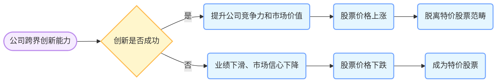

# 特价股票与公司跨界创新能力的关联性研究

> 关键词：特价股票、公司跨界创新能力、关联性、股票估值、创新驱动发展

> 摘要：本文旨在深入研究特价股票与公司跨界创新能力之间的关联性。通过对相关概念的阐述、核心算法原理的分析、数学模型的构建，结合项目实战案例，探讨特价股票形成的原因以及公司跨界创新能力对股票价格的影响机制。在实际应用场景分析的基础上，推荐了相关的工具和资源，总结了未来发展趋势与挑战，并对常见问题进行了解答。希望为投资者和企业管理者提供有价值的参考，助力其在资本市场和企业战略决策中做出更明智的选择。

## 1. 背景介绍 
### 1.1 目的和范围
本研究的主要目的是探究特价股票与公司跨界创新能力之间的内在联系。随着经济的发展和市场竞争的加剧，公司的跨界创新行为日益增多，这不仅影响着公司的长期发展，也对其股票价格产生着重要影响。特价股票通常指价格相对较低、具有一定投资价值的股票，研究其与公司跨界创新能力的关系，有助于投资者更好地识别具有潜力的投资标的，同时也能为企业管理者提供战略决策的参考，促进企业通过跨界创新提升自身价值。

本研究的范围涵盖了不同行业的上市公司，通过对相关数据的收集和分析，揭示特价股票与公司跨界创新能力之间的普遍规律和特殊情况。

### 1.2 预期读者
本研究的预期读者包括投资者、金融分析师、企业管理者、学术界研究人员以及对资本市场和企业创新感兴趣的人士。投资者可以通过本研究了解如何从公司跨界创新能力的角度筛选有潜力的特价股票；金融分析师可以借鉴本研究的方法和结论，进行更深入的股票估值和分析；企业管理者可以从中获取关于跨界创新对企业价值影响的启示，制定更有效的企业战略；学术界研究人员可以在本研究的基础上开展进一步的理论和实证研究；对资本市场和企业创新感兴趣的人士可以通过本研究拓宽对相关领域的认识。

### 1.3 文档结构概述
本文共分为十个部分。第一部分为背景介绍，阐述了研究的目的、范围、预期读者和文档结构概述，并对相关术语进行了定义和解释。第二部分介绍了核心概念与联系，包括特价股票和公司跨界创新能力的原理和架构，并通过文本示意图和 Mermaid 流程图进行了直观展示。第三部分详细讲解了核心算法原理和具体操作步骤，运用 Python 源代码进行了阐述。第四部分构建了数学模型和公式，并进行了详细讲解和举例说明。第五部分通过项目实战，介绍了开发环境搭建、源代码详细实现和代码解读。第六部分分析了实际应用场景。第七部分推荐了相关的工具和资源，包括学习资源、开发工具框架和相关论文著作。第八部分总结了未来发展趋势与挑战。第九部分为附录，解答了常见问题。第十部分提供了扩展阅读和参考资料。

### 1.4 术语表
#### 1.4.1 核心术语定义
- **特价股票**：指在股票市场中，价格相对较低、具有一定投资价值的股票。特价股票的形成可能与多种因素有关，如市场情绪、公司业绩波动、行业竞争等。
- **公司跨界创新能力**：指公司突破传统行业边界，整合不同领域的资源和技术，开展创新活动的能力。公司跨界创新能力包括技术创新、商业模式创新、市场拓展创新等多个方面。

#### 1.4.2 相关概念解释
- **股票估值**：指对股票的内在价值进行评估的过程。股票估值的方法有多种，如市盈率法、市净率法、现金流折现法等。股票估值是投资者进行投资决策的重要依据之一。
- **创新驱动发展**：指以创新为核心驱动力，推动经济社会发展的战略模式。在创新驱动发展模式下，企业通过不断创新，提高自身的竞争力和市场价值。

#### 1.4.3 缩略词列表
- **PE**：市盈率（Price Earnings Ratio），指股票价格与每股收益的比率，用于衡量股票的估值水平。
- **PB**：市净率（Price to Book Ratio），指股票价格与每股净资产的比率，用于衡量股票的估值水平。

## 2. 核心概念与联系 
### 特价股票的原理和架构
特价股票的形成通常与市场供需关系、公司基本面、宏观经济环境等因素有关。从市场供需关系来看，如果某只股票的供给大于需求，其价格就可能下跌，从而形成特价股票。从公司基本面来看，如果公司业绩不佳、面临重大风险或存在治理问题，其股票价格也可能受到影响，出现特价情况。宏观经济环境的变化，如经济衰退、利率调整等，也可能导致股票市场整体下跌，使得部分股票成为特价股票。

以下是特价股票形成原理的文本示意图：

市场供需关系 ---> 供给大于需求 ---> 股票价格下跌 ---> 特价股票
公司基本面 ---> 业绩不佳、风险大、治理问题 ---> 股票价格下跌 ---> 特价股票
宏观经济环境 ---> 经济衰退、利率调整等 ---> 股票市场整体下跌 ---> 特价股票

### 公司跨界创新能力的原理和架构
公司跨界创新能力的形成依赖于公司的战略规划、资源整合能力、创新文化等因素。公司的战略规划决定了其跨界创新的方向和目标；资源整合能力则是将不同领域的资源和技术进行有效整合，实现创新的关键；创新文化能够激发员工的创新意识和创造力，为跨界创新提供良好的氛围。

以下是公司跨界创新能力形成原理的文本示意图：

战略规划 ---> 确定跨界创新方向和目标 ---> 推动创新活动开展
资源整合能力 ---> 整合不同领域资源和技术 ---> 实现创新突破
创新文化 ---> 激发员工创新意识和创造力 ---> 营造创新氛围

### 特价股票与公司跨界创新能力的联系
公司的跨界创新能力可能对其股票价格产生影响，从而与特价股票产生联系。如果公司具有较强的跨界创新能力，能够成功开展跨界创新活动，提升公司的竞争力和市场价值，其股票价格可能会上涨，从而脱离特价股票的范畴。相反，如果公司跨界创新失败，可能会导致业绩下滑、市场信心下降，其股票价格可能会进一步下跌，成为特价股票。

以下是特价股票与公司跨界创新能力联系的 Mermaid 流程图：



## 3. 核心算法原理 & 具体操作步骤 
### 核心算法原理
为了研究特价股票与公司跨界创新能力的关联性，我们可以采用回归分析的方法。回归分析是一种统计方法，用于研究自变量与因变量之间的关系。在本研究中，我们可以将公司跨界创新能力作为自变量，特价股票的特征（如股票价格、市盈率等）作为因变量，通过建立回归模型来分析两者之间的关系。

以下是回归分析的基本原理：

假设我们有 $n$ 个样本，每个样本包含自变量 $x_i$ 和因变量 $y_i$，我们希望找到一个函数 $y = f(x)$ 来描述两者之间的关系。在简单线性回归中，我们假设函数 $f(x)$ 是一个线性函数，即 $y = \beta_0 + \beta_1x + \epsilon$，其中 $\beta_0$ 和 $\beta_1$ 是待估计的参数，$\epsilon$ 是误差项。

我们的目标是找到一组参数 $\beta_0$ 和 $\beta_1$，使得误差项 $\epsilon$ 的平方和最小，即：

$$
\min_{\beta_0, \beta_1} \sum_{i=1}^{n} (y_i - (\beta_0 + \beta_1x_i))^2
$$

通过最小化上述误差平方和，我们可以得到参数 $\beta_0$ 和 $\beta_1$ 的估计值，从而建立回归模型。

### 具体操作步骤
以下是使用 Python 实现回归分析的具体操作步骤：

```python
import numpy as np
import pandas as pd
from sklearn.linear_model import LinearRegression
from sklearn.model_selection import train_test_split
from sklearn.metrics import mean_squared_error

# 1. 数据准备
# 假设我们已经有了包含公司跨界创新能力和股票价格的数据
data = pd.read_csv('stock_data.csv')
X = data[['innovation_ability']]  # 自变量：公司跨界创新能力
y = data['stock_price']  # 因变量：股票价格

# 2. 数据划分
X_train, X_test, y_train, y_test = train_test_split(X, y, test_size=0.2, random_state=42)

# 3. 模型训练
model = LinearRegression()
model.fit(X_train, y_train)

# 4. 模型预测
y_pred = model.predict(X_test)

# 5. 模型评估
mse = mean_squared_error(y_test, y_pred)
rmse = np.sqrt(mse)
print(f"均方误差 (MSE): {mse}")
print(f"均方根误差 (RMSE): {rmse}")

# 6. 模型参数输出
print(f"截距 (beta_0): {model.intercept_}")
print(f"斜率 (beta_1): {model.coef_[0]}")
```

### 代码解释
1. **数据准备**：从 CSV 文件中读取包含公司跨界创新能力和股票价格的数据，并将其分为自变量 $X$ 和因变量 $y$。
2. **数据划分**：使用 `train_test_split` 函数将数据划分为训练集和测试集，其中测试集占总数据的 20%。
3. **模型训练**：使用 `LinearRegression` 类创建一个线性回归模型，并使用训练集数据进行训练。
4. **模型预测**：使用训练好的模型对测试集数据进行预测，得到预测结果 $y_pred$。
5. **模型评估**：使用 `mean_squared_error` 函数计算预测结果与真实结果之间的均方误差（MSE），并计算均方根误差（RMSE）。
6. **模型参数输出**：输出模型的截距 $\beta_0$ 和斜率 $\beta_1$，这些参数反映了自变量与因变量之间的关系。

## 4. 数学模型和公式 & 详细讲解 & 举例说明 
### 数学模型和公式
在回归分析中，我们使用的线性回归模型可以表示为：

$$
y = \beta_0 + \beta_1x + \epsilon
$$

其中：
- $y$ 是因变量，在本研究中表示股票价格。
- $x$ 是自变量，在本研究中表示公司跨界创新能力。
- $\beta_0$ 是截距，表示当自变量 $x$ 为 0 时，因变量 $y$ 的值。
- $\beta_1$ 是斜率，表示自变量 $x$ 每增加一个单位，因变量 $y$ 的平均变化量。
- $\epsilon$ 是误差项，表示模型无法解释的随机误差。

为了估计参数 $\beta_0$ 和 $\beta_1$，我们使用最小二乘法，即最小化误差项 $\epsilon$ 的平方和：

$$
\min_{\beta_0, \beta_1} \sum_{i=1}^{n} (y_i - (\beta_0 + \beta_1x_i))^2
$$

通过对上述目标函数求偏导数并令其等于 0，我们可以得到参数 $\beta_0$ 和 $\beta_1$ 的估计值：

$$
\hat{\beta}_1 = \frac{\sum_{i=1}^{n} (x_i - \bar{x})(y_i - \bar{y})}{\sum_{i=1}^{n} (x_i - \bar{x})^2}
$$

$$
\hat{\beta}_0 = \bar{y} - \hat{\beta}_1\bar{x}
$$

其中：
- $\hat{\beta}_0$ 和 $\hat{\beta}_1$ 是参数 $\beta_0$ 和 $\beta_1$ 的估计值。
- $\bar{x}$ 和 $\bar{y}$ 分别是自变量 $x$ 和因变量 $y$ 的样本均值。

### 详细讲解
最小二乘法的基本思想是找到一组参数 $\beta_0$ 和 $\beta_1$，使得模型预测值与真实值之间的误差平方和最小。误差平方和越小，说明模型对数据的拟合效果越好。

在计算参数 $\hat{\beta}_1$ 时，分子 $\sum_{i=1}^{n} (x_i - \bar{x})(y_i - \bar{y})$ 表示自变量 $x$ 与因变量 $y$ 的协方差，分母 $\sum_{i=1}^{n} (x_i - \bar{x})^2$ 表示自变量 $x$ 的方差。参数 $\hat{\beta}_1$ 反映了自变量 $x$ 与因变量 $y$ 之间的线性关系强度和方向。

参数 $\hat{\beta}_0$ 是通过 $\hat{\beta}_1$ 和样本均值 $\bar{x}$、$\bar{y}$ 计算得到的，它表示当自变量 $x$ 为 0 时，因变量 $y$ 的估计值。

### 举例说明
假设我们有以下数据：

| 公司跨界创新能力 ($x$) | 股票价格 ($y$) |
|---|---|
| 1 | 10 |
| 2 | 12 |
| 3 | 14 |
| 4 | 16 |
| 5 | 18 |

首先，计算样本均值：

$$
\bar{x} = \frac{1 + 2 + 3 + 4 + 5}{5} = 3
$$

$$
\bar{y} = \frac{10 + 12 + 14 + 16 + 18}{5} = 14
$$

然后，计算分子和分母：

分子：

$$
\begin{align*}
\sum_{i=1}^{5} (x_i - \bar{x})(y_i - \bar{y}) &= (1 - 3)(10 - 14) + (2 - 3)(12 - 14) + (3 - 3)(14 - 14) + (4 - 3)(16 - 14) + (5 - 3)(18 - 14)\\
&= (-2)(-4) + (-1)(-2) + 0 + 1\times2 + 2\times4\\
&= 8 + 2 + 0 + 2 + 8\\
&= 20
\end{align*}
$$

分母：

$$
\begin{align*}
\sum_{i=1}^{5} (x_i - \bar{x})^2 &= (1 - 3)^2 + (2 - 3)^2 + (3 - 3)^2 + (4 - 3)^2 + (5 - 3)^2\\
&= (-2)^2 + (-1)^2 + 0 + 1^2 + 2^2\\
&= 4 + 1 + 0 + 1 + 4\\
&= 10
\end{align*}
$$

接着，计算参数 $\hat{\beta}_1$：

$$
\hat{\beta}_1 = \frac{20}{10} = 2
$$

最后，计算参数 $\hat{\beta}_0$：

$$
\hat{\beta}_0 = \bar{y} - \hat{\beta}_1\bar{x} = 14 - 2\times3 = 8
$$

因此，回归模型为 $y = 8 + 2x$。这意味着公司跨界创新能力每增加 1 个单位，股票价格平均增加 2 个单位。

## 5. 项目实战：代码实际案例和详细解释说明 
### 5.1  开发环境搭建
在进行项目实战之前，我们需要搭建相应的开发环境。以下是具体的步骤：

1. **安装 Python**：从 Python 官方网站（https://www.python.org/downloads/）下载并安装 Python 3.x 版本。
2. **安装必要的库**：使用以下命令安装所需的库：
```sh
pip install numpy pandas scikit-learn matplotlib
```
3. **选择开发工具**：可以选择使用 Jupyter Notebook、PyCharm 等开发工具。这里我们以 Jupyter Notebook 为例，安装 Jupyter Notebook：
```sh
pip install jupyter
```
4. **启动 Jupyter Notebook**：在命令行中输入以下命令启动 Jupyter Notebook：
```sh
jupyter notebook
```

### 5.2  源代码详细实现和代码解读
以下是一个完整的项目实战代码示例，用于研究特价股票与公司跨界创新能力的关联性：

```python
import numpy as np
import pandas as pd
from sklearn.linear_model import LinearRegression
from sklearn.model_selection import train_test_split
from sklearn.metrics import mean_squared_error
import matplotlib.pyplot as plt

# 1. 数据准备
# 假设我们已经有了包含公司跨界创新能力和股票价格的数据
data = pd.read_csv('stock_data.csv')
X = data[['innovation_ability']]  # 自变量：公司跨界创新能力
y = data['stock_price']  # 因变量：股票价格

# 2. 数据划分
X_train, X_test, y_train, y_test = train_test_split(X, y, test_size=0.2, random_state=42)

# 3. 模型训练
model = LinearRegression()
model.fit(X_train, y_train)

# 4. 模型预测
y_pred = model.predict(X_test)

# 5. 模型评估
mse = mean_squared_error(y_test, y_pred)
rmse = np.sqrt(mse)
print(f"均方误差 (MSE): {mse}")
print(f"均方根误差 (RMSE): {rmse}")

# 6. 模型参数输出
print(f"截距 (beta_0): {model.intercept_}")
print(f"斜率 (beta_1): {model.coef_[0]}")

# 7. 可视化结果
plt.scatter(X_test, y_test, color='blue', label='实际值')
plt.plot(X_test, y_pred, color='red', linewidth=2, label='预测值')
plt.xlabel('公司跨界创新能力')
plt.ylabel('股票价格')
plt.title('特价股票与公司跨界创新能力的关联性')
plt.legend()
plt.show()
```

### 代码解读与分析
1. **数据准备**：使用 `pandas` 库读取包含公司跨界创新能力和股票价格的数据，并将其分为自变量 $X$ 和因变量 $y$。
2. **数据划分**：使用 `train_test_split` 函数将数据划分为训练集和测试集，其中测试集占总数据的 20%。
3. **模型训练**：使用 `LinearRegression` 类创建一个线性回归模型，并使用训练集数据进行训练。
4. **模型预测**：使用训练好的模型对测试集数据进行预测，得到预测结果 $y_pred$。
5. **模型评估**：使用 `mean_squared_error` 函数计算预测结果与真实结果之间的均方误差（MSE），并计算均方根误差（RMSE）。均方误差和均方根误差越小，说明模型的预测效果越好。
6. **模型参数输出**：输出模型的截距 $\beta_0$ 和斜率 $\beta_1$，这些参数反映了自变量与因变量之间的关系。
7. **可视化结果**：使用 `matplotlib` 库绘制散点图和直线图，将实际值和预测值进行可视化展示，直观地观察模型的预测效果。

## 6. 实际应用场景 
### 投资者决策
投资者可以利用本研究的结果，在筛选投资标的时，不仅关注股票的价格，还考虑公司的跨界创新能力。如果发现某只股票价格较低，但公司具有较强的跨界创新能力，那么这只股票可能具有较大的投资潜力。投资者可以通过分析公司的跨界创新战略、研发投入、创新成果等方面，评估公司的跨界创新能力，从而做出更明智的投资决策。

### 企业战略制定
企业管理者可以通过本研究了解跨界创新对企业价值和股票价格的影响，从而制定更有效的企业战略。如果企业希望提升自身的市场价值和股票价格，可以加大在跨界创新方面的投入，积极开展跨界创新活动。同时，企业还可以通过与其他企业、科研机构等合作，整合资源，提升自身的跨界创新能力。

### 金融机构风险管理
金融机构在进行风险管理时，可以将公司的跨界创新能力作为一个重要的参考因素。如果某家公司的跨界创新能力较弱，可能面临较大的市场风险和竞争压力，金融机构在为其提供贷款、投资等服务时，需要更加谨慎地评估风险。相反，如果公司具有较强的跨界创新能力，其抗风险能力可能较强，金融机构可以适当放宽对其的风险评估标准。

## 7. 工具和资源推荐
### 7.1 学习资源推荐
#### 7.1.1 书籍推荐
- 《金融市场学》：全面介绍了金融市场的基本概念、运行机制和投资策略，对于理解股票市场和金融投资有很大帮助。
- 《创新管理》：深入探讨了企业创新的理论和实践，包括创新战略、创新过程、创新组织等方面的内容，有助于了解公司跨界创新能力的培养和提升。
- 《Python 数据分析实战》：详细介绍了使用 Python 进行数据分析的方法和技巧，包括数据处理、数据可视化、机器学习等方面的内容，对于进行相关的数据分析和建模有很大的帮助。

#### 7.1.2 在线课程
- Coursera 上的 “Financial Markets” 课程：由耶鲁大学教授罗伯特·席勒（Robert Shiller）讲授，系统地介绍了金融市场的基本原理和投资策略。
- edX 上的 “Innovation Management and Entrepreneurship” 课程：由欧洲工商管理学院（INSEAD）教授讲授，深入探讨了企业创新和创业的相关知识和技能。
- 慕课网上的 “Python 数据分析与挖掘实战” 课程：详细介绍了使用 Python 进行数据分析和挖掘的方法和实践案例。

#### 7.1.3 技术博客和网站
- 金融界（https://www.jrj.com.cn/）：提供了丰富的金融资讯和股票市场分析，对于了解金融市场动态和股票价格走势有很大帮助。
- 36 氪（https://36kr.com/）：专注于科技、创新和创业领域的资讯和分析，对于了解公司的跨界创新动态和趋势有很大帮助。
- 博客园（https://www.cnblogs.com/）：有很多技术博主分享数据分析、机器学习等方面的经验和技巧，对于学习相关技术有很大帮助。

### 7.2 开发工具框架推荐
#### 7.2.1 IDE和编辑器
- PyCharm：一款专业的 Python 集成开发环境，具有代码编辑、调试、版本控制等功能，适合大规模的 Python 项目开发。
- Jupyter Notebook：一个交互式的开发环境，支持代码、文本、图表等多种形式的展示，适合数据分析和机器学习的探索性开发。
- Visual Studio Code：一款轻量级的代码编辑器，支持多种编程语言，具有丰富的插件生态系统，适合快速开发和调试。

#### 7.2.2 调试和性能分析工具
- PDB：Python 自带的调试工具，可以在代码中设置断点，逐行调试代码，帮助开发者查找和解决问题。
- cProfile：Python 自带的性能分析工具，可以分析代码的运行时间和函数调用次数，帮助开发者优化代码性能。
- Py-Spy：一个轻量级的 Python 性能分析工具，可以实时监测 Python 程序的运行状态，找出性能瓶颈。

#### 7.2.3 相关框架和库
- Pandas：一个强大的数据分析库，提供了数据结构和数据处理功能，方便进行数据清洗、数据转换和数据分析。
- NumPy：一个基础的科学计算库，提供了多维数组和数学函数，用于高效的数值计算。
- Scikit-learn：一个常用的机器学习库，提供了各种机器学习算法和工具，如分类、回归、聚类等，方便进行模型训练和评估。

### 7.3 相关论文著作推荐
#### 7.3.1 经典论文
- Fama, E. F., & French, K. R. (1992). The cross-section of expected stock returns. *Journal of Finance*, 47(2), 427-465. 该论文提出了著名的 Fama-French 三因子模型，用于解释股票收益率的差异，对于理解股票市场的定价机制有重要意义。
- Christensen, C. M. (1997). The innovator's dilemma: When new technologies cause great firms to fail. *Harvard Business School Press*. 该论文提出了颠覆性创新的概念，对于理解企业创新和市场竞争有重要启示。

#### 7.3.2 最新研究成果
- 可以通过 Google Scholar、Web of Science 等学术搜索引擎，搜索关于特价股票、公司跨界创新能力等方面的最新研究成果，了解该领域的前沿动态。

#### 7.3.3 应用案例分析
- 可以参考一些商业杂志和财经媒体，如《哈佛商业评论》、《财新》等，了解一些公司跨界创新的实际案例和分析，从中获取经验和启示。

## 8. 总结：未来发展趋势与挑战
### 未来发展趋势
- **跨界创新将成为企业发展的重要动力**：随着科技的不断进步和市场竞争的加剧，企业越来越意识到跨界创新的重要性。通过跨界创新，企业可以整合不同领域的资源和技术，创造出更具竞争力的产品和服务，提升自身的市场价值和股票价格。
- **数据分析和人工智能技术将在股票投资中得到更广泛的应用**：随着数据量的不断增加和计算能力的不断提升，数据分析和人工智能技术将在股票投资中发挥越来越重要的作用。投资者可以利用这些技术，更准确地分析公司的跨界创新能力和股票价格走势，做出更明智的投资决策。
- **金融市场将更加关注企业的创新能力**：金融市场将越来越关注企业的创新能力，将其作为评估企业价值和风险的重要因素。具有较强创新能力的企业将更容易获得投资者的青睐，其股票价格也将更具竞争力。

### 挑战
- **数据获取和质量问题**：要准确评估公司的跨界创新能力和股票价格走势，需要大量的相关数据。然而，这些数据的获取可能存在一定的困难，而且数据的质量也可能参差不齐。如何获取高质量的数据，并对其进行有效的清洗和处理，是一个需要解决的问题。
- **创新能力评估的主观性**：公司的跨界创新能力是一个相对抽象的概念，很难用一个准确的指标来衡量。不同的评估方法和标准可能会得出不同的结果，这给评估公司的跨界创新能力带来了一定的主观性和不确定性。
- **市场不确定性和风险**：股票市场是一个充满不确定性和风险的市场，公司的跨界创新活动也可能面临各种风险和挑战。即使公司具有较强的跨界创新能力，也不能保证其股票价格一定会上涨。如何应对市场不确定性和风险，是投资者和企业管理者需要面对的重要挑战。

## 9. 附录：常见问题与解答
### 1. 什么是特价股票？
特价股票是指在股票市场中，价格相对较低、具有一定投资价值的股票。特价股票的形成可能与多种因素有关，如市场情绪、公司业绩波动、行业竞争等。

### 2. 如何评估公司的跨界创新能力？
可以从多个方面评估公司的跨界创新能力，如公司的跨界创新战略、研发投入、创新成果、合作创新情况等。此外，还可以参考一些专业机构的评估报告和市场调研数据。

### 3. 回归分析能准确预测股票价格吗？
回归分析只是一种统计方法，用于研究自变量与因变量之间的关系。虽然回归分析可以帮助我们了解公司跨界创新能力与股票价格之间的关系，但不能准确预测股票价格。股票价格受到多种因素的影响，包括市场情绪、宏观经济环境、公司基本面等，这些因素具有很大的不确定性。

### 4. 如何降低投资特价股票的风险？
可以通过以下方法降低投资特价股票的风险：
- 深入研究公司的基本面和跨界创新能力，选择具有潜力的公司。
- 分散投资，不要把所有的资金都投入到一只股票中。
- 设定止损点，及时止损，避免损失过大。
- 关注市场动态和公司公告，及时了解相关信息。

## 10. 扩展阅读 & 参考资料
### 扩展阅读
- 《聪明的投资者》：本杰明·格雷厄姆（Benjamin Graham）的经典著作，介绍了价值投资的理念和方法，对于投资者有很大的启发。
- 《从 0 到 1》：彼得·蒂尔（Peter Thiel）的著作，探讨了创业和创新的相关问题，对于理解企业的跨界创新有一定的帮助。

### 参考资料
- 相关的财经新闻网站和金融数据库，如新浪财经、东方财富网、Wind 数据库等。
- 学术期刊和研究报告，如《金融研究》、《管理世界》等。

作者：AI天才研究院/AI Genius Institute & 禅与计算机程序设计艺术 /Zen And The Art of Computer Programming