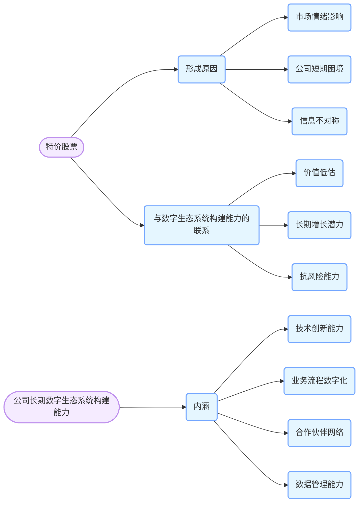

# 特价股票与公司长期数字生态系统构建能力的关系分析

> 关键词：特价股票、公司长期数字生态系统构建能力、股票价值、数字生态系统、财务分析、市场竞争、可持续发展

> 摘要：本文旨在深入分析特价股票与公司长期数字生态系统构建能力之间的关系。通过对特价股票的定义、形成原因进行剖析，探讨公司数字生态系统构建能力的内涵与重要性。从理论和实践层面研究两者之间的内在联系，运用数学模型、实际案例等方法进行论证。同时，阐述相关概念、核心算法原理，提供项目实战的详细步骤与代码示例，分析实际应用场景，推荐学习资源、开发工具和相关论文著作。最后总结未来发展趋势与挑战，解答常见问题，为投资者和企业管理者提供全面且深入的参考。

## 1. 背景介绍 
### 1.1 目的和范围
本研究的目的在于揭示特价股票与公司长期数字生态系统构建能力之间的关联，帮助投资者更准确地评估股票价值，为企业管理者提供关于提升公司竞争力和可持续发展的思路。研究范围涵盖了特价股票的形成机制、公司数字生态系统构建的各个方面，包括技术创新、业务模式、市场拓展等，以及两者之间相互作用的多种情况。

### 1.2 预期读者
本文预期读者包括股票投资者、金融分析师、企业管理者、研究数字经济和企业战略的学者以及对相关领域感兴趣的技术爱好者。投资者可以通过本文了解如何从公司数字生态系统构建能力的角度评估特价股票的投资价值；企业管理者可以借鉴文中观点，提升公司的数字生态系统构建能力，进而影响公司的市场表现和股票价格；学者和技术爱好者则可以深入研究相关理论和实践案例。

### 1.3 文档结构概述
本文首先介绍相关背景信息，包括目的、预期读者和文档结构。接着阐述核心概念，分析特价股票与公司数字生态系统构建能力的原理和联系，并给出相应的示意图和流程图。然后详细讲解核心算法原理和具体操作步骤，通过Python代码进行说明。之后介绍相关的数学模型和公式，并举例说明。在项目实战部分，提供开发环境搭建、源代码实现和代码解读。再分析实际应用场景，推荐学习资源、开发工具和相关论文著作。最后总结未来发展趋势与挑战，解答常见问题，并提供扩展阅读和参考资料。

### 1.4 术语表
#### 1.4.1 核心术语定义
- **特价股票**：指市场价格明显低于其内在价值的股票。这种低价可能是由于市场短期波动、投资者情绪、公司短期负面事件等因素导致。
- **公司长期数字生态系统构建能力**：公司利用数字技术，整合内外部资源，构建一个具有自我进化、协同发展的数字生态系统的能力。该生态系统包括数字技术平台、业务流程数字化、合作伙伴网络、客户关系管理等多个方面，旨在提升公司的竞争力和可持续发展能力。

#### 1.4.2 相关概念解释
- **数字生态系统**：是一个由数字技术驱动，涵盖企业、客户、合作伙伴等多个主体，通过数据共享、业务协同等方式实现价值共创的复杂系统。它具有开放性、动态性和创新性等特点。
- **股票内在价值**：是指股票未来预期现金流的现值，反映了公司的基本面和长期发展潜力。

#### 1.4.3 缩略词列表
- **DCF**：Discounted Cash Flow，现金流折现法，一种用于评估股票内在价值的常用方法。
- **AI**：Artificial Intelligence，人工智能，是数字生态系统中常用的技术之一。
- **IoT**：Internet of Things，物联网，可实现设备之间的互联互通，为数字生态系统提供数据支持。

## 2. 核心概念与联系 

### 2.1 特价股票的形成原理
特价股票的形成通常有以下几种原因：
- **市场情绪影响**：投资者的恐慌、贪婪等情绪会导致股票价格的大幅波动。当市场整体下跌或某一行业出现负面消息时，投资者可能会过度抛售股票，导致部分股票价格低于其内在价值。
- **公司短期困境**：公司可能由于短期的经营问题、财务困境或法律纠纷等原因，导致市场对其信心下降，股票价格下跌。但这些问题可能是暂时的，不影响公司的长期发展潜力。
- **信息不对称**：部分投资者可能掌握了比市场更全面的信息，从而提前做出买卖决策。而其他投资者由于信息不足，可能会错误地低估公司的价值，导致股票价格偏低。

### 2.2 公司长期数字生态系统构建能力的内涵
公司长期数字生态系统构建能力包括以下几个方面：
- **技术创新能力**：公司需要不断投入研发，掌握先进的数字技术，如人工智能、大数据、云计算等，以提升自身的竞争力。
- **业务流程数字化**：将公司的业务流程进行数字化改造，提高运营效率，降低成本，增强客户体验。
- **合作伙伴网络**：建立广泛的合作伙伴网络，包括供应商、客户、技术提供商等，实现资源共享和协同发展。
- **数据管理能力**：有效地收集、存储、分析和利用数据，为决策提供支持，发现新的业务机会。

### 2.3 特价股票与公司长期数字生态系统构建能力的联系
公司强大的长期数字生态系统构建能力可能会使股票成为特价股票，也可能影响特价股票的未来走势。具体联系如下：
- **价值低估**：市场可能由于对公司数字生态系统构建能力的认识不足，导致股票价格低于其内在价值，形成特价股票。
- **长期增长潜力**：具有较强数字生态系统构建能力的公司，通常具有更好的长期增长潜力。随着公司数字生态系统的不断完善，其业绩和市场价值可能会逐渐提升，特价股票的价格也会随之上涨。
- **抗风险能力**：良好的数字生态系统可以提高公司的抗风险能力。在面对市场波动和行业竞争时，具有强大数字生态系统的公司能够更好地应对挑战，保持稳定的发展，从而支撑股票价格。

### 2.4 文本示意图
```plaintext
特价股票
|
|-- 形成原因
|   |-- 市场情绪影响
|   |-- 公司短期困境
|   |-- 信息不对称
|
|-- 与数字生态系统构建能力的联系
|   |-- 价值低估
|   |-- 长期增长潜力
|   |-- 抗风险能力

公司长期数字生态系统构建能力
|
|-- 内涵
|   |-- 技术创新能力
|   |-- 业务流程数字化
|   |-- 合作伙伴网络
|   |-- 数据管理能力
```

### 2.5 Mermaid 流程图


## 3. 核心算法原理 & 具体操作步骤 

### 3.1 评估特价股票的算法原理
评估特价股票通常使用现金流折现法（DCF），其基本原理是将股票未来预期的现金流折现到当前时刻，得到股票的内在价值。如果股票的市场价格低于其内在价值，则认为该股票是特价股票。

#### 3.1.1 DCF 算法公式
$$V = \sum_{t=1}^{n} \frac{CF_t}{(1 + r)^t} + \frac{TV}{(1 + r)^n}$$
其中：
- $V$ 是股票的内在价值
- $CF_t$ 是第 $t$ 期的现金流
- $r$ 是折现率
- $n$ 是预测期数
- $TV$ 是终值

#### 3.1.2 Python 代码实现
```python
def dcf_evaluation(cash_flows, discount_rate, terminal_value, years):
    """
    现金流折现法评估股票内在价值
    :param cash_flows: 每年的现金流列表
    :param discount_rate: 折现率
    :param terminal_value: 终值
    :param years: 预测期数
    :return: 股票内在价值
    """
    present_value = 0
    for t in range(years):
        present_value += cash_flows[t] / ((1 + discount_rate) ** (t + 1))
    present_value += terminal_value / ((1 + discount_rate) ** years)
    return present_value

# 示例数据
cash_flows = [100, 120, 150, 180, 200]
discount_rate = 0.1
terminal_value = 1000
years = 5

intrinsic_value = dcf_evaluation(cash_flows, discount_rate, terminal_value, years)
print(f"股票内在价值: {intrinsic_value}")
```

### 3.2 评估公司长期数字生态系统构建能力的算法原理
评估公司长期数字生态系统构建能力可以从多个维度进行，如技术创新能力、业务流程数字化程度等。可以使用综合评分法，为每个维度设定权重，计算公司的综合得分。

#### 3.2.1 综合评分法公式
$$S = \sum_{i=1}^{m} w_i \times s_i$$
其中：
- $S$ 是公司的综合得分
- $w_i$ 是第 $i$ 个维度的权重
- $s_i$ 是第 $i$ 个维度的得分
- $m$ 是维度的数量

#### 3.2.2 Python 代码实现
```python
def digital_ecosystem_score(weights, scores):
    """
    计算公司数字生态系统构建能力综合得分
    :param weights: 各维度权重列表
    :param scores: 各维度得分列表
    :return: 综合得分
    """
    score = 0
    for i in range(len(weights)):
        score += weights[i] * scores[i]
    return score

# 示例数据
weights = [0.2, 0.2, 0.3, 0.3]  # 技术创新能力、业务流程数字化、合作伙伴网络、数据管理能力的权重
scores = [80, 70, 90, 85]  # 各维度得分

total_score = digital_ecosystem_score(weights, scores)
print(f"公司数字生态系统构建能力综合得分: {total_score}")
```

### 3.3 具体操作步骤
#### 3.3.1 评估特价股票
1. **收集数据**：收集公司的财务报表、行业数据等，预测未来的现金流。
2. **确定折现率**：根据市场情况和公司风险，确定合适的折现率。
3. **计算内在价值**：使用 DCF 算法计算股票的内在价值。
4. **比较价格**：将股票的内在价值与市场价格进行比较，判断是否为特价股票。

#### 3.3.2 评估公司长期数字生态系统构建能力
1. **确定评估维度**：确定技术创新能力、业务流程数字化、合作伙伴网络、数据管理能力等评估维度。
2. **设定权重**：根据各维度的重要性，设定相应的权重。
3. **打分**：对每个维度进行打分。
4. **计算综合得分**：使用综合评分法计算公司的综合得分。

## 4. 数学模型和公式 & 详细讲解 & 举例说明 

### 4.1 现金流折现法（DCF）
#### 4.1.1 公式详细讲解
$$V = \sum_{t=1}^{n} \frac{CF_t}{(1 + r)^t} + \frac{TV}{(1 + r)^n}$$
- **$\sum_{t=1}^{n} \frac{CF_t}{(1 + r)^t}$**：这部分是预测期内各期现金流的现值之和。$CF_t$ 表示第 $t$ 期的现金流，$(1 + r)^t$ 是折现因子，将未来的现金流折现到当前时刻。
- **$\frac{TV}{(1 + r)^n}$**：这是终值的现值。终值是指预测期结束后公司的价值，通常使用永续增长模型或市场倍数法进行估算。

#### 4.1.2 举例说明
假设一家公司未来 5 年的现金流分别为 100 万元、120 万元、150 万元、180 万元、200 万元，折现率为 10%，终值为 1000 万元。
- 第 1 年现金流的现值：$\frac{100}{(1 + 0.1)^1} \approx 90.91$ 万元
- 第 2 年现金流的现值：$\frac{120}{(1 + 0.1)^2} \approx 99.17$ 万元
- 第 3 年现金流的现值：$\frac{150}{(1 + 0.1)^3} \approx 112.69$ 万元
- 第 4 年现金流的现值：$\frac{180}{(1 + 0.1)^4} \approx 122.94$ 万元
- 第 5 年现金流的现值：$\frac{200}{(1 + 0.1)^5} \approx 124.18$ 万元
- 终值的现值：$\frac{1000}{(1 + 0.1)^5} \approx 620.92$ 万元

股票的内在价值：$V = 90.91 + 99.17 + 112.69 + 122.94 + 124.18 + 620.92 \approx 1170.81$ 万元

### 4.2 综合评分法
#### 4.2.1 公式详细讲解
$$S = \sum_{i=1}^{m} w_i \times s_i$$
- $w_i$ 是第 $i$ 个维度的权重，权重之和为 1，表示该维度在综合评估中的重要程度。
- $s_i$ 是第 $i$ 个维度的得分，可以通过专家评估、数据统计等方法得到。

#### 4.2.2 举例说明
假设评估公司数字生态系统构建能力的四个维度为技术创新能力、业务流程数字化、合作伙伴网络、数据管理能力，权重分别为 0.2、0.2、0.3、0.3，各维度得分分别为 80 分、70 分、90 分、85 分。
- 技术创新能力得分的加权值：$0.2 \times 80 = 16$ 分
- 业务流程数字化得分的加权值：$0.2 \times 70 = 14$ 分
- 合作伙伴网络得分的加权值：$0.3 \times 90 = 27$ 分
- 数据管理能力得分的加权值：$0.3 \times 85 = 25.5$ 分

公司的综合得分：$S = 16 + 14 + 27 + 25.5 = 82.5$ 分

## 5. 项目实战：代码实际案例和详细解释说明 

### 5.1  开发环境搭建
#### 5.1.1 安装 Python
首先需要安装 Python 开发环境，建议使用 Python 3.7 及以上版本。可以从 Python 官方网站（https://www.python.org/downloads/）下载并安装。

#### 5.1.2 安装必要的库
本项目需要使用一些常用的 Python 库，如 `pandas` 用于数据处理，`numpy` 用于数值计算。可以使用以下命令进行安装：
```sh
pip install pandas numpy
```

### 5.2  源代码详细实现和代码解读
#### 5.2.1 读取财务数据
```python
import pandas as pd

def read_financial_data(file_path):
    """
    读取财务数据文件
    :param file_path: 财务数据文件路径
    :return: 财务数据 DataFrame
    """
    data = pd.read_csv(file_path)
    return data

# 示例
file_path = 'financial_data.csv'
financial_data = read_financial_data(file_path)
print(financial_data.head())
```
**代码解读**：该函数使用 `pandas` 库的 `read_csv` 函数读取财务数据文件，并返回一个 `DataFrame` 对象。可以使用 `head()` 方法查看数据的前几行。

#### 5.2.2 计算特价股票指标
```python
import numpy as np

def calculate_discount_stock_metrics(financial_data, discount_rate, terminal_growth_rate):
    """
    计算特价股票指标
    :param financial_data: 财务数据 DataFrame
    :param discount_rate: 折现率
    :param terminal_growth_rate: 终值增长率
    :return: 股票内在价值
    """
    cash_flows = financial_data['cash_flow'].values
    years = len(cash_flows)
    last_cash_flow = cash_flows[-1]
    terminal_value = last_cash_flow * (1 + terminal_growth_rate) / (discount_rate - terminal_growth_rate)
    intrinsic_value = dcf_evaluation(cash_flows, discount_rate, terminal_value, years)
    return intrinsic_value

# 示例
discount_rate = 0.1
terminal_growth_rate = 0.03
intrinsic_value = calculate_discount_stock_metrics(financial_data, discount_rate, terminal_growth_rate)
print(f"股票内在价值: {intrinsic_value}")
```
**代码解读**：该函数从财务数据中提取现金流信息，计算终值，然后使用之前定义的 `dcf_evaluation` 函数计算股票的内在价值。

#### 5.2.3 计算公司数字生态系统构建能力得分
```python
def calculate_digital_ecosystem_score(data):
    """
    计算公司数字生态系统构建能力得分
    :param data: 各维度得分数据
    :return: 综合得分
    """
    weights = [0.2, 0.2, 0.3, 0.3]
    scores = data[['tech_innovation', 'business_digitalization', 'partnership_network', 'data_management']].values[0]
    total_score = digital_ecosystem_score(weights, scores)
    return total_score

# 示例
data = pd.DataFrame({
    'tech_innovation': [80],
    'business_digitalization': [70],
    'partnership_network': [90],
    'data_management': [85]
})
score = calculate_digital_ecosystem_score(data)
print(f"公司数字生态系统构建能力综合得分: {score}")
```
**代码解读**：该函数从数据中提取各维度得分，使用之前定义的 `digital_ecosystem_score` 函数计算公司的综合得分。

### 5.3  代码解读与分析
#### 5.3.1 数据处理
使用 `pandas` 库进行数据处理，将财务数据和各维度得分数据存储在 `DataFrame` 中，方便进行数据的读取、筛选和计算。

#### 5.3.2 指标计算
通过调用之前定义的 `dcf_evaluation` 和 `digital_ecosystem_score` 函数，计算股票的内在价值和公司的数字生态系统构建能力综合得分。

#### 5.3.3 可扩展性
代码具有一定的可扩展性，可以根据实际需求修改折现率、终值增长率、权重等参数，也可以添加更多的评估维度和指标。

## 6. 实际应用场景 
### 6.1 投资决策
投资者可以通过评估特价股票和公司长期数字生态系统构建能力，做出更明智的投资决策。对于具有较强数字生态系统构建能力但股票价格被低估的公司，投资者可以考虑长期持有，等待股票价格回归其内在价值。

### 6.2 企业战略规划
企业管理者可以通过分析自身的数字生态系统构建能力，制定相应的战略规划。如果公司的数字生态系统构建能力较弱，可以加大在技术创新、业务流程数字化等方面的投入，提升公司的竞争力和市场价值。

### 6.3 行业分析
金融分析师可以通过研究特价股票和公司数字生态系统构建能力，对整个行业进行分析。了解行业内各公司的优势和劣势，预测行业的发展趋势，为投资者和企业提供参考。

## 7. 工具和资源推荐
### 7.1 学习资源推荐
#### 7.1.1 书籍推荐
- 《证券分析》（Security Analysis）：由本杰明·格雷厄姆（Benjamin Graham）和大卫·多德（David Dodd）所著，是价值投资的经典之作，介绍了评估股票价值的基本方法。
- 《数字经济：智胜未来的商业逻辑》：深入探讨了数字经济的发展趋势和企业数字化转型的策略。
- 《人工智能：现代方法》（Artificial Intelligence: A Modern Approach）：全面介绍了人工智能的理论和技术，对于理解数字生态系统中的人工智能应用有很大帮助。

#### 7.1.2 在线课程
- Coursera 上的“Financial Markets”：由耶鲁大学教授罗伯特·席勒（Robert Shiller）授课，介绍了金融市场的基本原理和投资策略。
- edX 上的“Digital Transformation Strategy”：帮助学习者了解企业数字化转型的战略和方法。
- Udemy 上的“Python for Data Science and Machine Learning Bootcamp”：学习使用 Python 进行数据分析和机器学习，为研究特价股票和数字生态系统提供技术支持。

#### 7.1.3 技术博客和网站
- Seeking Alpha：提供股票分析和投资建议，有很多关于特价股票的研究文章。
- TechCrunch：关注科技行业的最新动态，对于了解数字生态系统的发展趋势有很大帮助。
- Medium：有很多技术专家和投资者分享的关于金融和科技的文章。

### 7.2 开发工具框架推荐
#### 7.2.1 IDE和编辑器
- PyCharm：一款专业的 Python 集成开发环境，具有代码编辑、调试、版本控制等功能。
- Jupyter Notebook：交互式的开发环境，适合进行数据分析和代码演示。

#### 7.2.2 调试和性能分析工具
- `pdb`：Python 自带的调试工具，可以帮助开发者查找代码中的错误。
- `cProfile`：用于分析 Python 代码的性能，找出性能瓶颈。

#### 7.2.3 相关框架和库
- `pandas`：用于数据处理和分析，提供了丰富的数据结构和函数。
- `numpy`：用于数值计算，提供了高效的数组操作和数学函数。
- `scikit-learn`：用于机器学习，提供了各种机器学习算法和工具。

### 7.3 相关论文著作推荐
#### 7.3.1 经典论文
- Fama, E. F., & French, K. R. (1992). The cross-section of expected stock returns. Journal of Finance, 47(2), 427-465. 提出了著名的 Fama-French 三因子模型，用于解释股票回报率的差异。
- Porter, M. E. (1985). Competitive advantage: Creating and sustaining superior performance. Free Press. 介绍了企业竞争优势的来源和分析方法。

#### 7.3.2 最新研究成果
- 关注顶级金融和管理学期刊，如《Journal of Financial Economics》、《Management Science》等，了解关于特价股票和数字生态系统的最新研究成果。

#### 7.3.3 应用案例分析
- Harvard Business Review 上有很多关于企业数字化转型和数字生态系统构建的应用案例分析，可以从中学习企业的实践经验。

## 8. 总结：未来发展趋势与挑战
### 8.1 未来发展趋势
- **数字化加速**：随着科技的不断进步，企业的数字化转型将加速，数字生态系统的构建将成为企业竞争的关键。具有强大数字生态系统构建能力的公司将更具竞争力，其股票也可能更具投资价值。
- **人工智能和大数据的应用**：人工智能和大数据技术将在股票评估和数字生态系统构建中得到更广泛的应用。通过分析大量的数据，可以更准确地评估特价股票和公司的数字生态系统构建能力。
- **跨行业融合**：不同行业之间的界限将越来越模糊，企业将通过构建数字生态系统实现跨行业融合。这将为投资者带来更多的投资机会，也为企业带来更多的发展空间。

### 8.2 挑战
- **数据质量和安全**：在评估特价股票和数字生态系统构建能力时，需要大量的数据支持。但数据质量和安全问题可能会影响评估结果的准确性和可靠性。
- **技术更新换代快**：数字技术发展迅速，企业需要不断投入研发，跟上技术更新换代的步伐。否则，其数字生态系统构建能力可能会逐渐落后。
- **市场不确定性**：股票市场受到多种因素的影响，具有很大的不确定性。即使公司具有强大的数字生态系统构建能力，其股票价格也可能受到市场波动的影响。

## 9. 附录：常见问题与解答
### 9.1 如何确定折现率？
折现率的确定需要考虑多个因素，如市场利率、公司风险等。一般可以使用资本资产定价模型（CAPM）来计算折现率：
$$r = R_f + \beta \times (R_m - R_f)$$
其中：
- $r$ 是折现率
- $R_f$ 是无风险利率
- $\beta$ 是股票的贝塔系数
- $R_m$ 是市场收益率

### 9.2 如何评估公司的技术创新能力？
可以从以下几个方面评估公司的技术创新能力：
- **研发投入**：公司在研发方面的投入占比越高，说明其对技术创新越重视。
- **专利数量和质量**：专利是公司技术创新的重要成果，可以通过专利数量和质量来评估公司的技术创新能力。
- **技术团队实力**：公司的技术团队规模、学历背景、研发经验等也可以反映其技术创新能力。

### 9.3 特价股票一定值得投资吗？
不一定。特价股票可能是由于各种原因导致价格被低估，但这并不意味着该股票一定具有投资价值。投资者还需要考虑公司的基本面、行业前景、数字生态系统构建能力等因素。如果公司存在严重的经营问题或行业前景不佳，即使股票价格被低估，也可能不值得投资。

## 10. 扩展阅读 & 参考资料
### 10.1 扩展阅读
- 《聪明的投资者》（The Intelligent Investor）：本杰明·格雷厄姆的另一本经典著作，强调了价值投资的理念和方法。
- 《平台革命：改变世界的商业模式》：介绍了平台经济和数字生态系统的商业模式和发展趋势。

### 10.2 参考资料
- 相关公司的财务报表和年报
- 金融数据库，如 Bloomberg、Wind 等
- 行业研究报告和咨询机构的分析报告

作者：AI天才研究院/AI Genius Institute & 禅与计算机程序设计艺术 /Zen And The Art of Computer Programming