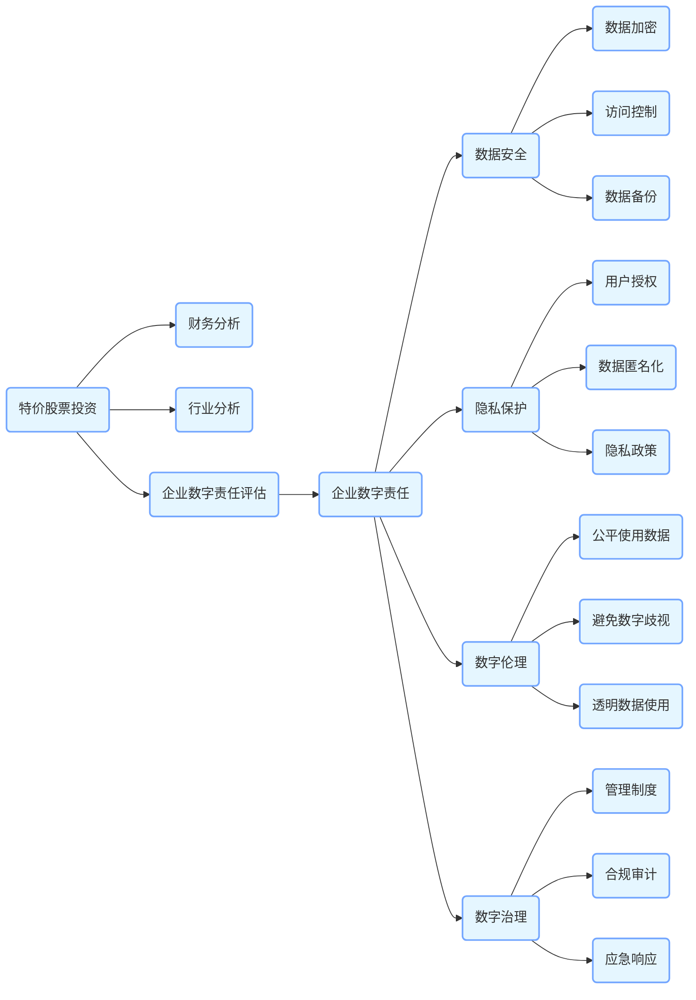

# 特价股票投资中的企业数字责任评估因素考量

> 关键词：特价股票投资、企业数字责任、评估因素、投资决策、数字治理

> 摘要：本文聚焦于特价股票投资领域，深入探讨企业数字责任评估因素在其中的重要性。随着数字化时代的发展，企业的数字责任表现对其长期发展和投资价值产生着深远影响。文章详细分析了企业数字责任的核心概念、相关算法原理、数学模型，通过实际案例展示了如何将企业数字责任评估融入特价股票投资决策中。同时，介绍了相关的工具和资源，最后对未来发展趋势与挑战进行了总结，旨在为投资者提供全面、深入的指导，帮助其在特价股票投资中做出更明智的决策。

## 1. 背景介绍 
### 1.1 目的和范围
在当今的金融市场中，特价股票投资吸引了众多投资者的目光。特价股票通常指那些价格相对较低、具有一定潜在投资价值的股票。然而，投资特价股票也伴随着较高的风险。随着数字化浪潮的席卷，企业的数字责任日益成为影响其经营和发展的重要因素。本文章的目的在于探讨在特价股票投资过程中，如何考量企业数字责任评估因素，以降低投资风险，提高投资回报率。

文章的范围涵盖了企业数字责任的各个方面，包括数据安全、隐私保护、数字伦理、数字治理等，并分析这些因素如何与特价股票投资相结合。同时，通过实际案例和相关理论，为投资者提供具体的评估方法和决策依据。

### 1.2 预期读者
本文的预期读者主要包括对特价股票投资感兴趣的个人投资者、专业投资机构的分析师和投资经理、金融领域的研究人员以及关注企业社会责任和数字化发展的相关人士。对于个人投资者来说，希望通过了解企业数字责任评估因素，提升自己的投资分析能力；对于专业投资机构和研究人员，本文可以为其提供新的研究视角和投资策略参考。

### 1.3 文档结构概述
本文将按照以下结构进行阐述：首先介绍企业数字责任的核心概念和相关联系，包括其原理和架构，并通过文本示意图和 Mermaid 流程图进行展示；接着详细讲解核心算法原理和具体操作步骤，使用 Python 源代码进行说明；然后介绍相关的数学模型和公式，并通过举例进行详细讲解；再通过项目实战，展示代码实际案例和详细解释说明；之后分析企业数字责任在特价股票投资中的实际应用场景；推荐相关的工具和资源，包括学习资源、开发工具框架和相关论文著作；最后总结未来发展趋势与挑战，提供附录常见问题与解答，并列出扩展阅读和参考资料。

### 1.4 术语表
#### 1.4.1 核心术语定义
- **特价股票**：指市场价格相对较低，可能由于各种原因（如短期业绩不佳、行业负面消息等）被低估，但具有一定潜在投资价值的股票。
- **企业数字责任**：企业在数字化运营过程中应承担的责任和义务，包括保护用户数据安全和隐私、遵循数字伦理原则、建立有效的数字治理体系等。
- **投资回报率**：指通过投资而应返回的价值，即企业从一项投资活动中得到的经济回报，通常用百分比表示。
- **数字伦理**：涉及在数字技术和互联网环境中如何正确、道德地行为的原则和规范，包括数据使用的公正性、避免数字歧视等。
- **数字治理**：企业为确保数字资产的有效管理、数字运营的合规性和可持续性而建立的一系列制度、流程和机制。

#### 1.4.2 相关概念解释
- **数据安全**：保护数据免受未经授权的访问、破坏、更改或泄露，确保数据的完整性、保密性和可用性。
- **隐私保护**：企业采取措施保护用户个人信息不被非法收集、使用和披露，尊重用户对其个人数据的控制权。
- **数字资产**：企业拥有的以数字形式存在的资产，如数据、软件、知识产权等。
- **风险评估**：对投资过程中可能面临的各种风险进行识别、分析和评估，以确定风险的可能性和影响程度。

#### 1.4.3 缩略词列表
- ROI：Return on Investment，投资回报率
- GDPR：General Data Protection Regulation，通用数据保护条例

## 2. 核心概念与联系 

### 核心概念原理
企业数字责任是一个综合性的概念，它基于企业在数字化时代的社会责任和法律要求。从原理上讲，企业在数字化运营过程中收集、使用和处理大量的用户数据，这些数据涉及用户的个人隐私和商业机密。因此，企业有责任保护这些数据的安全和隐私，遵循数字伦理原则，确保数字运营的合规性。

同时，企业的数字责任表现也会影响其声誉和品牌形象。一个积极履行数字责任的企业更容易获得用户的信任和市场的认可，从而有利于其长期发展和市场竞争力的提升。在特价股票投资中，企业的数字责任表现可以作为评估其投资价值的一个重要因素。如果一个企业在数字责任方面存在严重问题，可能会面临法律诉讼、用户流失等风险，从而影响其财务状况和股票价格。

### 架构示意图
以下是企业数字责任评估因素与特价股票投资的架构示意图：



这个架构图展示了企业数字责任的主要组成部分，包括数据安全、隐私保护、数字伦理和数字治理，每个部分又包含了具体的评估因素。同时，企业数字责任评估是特价股票投资决策中的一个重要环节，与财务分析和行业分析共同影响投资决策。

## 3. 核心算法原理 & 具体操作步骤 

### 核心算法原理
在特价股票投资中评估企业数字责任，可以采用多因素综合评估算法。该算法的核心思想是将企业数字责任的各个评估因素进行量化，然后根据每个因素的重要性赋予相应的权重，最后计算出企业的数字责任综合得分。

具体来说，我们可以将企业数字责任的评估因素分为多个维度，如数据安全、隐私保护、数字伦理和数字治理等。每个维度下又包含若干具体的评估指标。对于每个评估指标，我们可以根据企业的实际表现给予相应的评分，然后根据指标的权重计算出该维度的得分。最后，将各个维度的得分按照其权重进行加权求和，得到企业的数字责任综合得分。

### Python 源代码实现

```python
# 定义评估因素及其权重
evaluation_factors = {
    "数据安全": {
        "权重": 0.3,
        "指标": {
            "数据加密": 0.3,
            "访问控制": 0.3,
            "数据备份": 0.4
        }
    },
    "隐私保护": {
        "权重": 0.2,
        "指标": {
            "用户授权": 0.4,
            "数据匿名化": 0.3,
            "隐私政策": 0.3
        }
    },
    "数字伦理": {
        "权重": 0.2,
        "指标": {
            "公平使用数据": 0.3,
            "避免数字歧视": 0.3,
            "透明数据使用": 0.4
        }
    },
    "数字治理": {
        "权重": 0.3,
        "指标": {
            "管理制度": 0.3,
            "合规审计": 0.3,
            "应急响应": 0.4
        }
    }
}

# 定义企业在各个指标上的得分
company_scores = {
    "数据安全": {
        "数据加密": 8,
        "访问控制": 7,
        "数据备份": 9
    },
    "隐私保护": {
        "用户授权": 7,
        "数据匿名化": 6,
        "隐私政策": 8
    },
    "数字伦理": {
        "公平使用数据": 8,
        "避免数字歧视": 7,
        "透明数据使用": 9
    },
    "数字治理": {
        "管理制度": 7,
        "合规审计": 8,
        "应急响应": 9
    }
}

# 计算每个维度的得分
dimension_scores = {}
for dimension, info in evaluation_factors.items():
    dimension_score = 0
    for indicator, weight in info["指标"].items():
        dimension_score += company_scores[dimension][indicator] * weight
    dimension_scores[dimension] = dimension_score

# 计算企业的数字责任综合得分
total_score = 0
for dimension, score in dimension_scores.items():
    total_score += score * evaluation_factors[dimension]["权重"]

print(f"企业的数字责任综合得分: {total_score}")
```

### 具体操作步骤
1. **确定评估因素和权重**：根据企业数字责任的相关理论和实践经验，确定评估因素及其权重。可以通过专家咨询、文献研究等方法来确定权重。
2. **收集企业数据**：收集企业在各个评估指标上的实际表现数据。可以通过企业的公开报告、新闻报道、监管机构的信息等渠道获取数据。
3. **对企业进行评分**：根据收集到的数据，对企业在各个评估指标上进行评分。评分可以采用 1 - 10 分的标准，1 分表示最差，10 分表示最好。
4. **计算维度得分**：根据每个维度下各个指标的权重，计算出该维度的得分。
5. **计算综合得分**：根据各个维度的权重，将维度得分进行加权求和，得到企业的数字责任综合得分。
6. **根据综合得分进行投资决策**：根据企业的数字责任综合得分，结合其他投资分析因素（如财务分析、行业分析等），做出投资决策。

## 4. 数学模型和公式 & 详细讲解 & 举例说明 

### 数学模型和公式
设企业数字责任评估因素有 $n$ 个维度，分别为 $D_1, D_2, \cdots, D_n$，每个维度的权重为 $w_i$，满足 $\sum_{i=1}^{n} w_i = 1$。每个维度 $D_i$ 下有 $m_i$ 个评估指标，分别为 $I_{i1}, I_{i2}, \cdots, I_{im_i}$，每个指标的权重为 $w_{ij}$，满足 $\sum_{j=1}^{m_i} w_{ij} = 1$。企业在指标 $I_{ij}$ 上的得分为 $s_{ij}$。

则维度 $D_i$ 的得分 $S_i$ 计算公式为：

$$S_i = \sum_{j=1}^{m_i} w_{ij} s_{ij}$$

企业的数字责任综合得分 $S$ 计算公式为：

$$S = \sum_{i=1}^{n} w_i S_i$$

### 详细讲解
- **维度得分计算**：维度得分是通过将该维度下各个评估指标的得分乘以其权重，然后求和得到的。这意味着每个指标对维度得分的贡献取决于其权重和得分。例如，如果一个指标的权重较高，且企业在该指标上的得分也较高，那么该指标对维度得分的贡献就较大。
- **综合得分计算**：综合得分是通过将各个维度的得分乘以其权重，然后求和得到的。这反映了各个维度对企业数字责任综合表现的影响程度。例如，如果一个维度的权重较高，且该维度的得分也较高，那么该维度对综合得分的贡献就较大。

### 举例说明
假设我们有三个维度：数据安全、隐私保护和数字伦理，其权重分别为 $w_1 = 0.4$，$w_2 = 0.3$，$w_3 = 0.3$。

数据安全维度下有两个指标：数据加密和访问控制，其权重分别为 $w_{11} = 0.6$，$w_{12} = 0.4$。企业在数据加密指标上的得分 $s_{11} = 8$，在访问控制指标上的得分 $s_{12} = 7$。

隐私保护维度下有两个指标：用户授权和隐私政策，其权重分别为 $w_{21} = 0.5$，$w_{22} = 0.5$。企业在用户授权指标上的得分 $s_{21} = 7$，在隐私政策指标上的得分 $s_{22} = 8$。

数字伦理维度下有两个指标：公平使用数据和透明数据使用，其权重分别为 $w_{31} = 0.5$，$w_{32} = 0.5$。企业在公平使用数据指标上的得分 $s_{31} = 8$，在透明数据使用指标上的得分 $s_{32} = 9$。

首先计算各个维度的得分：

数据安全维度得分 $S_1$：

$$S_1 = w_{11} s_{11} + w_{12} s_{12} = 0.6 \times 8 + 0.4 \times 7 = 7.6$$

隐私保护维度得分 $S_2$：

$$S_2 = w_{21} s_{21} + w_{22} s_{22} = 0.5 \times 7 + 0.5 \times 8 = 7.5$$

数字伦理维度得分 $S_3$：

$$S_3 = w_{31} s_{31} + w_{32} s_{32} = 0.5 \times 8 + 0.5 \times 9 = 8.5$$

然后计算企业的数字责任综合得分 $S$：

$$S = w_1 S_1 + w_2 S_2 + w_3 S_3 = 0.4 \times 7.6 + 0.3 \times 7.5 + 0.3 \times 8.5 = 7.94$$

通过这个例子，我们可以看到如何使用数学模型和公式来计算企业的数字责任综合得分。

## 5. 项目实战：代码实际案例和详细解释说明 

### 5.1  开发环境搭建
为了运行上述的 Python 代码，我们需要搭建相应的开发环境。以下是具体的步骤：

1. **安装 Python**：访问 Python 官方网站（https://www.python.org/downloads/），下载并安装适合你操作系统的 Python 版本。建议安装 Python 3.6 及以上版本。
2. **安装开发工具**：可以选择使用 PyCharm、VS Code 等集成开发环境（IDE），或者使用 Jupyter Notebook 进行代码开发和调试。这里以 VS Code 为例，访问 VS Code 官方网站（https://code.visualstudio.com/），下载并安装 VS Code。
3. **安装 Python 扩展**：打开 VS Code，在扩展市场中搜索并安装 Python 扩展，以支持 Python 代码的编写和调试。

### 5.2  源代码详细实现和代码解读

```python
# 定义评估因素及其权重
evaluation_factors = {
    "数据安全": {
        "权重": 0.3,
        "指标": {
            "数据加密": 0.3,
            "访问控制": 0.3,
            "数据备份": 0.4
        }
    },
    "隐私保护": {
        "权重": 0.2,
        "指标": {
            "用户授权": 0.4,
            "数据匿名化": 0.3,
            "隐私政策": 0.3
        }
    },
    "数字伦理": {
        "权重": 0.2,
        "指标": {
            "公平使用数据": 0.3,
            "避免数字歧视": 0.3,
            "透明数据使用": 0.4
        }
    },
    "数字治理": {
        "权重": 0.3,
        "指标": {
            "管理制度": 0.3,
            "合规审计": 0.3,
            "应急响应": 0.4
        }
    }
}

# 定义企业在各个指标上的得分
company_scores = {
    "数据安全": {
        "数据加密": 8,
        "访问控制": 7,
        "数据备份": 9
    },
    "隐私保护": {
        "用户授权": 7,
        "数据匿名化": 6,
        "隐私政策": 8
    },
    "数字伦理": {
        "公平使用数据": 8,
        "避免数字歧视": 7,
        "透明数据使用": 9
    },
    "数字治理": {
        "管理制度": 7,
        "合规审计": 8,
        "应急响应": 9
    }
}

# 计算每个维度的得分
dimension_scores = {}
for dimension, info in evaluation_factors.items():
    dimension_score = 0
    for indicator, weight in info["指标"].items():
        dimension_score += company_scores[dimension][indicator] * weight
    dimension_scores[dimension] = dimension_score

# 计算企业的数字责任综合得分
total_score = 0
for dimension, score in dimension_scores.items():
    total_score += score * evaluation_factors[dimension]["权重"]

print(f"企业的数字责任综合得分: {total_score}")
```

### 代码解读与分析
1. **评估因素和权重定义**：`evaluation_factors` 字典定义了企业数字责任的评估维度和各个维度下的评估指标及其权重。每个维度有一个整体权重，每个指标也有相应的权重。
2. **企业得分定义**：`company_scores` 字典定义了企业在各个评估指标上的得分。这些得分可以根据实际情况进行调整。
3. **维度得分计算**：通过嵌套的 `for` 循环，遍历每个维度和其下的指标，将指标得分乘以其权重并累加，得到每个维度的得分，存储在 `dimension_scores` 字典中。
4. **综合得分计算**：遍历 `dimension_scores` 字典，将每个维度的得分乘以其权重并累加，得到企业的数字责任综合得分。
5. **结果输出**：使用 `print` 函数输出企业的数字责任综合得分。

通过这个代码示例，我们可以方便地计算企业的数字责任综合得分，为特价股票投资决策提供参考。

## 6. 实际应用场景 
### 投资决策参考
在特价股票投资中，企业数字责任评估因素可以作为投资决策的重要参考。投资者可以根据企业的数字责任综合得分，筛选出在数字责任方面表现较好的企业进行投资。例如，如果一个企业的数字责任综合得分较高，说明该企业在数据安全、隐私保护、数字伦理和数字治理等方面表现良好，具有较低的数字风险，可能更值得投资。

### 风险评估
企业数字责任评估可以帮助投资者评估投资风险。如果一个企业在数字责任方面存在严重问题，如数据泄露、隐私侵犯等，可能会面临法律诉讼、用户流失、声誉受损等风险，从而影响其财务状况和股票价格。通过对企业数字责任的评估，投资者可以提前识别这些风险，采取相应的风险控制措施。

### 企业价值评估
企业的数字责任表现也会影响其长期发展和市场竞争力，进而影响其企业价值。一个积极履行数字责任的企业更容易获得用户的信任和市场的认可，有利于其拓展业务、提高市场份额和增加盈利能力。因此，在评估企业价值时，考虑企业数字责任因素可以更全面地评估企业的潜在价值。

### 行业比较
投资者可以通过比较不同企业在数字责任方面的表现，了解行业内企业的整体数字责任水平。这有助于投资者发现行业内的领先企业和落后企业，从而做出更有针对性的投资决策。同时，行业比较也可以促使企业提高自身的数字责任意识，推动整个行业的健康发展。

## 7. 工具和资源推荐
### 7.1 学习资源推荐
#### 7.1.1 书籍推荐
- 《数字伦理与数字治理》：本书系统地介绍了数字伦理和数字治理的相关理论和实践，包括数据隐私、算法伦理、数字平台治理等方面的内容，对于深入理解企业数字责任具有重要的参考价值。
- 《投资学》：经典的投资学教材，涵盖了投资的基本理论、方法和策略，对于学习特价股票投资和企业价值评估具有重要的指导作用。
- 《数据安全与隐私保护》：详细介绍了数据安全和隐私保护的技术和管理方法，有助于了解企业在数据安全和隐私保护方面的责任和实践。

#### 7.1.2 在线课程
- Coursera 上的“Digital Ethics and Society”：该课程由知名高校的教授授课，讲解了数字伦理的基本概念、原则和应用，以及数字技术对社会的影响。
- edX 上的“Investment Management”：提供了投资管理的系统知识，包括资产配置、证券分析、投资组合管理等方面的内容。
- Udemy 上的“Data Security and Privacy”：介绍了数据安全和隐私保护的最新技术和最佳实践，适合对企业数字责任中数据安全和隐私保护方面感兴趣的学习者。

#### 7.1.3 技术博客和网站
- TechCrunch：关注科技行业的最新动态和创新趋势，经常报道企业在数字责任方面的相关事件和案例。
- Wired：提供科技、文化和商业方面的深度报道和分析，对于了解数字技术的发展和影响具有重要的参考价值。
- Privacy International：专注于隐私保护领域的研究和倡导，提供有关隐私政策、数据保护法规等方面的信息和分析。

### 7.2 开发工具框架推荐
#### 7.2.1 IDE和编辑器
- PyCharm：功能强大的 Python 集成开发环境，提供代码编辑、调试、版本控制等功能，适合 Python 代码的开发和维护。
- VS Code：轻量级的代码编辑器，支持多种编程语言，具有丰富的扩展插件，可用于 Python 代码的编写和调试。
- Jupyter Notebook：交互式的编程环境，适合进行数据探索、分析和可视化，可用于对企业数字责任评估数据的处理和分析。

#### 7.2.2 调试和性能分析工具
- PDB：Python 自带的调试器，可用于调试 Python 代码，定位代码中的错误和问题。
- cProfile：Python 的性能分析工具，可用于分析 Python 代码的执行时间和资源消耗，优化代码性能。
- Py-Spy：一个轻量级的 Python 性能分析工具，可在不修改代码的情况下实时分析 Python 程序的性能。

#### 7.2.3 相关框架和库
- Pandas：用于数据处理和分析的 Python 库，提供了高效的数据结构和数据分析工具，可用于处理企业数字责任评估数据。
- Numpy：Python 的数值计算库，提供了高效的数组和矩阵运算功能，可用于数学模型的实现和计算。
- Matplotlib：Python 的绘图库，可用于数据可视化，将企业数字责任评估结果以图表的形式展示出来。

### 7.3 相关论文著作推荐
#### 7.3.1 经典论文
- “The Social Responsibility of Business Is to Increase Its Profits” by Milton Friedman：该论文提出了企业的社会责任是增加利润的观点，引发了关于企业社会责任的广泛讨论，对于理解企业数字责任的内涵和边界具有一定的启示作用。
- “Privacy as a Fundamental Human Right” by Alan Westin：强调了隐私作为一项基本人权的重要性，为企业在隐私保护方面的责任提供了理论基础。
- “Ethical Issues in Data Mining and Knowledge Discovery” by David J. Hand：探讨了数据挖掘和知识发现过程中的伦理问题，对于企业在数字伦理方面的责任具有重要的参考价值。

#### 7.3.2 最新研究成果
- 关注学术数据库（如 IEEE Xplore、ACM Digital Library、ScienceDirect 等）上关于企业数字责任、数据安全、隐私保护等方面的最新研究论文，了解该领域的前沿动态和研究成果。
- 参加相关的学术会议和研讨会，如 ACM SIGKDD、IEEE Symposium on Security and Privacy 等，与该领域的专家和学者交流，获取最新的研究信息。

#### 7.3.3 应用案例分析
- 关注商业媒体（如 Bloomberg、Fortune、Harvard Business Review 等）上关于企业数字责任的应用案例分析，了解企业在实际运营中如何履行数字责任，以及数字责任对企业发展和投资价值的影响。
- 研究行业报告和咨询机构的研究成果，如 Gartner、Forrester 等发布的关于企业数字责任的研究报告，获取行业内的最佳实践和案例分析。

## 8. 总结：未来发展趋势与挑战
### 未来发展趋势
- **数字化程度不断提高**：随着科技的不断进步，企业的数字化程度将不断提高，数据的产生和使用量将持续增加。这将使得企业数字责任的重要性日益凸显，投资者将更加关注企业在数字责任方面的表现。
- **监管加强**：政府和监管机构将加强对企业数字责任的监管，出台更加严格的数据安全和隐私保护法规。企业需要更加重视数字责任的履行，以避免面临法律风险。
- **数字伦理成为核心**：数字伦理将成为企业数字责任的核心内容之一。企业需要在数据使用、算法设计等方面遵循伦理原则，避免出现数字歧视、虚假信息传播等问题。
- **评估体系不断完善**：随着对企业数字责任的研究和实践不断深入，评估体系将不断完善。未来可能会出现更加科学、客观、全面的企业数字责任评估方法和指标体系，为投资者提供更准确的参考。

### 挑战
- **数据获取困难**：企业数字责任评估需要大量的数据支持，但目前企业在数据披露方面存在一定的不足，部分数据难以获取。这给评估工作带来了一定的困难。
- **评估标准不统一**：目前，对于企业数字责任的评估标准还不统一，不同的评估机构和方法可能会得出不同的结果。这给投资者在使用评估结果时带来了困惑。
- **技术更新换代快**：数字技术的更新换代速度非常快，新的技术和应用不断涌现。企业需要不断适应技术变化，及时调整数字责任策略和措施，这对企业的管理和技术能力提出了更高的要求。
- **文化差异**：不同国家和地区的文化和价值观存在差异，对于企业数字责任的理解和要求也有所不同。这给跨国企业在全球范围内履行数字责任带来了挑战。

## 9. 附录：常见问题与解答
### 问题 1：企业数字责任评估因素的权重是如何确定的？
答：企业数字责任评估因素的权重可以通过多种方法确定，如专家咨询法、层次分析法、主成分分析法等。专家咨询法是通过邀请相关领域的专家，根据他们的经验和知识来确定权重。层次分析法是一种将复杂问题分解为多个层次，通过两两比较确定各因素相对重要性的方法。主成分分析法是通过对数据进行分析，提取主要成分，根据成分的贡献率来确定权重。

### 问题 2：如何获取企业在各个评估指标上的得分？
答：可以通过多种渠道获取企业在各个评估指标上的得分。一是企业的公开报告，如年度报告、社会责任报告等，这些报告中可能会包含企业在数据安全、隐私保护等方面的相关信息。二是新闻报道和媒体资料，关注企业在数字责任方面的相关事件和表现。三是监管机构的信息，如数据安全监管部门发布的企业合规情况等。此外，还可以通过专业的评估机构获取相关数据。

### 问题 3：企业数字责任综合得分与股票价格有直接关系吗？
答：企业数字责任综合得分与股票价格没有直接的线性关系，但存在一定的间接关联。一个企业在数字责任方面表现良好，可能会提升其声誉和品牌形象，增强用户的信任和忠诚度，从而有利于其业务发展和盈利能力的提升，进而对股票价格产生积极影响。相反，如果企业在数字责任方面存在严重问题，可能会面临法律诉讼、用户流失等风险，影响其财务状况和市场信心，导致股票价格下跌。

### 问题 4：在特价股票投资中，企业数字责任评估因素的重要性如何？
答：在特价股票投资中，企业数字责任评估因素具有重要的参考价值。虽然特价股票通常价格较低，但也伴随着较高的风险。企业数字责任评估可以帮助投资者识别企业在数字领域的风险和潜力，降低投资风险。同时，一个积极履行数字责任的企业更有可能实现长期稳定的发展，具有更高的投资价值。

## 10. 扩展阅读 & 参考资料
### 扩展阅读
- 《数字时代的企业社会责任》：深入探讨了数字时代企业社会责任的内涵和实践，对于理解企业数字责任的背景和意义具有重要的参考价值。
- 《人工智能伦理与治理》：介绍了人工智能领域的伦理问题和治理方法，对于企业在数字伦理方面的责任具有一定的启示作用。
- 《投资心理学》：研究了投资者的心理和行为对投资决策的影响，有助于投资者在特价股票投资中更好地控制情绪和做出理性决策。

### 参考资料
- 相关法律法规，如《中华人民共和国数据安全法》、《中华人民共和国个人信息保护法》、GDPR 等。
- 行业报告和研究机构的研究成果，如 Gartner、Forrester、IDC 等发布的关于企业数字责任、数据安全、隐私保护等方面的报告。
- 学术论文和书籍，如前面推荐的经典论文和书籍。

作者：AI天才研究院/AI Genius Institute & 禅与计算机程序设计艺术 /Zen And The Art of Computer Programming