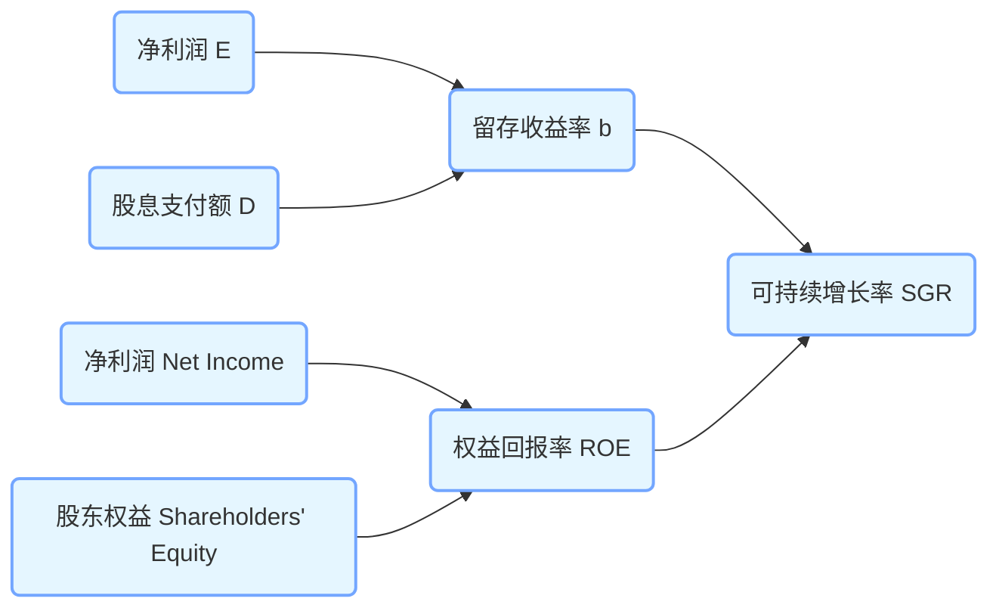

# 特价股票投资中的可持续增长模型应用

> 关键词：特价股票投资、可持续增长模型、股票估值、财务分析、投资策略

> 摘要：本文聚焦于特价股票投资领域，深入探讨可持续增长模型在其中的应用。首先介绍了研究的背景、目的和预期读者等信息，接着阐述了可持续增长模型的核心概念、算法原理、数学模型。通过实际的项目实战案例，详细展示了如何在特价股票投资中运用该模型。同时分析了其实际应用场景，推荐了相关的学习工具和资源。最后总结了未来的发展趋势与挑战，并对常见问题进行了解答。旨在为投资者提供全面、深入的理论和实践指导，帮助他们更好地利用可持续增长模型进行特价股票投资决策。

## 1. 背景介绍 
### 1.1 目的和范围
在股票投资市场中，特价股票往往因其价格相对较低而吸引众多投资者的关注。然而，如何准确判断特价股票的投资价值并非易事。可持续增长模型作为一种重要的财务分析工具，能够帮助投资者评估企业的长期增长潜力和内在价值。本文章的目的在于深入探讨可持续增长模型在特价股票投资中的具体应用，为投资者提供科学的投资决策依据。研究范围涵盖了可持续增长模型的基本原理、在特价股票分析中的应用方法以及实际案例分析等方面。

### 1.2 预期读者
本文主要面向对股票投资感兴趣的个人投资者、专业投资机构的分析师以及金融领域的研究人员。无论是初涉股市的新手，还是经验丰富的投资专家，都能从本文中获取有关可持续增长模型在特价股票投资中应用的有价值信息。

### 1.3 文档结构概述
本文将按照以下结构展开：首先介绍相关背景信息，包括目的、预期读者和文档结构等；接着阐述可持续增长模型的核心概念及其与特价股票投资的联系；详细讲解可持续增长模型的算法原理和具体操作步骤，并给出相应的Python源代码；分析该模型的数学模型和公式，并通过举例进行说明；通过实际的项目实战案例，展示如何在特价股票投资中运用该模型；探讨可持续增长模型在实际投资中的应用场景；推荐相关的学习工具和资源；最后总结未来的发展趋势与挑战，解答常见问题，并提供扩展阅读和参考资料。

### 1.4 术语表
#### 1.4.1 核心术语定义
- **特价股票**：指市场价格相对其内在价值被低估的股票。这类股票可能由于市场短期波动、行业负面消息等因素导致价格下跌，但企业本身具有一定的发展潜力和价值。
- **可持续增长模型**：是一种用于评估企业在不依赖外部股权融资的情况下，能够实现的长期稳定增长率的模型。该模型基于企业的留存收益率和权益回报率等财务指标进行计算。
- **留存收益率**：指企业净利润中用于再投资的比例，即留存收益与净利润的比值。留存收益率反映了企业将盈利资金用于自身发展的意愿和能力。
- **权益回报率（ROE）**：又称净资产收益率，是衡量企业运用自有资本的效率指标。它表示企业净利润与股东权益的比率，反映了股东权益的收益水平。

#### 1.4.2 相关概念解释
- **股票估值**：是对股票内在价值的评估过程。通过分析企业的财务状况、行业前景、市场竞争力等因素，运用各种估值方法（如现金流折现法、市盈率法等）来确定股票的合理价格。
- **财务分析**：是指通过对企业财务报表（如资产负债表、利润表、现金流量表）等相关数据的分析，评估企业的财务状况、经营成果和现金流量情况。财务分析是投资决策的重要依据之一。
- **投资策略**：是投资者为了实现投资目标而制定的一系列投资计划和方法。投资策略包括选股策略、资产配置策略、风险控制策略等多个方面。

#### 1.4.3 缩略词列表
- **ROE**：Return on Equity，权益回报率
- **EPS**：Earnings Per Share，每股收益

## 2. 核心概念与联系 

### 可持续增长模型的原理
可持续增长模型的核心思想是，企业在不发行新股且保持当前的经营效率和财务政策的前提下，其销售额、资产和股东权益能够实现的最大增长率。该模型基于以下两个重要假设：一是企业的资产和销售保持固定的比例关系；二是企业的留存收益率和权益回报率保持稳定。

根据这些假设，可持续增长率（SGR）可以通过以下公式计算：

$$SGR = b \times ROE$$

其中，$b$ 为留存收益率，$ROE$ 为权益回报率。

留存收益率 $b$ 表示企业将净利润留存用于再投资的比例，计算公式为：

$$b = 1 - \frac{D}{E}$$

其中，$D$ 为股息支付额，$E$ 为净利润。

权益回报率 $ROE$ 反映了企业运用股东权益创造利润的能力，计算公式为：

$$ROE = \frac{Net Income}{Shareholders' Equity}$$

### 可持续增长模型与特价股票投资的联系
在特价股票投资中，可持续增长模型具有重要的应用价值。通过计算企业的可持续增长率，投资者可以评估企业的长期增长潜力。如果一家企业的可持续增长率较高，说明该企业在不依赖外部股权融资的情况下，能够实现较快的增长，具有较强的内在价值。

当股票价格被低估时，投资者可以结合可持续增长模型来判断该股票是否具有投资价值。如果企业的可持续增长率较高，且当前股价低于其内在价值，那么该股票可能是一个较好的投资选择。此外，可持续增长模型还可以帮助投资者预测企业未来的盈利和现金流情况，为股票估值提供重要的依据。

### 文本示意图
```plaintext
可持续增长模型
|
|-- 留存收益率 (b)
|   |-- 净利润 (E)
|   |-- 股息支付额 (D)
|
|-- 权益回报率 (ROE)
|   |-- 净利润 (Net Income)
|   |-- 股东权益 (Shareholders' Equity)
|
|-- 可持续增长率 (SGR)
```

### Mermaid 流程图


## 3. 核心算法原理 & 具体操作步骤 

### 算法原理
可持续增长模型的核心算法是基于上述的计算公式，通过计算留存收益率和权益回报率来确定可持续增长率。具体步骤如下：
1. 计算留存收益率 $b$：根据企业的净利润和股息支付额，使用公式 $b = 1 - \frac{D}{E}$ 计算留存收益率。
2. 计算权益回报率 $ROE$：根据企业的净利润和股东权益，使用公式 $ROE = \frac{Net Income}{Shareholders' Equity}$ 计算权益回报率。
3. 计算可持续增长率 $SGR$：将留存收益率 $b$ 和权益回报率 $ROE$ 代入公式 $SGR = b \times ROE$ 中，计算可持续增长率。

### Python 源代码实现
```python
def calculate_retention_ratio(net_income, dividend_payout):
    """
    计算留存收益率
    :param net_income: 净利润
    :param dividend_payout: 股息支付额
    :return: 留存收益率
    """
    if net_income == 0:
        return 0
    return 1 - (dividend_payout / net_income)

def calculate_roe(net_income, shareholders_equity):
    """
    计算权益回报率
    :param net_income: 净利润
    :param shareholders_equity: 股东权益
    :return: 权益回报率
    """
    if shareholders_equity == 0:
        return 0
    return net_income / shareholders_equity

def calculate_sustainable_growth_rate(net_income, dividend_payout, shareholders_equity):
    """
    计算可持续增长率
    :param net_income: 净利润
    :param dividend_payout: 股息支付额
    :param shareholders_equity: 股东权益
    :return: 可持续增长率
    """
    b = calculate_retention_ratio(net_income, dividend_payout)
    roe = calculate_roe(net_income, shareholders_equity)
    return b * roe

# 示例数据
net_income = 1000000  # 净利润
dividend_payout = 200000  # 股息支付额
shareholders_equity = 5000000  # 股东权益

# 计算可持续增长率
sgr = calculate_sustainable_growth_rate(net_income, dividend_payout, shareholders_equity)
print(f"可持续增长率: {sgr * 100:.2f}%")
```

### 具体操作步骤
1. **数据收集**：收集企业的财务报表数据，包括净利润、股息支付额和股东权益等信息。这些数据可以从企业的年度报告、季度报告或金融数据提供商处获取。
2. **数据处理**：对收集到的数据进行清洗和整理，确保数据的准确性和一致性。
3. **计算留存收益率**：使用上述的 `calculate_retention_ratio` 函数计算留存收益率。
4. **计算权益回报率**：使用 `calculate_roe` 函数计算权益回报率。
5. **计算可持续增长率**：使用 `calculate_sustainable_growth_rate` 函数计算可持续增长率。
6. **分析结果**：根据计算得到的可持续增长率，评估企业的长期增长潜力，并结合股票的市场价格，判断该股票是否具有投资价值。

## 4. 数学模型和公式 & 详细讲解 & 举例说明 

### 数学模型和公式
如前文所述，可持续增长模型的核心公式为：

$$SGR = b \times ROE$$

其中，$SGR$ 为可持续增长率，$b$ 为留存收益率，$ROE$ 为权益回报率。

留存收益率 $b$ 的计算公式为：

$$b = 1 - \frac{D}{E}$$

权益回报率 $ROE$ 的计算公式为：

$$ROE = \frac{Net Income}{Shareholders' Equity}$$

### 详细讲解
- **留存收益率（$b$）**：留存收益率反映了企业将净利润留存用于再投资的比例。较高的留存收益率意味着企业有更多的资金用于扩大生产、研发新产品或进行并购等活动，从而有助于企业实现更快的增长。例如，如果一家企业的净利润为 100 万元，股息支付额为 20 万元，那么留存收益率 $b = 1 - \frac{20}{100} = 0.8$，即 80%。这意味着企业将 80% 的净利润留存用于再投资。
- **权益回报率（$ROE$）**：权益回报率衡量了企业运用股东权益创造利润的效率。较高的 $ROE$ 表示企业能够更有效地利用股东的资金，为股东创造更高的回报。例如，如果一家企业的净利润为 50 万元，股东权益为 200 万元，那么 $ROE = \frac{50}{200} = 0.25$，即 25%。这意味着企业每投入 1 元的股东权益，能够创造 0.25 元的净利润。
- **可持续增长率（$SGR$）**：可持续增长率表示企业在不发行新股且保持当前经营效率和财务政策的前提下，能够实现的最大增长率。例如，如果一家企业的留存收益率为 0.8，权益回报率为 0.2，那么可持续增长率 $SGR = 0.8 \times 0.2 = 0.16$，即 16%。这意味着该企业在现有条件下，每年能够实现 16% 的增长。

### 举例说明
假设一家企业的财务数据如下：
- 净利润（$E$）：200 万元
- 股息支付额（$D$）：50 万元
- 股东权益：1000 万元

首先，计算留存收益率 $b$：

$$b = 1 - \frac{D}{E} = 1 - \frac{50}{200} = 0.75$$

然后，计算权益回报率 $ROE$：

$$ROE = \frac{Net Income}{Shareholders' Equity} = \frac{200}{1000} = 0.2$$

最后，计算可持续增长率 $SGR$：

$$SGR = b \times ROE = 0.75 \times 0.2 = 0.15$$

即该企业的可持续增长率为 15%。这表明，如果该企业保持当前的经营效率和财务政策，不发行新股，其销售额、资产和股东权益每年能够实现 15% 的增长。

## 5. 项目实战：代码实际案例和详细解释说明 

### 5.1 开发环境搭建
在进行项目实战之前，需要搭建相应的开发环境。以下是具体的步骤：
1. **安装 Python**：Python 是一种广泛使用的编程语言，适合进行数据分析和财务计算。可以从 Python 官方网站（https://www.python.org/downloads/）下载并安装最新版本的 Python。
2. **安装开发工具**：推荐使用 Anaconda 作为 Python 的开发环境。Anaconda 是一个集成了 Python 解释器、常用库和开发工具的平台，方便用户进行数据分析和科学计算。可以从 Anaconda 官方网站（https://www.anaconda.com/products/individual）下载并安装 Anaconda。
3. **安装必要的库**：在本项目中，需要使用 `pandas` 库进行数据处理和分析。可以使用以下命令安装 `pandas` 库：
```sh
pip install pandas
```

### 5.2 源代码详细实现和代码解读
以下是一个完整的项目实战代码示例，用于计算多只股票的可持续增长率，并进行简单的分析：

```python
import pandas as pd

def calculate_retention_ratio(net_income, dividend_payout):
    """
    计算留存收益率
    :param net_income: 净利润
    :param dividend_payout: 股息支付额
    :return: 留存收益率
    """
    if net_income == 0:
        return 0
    return 1 - (dividend_payout / net_income)

def calculate_roe(net_income, shareholders_equity):
    """
    计算权益回报率
    :param net_income: 净利润
    :param shareholders_equity: 股东权益
    :return: 权益回报率
    """
    if shareholders_equity == 0:
        return 0
    return net_income / shareholders_equity

def calculate_sustainable_growth_rate(net_income, dividend_payout, shareholders_equity):
    """
    计算可持续增长率
    :param net_income: 净利润
    :param dividend_payout: 股息支付额
    :param shareholders_equity: 股东权益
    :return: 可持续增长率
    """
    b = calculate_retention_ratio(net_income, dividend_payout)
    roe = calculate_roe(net_income, shareholders_equity)
    return b * roe

# 示例数据
data = {
    'Stock Symbol': ['AAPL', 'GOOG', 'MSFT'],
    'Net Income': [1000000, 1500000, 2000000],
    'Dividend Payout': [200000, 300000, 400000],
    'Shareholders Equity': [5000000, 6000000, 7000000]
}

# 创建 DataFrame
df = pd.DataFrame(data)

# 计算留存收益率、权益回报率和可持续增长率
df['Retention Ratio'] = df.apply(lambda row: calculate_retention_ratio(row['Net Income'], row['Dividend Payout']), axis=1)
df['ROE'] = df.apply(lambda row: calculate_roe(row['Net Income'], row['Shareholders Equity']), axis=1)
df['Sustainable Growth Rate'] = df.apply(lambda row: calculate_sustainable_growth_rate(row['Net Income'], row['Dividend Payout'], row['Shareholders Equity']), axis=1)

# 打印结果
print(df)
```

### 代码解读与分析
1. **导入必要的库**：导入 `pandas` 库用于数据处理和分析。
2. **定义计算函数**：定义了三个函数 `calculate_retention_ratio`、`calculate_roe` 和 `calculate_sustainable_growth_rate`，分别用于计算留存收益率、权益回报率和可持续增长率。
3. **创建示例数据**：使用字典 `data` 存储多只股票的财务数据，包括股票代码、净利润、股息支付额和股东权益。
4. **创建 DataFrame**：使用 `pandas` 的 `DataFrame` 函数将示例数据转换为数据框。
5. **计算各项指标**：使用 `apply` 方法对数据框的每一行应用计算函数，计算留存收益率、权益回报率和可持续增长率，并将结果添加到数据框中。
6. **打印结果**：打印包含各项指标的完整数据框，方便用户查看和分析。

通过这个项目实战，我们可以看到如何使用 Python 和 `pandas` 库计算多只股票的可持续增长率，并进行简单的数据分析。投资者可以根据计算结果，筛选出具有较高可持续增长率的特价股票，作为投资的参考。

## 6. 实际应用场景 
### 股票筛选
投资者可以使用可持续增长模型对大量股票进行筛选，找出具有较高可持续增长率的特价股票。例如，投资者可以设定一个可持续增长率的阈值，如 10%，然后筛选出可持续增长率大于该阈值的股票。这些股票可能具有较好的长期增长潜力，值得进一步研究和投资。

### 股票估值
可持续增长模型可以作为股票估值的重要工具之一。通过预测企业的可持续增长率，投资者可以使用现金流折现模型等方法，计算股票的内在价值。如果股票的市场价格低于其内在价值，那么该股票可能被低估，具有投资价值。

### 投资组合管理
在构建投资组合时，投资者可以考虑将具有不同可持续增长率的股票进行组合。例如，将高可持续增长率的成长型股票与低可持续增长率但股息稳定的价值型股票相结合，以实现风险分散和收益最大化的目标。

### 企业财务分析
对于企业管理层和分析师来说，可持续增长模型可以用于评估企业的财务状况和发展潜力。通过分析企业的可持续增长率，管理层可以制定合理的发展战略，如确定合理的留存收益率和股息政策，以实现企业的长期稳定增长。

## 7. 工具和资源推荐
### 7.1 学习资源推荐
#### 7.1.1 书籍推荐
- 《财务报表分析与证券定价》：本书详细介绍了财务报表分析的方法和技巧，以及如何运用财务数据进行证券定价。其中包含了对可持续增长模型等重要财务分析工具的深入讲解。
- 《聪明的投资者》：这是一本经典的投资著作，作者本杰明·格雷厄姆介绍了价值投资的理念和方法。书中的内容对于理解特价股票投资和运用财务分析工具具有重要的指导意义。
- 《巴菲特致股东的信：投资者和公司高管教程》：通过阅读巴菲特的信件，读者可以学习到他的投资哲学和方法。巴菲特非常注重企业的长期增长潜力，可持续增长模型在他的投资决策中也具有重要的地位。

#### 7.1.2 在线课程
- Coursera 上的《财务分析基础》：该课程由知名高校的教授授课，系统地介绍了财务分析的基本概念、方法和工具，包括可持续增长模型的应用。
- edX 上的《投资学原理》：课程涵盖了投资学的各个方面，包括股票投资、债券投资、投资组合管理等。其中对财务分析和股票估值的讲解有助于学习者掌握可持续增长模型在投资中的应用。
- 网易云课堂上的《股票投资实战教程》：该课程结合实际案例，介绍了股票投资的技巧和方法，包括如何运用财务分析工具筛选特价股票。

#### 7.1.3 技术博客和网站
- 雪球网：这是一个专注于股票投资的社区，用户可以在上面分享投资经验、交流投资心得。雪球网上有很多关于财务分析和股票估值的文章，其中不乏对可持续增长模型的讨论和应用案例。
- 东方财富网：提供丰富的金融数据和资讯，包括企业的财务报表、股票行情等。投资者可以通过东方财富网获取所需的财务数据，用于可持续增长模型的计算和分析。
- Seeking Alpha：这是一个全球知名的金融分析网站，上面有很多专业的分析师撰写的投资分析文章。其中一些文章会运用可持续增长模型等工具对股票进行分析和评级。

### 7.2 开发工具框架推荐
#### 7.2.1 IDE和编辑器
- PyCharm：是一款专业的 Python 集成开发环境，具有强大的代码编辑、调试和项目管理功能。适合进行数据分析和财务计算等 Python 项目的开发。
- Jupyter Notebook：是一个交互式的开发环境，支持 Python、R 等多种编程语言。它以网页的形式展示代码和结果，方便用户进行数据探索和分析。在进行可持续增长模型的计算和可视化时，Jupyter Notebook 是一个很好的选择。
- Visual Studio Code：是一款轻量级的代码编辑器，支持多种编程语言和插件。它具有丰富的扩展功能，可以通过安装 Python 相关的插件来进行 Python 开发。

#### 7.2.2 调试和性能分析工具
- pdb：是 Python 自带的调试工具，可以帮助开发者在代码运行过程中进行调试和排查问题。通过设置断点、单步执行等操作，开发者可以深入了解代码的执行流程和变量的值。
- cProfile：是 Python 标准库中的性能分析工具，可以帮助开发者分析代码的性能瓶颈。通过统计函数的调用次数、执行时间等信息，开发者可以找出代码中耗时较长的部分，并进行优化。
- Py-Spy：是一个轻量级的 Python 性能分析工具，可以实时监控 Python 程序的运行状态和性能指标。它可以帮助开发者快速定位性能问题，并进行优化。

#### 7.2.3 相关框架和库
- pandas：是一个强大的数据分析库，提供了高效的数据结构和数据处理工具。在进行可持续增长模型的计算和分析时，pandas 可以帮助开发者快速处理和分析财务数据。
- numpy：是 Python 中用于科学计算的基础库，提供了高效的数组操作和数学函数。在进行财务计算时，numpy 可以提高代码的执行效率。
- matplotlib：是一个用于数据可视化的库，可以帮助开发者将计算结果以图表的形式展示出来。通过可视化分析，开发者可以更直观地了解数据的特征和趋势。

### 7.3 相关论文著作推荐
#### 7.3.1 经典论文
- Robert C. Higgins, “How Much Growth Can a Firm Afford?”, Financial Management, 1977. 这篇论文首次提出了可持续增长模型的概念，并对其进行了详细的阐述和分析。
- Eugene F. Fama and Kenneth R. French, “The Cross-Section of Expected Stock Returns”, Journal of Finance, 1992. 该论文提出了著名的 Fama-French 三因子模型，对股票的预期收益率进行了深入研究。虽然该模型与可持续增长模型没有直接关系，但对于理解股票投资的风险和收益具有重要的参考价值。

#### 7.3.2 最新研究成果
- 在学术数据库（如 Google Scholar、IEEE Xplore、ACM Digital Library 等）上搜索关于“可持续增长模型在股票投资中的应用”、“特价股票投资策略”等关键词，可以找到最新的研究成果和学术论文。这些研究成果可能会提出新的理论和方法，对可持续增长模型的应用进行拓展和创新。

#### 7.3.3 应用案例分析
- 一些金融研究机构和投资咨询公司会发布关于股票投资的研究报告和案例分析。这些报告和案例通常会结合实际的市场数据，运用可持续增长模型等工具对股票进行分析和评估。投资者可以通过阅读这些报告和案例，学习如何在实际投资中运用可持续增长模型。

## 8. 总结：未来发展趋势与挑战
### 未来发展趋势
- **模型的不断完善**：随着金融理论和实践的不断发展，可持续增长模型可能会不断完善和改进。例如，考虑更多的因素（如宏观经济环境、行业竞争态势等）对企业可持续增长的影响，使模型更加准确地反映企业的实际情况。
- **与其他模型的融合**：可持续增长模型可能会与其他投资分析模型（如现金流折现模型、市盈率模型等）进行融合，形成更加综合和全面的投资分析方法。通过多种模型的相互验证和补充，可以提高投资决策的准确性和可靠性。
- **大数据和人工智能的应用**：大数据和人工智能技术的发展为可持续增长模型的应用带来了新的机遇。通过收集和分析大量的企业财务数据、市场数据和行业数据，利用机器学习和深度学习算法，可以挖掘出更多有价值的信息，提高模型的预测能力和分析效率。

### 挑战
- **数据的准确性和可靠性**：可持续增长模型的计算和分析依赖于准确和可靠的财务数据。然而，企业的财务报表可能存在造假、粉饰等问题，导致数据的真实性受到影响。此外，数据的收集和整理也可能存在误差和遗漏，给模型的应用带来挑战。
- **假设条件的局限性**：可持续增长模型基于一些假设条件，如企业的资产和销售保持固定的比例关系、留存收益率和权益回报率保持稳定等。在实际市场中，这些假设条件可能并不成立，导致模型的预测结果与实际情况存在偏差。
- **市场的不确定性**：股票市场受到多种因素的影响，如宏观经济环境、政策法规、行业竞争等，具有很大的不确定性。即使企业的可持续增长率较高，也不能保证其股票价格一定会上涨。投资者在运用可持续增长模型进行投资决策时，需要充分考虑市场的不确定性，做好风险控制。

## 9. 附录：常见问题与解答
### 1. 可持续增长模型适用于所有企业吗？
可持续增长模型并不适用于所有企业。该模型基于一些假设条件，如企业的资产和销售保持固定的比例关系、留存收益率和权益回报率保持稳定等。对于一些处于快速扩张期、业务模式不稳定或财务政策频繁变化的企业，这些假设条件可能不成立，因此该模型的应用效果可能会受到影响。此外，对于一些新兴行业或高科技企业，由于其发展具有较大的不确定性，可持续增长模型的预测能力也可能有限。

### 2. 如何判断股票是否为特价股票？
判断股票是否为特价股票需要综合考虑多个因素。除了运用可持续增长模型评估企业的长期增长潜力外，还可以使用其他估值方法（如现金流折现法、市盈率法等）计算股票的内在价值，并将其与市场价格进行比较。如果股票的市场价格低于其内在价值，那么该股票可能被低估，是一个潜在的特价股票。此外，还可以分析企业的基本面情况，如财务状况、行业前景、市场竞争力等，以判断股票的投资价值。

### 3. 可持续增长率越高越好吗？
一般来说，较高的可持续增长率表明企业具有较强的增长潜力，但并不是越高越好。过高的可持续增长率可能意味着企业过度依赖留存收益进行扩张，导致财务风险增加。此外，如果企业的可持续增长率超过了行业平均水平或市场预期，可能会面临更大的竞争压力和市场风险。因此，投资者在评估企业的可持续增长率时，需要结合行业特点、市场环境等因素进行综合分析。

### 4. 如何获取企业的财务数据？
企业的财务数据可以从多个渠道获取。常见的渠道包括企业的官方网站、证券交易所的官方网站、金融数据提供商（如 Wind、东方财富等）。此外，还可以通过阅读企业的年度报告、季度报告、招股说明书等公开披露的文件获取详细的财务信息。

### 5. 可持续增长模型与其他投资分析模型有什么区别和联系？
可持续增长模型主要关注企业的长期增长潜力，通过计算留存收益率和权益回报率来确定企业的可持续增长率。而其他投资分析模型，如现金流折现模型主要关注企业未来的现金流情况，通过将未来现金流折现来计算股票的内在价值；市盈率模型则通过比较股票的市盈率与行业平均市盈率来评估股票的估值水平。

这些模型之间存在一定的联系。可持续增长模型可以为其他模型提供重要的输入参数，如预测企业的未来盈利和现金流情况。同时，其他模型也可以为可持续增长模型的应用提供补充和验证。投资者在进行投资决策时，可以综合运用多种模型，以提高决策的准确性和可靠性。

## 10. 扩展阅读 & 参考资料
### 扩展阅读
- 《金融市场与金融机构》：本书全面介绍了金融市场和金融机构的基本概念、运作机制和发展趋势。通过阅读本书，读者可以更好地理解股票市场的运行规律和投资环境。
- 《投资中最简单的事》：作者邱国鹭分享了自己多年的投资经验和心得，介绍了一些简单而有效的投资方法和策略。书中的内容对于初学者和有一定经验的投资者都具有很大的启发。
- 《行为金融学》：行为金融学是一门研究投资者心理和行为对金融市场影响的学科。通过阅读相关书籍，投资者可以了解自己和其他投资者的心理偏差，避免在投资决策中犯错误。

### 参考资料
- 企业的年度报告、季度报告和招股说明书等公开披露的文件。
- 金融数据提供商（如 Wind、东方财富等）提供的财务数据和市场信息。
- 学术期刊和会议论文，如《Journal of Finance》、《Financial Management》等。

作者：AI天才研究院/AI Genius Institute & 禅与计算机程序设计艺术 /Zen And The Art of Computer Programming