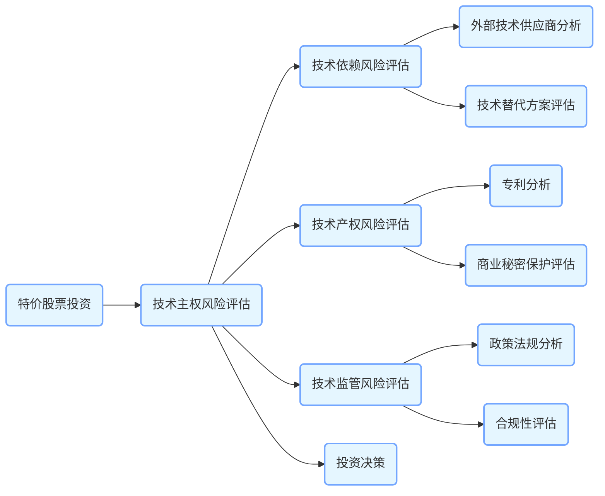

# 特价股票投资中的技术主权风险评估

> 关键词：特价股票投资、技术主权风险、风险评估、数学模型、实际应用

> 摘要：本文聚焦于特价股票投资中的技术主权风险评估。在当今复杂多变的金融市场环境下，特价股票投资虽具有潜在的高回报，但也伴随着诸多风险，其中技术主权风险尤为关键。文章首先介绍了研究的背景、目的、预期读者等内容，接着阐述了核心概念及联系，深入剖析核心算法原理并给出 Python 代码示例，同时介绍了相关数学模型和公式。通过项目实战展示了如何进行技术主权风险评估的代码实现及解读，探讨了实际应用场景。还推荐了学习资源、开发工具框架和相关论文著作。最后总结了未来发展趋势与挑战，并提供常见问题解答和扩展阅读参考资料，旨在为投资者在特价股票投资中有效评估技术主权风险提供全面且深入的指导。

## 1. 背景介绍 
### 1.1 目的和范围
在金融投资领域，特价股票常常吸引着众多投资者的目光，因其价格相对较低，可能蕴含着巨大的增值潜力。然而，随着科技在企业运营和市场竞争中的作用日益凸显，技术主权风险逐渐成为影响特价股票投资收益的重要因素。本研究的目的在于深入探讨特价股票投资中技术主权风险的评估方法，为投资者提供科学、有效的风险评估工具和策略。

研究范围涵盖了各种类型的特价股票，包括但不限于因行业周期、公司短期困境或市场情绪等因素导致价格下跌的股票。同时，将技术主权风险细分为技术依赖风险、技术产权风险、技术监管风险等多个维度进行研究，以全面评估其对特价股票投资的影响。

### 1.2 预期读者
本文预期读者主要包括金融投资者，无论是个人投资者还是机构投资者，都能从本文中获取关于特价股票投资中技术主权风险评估的专业知识和实用方法，从而优化投资决策。此外，金融分析师、投资顾问等专业人士也可将本文作为研究参考，提升其对市场风险的分析和判断能力。同时，相关领域的学者和研究人员也能从文章中获得新的研究思路和视角。

### 1.3 文档结构概述
本文将按照以下结构展开：首先介绍核心概念，明确技术主权风险在特价股票投资中的定义和相关联系；接着阐述核心算法原理，并给出具体的 Python 代码实现；然后介绍用于风险评估的数学模型和公式，并通过举例进行详细说明；通过项目实战展示代码的实际应用和解读；探讨技术主权风险评估在实际投资场景中的应用；推荐相关的学习资源、开发工具框架和论文著作；最后总结未来发展趋势与挑战，提供常见问题解答和扩展阅读参考资料。

### 1.4 术语表
#### 1.4.1 核心术语定义
- **特价股票**：指市场价格相对其内在价值或历史价格处于较低水平的股票，通常由于公司短期业绩不佳、行业竞争压力、宏观经济环境变化等因素导致。
- **技术主权**：企业在技术研发、应用、管理等方面拥有自主决策和控制的权力，包括技术产权的归属、技术的独立性和自主性等。
- **技术主权风险**：在特价股票投资中，由于目标企业技术主权受到威胁或侵犯而导致投资损失的可能性，如技术依赖外部供应商、技术产权纠纷、技术监管政策变化等。

#### 1.4.2 相关概念解释
- **技术依赖风险**：企业过度依赖外部技术供应商，当供应商出现问题（如技术升级中断、供应中断、价格上涨等）时，企业的生产经营和市场竞争力将受到影响，进而影响股票价值。
- **技术产权风险**：企业在技术产权方面存在纠纷或漏洞，如专利侵权、商业秘密泄露等，可能导致企业面临法律诉讼、经济赔偿和声誉损失，从而对股票价格产生负面影响。
- **技术监管风险**：政府或行业监管机构对企业技术应用和发展的监管政策发生变化，如加强技术安全审查、限制特定技术的使用等，可能增加企业的合规成本和经营风险，影响股票投资收益。

#### 1.4.3 缩略词列表
- **IT**：信息技术（Information Technology）
- **AI**：人工智能（Artificial Intelligence）
- **IoT**：物联网（Internet of Things）

## 2. 核心概念与联系 
### 核心概念原理
在特价股票投资中，技术主权风险评估的核心在于分析目标企业在技术领域的自主控制能力和面临的潜在风险。技术主权是企业核心竞争力的重要组成部分，它直接影响企业的创新能力、生产效率和市场地位。当企业的技术主权受到威胁时，可能会导致技术创新停滞、生产成本上升、市场份额下降等问题，进而影响企业的盈利能力和股票价值。

技术主权风险主要来源于以下几个方面：
- **技术依赖**：如果企业在关键技术上依赖外部供应商，一旦供应商出现问题，企业的生产经营将受到严重影响。例如，一家智能手机制造商依赖某家芯片供应商，如果该供应商因技术故障或产能问题无法按时供货，制造商的手机生产将受阻，市场份额可能被竞争对手抢占。
- **技术产权纠纷**：企业的技术产权受到侵犯或存在纠纷时，可能需要投入大量的时间和资金进行法律诉讼，同时还可能面临经济赔偿和声誉损失。例如，某家科技公司被指控侵犯他人专利，可能需要支付巨额的专利使用费，甚至可能被禁止生产相关产品。
- **技术监管政策变化**：政府或行业监管机构对技术的监管政策不断变化，企业需要及时调整技术战略以适应新的监管要求。如果企业不能及时响应，可能会面临合规风险和经营风险。例如，政府加强对数据隐私和安全的监管，企业需要投入更多的资源来保护用户数据，否则可能会受到处罚。

### 架构的文本示意图
```plaintext
特价股票投资
|
|-- 技术主权风险评估
|   |
|   |-- 技术依赖风险评估
|   |   |
|   |   |-- 外部技术供应商分析
|   |   |-- 技术替代方案评估
|   |
|   |-- 技术产权风险评估
|   |   |
|   |   |-- 专利分析
|   |   |-- 商业秘密保护评估
|   |
|   |-- 技术监管风险评估
|   |   |
|   |   |-- 政策法规分析
|   |   |-- 合规性评估
|
|-- 投资决策
```

### Mermaid 流程图


## 3. 核心算法原理 & 具体操作步骤 
### 核心算法原理
在特价股票投资的技术主权风险评估中，我们可以采用多因素综合评估法。该方法将技术依赖风险、技术产权风险和技术监管风险等多个因素纳入评估体系，通过对每个因素进行量化评分，然后加权求和得到最终的风险评估得分。

具体来说，我们为每个风险因素设定相应的评估指标和权重，通过收集和分析相关数据，对每个指标进行评分，最后根据权重计算出每个风险因素的得分，再将各个风险因素的得分相加得到总得分。总得分越高，说明技术主权风险越高。

### Python 代码实现
```python
# 定义各风险因素的权重
weights = {
    "技术依赖风险": 0.3,
    "技术产权风险": 0.4,
    "技术监管风险": 0.3
}

# 定义各风险因素的评估指标及评分函数
def technology_dependence_risk_score(supplier_reliability, alternative_technology_availability):
    """
    计算技术依赖风险得分
    :param supplier_reliability: 外部技术供应商可靠性评分 (0-10)
    :param alternative_technology_availability: 技术替代方案可用性评分 (0-10)
    :return: 技术依赖风险得分 (0-10)
    """
    # 简单加权平均计算
    return (supplier_reliability + alternative_technology_availability) / 2

def technology_property_risk_score(patent_strength, trade_secret_protection):
    """
    计算技术产权风险得分
    :param patent_strength: 专利实力评分 (0-10)
    :param trade_secret_protection: 商业秘密保护评分 (0-10)
    :return: 技术产权风险得分 (0-10)
    """
    # 简单加权平均计算
    return (patent_strength + trade_secret_protection) / 2

def technology_regulatory_risk_score(policy_familiarity, compliance_level):
    """
    计算技术监管风险得分
    :param policy_familiarity: 对政策法规的熟悉程度评分 (0-10)
    :param compliance_level: 合规水平评分 (0-10)
    :return: 技术监管风险得分 (0-10)
    """
    # 简单加权平均计算
    return (policy_familiarity + compliance_level) / 2

def overall_technology_sovereignty_risk_score(supplier_reliability, alternative_technology_availability,
                                             patent_strength, trade_secret_protection,
                                             policy_familiarity, compliance_level):
    """
    计算总体技术主权风险得分
    :param supplier_reliability: 外部技术供应商可靠性评分 (0-10)
    :param alternative_technology_availability: 技术替代方案可用性评分 (0-10)
    :param patent_strength: 专利实力评分 (0-10)
    :param trade_secret_protection: 商业秘密保护评分 (0-10)
    :param policy_familiarity: 对政策法规的熟悉程度评分 (0-10)
    :param compliance_level: 合规水平评分 (0-10)
    :return: 总体技术主权风险得分 (0-10)
    """
    # 计算各风险因素得分
    dependence_score = technology_dependence_risk_score(supplier_reliability, alternative_technology_availability)
    property_score = technology_property_risk_score(patent_strength, trade_secret_protection)
    regulatory_score = technology_regulatory_risk_score(policy_familiarity, compliance_level)
    
    # 加权求和计算总体得分
    overall_score = (weights["技术依赖风险"] * dependence_score +
                     weights["技术产权风险"] * property_score +
                     weights["技术监管风险"] * regulatory_score)
    
    return overall_score

# 示例数据
supplier_reliability = 3
alternative_technology_availability = 2
patent_strength = 6
trade_secret_protection = 7
policy_familiarity = 4
compliance_level = 5

# 计算总体技术主权风险得分
risk_score = overall_technology_sovereignty_risk_score(supplier_reliability, alternative_technology_availability,
                                                       patent_strength, trade_secret_protection,
                                                       policy_familiarity, compliance_level)
print(f"总体技术主权风险得分: {risk_score}")
```

### 具体操作步骤
1. **数据收集**：收集目标企业在技术依赖、技术产权和技术监管等方面的相关数据，如外部技术供应商的信息、专利情况、商业秘密保护措施、对政策法规的了解程度和合规情况等。
2. **指标评分**：根据收集到的数据，对每个评估指标进行评分，评分范围为 0 - 10 分，分数越高表示风险越低。
3. **因素得分计算**：使用上述定义的评分函数，计算每个风险因素的得分。
4. **总体得分计算**：根据各风险因素的权重，加权求和得到总体技术主权风险得分。
5. **风险评估**：根据总体得分对技术主权风险进行评估，得分越高表示风险越高，投资者可以根据评估结果做出相应的投资决策。

## 4. 数学模型和公式 & 详细讲解 & 举例说明 
### 数学模型
设技术依赖风险因素为 $R_d$，技术产权风险因素为 $R_p$，技术监管风险因素为 $R_r$，各因素的权重分别为 $w_d$、$w_p$、$w_r$，且 $w_d + w_p + w_r = 1$。每个风险因素由多个评估指标组成，设技术依赖风险因素的评估指标为 $x_{d1}, x_{d2}, \cdots, x_{dn}$，技术产权风险因素的评估指标为 $x_{p1}, x_{p2}, \cdots, x_{pm}$，技术监管风险因素的评估指标为 $x_{r1}, x_{r2}, \cdots, x_{rl}$。

则各风险因素的得分计算公式为：
$$
R_d = \frac{\sum_{i=1}^{n} x_{di}}{n}
$$
$$
R_p = \frac{\sum_{j=1}^{m} x_{pj}}{m}
$$
$$
R_r = \frac{\sum_{k=1}^{l} x_{rk}}{l}
$$

总体技术主权风险得分 $R$ 的计算公式为：
$$
R = w_d R_d + w_p R_p + w_r R_r
$$

### 详细讲解
- **各风险因素得分计算**：每个风险因素的得分是其评估指标的平均值。例如，技术依赖风险因素的得分是通过对外部技术供应商可靠性和技术替代方案可用性等评估指标进行平均计算得到的。这意味着每个评估指标对该风险因素的影响是同等重要的。
- **总体得分计算**：总体技术主权风险得分是各风险因素得分的加权和。权重的设置反映了每个风险因素在整体风险评估中的重要程度。例如，技术产权风险因素的权重为 0.4，说明在总体风险评估中，技术产权风险的影响相对较大。

### 举例说明
假设某特价股票对应的企业，其技术依赖风险因素的评估指标为：外部技术供应商可靠性评分为 3 分，技术替代方案可用性评分为 2 分。则技术依赖风险因素的得分 $R_d$ 为：
$$
R_d = \frac{3 + 2}{2} = 2.5
$$

技术产权风险因素的评估指标为：专利实力评分为 6 分，商业秘密保护评分为 7 分。则技术产权风险因素的得分 $R_p$ 为：
$$
R_p = \frac{6 + 7}{2} = 6.5
$$

技术监管风险因素的评估指标为：对政策法规的熟悉程度评分为 4 分，合规水平评分为 5 分。则技术监管风险因素的得分 $R_r$ 为：
$$
R_r = \frac{4 + 5}{2} = 4.5
$$

设各因素的权重分别为 $w_d = 0.3$，$w_p = 0.4$，$w_r = 0.3$，则总体技术主权风险得分 $R$ 为：
$$
R = 0.3 \times 2.5 + 0.4 \times 6.5 + 0.3 \times 4.5 = 4.7
$$

这表明该企业的技术主权风险处于中等水平，投资者在进行投资决策时需要综合考虑其他因素。

## 5. 项目实战：代码实际案例和详细解释说明 
### 5.1  开发环境搭建
为了运行上述 Python 代码，我们需要搭建相应的开发环境。具体步骤如下：
1. **安装 Python**：从 Python 官方网站（https://www.python.org/downloads/）下载并安装 Python 3.x 版本。建议选择最新的稳定版本。
2. **安装开发工具**：可以选择使用 PyCharm、Visual Studio Code 等集成开发环境（IDE），也可以使用 Jupyter Notebook 进行代码开发和测试。这里以 PyCharm 为例，从 JetBrains 官方网站（https://www.jetbrains.com/pycharm/download/）下载并安装 PyCharm Community Edition。
3. **创建虚拟环境**：为了避免不同项目之间的依赖冲突，建议使用虚拟环境。在命令行中执行以下命令创建并激活虚拟环境：
```bash
# 创建虚拟环境
python -m venv myenv

# 激活虚拟环境（Windows）
myenv\Scripts\activate

# 激活虚拟环境（Linux/Mac）
source myenv/bin/activate
```

### 5.2  源代码详细实现和代码解读
```python
# 定义各风险因素的权重
weights = {
    "技术依赖风险": 0.3,
    "技术产权风险": 0.4,
    "技术监管风险": 0.3
}
```
这部分代码定义了各风险因素的权重，使用字典的形式存储，方便后续的计算。权重的设置可以根据实际情况进行调整，不同的投资者可能对不同的风险因素有不同的关注程度。

```python
def technology_dependence_risk_score(supplier_reliability, alternative_technology_availability):
    """
    计算技术依赖风险得分
    :param supplier_reliability: 外部技术供应商可靠性评分 (0-10)
    :param alternative_technology_availability: 技术替代方案可用性评分 (0-10)
    :return: 技术依赖风险得分 (0-10)
    """
    # 简单加权平均计算
    return (supplier_reliability + alternative_technology_availability) / 2
```
该函数用于计算技术依赖风险得分，接受两个参数：外部技术供应商可靠性评分和技术替代方案可用性评分。通过简单的平均计算得到技术依赖风险得分。

```python
def technology_property_risk_score(patent_strength, trade_secret_protection):
    """
    计算技术产权风险得分
    :param patent_strength: 专利实力评分 (0-10)
    :param trade_secret_protection: 商业秘密保护评分 (0-10)
    :return: 技术产权风险得分 (0-10)
    """
    # 简单加权平均计算
    return (patent_strength + trade_secret_protection) / 2
```
此函数用于计算技术产权风险得分，接受专利实力评分和商业秘密保护评分作为参数，同样通过平均计算得到得分。

```python
def technology_regulatory_risk_score(policy_familiarity, compliance_level):
    """
    计算技术监管风险得分
    :param policy_familiarity: 对政策法规的熟悉程度评分 (0-10)
    :param compliance_level: 合规水平评分 (0-10)
    :return: 技术监管风险得分 (0-10)
    """
    # 简单加权平均计算
    return (policy_familiarity + compliance_level) / 2
```
该函数计算技术监管风险得分，接受对政策法规的熟悉程度评分和合规水平评分作为参数，通过平均计算得到得分。

```python
def overall_technology_sovereignty_risk_score(supplier_reliability, alternative_technology_availability,
                                             patent_strength, trade_secret_protection,
                                             policy_familiarity, compliance_level):
    """
    计算总体技术主权风险得分
    :param supplier_reliability: 外部技术供应商可靠性评分 (0-10)
    :param alternative_technology_availability: 技术替代方案可用性评分 (0-10)
    :param patent_strength: 专利实力评分 (0-10)
    :param trade_secret_protection: 商业秘密保护评分 (0-10)
    :param policy_familiarity: 对政策法规的熟悉程度评分 (0-10)
    :param compliance_level: 合规水平评分 (0-10)
    :return: 总体技术主权风险得分 (0-10)
    """
    # 计算各风险因素得分
    dependence_score = technology_dependence_risk_score(supplier_reliability, alternative_technology_availability)
    property_score = technology_property_risk_score(patent_strength, trade_secret_protection)
    regulatory_score = technology_regulatory_risk_score(policy_familiarity, compliance_level)
    
    # 加权求和计算总体得分
    overall_score = (weights["技术依赖风险"] * dependence_score +
                     weights["技术产权风险"] * property_score +
                     weights["技术监管风险"] * regulatory_score)
    
    return overall_score
```
该函数是核心函数，用于计算总体技术主权风险得分。首先调用前面定义的三个函数分别计算各风险因素的得分，然后根据权重进行加权求和得到总体得分。

```python
# 示例数据
supplier_reliability = 3
alternative_technology_availability = 2
patent_strength = 6
trade_secret_protection = 7
policy_familiarity = 4
compliance_level = 5

# 计算总体技术主权风险得分
risk_score = overall_technology_sovereignty_risk_score(supplier_reliability, alternative_technology_availability,
                                                       patent_strength, trade_secret_protection,
                                                       policy_familiarity, compliance_level)
print(f"总体技术主权风险得分: {risk_score}")
```
这部分代码使用示例数据调用 `overall_technology_sovereignty_risk_score` 函数计算总体技术主权风险得分，并将结果打印输出。

### 5.3  代码解读与分析
- **模块化设计**：代码采用模块化设计，将不同风险因素的得分计算封装成独立的函数，提高了代码的可读性和可维护性。同时，核心的总体得分计算函数也独立出来，方便后续的扩展和修改。
- **参数化设计**：各函数的参数都是评分值，方便用户根据实际情况输入不同的数据进行计算。用户可以通过收集目标企业的相关信息，对每个评估指标进行评分，然后调用相应的函数进行风险评估。
- **可扩展性**：代码具有一定的可扩展性。如果需要增加或修改评估指标，可以在相应的函数中进行调整；如果需要改变各风险因素的权重，只需修改 `weights` 字典即可。

## 6. 实际应用场景 
### 个人投资者决策
对于个人投资者来说，在选择特价股票进行投资时，技术主权风险评估可以帮助他们更好地了解目标企业的潜在风险。例如，一位个人投资者对某家科技公司的特价股票感兴趣，通过使用本文介绍的方法进行技术主权风险评估，发现该公司在技术依赖方面存在较高风险，外部技术供应商的可靠性较低且缺乏有效的技术替代方案。那么投资者可以更加谨慎地考虑是否投资该股票，或者在投资时适当降低投资比例。

### 机构投资者资产配置
机构投资者通常管理着大量的资产，需要进行合理的资产配置。在选择特价股票纳入投资组合时，技术主权风险评估可以作为重要的参考依据。例如，一家基金公司在构建投资组合时，会对备选的特价股票进行全面的风险评估，包括技术主权风险。对于技术主权风险较高的股票，可能会减少其在投资组合中的权重，以降低整体风险。

### 金融分析师研究报告
金融分析师在撰写关于特价股票的研究报告时，可以运用技术主权风险评估方法对目标企业进行深入分析。通过评估技术主权风险，分析师可以更准确地预测企业的未来发展趋势和股票价格走势，为投资者提供更有价值的投资建议。例如，分析师在研究报告中指出某家企业的技术产权风险较高，存在专利侵权纠纷的可能性，这可能会引起投资者的关注，从而影响他们的投资决策。

### 企业战略规划
对于企业自身来说，技术主权风险评估也具有重要意义。企业可以通过评估自身的技术主权风险，发现存在的问题和不足，及时调整技术战略和经营策略。例如，一家企业发现自己在技术依赖方面存在较高风险，可能会加大对自主研发的投入，寻找更多的技术替代方案，以提高自身的技术主权和市场竞争力。

## 7. 工具和资源推荐
### 7.1 学习资源推荐
#### 7.1.1 书籍推荐
- 《金融市场与金融机构》：这本书全面介绍了金融市场的基本概念、金融机构的运作模式以及金融投资的相关知识，对于理解特价股票投资的背景和原理非常有帮助。
- 《技术创新管理》：详细阐述了企业技术创新的过程、策略和管理方法，有助于深入理解技术主权的重要性和相关风险。
- 《风险管理与金融机构》：系统讲解了金融风险管理的理论和方法，包括风险评估、风险度量和风险控制等方面的内容，对于进行技术主权风险评估具有重要的指导意义。

#### 7.1.2 在线课程
- Coursera 上的“金融市场”课程：由知名教授授课，涵盖了金融市场的各个方面，包括股票投资、风险管理等内容，通过视频讲解、案例分析和在线测试等方式帮助学习者掌握相关知识。
- edX 上的“技术创新与创业”课程：介绍了技术创新的前沿理论和实践经验，以及如何在创业过程中管理技术风险，对于理解技术主权风险在企业发展中的作用具有很大的启发。
- 中国大学 MOOC 上的“金融风险管理”课程：结合中国金融市场的实际情况，讲解了金融风险管理的基本原理和方法，提供了丰富的案例和练习题，有助于学习者提高风险管理能力。

#### 7.1.3 技术博客和网站
- 雪球网：是一个投资者社区，提供了丰富的股票投资信息和分析文章，投资者可以在上面交流投资经验、分享研究成果，了解特价股票的最新动态。
- 金融界：是一个专业的金融资讯网站，提供股票行情、财经新闻、研究报告等内容，对于获取金融市场的最新信息和分析具有重要的参考价值。
- 麻省理工科技评论：专注于科技领域的前沿研究和创新动态，介绍了许多关于技术主权、技术创新等方面的文章，有助于了解技术领域的最新趋势和发展方向。

### 7.2 开发工具框架推荐
#### 7.2.1 IDE和编辑器
- PyCharm：是一款专门为 Python 开发设计的集成开发环境，具有代码编辑、调试、自动补全、代码分析等功能，能够提高开发效率和代码质量。
- Visual Studio Code：是一款轻量级的代码编辑器，支持多种编程语言，具有丰富的插件生态系统，可以根据需要安装各种插件来扩展功能，适合进行 Python 代码开发。
- Jupyter Notebook：是一个交互式的开发环境，支持 Python、R 等多种编程语言，通过代码块和文本块的组合，可以方便地进行代码编写、数据可视化和文档记录，非常适合进行数据分析和模型开发。

#### 7.2.2 调试和性能分析工具
- PDB：是 Python 自带的调试工具，可以在代码中设置断点，逐行执行代码，查看变量的值和程序的执行流程，帮助开发者定位和解决问题。
- cProfile：是 Python 的性能分析工具，可以统计程序中各个函数的执行时间和调用次数，帮助开发者找出程序的性能瓶颈，进行优化。
- Py-Spy：是一个轻量级的性能分析工具，可以在不修改代码的情况下对 Python 程序进行性能分析，实时显示程序的 CPU 使用率和函数调用情况。

#### 7.2.3 相关框架和库
- Pandas：是一个强大的数据分析库，提供了高效的数据结构和数据处理工具，方便进行数据清洗、数据分析和数据可视化。
- Numpy：是 Python 的数值计算库，提供了高效的多维数组对象和各种数学函数，对于进行数学模型的实现和计算非常有用。
- Matplotlib：是一个常用的绘图库，可以绘制各种类型的图表，如折线图、柱状图、散点图等，用于数据可视化和结果展示。

### 7.3 相关论文著作推荐
#### 7.3.1 经典论文
- “The Capital Asset Pricing Model: Theory and Evidence”：该论文介绍了资本资产定价模型（CAPM），是金融领域的经典论文之一，对于理解股票投资的风险和收益关系具有重要的意义。
- “Innovation and Entrepreneurship: Practice and Principles”：详细阐述了创新和创业的理论和实践方法，对于理解企业技术创新和技术主权的重要性具有很大的启发。
- “Risk Management and Financial Institutions”：系统讲解了金融风险管理的理论和方法，包括风险评估、风险度量和风险控制等方面的内容，对于进行技术主权风险评估具有重要的参考价值。

#### 7.3.2 最新研究成果
- 关注顶级金融和科技期刊，如《Journal of Financial Economics》、《Management Science》、《Nature》、《Science》等，这些期刊经常发表关于金融投资、技术创新和风险管理等方面的最新研究成果。
- 参加相关的学术会议和研讨会，如国际金融会议（WFA）、国际技术创新会议（R&D Management Conference）等，与行业内的专家和学者交流，了解最新的研究动态和趋势。

#### 7.3.3 应用案例分析
- 阅读各大金融机构和咨询公司发布的研究报告和案例分析，如麦肯锡、波士顿咨询、高盛等，这些报告通常包含了实际的投资案例和风险评估分析，对于学习和应用技术主权风险评估方法具有重要的参考价值。
- 关注企业的年报和招股说明书，了解企业在技术研发、技术产权和技术监管等方面的情况，分析企业面临的技术主权风险及其对企业经营和股票价值的影响。

## 8. 总结：未来发展趋势与挑战
### 未来发展趋势
- **技术创新加速**：随着科技的不断进步，企业的技术创新速度将越来越快。这将导致技术主权风险的评估更加复杂，投资者需要更加关注企业的技术研发能力和创新潜力，以及技术更新换代对企业竞争力的影响。
- **政策法规加强**：政府和行业监管机构对技术领域的监管将不断加强，特别是在数据安全、隐私保护、知识产权等方面。投资者需要密切关注政策法规的变化，及时评估其对特价股票投资的影响。
- **数字化转型加速**：越来越多的企业将进行数字化转型，这将增加企业对信息技术的依赖。投资者需要关注企业在数字化转型过程中面临的技术主权风险，如技术安全、数据治理等方面的问题。
- **国际合作与竞争加剧**：在全球化的背景下，企业的国际合作与竞争将更加激烈。投资者需要考虑国际政治、经济和技术环境的变化对企业技术主权的影响，以及企业在国际市场上的竞争力和风险。

### 挑战
- **数据获取困难**：技术主权风险评估需要大量的相关数据，如企业的技术研发情况、专利信息、商业秘密保护措施等。然而，这些数据往往难以获取，特别是对于一些中小企业和新兴企业。
- **风险量化难度大**：技术主权风险涉及多个维度和因素，其中一些因素难以进行量化评估，如技术创新能力、技术人才队伍等。这给风险评估带来了一定的困难，需要投资者运用主观判断和经验进行综合评估。
- **市场不确定性增加**：金融市场的不确定性增加，股票价格受到多种因素的影响，如宏观经济环境、行业竞争、政策法规等。技术主权风险只是其中的一个因素，投资者需要综合考虑各种因素，才能做出准确的投资决策。
- **技术更新换代快**：科技的快速发展导致技术更新换代速度加快，企业的技术优势可能很快被取代。投资者需要及时跟踪企业的技术发展动态，评估技术主权风险的变化，调整投资策略。

## 9. 附录：常见问题与解答
### 1. 如何确定各风险因素的权重？
各风险因素的权重可以根据投资者的风险偏好和投资目标来确定。一般来说，如果投资者更关注技术产权风险，可以适当提高技术产权风险因素的权重；如果投资者更关注技术依赖风险，可以提高技术依赖风险因素的权重。此外，也可以参考行业平均水平和专家意见来确定权重。

### 2. 评估指标的评分标准是什么？
评估指标的评分标准可以根据具体情况进行制定。一般来说，可以将评分范围设定为 0 - 10 分，分数越高表示风险越低。例如，对于外部技术供应商可靠性评分，可以根据供应商的历史业绩、信誉、技术实力等因素进行评估，信誉良好、技术实力强的供应商可以评为 8 - 10 分，存在一定问题的供应商可以评为 3 - 7 分，问题严重的供应商可以评为 0 - 2 分。

### 3. 如何收集评估所需的数据？
可以通过以下途径收集评估所需的数据：
- **企业公开信息**：查阅企业的年报、招股说明书、公告等公开信息，了解企业的技术研发情况、专利信息、商业秘密保护措施等。
- **行业研究报告**：参考行业研究机构发布的研究报告，了解行业的技术发展趋势、竞争格局等信息。
- **新闻媒体报道**：关注新闻媒体对企业的报道，了解企业的最新动态和技术主权风险相关的事件。
- **实地调研**：如果条件允许，可以对企业进行实地调研，与企业管理层、技术人员等进行交流，了解企业的实际情况。

### 4. 技术主权风险评估结果如何应用？
技术主权风险评估结果可以作为投资决策的重要参考依据。如果评估结果显示技术主权风险较高，投资者可以谨慎考虑是否投资该股票，或者在投资时适当降低投资比例；如果评估结果显示技术主权风险较低，投资者可以考虑增加投资比例。此外，评估结果还可以帮助企业发现自身存在的问题和不足，及时调整技术战略和经营策略。

## 10. 扩展阅读 & 参考资料
### 扩展阅读
- 《创新者的窘境》：探讨了企业在面对技术创新和市场变革时所面临的挑战和困境，对于理解技术主权在企业发展中的重要性具有很大的启发。
- 《金融炼金术》：作者乔治·索罗斯通过自己的投资实践，阐述了金融市场的运行规律和投资策略，对于投资者在特价股票投资中应对各种风险具有重要的参考价值。
- 《人工智能时代的风险与机遇》：介绍了人工智能技术的发展现状和趋势，以及其对社会、经济和金融领域的影响，对于了解技术创新带来的风险和机遇具有重要的意义。

### 参考资料
- 中国证券监督管理委员会官方网站：提供了股票市场的相关政策法规、市场数据和监管信息，是获取金融市场信息的重要渠道。
- 国家知识产权局官方网站：提供了专利申请、审查、授权等方面的信息，对于了解企业的专利情况具有重要的参考价值。
- 世界知识产权组织（WIPO）官方网站：提供了全球知识产权保护的相关信息和统计数据，有助于了解国际知识产权保护的趋势和动态。

作者：AI天才研究院/AI Genius Institute & 禅与计算机程序设计艺术 /Zen And The Art of Computer Programming