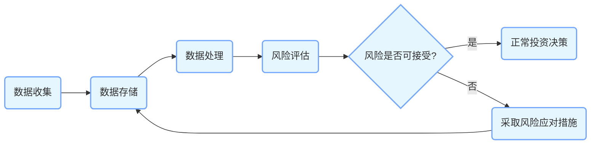

# 特价股票投资中的数据隐私风险评估方法

> 关键词：特价股票投资、数据隐私风险、评估方法、数据安全、金融数据

> 摘要：本文聚焦于特价股票投资领域的数据隐私风险评估方法。在当今数字化金融时代，特价股票投资涉及大量敏感数据，数据隐私保护至关重要。文章深入探讨了相关核心概念，详细阐述了评估的核心算法原理及具体操作步骤，结合数学模型和公式进行分析，并通过项目实战案例展示如何在实际中应用这些评估方法。同时，介绍了实际应用场景、推荐了相关工具和资源，最后对未来发展趋势与挑战进行总结，还提供了常见问题解答及扩展阅读参考资料，旨在为投资者、金融机构和研究人员提供全面且深入的关于特价股票投资数据隐私风险评估的知识和方法。

## 1. 背景介绍 
### 1.1 目的和范围
在金融市场中，特价股票投资因其潜在的高回报率吸引了众多投资者。然而，随着信息技术的飞速发展，投资过程中涉及大量的数据收集、存储和处理，数据隐私问题日益凸显。本文章的目的在于深入研究特价股票投资中的数据隐私风险评估方法，为投资者、金融机构以及监管部门提供科学、有效的评估手段，以保障数据隐私安全。范围涵盖了特价股票投资从数据收集到最终决策整个过程中的各类数据隐私风险，包括但不限于个人身份信息、交易记录、投资策略等方面的风险评估。

### 1.2 预期读者
本文预期读者包括从事特价股票投资的个人投资者、金融机构的投资经理和分析师、专注于金融数据安全的研究人员以及相关的监管部门工作人员。对于个人投资者，有助于他们了解投资过程中数据隐私风险，更好地保护自身权益；金融机构人员可以借助评估方法优化业务流程，加强数据安全管理；研究人员可在此基础上开展进一步的学术研究；监管部门则能依据评估方法制定更合理的监管政策。

### 1.3 文档结构概述
本文首先介绍背景信息，让读者了解研究的目的和意义。接着阐述核心概念与联系，明确相关术语和概念的内涵及相互关系。然后详细讲解核心算法原理和具体操作步骤，通过 Python 代码进行示例。之后介绍数学模型和公式，并举例说明其应用。再通过项目实战案例展示如何将理论应用于实际。随后介绍实际应用场景，让读者了解评估方法的实际用途。接着推荐相关的工具和资源，为读者提供学习和实践的途径。最后对未来发展趋势与挑战进行总结，同时提供常见问题解答和扩展阅读参考资料。

### 1.4 术语表
#### 1.4.1 核心术语定义
- **特价股票投资**：指投资者购买价格相对较低、具有潜在价值提升空间的股票的投资行为。
- **数据隐私风险**：指在数据的收集、存储、处理、传输和共享过程中，由于各种原因导致个人或机构的敏感数据被泄露、篡改或滥用的可能性。
- **风险评估方法**：是一套用于识别、分析和评价数据隐私风险的流程和技术手段。

#### 1.4.2 相关概念解释
- **数据脱敏**：是一种对敏感数据进行变形处理的技术，使得数据在不泄露敏感信息的前提下仍可用于分析和处理。
- **数据加密**：通过使用加密算法将数据转换为密文，只有拥有正确密钥的人才能解密并获取原始数据，从而保护数据的机密性。
- **访问控制**：是一种安全机制，用于限制对数据资源的访问权限，确保只有授权的用户才能访问特定的数据。

#### 1.4.3 缩略词列表
- **API**：Application Programming Interface，应用程序编程接口
- **SSL/TLS**：Secure Sockets Layer/Transport Layer Security，安全套接层/传输层安全协议
- **KPI**：Key Performance Indicator，关键绩效指标

## 2. 核心概念与联系 

### 核心概念原理
在特价股票投资中，数据隐私风险主要源于多个环节。数据收集阶段，可能因不规范的收集方式导致用户敏感信息泄露。例如，一些投资平台在用户注册时要求过多不必要的个人信息，且未明确告知信息用途和保护措施。存储阶段，若数据库安全防护不足，可能遭受黑客攻击，导致数据泄露。处理阶段，不当的数据处理算法可能会暴露数据中的敏感信息。

数据隐私风险评估的核心原理是通过对这些环节进行全面分析，识别潜在的风险因素，并根据其发生的可能性和影响程度进行量化评估。评估过程需要综合考虑数据的敏感性、数据处理的流程、安全防护措施的有效性等多个因素。

### 架构的文本示意图
以下是特价股票投资数据隐私风险评估的架构示意图：

1. **数据收集层**：负责收集投资者的各类信息，包括个人身份信息、财务状况、投资偏好等。
2. **数据存储层**：将收集到的数据存储在数据库中，需要采取安全措施确保数据的安全性。
3. **数据处理层**：对存储的数据进行分析和处理，如数据分析、建模等。
4. **风险评估层**：根据数据收集、存储和处理过程中的信息，评估数据隐私风险。
5. **决策层**：根据风险评估结果，制定相应的决策，如加强安全防护、调整数据处理策略等。

### Mermaid 流程图


该流程图展示了特价股票投资数据隐私风险评估的主要流程。从数据收集开始，经过存储和处理，然后进行风险评估。评估结果判断风险是否可接受，如果可接受则进行正常投资决策，否则采取风险应对措施并重新回到数据存储环节进行优化。

## 3. 核心算法原理 & 具体操作步骤 

### 核心算法原理
我们采用基于机器学习的风险评估算法，具体为逻辑回归算法。逻辑回归是一种常用的分类算法，它可以根据输入的特征变量预测事件发生的概率。在数据隐私风险评估中，我们将多个风险因素作为输入特征，如数据收集的合规性、存储的安全性、处理的复杂度等，通过逻辑回归模型预测数据隐私风险发生的概率。

逻辑回归的基本原理是通过一个逻辑函数将线性回归的结果映射到 [0, 1] 区间，从而得到事件发生的概率。逻辑函数的表达式为：

$$P(Y = 1|X) = \frac{1}{1 + e^{-(b_0 + b_1X_1 + b_2X_2 + \cdots + b_nX_n)}}$$

其中，$P(Y = 1|X)$ 表示在给定特征向量 $X = (X_1, X_2, \cdots, X_n)$ 的情况下，事件 $Y = 1$ 发生的概率；$b_0, b_1, b_2, \cdots, b_n$ 是模型的参数。

### 具体操作步骤及 Python 代码实现

#### 步骤 1：数据准备
首先，我们需要收集和整理用于训练和测试模型的数据。数据应包含多个风险因素作为特征变量，以及对应的风险标签（0 表示无风险，1 表示有风险）。

```python
import pandas as pd
from sklearn.model_selection import train_test_split

# 读取数据
data = pd.read_csv('privacy_risk_data.csv')

# 分离特征和标签
X = data.drop('risk_label', axis=1)
y = data['risk_label']

# 划分训练集和测试集
X_train, X_test, y_train, y_test = train_test_split(X, y, test_size=0.2, random_state=42)
```

#### 步骤 2：模型训练
使用训练集数据对逻辑回归模型进行训练。

```python
from sklearn.linear_model import LogisticRegression

# 创建逻辑回归模型
model = LogisticRegression()

# 训练模型
model.fit(X_train, y_train)
```

#### 步骤 3：模型评估
使用测试集数据对训练好的模型进行评估，常用的评估指标有准确率、精确率、召回率等。

```python
from sklearn.metrics import accuracy_score, precision_score, recall_score

# 预测测试集结果
y_pred = model.predict(X_test)

# 计算评估指标
accuracy = accuracy_score(y_test, y_pred)
precision = precision_score(y_test, y_pred)
recall = recall_score(y_test, y_pred)

print(f"Accuracy: {accuracy}")
print(f"Precision: {precision}")
print(f"Recall: {recall}")
```

#### 步骤 4：风险预测
使用训练好的模型对新的数据进行风险预测。

```python
# 假设有新的数据
new_data = pd.DataFrame({
    'feature1': [1],
    'feature2': [0],
    'feature3': [1]
})

# 预测风险概率
risk_probability = model.predict_proba(new_data)[:, 1]
print(f"Risk probability: {risk_probability[0]}")
```

## 4. 数学模型和公式 & 详细讲解 & 举例说明 

### 逻辑回归模型公式
如前面所述，逻辑回归模型的核心公式为：

$$P(Y = 1|X) = \frac{1}{1 + e^{-(b_0 + b_1X_1 + b_2X_2 + \cdots + b_nX_n)}}$$

### 详细讲解
- $P(Y = 1|X)$：表示在给定特征向量 $X$ 的情况下，事件 $Y = 1$（即存在数据隐私风险）发生的概率。
- $b_0$：是模型的截距项，也称为偏置项，它表示当所有特征变量都为 0 时，事件发生的基础概率。
- $b_1, b_2, \cdots, b_n$：是模型的系数，它们表示每个特征变量对事件发生概率的影响程度。系数为正表示该特征变量增加会提高事件发生的概率，系数为负表示该特征变量增加会降低事件发生的概率。
- $X_1, X_2, \cdots, X_n$：是输入的特征变量，在数据隐私风险评估中，这些特征变量可以是数据收集的合规性得分、存储的安全级别、处理的复杂度等。

### 举例说明
假设我们有一个简化的风险评估模型，只考虑两个特征变量：$X_1$ 表示数据收集的合规性得分（取值范围为 0 - 1，0 表示完全不合规，1 表示完全合规），$X_2$ 表示存储的安全级别（取值范围为 0 - 1，0 表示安全级别低，1 表示安全级别高）。模型的参数为 $b_0 = -2$，$b_1 = 1$，$b_2 = 2$。

当 $X_1 = 0.8$，$X_2 = 0.6$ 时，我们可以计算数据隐私风险发生的概率：

$$P(Y = 1|X) = \frac{1}{1 + e^{-(-2 + 1\times0.8 + 2\times0.6)}}$$

首先计算指数部分：

$$-(-2 + 1\times0.8 + 2\times0.6) = -(-2 + 0.8 + 1.2) = 0$$

然后计算概率：

$$P(Y = 1|X) = \frac{1}{1 + e^{0}} = \frac{1}{1 + 1} = 0.5$$

这意味着在给定的数据收集合规性得分和存储安全级别下，数据隐私风险发生的概率为 0.5。

## 5. 项目实战：代码实际案例和详细解释说明 

### 5.1  开发环境搭建
为了实现特价股票投资数据隐私风险评估项目，我们需要搭建以下开发环境：

#### 操作系统
可以选择 Windows、Linux 或 macOS 操作系统。

#### 编程语言
使用 Python 作为开发语言，Python 具有丰富的数据分析和机器学习库，非常适合此类项目。

#### 开发工具
推荐使用 Anaconda 作为 Python 环境管理工具，它可以方便地安装和管理各种 Python 库。同时，可以使用 Jupyter Notebook 作为代码编辑和运行环境，它具有交互性强、易于展示代码和结果的特点。

#### 安装必要的库
在 Anaconda 环境中，使用以下命令安装必要的库：

```sh
pip install pandas scikit-learn matplotlib
```

### 5.2  源代码详细实现和代码解读

```python
import pandas as pd
from sklearn.model_selection import train_test_split
from sklearn.linear_model import LogisticRegression
from sklearn.metrics import accuracy_score, precision_score, recall_score
import matplotlib.pyplot as plt

# 步骤 1：数据准备
# 读取数据
data = pd.read_csv('privacy_risk_data.csv')

# 数据探索
print("数据基本信息：")
data.info()

# 查看数据集行数和列数
rows, columns = data.shape

if rows < 100:
    # 小数据集（行数少于100）查看全量数据信息
    print("数据全部内容信息：")
    print(data.to_csv(sep='\t', na_rep='nan'))
else:
    # 大数据集查看数据前几行信息
    print("数据前几行内容信息：")
    print(data.head().to_csv(sep='\t', na_rep='nan'))

# 分离特征和标签
X = data.drop('risk_label', axis=1)
y = data['risk_label']

# 划分训练集和测试集
X_train, X_test, y_train, y_test = train_test_split(X, y, test_size=0.2, random_state=42)

# 步骤 2：模型训练
# 创建逻辑回归模型
model = LogisticRegression()

# 训练模型
model.fit(X_train, y_train)

# 步骤 3：模型评估
# 预测测试集结果
y_pred = model.predict(X_test)

# 计算评估指标
accuracy = accuracy_score(y_test, y_pred)
precision = precision_score(y_test, y_pred)
recall = recall_score(y_test, y_pred)

print(f"Accuracy: {accuracy}")
print(f"Precision: {precision}")
print(f"Recall: {recall}")

# 步骤 4：可视化评估结果
metrics = ['Accuracy', 'Precision', 'Recall']
values = [accuracy, precision, recall]

plt.bar(metrics, values)
plt.xlabel('Metrics')
plt.ylabel('Score')
plt.title('Model Evaluation Metrics')
plt.show()

# 步骤 5：风险预测
# 假设有新的数据
new_data = pd.DataFrame({
    'feature1': [1],
    'feature2': [0],
    'feature3': [1]
})

# 预测风险概率
risk_probability = model.predict_proba(new_data)[:, 1]
print(f"Risk probability: {risk_probability[0]}")
```

### 代码解读与分析

#### 数据准备部分
- `pd.read_csv('privacy_risk_data.csv')`：使用 Pandas 库读取存储在 CSV 文件中的数据。
- `data.info()`：查看数据的基本信息，包括列名、数据类型、非空值数量等。
- `train_test_split(X, y, test_size=0.2, random_state=42)`：将数据集划分为训练集和测试集，测试集占比为 20%。

#### 模型训练部分
- `LogisticRegression()`：创建逻辑回归模型对象。
- `model.fit(X_train, y_train)`：使用训练集数据对模型进行训练。

#### 模型评估部分
- `model.predict(X_test)`：使用训练好的模型对测试集数据进行预测。
- `accuracy_score(y_test, y_pred)`、`precision_score(y_test, y_pred)`、`recall_score(y_test, y_pred)`：分别计算模型的准确率、精确率和召回率。

#### 可视化部分
使用 Matplotlib 库绘制柱状图，直观展示模型的评估指标。

#### 风险预测部分
- `model.predict_proba(new_data)`：使用训练好的模型对新的数据进行风险概率预测。

## 6. 实际应用场景 

### 个人投资者
个人投资者在进行特价股票投资时，需要使用各种投资平台和工具。通过数据隐私风险评估方法，投资者可以了解平台的数据收集和处理方式，评估自身数据隐私面临的风险。例如，如果评估发现某个平台的数据收集过于宽泛且安全措施不足，投资者可以选择更换平台，从而保护自己的个人信息和投资策略不被泄露。

### 金融机构
金融机构在开展特价股票投资业务时，涉及大量客户数据的处理。数据隐私风险评估可以帮助金融机构识别内部数据处理流程中的潜在风险，如数据存储系统的安全性、员工对数据的访问权限等。金融机构可以根据评估结果采取相应的措施，如加强数据加密、完善访问控制机制，以保障客户数据的隐私安全，维护机构的声誉。

### 监管部门
监管部门可以利用数据隐私风险评估方法对金融市场中的特价股票投资活动进行监管。通过要求金融机构和投资平台进行数据隐私风险评估并提交报告，监管部门可以及时发现行业中存在的数据隐私问题，制定相应的监管政策和法规，规范市场秩序，保护投资者的合法权益。

## 7. 工具和资源推荐
### 7.1 学习资源推荐
#### 7.1.1 书籍推荐
- 《Python 数据分析实战》：本书详细介绍了使用 Python 进行数据分析的方法和技巧，包括数据清洗、数据可视化、机器学习等内容，对于理解和实现数据隐私风险评估中的数据处理部分非常有帮助。
- 《机器学习》（周志华著）：全面介绍了机器学习的基本概念、算法和应用，是机器学习领域的经典教材，对于深入理解逻辑回归等评估算法有很大的帮助。
- 《金融数据安全与隐私保护》：专门探讨金融领域的数据安全和隐私保护问题，结合实际案例介绍了各种数据隐私风险评估和防范方法。

#### 7.1.2 在线课程
- Coursera 上的“Applied Data Science with Python”：由密歇根大学开设的在线课程，系统地介绍了 Python 在数据科学中的应用，包括数据分析、机器学习等方面的内容。
- edX 上的“Machine Learning Fundamentals”：该课程涵盖了机器学习的基本原理和常用算法，适合初学者学习。
- 中国大学 MOOC 上的“金融科技前沿与趋势”：介绍了金融科技领域的最新发展和技术应用，其中包括金融数据安全和隐私保护的相关内容。

#### 7.1.3 技术博客和网站
- Towards Data Science：是一个专注于数据科学和机器学习的技术博客平台，上面有很多关于数据分析、机器学习算法和实际应用的文章。
- Kaggle：是一个数据科学竞赛平台，上面不仅有丰富的数据集可供学习和实践，还有很多优秀的数据科学家分享他们的经验和代码。
- 金融界网站：提供金融市场的最新动态和信息，同时也有一些关于金融数据安全和隐私保护的专题文章。

### 7.2 开发工具框架推荐
#### 7.2.1 IDE和编辑器
- PyCharm：是一款专业的 Python 集成开发环境，具有代码自动补全、调试、版本控制等功能，非常适合 Python 项目的开发。
- Jupyter Notebook：是一个交互式的开发环境，支持代码、文本、图表等多种形式的展示，方便进行数据探索和模型实验。
- Visual Studio Code：是一款轻量级的代码编辑器，支持多种编程语言，通过安装 Python 扩展可以方便地进行 Python 开发。

#### 7.2.2 调试和性能分析工具
- PDB：是 Python 内置的调试工具，可以在代码中设置断点，逐步执行代码，查看变量的值和程序的执行流程。
- cProfile：是 Python 标准库中的性能分析工具，可以分析代码的运行时间和函数调用情况，帮助找出性能瓶颈。
- Scikit-learn 中的 `cross_val_score`：可以用于模型的交叉验证和性能评估，帮助选择最优的模型参数。

#### 7.2.3 相关框架和库
- Pandas：是一个强大的数据处理和分析库，提供了高效的数据结构和数据操作方法，用于数据的读取、清洗、转换等操作。
- Scikit-learn：是一个广泛使用的机器学习库，提供了各种机器学习算法和工具，包括分类、回归、聚类等算法，以及模型选择、评估等功能。
- Matplotlib：是一个用于数据可视化的库，可以绘制各种类型的图表，如折线图、柱状图、散点图等，帮助直观地展示数据和模型评估结果。

### 7.3 相关论文著作推荐
#### 7.3.1 经典论文
- “A Survey on Data Privacy”：该论文全面综述了数据隐私领域的研究现状，包括数据隐私的定义、保护技术和评估方法等方面的内容，是数据隐私领域的经典文献。
- “Logistic Regression: A Self-Learning Text”：详细介绍了逻辑回归算法的原理、应用和实现方法，对于理解和使用逻辑回归进行风险评估有很大的帮助。
- “Privacy-Preserving Data Mining”：探讨了在数据挖掘过程中如何保护数据隐私的问题，提出了一些隐私保护的数据挖掘算法和技术。

#### 7.3.2 最新研究成果
- 在 IEEE Transactions on Information Forensics and Security、ACM Transactions on Privacy and Security 等学术期刊上，经常会发表关于数据隐私保护和风险评估的最新研究成果，可以关注这些期刊获取最新的研究动态。
- 每年的 ACM SIGSAC Conference on Computer and Communications Security、IEEE Symposium on Security and Privacy 等学术会议上，也会有很多关于数据隐私的研究论文发表。

#### 7.3.3 应用案例分析
- 一些金融机构和科技公司会发布关于数据隐私保护和风险评估的应用案例报告，例如银行如何保障客户交易数据的隐私安全、投资平台如何应对数据泄露风险等。可以通过这些案例学习实际应用中的经验和方法。

## 8. 总结：未来发展趋势与挑战

### 未来发展趋势
- **多维度数据融合评估**：未来的数据隐私风险评估将不仅仅局限于单一的数据类型和来源，而是会融合更多维度的数据，如社交网络数据、物联网数据等。通过综合分析多维度数据，可以更全面地评估数据隐私风险。
- **实时动态评估**：随着金融市场的快速变化和数据的实时更新，数据隐私风险评估也将向实时动态评估方向发展。能够实时监测数据的流动和变化，及时发现潜在的风险并采取相应的措施。
- **人工智能与区块链技术的应用**：人工智能技术可以进一步优化风险评估算法，提高评估的准确性和效率。区块链技术则可以提供更安全、透明的数据存储和共享方式，增强数据隐私保护的能力。

### 挑战
- **数据质量和完整性**：数据隐私风险评估依赖于高质量、完整的数据。然而，在实际应用中，数据可能存在缺失、错误、不一致等问题，这会影响评估结果的准确性。如何保证数据的质量和完整性是一个重要的挑战。
- **法律法规和监管政策的变化**：随着数据隐私问题的日益受到关注，各国和地区的法律法规和监管政策也在不断变化。如何及时了解和适应这些变化，确保评估方法和业务操作符合法规要求，是金融机构和投资者面临的挑战。
- **技术复杂性和成本**：采用先进的评估技术和方法往往需要较高的技术水平和成本投入。对于一些小型金融机构和个人投资者来说，可能难以承担这些成本。如何在保证评估效果的前提下，降低技术复杂性和成本，是一个亟待解决的问题。

## 9. 附录：常见问题与解答

### 问题 1：数据隐私风险评估的结果是否准确可靠？
答：数据隐私风险评估的结果受到多种因素的影响，包括数据的质量、评估方法的合理性、模型的准确性等。虽然我们采用了科学的评估方法和模型，但评估结果仍然存在一定的不确定性。为了提高评估结果的准确性和可靠性，需要不断优化数据收集和处理方法，选择合适的评估模型，并进行充分的模型验证和评估。

### 问题 2：如何选择合适的风险评估方法？
答：选择合适的风险评估方法需要考虑多个因素，如数据的特点、评估的目的、可用的资源等。对于特价股票投资中的数据隐私风险评估，基于机器学习的方法如逻辑回归、决策树等通常比较适用。在选择方法时，可以参考相关的研究文献和实际应用案例，结合自身的情况进行选择和尝试。

### 问题 3：评估过程中如何保护数据的隐私？
答：在评估过程中，需要采取一系列措施保护数据的隐私。首先，对数据进行脱敏处理，确保在不泄露敏感信息的前提下进行分析。其次，采用安全的数据存储和传输方式，如使用加密技术对数据进行加密。此外，严格控制数据的访问权限，只有授权的人员才能访问和处理数据。

### 问题 4：评估结果对投资决策有什么影响？
答：评估结果可以为投资决策提供重要的参考。如果评估结果显示数据隐私风险较高，投资者可以考虑采取相应的措施，如选择更安全的投资平台、加强自身信息保护等。同时，金融机构也可以根据评估结果优化业务流程，提高数据安全管理水平，从而增强投资者的信心。

## 10. 扩展阅读 & 参考资料
### 扩展阅读
- 《数据安全与隐私保护技术》：深入介绍了数据安全和隐私保护的各种技术和方法，包括加密技术、访问控制技术、数据脱敏技术等。
- 《金融科技：发展趋势与监管》：探讨了金融科技领域的发展趋势和监管问题，对于理解金融行业的数据隐私风险评估背景有很大的帮助。
- 《机器学习实战》：通过实际案例介绍了机器学习算法的应用，包括分类、回归、聚类等算法，有助于进一步掌握机器学习在数据隐私风险评估中的应用。

### 参考资料
- 相关的金融行业报告和统计数据，如金融市场监管机构发布的报告、行业研究机构的调查报告等。
- 学术期刊和会议论文，如 IEEE Transactions on Information Forensics and Security、ACM SIGSAC Conference on Computer and Communications Security 等发表的论文。
- 开源代码库和数据集，如 Kaggle 上的金融数据集、GitHub 上的相关代码项目等。

作者：AI天才研究院/AI Genius Institute & 禅与计算机程序设计艺术 /Zen And The Art of Computer Programming