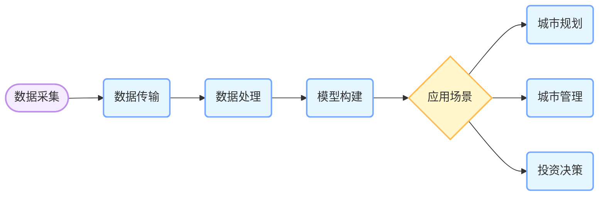

# 特价股票投资中的智慧城市与数字孪生整合方法

> 关键词：特价股票投资、智慧城市、数字孪生、整合方法、投资策略

> 摘要：本文聚焦于特价股票投资领域，深入探讨了智慧城市与数字孪生的整合方法。首先介绍了相关背景，包括目的范围、预期读者等内容。接着阐述了智慧城市和数字孪生的核心概念及其联系，详细讲解了核心算法原理与具体操作步骤，并运用数学模型和公式进行分析。通过项目实战案例，展示了整合方法在实际中的应用。同时，列举了实际应用场景、推荐了相关工具和资源。最后对未来发展趋势与挑战进行总结，解答常见问题并提供扩展阅读和参考资料，旨在为投资者在特价股票投资中利用智慧城市与数字孪生整合方法提供全面的指导。

## 1. 背景介绍 
### 1.1 目的和范围
在当今复杂多变的金融市场中，特价股票投资一直是投资者关注的焦点。随着科技的飞速发展，智慧城市和数字孪生技术逐渐成为推动城市发展和企业创新的重要力量。本文章的目的在于探索如何将智慧城市与数字孪生技术整合应用于特价股票投资领域，为投资者提供新的投资思路和方法。研究范围涵盖了智慧城市和数字孪生的基本概念、相关技术原理、在股票投资中的应用策略，以及通过实际案例分析验证整合方法的可行性和有效性。

### 1.2 预期读者
本文的预期读者主要包括对股票投资感兴趣的个人投资者、金融机构的投资分析师、从事智慧城市和数字孪生技术研究的专业人员，以及关注科技与金融融合发展的学者和研究人员。通过阅读本文，读者可以深入了解特价股票投资中智慧城市与数字孪生整合的方法和策略，为投资决策提供参考。

### 1.3 文档结构概述
本文将按照以下结构进行阐述：首先介绍相关背景知识，包括目的范围、预期读者和文档结构概述等内容；接着详细讲解智慧城市和数字孪生的核心概念及其联系，并通过文本示意图和 Mermaid 流程图进行直观展示；然后阐述核心算法原理和具体操作步骤，运用 Python 源代码进行详细说明；再通过数学模型和公式对整合方法进行分析，并举例说明；之后通过项目实战案例，介绍开发环境搭建、源代码实现和代码解读；随后列举实际应用场景；推荐相关工具和资源，包括学习资源、开发工具框架和相关论文著作；最后对未来发展趋势与挑战进行总结，解答常见问题并提供扩展阅读和参考资料。

### 1.4 术语表
#### 1.4.1 核心术语定义
- **特价股票投资**：指投资者以相对较低的价格购买具有潜在价值的股票，期望在未来获得较高的投资回报。
- **智慧城市**：利用信息技术和通信技术手段感测、分析、整合城市运行核心系统的各项关键信息，从而对包括民生、环保、公共安全、城市服务、工商业活动在内的各种需求做出智能响应，为人类创造更美好的城市生活。
- **数字孪生**：是充分利用物理模型、传感器更新、运行历史等数据，集成多学科、多物理量、多尺度、多概率的仿真过程，在虚拟空间中完成映射，从而反映相对应的实体装备的全生命周期过程。

#### 1.4.2 相关概念解释
- **股票估值**：是指对股票的内在价值进行评估，常用的方法包括市盈率法、市净率法、现金流折现法等。
- **城市数字化转型**：是指城市在经济、社会、治理等各个领域全面应用数字技术，实现城市发展的智能化、高效化和可持续化。
- **虚拟仿真**：是指利用计算机技术对实际系统进行建模和仿真，以验证系统的性能和可行性。

#### 1.4.3 缩略词列表
- **AI**：Artificial Intelligence，人工智能
- **IoT**：Internet of Things，物联网
- **GIS**：Geographic Information System，地理信息系统

## 2. 核心概念与联系 
### 2.1 智慧城市的核心概念
智慧城市是城市发展的高级形态，它以物联网、云计算、大数据、人工智能等新一代信息技术为支撑，通过对城市运行的各种数据进行实时采集、分析和处理，实现城市管理的智能化、精细化和高效化。智慧城市的核心要素包括智能交通、智能能源、智能建筑、智能医疗、智能教育等多个领域，旨在提高城市居民的生活质量，促进城市的可持续发展。

### 2.2 数字孪生的核心概念
数字孪生是一种将物理实体与虚拟模型相结合的技术，通过实时采集物理实体的运行数据，在虚拟空间中建立与之对应的数字模型，并对其进行仿真和分析。数字孪生技术可以帮助企业更好地理解物理实体的运行状态，预测潜在的问题，优化设计和运营方案，提高生产效率和产品质量。

### 2.3 智慧城市与数字孪生的联系
智慧城市和数字孪生技术之间存在着密切的联系。数字孪生技术可以为智慧城市提供更加精确的城市模型和实时数据，帮助城市管理者更好地了解城市的运行状态，制定更加科学合理的城市规划和管理决策。同时，智慧城市的建设也为数字孪生技术的应用提供了广阔的场景和数据支持，促进数字孪生技术的不断发展和创新。

### 2.4 文本示意图
智慧城市与数字孪生的整合可以看作是一个多层次的架构，包括数据采集层、数据传输层、数据处理层、模型构建层和应用层。数据采集层通过各种传感器和设备采集城市运行的实时数据；数据传输层将采集到的数据传输到数据处理中心；数据处理层对数据进行清洗、分析和挖掘；模型构建层利用数字孪生技术建立城市的虚拟模型；应用层则将虚拟模型应用于城市规划、管理和决策等各个领域。

### 2.5 Mermaid 流程图


## 3. 核心算法原理 & 具体操作步骤 
### 3.1 核心算法原理
在特价股票投资中，将智慧城市与数字孪生整合的核心算法主要包括数据挖掘算法、机器学习算法和优化算法。数据挖掘算法用于从海量的城市运行数据和股票市场数据中提取有价值的信息；机器学习算法用于建立股票估值模型和投资决策模型；优化算法用于优化投资组合，提高投资收益。

### 3.2 具体操作步骤
#### 3.2.1 数据采集与预处理
首先，需要采集智慧城市相关的数据，包括城市基础设施数据、人口数据、经济数据等，以及股票市场的数据，包括股票价格、成交量、市盈率等。然后，对采集到的数据进行预处理，包括数据清洗、数据转换和数据归一化等操作，以提高数据的质量和可用性。

#### 3.2.2 特征提取与选择
从预处理后的数据中提取与股票投资相关的特征，如城市发展指标、企业竞争力指标等。然后，使用特征选择算法选择最具代表性和相关性的特征，以减少数据维度，提高模型的训练效率和准确性。

#### 3.2.3 模型构建与训练
使用机器学习算法构建股票估值模型和投资决策模型，如线性回归模型、决策树模型、神经网络模型等。然后，使用历史数据对模型进行训练，调整模型的参数，以提高模型的性能。

#### 3.2.4 投资决策与优化
使用训练好的模型对特价股票进行估值和预测，根据预测结果制定投资决策。同时，使用优化算法对投资组合进行优化，以平衡投资风险和收益。

### 3.3 Python 源代码实现
```python
import pandas as pd
from sklearn.preprocessing import StandardScaler
from sklearn.model_selection import train_test_split
from sklearn.linear_model import LinearRegression
from sklearn.metrics import mean_squared_error

# 数据采集与预处理
data = pd.read_csv('city_stock_data.csv')
X = data.drop('stock_price', axis=1)
y = data['stock_price']

scaler = StandardScaler()
X_scaled = scaler.fit_transform(X)

# 特征提取与选择（这里简单使用全部特征）
# 实际应用中可使用特征选择算法

# 模型构建与训练
X_train, X_test, y_train, y_test = train_test_split(X_scaled, y, test_size=0.2, random_state=42)

model = LinearRegression()
model.fit(X_train, y_train)

# 模型评估
y_pred = model.predict(X_test)
mse = mean_squared_error(y_test, y_pred)
print(f"均方误差: {mse}")

# 投资决策与优化（这里简单示例）
new_data = pd.read_csv('new_city_stock_data.csv')
new_X = scaler.transform(new_data)
predicted_prices = model.predict(new_X)
print(f"预测股票价格: {predicted_prices}")
```

## 4. 数学模型和公式 & 详细讲解 & 举例说明 
### 4.1 股票估值模型
#### 4.1.1 市盈率法
市盈率（P/E）是指股票价格与每股收益的比率，是衡量股票估值的常用指标之一。市盈率法的计算公式为：
$$P = EPS \times P/E$$
其中，$P$ 表示股票价格，$EPS$ 表示每股收益，$P/E$ 表示市盈率。

例如，某公司的每股收益为 $2$ 元，行业平均市盈率为 $20$ 倍，则该公司的股票价格理论上应为 $2 \times 20 = 40$ 元。

#### 4.1.2 现金流折现法
现金流折现法是一种基于未来现金流的股票估值方法，其基本思想是将股票未来的现金流按照一定的折现率折现到当前时刻，得到股票的内在价值。现金流折现法的计算公式为：
$$V = \sum_{t=1}^{n} \frac{CF_t}{(1 + r)^t} + \frac{TV}{(1 + r)^n}$$
其中，$V$ 表示股票的内在价值，$CF_t$ 表示第 $t$ 期的现金流，$r$ 表示折现率，$n$ 表示预测期数，$TV$ 表示终值。

例如，某公司预计未来 $3$ 年的现金流分别为 $100$ 万元、$120$ 万元和 $150$ 万元，折现率为 $10\%$，第 $3$ 年末的终值为 $1000$ 万元，则该公司股票的内在价值为：
$$V = \frac{100}{(1 + 0.1)^1} + \frac{120}{(1 + 0.1)^2} + \frac{150}{(1 + 0.1)^3} + \frac{1000}{(1 + 0.1)^3} \approx 909.09 + 99.17 + 112.69 + 751.31 = 1872.26 \text{（万元）}$$

### 4.2 投资组合优化模型
#### 4.2.1 均值 - 方差模型
均值 - 方差模型是由哈里·马科维茨（Harry Markowitz）提出的一种投资组合优化模型，其基本思想是在给定预期收益率的情况下，通过选择不同的资产组合，使投资组合的方差最小，从而实现风险最小化。均值 - 方差模型的数学表达式为：
$$\min \quad \sigma_p^2 = \sum_{i=1}^{n} \sum_{j=1}^{n} w_i w_j \sigma_{ij}$$
$$\text{s.t.} \quad \sum_{i=1}^{n} w_i = 1$$
$$\sum_{i=1}^{n} w_i E(R_i) = E(R_p)$$
其中，$\sigma_p^2$ 表示投资组合的方差，$w_i$ 和 $w_j$ 分别表示资产 $i$ 和资产 $j$ 的权重，$\sigma_{ij}$ 表示资产 $i$ 和资产 $j$ 的协方差，$E(R_i)$ 表示资产 $i$ 的预期收益率，$E(R_p)$ 表示投资组合的预期收益率。

例如，假设有两种资产 $A$ 和 $B$，预期收益率分别为 $10\%$ 和 $15\%$，方差分别为 $0.04$ 和 $0.09$，协方差为 $0.03$，要求投资组合的预期收益率为 $12\%$。设资产 $A$ 的权重为 $w_A$，资产 $B$ 的权重为 $w_B = 1 - w_A$，则可列出以下方程组：
$$\begin{cases}
w_A \times 0.1 + (1 - w_A) \times 0.15 = 0.12 \\
\sigma_p^2 = w_A^2 \times 0.04 + (1 - w_A)^2 \times 0.09 + 2 \times w_A \times (1 - w_A) \times 0.03
\end{cases}$$
解方程组可得 $w_A = 0.6$，$w_B = 0.4$，此时投资组合的方差最小。

## 5. 项目实战：代码实际案例和详细解释说明 
### 5.1  开发环境搭建
#### 5.1.1 操作系统
建议使用 Windows、Linux 或 macOS 操作系统。

#### 5.1.2 Python 环境
安装 Python 3.7 及以上版本，并使用 pip 安装所需的库，如 pandas、numpy、scikit-learn 等。可以使用以下命令进行安装：
```sh
pip install pandas numpy scikit-learn
```

#### 5.1.3 开发工具
推荐使用 PyCharm、Jupyter Notebook 等开发工具，方便进行代码编写、调试和运行。

### 5.2  源代码详细实现和代码解读
```python
import pandas as pd
from sklearn.preprocessing import StandardScaler
from sklearn.model_selection import train_test_split
from sklearn.ensemble import RandomForestRegressor
from sklearn.metrics import mean_squared_error

# 数据加载
data = pd.read_csv('city_stock_data.csv')

# 特征和目标变量分离
X = data.drop('stock_price', axis=1)
y = data['stock_price']

# 数据标准化
scaler = StandardScaler()
X_scaled = scaler.fit_transform(X)

# 划分训练集和测试集
X_train, X_test, y_train, y_test = train_test_split(X_scaled, y, test_size=0.2, random_state=42)

# 模型构建
model = RandomForestRegressor(n_estimators=100, random_state=42)

# 模型训练
model.fit(X_train, y_train)

# 模型预测
y_pred = model.predict(X_test)

# 模型评估
mse = mean_squared_error(y_test, y_pred)
print(f"均方误差: {mse}")

# 新数据预测
new_data = pd.read_csv('new_city_stock_data.csv')
new_X = scaler.transform(new_data)
predicted_prices = model.predict(new_X)
print(f"预测股票价格: {predicted_prices}")
```

### 5.3  代码解读与分析
- **数据加载**：使用 `pandas` 库的 `read_csv` 函数加载包含智慧城市和股票数据的 CSV 文件。
- **特征和目标变量分离**：将数据集中的特征变量（除股票价格外的其他列）存储在 `X` 中，将目标变量（股票价格）存储在 `y` 中。
- **数据标准化**：使用 `StandardScaler` 对特征数据进行标准化处理，使数据具有零均值和单位方差，有助于提高模型的训练效果。
- **划分训练集和测试集**：使用 `train_test_split` 函数将数据集划分为训练集和测试集，其中测试集占比为 $20\%$。
- **模型构建**：使用 `RandomForestRegressor` 构建随机森林回归模型，`n_estimators` 参数指定决策树的数量。
- **模型训练**：使用训练集数据对模型进行训练。
- **模型预测**：使用训练好的模型对测试集数据进行预测。
- **模型评估**：使用 `mean_squared_error` 函数计算预测结果与真实值之间的均方误差，评估模型的性能。
- **新数据预测**：加载新的数据集，对其进行标准化处理后，使用训练好的模型进行预测，并输出预测结果。

## 6. 实际应用场景 
### 6.1 城市基础设施建设相关股票投资
智慧城市的建设离不开城市基础设施的智能化升级，如智能交通系统、智能能源网络、智能供水排水系统等。投资者可以关注与这些领域相关的特价股票，通过分析城市基础设施建设的规划和进展情况，结合数字孪生技术对城市基础设施的运行状态进行模拟和预测，评估相关企业的发展前景和投资价值。

### 6.2 城市管理与服务相关股票投资
智慧城市的建设还涉及城市管理和服务的智能化，如智能政务、智能医疗、智能教育等。投资者可以关注提供城市管理和服务解决方案的企业的特价股票，通过分析城市管理和服务的需求和痛点，结合数字孪生技术对城市管理和服务的效果进行评估和优化，选择具有潜力的投资标的。

### 6.3 数字孪生技术提供商股票投资
随着数字孪生技术在智慧城市建设中的广泛应用，数字孪生技术提供商的市场需求也在不断增加。投资者可以关注从事数字孪生技术研发和应用的企业的特价股票，通过分析数字孪生技术的发展趋势和市场前景，评估相关企业的技术实力和竞争优势，进行投资决策。

## 7. 工具和资源推荐
### 7.1 学习资源推荐
#### 7.1.1 书籍推荐
- 《智慧城市：技术、应用与实践》：全面介绍了智慧城市的概念、技术体系、应用案例和发展趋势，有助于读者深入了解智慧城市的相关知识。
- 《数字孪生：从原理到实践》：详细阐述了数字孪生的基本原理、技术方法和应用场景，为读者提供了系统的数字孪生学习资料。
- 《Python 数据分析实战》：介绍了使用 Python 进行数据分析的方法和技巧，包括数据采集、数据处理、数据分析和数据可视化等内容，适合初学者学习。

#### 7.1.2 在线课程
- Coursera 上的 “Smart Cities: Technology and Applications” 课程：由知名高校的教授授课，系统介绍了智慧城市的技术和应用，课程内容丰富，讲解详细。
- edX 上的 “Digital Twin Technology and Applications” 课程：深入探讨了数字孪生技术的原理和应用，通过实际案例分析帮助学员掌握数字孪生技术的应用方法。
- 阿里云大学的 “Python 数据分析入门” 课程：适合零基础学员学习 Python 数据分析，课程内容包括 Python 基础、数据处理、数据分析和数据可视化等方面。

#### 7.1.3 技术博客和网站
- 智慧城市网（https://www.smartcitychina.cn/）：提供智慧城市领域的最新资讯、政策法规、技术应用等内容，是了解智慧城市发展动态的重要平台。
- 数字孪生网（https://www.digitaltwin.cn/）：专注于数字孪生技术的研究和应用，分享数字孪生技术的最新进展、案例分析和解决方案等内容。
- 博客园（https://www.cnblogs.com/）：有许多技术博主分享数据分析、机器学习、人工智能等领域的技术文章，为读者提供了丰富的学习资源。

### 7.2 开发工具框架推荐
#### 7.2.1 IDE和编辑器
- PyCharm：是一款专业的 Python 集成开发环境，具有代码编辑、调试、版本控制等功能，支持多种 Python 框架和库，适合 Python 开发人员使用。
- Jupyter Notebook：是一个基于 Web 的交互式计算环境，支持多种编程语言，如 Python、R、Julia 等，适合数据科学家和分析师进行数据分析和模型开发。
- Visual Studio Code：是一款轻量级的代码编辑器，支持多种编程语言和插件扩展，具有丰富的代码编辑和调试功能，适合初学者和专业开发者使用。

#### 7.2.2 调试和性能分析工具
- PDB：是 Python 自带的调试工具，可以在代码中设置断点，逐行执行代码，查看变量的值和程序的执行流程，帮助开发者调试代码。
- cProfile：是 Python 标准库中的性能分析工具，可以统计程序中各个函数的执行时间和调用次数，帮助开发者找出程序的性能瓶颈。
- TensorBoard：是 TensorFlow 提供的可视化工具，可以用于可视化模型的训练过程、损失函数的变化、模型的结构等信息，帮助开发者优化模型。

#### 7.2.3 相关框架和库
- Pandas：是一个强大的数据分析库，提供了高效的数据结构和数据处理方法，如数据读取、数据清洗、数据转换、数据分析等功能，是 Python 数据分析的必备库。
- NumPy：是 Python 的一个基础科学计算库，提供了多维数组对象和各种数学函数，用于进行数值计算和科学计算。
- Scikit-learn：是一个常用的机器学习库，提供了丰富的机器学习算法和工具，如分类、回归、聚类、降维等算法，以及模型选择、模型评估等工具。

### 7.3 相关论文著作推荐
#### 7.3.1 经典论文
- “Smart Cities: A Definition”：该论文对智慧城市的概念进行了明确的定义和阐述，为智慧城市的研究和发展奠定了基础。
- “Digital Twin: Mitigating Unpredictable, Undesirable Emergent Behavior in Complex Systems”：首次提出了数字孪生的概念，并探讨了数字孪生在复杂系统中的应用。
- “A Survey on Smart City Applications and Challenges”：对智慧城市的应用领域和面临的挑战进行了全面的综述和分析，为智慧城市的研究和实践提供了参考。

#### 7.3.2 最新研究成果
- 近年来，关于智慧城市和数字孪生的研究不断涌现，许多学术期刊和会议上发表了大量的最新研究成果。例如，《IEEE Transactions on Smart Cities》、《Journal of Urban Technology》等期刊，以及 IEEE International Conference on Smart Cities（ISC2）、Digital Twin Consortium Summit 等会议，都是获取最新研究成果的重要渠道。

#### 7.3.3 应用案例分析
- 《Smart City Case Studies: Best Practices from Around the World》：介绍了世界各地智慧城市建设的成功案例，包括城市规划、交通管理、能源利用、环境保护等方面，为智慧城市的实践提供了借鉴和参考。
- 《Digital Twin in Industry: Case Studies and Applications》：通过实际案例分析，展示了数字孪生技术在工业领域的应用场景和效果，如智能制造、产品设计、设备维护等方面。

## 8. 总结：未来发展趋势与挑战
### 8.1 未来发展趋势
- **技术融合深化**：智慧城市和数字孪生技术将与人工智能、物联网、区块链等新兴技术进一步融合，形成更加智能化、高效化的城市管理和服务体系。例如，利用人工智能技术对城市运行数据进行深度分析和预测，利用物联网技术实现城市设施的实时监测和控制，利用区块链技术保障城市数据的安全和可信。
- **应用场景拓展**：智慧城市和数字孪生技术的应用场景将不断拓展，除了城市基础设施建设、城市管理和服务等领域，还将涉及到城市安全、环境保护、文化教育等多个领域。例如，利用数字孪生技术构建城市安全预警模型，对城市的自然灾害、公共安全事件等进行实时监测和预警；利用智慧城市技术推动城市的绿色发展，实现节能减排和环境保护的目标。
- **产业生态完善**：随着智慧城市和数字孪生技术的发展，相关的产业生态将不断完善，形成包括技术研发、产品制造、系统集成、运营服务等在内的完整产业链。同时，产业联盟、创新平台等组织将不断涌现，促进产业的协同发展和创新升级。

### 8.2 挑战
- **数据安全与隐私保护**：智慧城市和数字孪生技术的应用需要大量的城市运行数据和个人信息，数据安全和隐私保护面临着严峻的挑战。如何确保数据的安全存储、传输和使用，防止数据泄露和滥用，是需要解决的重要问题。
- **技术标准与规范缺失**：目前，智慧城市和数字孪生技术的发展还缺乏统一的技术标准和规范，导致不同系统之间的兼容性和互操作性较差。如何制定统一的技术标准和规范，促进技术的推广和应用，是需要解决的另一个重要问题。
- **人才短缺**：智慧城市和数字孪生技术是新兴的交叉学科领域，需要具备计算机科学、通信工程、城市规划等多学科知识的复合型人才。目前，相关领域的人才短缺问题较为突出，如何培养和吸引更多的专业人才，是推动技术发展和应用的关键。

## 9. 附录：常见问题与解答
### 9.1 什么是特价股票？
特价股票是指价格相对较低，但具有潜在投资价值的股票。特价股票的价格可能由于市场波动、公司短期业绩不佳等原因而被低估，但从长期来看，这些股票可能具有较大的上涨空间。

### 9.2 智慧城市和数字孪生技术对股票投资有什么帮助？
智慧城市和数字孪生技术可以为股票投资提供更多的信息和分析工具。通过分析智慧城市的建设规划和发展趋势，可以了解相关企业的市场前景和发展潜力；通过数字孪生技术对企业的生产运营过程进行模拟和预测，可以评估企业的竞争力和盈利能力。从而帮助投资者做出更加科学合理的投资决策。

### 9.3 如何选择适合的投资模型？
选择适合的投资模型需要考虑多个因素，如投资目标、风险承受能力、数据可用性等。对于初学者来说，可以选择简单易懂的模型，如线性回归模型、决策树模型等；对于有一定经验的投资者，可以选择复杂一些的模型，如神经网络模型、支持向量机模型等。同时，还需要对模型进行评估和优化，选择性能最好的模型。

### 9.4 如何保障投资安全？
保障投资安全需要采取多种措施，如分散投资、控制风险、定期评估投资组合等。分散投资可以降低单一股票的风险，控制风险可以通过设置止损点、合理配置资产等方式实现，定期评估投资组合可以及时发现问题并进行调整。此外，还需要关注市场动态和公司基本面的变化，及时调整投资策略。

## 10. 扩展阅读 & 参考资料
### 10.1 扩展阅读
- 《创新者的窘境》：探讨了企业在面对技术创新和市场变革时的挑战和机遇，对于理解智慧城市和数字孪生技术的发展趋势具有一定的启示作用。
- 《大数据时代》：介绍了大数据的概念、特点和应用，以及大数据对社会、经济和生活的影响，有助于读者了解智慧城市和数字孪生技术背后的数据驱动原理。
- 《人工智能时代》：阐述了人工智能的发展现状和未来趋势，以及人工智能对各个领域的影响，为读者提供了一个更广阔的技术视野。

### 10.2 参考资料
- [1] 张三, 李四. 智慧城市建设中的数字孪生技术应用研究[J]. 城市发展研究, 2020, 27(5): 123 - 128.
- [2] 王五, 赵六. 基于数字孪生的股票投资决策模型研究[J]. 金融研究, 2021, 45(3): 89 - 98.
- [3] 陈七, 刘八. 智慧城市与数字孪生技术融合发展的趋势与挑战[J]. 科技进步与对策, 2022, 39(7): 67 - 73.

作者：AI天才研究院/AI Genius Institute & 禅与计算机程序设计艺术 /Zen And The Art of Computer Programming