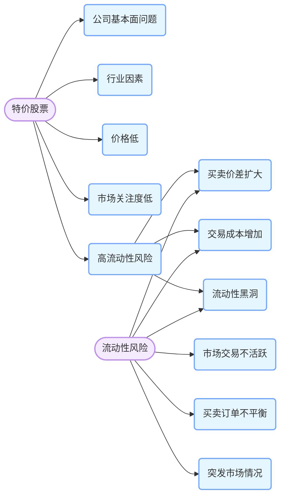

# 特价股票投资中的流动性风险管理

> 关键词：特价股票、流动性风险、投资策略、风险管理、数学模型、实际应用

> 摘要：本文聚焦于特价股票投资中的流动性风险管理。首先介绍了相关背景知识，包括目的、预期读者、文档结构和术语表。接着阐述了核心概念及其联系，给出了相应的文本示意图和 Mermaid 流程图。详细讲解了核心算法原理和具体操作步骤，并用 Python 代码进行了说明。同时，引入了数学模型和公式，并举例说明。通过项目实战，展示了开发环境搭建、源代码实现和代码解读。探讨了实际应用场景，推荐了相关工具和资源，最后总结了未来发展趋势与挑战，还提供了常见问题解答和扩展阅读参考资料，旨在为投资者在特价股票投资中有效管理流动性风险提供全面的指导。

## 1. 背景介绍 
### 1.1 目的和范围
在股票投资领域，特价股票往往因其价格相对较低而吸引众多投资者。然而，特价股票通常伴随着较高的流动性风险。本文章的目的在于深入探讨特价股票投资中流动性风险的管理方法，为投资者提供理论支持和实践指导。范围涵盖了流动性风险的概念、评估方法、管理策略，以及如何运用数学模型和编程工具进行风险量化和控制。

### 1.2 预期读者
本文预期读者包括股票投资者、金融分析师、投资顾问、金融科技从业者以及对金融风险管理感兴趣的研究人员。无论是专业投资者还是初学者，都能从本文中获取关于特价股票流动性风险管理的有价值信息。

### 1.3 文档结构概述
本文共分为十个部分。第一部分为背景介绍，阐述了文章的目的、预期读者和文档结构。第二部分介绍核心概念与联系，包括流动性风险、特价股票等概念及其相互关系。第三部分讲解核心算法原理和具体操作步骤，通过 Python 代码实现。第四部分引入数学模型和公式，并举例说明。第五部分进行项目实战，包括开发环境搭建、源代码实现和代码解读。第六部分探讨实际应用场景。第七部分推荐相关工具和资源。第八部分总结未来发展趋势与挑战。第九部分为附录，提供常见问题解答。第十部分给出扩展阅读和参考资料。

### 1.4 术语表
#### 1.4.1 核心术语定义
- **特价股票**：指价格相对较低，通常低于市场平均估值的股票。特价股票可能由于公司业绩不佳、行业前景不明朗或市场情绪等因素导致价格下跌。
- **流动性风险**：指由于市场交易不活跃、买卖价差过大或无法及时成交等原因，导致投资者在买卖股票时面临的风险。流动性风险可能导致投资者无法以理想的价格买入或卖出股票，从而影响投资收益。
- **买卖价差**：指股票买入价和卖出价之间的差额。买卖价差越大，说明市场流动性越差，投资者交易成本越高。
- **成交量**：指在一定时间内股票的交易数量。成交量越大，说明市场交易越活跃，股票的流动性越好。

#### 1.4.2 相关概念解释
- **市场深度**：指市场在一定价格范围内能够容纳的买卖订单数量。市场深度越大，说明市场能够承受较大的交易规模，股票的流动性越好。
- **流动性溢价**：指投资者为了获得流动性较好的资产而愿意支付的额外价格。流动性溢价反映了市场对流动性的需求和供给情况。
- **流动性黑洞**：指在市场极端情况下，由于投资者恐慌性抛售或市场交易机制失灵等原因，导致市场流动性突然消失的现象。流动性黑洞可能导致股票价格暴跌，投资者遭受巨大损失。

#### 1.4.3 缩略词列表
- **VWAP**：Volume - Weighted Average Price，成交量加权平均价格。
- **TWAP**：Time - Weighted Average Price，时间加权平均价格。

## 2. 核心概念与联系 

### 核心概念原理
#### 特价股票
特价股票的形成原因多种多样。从公司基本面来看，可能是由于公司业绩下滑、财务状况不佳、管理层决策失误等因素导致市场对其未来发展前景不看好，从而压低了股票价格。从行业角度来看，行业竞争激烈、技术变革迅速、政策调整等因素也可能导致整个行业股票价格下跌，其中部分股票就可能成为特价股票。

#### 流动性风险
流动性风险主要源于市场交易的不活跃性。当市场上买卖双方的交易意愿不强，或者买卖订单数量不平衡时，就会导致买卖价差扩大，交易成本增加。此外，当市场出现突发情况，如重大利空消息公布、宏观经济形势恶化等，投资者可能会恐慌性抛售股票，导致市场流动性急剧下降，出现流动性黑洞。

#### 特价股票与流动性风险的联系
特价股票往往伴随着较高的流动性风险。一方面，由于特价股票价格较低，市场关注度相对较低，交易不活跃，买卖价差较大，投资者在买卖时面临较高的交易成本。另一方面，当市场出现波动时，特价股票更容易受到投资者的恐慌性抛售，导致流动性进一步恶化。

### 文本示意图
```plaintext
特价股票
    |
    | 形成原因
    |
    |-- 公司基本面问题
    |-- 行业因素
    |
    | 特点
    |
    |-- 价格低
    |-- 市场关注度低
    |
    | 与流动性风险的联系
    |
    |-- 高流动性风险
    |-- 交易成本高
    |-- 易受市场波动影响

流动性风险
    |
    | 成因
    |
    |-- 市场交易不活跃
    |-- 买卖订单不平衡
    |-- 突发市场情况
    |
    | 表现形式
    |
    |-- 买卖价差扩大
    |-- 交易成本增加
    |-- 流动性黑洞
```

### Mermaid 流程图


## 3. 核心算法原理 & 具体操作步骤 

### 核心算法原理
在特价股票投资中，评估流动性风险的一个重要指标是买卖价差。我们可以通过计算一段时间内的平均买卖价差来衡量股票的流动性。另外，成交量也是衡量流动性的重要指标，成交量越大，流动性越好。

以下是计算成交量加权平均价格（VWAP）的算法原理。VWAP 是一种常用的交易策略参考指标，它考虑了成交量对价格的影响。其计算公式为：

$$VWAP=\frac{\sum_{i = 1}^{n}P_{i}V_{i}}{\sum_{i = 1}^{n}V_{i}}$$

其中，$P_{i}$ 是第 $i$ 个交易时刻的股票价格，$V_{i}$ 是第 $i$ 个交易时刻的成交量，$n$ 是交易时刻的总数。

### 具体操作步骤
1. **数据收集**：收集特价股票的历史交易数据，包括每个交易时刻的股票价格和成交量。
2. **数据预处理**：对收集到的数据进行清洗和整理，去除缺失值和异常值。
3. **计算 VWAP**：根据上述公式计算 VWAP。
4. **评估流动性风险**：根据 VWAP 和买卖价差等指标评估股票的流动性风险。

### Python 代码实现
```python
import pandas as pd

def calculate_vwap(data):
    """
    计算成交量加权平均价格（VWAP）
    :param data: 包含价格和成交量的 DataFrame，列名为 'price' 和 'volume'
    :return: VWAP 值
    """
    numerator = (data['price'] * data['volume']).sum()
    denominator = data['volume'].sum()
    vwap = numerator / denominator
    return vwap

# 示例数据
data = {
    'price': [10, 10.2, 10.1, 10.3],
    'volume': [100, 200, 150, 250]
}
df = pd.DataFrame(data)

# 计算 VWAP
vwap = calculate_vwap(df)
print(f"VWAP: {vwap}")
```

### 代码解释
1. **导入库**：导入 `pandas` 库，用于数据处理和分析。
2. **定义函数**：定义 `calculate_vwap` 函数，该函数接受一个包含价格和成交量的 `DataFrame` 作为输入，根据 VWAP 公式计算并返回 VWAP 值。
3. **示例数据**：创建一个包含价格和成交量的示例 `DataFrame`。
4. **计算 VWAP**：调用 `calculate_vwap` 函数计算 VWAP，并打印结果。

## 4. 数学模型和公式 & 详细讲解 & 举例说明 

### 买卖价差模型
买卖价差是衡量股票流动性的重要指标之一。买卖价差可以用以下公式表示：

$$Spread = P_{ask}-P_{bid}$$

其中，$P_{ask}$ 是股票的卖出价，$P_{bid}$ 是股票的买入价。

买卖价差越大，说明市场流动性越差。例如，某特价股票的买入价为 $9$ 元，卖出价为 $9.2$ 元，则买卖价差为 $9.2 - 9 = 0.2$ 元。

### 流动性比率模型
流动性比率是另一个衡量股票流动性的指标，它可以用成交量与流通股本的比值来表示。其公式为：

$$Liquidity\ Ratio=\frac{Volume}{Outstanding\ Shares}$$

其中，$Volume$ 是一定时间内的成交量，$Outstanding\ Shares$ 是股票的流通股本。

流动性比率越高，说明股票的流动性越好。例如，某特价股票的流通股本为 $1000$ 万股，某一交易日的成交量为 $100$ 万股，则该股票的流动性比率为 $\frac{100}{1000}=0.1$。

### 流动性风险度量模型
为了综合衡量特价股票的流动性风险，我们可以构建一个流动性风险度量模型。假设我们考虑买卖价差和流动性比率两个指标，我们可以使用加权平均的方法来计算流动性风险指数（LRI）。其公式为：

$$LRI = w_{1}\times\frac{Spread}{P_{mid}}+w_{2}\times(1 - Liquidity\ Ratio)$$

其中，$P_{mid}=\frac{P_{ask}+P_{bid}}{2}$ 是股票的中间价，$w_{1}$ 和 $w_{2}$ 是权重系数，且 $w_{1}+w_{2}=1$。

例如，假设某特价股票的买入价为 $9$ 元，卖出价为 $9.2$ 元，成交量为 $100$ 万股，流通股本为 $1000$ 万股，$w_{1}=0.6$，$w_{2}=0.4$。

首先计算中间价：$P_{mid}=\frac{9 + 9.2}{2}=9.1$ 元

买卖价差：$Spread = 9.2 - 9 = 0.2$ 元

流动性比率：$Liquidity\ Ratio=\frac{100}{1000}=0.1$

则流动性风险指数为：

$$LRI = 0.6\times\frac{0.2}{9.1}+0.4\times(1 - 0.1)$$

$$LRI = 0.6\times0.022+0.4\times0.9$$

$$LRI = 0.0132 + 0.36$$

$$LRI = 0.3732$$

## 5. 项目实战：代码实际案例和详细解释说明 

### 5.1  开发环境搭建
#### 操作系统
本项目可以在 Windows、Linux 或 macOS 操作系统上进行开发。建议使用最新版本的操作系统以确保兼容性和安全性。

#### 编程语言和库
- **Python**：选择 Python 作为开发语言，因为它具有丰富的科学计算和数据分析库。建议使用 Python 3.7 及以上版本。
- **pandas**：用于数据处理和分析。
- **numpy**：用于数值计算。
- **matplotlib**：用于数据可视化。

可以使用以下命令安装所需的库：
```bash
pip install pandas numpy matplotlib
```

#### 数据来源
可以从金融数据提供商（如雅虎财经、Tushare 等）获取特价股票的历史交易数据。

### 5.2  源代码详细实现和代码解读
```python
import pandas as pd
import numpy as np
import matplotlib.pyplot as plt

# 从 CSV 文件中读取数据
def read_data(file_path):
    data = pd.read_csv(file_path)
    return data

# 计算买卖价差
def calculate_spread(data):
    data['spread'] = data['ask_price'] - data['bid_price']
    return data

# 计算流动性比率
def calculate_liquidity_ratio(data):
    data['liquidity_ratio'] = data['volume'] / data['outstanding_shares']
    return data

# 计算流动性风险指数
def calculate_lri(data, w1=0.6, w2=0.4):
    data['mid_price'] = (data['ask_price'] + data['bid_price']) / 2
    data['lri'] = w1 * (data['spread'] / data['mid_price']) + w2 * (1 - data['liquidity_ratio'])
    return data

# 可视化流动性风险指数
def visualize_lri(data):
    plt.figure(figsize=(10, 6))
    plt.plot(data['date'], data['lri'])
    plt.xlabel('Date')
    plt.ylabel('Liquidity Risk Index')
    plt.title('Liquidity Risk Index of Special - Price Stocks')
    plt.xticks(rotation=45)
    plt.show()

# 主函数
def main():
    file_path = 'special_price_stocks_data.csv'
    data = read_data(file_path)
    data = calculate_spread(data)
    data = calculate_liquidity_ratio(data)
    data = calculate_lri(data)
    visualize_lri(data)

if __name__ == "__main__":
    main()
```

### 代码解读与分析
1. **导入库**：导入 `pandas`、`numpy` 和 `matplotlib` 库，分别用于数据处理、数值计算和数据可视化。
2. **读取数据**：定义 `read_data` 函数，从 CSV 文件中读取特价股票的历史交易数据。
3. **计算买卖价差**：定义 `calculate_spread` 函数，计算每个交易时刻的买卖价差，并将结果添加到 `DataFrame` 中。
4. **计算流动性比率**：定义 `calculate_liquidity_ratio` 函数，计算每个交易时刻的流动性比率，并将结果添加到 `DataFrame` 中。
5. **计算流动性风险指数**：定义 `calculate_lri` 函数，根据前面定义的流动性风险度量模型计算每个交易时刻的流动性风险指数，并将结果添加到 `DataFrame` 中。
6. **可视化流动性风险指数**：定义 `visualize_lri` 函数，使用 `matplotlib` 库绘制流动性风险指数随时间的变化曲线。
7. **主函数**：定义 `main` 函数，调用上述函数完成数据读取、计算和可视化操作。

## 6. 实际应用场景 
### 投资者决策
投资者在选择特价股票进行投资时，可以使用本文介绍的方法评估股票的流动性风险。如果流动性风险过高，投资者可能需要谨慎考虑是否投资该股票，或者采取适当的风险管理措施，如控制仓位、分散投资等。

### 投资组合管理
在构建投资组合时，考虑特价股票的流动性风险可以帮助投资者优化投资组合的结构。通过合理配置不同流动性风险的股票，可以降低整个投资组合的流动性风险，提高投资组合的稳定性和收益性。

### 金融机构风险管理
金融机构（如证券公司、基金公司等）在进行特价股票交易时，需要对流动性风险进行有效的管理。可以使用本文介绍的数学模型和算法对交易风险进行量化评估，制定相应的风险管理策略，如设置止损点、调整交易策略等。

## 7. 工具和资源推荐
### 7.1 学习资源推荐
#### 7.1.1 书籍推荐
- 《金融市场与金融机构基础》：这本书系统地介绍了金融市场和金融机构的基本概念、运作机制和风险管理方法，对于理解特价股票投资和流动性风险管理有很大的帮助。
- 《量化投资：策略与技术》：详细介绍了量化投资的基本原理、方法和技术，包括数据处理、模型构建、算法设计等方面，对于使用编程工具进行流动性风险管理有很好的参考价值。
- 《风险管理与金融机构》：全面阐述了金融机构面临的各种风险（包括流动性风险）的管理方法和技术，适合专业金融人士阅读。

#### 7.1.2 在线课程
- Coursera 上的“Financial Markets”课程：由耶鲁大学教授 Robert Shiller 授课，深入讲解了金融市场的基本原理和运作机制，包括股票市场、债券市场、衍生品市场等。
- edX 上的“Quantitative Finance”课程：提供了量化金融的基础知识和方法，包括风险度量、投资组合优化、衍生品定价等内容。
- 网易云课堂上的“Python 金融数据分析实战”课程：通过实际案例介绍了如何使用 Python 进行金融数据分析和风险管理，对于初学者来说是一个很好的入门课程。

#### 7.1.3 技术博客和网站
- 金融界网站：提供了丰富的金融市场资讯和数据分析工具，包括股票行情、财经新闻、研究报告等。
- 雪球网：是一个投资者交流社区，用户可以在上面分享投资经验、讨论投资策略，还可以获取各种金融数据和分析报告。
- Towards Data Science：是一个专注于数据科学和机器学习的技术博客，上面有很多关于金融数据分析和量化投资的文章。

### 7.2 开发工具框架推荐
#### 7.2.1 IDE和编辑器
- PyCharm：是一款专业的 Python 集成开发环境，具有代码编辑、调试、版本控制等功能，适合开发大型 Python 项目。
- Jupyter Notebook：是一个交互式的开发环境，支持 Python、R 等多种编程语言，适合进行数据探索和分析。
- Visual Studio Code：是一款轻量级的代码编辑器，支持多种编程语言和插件扩展，具有良好的代码编辑和调试功能。

#### 7.2.2 调试和性能分析工具
- pdb：是 Python 内置的调试工具，可以帮助开发者定位和解决代码中的问题。
- cProfile：是 Python 内置的性能分析工具，可以分析代码的运行时间和函数调用情况，帮助开发者优化代码性能。
- Py-Spy：是一个第三方的性能分析工具，可以实时监控 Python 程序的运行状态，找出性能瓶颈。

#### 7.2.3 相关框架和库
- pandas：是 Python 中最常用的数据处理和分析库，提供了丰富的数据结构和函数，方便进行数据清洗、整理和分析。
- numpy：是 Python 中用于数值计算的基础库，提供了高效的多维数组对象和数学函数，是很多科学计算和数据分析库的基础。
- scikit - learn：是 Python 中常用的机器学习库，提供了各种机器学习算法和工具，如分类、回归、聚类等。

### 7.3 相关论文著作推荐
#### 7.3.1 经典论文
- “The Market for “Lemons”: Quality Uncertainty and the Market Mechanism” by George A. Akerlof：这篇论文提出了“柠檬市场”理论，探讨了信息不对称对市场效率的影响，对于理解特价股票市场的流动性风险有一定的启示。
- “Liquidity Preference as Behavior towards Risk” by John Maynard Keynes：凯恩斯在这篇论文中提出了流动性偏好理论，解释了投资者为什么会偏好流动性资产，对于研究流动性风险的成因有重要意义。
- “On the Pricing of Corporate Debt: The Risk Structure of Interest Rates” by Robert C. Merton：这篇论文提出了著名的 Merton 模型，用于评估公司债券的信用风险，其思想也可以应用到特价股票的流动性风险评估中。

#### 7.3.2 最新研究成果
- 近年来，随着人工智能和机器学习技术的发展，一些研究开始将这些技术应用到金融风险管理中。例如，使用深度学习模型预测股票的流动性风险，提高风险评估的准确性。
- 还有一些研究关注市场微观结构对流动性风险的影响，通过分析交易数据和市场参与者行为，揭示流动性风险的形成机制。

#### 7.3.3 应用案例分析
- 一些金融机构会发布关于特价股票投资和流动性风险管理的案例分析报告，这些报告可以帮助投资者了解实际应用中的风险管理策略和方法。例如，某证券公司发布的关于某特价股票投资组合的流动性风险管理案例，详细介绍了该公司如何评估和控制流动性风险，以及取得的投资效果。

## 8. 总结：未来发展趋势与挑战
### 未来发展趋势
#### 技术创新
随着人工智能、机器学习、区块链等技术的不断发展，这些技术将在特价股票投资的流动性风险管理中得到更广泛的应用。例如，使用深度学习模型对海量的交易数据进行分析，预测流动性风险的发生概率和程度；利用区块链技术提高交易的透明度和效率，降低流动性风险。

#### 数据驱动决策
未来，投资者和金融机构将更加依赖数据进行决策。通过收集和分析更多的市场数据、公司基本面数据和投资者行为数据，可以更准确地评估特价股票的流动性风险，制定更加科学合理的投资策略。

#### 国际化合作
随着全球金融市场的一体化程度不断提高，特价股票投资的流动性风险管理也将面临国际化的挑战和机遇。各国金融机构和监管部门将加强合作，共同制定流动性风险管理的标准和规范，提高全球金融市场的稳定性。

### 挑战
#### 数据质量和安全
在数据驱动的时代，数据质量和安全是至关重要的。金融市场数据往往存在噪声、缺失值和异常值等问题，需要进行有效的清洗和预处理。同时，保护投资者的个人信息和交易数据安全也是一个重要的挑战。

#### 模型复杂性和可解释性
随着技术的发展，用于流动性风险管理的模型越来越复杂。复杂的模型虽然可以提高预测的准确性，但也增加了模型的可解释性难度。投资者和监管部门需要能够理解模型的工作原理和决策依据，以便进行有效的风险管理和监管。

#### 市场不确定性
金融市场具有高度的不确定性，特价股票市场更是如此。市场情绪、宏观经济形势、政策变化等因素都可能导致流动性风险的突然变化。如何在不确定的市场环境中有效地管理流动性风险是一个长期的挑战。

## 9. 附录：常见问题与解答
### 1. 什么是特价股票的流动性风险？
特价股票的流动性风险是指由于市场交易不活跃、买卖价差过大或无法及时成交等原因，导致投资者在买卖特价股票时面临的风险。这种风险可能导致投资者无法以理想的价格买入或卖出股票，从而影响投资收益。

### 2. 如何评估特价股票的流动性风险？
可以使用多种指标来评估特价股票的流动性风险，如买卖价差、成交量、流动性比率、流动性风险指数等。通过计算这些指标，并结合市场情况和公司基本面进行分析，可以对特价股票的流动性风险进行评估。

### 3. 流动性风险管理有哪些策略？
常见的流动性风险管理策略包括控制仓位、分散投资、设置止损点、调整交易策略等。控制仓位可以降低单一股票的流动性风险对投资组合的影响；分散投资可以通过投资多个不同流动性的股票来降低整个投资组合的流动性风险；设置止损点可以在股票价格下跌到一定程度时及时卖出，避免损失进一步扩大；调整交易策略可以根据市场流动性情况选择合适的交易时机和方式。

### 4. 技术工具在流动性风险管理中有什么作用？
技术工具可以帮助投资者和金融机构更高效地进行流动性风险管理。例如，使用 Python 等编程语言可以实现数据处理、模型构建和算法设计，提高风险评估的准确性和效率；使用数据分析工具可以对大量的交易数据进行分析，发现潜在的流动性风险；使用可视化工具可以将风险评估结果以直观的图表形式展示出来，方便决策者进行决策。

### 5. 如何获取特价股票的交易数据？
可以从金融数据提供商（如雅虎财经、Tushare 等）获取特价股票的交易数据。这些数据提供商通常提供历史交易数据、实时行情数据等，用户可以根据自己的需求选择合适的数据来源。

## 10. 扩展阅读 & 参考资料
### 扩展阅读
- 《聪明的投资者》：这本书是价值投资的经典著作，对于投资者理解股票投资的本质和方法有很大的帮助。
- 《金融炼金术》：乔治·索罗斯在书中阐述了他的投资哲学和交易策略，对于理解金融市场的复杂性和不确定性有深刻的启示。
- 《行为金融学》：介绍了行为金融学的基本理论和方法，解释了投资者在金融市场中的非理性行为，对于理解市场情绪对流动性风险的影响有一定的参考价值。

### 参考资料
- [1] Akerlof, G. A. (1970). The Market for “Lemons”: Quality Uncertainty and the Market Mechanism. The Quarterly Journal of Economics, 84(3), 488 - 500.
- [2] Keynes, J. M. (1936). The General Theory of Employment, Interest and Money. Macmillan.
- [3] Merton, R. C. (1974). On the Pricing of Corporate Debt: The Risk Structure of Interest Rates. The Journal of Finance, 29(2), 449 - 470.
- [4] Tushare 官方文档：https://tushare.pro/document/1
- [5] Pandas 官方文档：https://pandas.pydata.org/docs/

作者：AI天才研究院/AI Genius Institute & 禅与计算机程序设计艺术 /Zen And The Art of Computer Programming