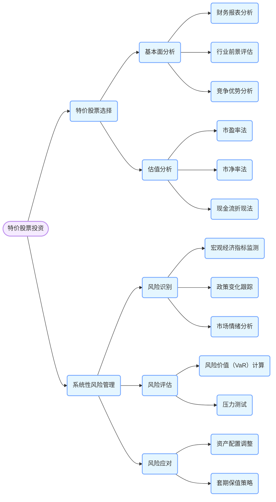

# 特价股票投资中的系统性风险管理

> 关键词：特价股票、系统性风险、风险管理、投资策略、金融市场

> 摘要：本文聚焦于特价股票投资中的系统性风险管理。首先介绍了研究的背景、目的、预期读者、文档结构及相关术语。接着阐述了特价股票和系统性风险的核心概念及其联系，并给出了相应的示意图和流程图。深入讲解了风险管理的核心算法原理，用Python代码进行了详细说明，同时给出了相关数学模型和公式，并举例阐释。通过项目实战展示了开发环境搭建、源代码实现与解读。分析了特价股票投资中系统性风险的实际应用场景，推荐了学习资源、开发工具框架及相关论文著作。最后总结了未来发展趋势与挑战，提供了常见问题解答及扩展阅读参考资料，旨在为投资者在特价股票投资中有效管理系统性风险提供全面的指导。

## 1. 背景介绍 
### 1.1 目的和范围
在金融市场中，特价股票常常吸引着众多投资者的目光。特价股票通常指价格相对其内在价值被低估的股票，投资这类股票可能带来丰厚的回报。然而，投资过程中不可避免地面临各种风险，其中系统性风险是影响整个市场的风险因素，如宏观经济波动、利率变化、政策调整等，这些因素无法通过分散投资来消除。本文章的目的在于深入探讨特价股票投资中系统性风险管理的方法和策略，帮助投资者更好地识别、评估和应对系统性风险，以提高投资的安全性和回报率。

本文的范围涵盖了特价股票和系统性风险的基本概念、风险管理的算法原理、数学模型、实际应用场景以及相关的工具和资源推荐等方面，旨在为投资者提供一个全面、系统的风险管理框架。

### 1.2 预期读者
本文的预期读者主要包括以下几类人群：
1. **个人投资者**：希望通过投资特价股票获取收益，但对系统性风险认识不足，需要学习风险管理知识和方法的投资者。
2. **金融机构从业人员**：如基金经理、投资顾问等，他们需要深入了解特价股票投资中的系统性风险管理，以便为客户提供更专业的投资建议。
3. **金融研究人员**：对金融市场中的风险投资和风险管理感兴趣，希望从理论和实践的角度深入研究特价股票投资系统性风险管理的研究人员。
4. **金融专业学生**：正在学习金融投资相关课程，希望通过实际案例了解系统性风险管理的学生。

### 1.3 文档结构概述
本文将按照以下结构进行组织：
1. **核心概念与联系**：介绍特价股票和系统性风险的核心概念，分析它们之间的联系，并通过文本示意图和Mermaid流程图进行直观展示。
2. **核心算法原理 & 具体操作步骤**：详细讲解风险管理中常用的算法原理，如风险价值（VaR）计算、压力测试等，并使用Python源代码进行详细阐述。
3. **数学模型和公式 & 详细讲解 & 举例说明**：给出风险管理中的数学模型和公式，如资本资产定价模型（CAPM）、多因素模型等，并进行详细讲解和举例说明。
4. **项目实战：代码实际案例和详细解释说明**：通过一个实际的特价股票投资项目，展示开发环境搭建、源代码实现和代码解读，帮助读者更好地理解和应用风险管理方法。
5. **实际应用场景**：分析特价股票投资中系统性风险的实际应用场景，如宏观经济变化、行业竞争等对投资的影响。
6. **工具和资源推荐**：推荐学习资源、开发工具框架及相关论文著作，帮助读者进一步深入学习和研究。
7. **总结：未来发展趋势与挑战**：总结特价股票投资中系统性风险管理的未来发展趋势和面临的挑战。
8. **附录：常见问题与解答**：提供常见问题的解答，帮助读者解决在学习和实践过程中遇到的问题。
9. **扩展阅读 & 参考资料**：列出扩展阅读的资料和参考文献，方便读者进一步深入研究。

### 1.4 术语表
#### 1.4.1 核心术语定义
1. **特价股票**：指价格相对其内在价值被低估的股票，通常具有较低的市盈率、市净率等估值指标。
2. **系统性风险**：又称不可分散风险，是指由于宏观经济、政治、社会等因素引起的，影响整个金融市场的风险，无法通过分散投资来消除。
3. **风险管理**：指通过识别、评估和应对风险，以最小的成本实现最大安全保障的管理活动。
4. **风险价值（VaR）**：指在一定的置信水平和持有期内，某一投资组合可能面临的最大损失。
5. **压力测试**：指通过模拟极端市场情况，评估投资组合在压力环境下的表现和风险承受能力。

#### 1.4.2 相关概念解释
1. **非系统性风险**：又称可分散风险，是指由于个别公司或行业的特定因素引起的风险，可以通过分散投资来降低或消除。
2. **资本资产定价模型（CAPM）**：用于描述资产预期收益率与系统性风险之间关系的模型，公式为 $E(R_i)=R_f+\beta_i[E(R_m)-R_f]$，其中 $E(R_i)$ 是资产 $i$ 的预期收益率，$R_f$ 是无风险收益率，$\beta_i$ 是资产 $i$ 的系统性风险系数，$E(R_m)$ 是市场组合的预期收益率。
3. **多因素模型**：在CAPM的基础上，考虑了多个风险因素对资产收益率的影响，如宏观经济因素、行业因素等。

#### 1.4.3 缩略词列表
1. **VaR**：Value at Risk，风险价值
2. **CAPM**：Capital Asset Pricing Model，资本资产定价模型

## 2. 核心概念与联系 
### 核心概念原理
#### 特价股票
特价股票的核心原理基于价值投资理念。价值投资者认为，市场有时会出现对股票价值的错误定价，导致某些股票的价格低于其内在价值。内在价值是指股票所代表的公司未来现金流的现值，通过对公司的财务状况、行业前景、竞争优势等因素进行分析，可以估算出股票的内在价值。当股票价格低于内在价值时，就被认为是特价股票，具有投资价值。

#### 系统性风险
系统性风险源于宏观经济、政治、社会等方面的因素，这些因素会影响整个金融市场，导致大多数股票价格同时波动。例如，经济衰退会导致企业盈利下降，投资者信心受挫，从而引起股票市场整体下跌；利率上升会增加企业的融资成本，降低股票的吸引力，导致股票价格下跌。系统性风险无法通过分散投资来消除，因为所有股票都会受到这些宏观因素的影响。

### 架构的文本示意图
```plaintext
特价股票投资
|
|-- 特价股票选择
|   |-- 基本面分析
|   |   |-- 财务报表分析
|   |   |-- 行业前景评估
|   |   |-- 竞争优势分析
|   |-- 估值分析
|       |-- 市盈率法
|       |-- 市净率法
|       |-- 现金流折现法
|
|-- 系统性风险管理
|   |-- 风险识别
|   |   |-- 宏观经济指标监测
|   |   |-- 政策变化跟踪
|   |   |-- 市场情绪分析
|   |-- 风险评估
|   |   |-- 风险价值（VaR）计算
|   |   |-- 压力测试
|   |-- 风险应对
|       |-- 资产配置调整
|       |-- 套期保值策略
```

### Mermaid 流程图


## 3. 核心算法原理 & 具体操作步骤 
### 风险价值（VaR）计算原理
风险价值（VaR）是一种常用的风险度量方法，用于衡量在一定的置信水平和持有期内，某一投资组合可能面临的最大损失。其基本思想是通过对投资组合的历史收益率进行统计分析，估计出在给定置信水平下的最大损失。

#### 具体操作步骤
1. **数据收集**：收集投资组合中各资产的历史价格数据。
2. **收益率计算**：根据历史价格数据计算各资产的日收益率。
3. **投资组合收益率计算**：根据各资产的权重计算投资组合的日收益率。
4. **收益率分布估计**：使用历史模拟法、参数法或蒙特卡罗模拟法估计投资组合收益率的分布。
5. **VaR计算**：根据收益率分布和给定的置信水平，计算投资组合的VaR。

#### Python源代码实现
```python
import numpy as np
import pandas as pd
import yfinance as yf

# 数据收集
tickers = ['AAPL', 'MSFT', 'GOOG']
start_date = '2020-01-01'
end_date = '2023-01-01'
data = yf.download(tickers, start=start_date, end=end_date)['Close']

# 收益率计算
returns = data.pct_change().dropna()

# 投资组合权重
weights = np.array([0.3, 0.4, 0.3])

# 投资组合收益率计算
portfolio_returns = np.dot(returns, weights)

# 历史模拟法计算VaR
confidence_level = 0.95
var_historical = np.percentile(portfolio_returns, (1 - confidence_level) * 100)

print(f"历史模拟法计算的VaR（置信水平 {confidence_level}）: {var_historical:.4f}")
```

### 压力测试原理
压力测试是一种通过模拟极端市场情况，评估投资组合在压力环境下的表现和风险承受能力的方法。其基本思想是假设市场发生极端变化，如股票市场暴跌、利率大幅上升等，然后计算投资组合在这些极端情况下的损失。

#### 具体操作步骤
1. **确定压力情景**：根据历史数据和专家判断，确定可能发生的极端市场情况，如市场指数下跌20%、利率上升2个百分点等。
2. **模拟投资组合价值变化**：根据压力情景，模拟投资组合中各资产的价格变化，计算投资组合的价值变化。
3. **评估风险承受能力**：根据投资组合的价值变化，评估投资组合在压力情景下的风险承受能力，如是否会导致投资组合净值大幅下降、是否会触发止损条件等。

#### Python源代码实现
```python
# 假设市场指数下跌20%
stress_scenario = -0.2

# 计算各资产的贝塔系数
betas = []
for ticker in tickers:
    beta = np.cov(returns[ticker], portfolio_returns)[0][1] / np.var(portfolio_returns)
    betas.append(beta)
betas = np.array(betas)

# 模拟各资产价格变化
asset_changes = betas * stress_scenario

# 模拟投资组合价值变化
portfolio_change = np.dot(weights, asset_changes)

print(f"压力情景下投资组合价值变化: {portfolio_change:.4f}")
```

## 4. 数学模型和公式 & 详细讲解 & 举例说明 
### 资本资产定价模型（CAPM）
#### 公式
$E(R_i)=R_f+\beta_i[E(R_m)-R_f]$

#### 详细讲解
- $E(R_i)$：资产 $i$ 的预期收益率。
- $R_f$：无风险收益率，通常用国债收益率来表示。
- $\beta_i$：资产 $i$ 的系统性风险系数，衡量资产 $i$ 的收益率对市场组合收益率变化的敏感程度。
- $E(R_m)$：市场组合的预期收益率。

#### 举例说明
假设无风险收益率 $R_f = 3\%$，市场组合的预期收益率 $E(R_m) = 10\%$，某股票的 $\beta$ 系数为 1.2。则该股票的预期收益率为：
$E(R_i)=0.03 + 1.2\times(0.1 - 0.03)=0.114$，即 11.4%。

### 多因素模型
#### 公式
$E(R_i)=R_f+\beta_{i1}F_1+\beta_{i2}F_2+\cdots+\beta_{in}F_n$

#### 详细讲解
- $E(R_i)$：资产 $i$ 的预期收益率。
- $R_f$：无风险收益率。
- $\beta_{ij}$：资产 $i$ 对第 $j$ 个风险因素的敏感系数。
- $F_j$：第 $j$ 个风险因素的预期收益率。

#### 举例说明
假设考虑两个风险因素：宏观经济增长和利率变化。无风险收益率 $R_f = 3\%$，宏观经济增长因素的预期收益率 $F_1 = 5\%$，利率变化因素的预期收益率 $F_2 = -2\%$，某股票对宏观经济增长因素的敏感系数 $\beta_{i1} = 0.8$，对利率变化因素的敏感系数 $\beta_{i2} = -0.5$。则该股票的预期收益率为：
$E(R_i)=0.03 + 0.8\times0.05 + (-0.5)\times(-0.02)=0.07$，即 7%。

## 5. 项目实战：代码实际案例和详细解释说明 
### 5.1  开发环境搭建
#### 安装Python
首先需要安装Python，建议使用Python 3.7及以上版本。可以从Python官方网站（https://www.python.org/downloads/）下载安装包，按照安装向导进行安装。

#### 安装必要的库
使用pip命令安装必要的库，包括`numpy`、`pandas`、`yfinance`等。
```bash
pip install numpy pandas yfinance
```

### 5.2  源代码详细实现和代码解读
```python
import numpy as np
import pandas as pd
import yfinance as yf

# 数据收集
tickers = ['AAPL', 'MSFT', 'GOOG']
start_date = '2020-01-01'
end_date = '2023-01-01'
data = yf.download(tickers, start=start_date, end=end_date)['Close']

# 代码解读：使用yfinance库从雅虎财经下载指定股票的收盘价数据，时间范围为2020年1月1日至2023年1月1日。

# 收益率计算
returns = data.pct_change().dropna()

# 代码解读：计算各股票的日收益率，并去除缺失值。

# 投资组合权重
weights = np.array([0.3, 0.4, 0.3])

# 代码解读：定义投资组合中各股票的权重。

# 投资组合收益率计算
portfolio_returns = np.dot(returns, weights)

# 代码解读：根据各股票的权重计算投资组合的日收益率。

# 历史模拟法计算VaR
confidence_level = 0.95
var_historical = np.percentile(portfolio_returns, (1 - confidence_level) * 100)

# 代码解读：使用历史模拟法计算投资组合在95%置信水平下的VaR。

print(f"历史模拟法计算的VaR（置信水平 {confidence_level}）: {var_historical:.4f}")
```

### 5.3  代码解读与分析
- **数据收集**：使用`yfinance`库从雅虎财经下载指定股票的收盘价数据，方便快捷。
- **收益率计算**：通过`pct_change()`方法计算各股票的日收益率，并使用`dropna()`方法去除缺失值，确保数据的准确性。
- **投资组合收益率计算**：使用`np.dot()`方法根据各股票的权重计算投资组合的日收益率，实现了投资组合收益率的快速计算。
- **VaR计算**：使用`np.percentile()`方法根据历史收益率数据计算投资组合在给定置信水平下的VaR，简单直观。

## 6. 实际应用场景 
### 宏观经济变化
宏观经济变化是影响特价股票投资系统性风险的重要因素。当经济处于衰退期时，企业盈利下降，消费者信心受挫，股票市场整体下跌，特价股票也难以幸免。例如，2008年全球金融危机期间，全球股市大幅下跌，许多特价股票的价格也随之下跌。投资者在进行特价股票投资时，需要密切关注宏观经济指标，如GDP增长率、通货膨胀率、失业率等，及时调整投资策略。

### 政策调整
政策调整也会对特价股票投资产生重大影响。政府的财政政策、货币政策、产业政策等都会影响企业的经营环境和市场预期。例如，政府出台的税收优惠政策可以降低企业的成本，提高企业的盈利能力，从而推动特价股票价格上涨；而加息政策会增加企业的融资成本，降低股票的吸引力，导致特价股票价格下跌。投资者需要及时关注政策变化，分析政策对特价股票的影响。

### 行业竞争
行业竞争也是影响特价股票投资的重要因素。如果特价股票所在的行业竞争激烈，企业的市场份额和盈利能力可能会受到影响，从而增加投资风险。例如，智能手机行业竞争激烈，市场份额不断向头部企业集中，一些中小手机厂商的特价股票可能面临较大的风险。投资者在选择特价股票时，需要分析行业的竞争格局和企业的竞争优势。

## 7. 工具和资源推荐
### 7.1 学习资源推荐
#### 7.1.1 书籍推荐
1. 《聪明的投资者》（The Intelligent Investor）：本杰明·格雷厄姆（Benjamin Graham）著，被誉为价值投资的圣经，详细介绍了价值投资的理念和方法。
2. 《金融市场与金融机构基础》（Fundamentals of Financial Markets and Institutions）：弗兰克·J·法博齐（Frank J. Fabozzi）等著，全面介绍了金融市场和金融机构的基本知识，包括风险管理的方法和策略。
3. 《期权、期货及其他衍生品》（Options, Futures, and Other Derivatives）：约翰·C·赫尔（John C. Hull）著，是金融衍生品领域的经典教材，详细介绍了期权、期货等衍生品的定价和风险管理方法。

#### 7.1.2 在线课程
1. Coursera上的“投资学原理”（Principles of Investments）课程：由知名大学教授授课，系统介绍了投资学的基本原理和方法，包括风险管理。
2. edX上的“金融市场”（Financial Markets）课程：由耶鲁大学教授罗伯特·席勒（Robert Shiller）授课，深入探讨了金融市场的运行机制和风险管理。

#### 7.1.3 技术博客和网站
1. 雪球（https://xueqiu.com/）：国内知名的投资社区，提供股票、基金等投资产品的信息和分析，投资者可以在上面交流投资经验和分享观点。
2. Seeking Alpha（https://seekingalpha.com/）：国外知名的投资分析网站，提供全球金融市场的新闻、分析和研究报告，帮助投资者了解市场动态和投资机会。

### 7.2 开发工具框架推荐
#### 7.2.1 IDE和编辑器
1. PyCharm：一款专业的Python集成开发环境，提供代码编辑、调试、版本控制等功能，适合Python开发者使用。
2. Jupyter Notebook：一个交互式的开发环境，支持Python、R等多种编程语言，方便进行数据分析和可视化。

#### 7.2.2 调试和性能分析工具
1. pdb：Python自带的调试工具，可以帮助开发者调试代码，查找问题。
2. cProfile：Python的性能分析工具，可以分析代码的运行时间和内存使用情况，帮助开发者优化代码性能。

#### 7.2.3 相关框架和库
1. numpy：Python的科学计算库，提供了高效的数组操作和数学函数，是数据分析和机器学习的基础库。
2. pandas：Python的数据处理库，提供了强大的数据结构和数据处理功能，方便进行数据清洗、分析和可视化。
3. scikit-learn：Python的机器学习库，提供了丰富的机器学习算法和工具，可用于风险评估和预测。

### 7.3 相关论文著作推荐
#### 7.3.1 经典论文
1. “Capital Asset Prices: A Theory of Market Equilibrium Under Conditions of Risk”（资本资产定价：风险条件下的市场均衡理论）：威廉·夏普（William Sharpe）著，提出了资本资产定价模型（CAPM），是现代金融理论的重要基石。
2. “The Arbitrage Pricing Theory of Capital Asset Pricing”（资本资产定价的套利定价理论）：斯蒂芬·罗斯（Stephen Ross）著，提出了套利定价理论（APT），是对CAPM的扩展和改进。

#### 7.3.2 最新研究成果
1. 关注《Journal of Finance》、《Review of Financial Studies》等国际顶级金融学术期刊，了解特价股票投资和系统性风险管理的最新研究成果。
2. 参加金融学术会议，如美国金融协会（American Finance Association）年会，与国内外学者交流最新研究进展。

#### 7.3.3 应用案例分析
1. 阅读金融机构的研究报告，了解他们在特价股票投资和系统性风险管理方面的实践经验和案例分析。
2. 分析上市公司的年报和季报，了解企业在面对系统性风险时的应对策略和措施。

## 8. 总结：未来发展趋势与挑战
### 未来发展趋势
1. **数字化和智能化**：随着科技的不断发展，金融市场的数字化和智能化程度将不断提高。投资者可以利用大数据、人工智能等技术，更准确地识别和评估系统性风险，制定更科学的投资策略。
2. **多元化投资**：为了降低系统性风险，投资者将越来越倾向于多元化投资。除了股票、债券等传统投资品种外，投资者还将关注房地产、大宗商品、数字货币等其他投资领域。
3. **风险管理全球化**：随着全球金融市场的一体化程度不断提高，系统性风险的传播速度和范围也将不断扩大。投资者需要更加关注全球金融市场的动态，制定全球化的风险管理策略。

### 挑战
1. **风险复杂性增加**：随着金融市场的不断发展和创新，系统性风险的复杂性也在不断增加。例如，金融衍生品的广泛应用使得风险的传递和放大机制更加复杂，投资者难以准确识别和评估风险。
2. **数据质量和隐私问题**：数字化和智能化风险管理需要大量的数据支持，但数据质量和隐私问题也成为了挑战。投资者需要确保数据的准确性和可靠性，同时保护个人隐私和数据安全。
3. **监管政策变化**：监管政策的变化会对金融市场和投资者产生重大影响。投资者需要及时了解监管政策的变化，调整投资策略，以适应监管要求。

## 9. 附录：常见问题与解答
### 问题1：什么是特价股票？
解答：特价股票是指价格相对其内在价值被低估的股票，通常具有较低的市盈率、市净率等估值指标。投资者可以通过基本面分析和估值分析来寻找特价股票。

### 问题2：系统性风险和非系统性风险有什么区别？
解答：系统性风险是指由于宏观经济、政治、社会等因素引起的，影响整个金融市场的风险，无法通过分散投资来消除；非系统性风险是指由于个别公司或行业的特定因素引起的风险，可以通过分散投资来降低或消除。

### 问题3：如何计算风险价值（VaR）？
解答：可以使用历史模拟法、参数法或蒙特卡罗模拟法来计算VaR。历史模拟法是根据投资组合的历史收益率数据，估计在给定置信水平下的最大损失；参数法是假设投资组合收益率服从某种分布，通过估计分布参数来计算VaR；蒙特卡罗模拟法是通过模拟大量的随机情景，计算投资组合在不同情景下的损失，从而估计VaR。

### 问题4：压力测试有什么作用？
解答：压力测试可以帮助投资者评估投资组合在极端市场情况下的表现和风险承受能力。通过模拟极端市场情景，如股票市场暴跌、利率大幅上升等，投资者可以了解投资组合在这些情况下的损失情况，及时调整投资策略，降低风险。

## 10. 扩展阅读 & 参考资料
### 扩展阅读
1. 《漫步华尔街》（A Random Walk Down Wall Street）：伯顿·马尔基尔（Burton Malkiel）著，介绍了有效市场假说和随机漫步理论，对投资者的投资决策有一定的启示作用。
2. 《黑天鹅：如何应对不可预知的未来》（The Black Swan: The Impact of the Highly Improbable）：纳西姆·尼古拉斯·塔勒布（Nassim Nicholas Taleb）著，探讨了极端事件对金融市场和投资的影响，提醒投资者要关注小概率事件。

### 参考资料
1. 格雷厄姆，《聪明的投资者》，人民邮电出版社，2019年。
2. 法博齐等，《金融市场与金融机构基础》，机械工业出版社，2018年。
3. 赫尔，《期权、期货及其他衍生品》，机械工业出版社，2018年。

作者：AI天才研究院/AI Genius Institute & 禅与计算机程序设计艺术 /Zen And The Art of Computer Programming