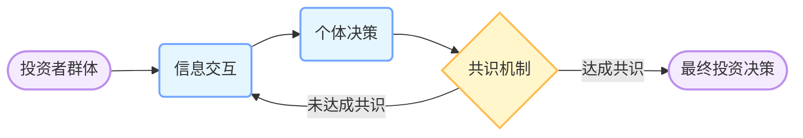

# 特价股票投资中的群体智能与去中心化决策方法

> 关键词：特价股票投资、群体智能、去中心化决策、股票分析、投资策略

> 摘要：本文聚焦于特价股票投资领域，深入探讨群体智能与去中心化决策方法的应用。首先介绍了相关背景知识，包括目的、预期读者等。接着阐述核心概念，如群体智能和去中心化决策的原理及架构，并给出相应的文本示意图和 Mermaid 流程图。详细讲解了核心算法原理和具体操作步骤，使用 Python 代码进行说明。通过数学模型和公式进一步剖析决策依据，还给出了实际的举例说明。以项目实战的方式，展示了代码的实际案例和详细解释。分析了该方法在实际中的应用场景，推荐了学习、开发所需的工具和资源，包括书籍、在线课程、开发工具等。最后总结了未来发展趋势与挑战，解答了常见问题，并提供了扩展阅读和参考资料，旨在为投资者和研究者提供全面的技术和理论支持。

## 1. 背景介绍 
### 1.1 目的和范围
特价股票投资一直是金融市场中备受关注的领域，投资者希望通过发现被低估的股票来获取超额收益。然而，传统的股票分析方法往往依赖于少数专业人士的判断，存在信息不全面、主观偏见等问题。群体智能和去中心化决策方法为解决这些问题提供了新的思路。

本文的目的是深入研究群体智能和去中心化决策方法在特价股票投资中的应用，探讨如何利用大量投资者的集体智慧和去中心化的决策机制来提高投资决策的准确性和效率。研究范围涵盖了群体智能和去中心化决策的基本原理、相关算法、数学模型，以及在实际投资项目中的应用案例。

### 1.2 预期读者
本文的预期读者包括股票投资者、金融分析师、人工智能研究者、软件开发人员等。对于投资者来说，本文可以提供新的投资思路和决策方法；对于金融分析师，有助于他们了解如何运用新技术提升分析能力；人工智能研究者可以从群体智能和去中心化决策的应用中获得启发；软件开发人员则可以参考本文的代码实现和算法原理，开发相关的投资分析软件。

### 1.3 文档结构概述
本文将按照以下结构进行阐述：首先介绍核心概念，包括群体智能和去中心化决策的定义、原理和架构；接着详细讲解核心算法原理和具体操作步骤，并用 Python 代码实现；然后给出数学模型和公式，并进行详细讲解和举例说明；通过项目实战展示代码的实际应用和效果；分析该方法在实际中的应用场景；推荐相关的学习资源、开发工具和论文著作；最后总结未来发展趋势与挑战，解答常见问题，并提供扩展阅读和参考资料。

### 1.4 术语表
#### 1.4.1 核心术语定义
- **群体智能（Swarm Intelligence）**：指的是由多个简单个体组成的群体，通过相互协作和信息交互，表现出超越个体能力的智能行为。在股票投资中，群体智能可以表现为众多投资者的集体决策和行为。
- **去中心化决策（Decentralized Decision-Making）**：是一种不依赖于单一中心控制的决策方式，决策过程由多个参与者共同完成，每个参与者都可以根据自己的信息和判断做出决策，通过信息共享和交互达成最终的决策结果。
- **特价股票（Bargain Stocks）**：指的是市场价格低于其内在价值的股票，通常具有较高的投资价值。

#### 1.4.2 相关概念解释
- **智能体（Agent）**：在群体智能中，智能体是指具有一定自主能力和行为规则的个体。在股票投资中，每个投资者可以看作一个智能体。
- **共识机制（Consensus Mechanism）**：是去中心化决策中用于达成一致意见的方法，确保各个参与者的决策能够协调一致。

#### 1.4.3 缩略词列表
- **AI**：Artificial Intelligence，人工智能
- **ML**：Machine Learning，机器学习

## 2. 核心概念与联系 
### 核心概念原理
#### 群体智能原理
群体智能的核心思想是通过多个简单个体的相互作用来实现复杂的智能行为。在自然界中，蚂蚁、蜜蜂等群体生物展现出了强大的群体智能。例如，蚂蚁在寻找食物时，通过释放信息素与其他蚂蚁进行信息交流，最终找到最短的食物路径。

在股票投资中，每个投资者可以看作一个智能体，他们根据自己的知识、经验和对市场的判断进行投资决策。通过信息共享和交互，投资者群体可以形成一种集体智慧，这种智慧可能比单个投资者的判断更加准确和全面。

#### 去中心化决策原理
去中心化决策强调决策过程的分散性和自主性。在传统的股票投资决策中，往往依赖于机构分析师或专家的建议，存在信息垄断和决策集中的问题。去中心化决策则允许每个投资者根据自己的信息和判断做出决策，通过共识机制达成最终的投资决策。

例如，在一个去中心化的股票投资社区中，投资者可以分享自己的分析和观点，通过投票等方式决定是否投资某只股票。这种决策方式可以避免单一中心决策的局限性，提高决策的准确性和公正性。

### 架构示意图
下面是群体智能与去中心化决策在特价股票投资中的架构文本示意图：

投资者群体（智能体集合） -> 信息交互（信息共享、观点交流） -> 个体决策（基于自身信息和判断） -> 共识机制（投票、算法计算等） -> 最终投资决策

### Mermaid 流程图


该流程图展示了群体智能与去中心化决策在特价股票投资中的基本流程。投资者群体首先进行信息交互，然后每个投资者做出个体决策。通过共识机制判断是否达成共识，如果达成共识则得到最终投资决策；如果未达成共识，则回到信息交互阶段继续交流。

## 3. 核心算法原理 & 具体操作步骤 
### 核心算法原理
在特价股票投资中，我们可以使用基于群体智能的算法来实现去中心化决策。这里介绍一种简单的基于投票的算法。

算法的基本思想是：每个投资者根据自己的分析和判断，对某只特价股票给出一个投资建议（如买入、卖出、持有）。然后通过投票的方式统计每个建议的票数，根据票数最多的建议作为最终的投资决策。

### Python 代码实现
```python
# 定义投资者列表和他们的投资建议
investors = ["Investor1", "Investor2", "Investor3", "Investor4", "Investor5"]
suggestions = ["Buy", "Buy", "Hold", "Buy", "Sell"]

# 统计每个建议的票数
vote_count = {}
for suggestion in suggestions:
    if suggestion in vote_count:
        vote_count[suggestion] += 1
    else:
        vote_count[suggestion] = 1

# 找出票数最多的建议
max_votes = 0
final_decision = None
for suggestion, votes in vote_count.items():
    if votes > max_votes:
        max_votes = votes
        final_decision = suggestion

# 输出最终投资决策
print(f"最终投资决策: {final_decision}")
```

### 具体操作步骤
1. **数据收集**：收集投资者的基本信息和他们对特价股票的投资建议。
2. **投票统计**：使用上述算法统计每个投资建议的票数。
3. **决策确定**：根据票数最多的建议确定最终的投资决策。
4. **结果反馈**：将最终投资决策反馈给投资者。

## 4. 数学模型和公式 & 详细讲解 & 举例说明 
### 数学模型
我们可以使用概率模型来描述群体智能在特价股票投资中的决策过程。假设每个投资者做出正确决策的概率为 $p$，且各个投资者的决策相互独立。

设共有 $n$ 个投资者，其中 $k$ 个投资者做出了相同的决策。那么，根据二项分布，这 $k$ 个投资者做出相同决策的概率为：

$$P(X = k) = C_{n}^{k}p^{k}(1 - p)^{n - k}$$

其中，$C_{n}^{k}=\frac{n!}{k!(n - k)!}$ 是组合数，表示从 $n$ 个元素中选取 $k$ 个元素的组合方式。

### 详细讲解
在特价股票投资中，我们希望通过群体智能来提高决策的准确性。如果每个投资者做出正确决策的概率 $p$ 大于 0.5，那么随着投资者数量 $n$ 的增加，多数投资者做出正确决策的概率会越来越大。

例如，当 $p = 0.6$，$n = 5$ 时，我们可以计算出多数投资者（即 $k \geq 3$）做出正确决策的概率：

$$P(X \geq 3) = P(X = 3) + P(X = 4) + P(X = 5)$$

$$P(X = 3) = C_{5}^{3} \times 0.6^{3} \times (1 - 0.6)^{5 - 3} = \frac{5!}{3!(5 - 3)!} \times 0.6^{3} \times 0.4^{2} = 10 \times 0.216 \times 0.16 = 0.3456$$

$$P(X = 4) = C_{5}^{4} \times 0.6^{4} \times (1 - 0.6)^{5 - 4} = \frac{5!}{4!(5 - 4)!} \times 0.6^{4} \times 0.4^{1} = 5 \times 0.1296 \times 0.4 = 0.2592$$

$$P(X = 5) = C_{5}^{5} \times 0.6^{5} \times (1 - 0.6)^{5 - 5} = \frac{5!}{5!(5 - 5)!} \times 0.6^{5} \times 0.4^{0} = 1 \times 0.07776 \times 1 = 0.07776$$

$$P(X \geq 3) = 0.3456 + 0.2592 + 0.07776 = 0.68256$$

可以看到，当有 5 个投资者，且每个投资者做出正确决策的概率为 0.6 时，多数投资者做出正确决策的概率达到了 0.68256，比单个投资者做出正确决策的概率 0.6 要高。

### 举例说明
假设有一个由 10 个投资者组成的群体，每个投资者做出正确决策的概率为 0.7。我们可以计算多数投资者（即 $k \geq 6$）做出正确决策的概率：

```python
from math import factorial

def combination(n, k):
    return factorial(n) / (factorial(k) * factorial(n - k))

p = 0.7
n = 10
probability = 0
for k in range(6, 11):
    probability += combination(n, k) * (p ** k) * ((1 - p) ** (n - k))

print(f"多数投资者做出正确决策的概率: {probability}")
```

运行上述代码，我们可以得到多数投资者做出正确决策的概率。这个例子说明了通过群体智能，利用多个投资者的集体智慧，可以提高投资决策的准确性。

## 5. 项目实战：代码实际案例和详细解释说明 
### 5.1  开发环境搭建
为了实现基于群体智能和去中心化决策的特价股票投资系统，我们需要搭建以下开发环境：

- **编程语言**：Python 3.x
- **开发工具**：可以选择 PyCharm、Jupyter Notebook 等
- **相关库**：需要安装 pandas、numpy 等数据处理库

### 5.2  源代码详细实现和代码解读
下面是一个更复杂的基于群体智能和去中心化决策的特价股票投资系统的代码实现：

```python
import pandas as pd
import numpy as np

# 模拟投资者数据
investors = [
    {"name": "Investor1", "expertise": 0.7, "suggestion": "Buy"},
    {"name": "Investor2", "expertise": 0.6, "suggestion": "Buy"},
    {"name": "Investor3", "expertise": 0.8, "suggestion": "Hold"},
    {"name": "Investor4", "expertise": 0.7, "suggestion": "Buy"},
    {"name": "Investor5", "expertise": 0.6, "suggestion": "Sell"}
]

# 将投资者数据转换为 DataFrame
df = pd.DataFrame(investors)

# 统计每个建议的加权票数
suggestion_weights = {}
for index, row in df.iterrows():
    suggestion = row["suggestion"]
    expertise = row["expertise"]
    if suggestion in suggestion_weights:
        suggestion_weights[suggestion] += expertise
    else:
        suggestion_weights[suggestion] = expertise

# 找出加权票数最多的建议
max_weight = 0
final_decision = None
for suggestion, weight in suggestion_weights.items():
    if weight > max_weight:
        max_weight = weight
        final_decision = suggestion

# 输出最终投资决策
print(f"最终投资决策: {final_decision}")
```

### 代码解读与分析
1. **数据模拟**：首先，我们模拟了一个投资者列表，每个投资者包含姓名、专业能力（用 0 到 1 之间的数值表示）和投资建议。
2. **数据转换**：将投资者数据转换为 Pandas 的 DataFrame，方便进行数据处理和统计。
3. **加权票数统计**：在统计每个投资建议的票数时，考虑了投资者的专业能力。专业能力越高的投资者，其建议的权重越大。
4. **决策确定**：找出加权票数最多的建议作为最终的投资决策。

通过这种方式，我们可以更合理地利用投资者的集体智慧，提高投资决策的准确性。

## 6. 实际应用场景 
### 股票投资社区
在股票投资社区中，投资者可以分享自己对特价股票的分析和观点。通过群体智能和去中心化决策方法，社区可以根据投资者的建议进行投票，得出最终的投资决策。这种方式可以让更多的投资者参与到决策过程中，提高决策的准确性和公正性。

### 量化投资机构
量化投资机构可以利用群体智能和去中心化决策方法来优化投资策略。通过收集大量投资者的交易数据和分析结果，机构可以运用算法进行决策，提高投资组合的收益。

### 个人投资者
个人投资者可以加入股票投资群体，与其他投资者交流和分享信息。通过参与群体决策，个人投资者可以获取更多的投资建议，提高自己的投资水平。

## 7. 工具和资源推荐
### 7.1 学习资源推荐
#### 7.1.1 书籍推荐
- 《群体智能算法及其应用》：详细介绍了群体智能的基本原理、算法和应用案例，对于深入理解群体智能在股票投资中的应用有很大帮助。
- 《金融市场技术分析》：涵盖了股票投资的基本理论和技术分析方法，是投资者必备的参考书籍。
- 《Python 金融数据分析实战》：介绍了如何使用 Python 进行金融数据处理和分析，对于实现基于群体智能的投资系统非常有用。

#### 7.1.2 在线课程
- Coursera 上的“金融市场与投资策略”课程：由知名教授授课，系统介绍了金融市场的基本知识和投资策略。
- Udemy 上的“Python 量化投资实战”课程：通过实际案例讲解如何使用 Python 进行量化投资分析。

#### 7.1.3 技术博客和网站
- 金融界网站：提供丰富的股票市场资讯和分析报告，是投资者获取信息的重要来源。
- 集思录网站：专注于量化投资领域，有很多关于群体智能和去中心化决策的讨论和分享。

### 7.2 开发工具框架推荐
#### 7.2.1 IDE和编辑器
- PyCharm：功能强大的 Python 集成开发环境，支持代码调试、自动补全、版本控制等功能。
- Jupyter Notebook：交互式的开发环境，适合进行数据探索和模型验证。

#### 7.2.2 调试和性能分析工具
- PDB：Python 自带的调试工具，可以帮助开发者定位代码中的问题。
- cProfile：Python 的性能分析工具，可以分析代码的运行时间和资源占用情况。

#### 7.2.3 相关框架和库
- Pandas：用于数据处理和分析的 Python 库，提供了高效的数据结构和数据分析工具。
- Numpy：Python 的科学计算库，支持多维数组和矩阵运算。

### 7.3 相关论文著作推荐
#### 7.3.1 经典论文
- “Ant Colony Optimization”：介绍了蚁群优化算法的基本原理和应用，是群体智能领域的经典论文。
- “The Wisdom of Crowds”：探讨了群体智慧的概念和应用，对于理解群体智能在股票投资中的作用有重要意义。

#### 7.3.2 最新研究成果
- 关注 IEEE Transactions on Evolutionary Computation、Journal of Financial Economics 等期刊，获取群体智能和金融投资领域的最新研究成果。

#### 7.3.3 应用案例分析
- 可以参考一些量化投资公司的研究报告，了解群体智能和去中心化决策方法在实际投资中的应用案例。

## 8. 总结：未来发展趋势与挑战
### 未来发展趋势
- **与人工智能深度融合**：随着人工智能技术的不断发展，群体智能和去中心化决策方法将与深度学习、强化学习等技术深度融合，进一步提高投资决策的准确性和效率。
- **跨领域应用**：群体智能和去中心化决策方法不仅可以应用于股票投资领域，还可以拓展到其他金融领域，如债券投资、基金投资等。
- **全球化发展**：随着金融市场的全球化，群体智能和去中心化决策方法将吸引更多国家和地区的投资者参与，形成更加庞大的投资群体。

### 挑战
- **信息质量问题**：在群体智能中，信息的质量直接影响决策的准确性。如何确保投资者提供的信息真实、准确、有用，是一个亟待解决的问题。
- **共识机制的设计**：去中心化决策需要设计合理的共识机制，以确保各个投资者的决策能够协调一致。如何设计出高效、公平的共识机制是一个挑战。
- **法律法规的限制**：金融市场受到严格的法律法规监管，群体智能和去中心化决策方法的应用需要符合相关法律法规的要求。如何在合规的前提下开展投资活动，是一个需要考虑的问题。

## 9. 附录：常见问题与解答
### 问题 1：群体智能和去中心化决策方法是否适用于所有类型的股票投资？
解答：群体智能和去中心化决策方法适用于大多数类型的股票投资，但对于一些特殊情况，如内幕交易、操纵市场等，可能无法发挥作用。此外，该方法更适用于长期投资，对于短期投机行为的效果可能有限。

### 问题 2：如何评估投资者的专业能力？
解答：可以通过投资者的历史投资业绩、教育背景、从业经验等方面来评估其专业能力。此外，还可以参考其他投资者对该投资者的评价。

### 问题 3：群体智能和去中心化决策方法是否会受到市场情绪的影响？
解答：会受到一定的影响。市场情绪可能会导致投资者的决策出现偏差，从而影响群体决策的结果。为了减少市场情绪的影响，可以采用一些过滤机制，如对投资者的建议进行筛选和分析。

## 10. 扩展阅读 & 参考资料
### 扩展阅读
- 《人工智能时代的金融科技》：探讨了人工智能在金融领域的应用和发展趋势。
- 《区块链技术与金融创新》：介绍了区块链技术在金融领域的应用，与去中心化决策有一定的关联。

### 参考资料
- 相关的学术论文和研究报告
- 金融市场的历史数据和分析报告
- 股票投资社区的讨论和分享

作者：AI天才研究院/AI Genius Institute & 禅与计算机程序设计艺术 /Zen And The Art of Computer Programming