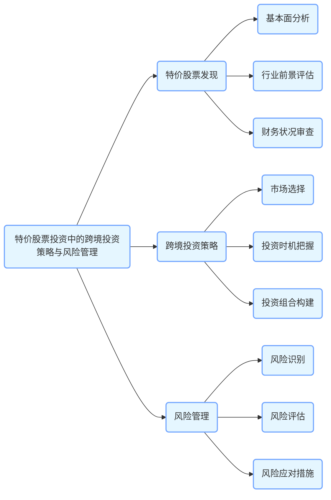

# 特价股票投资中的跨境投资策略与风险管理

> 关键词：特价股票、跨境投资策略、风险管理、投资组合、市场分析

> 摘要：本文聚焦于特价股票投资中的跨境投资策略与风险管理。首先介绍了相关背景知识，包括目的、预期读者、文档结构和术语表。接着阐述了核心概念及联系，通过文本示意图和 Mermaid 流程图进行说明。详细讲解了核心算法原理和具体操作步骤，并给出 Python 源代码示例。对数学模型和公式进行深入剖析并举例。通过项目实战展示代码实现和解读。探讨了实际应用场景，推荐了学习资源、开发工具框架和相关论文著作。最后总结未来发展趋势与挑战，提供常见问题解答和扩展阅读参考资料，旨在为投资者在特价股票跨境投资中提供全面、专业的指导。

## 1. 背景介绍 
### 1.1 目的和范围
在全球经济一体化的背景下，跨境投资已成为投资者拓展投资领域、分散风险的重要途径。特价股票由于其价格相对较低，往往蕴含着较大的投资潜力。本文章的目的在于深入探讨特价股票投资中的跨境投资策略以及如何有效地进行风险管理。范围涵盖了不同国家和地区的股票市场，分析各种影响特价股票价格的因素，以及如何制定适合跨境投资的策略和应对风险的措施。

### 1.2 预期读者
本文预期读者主要包括对跨境投资有兴趣的个人投资者、专业投资机构的从业人员、金融分析师以及相关领域的研究人员。无论是初涉投资领域的新手，还是经验丰富的投资专家，都可以从本文中获取有关特价股票跨境投资的有价值信息。

### 1.3 文档结构概述
本文将按照以下结构进行阐述：首先介绍核心概念和它们之间的联系，通过示意图和流程图帮助读者理解；接着详细讲解核心算法原理和具体操作步骤，并给出 Python 代码示例；然后介绍相关的数学模型和公式，并举例说明其应用；通过项目实战展示代码的实际实现和解读；探讨实际应用场景；推荐学习资源、开发工具框架和相关论文著作；最后总结未来发展趋势与挑战，提供常见问题解答和扩展阅读参考资料。

### 1.4 术语表
#### 1.4.1 核心术语定义
- **特价股票**：指价格相对其内在价值或同行业其他股票价格较低的股票。这些股票可能由于市场情绪、公司短期困境等原因被低估。
- **跨境投资**：投资者将资金投入到其他国家或地区的金融市场，以获取更广泛的投资机会和分散风险。
- **风险管理**：识别、评估和应对投资过程中可能面临的各种风险，以保护投资者的资金安全和实现投资目标。

#### 1.4.2 相关概念解释
- **投资组合**：由多种不同的投资资产组成的集合，通过合理配置资产可以降低风险并提高收益。
- **市场分析**：对股票市场的各种因素进行研究和评估，包括宏观经济数据、行业趋势、公司财务状况等，以预测股票价格的走势。

#### 1.4.3 缩略词列表
- **GDP**：国内生产总值（Gross Domestic Product），是衡量一个国家或地区经济状况和发展水平的重要指标。
- **PE**：市盈率（Price-to-Earnings Ratio），反映了股票价格与每股收益之间的关系，用于评估股票的估值水平。

## 2. 核心概念与联系 
### 核心概念原理
在特价股票投资的跨境投资中，涉及到多个核心概念，它们相互关联，共同影响着投资决策和风险管理。

- **特价股票的发现**：通过对不同国家和地区股票市场的研究和分析，寻找价格被低估的股票。这需要综合考虑公司的基本面、行业前景、财务状况等因素。
- **跨境投资策略**：根据不同国家和地区的市场特点、经济环境和政策法规，制定适合的投资策略。例如，有些市场可能更适合长期投资，而有些市场则更适合短期投机。
- **风险管理**：在跨境投资中，面临着多种风险，如汇率风险、政治风险、市场风险等。需要通过合理的资产配置、风险对冲等手段来降低风险。

### 架构的文本示意图
```plaintext
特价股票投资中的跨境投资策略与风险管理
|
|-- 特价股票发现
|   |-- 基本面分析
|   |-- 行业前景评估
|   |-- 财务状况审查
|
|-- 跨境投资策略
|   |-- 市场选择
|   |-- 投资时机把握
|   |-- 投资组合构建
|
|-- 风险管理
|   |-- 风险识别
|   |-- 风险评估
|   |-- 风险应对措施
```

### Mermaid 流程图


## 3. 核心算法原理 & 具体操作步骤 
### 核心算法原理
在特价股票投资的跨境投资中，一个重要的算法原理是基于多因素分析的股票筛选和投资组合优化。通过综合考虑多个因素，如市盈率、市净率、股息率、财务指标等，对股票进行评分和筛选，找出具有投资价值的特价股票。然后，根据不同市场的风险和收益特征，构建最优的投资组合。

### 具体操作步骤
1. **数据收集**：收集不同国家和地区股票市场的相关数据，包括股票价格、财务报表、宏观经济数据等。
2. **因素分析**：选择合适的因素进行分析，如市盈率、市净率、股息率等。计算每个股票的各因素指标值。
3. **股票评分**：根据各因素指标值，对股票进行评分。可以采用加权平均的方法，为每个因素分配不同的权重。
4. **股票筛选**：根据评分结果，筛选出得分较高的股票作为潜在的投资对象。
5. **投资组合构建**：根据不同市场的风险和收益特征，使用优化算法构建最优的投资组合。可以采用均值 - 方差优化模型来确定各股票的投资比例。

### Python 源代码示例
```python
import pandas as pd
import numpy as np
from scipy.optimize import minimize

# 假设已经收集到了股票数据，存储在一个 DataFrame 中
# 数据包含股票代码、市盈率、市净率、股息率等列
data = pd.read_csv('stock_data.csv')

# 选择需要分析的因素
factors = ['PE', 'PB', 'Dividend_Yield']

# 计算每个股票的综合得分
weights = [0.4, 0.3, 0.3]  # 各因素的权重
data['Score'] = np.dot(data[factors], weights)

# 筛选出得分较高的股票
top_stocks = data[data['Score'] > data['Score'].mean()].copy()

# 计算股票的预期收益率和协方差矩阵
returns = top_stocks['Return'].values
cov_matrix = np.cov(top_stocks[factors].T)

# 定义目标函数：最小化投资组合的方差
def portfolio_variance(weights, cov_matrix):
    return np.dot(weights.T, np.dot(cov_matrix, weights))

# 定义约束条件：权重之和为 1
constraints = ({'type': 'eq', 'fun': lambda x: np.sum(x) - 1})

# 定义权重的取值范围
bounds = [(0, 1) for _ in range(len(top_stocks))]

# 初始权重
initial_weights = np.ones(len(top_stocks)) / len(top_stocks)

# 进行优化
result = minimize(portfolio_variance, initial_weights, args=(cov_matrix,), constraints=constraints, bounds=bounds)

# 得到最优投资组合的权重
optimal_weights = result.x

# 输出结果
print("最优投资组合的权重：", optimal_weights)
```

## 4. 数学模型和公式 & 详细讲解 & 举例说明 
### 均值 - 方差优化模型
均值 - 方差优化模型是现代投资组合理论的核心模型之一，用于确定最优的投资组合。该模型的目标是在给定预期收益率的情况下，最小化投资组合的方差；或者在给定方差的情况下，最大化投资组合的预期收益率。

#### 数学公式
设投资组合中包含 $n$ 种资产，第 $i$ 种资产的权重为 $w_i$，预期收益率为 $r_i$，投资组合的预期收益率为 $R_p$，方差为 $\sigma_p^2$，资产之间的协方差矩阵为 $\Sigma$。则有：

- 投资组合的预期收益率：
$$R_p = \sum_{i=1}^{n} w_i r_i$$

- 投资组合的方差：
$$\sigma_p^2 = \sum_{i=1}^{n} \sum_{j=1}^{n} w_i w_j \sigma_{ij} = w^T \Sigma w$$

其中，$\sigma_{ij}$ 是资产 $i$ 和资产 $j$ 之间的协方差，$w$ 是权重向量。

#### 详细讲解
均值 - 方差优化模型的核心思想是通过合理分配资产的权重，在风险和收益之间找到一个平衡点。在实际应用中，我们通常使用优化算法来求解最优的权重向量 $w$。

#### 举例说明
假设我们有三种股票 A、B、C，它们的预期收益率分别为 $r_A = 0.1$，$r_B = 0.12$，$r_C = 0.15$，协方差矩阵为：

$$\Sigma = \begin{bmatrix}
0.04 & 0.01 & 0.02 \\
0.01 & 0.06 & 0.03 \\
0.02 & 0.03 & 0.08
\end{bmatrix}$$

我们希望在预期收益率达到 $0.13$ 的情况下，最小化投资组合的方差。

首先，定义目标函数和约束条件：

目标函数：$\min \sigma_p^2 = w^T \Sigma w$

约束条件：
- $\sum_{i=1}^{3} w_i = 1$
- $\sum_{i=1}^{3} w_i r_i = 0.13$
- $0 \leq w_i \leq 1$，$i = 1, 2, 3$

然后，使用优化算法求解最优的权重向量 $w$。可以使用 Python 中的 `scipy.optimize.minimize` 函数来实现。

```python
import numpy as np
from scipy.optimize import minimize

# 预期收益率
r = np.array([0.1, 0.12, 0.15])

# 协方差矩阵
Sigma = np.array([[0.04, 0.01, 0.02],
                  [0.01, 0.06, 0.03],
                  [0.02, 0.03, 0.08]])

# 目标函数：最小化投资组合的方差
def portfolio_variance(weights, Sigma):
    return np.dot(weights.T, np.dot(Sigma, weights))

# 约束条件：权重之和为 1
constraint1 = ({'type': 'eq', 'fun': lambda x: np.sum(x) - 1})

# 约束条件：预期收益率达到 0.13
constraint2 = ({'type': 'eq', 'fun': lambda x: np.dot(x, r) - 0.13})

# 权重的取值范围
bounds = [(0, 1) for _ in range(3)]

# 初始权重
initial_weights = np.ones(3) / 3

# 进行优化
result = minimize(portfolio_variance, initial_weights, args=(Sigma,), constraints=[constraint1, constraint2], bounds=bounds)

# 得到最优投资组合的权重
optimal_weights = result.x

print("最优投资组合的权重：", optimal_weights)
```

运行上述代码，我们可以得到最优投资组合的权重。

## 5. 项目实战：代码实际案例和详细解释说明 
### 5.1  开发环境搭建
在进行特价股票投资的跨境投资项目实战之前，需要搭建相应的开发环境。以下是具体的步骤：

1. **安装 Python**：Python 是一种广泛使用的编程语言，具有丰富的科学计算和数据分析库。可以从 Python 官方网站（https://www.python.org/downloads/）下载并安装最新版本的 Python。
2. **安装必要的库**：需要安装一些必要的 Python 库，如 `pandas`、`numpy`、`scipy` 等。可以使用 `pip` 命令进行安装：
```sh
pip install pandas numpy scipy
```
3. **数据获取**：需要获取不同国家和地区股票市场的相关数据。可以使用一些金融数据接口，如 `pandas-datareader` 来获取股票价格、财务报表等数据。安装 `pandas-datareader`：
```sh
pip install pandas-datareader
```

### 5.2  源代码详细实现和代码解读
以下是一个完整的特价股票投资跨境投资项目的源代码示例，并对代码进行详细解读。

```python
import pandas as pd
import numpy as np
from scipy.optimize import minimize
import pandas_datareader.data as web
import datetime

# 定义数据获取函数
def get_stock_data(tickers, start_date, end_date):
    data = {}
    for ticker in tickers:
        try:
            df = web.DataReader(ticker, 'yahoo', start_date, end_date)
            data[ticker] = df['Close']
        except Exception as e:
            print(f"Error getting data for {ticker}: {e}")
    return pd.DataFrame(data)

# 定义计算收益率函数
def calculate_returns(data):
    return data.pct_change().dropna()

# 定义目标函数：最小化投资组合的方差
def portfolio_variance(weights, cov_matrix):
    return np.dot(weights.T, np.dot(cov_matrix, weights))

# 定义约束条件：权重之和为 1
def weight_constraint(weights):
    return np.sum(weights) - 1

# 主函数
def main():
    # 定义股票代码
    tickers = ['AAPL', 'GOOG', 'MSFT', 'AMZN']
    
    # 定义数据获取时间范围
    start_date = datetime.datetime(2020, 1, 1)
    end_date = datetime.datetime(2023, 12, 31)
    
    # 获取股票数据
    stock_data = get_stock_data(tickers, start_date, end_date)
    
    # 计算收益率
    returns = calculate_returns(stock_data)
    
    # 计算协方差矩阵
    cov_matrix = returns.cov()
    
    # 定义权重的取值范围
    bounds = [(0, 1) for _ in range(len(tickers))]
    
    # 初始权重
    initial_weights = np.ones(len(tickers)) / len(tickers)
    
    # 定义约束条件
    constraints = ({'type': 'eq', 'fun': weight_constraint})
    
    # 进行优化
    result = minimize(portfolio_variance, initial_weights, args=(cov_matrix,), constraints=constraints, bounds=bounds)
    
    # 得到最优投资组合的权重
    optimal_weights = result.x
    
    # 输出结果
    print("最优投资组合的权重：")
    for i, ticker in enumerate(tickers):
        print(f"{ticker}: {optimal_weights[i]:.4f}")

if __name__ == "__main__":
    main()
```

### 代码解读与分析
1. **数据获取函数 `get_stock_data`**：该函数使用 `pandas-datareader` 从雅虎财经获取指定股票代码在指定时间范围内的收盘价数据。如果获取数据时出现错误，会打印错误信息。
2. **计算收益率函数 `calculate_returns`**：该函数计算股票价格的每日收益率，并去除缺失值。
3. **目标函数 `portfolio_variance`**：该函数计算投资组合的方差，用于优化过程中的目标函数。
4. **约束条件函数 `weight_constraint`**：该函数定义了权重之和为 1 的约束条件。
5. **主函数 `main`**：
    - 定义了股票代码和数据获取时间范围。
    - 调用 `get_stock_data` 函数获取股票数据。
    - 调用 `calculate_returns` 函数计算收益率。
    - 计算收益率的协方差矩阵。
    - 定义权重的取值范围和初始权重。
    - 定义约束条件。
    - 使用 `scipy.optimize.minimize` 函数进行优化，求解最优投资组合的权重。
    - 输出最优投资组合的权重。

## 6. 实际应用场景 
### 个人投资者
个人投资者可以利用跨境投资策略在特价股票市场中寻找投资机会。通过分散投资不同国家和地区的特价股票，可以降低单一市场的风险。例如，一个美国投资者可以同时投资中国、欧洲等市场的特价股票，以获取更广泛的收益来源。同时，通过风险管理措施，如合理配置资产、设置止损点等，可以保护自己的投资资金。

### 专业投资机构
专业投资机构，如基金公司、证券公司等，可以运用跨境投资策略和风险管理技术来管理大规模的投资组合。他们可以通过深入的市场分析和研究，挖掘全球范围内的特价股票投资机会，并根据不同客户的风险偏好和投资目标，制定个性化的投资策略。例如，一些全球宏观对冲基金可以根据不同国家的经济形势和政策变化，灵活调整投资组合，以获取超额收益。

### 跨国企业
跨国企业在进行海外投资和扩张时，也可以关注特价股票投资。通过收购或投资海外市场的特价股票，企业可以实现战略布局和资源整合。例如，一家中国的科技企业可以投资美国的一家具有潜力的特价科技公司，获取其技术和市场资源，提升自身的竞争力。

## 7. 工具和资源推荐
### 7.1 学习资源推荐
#### 7.1.1 书籍推荐
- 《聪明的投资者》（The Intelligent Investor）：本杰明·格雷厄姆（Benjamin Graham）的经典著作，介绍了价值投资的基本理念和方法，对于寻找特价股票具有重要的指导意义。
- 《金融市场与金融机构》（Financial Markets and Institutions）：弗雷德里克·S·米什金（Frederic S. Mishkin）的著作，全面介绍了金融市场和金融机构的相关知识，有助于理解跨境投资的市场环境。
- 《投资组合理论与资本市场》（Portfolio Theory and Capital Markets）：威廉·F·夏普（William F. Sharpe）的经典著作，阐述了现代投资组合理论的基本原理和应用。

#### 7.1.2 在线课程
- Coursera 上的 “投资学原理”（Principles of Investments）课程：由知名大学教授授课，系统介绍了投资学的基本理论和方法。
- edX 上的 “金融市场”（Financial Markets）课程：耶鲁大学教授罗伯特·希勒（Robert Shiller）主讲，深入探讨了金融市场的运行机制和投资策略。

#### 7.1.3 技术博客和网站
- Seeking Alpha：提供全球金融市场的分析和研究报告，包括特价股票的推荐和分析。
- Bloomberg：全球知名的金融资讯平台，提供实时的金融市场数据、新闻和分析。

### 7.2 开发工具框架推荐
#### 7.2.1 IDE和编辑器
- PyCharm：一款专业的 Python 集成开发环境，具有强大的代码编辑、调试和分析功能。
- Jupyter Notebook：一种交互式的编程环境，适合进行数据分析和模型开发。

#### 7.2.2 调试和性能分析工具
- pdb：Python 自带的调试工具，可以帮助开发者定位和解决代码中的问题。
- cProfile：Python 的性能分析工具，可以分析代码的运行时间和内存使用情况。

#### 7.2.3 相关框架和库
- pandas：一个强大的数据分析库，提供了丰富的数据结构和数据处理方法，适用于股票数据的分析和处理。
- numpy：一个用于科学计算的基础库，提供了高效的数组操作和数学函数。
- scipy：一个用于科学计算和优化的库，包含了各种优化算法，可用于投资组合优化。

### 7.3 相关论文著作推荐
#### 7.3.1 经典论文
- Markowitz, H. M. (1952). Portfolio Selection. The Journal of Finance, 7(1), 77 - 91. 这篇论文提出了现代投资组合理论的基本框架，对投资组合的优化和风险管理具有重要的影响。
- Sharpe, W. F. (1964). Capital Asset Prices: A Theory of Market Equilibrium Under Conditions of Risk. The Journal of Finance, 19(3), 425 - 442. 该论文提出了资本资产定价模型（CAPM），用于解释资产的预期收益率与风险之间的关系。

#### 7.3.2 最新研究成果
- 可以关注《Journal of Financial Economics》、《Review of Financial Studies》等顶级金融学术期刊，获取最新的跨境投资和风险管理的研究成果。

#### 7.3.3 应用案例分析
- 一些金融研究机构和咨询公司会发布跨境投资的应用案例分析报告，可以通过他们的官方网站获取相关资料。

## 8. 总结：未来发展趋势与挑战
### 未来发展趋势
- **全球化程度加深**：随着全球经济一体化的不断推进，跨境投资将变得更加普遍和便捷。投资者将有更多的机会参与到不同国家和地区的股票市场，寻找特价股票的投资机会。
- **科技驱动**：人工智能、大数据、区块链等技术的发展将为跨境投资带来新的机遇。例如，利用人工智能算法可以更准确地筛选特价股票，利用区块链技术可以提高跨境投资的交易效率和安全性。
- **绿色投资兴起**：随着全球对环境保护和可持续发展的关注度不断提高，绿色投资将成为未来跨境投资的一个重要方向。投资者将更加关注具有环保和社会责任的特价股票。

### 挑战
- **政策风险**：不同国家和地区的政策法规差异较大，政策的变化可能会对跨境投资产生重大影响。例如，一些国家可能会出台限制外资流入的政策，或者调整税收政策等。
- **汇率风险**：跨境投资涉及到不同货币之间的兑换，汇率的波动会影响投资的收益。投资者需要采取有效的汇率风险管理措施，如使用外汇衍生品进行对冲。
- **信息不对称**：由于不同国家和地区的市场环境、文化背景等因素的差异，投资者可能面临信息不对称的问题。这会增加投资决策的难度和风险。

## 9. 附录：常见问题与解答
### 问题 1：如何确定特价股票的内在价值？
答：确定特价股票的内在价值需要综合考虑多个因素，如公司的基本面、行业前景、财务状况等。可以使用一些估值方法，如市盈率法、市净率法、现金流折现法等。同时，还需要对公司的未来发展进行预测和评估。

### 问题 2：跨境投资需要注意哪些法律和监管问题？
答：跨境投资需要遵守不同国家和地区的法律和监管规定。在进行投资之前，需要了解目标市场的相关法律法规，如外资准入政策、税收政策、证券交易规则等。同时，还需要选择合法合规的投资渠道和中介机构。

### 问题 3：如何管理跨境投资中的汇率风险？
答：可以采用以下方法管理跨境投资中的汇率风险：
- 使用外汇衍生品，如远期合约、期货合约、期权合约等进行对冲。
- 进行多元化投资，分散投资于不同货币的资产。
- 关注汇率市场的动态，及时调整投资组合。

## 10. 扩展阅读 & 参考资料
### 扩展阅读
- 《金融炼金术》（The Alchemy of Finance）：乔治·索罗斯（George Soros）的著作，介绍了他的投资哲学和金融市场的分析方法。
- 《漫步华尔街》（A Random Walk Down Wall Street）：伯顿·马尔基尔（Burton Malkiel）的著作，探讨了股票市场的随机性和投资策略。

### 参考资料
- 各金融机构和研究机构发布的研究报告和市场分析资料。
- 各国证券交易所的官方网站，获取股票市场的相关数据和信息。

作者：AI天才研究院/AI Genius Institute & 禅与计算机程序设计艺术 /Zen And The Art of Computer Programming