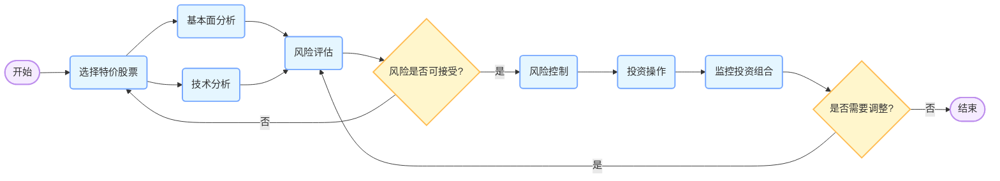

# 特价股票投资中的风险管理

> 关键词：特价股票、投资、风险管理、风险评估、风险控制

> 摘要：本文聚焦于特价股票投资中的风险管理。首先介绍了研究的背景、目的、预期读者和文档结构等内容。接着阐述了特价股票、投资风险管理等核心概念及其联系，并给出相应的示意图和流程图。详细讲解了用于风险管理的核心算法原理，通过 Python 代码进行示例。引入数学模型和公式来深入分析风险，结合实际例子帮助理解。通过项目实战展示如何在实际中运用风险管理策略，包括开发环境搭建、源代码实现与解读。探讨了特价股票投资风险管理的实际应用场景，推荐了相关的学习资源、开发工具框架和论文著作。最后总结了未来发展趋势与挑战，提供常见问题解答和扩展阅读参考资料，旨在为投资者在特价股票投资中有效管理风险提供全面的指导。

## 1. 背景介绍 
### 1.1 目的和范围
特价股票通常是指价格相对较低、可能被市场低估的股票。投资特价股票可能带来丰厚的回报，但同时也伴随着较高的风险。本文章的目的在于深入探讨在特价股票投资过程中如何进行有效的风险管理，以帮助投资者在追求收益的同时，尽可能降低损失的可能性。范围涵盖了从特价股票的定义、风险评估方法、风险控制策略到实际应用案例等多个方面。

### 1.2 预期读者
本文预期读者主要包括对特价股票投资感兴趣的个人投资者、金融投资领域的从业者，如股票分析师、投资顾问等，以及相关专业的学生和研究人员。这些读者希望通过学习特价股票投资中的风险管理知识，提升自己的投资决策能力和风险应对水平。

### 1.3 文档结构概述
本文将按照以下结构展开：首先介绍核心概念，包括特价股票和投资风险管理的定义和联系；接着阐述用于风险管理的核心算法原理，并给出 Python 代码示例；引入数学模型和公式对风险进行量化分析；通过项目实战展示如何在实际中运用风险管理策略；探讨实际应用场景；推荐相关的学习资源、开发工具框架和论文著作；最后总结未来发展趋势与挑战，提供常见问题解答和扩展阅读参考资料。

### 1.4 术语表
#### 1.4.1 核心术语定义
- **特价股票**：指市场价格相对其内在价值被低估的股票，可能由于公司短期业绩不佳、行业负面消息或市场整体波动等原因导致价格较低。
- **投资风险管理**：识别、评估和控制投资过程中可能面临的风险，以实现投资目标并最大化投资回报的过程。
- **风险评估**：对投资中可能面临的各种风险进行识别、分析和量化的过程，以便投资者了解风险的大小和可能性。
- **风险控制**：采取各种措施来降低或消除投资风险的过程，包括分散投资、止损等策略。

#### 1.4.2 相关概念解释
- **内在价值**：股票的真实价值，通常基于公司的财务状况、盈利能力、行业前景等因素进行评估。当市场价格低于内在价值时，股票可能被视为特价股票。
- **市场波动**：股票价格在市场中的上下变动，受到宏观经济环境、公司业绩、政策法规等多种因素的影响。市场波动会增加投资的不确定性和风险。

#### 1.4.3 缩略词列表
- **VAR**：Value at Risk，风险价值，是一种常用的风险度量指标，用于衡量在一定置信水平下，投资组合在未来一段时间内可能遭受的最大损失。
- **CAPM**：Capital Asset Pricing Model，资本资产定价模型，用于描述资产预期收益率与市场风险之间的关系。

## 2. 核心概念与联系 

### 2.1 核心概念原理
#### 特价股票
特价股票的核心原理在于市场的非有效性。市场并不总是能够准确反映股票的内在价值，由于信息不对称、投资者情绪等因素，某些股票的价格可能会低于其实际价值。投资者通过深入研究公司的基本面、行业前景等因素，发现这些被低估的股票，从而获得潜在的投资机会。

#### 投资风险管理
投资风险管理的原理是通过识别、评估和控制投资过程中的各种风险，使投资者能够在风险和收益之间找到平衡。风险管理的第一步是识别可能面临的风险，如市场风险、信用风险、流动性风险等；然后对这些风险进行评估，确定其大小和可能性；最后采取相应的控制措施，如分散投资、设置止损点等，以降低风险对投资组合的影响。

### 2.2 架构的文本示意图
```plaintext
特价股票投资风险管理架构
|-- 特价股票选择
|   |-- 基本面分析
|   |   |-- 财务报表分析
|   |   |-- 行业前景评估
|   |-- 技术分析
|       |-- 价格走势分析
|       |-- 成交量分析
|-- 风险评估
|   |-- 市场风险评估
|   |-- 信用风险评估
|   |-- 流动性风险评估
|-- 风险控制
|   |-- 分散投资
|   |-- 止损策略
|   |-- 套期保值
```

### 2.3 Mermaid 流程图


## 3. 核心算法原理 & 具体操作步骤 

### 3.1 风险评估算法 - VAR（风险价值）
#### 原理
VAR 是一种常用的风险度量指标，用于衡量在一定置信水平下，投资组合在未来一段时间内可能遭受的最大损失。其基本思想是基于历史数据或假设的概率分布，计算出投资组合在给定置信水平下的最大可能损失。

#### Python 代码实现
```python
import numpy as np
import pandas as pd
import yfinance as yf

# 下载股票数据
ticker = 'AAPL'
start_date = '2020-01-01'
end_date = '2023-01-01'
data = yf.download(ticker, start=start_date, end=end_date)['Close']

# 计算每日收益率
returns = data.pct_change().dropna()

# 设定置信水平和持有期
confidence_level = 0.95
holding_period = 1

# 计算 VAR
var = np.percentile(returns, (1 - confidence_level) * 100) * np.sqrt(holding_period)

print(f'在置信水平为 {confidence_level * 100}%，持有期为 {holding_period} 天的情况下，VAR 为 {var * 100:.2f}%')
```
#### 具体操作步骤
1. **数据获取**：使用 `yfinance` 库下载股票的历史收盘价数据。
2. **收益率计算**：计算每日收益率，即相邻两日收盘价的百分比变化。
3. **设定参数**：设定置信水平和持有期，例如置信水平为 95%，持有期为 1 天。
4. **计算 VAR**：使用 `np.percentile` 函数计算收益率的分位数，得到 VAR 值。

### 3.2 风险控制算法 - 分散投资
#### 原理
分散投资的原理是通过投资于不同的资产或股票，降低投资组合的整体风险。不同资产或股票的价格波动可能不完全相关，当某些资产价格下跌时，其他资产价格可能上涨，从而减少投资组合的损失。

#### Python 代码实现
```python
import numpy as np
import pandas as pd
import yfinance as yf

# 选择多个股票
tickers = ['AAPL', 'MSFT', 'GOOG', 'AMZN']
start_date = '2020-01-01'
end_date = '2023-01-01'

# 下载股票数据
data = yf.download(tickers, start=start_date, end=end_date)['Close']

# 计算每日收益率
returns = data.pct_change().dropna()

# 计算协方差矩阵
cov_matrix = returns.cov()

# 随机生成投资组合权重
weights = np.random.random(len(tickers))
weights = weights / np.sum(weights)

# 计算投资组合的预期收益率和标准差
portfolio_return = np.sum(returns.mean() * weights) * 252
portfolio_std = np.sqrt(np.dot(weights.T, np.dot(cov_matrix, weights))) * np.sqrt(252)

print(f'投资组合的预期收益率为 {portfolio_return * 100:.2f}%，标准差为 {portfolio_std * 100:.2f}%')
```
#### 具体操作步骤
1. **选择股票**：选择多个不同的股票构建投资组合。
2. **数据获取**：使用 `yfinance` 库下载这些股票的历史收盘价数据。
3. **收益率计算**：计算每日收益率。
4. **协方差矩阵计算**：计算股票收益率的协方差矩阵，用于衡量股票之间的相关性。
5. **权重分配**：随机生成投资组合的权重，并确保权重之和为 1。
6. **计算投资组合的预期收益率和标准差**：根据权重和协方差矩阵计算投资组合的预期收益率和标准差，标准差反映了投资组合的风险。

## 4. 数学模型和公式 & 详细讲解 & 举例说明 

### 4.1 VAR 数学模型和公式
#### 公式
VAR 的计算公式为：
$$VAR = - \mu z_{\alpha} \sigma \sqrt{T}$$
其中，$\mu$ 是投资组合的预期收益率，$z_{\alpha}$ 是标准正态分布的分位数，对应于置信水平 $1 - \alpha$，$\sigma$ 是投资组合的标准差，$T$ 是持有期。

#### 详细讲解
- $\mu$：预期收益率反映了投资组合在一段时间内的平均收益情况。可以通过历史数据计算得到，例如使用每日收益率的平均值。
- $z_{\alpha}$：标准正态分布的分位数，用于确定在给定置信水平下的临界值。例如，在 95% 的置信水平下，$z_{\alpha} = 1.645$。
- $\sigma$：标准差衡量了投资组合收益率的波动程度，反映了投资组合的风险大小。
- $T$：持有期表示投资的时间长度，通常以天为单位。

#### 举例说明
假设一个投资组合的预期收益率为 0.05%，标准差为 1%，持有期为 1 天，置信水平为 95%。则 $z_{\alpha} = 1.645$，代入公式可得：
$$VAR = - 0.0005 \times 1.645 \times 0.01 \times \sqrt{1} \approx - 0.000008225$$
即该投资组合在 95% 的置信水平下，1 天内可能遭受的最大损失约为 0.0008225%。

### 4.2 资本资产定价模型（CAPM）
#### 公式
CAPM 的计算公式为：
$$E(R_i) = R_f + \beta_i (E(R_m) - R_f)$$
其中，$E(R_i)$ 是资产 $i$ 的预期收益率，$R_f$ 是无风险利率，$\beta_i$ 是资产 $i$ 的贝塔系数，$E(R_m)$ 是市场组合的预期收益率。

#### 详细讲解
- $R_f$：无风险利率通常以国债收益率等作为近似值，代表了投资者在无风险情况下的收益率。
- $\beta_i$：贝塔系数衡量了资产 $i$ 的收益率相对于市场组合收益率的波动程度。$\beta_i > 1$ 表示资产 $i$ 的波动比市场组合大，$\beta_i < 1$ 表示资产 $i$ 的波动比市场组合小。
- $E(R_m)$：市场组合的预期收益率反映了整个市场的平均收益情况。

#### 举例说明
假设无风险利率为 2%，市场组合的预期收益率为 8%，某股票的贝塔系数为 1.2。则该股票的预期收益率为：
$$E(R_i) = 0.02 + 1.2 \times (0.08 - 0.02) = 0.02 + 0.072 = 0.092$$
即该股票的预期收益率为 9.2%。

## 5. 项目实战：代码实际案例和详细解释说明 

### 5.1  开发环境搭建
#### 安装 Python
首先需要安装 Python 环境，建议使用 Python 3.7 及以上版本。可以从 Python 官方网站（https://www.python.org/downloads/）下载安装包，按照安装向导进行安装。

#### 安装必要的库
使用 `pip` 命令安装项目所需的库：
```sh
pip install numpy pandas yfinance
```
- `numpy`：用于数值计算和数组操作。
- `pandas`：用于数据处理和分析。
- `yfinance`：用于下载股票数据。

### 5.2  源代码详细实现和代码解读
以下是一个完整的特价股票投资风险管理项目的代码示例：
```python
import numpy as np
import pandas as pd
import yfinance as yf

# 选择多个特价股票
tickers = ['AAPL', 'MSFT', 'GOOG', 'AMZN']
start_date = '2020-01-01'
end_date = '2023-01-01'

# 下载股票数据
data = yf.download(tickers, start=start_date, end=end_date)['Close']

# 计算每日收益率
returns = data.pct_change().dropna()

# 计算协方差矩阵
cov_matrix = returns.cov()

# 随机生成投资组合权重
weights = np.random.random(len(tickers))
weights = weights / np.sum(weights)

# 计算投资组合的预期收益率和标准差
portfolio_return = np.sum(returns.mean() * weights) * 252
portfolio_std = np.sqrt(np.dot(weights.T, np.dot(cov_matrix, weights))) * np.sqrt(252)

# 计算 VAR
confidence_level = 0.95
holding_period = 1
portfolio_returns = np.dot(returns, weights)
var = np.percentile(portfolio_returns, (1 - confidence_level) * 100) * np.sqrt(holding_period)

print(f'投资组合的预期收益率为 {portfolio_return * 100:.2f}%，标准差为 {portfolio_std * 100:.2f}%')
print(f'在置信水平为 {confidence_level * 100}%，持有期为 {holding_period} 天的情况下，VAR 为 {var * 100:.2f}%')
```
#### 代码解读
1. **数据下载**：使用 `yfinance` 库下载多个特价股票的历史收盘价数据。
2. **收益率计算**：计算每日收益率，为后续的风险评估和投资组合计算做准备。
3. **协方差矩阵计算**：计算股票收益率的协方差矩阵，用于衡量股票之间的相关性。
4. **权重分配**：随机生成投资组合的权重，并确保权重之和为 1。
5. **投资组合计算**：根据权重和协方差矩阵计算投资组合的预期收益率和标准差，标准差反映了投资组合的风险。
6. **VAR 计算**：计算投资组合在给定置信水平和持有期下的 VAR 值，衡量投资组合的潜在最大损失。

### 5.3  代码解读与分析
#### 预期收益率和标准差
预期收益率反映了投资组合在一段时间内的平均收益情况，标准差反映了投资组合收益率的波动程度，即风险大小。通过调整投资组合的权重，可以在一定程度上平衡预期收益率和风险。

#### VAR
VAR 是一种常用的风险度量指标，它给出了在给定置信水平和持有期下，投资组合可能遭受的最大损失。投资者可以根据 VAR 值来评估投资组合的风险承受能力，并采取相应的风险控制措施。

## 6. 实际应用场景 
### 个人投资者
个人投资者在进行特价股票投资时，可以运用风险管理策略来降低投资风险。例如，通过分散投资选择多个不同行业的特价股票构建投资组合，避免过度集中在某一只股票上。同时，使用 VAR 等风险度量指标来评估投资组合的风险，设定合理的止损点，当投资组合的损失达到止损点时及时卖出股票，减少损失。

### 投资机构
投资机构在管理大量资金时，风险管理尤为重要。机构投资者可以使用更复杂的风险管理模型和工具，如蒙特卡罗模拟、风险预算等，来评估和控制投资组合的风险。此外，投资机构还可以通过套期保值等策略来对冲市场风险，确保投资组合的稳定收益。

### 金融分析师
金融分析师可以运用风险管理知识对特价股票进行分析和评估，为投资者提供专业的投资建议。分析师可以通过基本面分析和技术分析来筛选出具有投资价值的特价股票，同时使用风险评估指标来评估这些股票的风险水平，帮助投资者做出更明智的投资决策。

## 7. 工具和资源推荐
### 7.1 学习资源推荐
#### 7.1.1 书籍推荐
- 《聪明的投资者》（The Intelligent Investor）：本杰明·格雷厄姆（Benjamin Graham）著，被誉为投资界的圣经，详细介绍了价值投资的理念和方法，对于特价股票投资有很大的指导意义。
- 《金融风险管理师手册》（FRM Handbook）：菲利普·乔瑞（Philippe Jorion）著，全面介绍了金融风险管理的理论和实践，包括风险评估、风险控制等方面的内容。
- 《漫步华尔街》（A Random Walk Down Wall Street）：伯顿·马尔基尔（Burton Malkiel）著，介绍了股票市场的基本原理和投资策略，帮助读者了解如何在股票投资中进行风险管理。

#### 7.1.2 在线课程
- Coursera 上的“Financial Markets”课程：由耶鲁大学教授罗伯特·席勒（Robert Shiller）讲授，介绍了金融市场的基本概念和投资理论，包括风险管理的内容。
- edX 上的“Introduction to Portfolio Management”课程：介绍了投资组合管理的基本原理和方法，包括资产配置、风险评估等方面的内容。

#### 7.1.3 技术博客和网站
- Seeking Alpha：提供股票分析、投资策略和市场评论等内容，有很多关于特价股票投资的文章和分析。
- Investopedia：一个金融知识学习网站，提供各种金融术语解释、投资教程和市场分析等内容。

### 7.2 开发工具框架推荐
#### 7.2.1 IDE和编辑器
- PyCharm：一款专业的 Python 集成开发环境，提供代码编辑、调试、版本控制等功能，适合开发复杂的 Python 项目。
- Jupyter Notebook：一个交互式的开发环境，适合进行数据分析和可视化，方便快速验证代码和展示结果。

#### 7.2.2 调试和性能分析工具
- pdb：Python 自带的调试工具，可以帮助开发者逐行调试代码，查找代码中的错误。
- cProfile：Python 自带的性能分析工具，可以分析代码的运行时间和函数调用情况，帮助开发者优化代码性能。

#### 7.2.3 相关框架和库
- scikit-learn：一个机器学习库，提供了各种机器学习算法和工具，可用于股票价格预测和风险评估等任务。
- TensorFlow：一个深度学习框架，可用于构建复杂的神经网络模型，进行股票市场分析和预测。

### 7.3 相关论文著作推荐
#### 7.3.1 经典论文
- “Capital Asset Prices: A Theory of Market Equilibrium Under Conditions of Risk”：由威廉·夏普（William Sharpe）发表，提出了资本资产定价模型（CAPM），是现代金融理论的重要基础。
- “The Arbitrage Theory of Capital Asset Pricing”：由斯蒂芬·罗斯（Stephen Ross）发表，提出了套利定价理论（APT），为资产定价提供了另一种方法。

#### 7.3.2 最新研究成果
- 可以关注《Journal of Finance》、《Review of Financial Studies》等金融领域的顶级学术期刊，了解最新的研究成果和风险管理方法。

#### 7.3.3 应用案例分析
- 可以参考一些金融机构的研究报告和案例分析，了解他们在特价股票投资风险管理方面的实践经验和策略。

## 8. 总结：未来发展趋势与挑战
### 未来发展趋势
- **数据驱动的风险管理**：随着大数据和人工智能技术的发展，未来的风险管理将更加依赖于数据和模型。投资者可以利用更多的数据源，如社交媒体数据、新闻数据等，来更准确地评估股票的风险。
- **智能化的投资决策**：人工智能算法将在投资决策中发挥越来越重要的作用。通过机器学习和深度学习算法，投资者可以自动筛选出具有投资价值的特价股票，并制定最优的投资策略。
- **跨市场风险管理**：随着全球金融市场的一体化，投资者面临的风险将更加复杂。未来的风险管理需要考虑跨市场、跨资产类别的风险，采用更加综合的风险管理方法。

### 挑战
- **数据质量和隐私问题**：数据驱动的风险管理依赖于大量的数据，但数据质量和隐私问题可能会影响风险管理的效果。投资者需要确保数据的准确性和可靠性，同时遵守相关的法律法规，保护数据隐私。
- **模型的局限性**：虽然风险管理模型可以提供一定的参考，但模型本身存在局限性。市场情况是复杂多变的，模型可能无法完全准确地预测未来的风险。投资者需要对模型的结果进行合理的评估和判断。
- **市场不确定性增加**：全球经济和政治环境的不确定性增加，如贸易摩擦、地缘政治风险等，将给特价股票投资带来更大的挑战。投资者需要更加灵活地调整投资策略，应对市场的变化。

## 9. 附录：常见问题与解答
### 1. 如何判断一只股票是否为特价股票？
判断一只股票是否为特价股票需要综合考虑多个因素，包括公司的基本面、行业前景、财务状况等。可以通过分析公司的财务报表、盈利能力、市盈率、市净率等指标，以及与同行业其他公司进行比较，来评估股票的价值。此外，还可以关注市场的情绪和投资者的预期，当市场对某只股票过度悲观时，可能会出现价格低估的情况。

### 2. 风险管理是否意味着放弃高收益？
风险管理并不意味着放弃高收益，而是在追求收益的同时，尽可能降低风险。通过合理的资产配置和风险控制策略，投资者可以在控制风险的前提下，实现较高的收益。例如，通过分散投资选择多个不同行业的特价股票构建投资组合，可以在降低风险的同时，提高投资组合的预期收益率。

### 3. VAR 指标有哪些局限性？
VAR 指标虽然是一种常用的风险度量指标，但也存在一些局限性。首先，VAR 是基于历史数据或假设的概率分布计算得到的，不能完全准确地预测未来的风险。其次，VAR 只考虑了在给定置信水平下的最大损失，没有考虑到损失超过 VAR 值的情况。此外，VAR 没有考虑到投资组合的流动性风险等其他风险因素。

### 4. 如何进行有效的分散投资？
进行有效的分散投资需要选择不同行业、不同规模、不同风格的股票进行投资。可以根据自己的投资目标和风险承受能力，确定不同行业和股票的投资比例。同时，还可以考虑投资一些其他资产，如债券、基金等，进一步分散投资组合的风险。

## 10. 扩展阅读 & 参考资料
### 扩展阅读
- 《金融炼金术》（The Alchemy of Finance）：乔治·索罗斯（George Soros）著，介绍了他的投资哲学和交易策略，对于理解金融市场的运行机制和风险管理有很大的帮助。
- 《黑天鹅》（The Black Swan）：纳西姆·尼古拉斯·塔勒布（Nassim Nicholas Taleb）著，探讨了极端事件对金融市场的影响，提醒投资者要注意市场的不确定性和风险。

### 参考资料
- 相关的金融学术期刊，如《Journal of Finance》、《Review of Financial Studies》等。
- 金融机构的研究报告和市场分析报告。
- 股票交易平台和金融数据提供商的网站，如雅虎财经、彭博社等。

作者：AI天才研究院/AI Genius Institute & 禅与计算机程序设计艺术 /Zen And The Art of Computer Programming