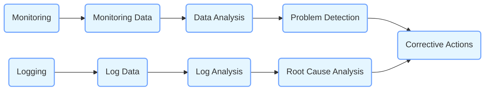

# 监控与日志：跟踪AI Agent的运行状态

> 关键词：监控、日志、AI Agent、运行状态、跟踪

> 摘要：本文围绕监控与日志在跟踪AI Agent运行状态方面的应用展开深入探讨。首先介绍了相关背景，包括目的范围、预期读者等内容。接着阐述了核心概念与联系，通过文本示意图和Mermaid流程图清晰呈现其原理和架构。详细讲解了核心算法原理及具体操作步骤，借助Python源代码进行说明。同时给出了数学模型和公式，并结合实际例子加深理解。在项目实战部分，提供了开发环境搭建、源代码实现及解读。分析了实际应用场景，推荐了学习资源、开发工具框架和相关论文著作。最后总结了未来发展趋势与挑战，还包含常见问题解答和扩展阅读参考资料，旨在为读者全面了解如何利用监控与日志跟踪AI Agent运行状态提供有价值的参考。

## 1. 背景介绍 
### 1.1 目的和范围
随着人工智能技术的飞速发展，AI Agent在各个领域的应用越来越广泛。AI Agent能够自主地感知环境、做出决策并执行相应的行动，然而其运行过程往往较为复杂，可能会受到多种因素的影响，导致出现各种问题。本文章的目的在于深入探讨如何通过监控与日志的手段来跟踪AI Agent的运行状态，及时发现并解决潜在问题，确保AI Agent的稳定、高效运行。

文章的范围涵盖了监控与日志的基本概念、核心算法原理、数学模型、实际应用场景以及相关的工具和资源推荐等方面。从理论到实践，全面介绍了跟踪AI Agent运行状态的方法和技术。

### 1.2 预期读者
本文的预期读者包括人工智能领域的开发者、研究人员、软件架构师以及对AI Agent运行状态跟踪感兴趣的技术爱好者。对于正在从事AI Agent开发和部署的专业人员，文章提供了实用的技术方案和实践经验；对于初学者，文章能够帮助他们建立起对监控与日志在AI Agent中的应用的基本认识。

### 1.3 文档结构概述
本文共分为十个部分。第一部分为背景介绍，阐述了文章的目的、范围、预期读者和文档结构概述。第二部分介绍核心概念与联系，通过文本示意图和Mermaid流程图展示监控与日志跟踪AI Agent运行状态的原理和架构。第三部分详细讲解核心算法原理及具体操作步骤，并给出Python源代码示例。第四部分介绍数学模型和公式，并进行详细讲解和举例说明。第五部分是项目实战，包括开发环境搭建、源代码实现和代码解读。第六部分分析实际应用场景。第七部分推荐相关的工具和资源，包括学习资源、开发工具框架和论文著作。第八部分总结未来发展趋势与挑战。第九部分是附录，解答常见问题。第十部分提供扩展阅读和参考资料。

### 1.4 术语表
#### 1.4.1 核心术语定义
- **监控（Monitoring）**：对AI Agent的运行状态进行实时或定期的观察和测量，以获取关键指标和数据。
- **日志（Logging）**：记录AI Agent在运行过程中的各种事件和信息，包括系统信息、错误信息、操作记录等。
- **AI Agent**：一种能够自主感知环境、做出决策并执行行动的人工智能实体。
- **运行状态（Runtime State）**：AI Agent在运行过程中的各种状态，如资源使用情况、任务执行进度、错误状态等。

#### 1.4.2 相关概念解释
- **实时监控**：在AI Agent运行过程中，持续不断地对其状态进行监测，及时发现问题并采取相应的措施。
- **日志分析**：对记录的日志数据进行处理和分析，以发现潜在的问题和规律。
- **性能指标**：用于衡量AI Agent运行性能的各种指标，如响应时间、吞吐量、资源利用率等。

#### 1.4.3 缩略词列表
- **CPU**：中央处理器（Central Processing Unit）
- **GPU**：图形处理器（Graphics Processing Unit）
- **RAM**：随机存取存储器（Random Access Memory）
- **API**：应用程序编程接口（Application Programming Interface）

## 2. 核心概念与联系 
### 核心概念原理
监控与日志是跟踪AI Agent运行状态的两种重要手段。监控主要是通过对AI Agent的关键性能指标进行实时或定期的测量和观察，及时发现系统的异常情况。例如，监控CPU和GPU的使用率、内存占用情况、网络带宽等。通过对这些指标的监控，可以了解AI Agent的资源使用情况，判断其是否处于正常运行状态。

日志则是记录AI Agent在运行过程中的各种事件和信息。日志可以分为系统日志、应用程序日志和用户操作日志等。系统日志记录了操作系统和AI Agent的启动、关闭等关键事件；应用程序日志记录了AI Agent在执行任务过程中的详细信息，如算法执行步骤、中间结果等；用户操作日志记录了用户与AI Agent的交互信息，如输入的指令、请求的服务等。通过对日志的分析，可以深入了解AI Agent的运行过程，排查问题的根源。

监控和日志之间存在着密切的联系。监控数据可以作为日志的一部分进行记录，以便后续的分析和审计。同时，日志中记录的信息也可以为监控提供参考，帮助确定监控的重点和范围。例如，通过分析日志中记录的错误信息，可以确定哪些性能指标需要重点监控，以避免类似错误的再次发生。

### 文本示意图
```plaintext
+----------------------+        +----------------------+
|       Monitoring     |        |        Logging       |
+----------------------+        +----------------------+
| - Real-time metrics  |        | - System events      |
| - Resource usage     |        | - Application logs   |
| - Performance stats  |        | - User interactions  |
+----------------------+        +----------------------+
            |                            |
            |                            |
            v                            v
+----------------------+        +----------------------+
|    Monitoring Data   |        |       Log Data       |
+----------------------+        +----------------------+
            |                            |
            |                            |
            v                            v
+----------------------+        +----------------------+
|    Data Analysis     |        |    Log Analysis      |
+----------------------+        +----------------------+
            |                            |
            |                            |
            v                            v
+----------------------+        +----------------------+
|    Problem Detection |        |    Root Cause Analysis|
+----------------------+        +----------------------+
            |                            |
            |                            |
            v                            v
+----------------------+
|   Corrective Actions |
+----------------------+
```

### Mermaid流程图


## 3. 核心算法原理 & 具体操作步骤 
### 核心算法原理
在跟踪AI Agent运行状态的过程中，涉及到多种算法和技术。下面以监控CPU使用率为例，介绍核心算法原理。

CPU使用率是指CPU在一段时间内处于忙碌状态的时间比例。通常可以通过获取系统的CPU时间信息来计算CPU使用率。在Linux系统中，可以通过读取`/proc/stat`文件来获取CPU时间信息。该文件包含了多个CPU时间统计项，如用户态时间、内核态时间、空闲时间等。

计算CPU使用率的基本公式为：

$$CPU使用率 = \frac{CPU忙碌时间}{CPU总时间} \times 100\%$$

其中，CPU忙碌时间等于用户态时间、内核态时间等非空闲时间之和，CPU总时间等于CPU忙碌时间加上空闲时间。

### 具体操作步骤
以下是使用Python实现监控CPU使用率的具体操作步骤：

1. **导入必要的库**
```python
import time

def get_cpu_time():
    with open('/proc/stat', 'r') as f:
        line = f.readline()
        fields = line.split()[1:]
        total_time = sum(map(int, fields))
        idle_time = int(fields[3])
        return total_time, idle_time

def calculate_cpu_usage():
    total_time1, idle_time1 = get_cpu_time()
    time.sleep(1)  # 等待1秒
    total_time2, idle_time2 = get_cpu_time()
    total_diff = total_time2 - total_time1
    idle_diff = idle_time2 - idle_time1
    busy_time = total_diff - idle_diff
    cpu_usage = (busy_time / total_diff) * 100
    return cpu_usage

if __name__ == "__main__":
    cpu_usage = calculate_cpu_usage()
    print(f"CPU使用率: {cpu_usage:.2f}%")
```

### 代码解释
1. **`get_cpu_time`函数**：该函数用于读取`/proc/stat`文件，获取当前的CPU总时间和空闲时间。
2. **`calculate_cpu_usage`函数**：该函数首先调用`get_cpu_time`函数获取初始的CPU时间，然后等待1秒，再次调用`get_cpu_time`函数获取新的CPU时间。通过计算两次时间的差值，得到CPU的忙碌时间和总时间，进而计算出CPU使用率。
3. **主程序**：调用`calculate_cpu_usage`函数计算CPU使用率，并将结果打印输出。

## 4. 数学模型和公式 & 详细讲解 & 举例说明 
### 数学模型和公式
在跟踪AI Agent运行状态的过程中，涉及到多个数学模型和公式。下面以监控内存使用率为例，介绍相关的数学模型和公式。

内存使用率是指系统当前使用的内存占总内存的比例。计算公式为：

$$内存使用率 = \frac{已使用内存}{总内存} \times 100\%$$

其中，已使用内存等于总内存减去空闲内存。

### 详细讲解
在Linux系统中，可以通过读取`/proc/meminfo`文件来获取内存信息。该文件包含了多个内存统计项，如总内存、空闲内存、缓存内存等。

以下是使用Python实现监控内存使用率的代码：
```python
def get_memory_info():
    with open('/proc/meminfo', 'r') as f:
        lines = f.readlines()
        total_memory = 0
        free_memory = 0
        for line in lines:
            if line.startswith('MemTotal:'):
                total_memory = int(line.split()[1])
            elif line.startswith('MemFree:'):
                free_memory = int(line.split()[1])
        return total_memory, free_memory

def calculate_memory_usage():
    total_memory, free_memory = get_memory_info()
    used_memory = total_memory - free_memory
    memory_usage = (used_memory / total_memory) * 100
    return memory_usage

if __name__ == "__main__":
    memory_usage = calculate_memory_usage()
    print(f"内存使用率: {memory_usage:.2f}%")
```

### 举例说明
假设系统的总内存为`8192000 kB`，空闲内存为`2048000 kB`，则已使用内存为：

$$已使用内存 = 8192000 - 2048000 = 6144000 kB$$

内存使用率为：

$$内存使用率 = \frac{6144000}{8192000} \times 100\% \approx 75.00\%$$

通过以上计算，可以得到系统当前的内存使用率。

## 5. 项目实战：代码实际案例和详细解释说明 
### 5.1  开发环境搭建
为了实现对AI Agent运行状态的监控与日志记录，我们需要搭建相应的开发环境。以下是具体的搭建步骤：

#### 操作系统
建议使用Linux操作系统，如Ubuntu 20.04或CentOS 8。Linux系统提供了丰富的系统监控工具和接口，方便我们获取AI Agent的运行状态信息。

#### 编程语言
选择Python作为开发语言，因为Python具有丰富的第三方库和工具，能够快速实现监控与日志记录功能。同时，Python的语法简洁易懂，易于学习和维护。

#### 安装Python和相关库
在Linux系统中，可以使用以下命令安装Python和相关库：
```bash
# 安装Python 3
sudo apt-get update
sudo apt-get install python3 python3-pip

# 安装必要的库
pip3 install psutil logging
```

### 5.2  源代码详细实现和代码解读
以下是一个完整的Python代码示例，用于监控AI Agent的CPU使用率、内存使用率和网络带宽，并将监控信息记录到日志文件中。

```python
import psutil
import logging
import time

# 配置日志记录
logging.basicConfig(filename='agent_monitoring.log', level=logging.INFO,
                    format='%(asctime)s - %(levelname)s - %(message)s')

def monitor_agent():
    try:
        while True:
            # 获取CPU使用率
            cpu_usage = psutil.cpu_percent(interval=1)
            # 获取内存使用率
            memory_usage = psutil.virtual_memory().percent
            # 获取网络带宽
            net_io_counters = psutil.net_io_counters()
            bytes_sent = net_io_counters.bytes_sent
            bytes_recv = net_io_counters.bytes_recv

            # 记录监控信息到日志文件
            logging.info(f"CPU使用率: {cpu_usage}%, 内存使用率: {memory_usage}%, 发送字节数: {bytes_sent}, 接收字节数: {bytes_recv}")

            time.sleep(5)  # 每5秒监控一次

    except KeyboardInterrupt:
        logging.info("监控停止")

if __name__ == "__main__":
    monitor_agent()
```

### 代码解读与分析
1. **日志配置**：使用`logging.basicConfig`函数配置日志记录，将日志信息记录到`agent_monitoring.log`文件中，日志级别为`INFO`。
2. **监控循环**：在`monitor_agent`函数中，使用`while True`循环不断进行监控。每次循环中，使用`psutil`库获取CPU使用率、内存使用率和网络带宽信息。
3. **获取CPU使用率**：使用`psutil.cpu_percent(interval=1)`函数获取CPU在1秒内的使用率。
4. **获取内存使用率**：使用`psutil.virtual_memory().percent`函数获取当前的内存使用率。
5. **获取网络带宽**：使用`psutil.net_io_counters()`函数获取网络I/O计数器信息，包括发送字节数和接收字节数。
6. **日志记录**：使用`logging.info`函数将监控信息记录到日志文件中。
7. **定时监控**：使用`time.sleep(5)`函数使程序每5秒进行一次监控。
8. **异常处理**：使用`try-except`语句捕获`KeyboardInterrupt`异常，当用户按下`Ctrl+C`时，程序会停止监控并记录日志。

## 6. 实际应用场景 
### 智能客服系统
在智能客服系统中，AI Agent负责与用户进行交互，解答用户的问题。通过监控与日志跟踪AI Agent的运行状态，可以及时发现系统的性能问题和异常情况。例如，监控AI Agent的响应时间和吞吐量，如果发现响应时间过长或吞吐量过低，可能是系统负载过高或算法存在问题，需要及时进行优化。同时，通过分析日志记录，可以了解用户的问题类型和分布情况，为智能客服系统的优化提供依据。

### 自动驾驶系统
在自动驾驶系统中，AI Agent负责感知环境、做出决策并控制车辆的行驶。监控与日志对于确保自动驾驶系统的安全性和可靠性至关重要。通过监控AI Agent的传感器数据、决策过程和控制指令，可以及时发现系统的故障和异常情况。例如，监控传感器的工作状态，如果发现某个传感器出现故障，需要及时采取措施，如切换到备用传感器或停车等待维修。同时，通过分析日志记录，可以对自动驾驶系统的性能进行评估和优化，提高系统的安全性和可靠性。

### 金融风险评估系统
在金融风险评估系统中，AI Agent负责对金融数据进行分析和评估，预测金融风险。监控与日志可以帮助金融机构及时发现系统的异常情况和潜在风险。例如，监控AI Agent的模型准确率和召回率，如果发现模型的性能下降，可能是数据质量问题或模型过拟合，需要及时进行调整。同时，通过分析日志记录，可以了解AI Agent的决策过程和依据，为金融机构的风险管理提供支持。

## 7. 工具和资源推荐
### 7.1 学习资源推荐
#### 7.1.1 书籍推荐
- 《Python数据分析实战》：本书介绍了Python在数据分析领域的应用，包括数据采集、清洗、分析和可视化等方面的内容，对于学习如何使用Python进行监控数据的分析非常有帮助。
- 《人工智能：现代方法》：这本书是人工智能领域的经典教材，系统地介绍了人工智能的基本概念、算法和应用，对于深入理解AI Agent的原理和运行机制具有重要的指导意义。
- 《监控与日志分析实战》：本书详细介绍了监控与日志分析的方法和技术，包括监控工具的使用、日志数据的处理和分析等方面的内容，对于学习如何跟踪AI Agent的运行状态非常有帮助。

#### 7.1.2 在线课程
- Coursera上的“人工智能基础”课程：该课程由知名大学的教授授课，系统地介绍了人工智能的基本概念、算法和应用，适合初学者学习。
- edX上的“Python数据科学入门”课程：该课程介绍了Python在数据科学领域的应用，包括数据处理、分析和可视化等方面的内容，对于学习如何使用Python进行监控数据的分析非常有帮助。
- Udemy上的“监控与日志分析实战”课程：该课程详细介绍了监控与日志分析的方法和技术，包括监控工具的使用、日志数据的处理和分析等方面的内容，适合有一定编程基础的学习者。

#### 7.1.3 技术博客和网站
- 博客园：博客园是一个技术交流平台，上面有很多关于人工智能、监控与日志分析等方面的技术文章，可以帮助我们了解最新的技术动态和解决方案。
- 开源中国：开源中国是一个开源技术社区，上面有很多开源的监控与日志分析工具和项目，可以帮助我们学习和实践相关技术。
- AI研习社：AI研习社是一个专注于人工智能领域的技术社区，上面有很多关于AI Agent、监控与日志分析等方面的技术文章和案例，可以帮助我们深入了解相关技术的应用。

### 7.2 开发工具框架推荐
#### 7.2.1 IDE和编辑器
- PyCharm：PyCharm是一款专门为Python开发设计的集成开发环境（IDE），具有代码编辑、调试、自动完成等功能，非常适合Python开发。
- Visual Studio Code：Visual Studio Code是一款轻量级的代码编辑器，支持多种编程语言，具有丰富的插件和扩展功能，可以根据需要进行定制。
- Jupyter Notebook：Jupyter Notebook是一个交互式的编程环境，支持Python等多种编程语言，适合进行数据探索和分析。

#### 7.2.2 调试和性能分析工具
- pdb：pdb是Python自带的调试工具，可以帮助我们在代码中设置断点、单步执行代码、查看变量值等，方便进行代码调试。
- cProfile：cProfile是Python的性能分析工具，可以帮助我们分析代码的性能瓶颈，找出需要优化的部分。
- Py-Spy：Py-Spy是一个轻量级的Python性能分析工具，可以在不修改代码的情况下对Python程序进行性能分析。

#### 7.2.3 相关框架和库
- psutil：psutil是一个跨平台的系统监控库，可以帮助我们获取系统的CPU、内存、磁盘、网络等信息，非常适合用于监控AI Agent的运行状态。
- logging：logging是Python自带的日志记录库，可以帮助我们记录程序的运行信息，方便进行调试和问题排查。
- Prometheus：Prometheus是一个开源的监控系统和时间序列数据库，可以帮助我们收集、存储和查询监控数据，支持多种数据采集方式和可视化工具。

### 7.3 相关论文著作推荐
#### 7.3.1 经典论文
- “The Art of Computer Programming” by Donald E. Knuth：这本书是计算机科学领域的经典著作，系统地介绍了计算机编程的基本概念、算法和数据结构，对于深入理解计算机编程的原理和方法具有重要的指导意义。
- “Artificial Intelligence: A Modern Approach” by Stuart Russell and Peter Norvig：这本书是人工智能领域的经典教材，系统地介绍了人工智能的基本概念、算法和应用，对于深入理解AI Agent的原理和运行机制具有重要的指导意义。
- “Monitoring and Logging in Distributed Systems” by George Candea and Armando Fox：这篇论文介绍了分布式系统中监控与日志的基本概念、方法和技术，对于理解如何在分布式环境中跟踪AI Agent的运行状态具有重要的参考价值。

#### 7.3.2 最新研究成果
- 每年的顶级人工智能会议（如NeurIPS、ICML、CVPR等）上都会发表很多关于AI Agent、监控与日志分析等方面的最新研究成果，可以关注这些会议的论文集，了解最新的技术动态和研究方向。
- 知名学术期刊（如Journal of Artificial Intelligence Research、Artificial Intelligence等）上也会发表很多关于人工智能领域的研究论文，可以关注这些期刊的最新文章，了解最新的研究成果。

#### 7.3.3 应用案例分析
- 《人工智能实战案例集》：这本书收集了很多人工智能领域的实际应用案例，包括智能客服系统、自动驾驶系统、金融风险评估系统等方面的案例，可以帮助我们了解如何将监控与日志技术应用到实际项目中。
- 各大科技公司的技术博客（如Google AI Blog、Microsoft Research Blog等）上也会分享很多关于人工智能应用的案例和经验，可以关注这些博客，了解最新的应用案例和技术实践。

## 8. 总结：未来发展趋势与挑战
### 未来发展趋势
#### 智能化监控与日志分析
随着人工智能技术的不断发展，监控与日志分析将越来越智能化。未来的监控系统将能够自动识别异常情况，并根据历史数据和规则进行智能决策，提供相应的解决方案。例如，当监控到AI Agent的性能指标出现异常时，系统可以自动分析原因，并推荐优化措施。

#### 多模态数据融合
未来的监控与日志系统将不仅仅关注传统的性能指标和日志信息，还将融合更多的多模态数据，如图像、音频、视频等。通过对多模态数据的分析，可以更全面地了解AI Agent的运行状态，发现潜在的问题。例如，在自动驾驶系统中，除了监控传感器数据和决策过程外，还可以结合摄像头拍摄的视频图像，分析道路情况和车辆周围的环境。

#### 分布式监控与日志管理
随着AI Agent的应用越来越广泛，其部署环境也越来越复杂，可能涉及到多个节点和分布式系统。未来的监控与日志系统需要具备分布式监控和管理的能力，能够实时收集和分析各个节点的监控数据和日志信息。例如，在云计算环境中，需要监控多个虚拟机和容器的运行状态，确保整个系统的稳定性和可靠性。

### 挑战
#### 数据隐私和安全
监控与日志系统会收集大量的AI Agent运行数据，这些数据可能包含敏感信息，如用户的个人信息、商业机密等。因此，如何保护数据的隐私和安全是一个重要的挑战。需要采取有效的数据加密、访问控制和审计等措施，确保数据不被泄露和滥用。

#### 数据处理和分析的复杂性
随着监控数据和日志信息的不断增加，数据处理和分析的复杂性也越来越高。需要开发高效的数据处理和分析算法，能够快速准确地从海量数据中提取有价值的信息。同时，还需要解决数据的存储和管理问题，确保数据的可用性和可靠性。

#### 模型可解释性
在AI Agent的运行过程中，很多决策是由机器学习模型做出的。然而，这些模型往往具有较高的复杂性，难以解释其决策过程和依据。在监控与日志分析中，需要解决模型可解释性的问题，以便更好地理解AI Agent的运行状态和决策过程，及时发现潜在的问题。

## 9. 附录：常见问题与解答
### 1. 如何选择合适的监控指标？
选择合适的监控指标需要根据AI Agent的具体应用场景和需求来确定。一般来说，可以从以下几个方面考虑：
- **性能指标**：如CPU使用率、内存使用率、响应时间、吞吐量等，这些指标可以反映AI Agent的运行性能。
- **业务指标**：如任务完成率、准确率、召回率等，这些指标可以反映AI Agent的业务效果。
- **资源指标**：如磁盘使用率、网络带宽等，这些指标可以反映AI Agent的资源使用情况。

### 2. 日志记录的频率应该如何设置？
日志记录的频率应该根据实际情况进行设置。如果日志记录过于频繁，会增加系统的开销和存储成本；如果日志记录过于稀疏，可能会错过一些重要的信息。一般来说，可以根据AI Agent的运行状态和变化频率来设置日志记录的频率。例如，在系统启动和关闭时，可以记录详细的日志信息；在系统正常运行时，可以适当降低日志记录的频率。

### 3. 如何进行日志分析？
日志分析可以分为以下几个步骤：
- **数据收集**：将各个节点的日志数据收集到一个集中的存储系统中。
- **数据清洗**：对收集到的日志数据进行清洗，去除无用的信息和噪声。
- **数据挖掘**：使用数据挖掘算法对清洗后的日志数据进行分析，发现潜在的问题和规律。
- **可视化展示**：将分析结果以可视化的方式展示出来，方便用户进行查看和理解。

### 4. 监控系统出现故障怎么办？
如果监控系统出现故障，需要及时采取以下措施：
- **检查系统配置**：检查监控系统的配置文件，确保配置正确。
- **检查网络连接**：检查监控系统与被监控对象之间的网络连接是否正常。
- **查看日志文件**：查看监控系统的日志文件，了解故障发生的原因和具体情况。
- **重启监控系统**：尝试重启监控系统，看是否能够解决问题。
- **联系技术支持**：如果以上方法都无法解决问题，需要联系监控系统的技术支持人员，寻求帮助。

## 10. 扩展阅读 & 参考资料
### 扩展阅读
- 《深度学习实战》：本书介绍了深度学习的基本概念、算法和应用，对于深入理解AI Agent的核心技术具有重要的帮助。
- 《分布式系统原理与范型》：这本书系统地介绍了分布式系统的基本概念、原理和技术，对于理解如何在分布式环境中跟踪AI Agent的运行状态具有重要的参考价值。
- 《大数据技术原理与应用》：本书介绍了大数据的基本概念、技术和应用，对于学习如何处理和分析监控与日志数据具有重要的指导意义。

### 参考资料
- psutil官方文档：https://psutil.readthedocs.io/
- logging官方文档：https://docs.python.org/3/library/logging.html
- Prometheus官方文档：https://prometheus.io/docs/introduction/overview/

作者：AI天才研究院/AI Genius Institute & 禅与计算机程序设计艺术 /Zen And The Art of Computer Programming