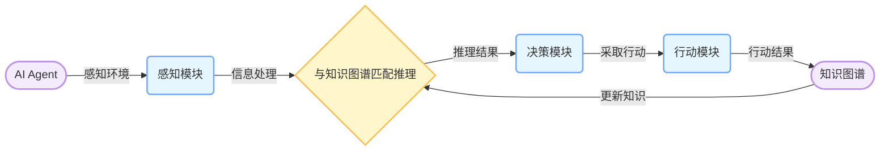

# 知识图谱在AI Agent中的应用

> 关键词：知识图谱、AI Agent、知识表示、推理、自然语言处理、信息检索、智能决策

> 摘要：本文深入探讨了知识图谱在AI Agent中的应用。首先介绍了相关背景，包括目的范围、预期读者等内容。接着阐述了知识图谱和AI Agent的核心概念及它们之间的联系，并给出了相应的文本示意图和Mermaid流程图。详细讲解了核心算法原理及具体操作步骤，结合Python源代码进行分析。同时，介绍了相关的数学模型和公式，并举例说明。通过项目实战展示了代码实际案例及详细解释。探讨了知识图谱在AI Agent中的实际应用场景，推荐了相关的工具和资源。最后总结了未来发展趋势与挑战，还提供了常见问题与解答以及扩展阅读和参考资料，旨在为读者全面呈现知识图谱在AI Agent中应用的技术全貌。

## 1. 背景介绍 
### 1.1 目的和范围
随着人工智能技术的不断发展，AI Agent逐渐成为实现智能交互和自动化任务的关键技术。知识图谱作为一种强大的知识表示和管理工具，能够为AI Agent提供丰富的结构化知识。本文的目的在于深入探讨知识图谱在AI Agent中的应用，从核心概念、算法原理、数学模型到实际应用案例等多个方面进行详细阐述，旨在为相关领域的研究人员、开发者和爱好者提供全面且深入的技术参考。范围涵盖知识图谱和AI Agent的基本原理、两者结合的技术细节以及实际应用场景等内容。

### 1.2 预期读者
本文预期读者包括但不限于人工智能领域的研究人员，他们可以从文中获取知识图谱在AI Agent中应用的最新研究进展和技术思路；软件开发工程师，通过本文可以学习到具体的实现算法和代码示例，用于实际项目开发；对人工智能技术感兴趣的学生和爱好者，帮助他们建立对知识图谱和AI Agent的基础认知和深入理解。

### 1.3 文档结构概述
本文首先介绍背景信息，让读者了解研究的目的、预期读者和文档整体结构。接着阐述知识图谱和AI Agent的核心概念及联系，通过文本示意图和Mermaid流程图帮助读者直观理解。然后详细讲解核心算法原理和具体操作步骤，结合Python代码进行说明。之后介绍相关的数学模型和公式，并举例加深理解。通过项目实战展示代码实际案例和详细解释。探讨知识图谱在AI Agent中的实际应用场景，推荐相关的工具和资源。最后总结未来发展趋势与挑战，提供常见问题与解答以及扩展阅读和参考资料。

### 1.4 术语表
#### 1.4.1 核心术语定义
- **知识图谱**：是一种用图模型来描述知识和建模世界万物之间关联关系的技术方法，由节点和边组成，节点表示实体，边表示实体之间的关系。
- **AI Agent**：即人工智能代理，是一个能够感知环境，根据内部状态和感知信息进行决策，并执行相应动作以实现特定目标的智能实体。
- **知识表示**：是指将知识以计算机能够处理和理解的形式进行表示的方法。
- **推理**：是指从已知的知识和事实出发，通过一定的规则和方法推导出新的知识和结论的过程。

#### 1.4.2 相关概念解释
- **实体**：在知识图谱中，实体是指客观世界中的具体事物或抽象概念，如人物、地点、事件等。
- **关系**：表示实体之间的联系，如“出生于”“工作于”等。
- **语义网络**：是一种知识表示方法，与知识图谱类似，通过节点和边来表示概念和概念之间的关系。

#### 1.4.3 缩略词列表
- **AI**：Artificial Intelligence，人工智能
- **RDF**：Resource Description Framework，资源描述框架
- **OWL**：Web Ontology Language，网络本体语言

## 2. 核心概念与联系 

### 知识图谱核心概念
知识图谱是一种语义网络，它以图的形式来表示知识。知识图谱由实体（节点）和关系（边）组成。实体可以是现实世界中的具体对象，如人物、地点、物品等，也可以是抽象概念，如事件、时间等。关系则描述了实体之间的联系，例如“人物 - 出生地 - 地点”“物品 - 生产厂家 - 企业”等。知识图谱通过对大量知识的整合和组织，形成了一个结构化的知识体系，能够为AI Agent提供丰富的背景知识。

### AI Agent核心概念
AI Agent是一个具有自主性、反应性、主动性和社会性的智能实体。自主性是指AI Agent能够独立地感知环境、做出决策和执行动作；反应性表示AI Agent能够对环境中的变化做出及时的响应；主动性意味着AI Agent能够主动地采取行动以实现特定的目标；社会性则表示AI Agent能够与其他Agent或人类进行交互和协作。

### 知识图谱与AI Agent的联系
知识图谱为AI Agent提供了丰富的知识支持，使得AI Agent能够更好地理解和处理自然语言、进行推理和决策。AI Agent可以利用知识图谱中的知识来回答用户的问题、提供推荐、进行智能决策等。同时，AI Agent在与环境交互的过程中，也可以不断地更新和完善知识图谱，使知识图谱更加准确和全面。

### 文本示意图
知识图谱与AI Agent的关系可以用以下文本示意图表示：

AI Agent通过感知模块获取环境信息，然后将这些信息与知识图谱中的知识进行匹配和推理。推理结果可以用于决策模块，指导AI Agent采取相应的行动。行动的结果又可以反馈给知识图谱，对知识图谱进行更新和完善。

### Mermaid流程图


## 3. 核心算法原理 & 具体操作步骤 

### 知识图谱构建算法
知识图谱的构建主要包括实体识别、关系抽取和知识融合等步骤。下面以Python为例，介绍一个简单的实体识别和关系抽取的实现。

```python
import spacy

# 加载英文语言模型
nlp = spacy.load("en_core_web_sm")

def entity_recognition(text):
    """
    实体识别函数
    :param text: 输入的文本
    :return: 识别出的实体列表
    """
    doc = nlp(text)
    entities = []
    for ent in doc.ents:
        entities.append((ent.text, ent.label_))
    return entities

def relation_extraction(text):
    """
    关系抽取函数
    :param text: 输入的文本
    :return: 抽取的关系列表
    """
    doc = nlp(text)
    relations = []
    for token in doc:
        if token.dep_ == "nsubj":
            subject = token.text
            for child in token.head.children:
                if child.dep_ == "dobj":
                    object_ = child.text
                    relation = token.head.text
                    relations.append((subject, relation, object_))
    return relations

# 示例文本
text = "John works for Google."
entities = entity_recognition(text)
relations = relation_extraction(text)

print("Entities:", entities)
print("Relations:", relations)
```

### 知识图谱推理算法
知识图谱推理是指从已知的知识图谱中推导出新的知识。常见的推理算法包括基于规则的推理和基于机器学习的推理。下面是一个简单的基于规则的推理示例：

```python
# 定义知识图谱
knowledge_graph = {
    ("John", "works for", "Google"): True,
    ("Google", "is located in", "Mountain View"): True
}

def rule_based_reasoning(subject, relation):
    """
    基于规则的推理函数
    :param subject: 主题
    :param relation: 关系
    :return: 推理结果
    """
    results = []
    for triple, value in knowledge_graph.items():
        if triple[0] == subject and triple[1] == relation:
            results.append(triple[2])
    return results

# 进行推理
result = rule_based_reasoning("John", "is located in")
print("Reasoning result:", result)
```

### 具体操作步骤
1. **数据收集**：收集相关的文本数据、结构化数据等，作为知识图谱构建的数据源。
2. **实体识别**：使用自然语言处理技术，从文本数据中识别出实体。
3. **关系抽取**：从文本数据中抽取实体之间的关系。
4. **知识融合**：将识别出的实体和抽取的关系进行整合，构建知识图谱。
5. **推理规则定义**：根据具体的应用场景，定义推理规则。
6. **推理计算**：使用推理算法，从知识图谱中推导出新的知识。

## 4. 数学模型和公式 & 详细讲解 & 举例说明 

### 知识图谱的数学模型
知识图谱可以用图 $G=(V, E)$ 来表示，其中 $V$ 是节点集合，代表实体；$E$ 是边集合，代表关系。每条边 $e=(v_i, r, v_j)$ 由两个节点 $v_i, v_j \in V$ 和一个关系 $r$ 组成。

### 知识图谱嵌入的数学模型
知识图谱嵌入是将知识图谱中的实体和关系映射到低维向量空间的过程。常见的知识图谱嵌入模型包括TransE、TransH等。以TransE模型为例，其目标是学习实体和关系的向量表示，使得对于知识图谱中的每个三元组 $(h, r, t)$，满足 $h + r \approx t$，其中 $h$、$r$、$t$ 分别是头实体、关系和尾实体的向量表示。

TransE模型的损失函数可以表示为：
$$
L = \sum_{(h, r, t) \in S} \sum_{(h', r', t') \in S'} [\gamma + d(h + r, t) - d(h' + r', t')]_+
$$
其中，$S$ 是知识图谱中的正三元组集合，$S'$ 是负三元组集合，$\gamma$ 是边界参数，$d$ 是距离函数，通常使用 $L_1$ 或 $L_2$ 范数，$[x]_+ = \max(0, x)$。

### 举例说明
假设知识图谱中有一个三元组 $(John, works for, Google)$，在TransE模型中，我们希望学习到 $John$、$works for$ 和 $Google$ 的向量表示 $h_{John}$、$r_{works for}$ 和 $t_{Google}$，使得 $h_{John} + r_{works for} \approx t_{Google}$。通过优化损失函数，不断调整这些向量的参数，直到满足上述条件。

## 5. 项目实战：代码实际案例和详细解释说明 

### 5.1  开发环境搭建
1. **安装Python**：推荐使用Python 3.7及以上版本。
2. **安装相关库**：使用pip安装必要的库，如`spacy`、`torch`等。
```bash
pip install spacy
python -m spacy download en_core_web_sm
pip install torch
```

### 5.2  源代码详细实现和代码解读
以下是一个使用知识图谱进行问答系统的简单示例：

```python
import spacy
from collections import defaultdict

# 加载英文语言模型
nlp = spacy.load("en_core_web_sm")

# 定义知识图谱
knowledge_graph = defaultdict(list)
knowledge_graph["John"] = [("works for", "Google")]
knowledge_graph["Google"] = [("is located in", "Mountain View")]

def entity_recognition(text):
    """
    实体识别函数
    :param text: 输入的文本
    :return: 识别出的实体列表
    """
    doc = nlp(text)
    entities = []
    for ent in doc.ents:
        entities.append(ent.text)
    return entities

def answer_question(question):
    """
    回答问题函数
    :param question: 输入的问题
    :return: 问题的答案
    """
    entities = entity_recognition(question)
    if len(entities) == 0:
        return "No entity found."
    entity = entities[0]
    if entity in knowledge_graph:
        answers = []
        for relation, obj in knowledge_graph[entity]:
            answers.append(f"{entity} {relation} {obj}.")
        return "\n".join(answers)
    else:
        return "No information found."

# 示例问题
question = "Where is Google located?"
answer = answer_question(question)
print("Question:", question)
print("Answer:", answer)
```

### 5.3  代码解读与分析
1. **实体识别**：`entity_recognition` 函数使用`spacy`库对输入的问题进行实体识别，提取出问题中的实体。
2. **知识图谱查询**：`answer_question` 函数根据识别出的实体，在知识图谱中查找相关信息。如果找到相关信息，则将其作为答案返回；否则返回“没有找到信息”。
3. **代码优化**：该示例代码只是一个简单的实现，实际应用中可以使用更复杂的知识图谱和推理算法，提高问答系统的性能。

## 6. 实际应用场景 

### 智能客服
知识图谱可以为智能客服提供丰富的产品知识和常见问题解答。当用户提出问题时，智能客服可以利用知识图谱进行推理和匹配，快速准确地回答用户的问题。例如，在电商平台的智能客服中，知识图谱可以包含商品信息、订单状态、售后服务等知识，帮助客服更好地解决用户的问题。

### 智能推荐
知识图谱可以用于智能推荐系统，通过分析用户的历史行为和偏好，结合知识图谱中的知识，为用户提供个性化的推荐。例如，在音乐推荐系统中，知识图谱可以包含歌手信息、歌曲风格、音乐流派等知识，根据用户的听歌历史和喜好，推荐相关的歌曲和歌手。

### 智能决策
在企业决策、医疗诊断等领域，知识图谱可以为决策者提供全面的知识支持。例如，在医疗诊断中，知识图谱可以包含疾病症状、诊断方法、治疗方案等知识，帮助医生做出更准确的诊断和治疗决策。

### 自然语言处理
知识图谱可以用于自然语言处理任务，如语义理解、文本生成等。通过将文本中的实体和关系与知识图谱中的知识进行匹配，可以提高自然语言处理的准确性和效率。例如，在机器翻译中，知识图谱可以提供词汇的语义信息，帮助翻译系统更好地理解和翻译文本。

## 7. 工具和资源推荐
### 7.1 学习资源推荐
#### 7.1.1 书籍推荐
- 《知识图谱：方法、实践与应用》：全面介绍了知识图谱的基本概念、构建方法、推理技术和应用案例。
- 《人工智能：一种现代的方法》：经典的人工智能教材，涵盖了AI Agent、知识表示等多个方面的内容。

#### 7.1.2 在线课程
- Coursera上的“Knowledge Graphs”课程：由知名教授授课，深入讲解知识图谱的理论和实践。
- edX上的“Artificial Intelligence”课程：系统介绍人工智能的基本原理和技术，包括AI Agent的相关内容。

#### 7.1.3 技术博客和网站
- 知识图谱社区（https://kg.cs.tsinghua.edu.cn/）：提供知识图谱领域的最新研究成果、技术文章和开源项目。
- AI开源社区（https://ai-open.com/）：包含人工智能各个领域的技术文章、代码示例和项目案例。

### 7.2 开发工具框架推荐
#### 7.2.1 IDE和编辑器
- PyCharm：功能强大的Python集成开发环境，适合开发Python相关的知识图谱和AI Agent项目。
- Visual Studio Code：轻量级的代码编辑器，支持多种编程语言，具有丰富的插件扩展功能。

#### 7.2.2 调试和性能分析工具
- PySnooper：可以自动记录Python代码的执行过程，方便调试和分析。
- cProfile：Python内置的性能分析工具，用于分析代码的性能瓶颈。

#### 7.2.3 相关框架和库
- DGL-KE：用于知识图谱嵌入的深度学习框架，支持多种知识图谱嵌入模型。
- rdflib：Python的RDF处理库，用于知识图谱的存储和查询。

### 7.3 相关论文著作推荐
#### 7.3.1 经典论文
- “Translating Embeddings for Modeling Multi-relational Data”：提出了TransE知识图谱嵌入模型。
- “Knowledge Graph Embedding: A Survey of Approaches and Applications”：对知识图谱嵌入的方法和应用进行了全面的综述。

#### 7.3.2 最新研究成果
- 关注顶级人工智能会议（如AAAI、IJCAI、NeurIPS等）和期刊（如Journal of Artificial Intelligence Research）上的最新论文，了解知识图谱在AI Agent中应用的最新研究进展。

#### 7.3.3 应用案例分析
- 一些知名企业（如Google、Microsoft等）的技术博客和研究报告中会分享知识图谱在实际应用中的案例