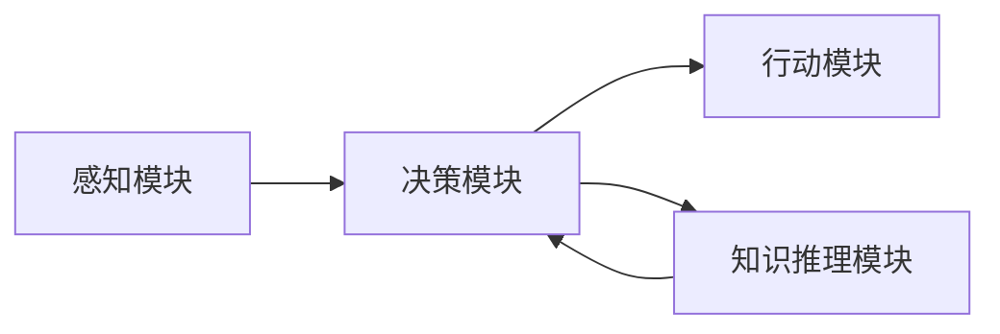

# 知识推理：增强AI Agent的逻辑思考能力

> 关键词：知识推理、AI Agent、逻辑思考能力、推理算法、知识图谱

> 摘要：本文围绕知识推理以增强AI Agent的逻辑思考能力展开。首先介绍了知识推理及AI Agent的背景知识，明确文章目的、范围和预期读者。接着阐述了核心概念及联系，包括知识推理和AI Agent的原理与架构，用示意图和流程图直观呈现。详细讲解了核心算法原理及操作步骤，结合Python代码说明。通过数学模型和公式进一步剖析推理机制，并举例说明。在项目实战部分，搭建开发环境，给出源代码并解读。探讨了知识推理在多个领域的实际应用场景，推荐了学习资源、开发工具框架及相关论文著作。最后总结未来发展趋势与挑战，解答常见问题并提供扩展阅读和参考资料，旨在帮助读者全面深入了解知识推理对增强AI Agent逻辑思考能力的重要作用。

## 1. 背景介绍 
### 1.1 目的和范围
在当今人工智能快速发展的时代，AI Agent被广泛应用于各个领域，如智能客服、自动驾驶、智能家居等。然而，现有的AI Agent在面对复杂问题时，逻辑思考能力往往显得不足。知识推理作为一种重要的技术手段，可以让AI Agent从已有的知识中推导出新的知识，从而增强其逻辑思考能力。本文的目的就是深入探讨知识推理的相关技术和方法，以及如何将其应用于AI Agent中，以提升AI Agent的智能水平。

本文的范围涵盖了知识推理的基本概念、核心算法原理、数学模型、实际应用场景等方面，同时通过项目实战案例详细展示了如何在实际开发中运用知识推理来增强AI Agent的逻辑思考能力。

### 1.2 预期读者
本文的预期读者包括人工智能领域的研究人员、开发者、学生以及对知识推理和AI Agent感兴趣的技术爱好者。对于研究人员，本文可以提供最新的研究思路和方法；对于开发者，本文可以作为实践指导，帮助他们在项目中应用知识推理技术；对于学生，本文可以作为学习资料，加深他们对知识推理和AI Agent的理解；对于技术爱好者，本文可以让他们了解知识推理在增强AI Agent逻辑思考能力方面的重要作用。

### 1.3 文档结构概述
本文将按照以下结构进行组织：
1. 背景介绍：介绍文章的目的、范围、预期读者和文档结构概述，以及相关术语的定义和解释。
2. 核心概念与联系：阐述知识推理和AI Agent的核心概念、原理和架构，并用示意图和流程图展示它们之间的联系。
3. 核心算法原理 & 具体操作步骤：详细讲解知识推理的核心算法原理，并给出具体的操作步骤，同时用Python代码进行实现。
4. 数学模型和公式 & 详细讲解 & 举例说明：介绍知识推理的数学模型和公式，并通过具体的例子进行详细讲解。
5. 项目实战：代码实际案例和详细解释说明：通过一个实际的项目案例，展示如何使用知识推理来增强AI Agent的逻辑思考能力，包括开发环境搭建、源代码实现和代码解读。
6. 实际应用场景：探讨知识推理在不同领域的实际应用场景。
7. 工具和资源推荐：推荐学习知识推理和AI Agent的相关工具和资源，包括书籍、在线课程、技术博客、开发工具框架和相关论文著作。
8. 总结：未来发展趋势与挑战：总结知识推理在增强AI Agent逻辑思考能力方面的发展趋势和面临的挑战。
9. 附录：常见问题与解答：解答读者在学习和实践过程中可能遇到的常见问题。
10. 扩展阅读 & 参考资料：提供相关的扩展阅读材料和参考资料，方便读者进一步深入学习。

### 1.4 术语表
#### 1.4.1 核心术语定义
- **知识推理**：从已有的知识中推导出新的知识的过程。知识推理可以基于规则、统计、机器学习等方法进行。
- **AI Agent**：能够感知环境、做出决策并采取行动的智能实体。AI Agent可以是软件程序、机器人等。
- **逻辑思考能力**：指运用逻辑规则和方法进行分析、判断和推理的能力。在AI Agent中，逻辑思考能力表现为能够根据已知信息推导出合理的结论，并做出正确的决策。
- **知识图谱**：一种以图的形式表示知识的方法，由节点和边组成。节点表示实体，边表示实体之间的关系。知识图谱可以用于知识推理、信息检索等任务。

#### 1.4.2 相关概念解释
- **演绎推理**：从一般性的前提出发，通过推导即“演绎”，得出具体陈述或个别结论的过程。例如，“所有的人都会死亡，苏格拉底是人，所以苏格拉底会死亡”就是一个演绎推理的例子。
- **归纳推理**：从个别事例中概括出一般性结论的过程。例如，通过观察多个苹果落地的现象，归纳出“物体在重力作用下会下落”的结论。
- **溯因推理**：从结果出发，推测导致结果的原因的过程。例如，看到地面湿了，推测可能是下雨了。

#### 1.4.3 缩略词列表
- **AI**：Artificial Intelligence，人工智能
- **ML**：Machine Learning，机器学习
- **DL**：Deep Learning，深度学习
- **KG**：Knowledge Graph，知识图谱

## 2. 核心概念与联系 

### 知识推理原理
知识推理的核心目标是利用已有的知识来推导新的知识。其基本原理可以基于不同的方法，如基于规则的推理、基于统计的推理和基于机器学习的推理。

基于规则的推理是根据预先定义的规则进行推理。例如，如果规则为“如果A是B的父亲，B是C的父亲，那么A是C的祖父”，当已知“张三是李四的父亲，李四是王五的父亲”时，就可以推导出“张三是王五的祖父”。

基于统计的推理则是通过对大量数据的统计分析来发现知识之间的关联。例如，通过分析大量的医疗数据，发现某种症状和某种疾病之间存在较高的关联度，从而在出现该症状时推测可能患有该疾病。

基于机器学习的推理是利用机器学习模型来进行推理。例如，使用神经网络模型学习知识之间的模式，然后根据输入的信息进行推理。

### AI Agent原理
AI Agent是一个能够感知环境、做出决策并采取行动的智能实体。它通常由感知模块、决策模块和行动模块组成。

感知模块负责收集环境中的信息，例如传感器收集的物理数据、文本数据等。决策模块根据感知模块收集到的信息和自身的知识进行决策，确定应该采取的行动。行动模块则根据决策模块的决策结果执行相应的行动。

### 知识推理与AI Agent的架构联系
知识推理可以为AI Agent的决策模块提供支持，增强其逻辑思考能力。在AI Agent的架构中，知识推理模块可以作为决策模块的一部分，也可以作为一个独立的模块与决策模块进行交互。

当知识推理模块作为决策模块的一部分时，它可以直接参与决策过程，根据已知的知识和感知到的信息进行推理，为决策提供依据。当知识推理模块作为独立模块时，决策模块可以向知识推理模块发送推理请求，知识推理模块根据请求进行推理，并将推理结果返回给决策模块。

### 文本示意图
```plaintext
+-------------------+       +-------------------+       +-------------------+
|    感知模块       | ----> |    决策模块       | ----> |    行动模块       |
+-------------------+       +-------------------+       +-------------------+
                          |       |
                          |       |
                          v       v
                   +-------------------+
                   |    知识推理模块   |
                   +-------------------+
```

### Mermaid流程图


## 3. 核心算法原理 & 具体操作步骤 

### 基于规则的推理算法原理
基于规则的推理算法是根据预先定义的规则进行推理。规则通常由条件和结论两部分组成，当条件满足时，就可以得出结论。

下面是一个简单的基于规则的推理算法的Python实现：

```python
# 定义规则
rules = [
    {
        "condition": lambda facts: "A是B的父亲" in facts and "B是C的父亲" in facts,
        "conclusion": "A是C的祖父"
    }
]

# 定义事实
facts = ["张三是李四的父亲", "李四是王五的父亲"]

# 推理函数
def rule_based_reasoning(rules, facts):
    new_facts = []
    for rule in rules:
        if rule["condition"](facts):
            if rule["conclusion"] not in facts and rule["conclusion"] not in new_facts:
                new_facts.append(rule["conclusion"])
    return new_facts

# 进行推理
new_facts = rule_based_reasoning(rules, facts)
print("新推导出的事实:", new_facts)
```

### 具体操作步骤
1. **定义规则**：明确规则的条件和结论，可以使用函数来表示条件。
2. **定义事实**：列出已知的事实。
3. **遍历规则**：对于每条规则，检查其条件是否满足。
4. **得出结论**：如果条件满足，且结论不在已有的事实中，则将结论作为新的事实添加到事实列表中。

### 基于统计的推理算法原理
基于统计的推理算法通过对大量数据的统计分析来发现知识之间的关联。常见的方法包括关联规则挖掘、贝叶斯网络等。

下面是一个简单的基于贝叶斯网络的推理算法的Python实现：

```python
import numpy as np

# 定义贝叶斯网络的条件概率表
# 假设我们有两个变量A和B，P(A) = 0.6，P(B|A) = 0.8，P(B|~A) = 0.3
P_A = 0.6
P_B_given_A = 0.8
P_B_given_not_A = 0.3

# 计算P(B)
P_B = P_B_given_A * P_A + P_B_given_not_A * (1 - P_A)

# 计算P(A|B)
P_A_given_B = (P_B_given_A * P_A) / P_B

print("P(A|B):", P_A_given_B)
```

### 具体操作步骤
1. **收集数据**：收集与问题相关的大量数据。
2. **统计分析**：对数据进行统计分析，计算各种概率。
3. **建立模型**：根据统计结果建立概率模型，如贝叶斯网络。
4. **进行推理**：根据已知的证据，使用概率模型进行推理，计算出所需的概率。

### 基于机器学习的推理算法原理
基于机器学习的推理算法利用机器学习模型来学习知识之间的模式。常见的模型包括神经网络、决策树等。

下面是一个简单的基于神经网络的推理算法的Python实现：

```python
import torch
import torch.nn as nn
import torch.optim as optim

# 定义一个简单的神经网络模型
class NeuralNetwork(nn.Module):
    def __init__(self):
        super(NeuralNetwork, self).__init__()
        self.fc1 = nn.Linear(2, 5)
        self.fc2 = nn.Linear(5, 1)
        self.sigmoid = nn.Sigmoid()

    def forward(self, x):
        x = self.fc1(x)
        x = torch.relu(x)
        x = self.fc2(x)
        x = self.sigmoid(x)
        return x

# 准备数据
X = torch.tensor([[0, 0], [0, 1], [1, 0], [1, 1]], dtype=torch.float32)
y = torch.tensor([[0], [1], [1], [0]], dtype=torch.float32)

# 初始化模型、损失函数和优化器
model = NeuralNetwork()
criterion = nn.BCELoss()
optimizer = optim.SGD(model.parameters(), lr=0.1)

# 训练模型
for epoch in range(1000):
    outputs = model(X)
    loss = criterion(outputs, y)
    optimizer.zero_grad()
    loss.backward()
    optimizer.step()

# 进行推理
test_input = torch.tensor([[0, 1]], dtype=torch.float32)
prediction = model(test_input)
print("预测结果:", prediction.item())
```

### 具体操作步骤
1. **数据准备**：收集和整理用于训练的数据集。
2. **模型选择**：选择合适的机器学习模型，如神经网络、决策树等。
3. **模型训练**：使用训练数据集对模型进行训练，调整模型的参数。
4. **模型评估**：使用测试数据集对训练好的模型进行评估，检查模型的性能。
5. **进行推理**：使用训练好的模型对新的输入进行推理，得到推理结果。

## 4. 数学模型和公式 & 详细讲解 & 举例说明 

### 基于规则的推理数学模型
基于规则的推理可以用逻辑表达式来表示。设 $R$ 为规则的集合，每个规则 $r \in R$ 可以表示为 $C \rightarrow E$，其中 $C$ 是规则的条件，$E$ 是规则的结论。

已知事实的集合为 $F$，推理的过程就是检查规则的条件 $C$ 是否被事实集合 $F$ 所满足。如果满足，则将结论 $E$ 添加到事实集合 $F$ 中。

例如，规则 $r$：“如果 $A$ 是 $B$ 的父亲，$B$ 是 $C$ 的父亲，那么 $A$ 是 $C$ 的祖父” 可以表示为：

$$
(A \text{ 是 } B \text{ 的父亲}) \land (B \text{ 是 } C \text{ 的父亲}) \rightarrow (A \text{ 是 } C \text{ 的祖父})
$$

当事实集合 $F$ 中包含 “$A$ 是 $B$ 的父亲” 和 “$B$ 是 $C$ 的父亲” 时，就可以推导出 “$A$ 是 $C$ 的祖父”。

### 基于统计的推理数学模型 - 贝叶斯定理
贝叶斯定理是基于统计的推理中常用的数学模型，其公式为：

$$
P(A|B) = \frac{P(B|A)P(A)}{P(B)}
$$

其中，$P(A|B)$ 是在事件 $B$ 发生的条件下事件 $A$ 发生的概率，$P(B|A)$ 是在事件 $A$ 发生的条件下事件 $B$ 发生的概率，$P(A)$ 是事件 $A$ 发生的先验概率，$P(B)$ 是事件 $B$ 发生的概率。

例如，假设我们要诊断一个人是否患有某种疾病 $D$，已知这个人有某种症状 $S$。根据贝叶斯定理，我们可以计算出在有症状 $S$ 的情况下患有疾病 $D$ 的概率：

$$
P(D|S) = \frac{P(S|D)P(D)}{P(S)}
$$

其中，$P(D)$ 是人群中患有疾病 $D$ 的先验概率，$P(S|D)$ 是患有疾病 $D$ 的人出现症状 $S$ 的概率，$P(S)$ 是人群中出现症状 $S$ 的概率。

### 基于机器学习的推理数学模型 - 神经网络
神经网络是基于机器学习的推理中常用的模型，其基本结构由输入层、隐藏层和输出层组成。

对于一个简单的前馈神经网络，输入层的神经元接收输入信号 $x = [x_1, x_2, \cdots, x_n]$，隐藏层的神经元对输入信号进行加权求和并通过激活函数进行非线性变换，输出层的神经元将隐藏层的输出进行加权求和并输出最终结果。

设输入层到隐藏层的权重矩阵为 $W^{(1)}$，隐藏层到输出层的权重矩阵为 $W^{(2)}$，隐藏层的激活函数为 $f$，则神经网络的输出 $y$ 可以表示为：

$$
h = f(W^{(1)}x + b^{(1)})
$$

$$
y = g(W^{(2)}h + b^{(2)})
$$

其中，$h$ 是隐藏层的输出，$b^{(1)}$ 和 $b^{(2)}$ 分别是隐藏层和输出层的偏置向量，$g$ 是输出层的激活函数。

例如，在一个二分类问题中，输出层的激活函数可以选择 sigmoid 函数，其公式为：

$$
g(z) = \frac{1}{1 + e^{-z}}
$$

通过调整权重矩阵 $W^{(1)}$ 和 $W^{(2)}$ 以及偏置向量 $b^{(1)}$ 和 $b^{(2)}$，可以使神经网络学习到输入和输出之间的映射关系。

## 5. 项目实战：代码实际案例和详细解释说明 

### 5.1  开发环境搭建
在本项目中，我们将使用Python进行开发，需要安装以下库：
- `numpy`：用于数值计算。
- `torch`：用于深度学习模型的构建和训练。
- `networkx`：用于知识图谱的构建和操作。

可以使用以下命令进行安装：

```bash
pip install numpy torch networkx
```

### 5.2  源代码详细实现和代码解读
#### 项目背景
我们将构建一个简单的知识推理系统，用于处理动物分类的知识。假设我们有以下知识：
- 鸟类有羽毛和翅膀。
- 哺乳动物有毛发和乳腺。
- 企鹅是鸟类。
- 猫是哺乳动物。

我们的目标是根据这些知识进行推理，例如判断企鹅是否有羽毛。

#### 源代码实现

```python
import networkx as nx

# 创建知识图谱
G = nx.DiGraph()

# 添加实体
G.add_nodes_from(["鸟类", "哺乳动物", "企鹅", "猫"])

# 添加属性
G.add_edges_from([("鸟类", "有羽毛"), ("鸟类", "有翅膀"), ("哺乳动物", "有毛发"), ("哺乳动物", "有乳腺")])

# 添加分类关系
G.add_edges_from([("企鹅", "鸟类"), ("猫", "哺乳动物")])

# 推理函数
def knowledge_reasoning(graph, entity, property):
    # 查找实体的类别
    categories = list(graph.predecessors(entity))
    for category in categories:
        # 检查类别是否具有该属性
        if graph.has_edge(category, property):
            return True
    return False

# 进行推理
result1 = knowledge_reasoning(G, "企鹅", "有羽毛")
result2 = knowledge_reasoning(G, "猫", "有毛发")

print("企鹅是否有羽毛:", result1)
print("猫是否有毛发:", result2)
```

#### 代码解读
1. **创建知识图谱**：使用 `networkx` 库创建一个有向图 `G`，并添加实体和属性节点。
2. **添加关系**：通过 `add_edges_from` 方法添加实体之间的分类关系和属性关系。
3. **推理函数**：定义 `knowledge_reasoning` 函数，该函数接受知识图谱、实体和属性作为输入，通过查找实体的类别，检查类别是否具有该属性来进行推理。
4. **进行推理**：调用 `knowledge_reasoning` 函数，判断企鹅是否有羽毛和猫是否有毛发，并输出推理结果。

### 5.3  代码解读与分析
#### 优点
- **简单易懂**：使用知识图谱的方式表示知识，直观清晰，易于理解。
- **可扩展性**：可以方便地添加新的实体、属性和关系，扩展知识图谱。
- **灵活性**：推理函数可以根据不同的需求进行修改和扩展。

#### 缺点
- **规则有限**：该方法基于预先定义的规则进行推理，对于复杂的推理任务可能不够灵活。
- **知识表示能力有限**：知识图谱只能表示简单的实体和关系，对于复杂的知识表示可能存在局限性。

## 6. 实际应用场景 
### 智能客服
在智能客服系统中，知识推理可以帮助客服机器人更好地理解用户的问题，并根据已有的知识进行回答。例如，当用户询问某种产品的特点时，客服机器人可以通过知识推理从产品知识库中推导出相关的信息，并提供给用户。

### 医疗诊断
在医疗诊断领域，知识推理可以辅助医生进行疾病诊断。医生可以输入患者的症状和检查结果，系统通过知识推理结合医学知识库中的知识，给出可能的疾病诊断和治疗建议。

### 自动驾驶
在自动驾驶系统中，知识推理可以帮助车辆理解周围的环境和交通规则。例如，通过识别交通标志和其他车辆的行为，结合预先存储的交通规则知识，推理出应该采取的行驶策略。

### 金融风险评估
在金融领域，知识推理可以用于评估金融风险。通过分析客户的信用记录、财务状况等信息，结合金融市场的知识和规则，推理出客户的信用风险和潜在的金融风险。

### 智能家居
在智能家居系统中，知识推理可以实现智能设备的自动化控制。例如，根据用户的日常习惯和环境条件，推理出用户的需求，自动调节灯光、温度等设备的状态。

## 7. 工具和资源推荐
### 7.1 学习资源推荐
#### 7.1.1 书籍推荐
- 《人工智能：一种现代的方法》：这是一本经典的人工智能教材，涵盖了知识推理、机器学习、自然语言处理等多个领域的内容。
- 《知识图谱：方法、实践与应用》：详细介绍了知识图谱的构建、推理和应用，对于学习知识推理在知识图谱中的应用有很大帮助。
- 《Python机器学习》：介绍了Python在机器学习中的应用，包括神经网络、决策树等模型的实现和训练，对于学习基于机器学习的推理算法有很好的参考价值。

#### 7.1.2 在线课程
- Coursera上的“人工智能基础”课程：由知名教授授课，系统地介绍了人工智能的基本概念和方法，包括知识推理。
- edX上的“知识图谱与语义网”课程：深入讲解了知识图谱的相关技术和应用，对于学习知识推理在知识图谱中的应用有很大帮助。
- 中国大学MOOC上的“机器学习”课程：由国内知名高校的教授授课，详细介绍了机器学习的基本原理和算法，对于学习基于机器学习的推理算法有很好的指导作用。

#### 7.1.3 技术博客和网站
- AI研习社：提供了大量的人工智能技术文章和案例，包括知识推理的相关内容。
- 机器之心：专注于人工智能领域的新闻和技术报道，经常发布知识推理的最新研究成果和应用案例。
- 开源中国：提供了丰富的开源项目和技术文章，对于学习知识推理的开源实现有很大帮助。

### 7.2 开发工具框架推荐
#### 7.2.1 IDE和编辑器
- PyCharm：是一款专门为Python开发设计的集成开发环境，具有代码编辑、调试、版本控制等功能，非常适合开发基于Python的知识推理系统。
- Jupyter Notebook：是一个交互式的开发环境，可以方便地进行代码编写、运行和结果展示，对于学习和实验知识推理算法非常有用。
- Visual Studio Code：是一款轻量级的代码编辑器，支持多种编程语言和插件，具有丰富的扩展功能，可以满足不同的开发需求。

#### 7.2.2 调试和性能分析工具
- PDB：是Python自带的调试工具，可以帮助开发者定位代码中的问题。
- cProfile：是Python的性能分析工具，可以分析代码的运行时间和函数调用情况，帮助开发者优化代码性能。
- TensorBoard：是TensorFlow提供的可视化工具，可以用于可视化深度学习模型的训练过程和性能指标，对于调试和优化基于深度学习的推理模型非常有帮助。

#### 7.2.3 相关框架和库
- NetworkX：是一个用于创建、操作和研究复杂网络的Python库，可以用于构建和操作知识图谱。
- PyTorch：是一个开源的深度学习框架，提供了丰富的神经网络模型和工具，对于实现基于机器学习的推理算法非常方便。
- rdflib：是一个用于处理RDF数据的Python库，RDF是一种常用的知识表示格式，rdflib可以帮助开发者处理和推理RDF数据。

### 7.3 相关论文著作推荐
#### 7.3.1 经典论文
- “A Mathematical Theory of Communication” by Claude E. Shannon：奠定了信息论的基础，对于理解知识推理中的信息处理和传输有重要意义。
- “Probabilistic Reasoning in Intelligent Systems: Networks of Plausible Inference” by Judea Pearl：提出了贝叶斯网络的概念，为基于概率的知识推理提供了重要的理论基础。
- “Learning Representations by Back-propagating Errors” by David E. Rumelhart, Geoffrey E. Hinton, and Ronald J. Williams：介绍了反向传播算法，为神经网络的训练提供了有效的方法，对于基于神经网络的知识推理有重要影响。

#### 7.3.2 最新研究成果
- 关注顶级人工智能会议如AAAI、IJCAI、NeurIPS等的会议论文，这些会议上会发表知识推理领域的最新研究成果。
- 阅读顶级学术期刊如Journal of Artificial Intelligence Research (JAIR)、Artificial Intelligence等上的相关论文，了解知识推理的前沿研究动态。

#### 7.3.3 应用案例分析
- 研究一些实际应用中的知识推理案例，如智能客服系统、医疗诊断系统等的相关论文和报告，了解知识推理在实际场景中的应用方法和效果。

## 8. 总结：未来发展趋势与挑战
### 未来发展趋势
#### 融合多种推理方法
未来的知识推理系统将融合基于规则、统计和机器学习的推理方法，充分发挥各种方法的优势，提高推理的准确性和效率。

#### 与知识图谱深度结合
知识图谱作为一种有效的知识表示方法，将与知识推理深度结合。通过知识图谱的语义信息和结构信息，为知识推理提供更丰富的知识支持。

#### 应用于更多领域
知识推理将在更多领域得到应用，如教育、娱乐、农业等。随着技术的不断发展，知识推理将为这些领域带来更智能的解决方案。

#### 强化学习与知识推理的结合
强化学习可以让AI Agent在与环境的交互中不断学习和优化策略，将强化学习与知识推理相结合，可以使AI Agent在复杂环境中做出更合理的决策。

### 挑战
#### 知识获取和表示
如何获取和表示大量的、准确的知识是知识推理面临的一个挑战。知识的来源广泛，包括文本、图像、视频等，如何将这些知识转化为适合推理的形式是一个需要解决的问题。

#### 推理效率
随着知识的增加和推理任务的复杂化，推理效率成为一个关键问题。如何设计高效的推理算法和数据结构，提高推理的速度和性能是一个挑战。

#### 不确定性处理
现实世界中的知识往往存在不确定性，如何处理不确定性是知识推理的一个难点。例如，在医疗诊断中，症状和疾病之间的关系可能不是绝对的，如何在不确定的情况下进行准确的推理是一个需要研究的问题。

#### 可解释性
知识推理的结果需要具有可解释性，特别是在一些关键领域如医疗、金融等。如何让AI Agent解释其推理过程和结果，增强用户对推理结果的信任是一个挑战。

## 9. 附录：常见问题与解答
### 1. 知识推理和机器学习有什么区别？
知识推理是从已有的知识中推导出新的知识，它通常基于规则、统计或逻辑方法。机器学习是让计算机通过数据学习模式和规律，从而进行预测和决策。知识推理更注重利用已有的知识进行推理，而机器学习更注重从数据中学习。

### 2. 如何选择合适的推理算法？
选择合适的推理算法需要考虑多个因素，如问题的类型、数据的特点、推理的复杂度等。如果问题具有明确的规则，可以选择基于规则的推理算法；如果数据具有统计规律，可以选择基于统计的推理算法；如果问题比较复杂，需要处理大量的数据和非线性关系，可以选择基于机器学习的推理算法。

### 3. 知识推理在实际应用中可能会遇到哪些问题？
知识推理在实际应用中可能会遇到知识获取困难、知识表示不准确、推理效率低下、不确定性处理困难等问题。此外，还可能会遇到与用户交互、可解释性等方面的问题。

### 4. 如何提高知识推理的准确性？
提高知识推理的准确性可以从以下几个方面入手：
- 确保知识的准确性和完整性，通过多种渠道获取知识，并进行验证和更新。
- 选择合适的推理算法，根据问题的特点和数据的情况选择最适合的算法。
- 进行数据预处理，对数据进行清洗、特征提取等操作，提高数据的质量。
- 结合多种推理方法，融合基于规则、统计和机器学习的推理方法，充分发挥各种方法的优势。

### 5. 知识推理与知识图谱有什么关系？
知识图谱是一种以图的形式表示知识的方法，它可以为知识推理提供丰富的知识支持。知识推理可以利用知识图谱中的实体和关系进行推理，发现新的知识和关系。同时，知识推理的结果也可以用于更新和完善知识图谱。

## 10. 扩展阅读 & 参考资料
### 扩展阅读
- 《深度学习》（Deep Learning）：由Ian Goodfellow、Yoshua Bengio和Aaron Courville撰写，深入介绍了深度学习的理论和应用，对于学习基于深度学习的知识推理有很大帮助。
- 《人工智能哲学》（Philosophy of Artificial Intelligence）：探讨了人工智能的哲学基础和伦理问题，对于从哲学角度理解知识推理有一定的启发。
- 《智能系统中的概率推理：似然网络》（Probabilistic Reasoning in Intelligent Systems: Networks of Plausible Inference）：详细介绍了贝叶斯网络的理论和应用，是学习基于概率的知识推理的经典著作。

### 参考资料
- [AAAI会议官网](https://www.aaai.org/)：提供人工智能领域的最新研究成果和会议信息。
- [IJCAI会议官网](https://ijcai.org/)：国际人工智能联合会议的官方网站，发布人工智能领域的顶级研究成果。
- [NeurIPS会议官网](https://neurips.cc/)：神经信息处理系统大会的官方网站，专注于机器学习和深度学习的研究。
- [Python官方文档](https://docs.python.org/3/)：提供Python语言的详细文档和教程。
- [PyTorch官方文档](https://pytorch.org/docs/stable/index.html)：提供PyTorch深度学习框架的详细文档和教程。
- [NetworkX官方文档](https://networkx.org/documentation/stable/)：提供NetworkX库的详细文档和教程。

作者：AI天才研究院/AI Genius Institute & 禅与计算机程序设计艺术 /Zen And The Art of Computer Programming