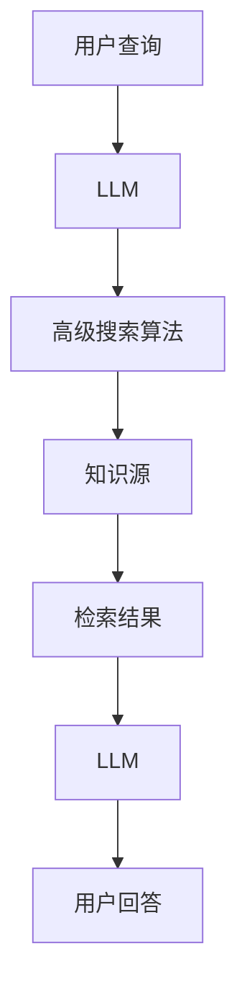

# 知识检索增强型AI Agent：结合LLM与高级搜索算法

> 关键词：知识检索、AI Agent、大语言模型（LLM）、高级搜索算法、信息增强

> 摘要：本文深入探讨知识检索增强型AI Agent，它将大语言模型（LLM）的强大语言处理能力与高级搜索算法相结合，旨在提升AI Agent在知识获取和应用方面的性能。首先介绍了相关背景知识，包括目的、预期读者等内容。接着详细阐述核心概念及联系，通过文本示意图和Mermaid流程图进行直观展示。深入讲解核心算法原理，结合Python代码示例说明具体操作步骤。同时，给出数学模型和公式，并举例说明其应用。通过项目实战，从开发环境搭建到源代码实现与解读，全面展示知识检索增强型AI Agent的实现过程。分析其实际应用场景，为不同领域的应用提供思路。推荐了相关的学习资源、开发工具框架以及论文著作，助力读者深入研究。最后总结未来发展趋势与挑战，并对常见问题进行解答，为进一步研究和实践提供参考。

## 1. 背景介绍 
### 1.1 目的和范围
随着人工智能技术的不断发展，大语言模型（LLM）如GPT系列、文心一言等展现出了强大的语言理解和生成能力。然而，LLM存在知识更新不及时、缺乏对特定领域深度知识的掌握等问题。知识检索增强型AI Agent的提出，旨在结合LLM与高级搜索算法，充分利用外部知识源，弥补LLM的不足，提高AI Agent在知识检索和应用方面的准确性和全面性。

本文的范围涵盖了知识检索增强型AI Agent的核心概念、算法原理、数学模型、项目实战、应用场景以及相关工具和资源推荐等方面，旨在为读者提供一个全面深入的技术指南。

### 1.2 预期读者
本文预期读者包括人工智能领域的研究人员、开发者、技术爱好者，以及对知识检索和AI Agent应用感兴趣的相关专业人士。对于希望深入了解知识检索增强型AI Agent技术原理和实现方法的读者，本文将提供有价值的参考。

### 1.3 文档结构概述
本文将按照以下结构进行阐述：首先介绍背景知识，包括目的、预期读者和文档结构概述等内容。接着详细讲解核心概念与联系，通过文本示意图和Mermaid流程图直观展示其原理和架构。深入分析核心算法原理，并给出Python代码示例说明具体操作步骤。介绍数学模型和公式，并举例说明其应用。通过项目实战，从开发环境搭建到源代码实现与解读，全面展示知识检索增强型AI Agent的实现过程。分析其实际应用场景，为不同领域的应用提供思路。推荐相关的学习资源、开发工具框架以及论文著作，助力读者深入研究。最后总结未来发展趋势与挑战，并对常见问题进行解答，为进一步研究和实践提供参考。

### 1.4 术语表
#### 1.4.1 核心术语定义
- **AI Agent**：人工智能代理，是一种能够感知环境、进行决策并采取行动的智能实体。
- **大语言模型（LLM）**：基于深度学习的语言模型，通过在大规模文本数据上进行训练，能够生成自然语言文本、理解语义等。
- **知识检索增强型AI Agent**：结合了大语言模型和高级搜索算法的AI Agent，能够利用外部知识源进行知识检索和应用，增强其智能表现。
- **高级搜索算法**：包括但不限于基于语义的搜索算法、基于图的搜索算法等，能够更高效地从大量数据中检索出相关知识。

#### 1.4.2 相关概念解释
- **知识图谱**：一种语义网络，用于表示实体之间的关系，能够为知识检索提供更丰富的语义信息。
- **向量空间模型**：将文本表示为向量，通过计算向量之间的相似度来进行文本匹配和检索。

#### 1.4.3 缩略词列表
- **LLM**：Large Language Model（大语言模型）
- **AI**：Artificial Intelligence（人工智能）

## 2. 核心概念与联系 

知识检索增强型AI Agent的核心思想是将大语言模型的语言处理能力与高级搜索算法的知识检索能力相结合。大语言模型可以对用户的查询进行理解和处理，生成相关的检索关键词；高级搜索算法则根据这些关键词从外部知识源中检索出相关的知识信息。然后，AI Agent将检索到的知识信息与大语言模型的能力相结合，生成更加准确和全面的回答。

### 文本示意图
```plaintext
用户查询 -> LLM（理解查询、生成关键词） -> 高级搜索算法（知识检索） -> 知识源（如知识库、互联网等） -> 检索结果 -> LLM（结合知识生成回答） -> 用户回答
```

### Mermaid流程图


## 3. 核心算法原理 & 具体操作步骤 

### 核心算法原理
知识检索增强型AI Agent的核心算法主要包括以下几个部分：
1. **查询理解**：使用大语言模型对用户的查询进行理解，提取关键信息。
2. **关键词生成**：根据查询理解的结果，生成用于知识检索的关键词。
3. **知识检索**：使用高级搜索算法，根据关键词从外部知识源中检索出相关的知识信息。
4. **知识融合**：将检索到的知识信息与大语言模型的内部知识进行融合。
5. **回答生成**：使用融合后的知识，生成用户的回答。

### 具体操作步骤及Python代码示例
以下是一个简单的Python代码示例，演示了知识检索增强型AI Agent的基本实现过程：

```python
import openai
import requests

# 设置OpenAI API密钥
openai.api_key = "your_api_key"

# 模拟知识源，这里使用一个简单的列表
knowledge_source = [
    "苹果是一种常见的水果。",
    "苹果富含维生素C。",
    "苹果有多种品种，如红富士、嘎啦等。"
]

def query_llm(query):
    """
    使用大语言模型理解查询并生成关键词
    """
    response = openai.Completion.create(
        engine="text-davinci-003",
        prompt=f"提取以下查询的关键词：{query}",
        max_tokens=10
    )
    keywords = response.choices[0].text.strip()
    return keywords

def search_knowledge(keywords):
    """
    使用高级搜索算法（这里简单模拟）从知识源中检索知识
    """
    results = []
    for knowledge in knowledge_source:
        if keywords in knowledge:
            results.append(knowledge)
    return results

def generate_answer(query, results):
    """
    结合查询和检索结果，使用大语言模型生成回答
    """
    prompt = f"用户查询：{query}，相关知识：{results}，请生成一个回答。"
    response = openai.Completion.create(
        engine="text-davinci-003",
        prompt=prompt,
        max_tokens=100
    )
    answer = response.choices[0].text.strip()
    return answer

def knowledge_retrieval_agent(query):
    """
    知识检索增强型AI Agent的主函数
    """
    keywords = query_llm(query)
    results = search_knowledge(keywords)
    answer = generate_answer(query, results)
    return answer

# 测试示例
query = "苹果有什么营养？"
answer = knowledge_retrieval_agent(query)
print(answer)
```

### 代码解释
1. **query_llm函数**：使用OpenAI的大语言模型提取用户查询的关键词。
2. **search_knowledge函数**：模拟高级搜索算法，从知识源中检索包含关键词的知识信息。
3. **generate_answer函数**：结合用户查询和检索结果，使用大语言模型生成回答。
4. **knowledge_retrieval_agent函数**：知识检索增强型AI Agent的主函数，调用上述三个函数完成整个流程。

## 4. 数学模型和公式 & 详细讲解 & 举例说明 

### 向量空间模型
向量空间模型是知识检索中常用的数学模型之一。在向量空间模型中，文本被表示为向量，通过计算向量之间的相似度来进行文本匹配和检索。

#### 向量表示
假设我们有一个词汇表 $V = \{w_1, w_2, \cdots, w_n\}$，文本 $d$ 可以表示为一个 $n$ 维向量 $\mathbf{d} = [d_1, d_2, \cdots, d_n]$，其中 $d_i$ 表示词汇 $w_i$ 在文本 $d$ 中的权重。常用的权重计算方法包括词频 - 逆文档频率（TF - IDF）。

#### TF - IDF公式
词频（TF）表示词汇在文本中出现的频率，计算公式为：
$$TF_{t,d}=\frac{f_{t,d}}{\max\{f_{w,d}:w\in d\}}$$
其中，$f_{t,d}$ 表示词汇 $t$ 在文本 $d$ 中出现的次数，$\max\{f_{w,d}:w\in d\}$ 表示文本 $d$ 中出现次数最多的词汇的出现次数。

逆文档频率（IDF）表示词汇在整个文档集合中的普遍程度，计算公式为：
$$IDF_t=\log\frac{N}{df_t}$$
其中，$N$ 表示文档集合中的文档总数，$df_t$ 表示包含词汇 $t$ 的文档数。

TF - IDF权重为：
$$TF - IDF_{t,d}=TF_{t,d}\times IDF_t$$

#### 相似度计算
常用的向量相似度计算方法是余弦相似度，计算公式为：
$$\cos(\mathbf{d}_1,\mathbf{d}_2)=\frac{\mathbf{d}_1\cdot\mathbf{d}_2}{\|\mathbf{d}_1\|\|\mathbf{d}_2\|}$$
其中，$\mathbf{d}_1\cdot\mathbf{d}_2$ 表示向量 $\mathbf{d}_1$ 和 $\mathbf{d}_2$ 的点积，$\|\mathbf{d}_1\|$ 和 $\|\mathbf{d}_2\|$ 分别表示向量 $\mathbf{d}_1$ 和 $\mathbf{d}_2$ 的模。

### 举例说明
假设我们有一个文档集合 $D = \{d_1, d_2, d_3\}$，词汇表 $V = \{w_1, w_2, w_3\}$，文档和词汇的出现情况如下：

| 文档 | $w_1$ | $w_2$ | $w_3$ |
| ---- | ---- | ---- | ---- |
| $d_1$ | 2 | 1 | 0 |
| $d_2$ | 1 | 2 | 1 |
| $d_3$ | 0 | 1 | 2 |

计算 $d_1$ 和 $d_2$ 的余弦相似度：

首先，计算 $d_1$ 和 $d_2$ 的向量表示：
$\mathbf{d}_1 = [2, 1, 0]$，$\mathbf{d}_2 = [1, 2, 1]$

然后，计算向量的模：
$\|\mathbf{d}_1\|=\sqrt{2^2 + 1^2 + 0^2}=\sqrt{5}$
$\|\mathbf{d}_2\|=\sqrt{1^2 + 2^2 + 1^2}=\sqrt{6}$

接着，计算向量的点积：
$\mathbf{d}_1\cdot\mathbf{d}_2 = 2\times1 + 1\times2 + 0\times1 = 4$

最后，计算余弦相似度：
$\cos(\mathbf{d}_1,\mathbf{d}_2)=\frac{4}{\sqrt{5}\sqrt{6}}\approx0.73$

## 5. 项目实战：代码实际案例和详细解释说明 

### 5.1  开发环境搭建
#### 软件环境
- **操作系统**：推荐使用Linux或macOS，也可以使用Windows。
- **Python版本**：Python 3.7及以上。
- **开发工具**：推荐使用PyCharm或VS Code。

#### 库和框架安装
在命令行中执行以下命令安装所需的库：
```sh
pip install openai requests
```

### 5.2  源代码详细实现和代码解读
以下是一个更完整的知识检索增强型AI Agent的源代码示例：

```python
import openai
import requests
from bs4 import BeautifulSoup

# 设置OpenAI API密钥
openai.api_key = "your_api_key"

def query_llm(query):
    """
    使用大语言模型理解查询并生成关键词
    """
    response = openai.Completion.create(
        engine="text-davinci-003",
        prompt=f"提取以下查询的关键词：{query}",
        max_tokens=10
    )
    keywords = response.choices[0].text.strip()
    return keywords

def search_web(keywords):
    """
    使用搜索引擎从互联网上检索知识
    """
    url = f"https://www.baidu.com/s?wd={keywords}"
    headers = {
        "User-Agent": "Mozilla/5.0 (Windows NT 10.0; Win64; x64) AppleWebKit/537.36 (KHTML, like Gecko) Chrome/58.0.3029.110 Safari/537.3"}
    response = requests.get(url, headers=headers)
    soup = BeautifulSoup(response.text, 'html.parser')
    results = []
    for result in soup.find_all('div', class_='result c-container'):
        title = result.find('h3').text
        link = result.find('a')['href']
        results.append((title, link))
    return results

def generate_answer(query, results):
    """
    结合查询和检索结果，使用大语言模型生成回答
    """
    prompt = f"用户查询：{query}，相关搜索结果：{results}，请生成一个回答。"
    response = openai.Completion.create(
        engine="text-davinci-003",
        prompt=prompt,
        max_tokens=200
    )
    answer = response.choices[0].text.strip()
    return answer

def knowledge_retrieval_agent(query):
    """
    知识检索增强型AI Agent的主函数
    """
    keywords = query_llm(query)
    results = search_web(keywords)
    answer = generate_answer(query, results)
    return answer

# 测试示例
query = "人工智能的发展趋势"
answer = knowledge_retrieval_agent(query)
print(answer)
```

### 5.3  代码解读与分析
1. **query_llm函数**：使用OpenAI的大语言模型提取用户查询的关键词。
2. **search_web函数**：使用百度搜索引擎从互联网上检索与关键词相关的网页信息。使用`requests`库发送HTTP请求，使用`BeautifulSoup`库解析HTML页面，提取搜索结果的标题和链接。
3. **generate_answer函数**：结合用户查询和检索结果，使用大语言模型生成回答。
4. **knowledge_retrieval_agent函数**：知识检索增强型AI Agent的主函数，调用上述三个函数完成整个流程。

## 6. 实际应用场景 

### 智能客服
在智能客服系统中，知识检索增强型AI Agent可以结合大语言模型的自然语言处理能力和高级搜索算法的知识检索能力，快速准确地回答用户的问题。例如，当用户咨询产品信息、售后服务等问题时，AI Agent可以从产品知识库、常见问题解答等知识源中检索相关信息，并生成自然流畅的回答。

### 智能教育
在智能教育领域，知识检索增强型AI Agent可以作为学习助手，帮助学生解决学习过程中遇到的问题。例如，当学生询问某个知识点的详细解释、相关例题等问题时，AI Agent可以从教材、学术论文、在线学习资源等知识源中检索相关信息，并根据学生的问题生成个性化的学习建议和解答。

### 信息检索与推荐
在信息检索和推荐系统中，知识检索增强型AI Agent可以根据用户的查询和兴趣，从海量的信息资源中检索出相关的信息，并进行个性化的推荐。例如，在新闻推荐系统中，AI Agent可以根据用户的浏览历史和兴趣偏好，从新闻数据库中检索出相关的新闻文章，并推送给用户。

## 7. 工具和资源推荐
### 7.1 学习资源推荐
#### 7.1.1 书籍推荐
- 《人工智能：一种现代的方法》：全面介绍了人工智能的基本概念、算法和应用，是人工智能领域的经典教材。
- 《Python自然语言处理》：详细介绍了Python在自然语言处理中的应用，包括文本处理、语言模型、信息检索等内容。

#### 7.1.2 在线课程
- Coursera上的“人工智能基础”课程：由知名高校的教授授课，系统介绍了人工智能的基础知识和算法。
- edX上的“自然语言处理”课程：深入讲解了自然语言处理的理论和实践，包括大语言模型的原理和应用。

#### 7.1.3 技术博客和网站
- Medium：有许多人工智能领域的专家和爱好者分享他们的研究成果和实践经验。
- arXiv：提供了大量的学术论文，包括人工智能、自然语言处理等领域的最新研究成果。

### 7.2 开发工具框架推荐
#### 7.2.1 IDE和编辑器
- PyCharm：一款专业的Python集成开发环境，提供了丰富的代码编辑、调试和分析功能。
- VS Code：一款轻量级的代码编辑器，支持多种编程语言和插件，可用于Python开发。

#### 7.2.2 调试和性能分析工具
- PDB：Python自带的调试工具，可用于调试Python代码。
- cProfile：Python的性能分析工具，可用于分析代码的执行时间和性能瓶颈。

#### 7.2.3 相关框架和库
- OpenAI API：提供了大语言模型的调用接口，可用于实现自然语言处理任务。
- Requests：用于发送HTTP请求，可用于从互联网上检索信息。
- BeautifulSoup：用于解析HTML和XML页面，可用于提取网页中的信息。

### 7.3 相关论文著作推荐
#### 7.3.1 经典论文
- “Attention Is All You Need”：介绍了Transformer架构，是大语言模型的基础。
- “BERT: Pre-training of Deep Bidirectional Transformers for Language Understanding”：介绍了BERT模型，开创了预训练语言模型的先河。

#### 7.3.2 最新研究成果
- 在arXiv等学术平台上搜索“Knowledge Retrieval Enhanced AI Agent”等关键词，可获取相关的最新研究成果。

#### 7.3.3 应用案例分析
- 关注人工智能领域的顶级会议（如NeurIPS、ICML等）的论文，其中有许多关于知识检索增强型AI Agent的应用案例分析。

## 8. 总结：未来发展趋势与挑战
### 未来发展趋势
- **多模态融合**：未来的知识检索增强型AI Agent将不仅仅局限于文本信息的检索和处理，还将融合图像、音频、视频等多模态信息，实现更加全面和智能的知识检索和应用。
- **个性化服务**：根据用户的兴趣、偏好和历史行为，提供更加个性化的知识检索和服务，提高用户体验。
- **与物联网的结合**：与物联网设备相结合，实现对物理世界的感知和交互，为用户提供更加实时和准确的信息。

### 挑战
- **知识源的管理和更新**：随着知识源的不断增长和更新，如何有效地管理和更新知识源，确保知识的准确性和时效性，是一个挑战。
- **隐私和安全问题**：在知识检索和应用过程中，需要处理大量的用户数据和敏感信息，如何保障用户的隐私和数据安全，是一个重要的问题。
- **算法的效率和可扩展性**：随着数据量的不断增加和任务的复杂度不断提高，如何提高算法的效率和可扩展性，是一个需要解决的问题。

## 9. 附录：常见问题与解答
### 问题1：如何选择合适的大语言模型？
解答：选择大语言模型时，需要考虑模型的性能、功能、成本等因素。例如，OpenAI的GPT系列模型性能强大，但使用成本较高；而一些开源的大语言模型，如BERT、XLNet等，性能也不错，且可以免费使用。

### 问题2：如何优化知识检索的效果？
解答：可以通过以下方法优化知识检索的效果：选择合适的搜索算法，如基于语义的搜索算法、基于图的搜索算法等；对知识源进行预处理，如文本清洗、关键词提取等；使用知识图谱等技术，提供更丰富的语义信息。

### 问题3：如何处理知识检索中的歧义问题？
解答：可以使用大语言模型对查询进行理解和消歧，结合上下文信息和知识源中的信息，确定查询的准确含义。同时，也可以使用一些自然语言处理技术，如词性标注、命名实体识别等，辅助进行歧义处理。

## 10. 扩展阅读 & 参考资料
- OpenAI官方文档：https://platform.openai.com/docs/
- Requests库官方文档：https://requests.readthedocs.io/en/latest/
- BeautifulSoup库官方文档：https://www.crummy.com/software/BeautifulSoup/bs4/doc/

作者：AI天才研究院/AI Genius Institute & 禅与计算机程序设计艺术 /Zen And The Art of Computer Programming