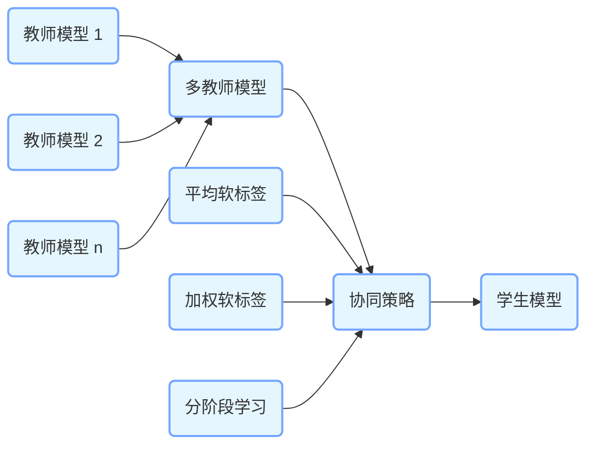

# 知识蒸馏在多教师模型中的协同策略

> 关键词：知识蒸馏、多教师模型、协同策略、深度学习、模型压缩、知识传递、集成学习

> 摘要：本文围绕知识蒸馏在多教师模型中的协同策略展开深入探讨。知识蒸馏作为一种有效的模型压缩与知识传递技术，在多教师模型场景下具有独特的优势和挑战。文章首先介绍了相关背景知识，包括目的、预期读者等内容。接着阐述了知识蒸馏和多教师模型的核心概念与联系，通过示意图和流程图清晰呈现其架构。详细讲解了核心算法原理并给出 Python 源代码，同时介绍了相关数学模型和公式。通过项目实战，给出代码实际案例并进行详细解释。分析了知识蒸馏在多教师模型中的实际应用场景，推荐了相关学习资源、开发工具框架以及论文著作。最后总结了未来发展趋势与挑战，并提供常见问题解答和扩展阅读参考资料，旨在为研究者和开发者在该领域的研究和实践提供全面且深入的指导。

## 1. 背景介绍 
### 1.1 目的和范围
知识蒸馏（Knowledge Distillation）是一种将大型、复杂且性能良好的模型（教师模型）的知识迁移到小型、简单的模型（学生模型）中的技术。其主要目的在于解决深度学习模型在实际应用中面临的计算资源和存储需求过高的问题。在多教师模型的场景下，存在多个不同的教师模型，每个教师模型可能具有不同的优势和特点。本文章的目的是探讨如何让这些多教师模型协同工作，以更有效地将知识传递给学生模型，提高学生模型的性能和泛化能力。

本文的范围涵盖了知识蒸馏在多教师模型中的基本概念、核心算法原理、数学模型、项目实战、实际应用场景以及相关工具和资源推荐等方面，旨在为读者提供一个全面而深入的关于知识蒸馏在多教师模型中协同策略的知识体系。

### 1.2 预期读者
本文预期读者包括对深度学习、模型压缩、知识蒸馏等领域感兴趣的研究人员、学生以及从事相关技术开发的工程师。对于想要深入了解知识蒸馏技术在多教师模型场景下应用的专业人士，以及希望将该技术应用到实际项目中的开发者都具有一定的参考价值。

### 1.3 文档结构概述
本文按照以下结构进行组织：首先介绍背景知识，包括目的、预期读者和文档结构概述等内容；接着阐述知识蒸馏和多教师模型的核心概念与联系，通过文本示意图和 Mermaid 流程图进行清晰呈现；详细讲解核心算法原理并给出 Python 源代码；介绍相关数学模型和公式并进行详细讲解和举例说明；通过项目实战，给出代码实际案例并进行详细解释；分析知识蒸馏在多教师模型中的实际应用场景；推荐相关学习资源、开发工具框架以及论文著作；最后总结未来发展趋势与挑战，提供常见问题解答和扩展阅读参考资料。

### 1.4 术语表
#### 1.4.1 核心术语定义
- **知识蒸馏（Knowledge Distillation）**：一种将教师模型的知识传递给学生模型的技术，通过让学生模型学习教师模型的输出（软标签）来提升自身性能。
- **教师模型（Teacher Model）**：通常是一个大型、复杂且性能良好的模型，其知识将被传递给学生模型。
- **学生模型（Student Model）**：一个小型、简单的模型，通过学习教师模型的知识来提高自身的性能和泛化能力。
- **多教师模型（Multi - Teacher Model）**：存在多个不同的教师模型，这些模型可以具有不同的结构、训练数据或训练方法。
- **协同策略（Collaborative Strategy）**：多教师模型之间相互协作，以更有效地将知识传递给学生模型的策略。

#### 1.4.2 相关概念解释
- **软标签（Soft Labels）**：教师模型的输出概率分布，相对于真实标签（硬标签），软标签包含了更多的类别之间的关系信息。
- **蒸馏损失（Distillation Loss）**：用于衡量学生模型的输出与教师模型的软标签之间的差异，是知识蒸馏过程中的重要损失函数。
- **集成学习（Ensemble Learning）**：将多个模型的预测结果进行综合，以提高整体性能的方法，多教师模型可以看作是集成学习的一种形式。

#### 1.4.3 缩略词列表
- **KD**：Knowledge Distillation（知识蒸馏）
- **MLP**：Multi - Layer Perceptron（多层感知机）
- **CNN**：Convolutional Neural Network（卷积神经网络）

## 2. 核心概念与联系 

### 知识蒸馏的基本原理
知识蒸馏的核心思想是让学生模型学习教师模型的软标签。在传统的监督学习中，模型学习的是真实标签（硬标签），例如在图像分类任务中，一张图片的真实标签可能是“猫”或“狗”。而在知识蒸馏中，教师模型的输出是一个概率分布，即每个类别的预测概率，这个概率分布包含了更多的信息，例如不同类别之间的相似性。学生模型通过最小化自己的输出与教师模型的软标签之间的差异来学习知识。

### 多教师模型的概念
多教师模型是指存在多个不同的教师模型。这些教师模型可以在结构上不同，例如一个是卷积神经网络（CNN），另一个是循环神经网络（RNN）；也可以在训练数据上不同，例如一个教师模型使用了更多的有标签数据，另一个使用了部分无标签数据；还可以在训练方法上不同，例如一个使用了随机梯度下降（SGD），另一个使用了自适应学习率算法（如 Adam）。

### 多教师模型的协同策略
多教师模型的协同策略旨在让多个教师模型相互协作，以更有效地将知识传递给学生模型。常见的协同策略包括：
- **平均软标签策略**：将多个教师模型的软标签进行平均，然后让学生模型学习这个平均后的软标签。
- **加权软标签策略**：根据每个教师模型的性能或可信度，为其软标签分配不同的权重，然后将加权后的软标签传递给学生模型。
- **分阶段学习策略**：在不同的训练阶段，让学生模型分别学习不同教师模型的知识，或者按照一定的顺序依次学习多个教师模型的知识。

### 文本示意图
```plaintext
多教师模型（教师模型 1、教师模型 2、...、教师模型 n）
     |
     | （软标签）
     v
协同策略（平均软标签、加权软标签、分阶段学习等）
     |
     | （处理后的软标签）
     v
学生模型
```

### Mermaid 流程图


## 3. 核心算法原理 & 具体操作步骤 

### 平均软标签策略的算法原理
平均软标签策略是一种简单而有效的多教师模型协同策略。其基本思想是将多个教师模型的软标签进行平均，然后让学生模型学习这个平均后的软标签。具体步骤如下：
1. 对于每个输入样本，分别计算多个教师模型的软标签。
2. 将这些软标签进行逐元素平均，得到平均软标签。
3. 计算学生模型的输出与平均软标签之间的蒸馏损失。
4. 使用优化算法（如随机梯度下降）更新学生模型的参数，以最小化蒸馏损失。

### Python 源代码实现
```python
import torch
import torch.nn as nn
import torch.optim as optim

# 定义教师模型 1
class TeacherModel1(nn.Module):
    def __init__(self):
        super(TeacherModel1, self).__init__()
        self.fc1 = nn.Linear(10, 20)
        self.fc2 = nn.Linear(20, 5)

    def forward(self, x):
        x = torch.relu(self.fc1(x))
        x = self.fc2(x)
        return x

# 定义教师模型 2
class TeacherModel2(nn.Module):
    def __init__(self):
        super(TeacherModel2, self).__init__()
        self.fc1 = nn.Linear(10, 15)
        self.fc2 = nn.Linear(15, 5)

    def forward(self, x):
        x = torch.relu(self.fc1(x))
        x = self.fc2(x)
        return x

# 定义学生模型
class StudentModel(nn.Module):
    def __init__(self):
        super(StudentModel, self).__init__()
        self.fc1 = nn.Linear(10, 10)
        self.fc2 = nn.Linear(10, 5)

    def forward(self, x):
        x = torch.relu(self.fc1(x))
        x = self.fc2(x)
        return x

# 初始化模型
teacher_model1 = TeacherModel1()
teacher_model2 = TeacherModel2()
student_model = StudentModel()

# 定义损失函数和优化器
criterion = nn.KLDivLoss(reduction='batchmean')
optimizer = optim.SGD(student_model.parameters(), lr=0.01)

# 模拟输入数据
input_data = torch.randn(32, 10)

# 训练过程
for epoch in range(100):
    # 计算教师模型的软标签
    teacher_output1 = torch.softmax(teacher_model1(input_data), dim=1)
    teacher_output2 = torch.softmax(teacher_model2(input_data), dim=1)

    # 计算平均软标签
    average_teacher_output = (teacher_output1 + teacher_output2) / 2

    # 计算学生模型的输出
    student_output = torch.softmax(student_model(input_data), dim=1)

    # 计算蒸馏损失
    loss = criterion(torch.log(student_output), average_teacher_output)

    # 反向传播和参数更新
    optimizer.zero_grad()
    loss.backward()
    optimizer.step()

    if epoch % 10 == 0:
        print(f'Epoch {epoch}, Loss: {loss.item()}')
```

### 代码解释
1. **模型定义**：定义了两个教师模型 `TeacherModel1` 和 `TeacherModel2`，以及一个学生模型 `StudentModel`。这些模型都是简单的全连接神经网络。
2. **损失函数和优化器**：使用 KL 散度损失函数 `nn.KLDivLoss` 来计算学生模型的输出与平均软标签之间的差异，使用随机梯度下降优化器 `optim.SGD` 来更新学生模型的参数。
3. **训练过程**：在每个训练周期中，首先计算两个教师模型的软标签，然后将它们进行平均得到平均软标签。接着计算学生模型的输出，并计算蒸馏损失。最后进行反向传播和参数更新。

## 4. 数学模型和公式 & 详细讲解 & 举例说明 

### 知识蒸馏的基本数学模型
知识蒸馏的核心是最小化学生模型的输出与教师模型的软标签之间的差异。通常使用 KL 散度（Kullback - Leibler Divergence）作为损失函数，其数学定义如下：

$$
D_{KL}(P || Q) = \sum_{i = 1}^{n} P(i) \log \frac{P(i)}{Q(i)}
$$

其中 $P$ 是教师模型的软标签概率分布，$Q$ 是学生模型的输出概率分布，$n$ 是类别数。

### 平均软标签策略的数学模型
在平均软标签策略中，假设有 $m$ 个教师模型，第 $j$ 个教师模型的软标签概率分布为 $P_j$，则平均软标签概率分布 $\bar{P}$ 定义为：

$$
\bar{P} = \frac{1}{m} \sum_{j = 1}^{m} P_j
$$

学生模型的蒸馏损失 $L_{distill}$ 为：

$$
L_{distill} = D_{KL}(\bar{P} || Q)
$$

### 详细讲解
KL 散度是一种衡量两个概率分布之间差异的指标。它表示从概率分布 $Q$ 到概率分布 $P$ 的信息损失。在知识蒸馏中，我们希望学生模型的输出概率分布 $Q$ 尽可能接近教师模型的软标签概率分布 $P$，因此最小化 KL 散度可以实现这一目标。

平均软标签策略通过将多个教师模型的软标签进行平均，综合了多个教师模型的知识。这样可以减少单个教师模型的偏差，提高学生模型学习到的知识的多样性和准确性。

### 举例说明
假设我们有一个三分类问题，两个教师模型的软标签概率分布分别为：

$$
P_1 = [0.2, 0.3, 0.5]
$$

$$
P_2 = [0.3, 0.4, 0.3]
$$

则平均软标签概率分布为：

$$
\bar{P} = \frac{[0.2, 0.3, 0.5] + [0.3, 0.4, 0.3]}{2} = [0.25, 0.35, 0.4]
$$

假设学生模型的输出概率分布为：

$$
Q = [0.1, 0.4, 0.5]
$$

则蒸馏损失为：

$$
\begin{align*}
L_{distill} &= D_{KL}(\bar{P} || Q) \\
&= 0.25 \log \frac{0.25}{0.1} + 0.35 \log \frac{0.35}{0.4} + 0.4 \log \frac{0.4}{0.5} \\
&\approx 0.25 \times 0.916 + 0.35 \times (-0.134) + 0.4 \times (-0.223) \\
&\approx 0.229 - 0.047 - 0.089 \\
&\approx 0.093
\end{align*}
$$

## 5. 项目实战：代码实际案例和详细解释说明 

### 5.1  开发环境搭建
- **操作系统**：推荐使用 Linux 系统，如 Ubuntu 18.04 或更高版本。
- **Python 版本**：Python 3.7 或更高版本。
- **深度学习框架**：PyTorch 1.7 或更高版本。可以使用以下命令安装 PyTorch：
```bash
pip install torch torchvision
```
- **开发工具**：推荐使用 PyCharm 或 Jupyter Notebook 进行代码开发和调试。

### 5.2  源代码详细实现和代码解读
以下是一个更完整的多教师模型知识蒸馏的代码示例，使用了加权软标签策略：

```python
import torch
import torch.nn as nn
import torch.optim as optim
from torch.utils.data import DataLoader, Dataset

# 定义自定义数据集
class CustomDataset(Dataset):
    def __init__(self, data, labels):
        self.data = data
        self.labels = labels

    def __len__(self):
        return len(self.data)

    def __getitem__(self, idx):
        return self.data[idx], self.labels[idx]

# 定义教师模型 1
class TeacherModel1(nn.Module):
    def __init__(self):
        super(TeacherModel1, self).__init__()
        self.fc1 = nn.Linear(10, 20)
        self.fc2 = nn.Linear(20, 5)

    def forward(self, x):
        x = torch.relu(self.fc1(x))
        x = self.fc2(x)
        return x

# 定义教师模型 2
class TeacherModel2(nn.Module):
    def __init__(self):
        super(TeacherModel2, self).__init__()
        self.fc1 = nn.Linear(10, 15)
        self.fc2 = nn.Linear(15, 5)

    def forward(self, x):
        x = torch.relu(self.fc1(x))
        x = self.fc2(x)
        return x

# 定义学生模型
class StudentModel(nn.Module):
    def __init__(self):
        super(StudentModel, self).__init__()
        self.fc1 = nn.Linear(10, 10)
        self.fc2 = nn.Linear(10, 5)

    def forward(self, x):
        x = torch.relu(self.fc1(x))
        x = self.fc2(x)
        return x

# 初始化模型
teacher_model1 = TeacherModel1()
teacher_model2 = TeacherModel2()
student_model = StudentModel()

# 定义损失函数和优化器
criterion = nn.KLDivLoss(reduction='batchmean')
optimizer = optim.SGD(student_model.parameters(), lr=0.01)

# 模拟数据集
data = torch.randn(100, 10)
labels = torch.randint(0, 5, (100,))
dataset = CustomDataset(data, labels)
dataloader = DataLoader(dataset, batch_size=32, shuffle=True)

# 教师模型权重
teacher_weights = [0.6, 0.4]