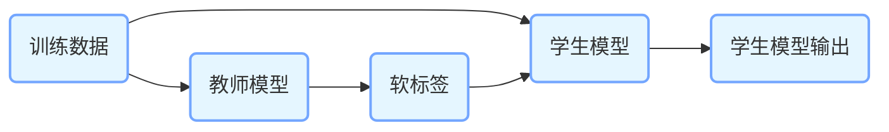

# 知识蒸馏：压缩模型大小的同时保持性能

> 关键词：知识蒸馏、模型压缩、性能保持、教师模型、学生模型

> 摘要：在深度学习领域，模型的规模越来越大，这给计算资源和存储带来了巨大挑战。知识蒸馏作为一种有效的模型压缩技术，能够在大幅减小模型大小的同时保持甚至提升模型性能。本文将深入探讨知识蒸馏的核心概念、算法原理、数学模型，通过项目实战展示其具体实现，并分析其实际应用场景，最后对未来发展趋势与挑战进行总结。

## 1. 背景介绍 
### 1.1 目的和范围
随着深度学习在各个领域的广泛应用，模型的复杂度和规模不断增加。大规模模型虽然在性能上表现出色，但对计算资源和存储要求极高，这限制了其在资源受限环境下的应用。知识蒸馏的目的就是在不显著损失模型性能的前提下，压缩模型的大小，提高模型的部署效率。本文将详细介绍知识蒸馏的原理、算法和实现，涵盖从理论到实践的各个方面。

### 1.2 预期读者
本文主要面向对深度学习、模型压缩技术感兴趣的研究人员、工程师和学生。对于希望了解如何在资源受限环境下部署高效模型的开发者，以及想要深入研究知识蒸馏原理的技术爱好者都具有参考价值。

### 1.3 文档结构概述
本文首先介绍知识蒸馏的背景和相关术语，然后详细阐述核心概念和联系，包括原理和架构示意图。接着讲解核心算法原理并给出Python源代码示例，同时介绍相关的数学模型和公式。通过项目实战展示知识蒸馏的具体实现过程，分析其实际应用场景。最后推荐相关的工具和资源，总结未来发展趋势与挑战，并提供常见问题解答和参考资料。

### 1.4 术语表
#### 1.4.1 核心术语定义
- **知识蒸馏（Knowledge Distillation）**：一种模型压缩技术，通过将一个大型、复杂的教师模型的知识转移到一个小型、简单的学生模型中，使学生模型在保持一定性能的同时减小模型大小。
- **教师模型（Teacher Model）**：通常是一个大型、复杂且性能优异的模型，用于提供知识给学生模型。
- **学生模型（Student Model）**：一个小型、简单的模型，通过学习教师模型的知识来提高自身性能。
- **软标签（Soft Labels）**：教师模型输出的概率分布，包含了比硬标签（类别标签）更多的信息。

#### 1.4.2 相关概念解释
- **模型压缩**：通过各种技术手段减小模型的大小和计算量，提高模型的部署效率。
- **迁移学习**：将在一个任务上学习到的知识迁移到另一个相关任务上，知识蒸馏可以看作是一种特殊的迁移学习。

#### 1.4.3 缩略词列表
- **KD**：Knowledge Distillation（知识蒸馏）

## 2. 核心概念与联系 

### 核心概念原理
知识蒸馏的核心思想是让学生模型学习教师模型的输出，而不仅仅是学习训练数据的标签。教师模型的输出通常是一个概率分布，即软标签，它包含了更多的信息。例如，在图像分类任务中，教师模型可能对某个图像预测为猫的概率是0.8，狗的概率是0.1，其他类别的概率是0.1。学生模型通过学习这个软标签，可以更好地理解不同类别之间的关系，从而提高自身性能。

### 架构示意图

这个流程图展示了知识蒸馏的基本过程。训练数据同时输入到教师模型和学生模型中，教师模型输出软标签，学生模型在学习训练数据标签的同时，还学习教师模型的软标签，最终输出学生模型的结果。

## 3. 核心算法原理 & 具体操作步骤 

### 算法原理
知识蒸馏的核心算法可以分为以下几个步骤：
1. **训练教师模型**：使用大量的训练数据训练一个大型、复杂的教师模型，使其达到较高的性能。
2. **生成软标签**：将训练数据输入到教师模型中，得到教师模型的输出概率分布，即软标签。
3. **训练学生模型**：在训练学生模型时，同时考虑训练数据的硬标签和教师模型的软标签。通常使用一个损失函数来平衡这两部分的贡献。

### Python源代码示例
```python
import torch
import torch.nn as nn
import torch.optim as optim

# 定义教师模型
class TeacherModel(nn.Module):
    def __init__(self):
        super(TeacherModel, self).__init__()
        self.fc1 = nn.Linear(10, 20)
        self.fc2 = nn.Linear(20, 2)

    def forward(self, x):
        x = torch.relu(self.fc1(x))
        x = self.fc2(x)
        return x

# 定义学生模型
class StudentModel(nn.Module):
    def __init__(self):
        super(StudentModel, self).__init__()
        self.fc1 = nn.Linear(10, 10)
        self.fc2 = nn.Linear(10, 2)

    def forward(self, x):
        x = torch.relu(self.fc1(x))
        x = self.fc2(x)
        return x

# 训练教师模型
teacher_model = TeacherModel()
criterion_teacher = nn.CrossEntropyLoss()
optimizer_teacher = optim.Adam(teacher_model.parameters(), lr=0.001)

# 模拟训练数据
train_data = torch.randn(100, 10)
train_labels = torch.randint(0, 2, (100,))

for epoch in range(100):
    optimizer_teacher.zero_grad()
    outputs_teacher = teacher_model(train_data)
    loss_teacher = criterion_teacher(outputs_teacher, train_labels)
    loss_teacher.backward()
    optimizer_teacher.step()

# 生成软标签
with torch.no_grad():
    teacher_outputs = teacher_model(train_data)
    soft_labels = torch.softmax(teacher_outputs / 2, dim=1)  # 使用温度参数T=2

# 训练学生模型
student_model = StudentModel()
criterion_student_hard = nn.CrossEntropyLoss()
criterion_student_soft = nn.KLDivLoss(reduction='batchmean')
optimizer_student = optim.Adam(student_model.parameters(), lr=0.001)
alpha = 0.5  # 平衡硬标签和软标签的权重
T = 2  # 温度参数

for epoch in range(100):
    optimizer_student.zero_grad()
    outputs_student = student_model(train_data)
    loss_hard = criterion_student_hard(outputs_student, train_labels)
    loss_soft = criterion_student_soft(torch.log_softmax(outputs_student / T, dim=1), soft_labels) * (T * T)
    loss_student = alpha * loss_hard + (1 - alpha) * loss_soft
    loss_student.backward()
    optimizer_student.step()
```
### 代码解释
1. **定义教师模型和学生模型**：分别定义了一个简单的全连接神经网络作为教师模型和学生模型。
2. **训练教师模型**：使用交叉熵损失函数训练教师模型，使其达到较高的性能。
3. **生成软标签**：将训练数据输入到教师模型中，得到教师模型的输出，使用softmax函数生成软标签，并使用温度参数T来调整软标签的平滑度。
4. **训练学生模型**：在训练学生模型时，同时考虑硬标签和软标签的损失。使用交叉熵损失函数计算硬标签的损失，使用KL散度损失函数计算软标签的损失，并使用权重alpha来平衡这两部分的贡献。

## 4. 数学模型和公式 & 详细讲解 & 举例说明 

### 数学模型和公式
知识蒸馏的损失函数通常可以表示为：
$$
L_{KD} = \alpha L_{hard} + (1 - \alpha) L_{soft}
$$
其中，$L_{KD}$ 是知识蒸馏的总损失，$L_{hard}$ 是硬标签的损失，通常使用交叉熵损失函数：
$$
L_{hard} = -\sum_{i=1}^{N} y_i \log(p_i)
$$
其中，$y_i$ 是真实标签，$p_i$ 是学生模型的预测概率。

$L_{soft}$ 是软标签的损失，通常使用KL散度损失函数：
$$
L_{soft} = T^2 \sum_{i=1}^{N} q_i^T \log(\frac{q_i^T}{p_i^T})
$$
其中，$q_i^T$ 是教师模型的软标签，$p_i^T$ 是学生模型的预测概率，$T$ 是温度参数。

### 详细讲解
- **硬标签损失**：硬标签损失用于让学生模型学习训练数据的真实标签，保证学生模型的基本性能。
- **软标签损失**：软标签损失用于让学生模型学习教师模型的知识，通过KL散度损失函数来衡量学生模型的预测概率分布与教师模型的软标签概率分布之间的差异。
- **温度参数T**：温度参数T用于调整软标签的平滑度。当T较大时，软标签的分布更加平滑，不同类别之间的差异减小，学生模型可以学习到更多的类别之间的关系；当T较小时，软标签的分布更加尖锐，学生模型更注重学习教师模型的决策边界。

### 举例说明
假设在一个二分类任务中，教师模型对某个样本的输出为 $[0.8, 0.2]$，真实标签为 $[1, 0]$，学生模型的输出为 $[0.6, 0.4]$。
- **硬标签损失**：
$$
L_{hard} = - (1 \times \log(0.6) + 0 \times \log(0.4)) \approx 0.51
$$
- **软标签损失（假设 $T = 2$）**：
首先计算教师模型的软标签：
$$
q_1^T = \frac{e^{0.8/2}}{e^{0.8/2} + e^{0.2/2}} \approx 0.64
$$
$$
q_2^T = \frac{e^{0.2/2}}{e^{0.8/2} + e^{0.2/2}} \approx 0.36
$$
学生模型的预测概率：
$$
p_1^T = \frac{e^{0.6/2}}{e^{0.6/2} + e^{0.4/2}} \approx 0.55
$$
$$
p_2^T = \frac{e^{0.4/2}}{e^{0.6/2} + e^{0.4/2}} \approx 0.45
$$
则软标签损失为：
$$
L_{soft} = 2^2 \times (0.64 \times \log(\frac{0.64}{0.55}) + 0.36 \times \log(\frac{0.36}{0.45})) \approx 0.18
$$

## 5. 项目实战：代码实际案例和详细解释说明 

### 5.1  开发环境搭建
- **操作系统**：Ubuntu 20.04
- **Python版本**：Python 3.8
- **深度学习框架**：PyTorch 1.9.0
- **开发工具**：Jupyter Notebook

安装必要的库：
```bash
pip install torch torchvision jupyter
```

### 5.2  源代码详细实现和代码解读
我们以图像分类任务为例，使用CIFAR-10数据集来演示知识蒸馏的实现。

```python
import torch
import torch.nn as nn
import torch.optim as optim
import torchvision
import torchvision.transforms as transforms

# 数据预处理
transform = transforms.Compose(
    [transforms.ToTensor(),
     transforms.Normalize((0.5, 0.5, 0.5), (0.5, 0.5, 0.5))])

# 加载CIFAR-10数据集
trainset = torchvision.datasets.CIFAR10(root='./data', train=True,
                                        download=True, transform=transform)
trainloader = torch.utils.data.DataLoader(trainset, batch_size=32,
                                          shuffle=True, num_workers=2)

testset = torchvision.datasets.CIFAR10(root='./data', train=False,
                                       download=True, transform=transform)
testloader = torch.utils.data.DataLoader(testset, batch_size=32,
                                         shuffle=False, num_workers=2)

# 定义教师模型（ResNet18）
import torchvision.models as models
teacher_model = models.resnet18(pretrained=False)
num_ftrs = teacher_model.fc.in_features
teacher_model.fc = nn.Linear(num_ftrs, 10)

# 定义学生模型（简单的卷积神经网络）
class StudentModel(nn.Module):
    def __init__(self):
        super(StudentModel, self).__init__()
        self.conv1 = nn.Conv2d(3, 16, 3, padding=1)
        self.pool = nn.MaxPool2d(2, 2)
        self.conv2 = nn.Conv2d(16, 32, 3, padding=1)
        self.fc1 = nn.Linear(32 * 8 * 8, 128)
        self.fc2 = nn.Linear(128, 10)

    def forward(self, x):
        x = self.pool(torch.relu(self.conv1(x)))
        x = self.pool(torch.relu(self.conv2(x)))
        x = x.view(-1, 32 * 8 * 8)
        x = torch.relu(self.fc1(x))
        x = self.fc2(x)
        return x

student_model = StudentModel()

# 训练教师模型
criterion_teacher = nn.CrossEntropyLoss()
optimizer_teacher = optim.SGD(teacher_model.parameters(), lr=0.001, momentum=0.9)

device = torch.device("cuda:0" if torch.cuda.is_available() else "cpu")
teacher_model.to(device)

for epoch in range(10):  # 训练10个epoch
    running_loss = 0.0
    for i, data in enumerate(trainloader, 0):
        inputs, labels = data[0].to(device), data[1].to(device)

        optimizer_teacher.zero_grad()

        outputs = teacher_model(inputs)
        loss = criterion_teacher(outputs, labels)
        loss.backward()
        optimizer_teacher.step()

        running_loss += loss.item()
    print(f'Epoch {epoch + 1}, Loss: {running_loss / len(trainloader)}')

# 生成软标签
soft_labels = []
with torch.no_grad():
    for data in trainloader:
        inputs, _ = data[0].to(device), data[1].to(device)
        outputs_teacher = teacher_model(inputs)
        soft_labels_batch = torch.softmax(outputs_teacher / 2, dim=1)
        soft_labels.append(soft_labels_batch)
soft_labels = torch.cat(soft_labels)

# 训练学生模型
criterion_student_hard = nn.CrossEntropyLoss()
criterion_student_soft = nn.KLDivLoss(reduction='batchmean')
optimizer_student = optim.SGD(student_model.parameters(), lr=0.001, momentum=0.9)
alpha = 0.5
T = 2

student_model.to(device)

for epoch in range(10):
    running_loss = 0.0
    for i, data in enumerate(trainloader, 0):
        inputs, labels = data[0].to(device), data[1].to(device)
        soft_labels_batch = soft_labels[i * 32:(i + 1) * 32]

        optimizer_student.zero_grad()

        outputs_student = student_model(inputs)
        loss_hard = criterion_student_hard(outputs_student, labels)
        loss_soft = criterion_student_soft(torch.log_softmax(outputs_student / T, dim=1), soft_labels_batch) * (T * T)
        loss_student = alpha * loss_hard + (1 - alpha) * loss_soft
        loss_student.backward()
        optimizer_student.step()

        running_loss += loss_student.item()
    print(f'Epoch {epoch + 1}, Loss: {running_loss / len(trainloader)}')
```

### 5.3  代码解读与分析
1. **数据预处理**：使用`transforms`对图像数据进行预处理，包括转换为张量和归一化操作。
2. **加载数据集**：使用`torchvision.datasets.CIFAR10`加载CIFAR-10数据集，并使用`DataLoader`进行批量加载。
3. **定义教师模型和学生模型**：教师模型使用预训练的ResNet18，学生模型使用一个简单的卷积神经网络。
4. **训练教师模型**：使用交叉熵损失函数和随机梯度下降优化器训练教师模型。
5. **生成软标签**：将训练数据输入到教师模型中，得到教师模型的输出，使用softmax函数生成软标签。
6. **训练学生模型**：在训练学生模型时，同时考虑硬标签和软标签的损失，使用交叉熵损失函数计算硬标签的损失，使用KL散度损失函数计算软标签的损失，并使用权重alpha来平衡这两部分的贡献。

## 6. 实际应用场景 
### 移动设备端应用
在移动设备上，由于计算资源和存储容量有限，无法部署大规模的深度学习模型。知识蒸馏可以将大型模型的知识转移到小型模型中，使得模型可以在移动设备上高效运行，例如图像识别、语音识别等应用。

### 边缘计算
在边缘计算场景中，设备的计算能力和带宽有限，知识蒸馏可以帮助在边缘设备上部署轻量级的模型，实现实时的数据分析和决策，例如智能监控、工业自动化等领域。

### 模型加速
在需要快速推理的场景中，知识蒸馏可以减小模型的计算量，提高模型的推理速度，例如在线广告推荐、实时搜索等应用。

## 7. 工具和资源推荐
### 7.1 学习资源推荐
#### 7.1.1 书籍推荐
- 《深度学习》（Deep Learning）：由Ian Goodfellow、Yoshua Bengio和Aaron Courville撰写，是深度学习领域的经典教材，对知识蒸馏等技术有深入的介绍。
- 《动手学深度学习》（Dive into Deep Learning）：由李沐等人编写，提供了丰富的代码示例和实践指导，适合初学者学习。

#### 7.1.2 在线课程
- Coursera上的“深度学习专项课程”（Deep Learning Specialization）：由Andrew Ng教授讲授，涵盖了深度学习的各个方面，包括模型压缩技术。
- 哔哩哔哩上的“李宏毅机器学习”课程：内容生动有趣，对知识蒸馏等技术有详细的讲解。

#### 7.1.3 技术博客和网站
- arXiv：提供了最新的学术论文，包括知识蒸馏领域的研究成果。
- Medium：有很多关于深度学习和模型压缩的技术博客，作者分享了自己的经验和见解。

### 7.2 开发工具框架推荐
#### 7.2.1 IDE和编辑器
- PyCharm：功能强大的Python集成开发环境，支持代码调试、自动补全等功能。
- Jupyter Notebook：交互式的开发环境，适合进行代码实验和数据分析。

#### 7.2.2 调试和性能分析工具
- TensorBoard：用于可视化深度学习模型的训练过程和性能指标。
- PyTorch Profiler：可以分析模型的性能瓶颈，帮助优化模型。

#### 7.2.3 相关框架和库
- PyTorch：深度学习领域的主流框架，提供了丰富的API和工具，方便实现知识蒸馏。
- TensorFlow：另一个流行的深度学习框架，也支持知识蒸馏的实现。

### 7.3 相关论文著作推荐
#### 7.3.1 经典论文
- “Distilling the Knowledge in a Neural Network”：由Geoffrey Hinton等人发表，是知识蒸馏领域的开创性论文，介绍了知识蒸馏的基本原理和方法。

#### 7.3.2 最新研究成果
- 关注arXiv上关于知识蒸馏的最新论文，了解该领域的最新研究进展。

#### 7.3.3 应用案例分析
- 可以在学术数据库中查找知识蒸馏在不同领域的应用案例，学习他人的实践经验。

## 8. 总结：未来发展趋势与挑战
### 未来发展趋势
- **多模态知识蒸馏**：随着多模态数据的广泛应用，将知识蒸馏技术应用于多模态数据的处理是未来的一个发展方向。例如，将图像、文本和语音等多模态信息的知识进行蒸馏，提高模型的综合性能。
- **自适应知识蒸馏**：根据不同的任务和数据特点，自适应地调整知识蒸馏的参数和策略，提高知识蒸馏的效果。
- **知识蒸馏与其他技术的结合**：将知识蒸馏与模型量化、剪枝等其他模型压缩技术相结合，进一步减小模型的大小和计算量。

### 挑战
- **知识迁移的有效性**：如何确保教师模型的知识能够有效地迁移到学生模型中，是知识蒸馏面临的一个重要挑战。
- **超参数的选择**：知识蒸馏中的超参数，如温度参数T、权重alpha等，对模型性能有重要影响，如何选择合适的超参数是一个难题。
- **计算资源的优化**：在大规模数据和复杂模型的情况下，知识蒸馏的计算量仍然较大，如何优化计算资源的使用是未来需要解决的问题。

## 9. 附录：常见问题与解答
### 问题1：知识蒸馏一定会提高学生模型的性能吗？
不一定。知识蒸馏的效果取决于多种因素，如教师模型的性能、学生模型的结构、训练数据的质量等。在某些情况下，知识蒸馏可能无法显著提高学生模型的性能，甚至可能导致性能下降。

### 问题2：如何选择合适的温度参数T？
温度参数T的选择需要根据具体的任务和数据进行调整。一般来说，较大的T会使软标签的分布更加平滑，学生模型可以学习到更多的类别之间的关系；较小的T会使软标签的分布更加尖锐，学生模型更注重学习教师模型的决策边界。可以通过实验来选择合适的T值。

### 问题3：知识蒸馏和模型量化、剪枝有什么区别？
知识蒸馏是通过将教师模型的知识转移到学生模型中，减小模型的大小并保持性能；模型量化是通过减少模型参数的精度来减小模型的大小；模型剪枝是通过去除模型中不重要的连接和参数来减小模型的大小。这三种技术可以相互结合，进一步提高模型的压缩效果。

## 10. 扩展阅读 & 参考资料
- Hinton, G., Vinyals, O., & Dean, J. (2015). Distilling the Knowledge in a Neural Network. arXiv preprint arXiv:1503.02531.
- 李沐, 阿斯顿·张, 扎卡里 C. 立顿等. 动手学深度学习. 人民邮电出版社.
- Goodfellow, I., Bengio, Y., & Courville, A. (2016). Deep Learning. MIT Press.

作者：AI天才研究院/AI Genius Institute & 禅与计算机程序设计艺术 /Zen And The Art of Computer Programming