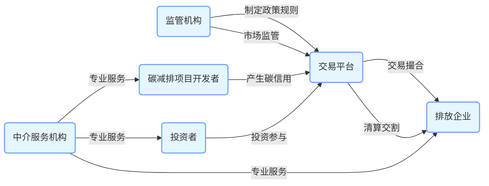

# 碳交易市场的发展与投资机会分析

> 关键词：碳交易市场、发展历程、投资机会、市场机制、风险管理

> 摘要：本文旨在深入分析碳交易市场的发展与投资机会。首先介绍了碳交易市场的背景，包括目的、预期读者、文档结构和相关术语。接着阐述了碳交易市场的核心概念、联系以及架构。详细讲解了核心算法原理和具体操作步骤，并给出了相应的 Python 代码。同时，通过数学模型和公式进一步剖析碳交易市场的运行机制。在项目实战部分，给出了开发环境搭建、源代码实现及代码解读。分析了碳交易市场的实际应用场景，推荐了相关的学习资源、开发工具框架和论文著作。最后总结了碳交易市场的未来发展趋势与挑战，提供了常见问题解答和扩展阅读参考资料，为投资者和相关从业者全面了解碳交易市场提供了有价值的参考。

## 1. 背景介绍 
### 1.1 目的和范围
碳交易市场作为应对气候变化、推动节能减排的重要市场机制，近年来受到了全球的广泛关注。本文的目的是全面深入地分析碳交易市场的发展历程、现状以及未来趋势，探讨其中蕴含的投资机会。研究范围涵盖了国内外主要的碳交易市场，包括欧盟排放交易体系（EU ETS）、中国全国碳市场等，分析其市场机制、交易规则、价格波动等方面的内容，同时对不同类型的投资机会进行评估和分析。

### 1.2 预期读者
本文预期读者主要包括对碳交易市场感兴趣的投资者，如个人投资者、机构投资者等；从事节能减排、环保相关产业的企业管理者和从业者，他们可以通过了解碳交易市场来优化企业的碳排放管理和运营策略；以及相关领域的研究人员和学者，为他们的学术研究提供参考和借鉴。

### 1.3 文档结构概述
本文将按照以下结构进行阐述：首先介绍碳交易市场的背景知识，包括目的、读者和文档结构等；接着深入讲解碳交易市场的核心概念、联系以及架构；详细分析核心算法原理和具体操作步骤，并给出 Python 代码示例；通过数学模型和公式进一步解释碳交易市场的运行机制；在项目实战部分，介绍开发环境搭建、源代码实现和代码解读；分析碳交易市场的实际应用场景；推荐相关的学习资源、开发工具框架和论文著作；最后总结碳交易市场的未来发展趋势与挑战，提供常见问题解答和扩展阅读参考资料。

### 1.4 术语表
#### 1.4.1 核心术语定义
- **碳交易**：是指将碳排放权作为一种商品，在市场上进行买卖的交易活动。企业或其他主体可以通过购买或出售碳排放权来达到减排或盈利的目的。
- **碳排放权**：是指企业或其他主体在一定时期内允许排放温室气体的数量权利。通常由政府或相关机构进行分配和管理。
- **碳配额**：是碳排放权的一种具体表现形式，是政府或相关机构分配给企业或其他主体的一定数量的碳排放指标。
- **碳减排项目**：是指通过采取各种措施减少温室气体排放的项目，如可再生能源项目、节能项目等。这些项目可以产生碳减排量，并通过一定的机制转化为可交易的碳信用。

#### 1.4.2 相关概念解释
- **碳足迹**：是指一个组织、产品或个人在生产、消费等活动过程中所产生的温室气体排放量的总和。它可以用来衡量一个主体对气候变化的影响程度。
- **碳汇**：是指通过植树造林、森林管理、植被恢复等措施，吸收和固定大气中的二氧化碳，从而减少大气中二氧化碳浓度的过程、活动或机制。碳汇可以与碳排放权进行交易，实现碳排放的抵消。
- **碳金融**：是指与碳交易相关的金融活动，包括碳期货、碳期权、碳基金等金融产品的开发和交易。碳金融可以为碳交易市场提供更多的融资渠道和风险管理工具。

#### 1.4.3 缩略词列表
- **EU ETS**：欧盟排放交易体系（European Union Emissions Trading System）
- **CDM**：清洁发展机制（Clean Development Mechanism）
- **VER**：自愿减排量（Voluntary Emission Reduction）
- **CCER**：中国核证自愿减排量（Chinese Certified Emission Reduction）

## 2. 核心概念与联系 

### 碳交易市场的核心概念原理
碳交易市场的核心原理是基于总量控制与交易（Cap-and-Trade）机制。政府或相关机构首先确定一定时期内的碳排放总量上限（Cap），然后将这个总量按照一定的规则分配给参与企业或其他主体，形成碳排放配额。企业在生产经营过程中，如果实际排放量低于分配的配额，就可以将剩余的配额在市场上出售，获得经济收益；反之，如果实际排放量超过了配额，就需要从市场上购买额外的配额，以满足减排要求。通过这种市场机制，激励企业采取节能减排措施，降低碳排放，从而实现整个社会的减排目标。

### 碳交易市场的架构
碳交易市场的架构主要包括以下几个部分：
1. **监管机构**：负责制定碳交易市场的政策、规则和标准，对市场进行监管和管理，确保市场的公平、公正、公开运行。例如，在中国，生态环境部是全国碳市场的监管机构。
2. **交易平台**：提供碳交易的场所和技术支持，负责交易的撮合、清算和交割等业务。国内外有多个专业的碳交易平台，如上海环境能源交易所是中国全国碳市场的交易平台。
3. **参与主体**：包括排放企业、碳减排项目开发者、投资者等。排放企业是碳交易市场的主要参与者，他们需要根据自身的碳排放情况进行配额的买卖；碳减排项目开发者通过开发碳减排项目，产生可交易的碳信用；投资者则通过参与碳交易市场，获取投资收益。
4. **中介服务机构**：如碳咨询公司、碳审计机构、碳金融机构等，为碳交易市场提供各种专业的服务，如碳排放核算、碳资产管理、碳金融产品设计等。

### 碳交易市场核心概念与架构的文本示意图
```plaintext
碳交易市场
|-- 监管机构
|   |-- 制定政策规则
|   |-- 市场监管
|-- 交易平台
|   |-- 交易撮合
|   |-- 清算交割
|-- 参与主体
|   |-- 排放企业
|   |   |-- 配额买卖
|   |-- 碳减排项目开发者
|   |   |-- 产生碳信用
|   |-- 投资者
|   |   |-- 投资收益
|-- 中介服务机构
|   |-- 碳咨询公司
|   |-- 碳审计机构
|   |-- 碳金融机构
```

### 碳交易市场核心概念与架构的 Mermaid 流程图


## 3. 核心算法原理 & 具体操作步骤 

### 碳配额分配算法原理
碳配额分配是碳交易市场的关键环节之一，常见的碳配额分配方法有免费分配和有偿分配两种。这里以免费分配中的历史排放法为例，介绍其算法原理。

历史排放法是根据企业过去一定时期内的实际碳排放量来分配碳配额。假设企业在过去 $n$ 年的碳排放量分别为 $E_1, E_2, \cdots, E_n$，则该企业的碳配额 $Q$ 可以通过以下公式计算：

$$Q = \alpha \times \frac{1}{n} \sum_{i = 1}^{n} E_i$$

其中，$\alpha$ 是一个调整系数，由政府或相关机构根据减排目标和市场情况进行确定。

### Python 代码实现
```python
def allocate_quota(historical_emissions, alpha):
    """
    计算企业的碳配额
    :param historical_emissions: 过去 n 年的碳排放量列表
    :param alpha: 调整系数
    :return: 碳配额
    """
    n = len(historical_emissions)
    average_emission = sum(historical_emissions) / n
    quota = alpha * average_emission
    return quota

# 示例数据
historical_emissions = [1000, 1200, 1100, 1300, 1400]
alpha = 0.9

# 计算碳配额
quota = allocate_quota(historical_emissions, alpha)
print(f"企业的碳配额为: {quota} 吨")
```

### 代码解释
上述代码定义了一个 `allocate_quota` 函数，用于计算企业的碳配额。函数接受两个参数：`historical_emissions` 是一个列表，包含企业过去 $n$ 年的碳排放量；`alpha` 是调整系数。函数内部首先计算过去 $n$ 年的平均碳排放量，然后乘以调整系数 $\alpha$，得到企业的碳配额。最后，通过示例数据调用该函数，并打印出计算结果。

### 碳交易价格预测算法原理
碳交易价格的预测对于投资者和企业来说都非常重要。这里以简单的线性回归模型为例，介绍碳交易价格预测的算法原理。

假设碳交易价格 $P$ 与一些影响因素 $X_1, X_2, \cdots, X_m$ 之间存在线性关系，可以用以下方程表示：

$$P = \beta_0 + \beta_1 X_1 + \beta_2 X_2 + \cdots + \beta_m X_m + \epsilon$$

其中，$\beta_0, \beta_1, \cdots, \beta_m$ 是回归系数，$\epsilon$ 是误差项。通过收集历史数据，使用最小二乘法可以估计出回归系数的值，从而建立碳交易价格预测模型。

### Python 代码实现
```python
import numpy as np
from sklearn.linear_model import LinearRegression

# 示例数据
# 假设影响因素有两个：GDP 增长率和能源价格
X = np.array([[0.05, 50], [0.06, 55], [0.04, 45], [0.07, 60], [0.05, 52]])
y = np.array([20, 22, 18, 25, 21])

# 创建线性回归模型
model = LinearRegression()

# 拟合模型
model.fit(X, y)

# 预测新数据
new_X = np.array([[0.06, 53]])
predicted_price = model.predict(new_X)

print(f"预测的碳交易价格为: {predicted_price[0]} 元/吨")
```

### 代码解释
上述代码使用 `sklearn` 库中的 `LinearRegression` 类实现了线性回归模型。首先，定义了示例数据 $X$ 和 $y$，其中 $X$ 是影响因素矩阵，$y$ 是碳交易价格向量。然后，创建了线性回归模型对象，并使用 `fit` 方法对模型进行拟合。最后，使用拟合好的模型对新数据进行预测，并打印出预测结果。

## 4. 数学模型和公式 & 详细讲解 & 举例说明 

### 碳交易市场的供需平衡模型
碳交易市场的供需平衡是决定碳交易价格的关键因素。假设市场上的碳配额供给量为 $S$，需求量为 $D$，碳交易价格为 $P$。碳配额供给量主要由政府分配的配额和碳减排项目产生的碳信用组成，需求量则来自于排放企业的减排需求。

碳配额供给函数可以表示为：

$$S = S_0 + \gamma P$$

其中，$S_0$ 是政府初始分配的配额总量，$\gamma$ 是供给价格弹性系数，表示碳交易价格每变化一个单位，碳配额供给量的变化量。

碳配额需求函数可以表示为：

$$D = D_0 - \delta P$$

其中，$D_0$ 是排放企业的初始减排需求总量，$\delta$ 是需求价格弹性系数，表示碳交易价格每变化一个单位，碳配额需求量的变化量。

当市场达到供需平衡时，$S = D$，即：

$$S_0 + \gamma P = D_0 - \delta P$$

解上述方程可以得到均衡碳交易价格 $P^*$：

$$P^* = \frac{D_0 - S_0}{\gamma + \delta}$$

### 举例说明
假设政府初始分配的配额总量 $S_0 = 1000$ 万吨，排放企业的初始减排需求总量 $D_0 = 1200$ 万吨，供给价格弹性系数 $\gamma = 10$，需求价格弹性系数 $\delta = 20$。则均衡碳交易价格为：

$$P^* = \frac{1200 - 1000}{10 + 20} = \frac{200}{30} \approx 6.67 \text{ 元/吨}$$

### 碳减排成本模型
企业进行碳减排需要付出一定的成本，碳减排成本模型可以帮助企业评估减排的经济效益。假设企业的初始碳排放量为 $E_0$，目标碳排放量为 $E_1$，减排成本函数可以表示为：

$$C = a (E_0 - E_1)^2 + b (E_0 - E_1)$$

其中，$a$ 和 $b$ 是成本系数，取决于企业的生产技术、减排措施等因素。

### 举例说明
假设企业的初始碳排放量 $E_0 = 100$ 吨，目标碳排放量 $E_1 = 80$ 吨，成本系数 $a = 0.5$，$b = 10$。则企业的碳减排成本为：

$$C = 0.5 \times (100 - 80)^2 + 10 \times (100 - 80) = 0.5 \times 400 + 10 \times 20 = 200 + 200 = 400 \text{ 元}$$

### 碳交易投资收益模型
投资者参与碳交易市场的目的是获取投资收益，碳交易投资收益模型可以帮助投资者评估投资的风险和回报。假设投资者在 $t_0$ 时刻以价格 $P_0$ 买入碳配额，在 $t_1$ 时刻以价格 $P_1$ 卖出碳配额，投资收益 $R$ 可以表示为：

$$R = (P_1 - P_0) \times Q - C_t$$

其中，$Q$ 是投资者买入的碳配额数量，$C_t$ 是交易成本，包括手续费、印花税等。

### 举例说明
假设投资者在 $t_0$ 时刻以价格 $P_0 = 10$ 元/吨买入 100 吨碳配额，在 $t_1$ 时刻以价格 $P_1 = 15$ 元/吨卖出，交易成本 $C_t = 50$ 元。则投资者的投资收益为：

$$R = (15 - 10) \times 100 - 50 = 500 - 50 = 450 \text{ 元}$$

## 5. 项目实战：代码实际案例和详细解释说明 

### 5.1  开发环境搭建
#### 硬件环境
- 操作系统：Windows 10、Linux（如 Ubuntu）或 macOS
- 处理器：Intel Core i5 及以上
- 内存：8GB 及以上
- 硬盘：至少 50GB 可用空间

#### 软件环境
- Python 3.7 及以上版本
- 开发工具：推荐使用 PyCharm 或 Jupyter Notebook
- 相关 Python 库：`numpy`、`pandas`、`scikit-learn`、`matplotlib` 等，可以使用以下命令进行安装：
```sh
pip install numpy pandas scikit-learn matplotlib
```

### 5.2  源代码详细实现和代码解读
#### 碳配额分配系统实现
```python
import pandas as pd

def load_historical_emissions(file_path):
    """
    加载企业历史碳排放数据
    :param file_path: 历史碳排放数据文件路径
    :return: 历史碳排放数据 DataFrame
    """
    data = pd.read_csv(file_path)
    return data

def calculate_quota(historical_emissions, alpha):
    """
    计算企业的碳配额
    :param historical_emissions: 历史碳排放数据 DataFrame
    :param alpha: 调整系数
    :return: 碳配额列表
    """
    quotas = []
    for index, row in historical_emissions.iterrows():
        emissions = row.drop('企业名称').values
        average_emission = emissions.mean()
        quota = alpha * average_emission
        quotas.append(quota)
    return quotas

def save_quota(quotas, historical_emissions, output_file):
    """
    将计算得到的碳配额保存到文件中
    :param quotas: 碳配额列表
    :param historical_emissions: 历史碳排放数据 DataFrame
    :param output_file: 输出文件路径
    """
    historical_emissions['碳配额'] = quotas
    historical_emissions.to_csv(output_file, index=False)

# 示例使用
file_path = 'historical_emissions.csv'
output_file = 'carbon_quotas.csv'
alpha = 0.9

# 加载历史碳排放数据
historical_emissions = load_historical_emissions(file_path)

# 计算碳配额
quotas = calculate_quota(historical_emissions, alpha)

# 保存碳配额
save_quota(quotas, historical_emissions, output_file)
```

#### 代码解读
- `load_historical_emissions` 函数：使用 `pandas` 库的 `read_csv` 函数加载企业历史碳排放数据文件，并返回一个 `DataFrame` 对象。
- `calculate_quota` 函数：遍历历史碳排放数据的每一行，计算每行的平均碳排放量，然后乘以调整系数 $\alpha$，得到企业的碳配额。最后将所有企业的碳配额存储在一个列表中返回。
- `save_quota` 函数：将计算得到的碳配额添加到历史碳排放数据的 `DataFrame` 中，并使用 `to_csv` 函数将结果保存到指定的文件中。

#### 碳交易价格预测系统实现
```python
import numpy as np
from sklearn.linear_model import LinearRegression
import pandas as pd

def load_data(file_path):
    """
    加载碳交易价格及影响因素数据
    :param file_path: 数据文件路径
    :return: 特征矩阵 X 和目标向量 y
    """
    data = pd.read_csv(file_path)
    X = data.drop('碳交易价格', axis=1).values
    y = data['碳交易价格'].values
    return X, y

def train_model(X, y):
    """
    训练线性回归模型
    :param X: 特征矩阵
    :param y: 目标向量
    :return: 训练好的模型
    """
    model = LinearRegression()
    model.fit(X, y)
    return model

def predict_price(model, new_X):
    """
    预测碳交易价格
    :param model: 训练好的模型
    :param new_X: 新的特征矩阵
    :return: 预测的碳交易价格
    """
    predicted_price = model.predict(new_X)
    return predicted_price

# 示例使用
file_path = 'carbon_trading_data.csv'
new_X = np.array([[0.06, 53]])

# 加载数据
X, y = load_data(file_path)

# 训练模型
model = train_model(X, y)

# 预测碳交易价格
predicted_price = predict_price(model, new_X)
print(f"预测的碳交易价格为: {predicted_price[0]} 元/吨")
```

#### 代码解读
- `load_data` 函数：使用 `pandas` 库的 `read_csv` 函数加载碳交易价格及影响因素数据文件，将特征矩阵 $X$ 和目标向量 $y$ 分离并返回。
- `train_model` 函数：创建线性回归模型对象，并使用 `fit` 方法对模型进行训练，返回训练好的模型。
- `predict_price` 函数：使用训练好的模型对新的特征矩阵进行预测，返回预测的碳交易价格。

### 5.3  代码解读与分析
#### 碳配额分配系统分析
- 该系统通过读取企业历史碳排放数据文件，计算每个企业的碳配额，并将结果保存到新的文件中。使用 `pandas` 库可以方便地处理和分析数据，提高代码的可读性和可维护性。
- 调整系数 $\alpha$ 可以根据实际情况进行调整，以实现不同的减排目标。
- 该系统可以进一步扩展，例如支持不同的配额分配方法，如基准线法、拍卖法等。

#### 碳交易价格预测系统分析
- 该系统使用线性回归模型对碳交易价格进行预测，通过读取历史数据文件进行模型训练，然后对新的数据进行预测。
- 线性回归模型是一种简单而有效的预测方法，但在实际应用中，可能需要考虑更多的影响因素和使用更复杂的模型，如神经网络、支持向量机等。
- 该系统可以结合实时数据进行实时预测，为投资者和企业提供更及时的决策支持。

## 6. 实际应用场景 
### 企业碳排放管理
企业可以通过参与碳交易市场，优化自身的碳排放管理策略。当企业的实际碳排放量低于分配的配额时，可以将剩余的配额出售，获得额外的经济收益；反之，当企业的实际碳排放量超过配额时，可以从市场上购买额外的配额，避免因违规排放而受到处罚。例如，一家能源企业通过采用节能减排技术，降低了自身的碳排放量，从而有多余的配额可以出售，增加了企业的利润。

### 碳减排项目投资
投资者可以通过投资碳减排项目，获得碳减排量并转化为可交易的碳信用。常见的碳减排项目包括可再生能源项目（如太阳能、风能发电项目）、节能项目（如建筑节能改造项目）等。这些项目不仅可以为投资者带来经济收益，还可以为社会做出节能减排的贡献。例如，某投资机构投资了一个太阳能发电项目，该项目产生的碳减排量可以在碳交易市场上出售，为投资机构带来可观的回报。

### 碳金融产品交易
碳金融产品的出现为碳交易市场提供了更多的投资和风险管理工具。常见的碳金融产品包括碳期货、碳期权、碳基金等。投资者可以通过交易这些金融产品，实现套期保值、投机获利等目的。例如，一家企业担心未来碳交易价格上涨，可以通过购买碳期货合约来锁定购买成本，降低价格波动风险。

### 政府政策制定
政府可以通过碳交易市场来实施节能减排政策，实现国家的减排目标。政府可以通过调整碳配额分配总量、设置碳交易价格上限和下限等方式，引导企业和投资者的行为，促进节能减排技术的推广和应用。例如，政府可以逐步减少碳配额的分配总量，提高企业的减排压力，推动企业采用更清洁的生产技术。

## 7. 工具和资源推荐
### 7.1 学习资源推荐
#### 7.1.1 书籍推荐
- 《碳交易原理与实践》：本书系统地介绍了碳交易的基本原理、市场机制、交易规则和实际操作案例，是一本全面了解碳交易市场的权威书籍。
- 《气候变化经济学》：从经济学的角度分析了气候变化问题以及碳交易市场的作用和意义，为读者提供了更深入的理论视角。
- 《碳金融：理论与实务》：详细介绍了碳金融的各种产品和业务，包括碳期货、碳期权、碳基金等，对于从事碳金融相关工作的人员具有很高的参考价值。

#### 7.1.2 在线课程
- Coursera 上的 “Climate Change Economics and Policy”：由知名高校教授授课，讲解了气候变化经济学的基本原理和政策工具，包括碳交易市场的设计和运行。
- edX 上的 “Carbon Markets and Climate Policy”：该课程深入介绍了碳交易市场的机制和实践，以及如何通过碳市场实现减排目标。
- 中国大学 MOOC 上的 “碳交易与低碳发展”：结合中国碳交易市场的实际情况，介绍了碳交易的相关知识和实践经验。

#### 7.1.3 技术博客和网站
- 中国碳交易网：提供了中国碳交易市场的最新动态、政策法规、交易数据等信息，是了解中国碳交易市场的重要平台。
- 国际排放交易协会（IETA）官网：发布了全球碳交易市场的最新研究报告、行业动态和政策解读，对于关注国际碳交易市场的人员具有很高的参考价值。
- 能源与环境经济研究所（EIEE）博客：分享了能源与环境经济领域的最新研究成果和观点，包括碳交易市场的相关内容。

### 7.2 开发工具框架推荐
#### 7.2.1 IDE和编辑器
- PyCharm：是一款专门为 Python 开发设计的集成开发环境，具有代码编辑、调试、版本控制等功能，适合开发碳交易相关的 Python 程序。
- Jupyter Notebook：是一个交互式的开发环境，支持 Python、R 等多种编程语言，适合进行数据探索、模型训练和可视化等工作。
- Visual Studio Code：是一款轻量级的代码编辑器，支持多种编程语言和插件扩展，具有丰富的代码编辑和调试功能。

#### 7.2.2 调试和性能分析工具
- PDB：是 Python 自带的调试工具，可以帮助开发者定位代码中的错误和问题。
- cProfile：是 Python 的性能分析工具，可以分析代码的运行时间和内存使用情况，帮助开发者优化代码性能。
- Py-Spy：是一个跨平台的 Python 性能分析工具，可以实时监测 Python 程序的运行状态和性能指标。

#### 7.2.3 相关框架和库
- `numpy`：是 Python 的数值计算库，提供了高效的数组操作和数学函数，适合进行碳交易数据的处理和分析。
- `pandas`：是 Python 的数据处理和分析库，提供了丰富的数据结构和数据操作方法，适合处理和分析碳交易市场的历史数据。
- `scikit-learn`：是 Python 的机器学习库，提供了各种机器学习算法和工具，适合进行碳交易价格预测、风险评估等任务。

### 7.3 相关论文著作推荐
#### 7.3.1 经典论文
- “The Problem of Social Cost” by Ronald H. Coase：该论文提出了著名的科斯定理，为碳交易市场的理论基础提供了重要的启示。
- “The Kyoto Protocol and Carbon Emissions Trading” by Richard S. J. Tol：该论文对《京都议定书》和碳交易市场进行了深入的分析和评价，是研究碳交易市场发展历程的经典文献。
- “Carbon Pricing and the Clean Development Mechanism” by Ottmar Edenhofer et al.：该论文探讨了碳定价和清洁发展机制的相关问题，对于理解碳交易市场的国际合作机制具有重要的意义。

#### 7.3.2 最新研究成果
- 近年来，关于碳交易市场的研究不断涌现，涉及碳交易市场的价格形成机制、市场效率、风险管理等多个方面。可以通过学术数据库（如 Web of Science、IEEE Xplore 等）搜索相关的最新研究论文。

#### 7.3.3 应用案例分析
- 一些国际组织和研究机构会发布碳交易市场的应用案例分析报告，如世界银行的《State and Trends of Carbon Pricing》报告，对全球碳交易市场的发展现状和应用案例进行了详细的分析和总结。

## 8. 总结：未来发展趋势与挑战
### 未来发展趋势
#### 市场规模扩大
随着全球对气候变化问题的关注度不断提高，越来越多的国家和地区将加入碳交易市场，碳交易市场的覆盖范围和交易规模将不断扩大。例如，中国全国碳市场在启动后，将逐步纳入更多的行业和企业，交易规模有望持续增长。

#### 交易品种多元化
除了传统的碳排放配额和碳信用交易外，未来碳交易市场的交易品种将更加多元化。碳期货、碳期权等金融衍生品的交易量将不断增加，同时还可能出现与碳相关的其他金融产品，如碳债券、碳保险等。

#### 国际合作加强
碳交易市场是一个全球性的市场，需要各国之间加强合作。未来，国际间的碳交易合作将更加紧密，例如建立跨国碳交易市场、开展碳减排项目的国际合作等。这将有助于提高全球碳减排的效率和效果。

#### 与其他政策协同发展
碳交易市场将与其他节能减排政策（如能源政策、产业政策等）协同发展，形成政策合力。政府将通过综合运用各种政策手段，推动企业和社会各界积极参与节能减排，实现经济社会的可持续发展。

### 挑战
#### 市场机制不完善
目前，碳交易市场的市场机制还存在一些不完善的地方，如碳配额分配不合理、市场流动性不足、价格波动较大等。这些问题需要通过不断完善市场规则和监管机制来解决。

#### 数据质量和监测问题
碳交易市场的有效运行依赖于准确的碳排放数据。然而，目前碳排放数据的质量和监测存在一定的问题，如数据不准确、监测手段落后等。这可能导致碳配额分配不合理和市场交易的不公平。

#### 技术创新压力
为了实现减排目标，企业需要不断采用新的节能减排技术。然而，技术创新需要大量的资金和人力投入，对于一些中小企业来说可能面临较大的压力。因此，需要政府和社会各界加大对节能减排技术创新的支持力度。

#### 国际竞争与合作的平衡
在国际碳交易市场中，各国之间既存在竞争关系，也需要加强合作。如何在国际竞争中保护本国企业的利益，同时又积极参与国际合作，是一个需要解决的难题。

## 9. 附录：常见问题与解答
### 1. 碳交易市场的参与者有哪些？
碳交易市场的参与者主要包括排放企业、碳减排项目开发者、投资者、中介服务机构等。排放企业是碳交易市场的主要参与者，他们需要根据自身的碳排放情况进行配额的买卖；碳减排项目开发者通过开发碳减排项目，产生可交易的碳信用；投资者则通过参与碳交易市场，获取投资收益；中介服务机构为碳交易市场提供各种专业的服务，如碳排放核算、碳资产管理、碳金融产品设计等。

### 2. 碳配额是如何分配的？
碳配额的分配方法主要有免费分配和有偿分配两种。免费分配方法包括历史排放法、基准线法等，根据企业过去的碳排放情况或行业基准线来分配配额；有偿分配方法主要是拍卖法，企业通过竞拍的方式获得配额。不同的国家和地区根据自身的情况选择不同的配额分配方法。

### 3. 碳交易价格是如何确定的？
碳交易价格是由市场供需关系决定的。当市场上的碳配额供给量大于需求量时，碳交易价格会下降；反之，当市场上的碳配额供给量小于需求量时，碳交易价格会上升。此外，碳交易价格还受到政策法规、经济形势、气候变化等因素的影响。

### 4. 参与碳交易市场有哪些风险？
参与碳交易市场的风险主要包括价格波动风险、政策风险、信用风险等。价格波动风险是指碳交易价格的不确定性可能导致投资者的投资损失；政策风险是指政府政策的变化可能对碳交易市场产生重大影响；信用风险是指交易对手可能无法履行合同义务的风险。投资者在参与碳交易市场时，需要充分了解这些风险，并采取相应的风险管理措施。

### 5. 如何参与碳交易市场？
企业要参与碳交易市场，首先需要向当地的碳交易主管部门进行碳排放报告和核查，确定自身的碳排放情况和配额。然后，可以通过碳交易平台进行配额的买卖。投资者要参与碳交易市场，可以通过开设碳交易账户，在碳交易平台上进行交易。不同的国家和地区的碳交易市场参与流程可能会有所不同，具体情况可以咨询当地的碳交易主管部门或相关机构。

## 10. 扩展阅读 & 参考资料
### 扩展阅读
- 《低碳经济：绿色革命与全球创新竞争大格局》
- 《可持续能源——选择的自由》
- 《能源转型：前景与挑战》

### 参考资料
- 中华人民共和国生态环境部官网
- 欧盟排放交易体系（EU ETS）官方网站
- 国际能源署（IEA）发布的相关报告
- 国内外权威学术期刊上发表的关于碳交易市场的研究论文

作者：AI天才研究院/AI Genius Institute & 禅与计算机程序设计艺术 /Zen And The Art of Computer Programming