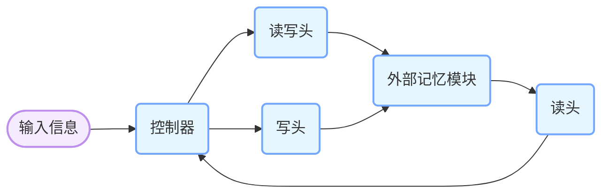

# 神经图灵机在程序化逻辑推理中的新突破

> 关键词：神经图灵机、程序化逻辑推理、深度学习、记忆增强、算法实现

> 摘要：本文深入探讨了神经图灵机在程序化逻辑推理领域的新突破。首先介绍了神经图灵机和程序化逻辑推理的背景知识，包括目的、预期读者、文档结构和相关术语。接着详细阐述了神经图灵机的核心概念、原理架构，通过 Python 代码展示了核心算法的实现步骤，并给出了相关数学模型和公式。在项目实战部分，搭建了开发环境，实现并解读了源代码。同时，分析了神经图灵机在实际应用场景中的表现，推荐了学习资源、开发工具框架以及相关论文著作。最后总结了神经图灵机在程序化逻辑推理方面的未来发展趋势与挑战，并解答了常见问题，提供了扩展阅读和参考资料。

## 1. 背景介绍 
### 1.1 目的和范围
神经图灵机（Neural Turing Machine, NTM）是一种结合了神经网络和图灵机思想的模型，旨在赋予神经网络外部记忆能力，使其能够处理更复杂的计算任务。程序化逻辑推理是指计算机根据一定的规则和程序进行逻辑判断和推理的过程。本文章的目的在于详细探讨神经图灵机在程序化逻辑推理中所取得的新突破，分析其原理、算法、应用等方面。范围涵盖了神经图灵机的基本概念、核心算法实现、数学模型分析、实际应用场景以及未来发展趋势等内容。

### 1.2 预期读者
本文预期读者包括对人工智能、深度学习、机器学习等领域感兴趣的研究人员、开发者和学生。对于希望深入了解神经图灵机及其在程序化逻辑推理中应用的专业人士，本文将提供系统而深入的知识和技术讲解。同时，对于有一定编程基础和数学知识的初学者，也可以通过本文逐步学习神经图灵机的相关原理和实现方法。

### 1.3 文档结构概述
本文首先介绍背景知识，为读者提供必要的基础信息。接着阐述神经图灵机的核心概念和联系，包括其原理和架构。然后详细讲解核心算法原理和具体操作步骤，并用 Python 代码进行实现。之后介绍相关的数学模型和公式，并举例说明。在项目实战部分，搭建开发环境，实现源代码并进行详细解读。随后分析神经图灵机在实际应用场景中的表现。再推荐学习资源、开发工具框架和相关论文著作。最后总结未来发展趋势与挑战，解答常见问题，并提供扩展阅读和参考资料。

### 1.4 术语表
#### 1.4.1 核心术语定义
- **神经图灵机（Neural Turing Machine, NTM）**：一种将神经网络与外部记忆模块相结合的计算模型，通过读写头对外部记忆进行操作，以增强神经网络的计算和记忆能力。
- **程序化逻辑推理**：计算机根据预先设定的规则和程序，对输入信息进行逻辑分析和推理，得出合理结论的过程。
- **读写头（Read/Write Head）**：神经图灵机中用于与外部记忆模块进行交互的组件，读头负责从记忆中读取信息，写头负责向记忆中写入信息。
- **外部记忆模块（External Memory）**：神经图灵机中的一个可读写的矩阵，用于存储和管理信息，为神经网络提供额外的记忆支持。

#### 1.4.2 相关概念解释
- **注意力机制（Attention Mechanism）**：在神经图灵机中，注意力机制用于控制读写头在外部记忆模块上的操作位置，使得模型能够聚焦于记忆中的特定部分。
- **梯度下降（Gradient Descent）**：一种优化算法，用于调整神经图灵机中的参数，使得模型的损失函数最小化。

#### 1.4.3 缩略词列表
- **NTM**：Neural Turing Machine（神经图灵机）
- **LSTM**：Long Short-Term Memory（长短期记忆网络）

## 2. 核心概念与联系 

### 核心概念原理
神经图灵机的核心思想是将传统神经网络与外部记忆模块相结合，模拟图灵机的计算过程。传统神经网络在处理长序列和复杂计算任务时存在一定的局限性，而神经图灵机通过引入外部记忆模块和读写头，使得网络能够动态地存储和访问信息，从而增强了其计算和推理能力。

神经图灵机主要由控制器（Controller）、外部记忆模块（External Memory）和读写头（Read/Write Head）组成。控制器通常是一个神经网络，如 LSTM，用于处理输入信息并生成控制信号。读写头根据控制器生成的控制信号对外部记忆模块进行读写操作。读头从记忆中读取信息并传递给控制器，写头根据控制器的指令向记忆中写入新的信息。

### 架构的文本示意图
```plaintext
输入信息 -> 控制器（如 LSTM）
控制器生成控制信号 -> 读写头
读头 -> 从外部记忆模块读取信息 -> 反馈给控制器
控制器 -> 处理信息并生成新的控制信号 -> 写头
写头 -> 根据控制信号向外部记忆模块写入信息
```

### Mermaid 流程图


## 3. 核心算法原理 & 具体操作步骤 

### 核心算法原理
神经图灵机的核心算法主要包括控制器的计算、读写头的操作和外部记忆模块的更新。

控制器接收输入信息，通过神经网络计算生成控制信号。这些控制信号包括读头和写头的位置、强度等信息，用于指导读写头对外部记忆模块的操作。

读头根据控制信号从外部记忆模块中读取信息。读头的操作可以看作是一个加权求和的过程，通过对记忆模块中每个位置的信息进行加权，得到读取的信息。

写头根据控制信号向外部记忆模块中写入信息。写头的操作包括擦除和写入两个步骤。首先，写头根据控制信号对记忆模块中特定位置的信息进行擦除；然后，将新的信息写入到相应位置。

### 具体操作步骤及 Python 代码实现

```python
import torch
import torch.nn as nn
import torch.nn.functional as F

# 定义控制器（这里使用简单的 LSTM 作为示例）
class Controller(nn.Module):
    def __init__(self, input_size, hidden_size):
        super(Controller, self).__init__()
        self.lstm = nn.LSTM(input_size, hidden_size)

    def forward(self, input):
        output, _ = self.lstm(input)
        return output

# 定义读头
class ReadHead(nn.Module):
    def __init__(self, hidden_size, memory_size, memory_length):
        super(ReadHead, self).__init__()
        self.key = nn.Linear(hidden_size, memory_size)
        self.strength = nn.Linear(hidden_size, 1)
        self.memory_size = memory_size
        self.memory_length = memory_length

    def forward(self, hidden, memory):
        key = self.key(hidden)
        strength = F.softplus(self.strength(hidden))
        # 计算相似度
        similarity = F.cosine_similarity(key.unsqueeze(1), memory, dim=2)
        # 计算注意力权重
        attention = F.softmax(strength * similarity, dim=1)
        # 读取信息
        read = torch.sum(attention.unsqueeze(2) * memory, dim=1)
        return read

# 定义写头
class WriteHead(nn.Module):
    def __init__(self, hidden_size, memory_size, memory_length):
        super(WriteHead, self).__init__()
        self.key = nn.Linear(hidden_size, memory_size)
        self.strength = nn.Linear(hidden_size, 1)
        self.erase = nn.Linear(hidden_size, memory_size)
        self.add = nn.Linear(hidden_size, memory_size)
        self.memory_size = memory_size
        self.memory_length = memory_length

    def forward(self, hidden, memory):
        key = self.key(hidden)
        strength = F.softplus(self.strength(hidden))
        erase = torch.sigmoid(self.erase(hidden))
        add = self.add(hidden)
        # 计算相似度
        similarity = F.cosine_similarity(key.unsqueeze(1), memory, dim=2)
        # 计算注意力权重
        attention = F.softmax(strength * similarity, dim=1)
        # 擦除操作
        erase_vector = 1 - attention.unsqueeze(2) * erase.unsqueeze(1)
        memory = memory * erase_vector
        # 写入操作
        add_vector = attention.unsqueeze(2) * add.unsqueeze(1)
        memory = memory + add_vector
        return memory

# 定义神经图灵机
class NeuralTuringMachine(nn.Module):
    def __init__(self, input_size, hidden_size, memory_size, memory_length):
        super(NeuralTuringMachine, self).__init__()
        self.controller = Controller(input_size, hidden_size)
        self.read_head = ReadHead(hidden_size, memory_size, memory_length)
        self.write_head = WriteHead(hidden_size, memory_size, memory_length)
        self.memory = torch.randn(memory_length, memory_size)

    def forward(self, input):
        hidden = self.controller(input)
        read = self.read_head(hidden, self.memory)
        self.memory = self.write_head(hidden, self.memory)
        return read

# 示例使用
input_size = 10
hidden_size = 20
memory_size = 15
memory_length = 30
ntm = NeuralTuringMachine(input_size, hidden_size, memory_size, memory_length)
input = torch.randn(1, 1, input_size)
output = ntm(input)
print(output.shape)
```

## 4. 数学模型和公式 & 详细讲解 & 举例说明 

### 读头操作
读头从外部记忆模块中读取信息的过程可以用以下数学公式表示：

设 $M_t$ 表示 $t$ 时刻的外部记忆模块，其大小为 $N \times M$，其中 $N$ 是记忆位置的数量，$M$ 是每个位置的信息维度。设 $k_t$ 是 $t$ 时刻读头生成的查询键，维度为 $M$。设 $\beta_t$ 是 $t$ 时刻读头的强度。

首先，计算查询键 $k_t$ 与记忆模块 $M_t$ 中每个位置的相似度：
$$
sim_{i,t} = \frac{k_t \cdot M_{i,t}}{\|k_t\| \|M_{i,t}\|}
$$
其中，$M_{i,t}$ 表示 $M_t$ 的第 $i$ 行。

然后，计算注意力权重：
$$
w_{i,t} = \frac{\exp(\beta_t sim_{i,t})}{\sum_{j=1}^{N} \exp(\beta_t sim_{j,t})}
$$

最后，读取信息：
$$
r_t = \sum_{i=1}^{N} w_{i,t} M_{i,t}
$$

### 写头操作
写头的操作包括擦除和写入两个步骤。

擦除操作：
设 $e_t$ 是 $t$ 时刻写头生成的擦除向量，维度为 $M$。则擦除后的记忆模块为：
$$
M_{i,t}^{erase} = M_{i,t} (1 - w_{i,t} e_t)
$$

写入操作：
设 $a_t$ 是 $t$ 时刻写头生成的添加向量，维度为 $M$。则写入后的记忆模块为：
$$
M_{i,t+1} = M_{i,t}^{erase} + w_{i,t} a_t
$$

### 举例说明
假设外部记忆模块 $M$ 是一个 $3 \times 2$ 的矩阵：
$$
M = \begin{bmatrix}
1 & 2 \\
3 & 4 \\
5 & 6
\end{bmatrix}
$$
查询键 $k = [1, 1]$，强度 $\beta = 1$。

首先，计算相似度：
$$
sim_1 = \frac{[1, 1] \cdot [1, 2]}{\sqrt{1^2 + 1^2} \sqrt{1^2 + 2^2}} = \frac{3}{\sqrt{2} \sqrt{5}} \approx 0.949
$$
$$
sim_2 = \frac{[1, 1] \cdot [3, 4]}{\sqrt{1^2 + 1^2} \sqrt{3^2 + 4^2}} = \frac{7}{\sqrt{2} \sqrt{25}} \approx 0.990
$$
$$
sim_3 = \frac{[1, 1] \cdot [5, 6]}{\sqrt{1^2 + 1^2} \sqrt{5^2 + 6^2}} = \frac{11}{\sqrt{2} \sqrt{61}} \approx 0.997
$$

然后，计算注意力权重：
$$
w_1 = \frac{\exp(0.949)}{\exp(0.949) + \exp(0.990) + \exp(0.997)} \approx 0.297
$$
$$
w_2 = \frac{\exp(0.990)}{\exp(0.949) + \exp(0.990) + \exp(0.997)} \approx 0.331
$$
$$
w_3 = \frac{\exp(0.997)}{\exp(0.949) + \exp(0.990) + \exp(0.997)} \approx 0.372
$$

最后，读取信息：
$$
r = 0.297 \begin{bmatrix} 1 \\ 2 \end{bmatrix} + 0.331 \begin{bmatrix} 3 \\ 4 \end{bmatrix} + 0.372 \begin{bmatrix} 5 \\ 6 \end{bmatrix} = \begin{bmatrix} 3.384 \\ 4.384 \end{bmatrix}
$$

## 5. 项目实战：代码实际案例和详细解释说明 

### 5.1  开发环境搭建
为了实现神经图灵机在程序化逻辑推理中的应用，我们需要搭建相应的开发环境。以下是具体步骤：

1. **安装 Python**：推荐使用 Python 3.7 及以上版本。可以从 Python 官方网站（https://www.python.org/downloads/）下载并安装。
2. **安装 PyTorch**：PyTorch 是一个常用的深度学习框架，我们可以使用它来实现神经图灵机。可以根据自己的系统和 CUDA 版本，从 PyTorch 官方网站（https://pytorch.org/get-started/locally/）选择合适的安装命令进行安装。例如，对于 CPU 版本的 PyTorch，可以使用以下命令：
```sh
pip install torch torchvision
```
3. **安装其他依赖库**：可能还需要安装一些其他的依赖库，如 NumPy、Matplotlib 等。可以使用以下命令进行安装：
```sh
pip install numpy matplotlib
```

### 5.2  源代码详细实现和代码解读
以下是一个完整的神经图灵机在程序化逻辑推理中的应用示例代码：

```python
import torch
import torch.nn as nn
import torch.nn.functional as F
import numpy as np

# 定义控制器（使用 LSTM）
class Controller(nn.Module):
    def __init__(self, input_size, hidden_size):
        super(Controller, self).__init__()
        self.lstm = nn.LSTM(input_size, hidden_size)

    def forward(self, input):
        output, _ = self.lstm(input)
        return output

# 定义读头
class ReadHead(nn.Module):
    def __init__(self, hidden_size, memory_size, memory_length):
        super(ReadHead, self).__init__()
        self.key = nn.Linear(hidden_size, memory_size)
        self.strength = nn.Linear(hidden_size, 1)
        self.memory_size = memory_size
        self.memory_length = memory_length

    def forward(self, hidden, memory):
        key = self.key(hidden)
        strength = F.softplus(self.strength(hidden))
        # 计算相似度
        similarity = F.cosine_similarity(key.unsqueeze(1), memory, dim=2)
        # 计算注意力权重
        attention = F.softmax(strength * similarity, dim=1)
        # 读取信息
        read = torch.sum(attention.unsqueeze(2) * memory, dim=1)
        return read

# 定义写头
class WriteHead(nn.Module):
    def __init__(self, hidden_size, memory_size, memory_length):
        super(WriteHead, self).__init__()
        self.key = nn.Linear(hidden_size, memory_size)
        self.strength = nn.Linear(hidden_size, 1)
        self.erase = nn.Linear(hidden_size, memory_size)
        self.add = nn.Linear(hidden_size, memory_size)
        self.memory_size = memory_size
        self.memory_length = memory_length

    def forward(self, hidden, memory):
        key = self.key(hidden)
        strength = F.softplus(self.strength(hidden))
        erase = torch.sigmoid(self.erase(hidden))
        add = self.add(hidden)
        # 计算相似度
        similarity = F.cosine_similarity(key.unsqueeze(1), memory, dim=2)
        # 计算注意力权重
        attention = F.softmax(strength * similarity, dim=1)
        # 擦除操作
        erase_vector = 1 - attention.unsqueeze(2) * erase.unsqueeze(1)
        memory = memory * erase_vector
        # 写入操作
        add_vector = attention.unsqueeze(2) * add.unsqueeze(1)
        memory = memory + add_vector
        return memory

# 定义神经图灵机
class NeuralTuringMachine(nn.Module):
    def __init__(self, input_size, hidden_size, memory_size, memory_length):
        super(NeuralTuringMachine, self).__init__()
        self.controller = Controller(input_size, hidden_size)
        self.read_head = ReadHead(hidden_size, memory_size, memory_length)
        self.write_head = WriteHead(hidden_size, memory_size, memory_length)
        self.memory = torch.randn(memory_length, memory_size)

    def forward(self, input):
        hidden = self.controller(input)
        read = self.read_head(hidden, self.memory)
        self.memory = self.write_head(hidden, self.memory)
        return read

# 定义一个简单的程序化逻辑推理任务：判断输入序列是否为递增序列
def generate_data(num_samples, sequence_length):
    data = []
    labels = []
    for _ in range(num_samples):
        sequence = np.random.randint(0, 10, sequence_length)
        is_increasing = np.all(sequence[1:] > sequence[:-1])
        data.append(sequence)
        labels.append(int(is_increasing))
    data = torch.tensor(data, dtype=torch.float32).unsqueeze(2)
    labels = torch.tensor(labels, dtype=torch.long)
    return data, labels

# 训练神经图灵机
input_size = 1
hidden_size = 20
memory_size = 15
memory_length = 30
ntm = NeuralTuringMachine(input_size, hidden_size, memory_size, memory_length)
criterion = nn.CrossEntropyLoss()
optimizer = torch.optim.Adam(ntm.parameters(), lr=0.001)

num_samples = 1000
sequence_length = 5
data, labels = generate_data(num_samples, sequence_length)

num_epochs = 100
for epoch in range(num_epochs):
    optimizer.zero_grad()
    outputs = ntm(data)
    # 简单地将读取的信息通过一个线性层得到分类结果
    classifier = nn.Linear(memory_size, 2)
    logits = classifier(outputs.squeeze(1))
    loss = criterion(logits, labels)
    loss.backward()
    optimizer.step()
    if (epoch + 1) % 10 == 0:
        print(f'Epoch [{epoch+1}/{num_epochs}], Loss: {loss.item():.4f}')
```

### 5.3  代码解读与分析
- **控制器（Controller）**：使用 LSTM 作为控制器，它接收输入信息并生成隐藏状态。LSTM 能够处理序列数据，适合用于程序化逻辑推理任务。
- **读头（ReadHead）**：根据控制器生成的隐藏状态，生成查询键和强度，计算注意力权重，从外部记忆模块中读取信息。
- **写头（WriteHead）**：同样根据控制器生成的隐藏状态，生成查询键、强度、擦除向量和添加向量，对外部记忆模块进行擦除和写入操作。
- **神经图灵机（NeuralTuringMachine）**：将控制器、读头和写头组合在一起，完成整个计算过程。
- **数据生成**：生成随机的序列数据，并判断序列是否为递增序列，作为分类任务的标签。
- **训练过程**：使用交叉熵损失函数和 Adam 优化器进行训练。将读取的信息通过一个线性层得到分类结果，计算损失并进行反向传播更新参数。

## 6. 实际应用场景 
神经图灵机在程序化逻辑推理中有许多实际应用场景，以下是一些常见的例子：

### 自然语言处理
- **问答系统**：神经图灵机可以用于处理复杂的自然语言问题，通过外部记忆模块存储相关的知识和信息，进行逻辑推理和回答。例如，在智能客服系统中，能够根据用户的问题，从记忆中查找相关的答案并进行推理和组合，提供准确的回答。
- **文本生成**：在文本生成任务中，神经图灵机可以根据输入的上下文信息，结合外部记忆中的知识，生成更连贯、有逻辑的文本。例如，在故事生成、诗歌创作等任务中，能够利用记忆中的情节、词汇等信息进行创作。

### 机器人控制
- **路径规划**：机器人在复杂环境中进行路径规划时，需要考虑各种因素，如障碍物、目标位置等。神经图灵机可以将环境信息存储在外部记忆模块中，通过逻辑推理计算出最优的路径。
- **任务决策**：机器人在执行任务时，需要根据不同的情况做出决策。神经图灵机可以根据当前的任务状态和记忆中的经验，进行逻辑推理，选择最合适的行动方案。

### 金融领域
- **风险评估**：在金融风险评估中，需要考虑多个因素，如市场数据、企业财务状况等。神经图灵机可以将这些信息存储在外部记忆模块中，通过逻辑推理对风险进行评估和预测。
- **投资决策**：投资者在做出投资决策时，需要分析大量的市场信息和数据。神经图灵机可以帮助投资者进行逻辑推理，根据记忆中的历史数据和当前市场情况，提供投资建议。

## 7. 工具和资源推荐
### 7.1 学习资源推荐
#### 7.1.1 书籍推荐
- 《深度学习》（Deep Learning）：由 Ian Goodfellow、Yoshua Bengio 和 Aaron Courville 编写，是深度学习领域的经典教材，涵盖了神经网络、优化算法等基础知识，对理解神经图灵机有很大帮助。
- 《Python 深度学习》（Deep Learning with Python）：由 Francois Chollet 编写，介绍了如何使用 Python 和 Keras 进行深度学习开发，包含了许多实际案例，适合初学者入门。

#### 7.1.2 在线课程
- Coursera 上的《深度学习专项课程》（Deep Learning Specialization）：由 Andrew Ng 教授授课，系统地介绍了深度学习的各个方面，包括神经网络、卷积神经网络、循环神经网络等。
- edX 上的《强化学习》（Reinforcement Learning）：介绍了强化学习的基本概念和算法，对于理解神经图灵机在决策和控制任务中的应用有很大帮助。

#### 7.1.3 技术博客和网站
- Medium 上的 Towards Data Science：有许多关于深度学习、人工智能的技术文章和教程，涵盖了神经图灵机等前沿技术。
- arXiv.org：是一个预印本平台，提供了大量的学术论文，包括神经图灵机的最新研究成果。

### 7.2 开发工具框架推荐
#### 7.2.1 IDE和编辑器
- PyCharm：是一款专门为 Python 开发设计的集成开发环境，具有代码编辑、调试、版本控制等功能，适合开发神经图灵机相关项目。
- Jupyter Notebook：是一个交互式的开发环境，可以实时运行代码、展示结果，方便进行实验和调试。

#### 7.2.2 调试和性能分析工具
- TensorBoard：是 TensorFlow 提供的一个可视化工具，可以用于可视化模型的训练过程、损失函数的变化等，帮助调试和优化模型。
- PyTorch Profiler：是 PyTorch 提供的性能分析工具，可以分析模型的运行时间、内存使用等情况，帮助优化模型性能。

#### 7.2.3 相关框架和库
- PyTorch：是一个开源的深度学习框架，提供了丰富的神经网络层和优化算法，方便实现神经图灵机。
- NumPy：是 Python 中常用的科学计算库，提供了高效的数组操作和数学函数，在处理神经图灵机的数据时非常有用。

### 7.3 相关论文著作推荐
#### 7.3.1 经典论文
- 《Neural Turing Machines》：由 Alex Graves、Greg Wayne 和 Ivo Danihelka 发表，首次提出了神经图灵机的概念，详细介绍了其原理和实现方法。
- 《Show, Attend and Tell: Neural Image Caption Generation with Visual Attention》：介绍了注意力机制在图像描述生成任务中的应用，对理解神经图灵机中的注意力机制有很大帮助。

#### 7.3.2 最新研究成果
- 可以在 arXiv.org 上搜索关于神经图灵机的最新研究论文，了解该领域的最新进展和技术创新。

#### 7.3.3 应用案例分析
- 在一些学术会议的论文集和期刊上，可以找到神经图灵机在不同领域的应用案例分析，如自然语言处理、机器人控制等。

## 8. 总结：未来发展趋势与挑战
### 未来发展趋势
- **更强大的记忆和推理能力**：未来的神经图灵机可能会进一步增强外部记忆模块的容量和管理能力，提高逻辑推理的准确性和效率。例如，引入更复杂的记忆结构和注意力机制，使得模型能够更好地处理长序列和复杂的推理任务。
- **与其他技术的融合**：神经图灵机可能会与强化学习、迁移学习等其他技术相结合，拓展其应用范围和能力。例如，在机器人控制中，将神经图灵机与强化学习相结合，使机器人能够更好地适应不同的环境和任务。
- **跨领域应用**：随着神经图灵机技术的不断发展，它可能会在更多的领域得到应用，如医疗、教育、交通等。例如，在医疗领域，用于疾病诊断和治疗方案的推荐。

### 挑战
- **计算资源需求**：神经图灵机的训练和推理过程通常需要大量的计算资源，特别是在处理大规模数据和复杂任务时。如何降低计算资源的需求，提高模型的训练和推理效率，是一个亟待解决的问题。
- **可解释性**：神经图灵机作为一种深度学习模型，其决策过程往往缺乏可解释性。在一些对安全性和可靠性要求较高的领域，如医疗、金融等，模型的可解释性是一个重要的问题。如何提高神经图灵机的可解释性，是未来研究的一个方向。
- **数据质量和标注**：神经图灵机的性能很大程度上依赖于训练数据的质量和标注。在实际应用中，获取高质量的数据和准确的标注往往是一个挑战。如何解决数据质量和标注问题，提高模型的泛化能力，是需要研究的问题。

## 9. 附录：常见问题与解答
### 问题 1：神经图灵机与传统神经网络有什么区别？
传统神经网络在处理长序列和复杂计算任务时存在一定的局限性，缺乏外部记忆能力。而神经图灵机通过引入外部记忆模块和读写头，使得网络能够动态地存储和访问信息，从而增强了其计算和推理能力。

### 问题 2：神经图灵机的训练过程复杂吗？
神经图灵机的训练过程相对复杂，因为它涉及到多个组件的协同工作，如控制器、读写头和外部记忆模块。训练过程需要调整多个参数，并且可能需要大量的计算资源和时间。

### 问题 3：神经图灵机在实际应用中效果如何？
神经图灵机在一些需要逻辑推理和长期记忆的任务中表现出了较好的效果，如自然语言处理、机器人控制等。但在实际应用中，还需要根据具体任务进行调整和优化，以达到最佳性能。

### 问题 4：如何选择神经图灵机的超参数？
选择神经图灵机的超参数需要进行实验和调优。常见的超参数包括控制器的隐藏层大小、外部记忆模块的大小、学习率等。可以使用网格搜索、随机搜索等方法来寻找最优的超参数组合。

## 10. 扩展阅读 & 参考资料
- Graves, A., Wayne, G., & Danihelka, I. (2014). Neural Turing Machines. arXiv preprint arXiv:1410.5401.
- Chollet, F. (2017). Deep Learning with Python. Manning Publications.
- Goodfellow, I., Bengio, Y., & Courville, A. (2016). Deep Learning. MIT Press.
- Coursera. Deep Learning Specialization. https://www.coursera.org/specializations/deep-learning
- edX. Reinforcement Learning. https://www.edx.org/course/reinforcement-learning

作者：AI天才研究院/AI Genius Institute & 禅与计算机程序设计艺术 /Zen And The Art of Computer Programming