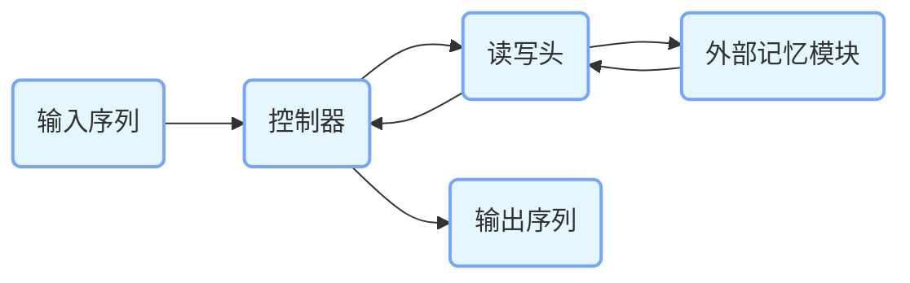

# 神经图灵机在程序化逻辑推理中的新突破应用研究

> 关键词：神经图灵机、程序化逻辑推理、深度学习、记忆机制、新突破应用

> 摘要：本文聚焦于神经图灵机在程序化逻辑推理中的新突破应用。首先介绍了研究的背景、目的、预期读者等信息，阐述了神经图灵机及程序化逻辑推理的核心概念与联系，并给出相应的原理和架构示意图以及流程图。详细讲解了神经图灵机的核心算法原理，使用 Python 代码进行阐述，同时给出了相关的数学模型和公式。通过项目实战，展示了神经图灵机在程序化逻辑推理中的代码实现和详细解读。分析了其实际应用场景，推荐了相关的学习资源、开发工具框架和论文著作。最后总结了神经图灵机在该领域的未来发展趋势与挑战，并对常见问题进行了解答，提供了扩展阅读和参考资料。

## 1. 背景介绍 
### 1.1 目的和范围
近年来，随着人工智能技术的飞速发展，逻辑推理能力成为了衡量智能系统性能的重要指标之一。程序化逻辑推理涉及到对规则、条件和步骤的精确处理，在许多领域如自动化规划、智能决策、自然语言处理等都有着广泛的应用。传统的深度学习模型在处理序列数据和模式识别方面取得了显著的成果，但在逻辑推理能力上存在一定的局限性。神经图灵机（Neural Turing Machine, NTM）作为一种新型的深度学习模型，结合了神经网络的强大学习能力和图灵机的计算能力，为解决程序化逻辑推理问题提供了新的思路。

本研究的目的在于深入探讨神经图灵机在程序化逻辑推理中的新突破应用，分析其原理、算法和实际应用效果，为相关领域的研究和实践提供理论支持和技术参考。研究范围主要包括神经图灵机的核心概念、算法原理、数学模型，以及在具体项目中的实现和应用场景分析。

### 1.2 预期读者
本文的预期读者主要包括人工智能领域的研究人员、工程师、程序员，以及对深度学习、逻辑推理等相关技术感兴趣的学生和爱好者。对于希望了解神经图灵机在程序化逻辑推理中的应用原理和方法，以及如何将其应用到实际项目中的读者，本文将提供有价值的信息和指导。

### 1.3 文档结构概述
本文将按照以下结构进行组织：
- 核心概念与联系：介绍神经图灵机和程序化逻辑推理的核心概念，以及它们之间的联系，同时给出原理和架构的文本示意图和 Mermaid 流程图。
- 核心算法原理 & 具体操作步骤：详细讲解神经图灵机的核心算法原理，并使用 Python 源代码进行阐述。
- 数学模型和公式 & 详细讲解 & 举例说明：给出神经图灵机的数学模型和公式，并进行详细讲解和举例说明。
- 项目实战：代码实际案例和详细解释说明：通过一个具体的项目实战，展示神经图灵机在程序化逻辑推理中的代码实现和详细解读。
- 实际应用场景：分析神经图灵机在程序化逻辑推理中的实际应用场景。
- 工具和资源推荐：推荐相关的学习资源、开发工具框架和论文著作。
- 总结：未来发展趋势与挑战：总结神经图灵机在程序化逻辑推理中的未来发展趋势与挑战。
- 附录：常见问题与解答：解答读者在阅读过程中可能遇到的常见问题。
- 扩展阅读 & 参考资料：提供相关的扩展阅读和参考资料。

### 1.4 术语表
#### 1.4.1 核心术语定义
- **神经图灵机（Neural Turing Machine, NTM）**：一种结合了神经网络和图灵机概念的深度学习模型，具有可微分的外部记忆模块，能够模拟图灵机的读写操作，从而实现更强大的计算和推理能力。
- **程序化逻辑推理**：根据一定的规则、条件和步骤，对信息进行处理和推导，以得出合理结论的过程。在计算机科学中，程序化逻辑推理通常通过编写程序来实现。
- **深度学习**：一种基于人工神经网络的机器学习方法，通过构建多层神经网络来自动学习数据的特征和模式，在图像识别、自然语言处理等领域取得了显著的成果。
- **外部记忆模块**：神经图灵机中的一个重要组成部分，用于存储和读取信息，类似于图灵机的磁带。
- **读写头**：神经图灵机中用于对外部记忆模块进行读写操作的组件，通过注意力机制来选择要读写的位置。

#### 1.4.2 相关概念解释
- **注意力机制**：一种在深度学习中广泛应用的技术，用于动态地选择输入数据的重要部分。在神经图灵机中，注意力机制用于控制读写头在外部记忆模块上的位置。
- **可微分操作**：在深度学习中，可微分操作是指可以通过反向传播算法进行梯度计算的操作。神经图灵机的读写操作都是可微分的，因此可以使用梯度下降等优化算法进行训练。
- **图灵机**：一种抽象的计算模型，由艾伦·图灵在 1936 年提出。图灵机由一个无限长的磁带、一个读写头和一个控制单元组成，能够模拟任何可计算的算法。

#### 1.4.3 缩略词列表
- **NTM**：Neural Turing Machine（神经图灵机）
- **LSTM**：Long Short-Term Memory（长短期记忆网络）
- **RNN**：Recurrent Neural Network（循环神经网络）

## 2. 核心概念与联系 
### 核心概念原理
#### 神经图灵机
神经图灵机是一种具有外部记忆模块的深度学习模型，其核心思想是将神经网络的学习能力与图灵机的计算能力相结合。神经图灵机主要由控制器、外部记忆模块和读写头三部分组成。

控制器通常是一个循环神经网络（如 LSTM 或 GRU），用于处理输入序列并生成读写头的控制信号。外部记忆模块是一个二维矩阵，用于存储信息，类似于图灵机的磁带。读写头通过注意力机制在外部记忆模块上进行读写操作，从而实现信息的存储和读取。

神经图灵机的工作流程如下：
1. 控制器接收输入序列，并生成读写头的控制信号。
2. 读写头根据控制信号在外部记忆模块上进行读写操作。
3. 控制器根据读写头的操作结果更新自身的状态，并生成输出序列。

#### 程序化逻辑推理
程序化逻辑推理是指根据一定的规则、条件和步骤，对信息进行处理和推导，以得出合理结论的过程。在计算机科学中，程序化逻辑推理通常通过编写程序来实现。

程序化逻辑推理的核心是逻辑规则和推理算法。逻辑规则是指描述问题的前提条件和结论之间的逻辑关系的规则，如“如果 A 成立，则 B 成立”。推理算法是指根据逻辑规则对信息进行处理和推导的算法，如演绎推理、归纳推理等。

### 架构的文本示意图
```plaintext
+-----------------+           +-----------------+           +-----------------+
|     控制器      | <-------> |     读写头      | <-------> |   外部记忆模块  |
+-----------------+           +-----------------+           +-----------------+
        ^                                                   ^
        |                                                   |
        |                                                   |
+-----------------+                                       +-----------------+
|    输入序列     |                                       |    输出序列     |
+-----------------+                                       +-----------------+
```

### Mermaid 流程图


### 核心概念的联系
神经图灵机的外部记忆模块和读写操作能力为程序化逻辑推理提供了强大的支持。通过外部记忆模块，神经图灵机可以存储和读取中间推理结果，从而实现复杂的逻辑推理过程。读写头的注意力机制可以动态地选择要读写的位置，使得神经图灵机能够根据不同的推理任务灵活地使用外部记忆。

同时，程序化逻辑推理的规则和算法可以作为神经图灵机的训练目标，通过训练神经图灵机来学习如何根据输入信息进行逻辑推理。神经图灵机的控制器可以学习到如何生成合理的读写头控制信号，从而实现有效的逻辑推理。

## 3. 核心算法原理 & 具体操作步骤 
### 核心算法原理
神经图灵机的核心算法主要包括控制器的计算、读写头的操作和外部记忆模块的更新。下面我们将详细介绍这些步骤，并使用 Python 代码进行阐述。

#### 控制器
控制器通常是一个循环神经网络，如 LSTM 或 GRU。控制器接收输入序列 $x_t$ 和上一时刻的隐藏状态 $h_{t-1}$，并输出当前时刻的隐藏状态 $h_t$ 和读写头的控制信号。

```python
import torch
import torch.nn as nn

class Controller(nn.Module):
    def __init__(self, input_size, hidden_size):
        super(Controller, self).__init__()
        self.lstm = nn.LSTM(input_size, hidden_size)

    def forward(self, x, h_prev):
        output, h = self.lstm(x.unsqueeze(0), h_prev)
        return output.squeeze(0), h
```

#### 读写头
读写头负责对外部记忆模块进行读写操作。读写头的操作主要包括寻址和读写两个步骤。

##### 寻址
寻址是指确定读写头在外部记忆模块上的位置。神经图灵机使用注意力机制来实现寻址，具体方法是计算每个位置的注意力权重，然后根据权重对外部记忆模块进行加权求和。

```python
import torch.nn.functional as F

def address_memory(weights_prev, key, beta, g, s, gamma, memory):
    # 内容寻址
    similarity = F.cosine_similarity(memory, key.unsqueeze(1), dim=2)
    content_weights = F.softmax(beta * similarity, dim=1)

    # 插值
    gated_weights = g * content_weights + (1 - g) * weights_prev

    # 卷积移位
    s = s.unsqueeze(0).unsqueeze(0)
    weights_shifted = F.conv1d(gated_weights.unsqueeze(0), s, padding=1).squeeze(0)

    # 锐化
    weights = weights_shifted ** gamma
    weights = weights / torch.sum(weights, dim=1, keepdim=True)

    return weights
```

##### 读写操作
读写操作是指根据寻址得到的权重对外部记忆模块进行读写。

```python
def read_memory(weights, memory):
    return torch.sum(weights.unsqueeze(2) * memory, dim=1)

def write_memory(weights, memory, add_vector, erase_vector):
    erase = 1 - weights.unsqueeze(2) * erase_vector.unsqueeze(1)
    add = weights.unsqueeze(2) * add_vector.unsqueeze(1)
    memory = memory * erase + add
    return memory
```

#### 外部记忆模块的更新
外部记忆模块的更新是指根据读写头的操作结果对外部记忆模块进行更新。

```python
class NeuralTuringMachine(nn.Module):
    def __init__(self, input_size, hidden_size, memory_size, memory_dim):
        super(NeuralTuringMachine, self).__init__()
        self.controller = Controller(input_size, hidden_size)
        self.memory = torch.randn(memory_size, memory_dim)
        self.weights_read = torch.zeros(memory_size)
        self.weights_write = torch.zeros(memory_size)

    def forward(self, x):
        # 控制器计算
        output, h = self.controller(x, (self.hidden_state, self.cell_state))

        # 读写头控制信号生成
        key_read = output[:, :self.memory_dim]
        beta_read = F.softplus(output[:, self.memory_dim:self.memory_dim + 1])
        g_read = torch.sigmoid(output[:, self.memory_dim + 1:self.memory_dim + 2])
        s_read = F.softmax(output[:, self.memory_dim + 2:self.memory_dim + 5], dim=1)
        gamma_read = 1 + F.softplus(output[:, self.memory_dim + 5:self.memory_dim + 6])

        key_write = output[:, self.memory_dim + 6:self.memory_dim * 2 + 6]
        beta_write = F.softplus(output[:, self.memory_dim * 2 + 6:self.memory_dim * 2 + 7])
        g_write = torch.sigmoid(output[:, self.memory_dim * 2 + 7:self.memory_dim * 2 + 8])
        s_write = F.softmax(output[:, self.memory_dim * 2 + 8:self.memory_dim * 2 + 11], dim=1)
        gamma_write = 1 + F.softplus(output[:, self.memory_dim * 2 + 11:self.memory_dim * 2 + 12])

        add_vector = output[:, self.memory_dim * 2 + 12:self.memory_dim * 3 + 12]
        erase_vector = torch.sigmoid(output[:, self.memory_dim * 3 + 12:self.memory_dim * 4 + 12])

        # 寻址
        self.weights_read = address_memory(self.weights_read, key_read, beta_read, g_read, s_read, gamma_read, self.memory)
        self.weights_write = address_memory(self.weights_write, key_write, beta_write, g_write, s_write, gamma_write, self.memory)

        # 读写操作
        read_vector = read_memory(self.weights_read, self.memory)
        self.memory = write_memory(self.weights_write, self.memory, add_vector, erase_vector)

        return read_vector
```

### 具体操作步骤
1. **初始化**：初始化控制器、外部记忆模块和读写头的权重。
2. **输入处理**：将输入序列输入到控制器中，计算当前时刻的隐藏状态和读写头的控制信号。
3. **寻址**：根据读写头的控制信号，使用注意力机制确定读写头在外部记忆模块上的位置。
4. **读写操作**：根据寻址得到的权重，对外部记忆模块进行读写操作。
5. **更新**：根据读写操作的结果，更新外部记忆模块和读写头的权重。
6. **输出**：将读取到的向量作为输出。

## 4. 数学模型和公式 & 详细讲解 & 举例说明 
### 数学模型和公式
#### 控制器
控制器通常是一个循环神经网络，如 LSTM。LSTM 的数学模型可以表示为：

$$
\begin{aligned}
i_t &= \sigma(W_{ii}x_t + W_{hi}h_{t-1} + b_i) \\
f_t &= \sigma(W_{if}x_t + W_{hf}h_{t-1} + b_f) \\
o_t &= \sigma(W_{io}x_t + W_{ho}h_{t-1} + b_o) \\
g_t &= \tanh(W_{ig}x_t + W_{hg}h_{t-1} + b_g) \\
c_t &= f_t \odot c_{t-1} + i_t \odot g_t \\
h_t &= o_t \odot \tanh(c_t)
\end{aligned}
$$

其中，$i_t$、$f_t$、$o_t$ 分别是输入门、遗忘门和输出门，$g_t$ 是候选记忆单元，$c_t$ 是细胞状态，$h_t$ 是隐藏状态，$\sigma$ 是 sigmoid 函数，$\odot$ 是逐元素相乘。

#### 寻址
寻址的数学模型可以表示为：

##### 内容寻址
$$
w_t^c(i) = \frac{\exp(\beta_t K(M_t(i), k_t))}{\sum_{j=1}^N \exp(\beta_t K(M_t(j), k_t))}
$$

其中，$w_t^c(i)$ 是第 $i$ 个位置的内容寻址权重，$\beta_t$ 是内容寻址的强度，$K$ 是相似度函数（通常使用余弦相似度），$M_t(i)$ 是第 $t$ 时刻外部记忆模块的第 $i$ 行，$k_t$ 是第 $t$ 时刻的查询键。

##### 插值
$$
\tilde{w}_t(i) = g_t w_t^c(i) + (1 - g_t) w_{t-1}(i)
$$

其中，$\tilde{w}_t(i)$ 是插值后的权重，$g_t$ 是插值门控信号，$w_{t-1}(i)$ 是上一时刻的权重。

##### 卷积移位
$$
w_t'(i) = \sum_{j=-1}^1 s_t(j) \tilde{w}_t((i - j) \bmod N)
$$

其中，$w_t'(i)$ 是卷积移位后的权重，$s_t(j)$ 是卷积移位核，$N$ 是外部记忆模块的行数。

##### 锐化
$$
w_t(i) = \frac{w_t'(i)^{\gamma_t}}{\sum_{j=1}^N w_t'(j)^{\gamma_t}}
$$

其中，$w_t(i)$ 是最终的寻址权重，$\gamma_t$ 是锐化因子。

#### 读写操作
##### 读取操作
$$
r_t = \sum_{i=1}^N w_t^r(i) M_t(i)
$$

其中，$r_t$ 是第 $t$ 时刻读取的向量，$w_t^r(i)$ 是第 $t$ 时刻读取头的寻址权重。

##### 写入操作
$$
M_t(i) = M_{t-1}(i) \odot (1 - w_t^w(i) \odot e_t) + w_t^w(i) \odot a_t
$$

其中，$M_t(i)$ 是第 $t$ 时刻外部记忆模块的第 $i$ 行，$w_t^w(i)$ 是第 $t$ 时刻写入头的寻址权重，$e_t$ 是擦除向量，$a_t$ 是添加向量。

### 详细讲解
#### 控制器
控制器的作用是处理输入序列并生成读写头的控制信号。LSTM 网络通过输入门、遗忘门和输出门来控制信息的流动，从而有效地处理长序列数据。输入门决定了当前输入信息的哪些部分将被添加到细胞状态中，遗忘门决定了上一时刻细胞状态的哪些部分将被遗忘，输出门决定了当前细胞状态的哪些部分将被输出到隐藏状态中。

#### 寻址
寻址是神经图灵机的核心操作之一，它通过注意力机制来确定读写头在外部记忆模块上的位置。内容寻址根据查询键和外部记忆模块的相似度来计算每个位置的权重，插值操作将内容寻址权重和上一时刻的权重进行插值，卷积移位操作对插值后的权重进行卷积移位，锐化操作对卷积移位后的权重进行锐化，从而得到最终的寻址权重。

#### 读写操作
读取操作根据读取头的寻址权重对外部记忆模块进行加权求和，得到读取的向量。写入操作根据写入头的寻址权重对外部记忆模块进行擦除和添加操作，从而更新外部记忆模块的内容。

### 举例说明
假设我们有一个外部记忆模块 $M$，其大小为 $N \times D$，其中 $N = 3$，$D = 2$，初始状态如下：

$$
M = \begin{bmatrix}
1 & 2 \\
3 & 4 \\
5 & 6
\end{bmatrix}
$$

读取头的寻址权重 $w^r$ 为：

$$
w^r = \begin{bmatrix}
0.2 \\
0.3 \\
0.5
\end{bmatrix}
$$

则读取的向量 $r$ 为：

$$
r = 0.2 \times \begin{bmatrix}
1 \\
2
\end{bmatrix} + 0.3 \times \begin{bmatrix}
3 \\
4
\end{bmatrix} + 0.5 \times \begin{bmatrix}
5 \\
6
\end{bmatrix} = \begin{bmatrix}
3.6 \\
4.8
\end{bmatrix}
$$

假设写入头的寻址权重 $w^w$ 为：

$$
w^w = \begin{bmatrix}
0.1 \\
0.6 \\
0.3
\end{bmatrix}
$$

擦除向量 $e$ 为：

$$
e = \begin{bmatrix}
0.2 \\
0.3
\end{bmatrix}
$$

添加向量 $a$ 为：

$$
a = \begin{bmatrix}
0.5 \\
0.6
\end{bmatrix}
$$

则更新后的外部记忆模块 $M'$ 为：

$$
M'_{1} = \begin{bmatrix}
1 \\
2
\end{bmatrix} \odot (1 - 0.1 \times \begin{bmatrix}
0.2 \\
0.3
\end{bmatrix}) + 0.1 \times \begin{bmatrix}
0.5 \\
0.6
\end{bmatrix} = \begin{bmatrix}
0.982 \\
1.973
\end{bmatrix}
$$

$$
M'_{2} = \begin{bmatrix}
3 \\
4
\end{bmatrix} \odot (1 - 0.6 \times \begin{bmatrix}
0.2 \\
0.3
\end{bmatrix}) + 0.6 \times \begin{bmatrix}
0.5 \\
0.6
\end{bmatrix} = \begin{bmatrix}
2.76 \\
3.72
\end{bmatrix}
$$

$$
M'_{3} = \begin{bmatrix}
5 \\
6
\end{bmatrix} \odot (1 - 0.3 \times \begin{bmatrix}
0.2 \\
0.3
\end{bmatrix}) + 0.3 \times \begin{bmatrix}
0.5 \\
0.6
\end{bmatrix} = \begin{bmatrix}
4.83 \\
5.82
\end{bmatrix}
$$

$$
M' = \begin{bmatrix}
0.982 & 1.973 \\
2.76 & 3.72 \\
4.83 & 5.82
\end{bmatrix}
$$

## 5. 项目实战：代码实际案例和详细解释说明 
### 5.1  开发环境搭建
#### 安装 Python
首先，确保你已经安装了 Python 3.6 或更高版本。你可以从 Python 官方网站（https://www.python.org/downloads/）下载并安装 Python。

#### 安装 PyTorch
PyTorch 是一个用于深度学习的开源框架，我们将使用 PyTorch 来实现神经图灵机。你可以根据自己的系统和 CUDA 版本选择合适的安装方式，具体安装方法可以参考 PyTorch 官方网站（https://pytorch.org/get-started/locally/）。

#### 安装其他依赖库
我们还需要安装一些其他的依赖库，如 NumPy、Matplotlib 等。你可以使用以下命令来安装这些库：

```sh
pip install numpy matplotlib
```

### 5.2  源代码详细实现和代码解读
以下是一个简单的神经图灵机在程序化逻辑推理中的代码实现示例，我们将使用一个简单的序列复制任务来演示神经图灵机的工作原理。

```python
import torch
import torch.nn as nn
import torch.optim as optim
import numpy as np

# 定义神经图灵机模型
class NeuralTuringMachine(nn.Module):
    def __init__(self, input_size, hidden_size, memory_size, memory_dim):
        super(NeuralTuringMachine, self).__init__()
        self.controller = nn.LSTM(input_size, hidden_size)
        self.memory = torch.randn(memory_size, memory_dim)
        self.weights_read = torch.zeros(memory_size)
        self.weights_write = torch.zeros(memory_size)
        self.fc = nn.Linear(hidden_size + memory_dim, input_size)

    def address_memory(self, weights_prev, key, beta, g, s, gamma):
        # 内容寻址
        similarity = nn.functional.cosine_similarity(self.memory, key.unsqueeze(1), dim=2)
        content_weights = nn.functional.softmax(beta * similarity, dim=1)

        # 插值
        gated_weights = g * content_weights + (1 - g) * weights_prev

        # 卷积移位
        s = s.unsqueeze(0).unsqueeze(0)
        weights_shifted = nn.functional.conv1d(gated_weights.unsqueeze(0), s, padding=1).squeeze(0)

        # 锐化
        weights = weights_shifted ** gamma
        weights = weights / torch.sum(weights, dim=1, keepdim=True)

        return weights

    def read_memory(self, weights):
        return torch.sum(weights.unsqueeze(2) * self.memory, dim=1)

    def write_memory(self, weights, add_vector, erase_vector):
        erase = 1 - weights.unsqueeze(2) * erase_vector.unsqueeze(1)
        add = weights.unsqueeze(2) * add_vector.unsqueeze(1)
        self.memory = self.memory * erase + add

    def forward(self, x):
        batch_size = x.size(0)
        seq_len = x.size(1)
        hidden = (torch.zeros(1, batch_size, self.controller.hidden_size),
                  torch.zeros(1, batch_size, self.controller.hidden_size))
        outputs = []

        for t in range(seq_len):
            input_t = x[:, t, :]
            output, hidden = self.controller(input_t.unsqueeze(0), hidden)
            output = output.squeeze(0)

            # 读写头控制信号生成
            key_read = output[:, :self.memory.size(1)]
            beta_read = nn.functional.softplus(output[:, self.memory.size(1):self.memory.size(1) + 1])
            g_read = torch.sigmoid(output[:, self.memory.size(1) + 1:self.memory.size(1) + 2])
            s_read = nn.functional.softmax(output[:, self.memory.size(1) + 2:self.memory.size(1) + 5], dim=1)
            gamma_read = 1 + nn.functional.softplus(output[:, self.memory.size(1) + 5:self.memory.size(1) + 6])

            key_write = output[:, self.memory.size(1) + 6:self.memory.size(1) * 2 + 6]
            beta_write = nn.functional.softplus(output[:, self.memory.size(1) * 2 + 6:self.memory.size(1) * 2 + 7])
            g_write = torch.sigmoid(output[:, self.memory.size(1) * 2 + 7:self.memory.size(1) * 2 + 8])
            s_write = nn.functional.softmax(output[:, self.memory.size(1) * 2 + 8:self.memory.size(1) * 2 + 11], dim=1)
            gamma_write = 1 + nn.functional.softplus(output[:, self.memory.size(1) * 2 + 11:self.memory.size(1) * 2 + 12])

            add_vector = output[:, self.memory.size(1) * 2 + 12:self.memory.size(1) * 3 + 12]
            erase_vector = torch.sigmoid(output[:, self.memory.size(1) * 3 + 12:self.memory.size(1) * 4 + 12])

            # 寻址
            self.weights_read = self.address_memory(self.weights_read, key_read, beta_read, g_read, s_read, gamma_read)
            self.weights_write = self.address_memory(self.weights_write, key_write, beta_write, g_write, s_write, gamma_write)

            # 读写操作
            read_vector = self.read_memory(self.weights_read)
            self.write_memory(self.weights_write, add_vector, erase_vector)

            # 输出
            output = torch.cat((output, read_vector), dim=1)
            output = self.fc(output)
            outputs.append(output)

        outputs = torch.stack(outputs, dim=1)
        return outputs

# 生成训练数据
def generate_data(batch_size, seq_len, input_size):
    inputs = torch.randint(0, 2, (batch_size, seq_len, input_size)).float()
    targets = inputs.clone()
    return inputs, targets

# 训练模型
def train_model(model, criterion, optimizer, num_epochs, batch_size, seq_len, input_size):
    for epoch in range(num_epochs):
        inputs, targets = generate_data(batch_size, seq_len, input_size)
        optimizer.zero_grad()
        outputs = model(inputs)
        loss = criterion(outputs, targets)
        loss.backward()
        optimizer.step()

        if (epoch + 1) % 100 == 0:
            print(f'Epoch [{epoch + 1}/{num_epochs}], Loss: {loss.item():.4f}')

# 初始化模型、损失函数和优化器
input_size = 5
hidden_size = 10
memory_size = 20
memory_dim = 5
model = NeuralTuringMachine(input_size, hidden_size, memory_size, memory_dim)
criterion = nn.MSELoss()
optimizer = optim.Adam(model.parameters(), lr=0.001)

# 训练模型
num_epochs = 1000
batch_size = 32
seq_len = 10
train_model(model, criterion, optimizer, num_epochs, batch_size, seq_len, input_size)
```

### 5.3  代码解读与分析
#### 模型定义
`NeuralTuringMachine` 类定义了神经图灵机的模型结构。它包含一个 LSTM 控制器、一个外部记忆模块和读写头。`address_memory` 方法实现了寻址操作，`read_memory` 方法实现了读取操作，`write_memory` 方法实现了写入操作。`forward` 方法定义了模型的前向传播过程，包括控制器的计算、读写头的操作和输出的生成。

#### 数据生成
`generate_data` 函数用于生成训练数据，这里我们生成了一个随机的二进制序列作为输入，目标序列与输入序列相同，用于实现序列复制任务。

#### 训练过程
`train_model` 函数用于训练模型。在每个 epoch 中，我们生成一批训练数据，将其输入到模型中进行前向传播，计算损失函数，然后进行反向传播和参数更新。

#### 代码分析
通过这个简单的示例，我们可以看到神经图灵机如何利用外部记忆模块来存储和读取信息，从而实现序列复制任务。在实际应用中，我们可以根据具体的需求修改模型的结构和训练数据，以实现更复杂的程序化逻辑推理任务。

## 6. 实际应用场景 
### 自动化规划
在自动化规划领域，神经图灵机可以用于生成最优的行动计划。例如，在机器人导航中，神经图灵机可以根据环境信息和目标位置，推理出机器人的最佳移动路径。通过外部记忆模块，神经图灵机可以存储和更新地图信息、障碍物位置等中间推理结果，从而实现复杂的路径规划。

### 智能决策
在智能决策领域，神经图灵机可以用于分析各种决策因素，生成最优的决策方案。例如，在金融投资中，神经图灵机可以根据市场行情、公司财务数据等信息，推理出最佳的投资组合。通过外部记忆模块，神经图灵机可以存储和分析历史数据，从而提高决策的准确性和可靠性。

### 自然语言处理
在自然语言处理领域，神经图灵机可以用于处理复杂的语义推理任务。例如，在问答系统中，神经图灵机可以根据用户的问题和知识库中的信息，推理出正确的答案。通过外部记忆模块，神经图灵机可以存储和处理上下文信息，从而实现更准确的语义理解和推理。

### 游戏智能
在游戏智能领域，神经图灵机可以用于实现智能游戏代理。例如，在棋类游戏中，神经图灵机可以根据棋盘状态和对手的行动，推理出最佳的落子位置。通过外部记忆模块，神经图灵机可以存储和分析历史棋局，从而提高游戏策略的水平。

## 7. 工具和资源推荐
### 7.1 学习资源推荐
#### 7.1.1 书籍推荐
- 《深度学习》（Deep Learning）：由 Ian Goodfellow、Yoshua Bengio 和 Aaron Courville 合著，是深度学习领域的经典教材，涵盖了神经网络、深度学习算法、应用等方面的内容。
- 《Python 深度学习》（Deep Learning with Python）：由 Francois Chollet 著，介绍了如何使用 Python 和 Keras 框架进行深度学习开发，适合初学者入门。
- 《人工智能：一种现代的方法》（Artificial Intelligence: A Modern Approach）：由 Stuart Russell 和 Peter Norvig 合著，是人工智能领域的经典教材，涵盖了搜索、推理、学习、知识表示等方面的内容。

#### 7.1.2 在线课程
- Coursera 上的“深度学习专项课程”（Deep Learning Specialization）：由 Andrew Ng 教授授课，包括神经网络和深度学习、改善深层神经网络、结构化机器学习项目、卷积神经网络、序列模型等课程，是学习深度学习的优质在线课程。
- edX 上的“使用 PyTorch 进行深度学习”（Introduction to Deep Learning with PyTorch）：介绍了如何使用 PyTorch 框架进行深度学习开发，适合初学者入门。
- 哔哩哔哩上的“李宏毅机器学习”课程：由李宏毅教授授课，内容生动有趣，适合初学者快速入门机器学习和深度学习。

#### 7.1.3 技术博客和网站
- Medium：是一个技术博客平台，上面有很多关于深度学习、人工智能等领域的优秀文章。
- arXiv：是一个预印本数据库，上面有很多最新的学术研究论文，包括神经图灵机、程序化逻辑推理等方面的研究。
- 机器之心：是一个专注于人工智能领域的媒体平台，提供了很多关于人工智能技术、应用、研究等方面的资讯和文章。

### 7.2 开发工具框架推荐
#### 7.2.1 IDE和编辑器
- PyCharm：是一个专门用于 Python 开发的集成开发环境（IDE），提供了代码编辑、调试、版本控制等功能，适合开发大型的 Python 项目。
- Jupyter Notebook：是一个交互式的开发环境，支持 Python、R 等多种编程语言，适合进行数据探索、模型训练和实验等工作。
- Visual Studio Code：是一个轻量级的代码编辑器，支持多种编程语言和插件，适合快速开发和调试代码。

#### 7.2.2 调试和性能分析工具
- PyTorch Profiler：是 PyTorch 框架自带的性能分析工具，可以帮助开发者分析模型的性能瓶颈，优化代码性能。
- TensorBoard：是 TensorFlow 框架自带的可视化工具，也可以用于 PyTorch 模型的可视化和调试，支持损失曲线、模型结构、梯度分布等多种可视化功能。
- Py-Spy：是一个用于 Python 代码性能分析的工具，可以实时监控 Python 程序的 CPU 使用率、函数调用时间等信息，帮助开发者找出性能瓶颈。

#### 7.2.3 相关框架和库
- PyTorch：是一个用于深度学习的开源框架，提供了丰富的神经网络层、优化器、损失函数等工具，支持 GPU 加速，适合进行深度学习模型的开发和训练。
- NumPy：是一个用于科学计算的 Python 库，提供了多维数组对象、数学函数、线性代数等功能，是深度学习开发中不可或缺的工具。
- Matplotlib：是一个用于数据可视化的 Python 库，提供了各种绘图函数和工具，适合进行数据探索和结果展示。

### 7.3 相关论文著作推荐
#### 7.3.1 经典论文
- "Neural Turing Machines"：由 Alex Graves、Greg Wayne 和 Ivo Danihelka 发表于 2014 年，首次提出了神经图灵机的概念，并介绍了其原理和实现方法。
- "Show, Attend and Tell: Neural Image Caption Generation with Visual Attention"：由 Kelvin Xu 等人发表于 2015 年，介绍了注意力机制在图像描述生成任务中的应用，为神经图灵机的寻址操作提供了重要的思路。
- "Long Short-Term Memory"：由 Sepp Hochreiter 和 Jürgen Schmidhuber 发表于 1997 年，提出了长短期记忆网络（LSTM）的概念，为神经图灵机的控制器设计提供了重要的基础。

#### 7.3.2 最新研究成果
- "Differentiable Neural Computers"：由 Alex Graves 等人发表于 2016 年，提出了可微分神经计算机（DNC）的概念，进一步扩展了神经图灵机的功能和应用范围。
- "Meta-Learning with Memory-Augmented Neural Networks"：由 Adam Santoro 等人发表于 2016 年，介绍了基于记忆增强神经网络的元学习方法，为神经图灵机在少样本学习和快速适应任务中的应用提供了新的思路。
- "Neural Logic Machines"：由 Hongyu Ren 等人发表于 2019 年，提出了神经逻辑机的概念，将神经网络和逻辑推理相结合，为程序化逻辑推理提供了新的解决方案。

#### 7.3.3 应用案例分析
- "Using Neural Turing Machines for Program Synthesis"：介绍了神经图灵机在程序合成任务中的应用，通过学习代码示例来生成新的程序。
- "Neural Turing Machines for Question Answering"：介绍了神经图灵机在问答系统中的应用，通过存储和推理知识库中的信息来回答用户的问题。
- "Applying Neural Turing Machines to Robot Navigation"：介绍了神经图灵机在机器人导航中的应用，通过生成最优的行动计划来实现机器人的自主导航。

## 8. 总结：未来发展趋势与挑战
### 未来发展趋势
#### 与其他技术的融合
神经图灵机有望与其他人工智能技术如强化学习、迁移学习、元学习等进行融合，进一步提高其在程序化逻辑推理中的性能和应用范围。例如，将神经图灵机与强化学习相结合，可以实现更加智能的决策和规划；将神经图灵机与迁移学习相结合，可以实现快速适应新任务的能力。

#### 应用领域的拓展
随着神经图灵机技术的不断发展，其应用领域将不断拓展。除了自动化规划、智能决策、自然语言处理、游戏智能等领域，神经图灵机还可以应用于医疗诊断、金融风险评估、工业自动化等领域，为这些领域的发展带来新的机遇。

#### 模型结构的优化
未来的研究将致力于优化神经图灵机的模型结构，提高其计算效率和表达能力。例如，研究更加高效的寻址机制、读写操作方式和控制器结构，以减少模型的参数数量和计算复杂度，提高模型的训练速度和泛化能力。

### 挑战
#### 计算资源需求大
神经图灵机的训练和推理过程需要大量的计算资源，尤其是在处理大规模数据和复杂任务时。这对于硬件设备的性能提出了很高的要求，限制了神经图灵机的应用范围和发展速度。

#### 可解释性问题
神经图灵机作为一种深度学习模型，其内部的决策过程和推理机制往往难以解释。这在一些对可解释性要求较高的领域，如医疗诊断、金融风险评估等，可能会成为其应用的障碍。

#### 数据质量和数量
神经图灵机的性能很大程度上依赖于训练数据的质量和数量。在实际应用中，获取高质量、大规模的训练数据往往是一个挑战，尤其是在一些特定领域。数据的不足可能会导致模型的泛化能力下降，影响其在实际任务中的表现。

## 9. 附录：常见问题与解答
### 问题 1：神经图灵机与传统的深度学习模型有什么区别？
神经图灵机与传统的深度学习模型的主要区别在于其具有可微分的外部记忆模块和读写操作能力。传统的深度学习模型通常通过内部的隐藏状态来处理序列数据，而神经图灵机可以通过外部记忆模块来存储和读取中间推理结果，从而实现更复杂的逻辑推理任务。

### 问题 2：神经图灵机的训练过程复杂吗？
神经图灵机的训练过程相对复杂，因为它涉及到多个组件的协同工作，如控制器、读写头和外部记忆模块。训练过程需要使用梯度下降等优化算法来调整模型的参数，以最小化损失函数。同时，由于神经图灵机的计算资源需求较大，训练过程可能需要较长的时间和较高的硬件性能。

### 问题 3：神经图灵机可以应用于哪些领域？
神经图灵机可以应用于自动化规划、智能决策、自然语言处理、游戏智能等领域。在这些领域中，神经图灵机可以通过存储和推理信息，实现复杂的逻辑推理任务，提高系统的智能水平和性能。

### 问题 4：如何提高神经图灵机的性能？
可以从以下几个方面提高神经图灵机的性能：
- 优化模型结构：研究更加高效的寻址机制、读写操作方式和控制器结构，以减少模型的参数数量和计算复杂度。
- 增加训练数据：获取高质量、大规模的训练数据，以提高模型的泛化能力。
- 调整超参数：通过实验和调优，选择合适的超参数，如学习率、批次大小等，以提高模型的训练效果。
- 与其他技术融合：将神经图灵机与其他人工智能技术如强化学习、迁移学习等进行融合，进一步提高其性能和应用范围。

## 10. 扩展阅读 & 参考资料
### 扩展阅读
- "Attention Is All You Need"：介绍了 Transformer 模型的原理和应用，Transformer 模型中的注意力机制与神经图灵机的寻址操作有一定的相似性，可以进一步深入了解注意力机制的原理和应用。
- "Generative Adversarial Networks"：介绍了生成对抗网络（GAN）的原理和应用，GAN 可以用于生成数据，为神经图灵机的训练提供更多的数据来源。
- "Reinforcement Learning: An Introduction"：介绍了强化学习的基本概念、算法和应用，强化学习可以与神经图灵机相结合，实现更加智能的决策和规划。

### 参考资料
- Graves, A., Wayne, G., & Danihelka, I. (2014). Neural Turing Machines. arXiv preprint arXiv:1410.5401.
- Xu, K., Ba, J., Kiros, R., Cho, K., Courville, A., Salakhudinov, R.,... & Bengio, Y. (2015). Show, Attend and Tell: Neural Image Caption Generation with Visual Attention. In Proceedings of the IEEE international conference on computer vision (pp. 2048-2057).
- Hochreiter, S., & Schmidhuber, J. (1997). Long Short-Term Memory. Neural computation, 9(8), 1735-1780.

作者：AI天才研究院/AI Genius Institute & 禅与计算机程序设计艺术 /Zen And The Art of Computer Programming