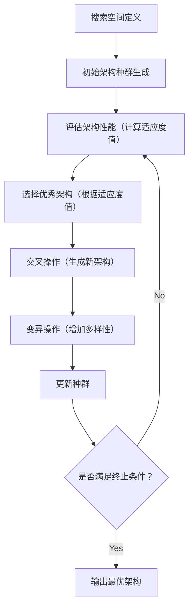

# 神经架构搜索的进化算法优化方法

> 关键词：神经架构搜索、进化算法、优化方法、深度学习、神经网络架构

> 摘要：本文围绕神经架构搜索的进化算法优化方法展开深入探讨。首先介绍了神经架构搜索的背景以及进化算法在其中的重要性，阐述了相关核心概念和联系，包括神经架构搜索和进化算法的原理及架构。详细讲解了核心算法原理，通过Python源代码进行具体阐述，同时给出了相关数学模型和公式，并举例说明。通过项目实战，展示了如何运用进化算法优化神经架构搜索的实际案例，分析了开发环境搭建、源代码实现和解读。探讨了该方法的实际应用场景，推荐了学习资源、开发工具框架以及相关论文著作。最后总结了未来发展趋势与挑战，还提供了常见问题与解答及扩展阅读参考资料，旨在为读者全面深入地理解和应用神经架构搜索的进化算法优化方法提供指导。

## 1. 背景介绍 
### 1.1 目的和范围
神经架构搜索（Neural Architecture Search，NAS）旨在自动发现最优的神经网络架构，以提高模型的性能和效率。传统的神经网络架构设计依赖于人工经验和试错，这不仅耗时费力，而且难以找到全局最优的架构。进化算法作为一种强大的优化方法，具有全局搜索能力和自适应性，能够在大规模的架构空间中高效地搜索到较优的神经网络架构。本文的目的是详细介绍神经架构搜索的进化算法优化方法，包括算法原理、实现步骤、数学模型、实际应用等方面，范围涵盖了从理论基础到实际项目应用的全过程。

### 1.2 预期读者
本文预期读者包括深度学习领域的研究人员、人工智能开发者、机器学习工程师以及对神经架构搜索和进化算法感兴趣的技术爱好者。读者需要具备一定的机器学习和深度学习基础知识，了解神经网络的基本概念和常见架构。

### 1.3 文档结构概述
本文首先介绍神经架构搜索和进化算法的背景知识，包括目的、预期读者和文档结构概述。接着阐述核心概念与联系，包括神经架构搜索和进化算法的原理和架构，并给出相应的示意图和流程图。然后详细讲解核心算法原理和具体操作步骤，通过Python源代码进行说明。随后介绍数学模型和公式，并举例说明。通过项目实战展示进化算法优化神经架构搜索的实际应用，包括开发环境搭建、源代码实现和解读。探讨该方法的实际应用场景，推荐相关的学习资源、开发工具框架和论文著作。最后总结未来发展趋势与挑战，提供常见问题与解答和扩展阅读参考资料。

### 1.4 术语表
#### 1.4.1 核心术语定义
- **神经架构搜索（Neural Architecture Search，NAS）**：一种自动化的方法，用于在给定的搜索空间中寻找最优的神经网络架构。
- **进化算法（Evolutionary Algorithm，EA）**：一类受生物进化过程启发的优化算法，包括遗传算法、进化策略等，通过模拟自然选择和遗传机制来搜索最优解。
- **适应度函数（Fitness Function）**：在进化算法中，用于评估个体（神经网络架构）优劣的函数，通常与模型的性能指标（如准确率、损失函数等）相关。
- **种群（Population）**：进化算法中一组个体的集合，每个个体代表一个可能的神经网络架构。
- **交叉（Crossover）**：进化算法中的一种操作，通过交换两个个体的部分基因（架构参数）来生成新的个体。
- **变异（Mutation）**：进化算法中的一种操作，对个体的部分基因进行随机改变，以增加种群的多样性。

#### 1.4.2 相关概念解释
- **搜索空间（Search Space）**：神经架构搜索中所有可能的神经网络架构的集合，通常由一组架构参数和操作符定义。
- **架构表示（Architecture Representation）**：将神经网络架构表示为一种适合进化算法处理的形式，如编码、图结构等。
- **评估（Evaluation）**：对每个神经网络架构进行训练和测试，计算其适应度值的过程。

#### 1.4.3 缩略词列表
- **NAS**：Neural Architecture Search（神经架构搜索）
- **EA**：Evolutionary Algorithm（进化算法）

## 2. 核心概念与联系 
### 2.1 神经架构搜索原理
神经架构搜索的基本思想是在一个预先定义的搜索空间中寻找最优的神经网络架构。搜索空间通常由一组架构参数和操作符组成，例如网络层数、每层的神经元数量、卷积核大小等。搜索过程通过不断地生成新的架构并评估其性能，逐步找到最优的架构。

神经架构搜索的一般流程如下：
1. **定义搜索空间**：确定所有可能的神经网络架构的集合。
2. **选择搜索算法**：如进化算法、强化学习等。
3. **生成初始架构种群**：从搜索空间中随机选择一些架构作为初始种群。
4. **评估架构性能**：对每个架构进行训练和测试，计算其适应度值。
5. **更新种群**：根据适应度值选择优秀的架构，并通过交叉、变异等操作生成新的架构。
6. **重复步骤4和5**：直到满足终止条件，如达到最大迭代次数或找到满意的架构。

### 2.2 进化算法原理
进化算法是一类受生物进化过程启发的优化算法，主要包括遗传算法、进化策略等。其基本思想是通过模拟自然选择和遗传机制，在解空间中搜索最优解。

进化算法的一般流程如下：
1. **初始化种群**：随机生成一组个体（解）作为初始种群。
2. **评估适应度**：计算每个个体的适应度值，反映其优劣程度。
3. **选择操作**：根据适应度值选择优秀的个体作为父代。
4. **交叉操作**：对父代个体进行交叉，生成新的个体。
5. **变异操作**：对新个体进行变异，增加种群的多样性。
6. **更新种群**：用新个体替换部分旧个体，形成新的种群。
7. **重复步骤2 - 6**：直到满足终止条件。

### 2.3 神经架构搜索与进化算法的联系
进化算法可以作为神经架构搜索的一种有效搜索算法。在神经架构搜索中，每个神经网络架构可以看作是进化算法中的一个个体，适应度函数可以定义为模型的性能指标（如准确率、损失函数等）。通过进化算法的选择、交叉和变异操作，可以在搜索空间中不断地生成新的架构，并逐步找到最优的架构。

### 2.4 文本示意图
神经架构搜索的进化算法优化方法的整体架构可以用以下文本示意图表示：

```plaintext
搜索空间定义
|
v
初始架构种群生成
|
v
评估架构性能（计算适应度值）
|
v
选择优秀架构（根据适应度值）
|
v
交叉操作（生成新架构）
|
v
变异操作（增加多样性）
|
v
更新种群
|
v
是否满足终止条件？
|         |
Yes       No
|         |
v         v
输出最优架构  重复评估、选择、交叉、变异步骤
```

### 2.5 Mermaid流程图


## 3. 核心算法原理 & 具体操作步骤 
### 3.1 进化算法优化神经架构搜索的核心原理
进化算法优化神经架构搜索的核心原理是通过模拟生物进化过程，在搜索空间中不断地搜索最优的神经网络架构。具体来说，进化算法通过以下几个步骤实现：
1. **编码**：将神经网络架构表示为一种适合进化算法处理的编码形式，如二进制编码、整数编码等。
2. **初始化种群**：随机生成一组初始的编码个体，每个个体代表一个可能的神经网络架构。
3. **评估适应度**：对每个个体对应的神经网络架构进行训练和测试，计算其适应度值，通常使用模型的性能指标（如准确率、损失函数等）作为适应度值。
4. **选择操作**：根据适应度值选择优秀的个体作为父代，常用的选择方法有轮盘赌选择、锦标赛选择等。
5. **交叉操作**：对父代个体进行交叉，生成新的个体，交叉操作可以交换两个父代个体的部分基因（架构参数）。
6. **变异操作**：对新个体进行变异，增加种群的多样性，变异操作可以随机改变个体的部分基因。
7. **更新种群**：用新个体替换部分旧个体，形成新的种群。
8. **重复步骤3 - 7**：直到满足终止条件，如达到最大迭代次数或找到满意的架构。

### 3.2 具体操作步骤
以下是使用Python实现进化算法优化神经架构搜索的具体操作步骤和代码示例：

```python
import numpy as np
import random
from sklearn.model_selection import train_test_split
from tensorflow.keras.datasets import mnist
from tensorflow.keras.models import Sequential
from tensorflow.keras.layers import Dense, Flatten
from tensorflow.keras.utils import to_categorical

# 1. 定义搜索空间
# 假设搜索空间包括网络层数（2 - 5层）和每层的神经元数量（16 - 128个）
search_space = {
    'num_layers': range(2, 6),
    'neurons_per_layer': range(16, 129)
}

# 2. 编码和解码函数
def encode_architecture(num_layers, neurons_per_layer):
    # 简单的整数编码，将层数和每层神经元数量组合成一个列表
    return [num_layers] + [neurons_per_layer] * num_layers

def decode_architecture(encoded_architecture):
    num_layers = encoded_architecture[0]
    neurons_per_layer = encoded_architecture[1]
    return num_layers, neurons_per_layer

# 3. 初始化种群
def initialize_population(population_size):
    population = []
    for _ in range(population_size):
        num_layers = random.choice(search_space['num_layers'])
        neurons_per_layer = random.choice(search_space['neurons_per_layer'])
        encoded_architecture = encode_architecture(num_layers, neurons_per_layer)
        population.append(encoded_architecture)
    return population

# 4. 评估适应度
def evaluate_fitness(architecture, X_train, y_train, X_test, y_test):
    num_layers, neurons_per_layer = decode_architecture(architecture)
    model = Sequential()
    model.add(Flatten(input_shape=(28, 28)))
    for _ in range(num_layers):
        model.add(Dense(neurons_per_layer, activation='relu'))
    model.add(Dense(10, activation='softmax'))
    model.compile(optimizer='adam', loss='categorical_crossentropy', metrics=['accuracy'])
    model.fit(X_train, y_train, epochs=5, batch_size=64, verbose=0)
    _, accuracy = model.evaluate(X_test, y_test, verbose=0)
    return accuracy

# 5. 选择操作（锦标赛选择）
def tournament_selection(population, fitness_values, tournament_size):
    tournament_indices = random.sample(range(len(population)), tournament_size)
    tournament_fitness = [fitness_values[i] for i in tournament_indices]
    winner_index = tournament_indices[np.argmax(tournament_fitness)]
    return population[winner_index]

# 6. 交叉操作
def crossover(parent1, parent2):
    crossover_point = random.randint(1, len(parent1) - 1)
    child1 = parent1[:crossover_point] + parent2[crossover_point:]
    child2 = parent2[:crossover_point] + parent1[crossover_point:]
    return child1, child2

# 7. 变异操作
def mutation(architecture, mutation_rate):
    for i in range(len(architecture)):
        if random.random() < mutation_rate:
            if i == 0:
                architecture[i] = random.choice(search_space['num_layers'])
            else:
                architecture[i] = random.choice(search_space['neurons_per_layer'])
    return architecture

# 8. 主循环
def evolutionary_nas(population_size, generations, tournament_size, mutation_rate):
    # 加载数据集
    (X_train, y_train), (X_test, y_test) = mnist.load_data()
    X_train = X_train / 255.0
    X_test = X_test / 255.0
    y_train = to_categorical(y_train)
    y_test = to_categorical(y_test)

    population = initialize_population(population_size)
    best_fitness = 0
    best_architecture = None

    for generation in range(generations):
        fitness_values = []
        for architecture in population:
            fitness = evaluate_fitness(architecture, X_train, y_train, X_test, y_test)
            fitness_values.append(fitness)
            if fitness > best_fitness:
                best_fitness = fitness
                best_architecture = architecture

        new_population = []
        for _ in range(population_size // 2):
            parent1 = tournament_selection(population, fitness_values, tournament_size)
            parent2 = tournament_selection(population, fitness_values, tournament_size)
            child1, child2 = crossover(parent1, parent2)
            child1 = mutation(child1, mutation_rate)
            child2 = mutation(child2, mutation_rate)
            new_population.extend([child1, child2])

        population = new_population
        print(f"Generation {generation}: Best fitness = {best_fitness}")

    return best_architecture, best_fitness

# 运行进化算法优化神经架构搜索
population_size = 20
generations = 10
tournament_size = 3
mutation_rate = 0.1

best_architecture, best_fitness = evolutionary_nas(population_size, generations, tournament_size, mutation_rate)
print(f"Best architecture: {best_architecture}, Best fitness: {best_fitness}")
```

### 3.3 代码解释
1. **搜索空间定义**：定义了神经网络架构的搜索空间，包括网络层数和每层的神经元数量。
2. **编码和解码函数**：将神经网络架构编码为整数列表，方便进化算法处理，同时可以将编码解码为实际的架构参数。
3. **初始化种群**：随机生成一组初始的编码个体，每个个体代表一个可能的神经网络架构。
4. **评估适应度**：对每个个体对应的神经网络架构进行训练和测试，计算其准确率作为适应度值。
5. **选择操作**：使用锦标赛选择方法选择优秀的个体作为父代。
6. **交叉操作**：对父代个体进行交叉，生成新的个体。
7. **变异操作**：对新个体进行变异，增加种群的多样性。
8. **主循环**：重复进行评估、选择、交叉和变异操作，直到达到最大迭代次数。

## 4. 数学模型和公式 & 详细讲解 & 举例说明 
### 4.1 适应度函数
适应度函数是进化算法中用于评估个体优劣的函数，在神经架构搜索中，通常使用模型的性能指标（如准确率、损失函数等）作为适应度函数。假设我们使用准确率作为适应度函数，对于一个神经网络架构 $A$，其适应度值 $f(A)$ 可以表示为：

$$f(A) = \text{Accuracy}(A)$$

其中 $\text{Accuracy}(A)$ 是架构 $A$ 在测试集上的准确率。

### 4.2 选择概率
在选择操作中，通常使用轮盘赌选择或锦标赛选择等方法。以轮盘赌选择为例，每个个体的选择概率 $p_i$ 与它的适应度值 $f_i$ 成正比，可以表示为：

$$p_i = \frac{f_i}{\sum_{j=1}^{N} f_j}$$

其中 $N$ 是种群的大小，$f_j$ 是第 $j$ 个个体的适应度值。

### 4.3 交叉和变异操作
交叉操作通过交换两个父代个体的部分基因来生成新的个体。假设父代个体 $P_1$ 和 $P_2$ 的基因序列分别为 $[g_{11}, g_{12}, \cdots, g_{1n}]$ 和 $[g_{21}, g_{22}, \cdots, g_{2n}]$，交叉点为 $k$，则生成的子代个体 $C_1$ 和 $C_2$ 可以表示为：

$$C_1 = [g_{11}, g_{12}, \cdots, g_{1k}, g_{2(k+1)}, g_{2(k+2)}, \cdots, g_{2n}]$$
$$C_2 = [g_{21}, g_{22}, \cdots, g_{2k}, g_{1(k+1)}, g_{1(k+2)}, \cdots, g_{1n}]$$

变异操作通过随机改变个体的部分基因来增加种群的多样性。假设个体 $I$ 的基因序列为 $[g_1, g_2, \cdots, g_n]$，变异率为 $m$，则对于每个基因 $g_i$，有 $m$ 的概率进行变异，变异后的基因 $g_i'$ 从搜索空间中随机选择。

### 4.4 举例说明
假设我们有一个种群，包含 3 个个体，其适应度值分别为 $f_1 = 0.8$，