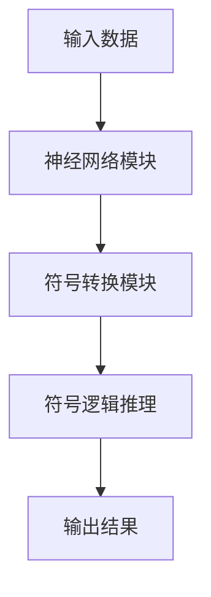

# 神经符号推理在复杂问题诊断中的优势

> 关键词：神经符号推理、复杂问题诊断、人工智能、符号逻辑、神经网络

> 摘要：本文深入探讨了神经符号推理在复杂问题诊断中的优势。首先介绍了相关背景知识，包括目的范围、预期读者等。接着阐述了神经符号推理的核心概念与联系，分析其原理和架构。详细讲解了核心算法原理及具体操作步骤，并给出相应的Python代码示例。同时介绍了神经符号推理的数学模型和公式，通过举例进行说明。通过项目实战展示了其在实际中的应用，分析了实际应用场景。还推荐了相关的工具和资源，最后总结了神经符号推理的未来发展趋势与挑战，解答了常见问题并提供扩展阅读和参考资料。旨在让读者全面了解神经符号推理在复杂问题诊断中的重要作用和优势。

## 1. 背景介绍 
### 1.1 目的和范围
在当今复杂多变的世界中，各个领域都面临着大量复杂问题的诊断需求，如医疗领域的疾病诊断、工业领域的设备故障诊断、金融领域的风险评估等。传统的诊断方法在处理复杂问题时往往存在局限性，难以应对不确定性、高维度数据以及复杂的逻辑关系。神经符号推理作为一种融合了神经网络和符号逻辑的新型推理方法，为复杂问题诊断提供了新的思路和解决方案。本文的目的在于深入探讨神经符号推理在复杂问题诊断中的优势，分析其原理、算法和应用场景，为相关领域的研究和实践提供参考。

本文的范围涵盖了神经符号推理的基本概念、核心算法、数学模型、项目实战以及实际应用场景等方面。同时，还会推荐相关的学习资源、开发工具和论文著作，以帮助读者全面了解和掌握神经符号推理在复杂问题诊断中的应用。

### 1.2 预期读者
本文预期读者包括人工智能领域的研究人员、工程师、学生，以及对复杂问题诊断方法感兴趣的专业人士。对于希望了解神经符号推理技术在实际应用中优势的读者，本文将提供详细的技术解读和案例分析；对于正在从事相关研究和开发工作的专业人员，本文将分享最新的研究成果和实践经验，为其工作提供参考和启发。

### 1.3 文档结构概述
本文将按照以下结构进行组织：
1. **背景介绍**：介绍本文的目的、范围、预期读者和文档结构概述，以及相关术语的定义和解释。
2. **核心概念与联系**：阐述神经符号推理的核心概念，包括神经网络和符号逻辑的基本原理，以及它们之间的联系和融合方式。通过文本示意图和Mermaid流程图展示其架构。
3. **核心算法原理 & 具体操作步骤**：详细讲解神经符号推理的核心算法原理，并给出具体的操作步骤。使用Python源代码进行详细阐述。
4. **数学模型和公式 & 详细讲解 & 举例说明**：介绍神经符号推理的数学模型和公式，对其进行详细讲解，并通过具体的例子进行说明。
5. **项目实战：代码实际案例和详细解释说明**：通过一个具体的项目实战，展示神经符号推理在复杂问题诊断中的应用。包括开发环境搭建、源代码详细实现和代码解读。
6. **实际应用场景**：分析神经符号推理在不同领域的实际应用场景，如医疗、工业、金融等。
7. **工具和资源推荐**：推荐相关的学习资源、开发工具和论文著作，帮助读者进一步学习和研究神经符号推理。
8. **总结：未来发展趋势与挑战**：总结神经符号推理在复杂问题诊断中的优势，分析其未来发展趋势和面临的挑战。
9. **附录：常见问题与解答**：解答读者在阅读过程中可能遇到的常见问题。
10. **扩展阅读 & 参考资料**：提供相关的扩展阅读资料和参考文献，方便读者进一步深入学习。

### 1.4 术语表
#### 1.4.1 核心术语定义
- **神经符号推理**：一种融合了神经网络和符号逻辑的推理方法，旨在结合神经网络的强大学习能力和符号逻辑的可解释性，实现更高效、更准确的推理。
- **神经网络**：一种模仿人类神经系统的计算模型，由大量的神经元组成，通过对数据的学习和训练来自动提取特征和模式。
- **符号逻辑**：一种基于符号和规则的逻辑推理方法，通过对符号的操作和推理来表达和处理知识。
- **复杂问题诊断**：对具有高维度、不确定性、复杂逻辑关系等特点的问题进行分析和判断，找出问题的根源和解决方案。

#### 1.4.2 相关概念解释
- **可解释性**：指模型的决策过程和结果能够被人类理解和解释的程度。在复杂问题诊断中，可解释性是非常重要的，因为医生、工程师等专业人员需要理解诊断结果的依据，以便做出合理的决策。
- **泛化能力**：指模型在未见过的数据上能够准确预测和推理的能力。在复杂问题诊断中，由于数据的多样性和不确定性，模型需要具有良好的泛化能力，才能在实际应用中取得较好的效果。
- **知识表示**：指将知识以某种形式表示出来，以便计算机能够处理和推理。在神经符号推理中，知识可以用符号逻辑表示，也可以用神经网络的参数表示。

#### 1.4.3 缩略词列表
- **NN**：Neural Network，神经网络
- **SL**：Symbolic Logic，符号逻辑
- **NSR**：Neural-Symbolic Reasoning，神经符号推理

## 2. 核心概念与联系 

神经符号推理的核心在于将神经网络和符号逻辑有机地结合起来，发挥两者的优势。

### 神经网络原理
神经网络是一种受生物神经系统启发的计算模型。它由多个层次的神经元组成，包括输入层、隐藏层和输出层。每个神经元接收来自上一层神经元的输入，经过加权求和和非线性变换后，将结果传递给下一层神经元。通过对大量数据的学习和训练，神经网络可以自动提取数据中的特征和模式，从而实现分类、回归等任务。

### 符号逻辑原理
符号逻辑是一种基于符号和规则的逻辑推理方法。它使用符号来表示概念和命题，通过逻辑规则来进行推理和证明。符号逻辑具有严格的语义和推理规则，能够准确地表达和处理知识，具有良好的可解释性。

### 神经符号推理的融合方式
神经符号推理的融合方式主要有两种：一种是将神经网络作为符号逻辑的基础，通过神经网络学习数据中的特征和模式，然后将这些特征和模式转化为符号逻辑中的知识和规则；另一种是将符号逻辑作为神经网络的指导，通过符号逻辑的规则和知识来约束和引导神经网络的学习和推理过程。

### 文本示意图
神经符号推理的架构可以用以下文本示意图表示：

```plaintext
+-----------------+
|   输入数据      |
+-----------------+
        |
        v
+-----------------+
|  神经网络模块  |
+-----------------+
        |
        v
+-----------------+
|  符号转换模块  |
+-----------------+
        |
        v
+-----------------+
|  符号逻辑推理  |
+-----------------+
        |
        v
+-----------------+
|   输出结果      |
+-----------------+
```

### Mermaid流程图


## 3. 核心算法原理 & 具体操作步骤 

### 核心算法原理
神经符号推理的核心算法主要包括神经网络的训练和符号逻辑的推理两个部分。

#### 神经网络训练
神经网络的训练通常采用反向传播算法。反向传播算法的基本思想是通过计算输出结果与真实标签之间的误差，然后将误差反向传播到神经网络的各个层，调整神经元的权重和偏置，使得误差最小化。

以下是一个简单的Python代码示例，展示了如何使用PyTorch实现一个简单的神经网络训练过程：

```python
import torch
import torch.nn as nn
import torch.optim as optim

# 定义一个简单的神经网络
class SimpleNet(nn.Module):
    def __init__(self):
        super(SimpleNet, self).__init__()
        self.fc1 = nn.Linear(10, 20)
        self.relu = nn.ReLU()
        self.fc2 = nn.Linear(20, 1)

    def forward(self, x):
        x = self.fc1(x)
        x = self.relu(x)
        x = self.fc2(x)
        return x

# 生成一些随机数据
x = torch.randn(100, 10)
y = torch.randn(100, 1)

# 初始化模型、损失函数和优化器
model = SimpleNet()
criterion = nn.MSELoss()
optimizer = optim.SGD(model.parameters(), lr=0.01)

# 训练模型
for epoch in range(100):
    optimizer.zero_grad()
    outputs = model(x)
    loss = criterion(outputs, y)
    loss.backward()
    optimizer.step()
    if (epoch + 1) % 10 == 0:
        print(f'Epoch [{epoch + 1}/100], Loss: {loss.item():.4f}')
```

#### 符号逻辑推理
符号逻辑推理通常采用规则引擎来实现。规则引擎是一种基于规则的推理系统，它根据预先定义的规则和事实，进行逻辑推理和判断。以下是一个简单的Python代码示例，展示了如何使用Python实现一个简单的规则引擎：

```python
# 定义规则
rules = [
    {"condition": lambda x: x > 5, "action": lambda: print("x 大于 5")},
    {"condition": lambda x: x <= 5, "action": lambda: print("x 小于等于 5")}
]

# 定义事实
x = 3

# 进行推理
for rule in rules:
    if rule["condition"](x):
        rule["action"]()
```

### 具体操作步骤
1. **数据预处理**：对输入数据进行清洗、归一化等预处理操作，以便神经网络能够更好地学习和处理数据。
2. **神经网络训练**：使用预处理后的数据对神经网络进行训练，调整神经网络的参数，使得神经网络能够准确地提取数据中的特征和模式。
3. **符号转换**：将神经网络学习到的特征和模式转换为符号逻辑中的知识和规则。
4. **符号逻辑推理**：根据符号逻辑中的知识和规则，对输入数据进行推理和判断，得出诊断结果。
5. **结果评估**：对诊断结果进行评估，根据评估结果调整神经网络和符号逻辑的参数，提高诊断的准确性和可靠性。

## 4. 数学模型和公式 & 详细讲解 & 举例说明 

### 神经网络的数学模型
神经网络的基本数学模型可以用以下公式表示：

$$
y = f(Wx + b)
$$

其中，$x$ 是输入向量，$W$ 是权重矩阵，$b$ 是偏置向量，$f$ 是激活函数，$y$ 是输出向量。

### 损失函数
在神经网络训练中，通常使用损失函数来衡量输出结果与真实标签之间的误差。常见的损失函数包括均方误差损失函数（MSE）、交叉熵损失函数等。

均方误差损失函数的公式为：

$$
L = \frac{1}{n} \sum_{i=1}^{n} (y_i - \hat{y}_i)^2
$$

其中，$n$ 是样本数量，$y_i$ 是真实标签，$\hat{y}_i$ 是预测标签。

### 反向传播算法
反向传播算法的核心是计算损失函数对神经网络参数的梯度，然后根据梯度更新参数。梯度的计算公式为：

$$
\frac{\partial L}{\partial W} = \frac{\partial L}{\partial y} \frac{\partial y}{\partial W}
$$

$$
\frac{\partial L}{\partial b} = \frac{\partial L}{\partial y} \frac{\partial y}{\partial b}
$$

### 举例说明
假设我们有一个简单的神经网络，输入层有2个神经元，隐藏层有3个神经元，输出层有1个神经元。输入向量为 $x = [x_1, x_2]^T$，权重矩阵为 $W_1$ 和 $W_2$，偏置向量为 $b_1$ 和 $b_2$，激活函数为 sigmoid 函数。

则隐藏层的输出为：

$$
h = \sigma(W_1x + b_1)
$$

其中，$\sigma$ 是 sigmoid 函数。

输出层的输出为：

$$
y = \sigma(W_2h + b_2)
$$

假设真实标签为 $y_{true}$，则均方误差损失函数为：

$$
L = \frac{1}{2} (y - y_{true})^2
$$

通过反向传播算法，我们可以计算出损失函数对 $W_1$、$W_2$、$b_1$ 和 $b_2$ 的梯度，然后根据梯度更新这些参数，使得损失函数最小化。

## 5. 项目实战：代码实际案例和详细解释说明 

### 5.1  开发环境搭建
在进行神经符号推理的项目实战之前，需要搭建相应的开发环境。以下是一些常用的开发环境和工具：
- **Python**：Python是一种广泛使用的编程语言，具有丰富的机器学习和深度学习库。
- **PyTorch**：PyTorch是一个开源的深度学习框架，提供了丰富的神经网络模型和训练工具。
- **Jupyter Notebook**：Jupyter Notebook是一个交互式的开发环境，方便我们进行代码的编写、调试和可视化。

可以使用以下命令安装所需的库：

```bash
pip install torch torchvision jupyter
```

### 5.2  源代码详细实现和代码解读
以下是一个简单的神经符号推理项目实战示例，用于解决一个二分类问题。

```python
import torch
import torch.nn as nn
import torch.optim as optim
import numpy as np

# 生成一些随机数据
np.random.seed(0)
x = np.random.randn(100, 2)
y = (np.sum(x ** 2, axis=1) > 2).astype(int)

# 将数据转换为PyTorch张量
x = torch.tensor(x, dtype=torch.float32)
y = torch.tensor(y, dtype=torch.long)

# 定义一个简单的神经网络
class SimpleNet(nn.Module):
    def __init__(self):
        super(SimpleNet, self).__init__()
        self.fc1 = nn.Linear(2, 10)
        self.relu = nn.ReLU()
        self.fc2 = nn.Linear(10, 2)

    def forward(self, x):
        x = self.fc1(x)
        x = self.relu(x)
        x = self.fc2(x)
        return x

# 初始化模型、损失函数和优化器
model = SimpleNet()
criterion = nn.CrossEntropyLoss()
optimizer = optim.SGD(model.parameters(), lr=0.01)

# 训练模型
for epoch in range(100):
    optimizer.zero_grad()
    outputs = model(x)
    loss = criterion(outputs, y)
    loss.backward()
    optimizer.step()
    if (epoch + 1) % 10 == 0:
        print(f'Epoch [{epoch + 1}/100], Loss: {loss.item():.4f}')

# 进行符号逻辑推理
def symbol_logic_reasoning(x):
    # 将输入数据转换为符号表示
    symbol_x = []
    for i in range(x.shape[0]):
        if x[i][0] > 0 and x[i][1] > 0:
            symbol_x.append("positive_x_positive_y")
        elif x[i][0] > 0 and x[i][1] < 0:
            symbol_x.append("positive_x_negative_y")
        elif x[i][0] < 0 and x[i][1] > 0:
            symbol_x.append("negative_x_positive_y")
        else:
            symbol_x.append("negative_x_negative_y")

    # 定义规则
    rules = [
        {"condition": lambda s: s == "positive_x_positive_y", "action": lambda: 1},
        {"condition": lambda s: s == "positive_x_negative_y", "action": lambda: 0},
        {"condition": lambda s: s == "negative_x_positive_y", "action": lambda: 0},
        {"condition": lambda s: s == "negative_x_negative_y", "action": lambda: 1}
    ]

    # 进行推理
    result = []
    for s in symbol_x:
        for rule in rules:
            if rule["condition"](s):
                result.append(rule["action"]())

    return torch.tensor(result, dtype=torch.long)

# 结合神经网络和符号逻辑推理
with torch.no_grad():
    nn_outputs = model(x)
    nn_preds = torch.argmax(nn_outputs, dim=1)
    sl_preds = symbol_logic_reasoning(x)

    # 合并结果
    final_preds = []
    for i in range(len(nn_preds)):
        if nn_preds[i] == sl_preds[i]:
            final_preds.append(nn_preds[i])
        else:
            # 可以根据具体情况进行处理，这里简单地选择神经网络的结果
            final_preds.append(nn_preds[i])

    final_preds = torch.tensor(final_preds, dtype=torch.long)

    # 计算准确率
    accuracy =