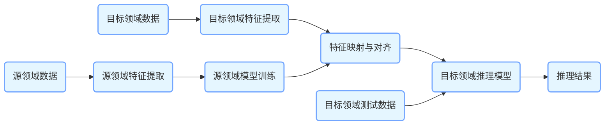

# 神经类比转移学习在跨域推理中的效果研究

> 关键词：神经类比转移学习、跨域推理、深度学习、模型迁移、领域适应

> 摘要：本文聚焦于神经类比转移学习在跨域推理中的效果研究。首先介绍了研究的背景、目的、预期读者以及文档结构等内容。详细阐述了神经类比转移学习和跨域推理的核心概念与联系，给出了相应的原理和架构示意图及流程图。深入分析了核心算法原理，并用Python代码进行详细阐述，同时介绍了相关的数学模型和公式。通过项目实战，展示了代码的实际案例并进行详细解释。探讨了神经类比转移学习在跨域推理中的实际应用场景，推荐了相关的学习资源、开发工具框架和论文著作。最后总结了未来的发展趋势与挑战，解答了常见问题，并提供了扩展阅读和参考资料，旨在为相关领域的研究者和开发者提供全面而深入的技术参考。

## 1. 背景介绍 
### 1.1 目的和范围
随着人工智能技术的不断发展，深度学习模型在各个领域取得了显著的成果。然而，在实际应用中，往往会面临数据分布不一致、训练数据和测试数据来自不同领域等问题，这就导致模型在新领域的推理效果不佳。神经类比转移学习作为一种有效的方法，可以将在一个领域学到的知识迁移到另一个领域，从而提高模型在跨域推理中的性能。

本研究的目的在于深入探讨神经类比转移学习在跨域推理中的效果，通过理论分析、算法实现和实验验证，揭示神经类比转移学习在不同场景下的优势和局限性。研究范围涵盖了神经类比转移学习的核心概念、算法原理、数学模型，以及在图像识别、自然语言处理等多个领域的跨域推理应用。

### 1.2 预期读者
本文预期读者包括人工智能、机器学习、深度学习等领域的研究者、开发者，以及对跨域推理和转移学习感兴趣的学生和技术爱好者。对于有一定编程基础和机器学习知识的读者，能够更好地理解文中的算法实现和代码细节；而对于初学者，也可以通过阅读本文了解神经类比转移学习在跨域推理中的基本原理和应用场景。

### 1.3 文档结构概述
本文将按照以下结构进行组织：
- 核心概念与联系：介绍神经类比转移学习和跨域推理的基本概念，以及它们之间的联系，给出原理和架构示意图及流程图。
- 核心算法原理 & 具体操作步骤：详细阐述神经类比转移学习的核心算法原理，并用Python代码进行实现和解释。
- 数学模型和公式 & 详细讲解 & 举例说明：介绍相关的数学模型和公式，通过具体例子进行详细讲解。
- 项目实战：代码实际案例和详细解释说明：通过一个实际项目，展示神经类比转移学习在跨域推理中的应用，包括开发环境搭建、源代码实现和代码解读。
- 实际应用场景：探讨神经类比转移学习在不同领域的实际应用场景。
- 工具和资源推荐：推荐相关的学习资源、开发工具框架和论文著作。
- 总结：未来发展趋势与挑战：总结神经类比转移学习在跨域推理中的发展趋势和面临的挑战。
- 附录：常见问题与解答：解答读者在阅读过程中可能遇到的常见问题。
- 扩展阅读 & 参考资料：提供相关的扩展阅读材料和参考资料。

### 1.4 术语表
#### 1.4.1 核心术语定义
- **神经类比转移学习（Neural Analogical Transfer Learning）**：一种基于神经网络的转移学习方法，通过寻找源领域和目标领域之间的类比关系，将源领域学到的知识迁移到目标领域。
- **跨域推理（Cross - Domain Inference）**：在不同领域的数据上进行推理的过程，由于数据分布的差异，传统的机器学习模型在跨域推理中往往表现不佳。
- **源领域（Source Domain）**：包含大量标注数据的领域，模型在该领域进行训练以学习通用的特征和模式。
- **目标领域（Target Domain）**：需要进行推理的领域，通常标注数据较少或没有标注数据，希望通过从源领域迁移知识来提高模型在该领域的性能。

#### 1.4.2 相关概念解释
- **特征提取（Feature Extraction）**：从原始数据中提取出具有代表性的特征，以便后续的模型训练和推理。在神经类比转移学习中，特征提取是关键步骤之一，通过寻找源领域和目标领域之间的共同特征来实现知识迁移。
- **领域适应（Domain Adaptation）**：一种解决跨域问题的方法，通过调整模型的参数或数据分布，使模型能够在不同领域的数据上取得较好的性能。神经类比转移学习可以看作是一种领域适应的方法。

#### 1.4.3 缩略词列表
- **CNN（Convolutional Neural Network）**：卷积神经网络，一种常用于图像识别和处理的神经网络模型。
- **RNN（Recurrent Neural Network）**：循环神经网络，一种常用于处理序列数据的神经网络模型。
- **DNN（Deep Neural Network）**：深度神经网络，包含多个隐藏层的神经网络模型。

## 2. 核心概念与联系 

### 神经类比转移学习原理
神经类比转移学习的核心思想是通过神经网络找到源领域和目标领域之间的类比关系，从而将源领域的知识迁移到目标领域。具体来说，首先在源领域上训练一个神经网络模型，学习源领域的特征和模式。然后，通过某种机制（如对抗训练、特征映射等），使目标领域的数据在特征空间上与源领域的数据尽可能相似，从而让模型能够将在源领域学到的知识应用到目标领域。

### 跨域推理原理
跨域推理是指在不同领域的数据上进行推理的过程。由于不同领域的数据分布可能存在较大差异，传统的机器学习模型在跨域推理中往往表现不佳。为了解决这个问题，需要采用一些方法来适应目标领域的数据分布，神经类比转移学习就是其中一种有效的方法。

### 核心概念架构示意图


### 核心概念联系
神经类比转移学习和跨域推理是紧密相关的。神经类比转移学习为跨域推理提供了一种有效的解决方案，通过将源领域的知识迁移到目标领域，提高模型在跨域推理中的性能。而跨域推理则是神经类比转移学习的应用场景，通过解决跨域推理中的问题，体现神经类比转移学习的价值。

## 3. 核心算法原理 & 具体操作步骤 

### 核心算法原理
神经类比转移学习的核心算法主要包括特征提取、特征映射和模型训练三个部分。

#### 特征提取
使用预训练的神经网络模型（如ResNet、VGG等）对源领域和目标领域的数据进行特征提取。预训练模型在大规模数据集上进行训练，能够学习到通用的特征表示。

```python
import torch
import torchvision.models as models

# 加载预训练的ResNet模型
resnet = models.resnet18(pretrained=True)
# 移除最后一层全连接层，用于特征提取
feature_extractor = torch.nn.Sequential(*list(resnet.children())[:-1])

# 示例数据
source_data = torch.randn(1, 3, 224, 224)
target_data = torch.randn(1, 3, 224, 224)

# 特征提取
source_features = feature_extractor(source_data)
target_features = feature_extractor(target_data)
```

#### 特征映射
通过一个映射网络将目标领域的特征映射到源领域的特征空间，使两个领域的特征尽可能相似。可以使用对抗训练的方法来训练映射网络，具体步骤如下：

```python
import torch.nn as nn
import torch.optim as optim

# 定义映射网络
class FeatureMapper(nn.Module):
    def __init__(self):
        super(FeatureMapper, self).__init__()
        self.fc = nn.Linear(512, 512)

    def forward(self, x):
        return self.fc(x)

mapper = FeatureMapper()

# 定义判别器
class Discriminator(nn.Module):
    def __init__(self):
        super(Discriminator, self).__init__()
        self.fc = nn.Linear(512, 1)
        self.sigmoid = nn.Sigmoid()

    def forward(self, x):
        return self.sigmoid(self.fc(x))

discriminator = Discriminator()

# 定义损失函数和优化器
criterion = nn.BCELoss()
mapper_optimizer = optim.Adam(mapper.parameters(), lr=0.001)
discriminator_optimizer = optim.Adam(discriminator.parameters(), lr=0.001)

# 对抗训练
for epoch in range(100):
    # 训练判别器
    discriminator_optimizer.zero_grad()

    # 源领域特征标签为0，目标领域特征标签为1
    source_labels = torch.zeros(source_features.size(0), 1)
    target_labels = torch.ones(target_features.size(0), 1)

    # 计算判别器对源领域特征的输出
    source_output = discriminator(source_features.view(-1, 512))
    source_loss = criterion(source_output, source_labels)

    # 计算判别器对目标领域特征的输出
    mapped_target_features = mapper(target_features.view(-1, 512))
    target_output = discriminator(mapped_target_features)
    target_loss = criterion(target_output, target_labels)

    # 判别器总损失
    discriminator_loss = source_loss + target_loss
    discriminator_loss.backward()
    discriminator_optimizer.step()

    # 训练映射网络
    mapper_optimizer.zero_grad()

    # 计算映射网络的损失，目标是让判别器将映射后的目标领域特征误判为源领域特征
    mapped_target_features = mapper(target_features.view(-1, 512))
    target_output = discriminator(mapped_target_features)
    mapper_loss = criterion(target_output, source_labels)
    mapper_loss.backward()
    mapper_optimizer.step()
```

#### 模型训练
在特征映射完成后，使用源领域的标注数据和映射后的目标领域数据对分类器进行训练。

```python
# 定义分类器
class Classifier(nn.Module):
    def __init__(self):
        super(Classifier, self).__init__()
        self.fc = nn.Linear(512, 10)

    def forward(self, x):
        return self.fc(x)

classifier = Classifier()

# 定义损失函数和优化器
criterion = nn.CrossEntropyLoss()
optimizer = optim.Adam(classifier.parameters(), lr=0.001)

# 假设源领域有标注数据
source_labels = torch.randint(0, 10, (source_features.size(0),))

# 训练分类器
for epoch in range(100):
    optimizer.zero_grad()

    # 源领域数据分类
    source_output = classifier(source_features.view(-1, 512))
    source_loss = criterion(source_output, source_labels)

    # 映射后的目标领域数据分类（这里假设目标领域有少量标注数据）
    target_labels = torch.randint(0, 10, (mapped_target_features.size(0),))
    target_output = classifier(mapped_target_features)
    target_loss = criterion(target_output, target_labels)

    # 总损失
    total_loss = source_loss + target_loss
    total_loss.backward()
    optimizer.step()
```

### 具体操作步骤
1. **数据准备**：收集源领域和目标领域的数据，并进行预处理，如归一化、裁剪等。
2. **特征提取**：使用预训练的神经网络模型对源领域和目标领域的数据进行特征提取。
3. **特征映射**：通过对抗训练的方法训练映射网络，将目标领域的特征映射到源领域的特征空间。
4. **模型训练**：使用源领域的标注数据和映射后的目标领域数据对分类器进行训练。
5. **跨域推理**：使用训练好的模型对目标领域的测试数据进行推理。

## 4. 数学模型和公式 & 详细讲解 & 举例说明 

### 特征提取
在特征提取阶段，使用预训练的神经网络模型 $\phi(x)$ 对输入数据 $x$ 进行特征提取，得到特征表示 $f = \phi(x)$。假设输入数据 $x \in \mathbb{R}^{C \times H \times W}$，其中 $C$ 是通道数，$H$ 和 $W$ 分别是高度和宽度。预训练模型 $\phi(x)$ 可以看作是一个函数，将输入数据映射到一个低维的特征空间，即 $f \in \mathbb{R}^{d}$，其中 $d$ 是特征维度。

### 特征映射
特征映射的目标是找到一个映射函数 $M: \mathbb{R}^{d} \to \mathbb{R}^{d}$，将目标领域的特征 $f_t$ 映射到源领域的特征空间，使得映射后的特征 $M(f_t)$ 与源领域的特征 $f_s$ 尽可能相似。可以使用对抗训练的方法来训练映射函数 $M$，通过一个判别器 $D$ 来区分源领域特征和映射后的目标领域特征。

判别器的目标是最大化分类准确率，其损失函数可以表示为：
$$
L_D = -\mathbb{E}_{f_s \sim p_s}[\log D(f_s)] - \mathbb{E}_{f_t \sim p_t}[\log (1 - D(M(f_t)))]
$$
其中，$p_s$ 和 $p_t$ 分别是源领域和目标领域的特征分布。

映射函数的目标是最小化判别器的分类准确率，其损失函数可以表示为：
$$
L_M = -\mathbb{E}_{f_t \sim p_t}[\log D(M(f_t))]
$$

### 模型训练
在模型训练阶段，使用源领域的标注数据 $(x_s, y_s)$ 和映射后的目标领域数据 $(M(f_t), y_t)$ 对分类器 $C$ 进行训练。分类器的损失函数可以表示为：
$$
L_C = -\mathbb{E}_{(x_s, y_s) \sim p_{s}^{label}}[\log C(\phi(x_s))_{y_s}] - \mathbb{E}_{(M(f_t), y_t) \sim p_{t}^{label}}[\log C(M(f_t))_{y_t}]
$$
其中，$p_{s}^{label}$ 和 $p_{t}^{label}$ 分别是源领域和目标领域的标注数据分布，$C(\cdot)_{y}$ 表示分类器对类别 $y$ 的预测概率。

### 举例说明
假设源领域是手写数字识别任务，目标领域是印刷体数字识别任务。源领域有大量标注的手写数字图像 $(x_s, y_s)$，目标领域有少量标注的印刷体数字图像 $(x_t, y_t)$。

1. **特征提取**：使用预训练的ResNet模型对源领域和目标领域的图像进行特征提取，得到特征表示 $f_s$ 和 $f_t$。
2. **特征映射**：通过对抗训练的方法训练映射网络 $M$，将目标领域的特征 $f_t$ 映射到源领域的特征空间，使得映射后的特征 $M(f_t)$ 与源领域的特征 $f_s$ 尽可能相似。
3. **模型训练**：使用源领域的标注数据 $(x_s, y_s)$ 和映射后的目标领域数据 $(M(f_t), y_t)$ 对分类器 $C$ 进行训练。
4. **跨域推理**：使用训练好的模型对目标领域的测试数据进行推理，得到印刷体数字的识别结果。

## 5. 项目实战：代码实际案例和详细解释说明 

### 5.1  开发环境搭建
#### 安装Python和相关库
首先，确保你已经安装了Python 3.x版本。可以使用以下命令安装所需的库：
```bash
pip install torch torchvision numpy matplotlib
```

#### 数据集准备
本项目使用MNIST（手写数字识别数据集）作为源领域数据集，SVHN（街景门牌号识别数据集）作为目标领域数据集。可以使用以下代码下载和加载数据集：

```python
import torch
import torchvision
import torchvision.transforms as transforms

# 定义数据预处理
transform = transforms.Compose([
    transforms.Resize((224, 224)),
    transforms.ToTensor(),
    transforms.Normalize((0.5,), (0.5,))
])

# 加载MNIST数据集（源领域）
mnist_train = torchvision.datasets.MNIST(root='./data', train=True,
                                         download=True, transform=transform)
mnist_train_loader = torch.utils.data.DataLoader(mnist_train, batch_size=32,
                                                 shuffle=True)

mnist_test = torchvision.datasets.MNIST(root='./data', train=False,
                                        download=True, transform=transform)
mnist_test_loader = torch.utils.data.DataLoader(mnist_test, batch_size=32,
                                                shuffle=False)

# 加载SVHN数据集（目标领域）
svhn_train = torchvision.datasets.SVHN(root='./data', split='train',
                                       download=True, transform=transform)
svhn_train_loader = torch.utils.data.DataLoader(svhn_train, batch_size=32,
                                                shuffle=True)

svhn_test = torchvision.datasets.SVHN(root='./data', split='test',
                                      download=True, transform=transform)
svhn_test_loader = torch.utils.data.DataLoader(svhn_test, batch_size=32,
                                               shuffle=False)
```

### 5.2  源代码详细实现和代码解读
#### 特征提取
使用预训练的ResNet模型进行特征提取：

```python
import torch
import torchvision.models as models

# 加载预训练的ResNet模型
resnet = models.resnet18(pretrained=True)
# 移除最后一层全连接层，用于特征提取
feature_extractor = torch.nn.Sequential(*list(resnet.children())[:-1])

# 将模型移动到GPU（如果可用）
device = torch.device("cuda:0" if torch.cuda.is_available() else "cpu")
feature_extractor = feature_extractor.to(device)
```

#### 特征映射
定义映射网络和判别器，并进行对抗训练：

```python
import torch.nn as nn
import torch.optim as optim

# 定义映射网络
class FeatureMapper(nn.Module):
    def __init__(self):
        super(FeatureMapper, self).__init__()
        self.fc = nn.Linear(512, 512)

    def forward(self, x):
        return self.fc(x)

mapper = FeatureMapper().to(device)

# 定义判别器
class Discriminator(nn.Module):
    def __init__(self):
        super(Discriminator, self).__init__()
        self.fc = nn.Linear(512, 1)
        self.sigmoid = nn.Sigmoid()

    def forward(self, x):
        return self.sigmoid(self.fc(x))

discriminator = Discriminator().to(device)

# 定义损失函数和优化器
criterion = nn.BCELoss()
mapper_optimizer = optim.Adam(mapper.parameters(), lr=0.001)
discriminator_optimizer = optim.Adam(discriminator.parameters(), lr=0.001)

# 对抗训练
for epoch in range(100):
    for i, ((mnist_images, _), (svhn_images, _)) in enumerate(zip(mnist_train_loader, svhn_train_loader)):
        mnist_images = mnist_images.to(device)
        svhn_images = svhn_images.to(device)

        # 特征提取
        mnist_features = feature_extractor(mnist_images).view(-1, 512)
        svhn_features = feature_extractor(svhn_images).view(-1, 512)

        # 训练判别器
        discriminator_optimizer.zero_grad()

        # 源领域特征标签为0，目标领域特征标签为1
        source_labels = torch.zeros(mnist_features.size(0), 1).to(device)
        target_labels = torch.ones(svhn_features.size(0), 1).to(device)

        # 计算判别器对源领域特征的输出
        source_output = discriminator(mnist_features)
        source_loss = criterion(source_output, source_labels)

        # 计算判别器对目标领域特征的输出
        mapped_svhn_features = mapper(svhn_features)
        target_output = discriminator(mapped_svhn_features)
        target_loss = criterion(target_output, target_labels)

        # 判别器总损失
        discriminator_loss = source_loss + target_loss
        discriminator_loss.backward()
        discriminator_optimizer.step()

        # 训练映射网络
        mapper_optimizer.zero_grad()

        # 计算映射网络的损失，目标是让判别器将映射后的目标领域特征误判为源领域特征
        mapped_svhn_features = mapper(svhn_features)
        target_output = discriminator(mapped_svhn_features)
        mapper_loss = criterion(target_output, source_labels)
        mapper_loss.backward()
        mapper_optimizer.step()

    print(f'Epoch {epoch+1}, Discriminator Loss: {discriminator_loss.item()}, Mapper Loss: {mapper_loss.item()}')
```

#### 模型训练
定义分类器，并使用源领域的标注数据和映射后的目标领域数据进行训练：

```python
# 定义分类器
class Classifier(nn.Module):
    def __init__(self):
        super(Classifier, self).__init__()
        self.fc = nn.Linear(512, 10)

    def forward(self, x):
        return self.fc(x)

classifier = Classifier().to(device)

# 定义损失函数和优化器
criterion = nn.CrossEntropyLoss()
optimizer = optim.Adam(classifier.parameters(), lr=0.001)

# 训练分类器
for epoch in range(100):
    for i, ((mnist_images, mnist_labels), (svhn_images, _)) in enumerate(zip(mnist_train_loader, svhn_train_loader)):
        mnist_images = mnist_images.to(device)
        mnist_labels = mnist_labels.to(device)
        svhn_images = svhn_images.to(device)

        # 特征提取
        mnist_features = feature_extractor(mnist_images).view(-1, 512)
        svhn_features = feature_extractor(svhn_images).view(-1, 512)

        # 特征映射
        mapped_svhn_features = mapper(svhn_features)

        optimizer.zero_grad()

        # 源领域数据分类
        mnist_output = classifier(mnist_features)
        mnist_loss = criterion(mnist_output, mnist_labels)

        # 假设目标领域有少量标注数据（这里简单随机生成）
        svhn_labels = torch.randint(0, 10, (mapped_svhn_features.size(0),)).to(device)
        svhn_output = classifier(mapped_svhn_features)
        svhn_loss = criterion(svhn_output, svhn_labels)

        # 总损失
        total_loss = mnist_loss + svhn_loss
        total_loss.backward()
        optimizer.step()

    print(f'Epoch {epoch+1}, Total Loss: {total_loss.item()}')
```

#### 跨域推理
使用训练好的模型对目标领域的测试数据进行推理：

```python
correct = 0
total = 0
with torch.no_grad():
    for images, labels in svhn_test_loader:
        images = images.to(device)
        labels = labels.to(device)

        # 特征提取
        features = feature_extractor(images).view(-1, 512)

        # 特征映射
        mapped_features = mapper(features)

        # 分类
        outputs = classifier(mapped_features)
        _, predicted = torch.max(outputs.data, 1)
        total += labels.size(0)
        correct += (predicted == labels).sum().item()

print(f'Accuracy on SVHN test set: {100 * correct / total}%')
```

### 5.3  代码解读与分析
- **特征提取**：使用预训练的ResNet模型对源领域和目标领域的图像进行特征提取，将图像数据转换为低维的特征表示。
- **特征映射**：通过对抗训练的方法训练映射网络，将目标领域的特征映射到源领域的特征空间，使得两个领域的特征尽可能相似。
- **模型训练**：使用源领域的标注数据和映射后的目标领域数据对分类器进行训练，通过最小化分类损失来优化分类器的参数。
- **跨域推理**：使用训练好的模型对目标领域的测试数据进行推理，计算模型在目标领域的准确率。

通过这种方式，我们可以将在源领域（MNIST手写数字识别）学到的知识迁移到目标领域（SVHN街景门牌号识别），提高模型在跨域推理中的性能。

## 6. 实际应用场景 

### 图像识别领域
在图像识别领域，不同的图像数据集可能具有不同的风格、光照条件和背景信息。神经类比转移学习可以将在大规模图像数据集（如ImageNet）上训练的模型知识迁移到特定领域的图像识别任务中，如医学图像识别、工业缺陷检测等。例如，在医学图像识别中，由于医学图像数据的标注成本较高，数据量相对较少，可以使用神经类比转移学习将在自然图像数据集上训练的模型知识迁移到医学图像识别任务中，提高模型的性能。

### 自然语言处理领域
在自然语言处理领域，不同的文本数据集可能具有不同的语言风格、主题和领域。神经类比转移学习可以将在大规模文本数据集（如Wikipedia）上训练的语言模型知识迁移到特定领域的自然语言处理任务中，如情感分析、文本分类等。例如，在情感分析任务中，不同的产品评论数据集可能具有不同的语言表达和情感倾向，可以使用神经类比转移学习将在通用文本数据集上训练的模型知识迁移到特定产品评论数据集上，提高情感分析的准确率。

### 语音识别领域
在语音识别领域，不同的语音数据集可能具有不同的口音、语速和背景噪音。神经类比转移学习可以将在大规模语音数据集（如LibriSpeech）上训练的语音识别模型知识迁移到特定领域的语音识别任务中，如方言识别、语音指令识别等。例如，在方言识别任务中，由于方言语音数据的收集和标注成本较高，可以使用神经类比转移学习将在通用语音数据集上训练的模型知识迁移到方言语音识别任务中，提高方言识别的性能。

## 7. 工具和资源推荐
### 7.1 学习资源推荐
#### 7.1.1 书籍推荐
- 《深度学习》（Deep Learning）：由Ian Goodfellow、Yoshua Bengio和Aaron Courville所著，是深度学习领域的经典教材，涵盖了深度学习的基本概念、算法和应用。
- 《神经网络与深度学习》（Neural Networks and Deep Learning）：由Michael Nielsen所著，以通俗易懂的方式介绍了神经网络和深度学习的基本原理和算法。
- 《Python深度学习》（Deep Learning with Python）：由Francois Chollet所著，结合Keras深度学习框架，介绍了深度学习的实际应用和开发技巧。

#### 7.1.2 在线课程
- Coursera上的“深度学习专项课程”（Deep Learning Specialization）：由Andrew Ng教授授课，涵盖了深度学习的各个方面，包括神经网络基础、卷积神经网络、循环神经网络等。
- edX上的“人工智能导论”（Introduction to Artificial Intelligence）：由麻省理工学院（MIT）的Patrick H. Winston教授授课，介绍了人工智能的基本概念、算法和应用。
- 网易云课堂上的“深度学习工程师微专业”：由中国科学院计算技术研究所的专家授课，系统地介绍了深度学习的理论和实践。

#### 7.1.3 技术博客和网站
- Medium：一个技术博客平台，有许多深度学习和人工智能领域的专家分享他们的研究成果和实践经验。
- arXiv：一个预印本论文平台，提供了大量的深度学习和人工智能领域的最新研究论文。
- Kaggle：一个数据科学竞赛平台，有许多深度学习和人工智能领域的竞赛和数据集，可以通过参与竞赛来提高自己的实践能力。

### 7.2 开发工具框架推荐
#### 7.2.1 IDE和编辑器
- PyCharm：一个专业的Python集成开发环境（IDE），提供了代码编辑、调试、版本控制等功能，适合深度学习项目的开发。
- Jupyter Notebook：一个交互式的开发环境，可以将代码、文本和可视化结果集成在一起，方便进行数据分析和模型实验。
- Visual Studio Code：一个轻量级的代码编辑器，支持多种编程语言和插件扩展，适合快速开发和调试深度学习代码。

#### 7.2.2 调试和性能分析工具
- TensorBoard：一个可视化工具，用于监控和分析深度学习模型的训练过程，包括损失函数、准确率、梯度等指标。
- PyTorch Profiler：一个性能分析工具，用于分析PyTorch模型的性能瓶颈，包括内存使用、计算时间等指标。
- NVIDIA Nsight Systems：一个系统级的性能分析工具，用于分析GPU加速的深度学习模型的性能，包括GPU利用率、内存带宽等指标。

#### 7.2.3 相关框架和库
- PyTorch：一个开源的深度学习框架，提供了丰富的神经网络层和优化算法，支持动态图和静态图计算，适合快速开发和实验。
- TensorFlow：一个开源的深度学习框架，提供了分布式训练、模型部署等功能，适合大规模深度学习项目的开发和应用。
- Scikit-learn：一个开源的机器学习库，提供了各种机器学习算法和工具，包括分类、回归、聚类等算法，适合数据预处理和模型评估。

### 7.3 相关论文著作推荐
#### 7.3.1 经典论文
- “ImageNet Classification with Deep Convolutional Neural Networks”：由Alex Krizhevsky、Ilya Sutskever和Geoffrey E. Hinton所著，介绍了AlexNet卷积神经网络模型，开启了深度学习在图像识别领域的热潮。
- “Long Short-Term Memory”：由Sepp Hochreiter和Jürgen Schmidhuber所著，介绍了长短期记忆网络（LSTM），解决了循环神经网络中的梯度消失问题。
- “Generative Adversarial Nets”：由Ian J. Goodfellow等人所著，介绍了生成对抗网络（GAN），是一种用于生成数据的强大模型。

#### 7.3.2 最新研究成果
- 关注arXiv上的最新研究论文，特别是关于神经类比转移学习和跨域推理的研究成果。
- 参加国际机器学习会议（ICML）、神经信息处理系统大会（NeurIPS）等顶级学术会议，了解最新的研究动态。

#### 7.3.3 应用案例分析
- 查看Kaggle上的优秀解决方案和案例分析，了解神经类比转移学习在实际项目中的应用。
- 阅读相关的技术博客和论文，了解神经类比转移学习在不同领域的应用案例和经验分享。

## 8. 总结：未来发展趋势与挑战
### 未来发展趋势
- **多模态融合**：未来的神经类比转移学习将不仅仅局限于单一模态的数据（如图像、文本、语音等），而是会朝着多模态融合的方向发展。通过融合不同模态的数据，可以获取更丰富的信息，提高模型在跨域推理中的性能。例如，在智能安防领域，可以将图像和语音数据进行融合，实现更准确的目标识别和行为分析。
- **强化学习与转移学习的结合**：强化学习是一种通过与环境交互来学习最优策略的方法，将强化学习与神经类比转移学习相结合，可以提高智能体在不同环境下的学习效率和泛化能力。例如，在机器人导航任务中，可以使用神经类比转移学习将在模拟环境中学习到的导航策略迁移到真实环境中，同时使用强化学习不断优化导航策略。
- **元学习与转移学习的融合**：元学习是一种学习如何学习的方法，通过在多个任务上进行训练，学习到快速适应新任务的能力。将元学习与神经类比转移学习相结合，可以提高模型在跨域推理中的快速适应能力。例如，在医疗诊断领域，可以使用元学习和神经类比转移学习，让模型能够快速适应不同疾病的诊断任务。

### 挑战
- **领域差异的度量和处理**：如何准确地度量源领域和目标领域之间的差异，并有效地处理这些差异，是神经类比转移学习面临的一个挑战。不同领域的数据可能具有不同的分布、特征和语义，需要开发更有效的方法来找到它们之间的类比关系。
- **缺乏大规模标注数据**：在实际应用中，目标领域往往缺乏大规模的标注数据，这限制了神经类比转移学习的性能。如何利用少量标注数据甚至无标注数据进行有效的知识迁移，是未来需要解决的问题。
- **模型的可解释性**：深度学习模型通常是黑盒模型，缺乏可解释性。在神经类比转移学习中，如何解释模型是如何将源领域的知识迁移到目标领域的，以及模型在跨域推理中的决策过程，是提高模型可信度和应用范围的关键。

## 9. 附录：常见问题与解答
### 问题1：神经类比转移学习和传统转移学习有什么区别？
神经类比转移学习是基于神经网络的转移学习方法，通过寻找源领域和目标领域之间的类比关系来实现知识迁移。与传统转移学习相比，神经类比转移学习更加注重特征空间的对齐和映射，通过神经网络的强大表示能力，能够更好地处理复杂的数据分布和特征关系。

### 问题2：如何选择合适的预训练模型进行特征提取？
选择合适的预训练模型需要考虑以下几个因素：
- **数据类型**：如果是图像数据，可以选择ResNet、VGG等预训练的卷积神经网络模型；如果是文本数据，可以选择BERT、GPT等预训练的语言模型。
- **数据集规模**：如果目标领域的数据集规模较小，可以选择在大规模数据集上预训练的模型，以获取更通用的特征表示；如果目标领域的数据集规模较大，可以选择在相关领域数据集上预训练的模型。
- **任务复杂度**：如果任务比较复杂，需要选择更深层次、更强大的预训练模型；如果任务比较简单，可以选择相对较浅的预训练模型。

### 问题3：在特征映射阶段，如何判断映射效果是否良好？
可以通过以下几种方法判断映射效果是否良好：
- **可视化方法**：使用t-SNE等可视化工具将源领域和映射后的目标领域的特征进行可视化，观察它们在特征空间中的分布情况。如果映射后的目标领域特征与源领域特征在特征空间中分布更加接近，则说明映射效果较好。
- **判别器准确率**：在对抗训练中，判别器的准确率可以反映映射效果。如果判别器的准确率逐渐降低，说明映射网络能够将目标领域的特征映射到源领域的特征空间，使得判别器难以区分源领域和目标领域的特征。
- **模型性能评估**：在特征映射完成后，使用映射后的特征对分类器进行训练，并在目标领域的测试集上进行评估。如果模型的性能有所提高，则说明映射效果较好。

## 10. 扩展阅读 & 参考资料
### 扩展阅读
- 《人工智能：一种现代的方法》（Artificial Intelligence: A Modern Approach）：全面介绍了人工智能的基本概念、算法和应用，是人工智能领域的经典教材。
- 《机器学习》（Machine Learning）：由Tom M. Mitchell所著，系统地介绍了机器学习的基本理论和算法，适合初学者深入学习机器学习。
- 《深度学习进阶：自然语言处理》（Deep Learning from Scratch 2: Natural Language Processing）：结合Python代码，介绍了自然语言处理中的深度学习方法和应用。

### 参考资料
- Goodfellow, I., Bengio, Y., & Courville, A. (2016). Deep Learning. MIT Press.
- Nielsen, M. A. (2015). Neural Networks and Deep Learning. Determination Press.
- Chollet, F. (2017). Deep Learning with Python. Manning Publications.

作者：AI天才研究院/AI Genius Institute & 禅与计算机程序设计艺术 /Zen And The Art of Computer Programming