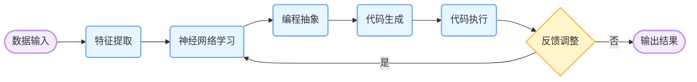

# 神经编程范式:增强AI系统的可编程性

> 关键词：神经编程范式、AI系统、可编程性、深度学习、神经网络

> 摘要：本文围绕神经编程范式展开，旨在探讨如何通过这一范式增强AI系统的可编程性。首先介绍了神经编程范式的背景，包括其目的、预期读者、文档结构和相关术语。接着详细阐述了核心概念、算法原理、数学模型等内容，通过Python代码进行了原理的详细讲解。然后给出了项目实战案例，包括开发环境搭建、代码实现与解读。之后探讨了神经编程范式的实际应用场景，推荐了相关的学习资源、开发工具和论文著作。最后对神经编程范式的未来发展趋势与挑战进行了总结，并提供了常见问题解答和扩展阅读参考资料，为读者全面深入了解神经编程范式提供了丰富的信息。

## 1. 背景介绍 
### 1.1 目的和范围
随着人工智能技术的飞速发展，传统的编程范式在处理复杂的认知和决策任务时面临诸多挑战。神经编程范式作为一种新兴的编程理念，旨在将神经网络的强大学习能力与传统编程的精确控制相结合，以增强AI系统的可编程性。本文的目的是深入探讨神经编程范式的核心概念、算法原理、数学模型以及实际应用，为研究者、开发者和对AI技术感兴趣的读者提供全面的技术指导。范围涵盖了从理论基础到实际项目开发的各个方面，包括神经编程范式的基本原理、实现步骤、应用场景以及相关的工具和资源。

### 1.2 预期读者
本文预期读者包括人工智能领域的研究者、软件开发工程师、机器学习爱好者以及对新兴编程范式感兴趣的技术人员。对于正在从事AI系统开发的专业人士，本文将提供新的思路和方法来增强系统的可编程性；对于初学者，本文将帮助他们建立对神经编程范式的基本理解和认识。

### 1.3 文档结构概述
本文共分为十个部分。第一部分为背景介绍，阐述了文章的目的、预期读者、文档结构和术语表；第二部分介绍核心概念与联系，包括神经编程范式的原理和架构，并给出文本示意图和Mermaid流程图；第三部分详细讲解核心算法原理和具体操作步骤，使用Python源代码进行阐述；第四部分介绍数学模型和公式，并进行详细讲解和举例说明；第五部分为项目实战，包括开发环境搭建、源代码实现和代码解读；第六部分探讨实际应用场景；第七部分推荐相关的工具和资源，包括学习资源、开发工具框架和论文著作；第八部分总结未来发展趋势与挑战；第九部分为附录，解答常见问题；第十部分提供扩展阅读和参考资料。

### 1.4 术语表
#### 1.4.1 核心术语定义
- **神经编程范式**：一种将神经网络与传统编程相结合的编程理念，通过神经网络的学习能力来增强AI系统的可编程性。
- **AI系统**：人工智能系统，是指能够模拟人类智能进行感知、学习、推理和决策的计算机系统。
- **可编程性**：指系统能够根据用户的需求进行编程和定制，以实现特定的功能和任务。
- **深度学习**：一种基于神经网络的机器学习方法，通过多层神经网络对数据进行学习和特征提取。
- **神经网络**：由大量神经元组成的计算模型，能够自动学习数据中的模式和规律。

#### 1.4.2 相关概念解释
- **传统编程范式**：基于规则和逻辑的编程方法，通过编写明确的指令来实现特定的功能。
- **强化学习**：一种机器学习方法，通过智能体与环境的交互，根据奖励信号来学习最优的行为策略。
- **生成对抗网络（GAN）**：一种深度学习模型，由生成器和判别器组成，用于生成逼真的数据。

#### 1.4.3 缩略词列表
- **AI**：Artificial Intelligence，人工智能
- **ML**：Machine Learning，机器学习
- **DL**：Deep Learning，深度学习
- **NN**：Neural Network，神经网络
- **GAN**：Generative Adversarial Network，生成对抗网络

## 2. 核心概念与联系 
神经编程范式的核心思想是将神经网络的学习能力与传统编程的精确控制相结合，以实现更加灵活和智能的AI系统。在传统编程中，程序员需要手动编写大量的代码来实现特定的功能，而神经编程范式则允许程序通过学习自动生成代码或调整参数，从而提高系统的可编程性和适应性。

### 核心概念原理
神经编程范式主要基于以下几个核心概念：
- **神经网络**：作为学习的基础，神经网络能够自动学习数据中的模式和规律。通过训练神经网络，可以让其学习到输入和输出之间的映射关系，从而实现预测、分类等任务。
- **编程抽象**：将编程任务抽象为一系列的操作和规则，使得神经网络可以对这些抽象表示进行学习和处理。例如，可以将代码的语法结构和语义信息进行抽象，让神经网络学习如何生成符合语法和语义要求的代码。
- **强化学习**：通过智能体与环境的交互，根据奖励信号来学习最优的行为策略。在神经编程范式中，可以使用强化学习来训练神经网络生成最优的代码或决策。

### 架构的文本示意图
神经编程范式的架构可以分为以下几个主要部分：
- **数据输入层**：接收原始数据，如文本、图像、传感器数据等。
- **特征提取层**：对输入数据进行特征提取，将其转换为适合神经网络处理的表示形式。
- **神经网络层**：使用神经网络对特征进行学习和处理，生成中间结果或决策。
- **编程抽象层**：将神经网络的输出转换为编程抽象表示，如代码片段、操作序列等。
- **代码生成层**：根据编程抽象表示生成具体的代码或指令。
- **执行层**：执行生成的代码或指令，与环境进行交互，并根据反馈信号进行调整。

### Mermaid流程图


## 3. 核心算法原理 & 具体操作步骤 
### 核心算法原理
神经编程范式的核心算法主要基于深度学习和强化学习。下面以一个简单的代码生成任务为例，介绍核心算法原理。

假设我们要训练一个神经网络来生成符合特定语法规则的代码。我们可以使用循环神经网络（RNN）或长短期记忆网络（LSTM）来处理序列数据。RNN和LSTM能够处理变长的输入序列，并在处理过程中保留序列的上下文信息。

具体来说，我们可以将代码看作是一个字符序列，将每个字符作为输入传递给RNN或LSTM。在每个时间步，网络会根据当前输入和之前的隐藏状态生成一个输出，该输出表示下一个字符的概率分布。我们可以根据这个概率分布选择下一个字符，从而逐步生成代码。

为了训练这个神经网络，我们可以使用监督学习的方法。我们需要准备一个包含大量代码样本的数据集，每个样本包括输入序列和对应的目标输出序列。在训练过程中，我们将输入序列传递给网络，得到网络的输出，然后计算输出与目标输出之间的损失函数。通过反向传播算法，我们可以更新网络的参数，使得损失函数最小化。

### 具体操作步骤
下面是使用Python和PyTorch库实现代码生成的具体操作步骤：

```python
import torch
import torch.nn as nn
import torch.optim as optim

# 定义字符集
chars = sorted(list(set("abcdefghijklmnopqrstuvwxyzABCDEFGHIJKLMNOPQRSTUVWXYZ0123456789.,;:'\"()[]{}+-*/=<> ")))
char_to_idx = {ch: i for i, ch in enumerate(chars)}
idx_to_char = {i: ch for i, ch in enumerate(chars)}

# 定义RNN模型
class RNN(nn.Module):
    def __init__(self, input_size, hidden_size, output_size):
        super(RNN, self).__init__()
        self.hidden_size = hidden_size
        self.embedding = nn.Embedding(input_size, hidden_size)
        self.rnn = nn.RNN(hidden_size, hidden_size)
        self.fc = nn.Linear(hidden_size, output_size)

    def forward(self, input, hidden):
        embedded = self.embedding(input).view(1, 1, -1)
        output, hidden = self.rnn(embedded, hidden)
        output = self.fc(output.view(1, -1))
        return output, hidden

    def init_hidden(self):
        return torch.zeros(1, 1, self.hidden_size)

# 初始化模型
input_size = len(chars)
hidden_size = 128
output_size = len(chars)
model = RNN(input_size, hidden_size, output_size)

# 定义损失函数和优化器
criterion = nn.CrossEntropyLoss()
optimizer = optim.Adam(model.parameters(), lr=0.001)

# 训练模型
def train(input_tensor, target_tensor):
    hidden = model.init_hidden()
    model.zero_grad()
    loss = 0

    for i in range(input_tensor.size(0)):
        output, hidden = model(input_tensor[i], hidden)
        loss += criterion(output, target_tensor[i].unsqueeze(0))

    loss.backward()
    optimizer.step()

    return loss.item()

# 生成代码
def generate_code(start_text, max_length=100):
    with torch.no_grad():
        input_tensor = torch.tensor([char_to_idx[ch] for ch in start_text])
        hidden = model.init_hidden()

        output_text = start_text
        for i in range(max_length):
            if i < len(start_text):
                input_char = input_tensor[i].unsqueeze(0)
            else:
                input_char = output_tensor.argmax().unsqueeze(0)

            output, hidden = model(input_char, hidden)
            output_tensor = nn.functional.softmax(output, dim=1)
            next_char_idx = torch.multinomial(output_tensor, 1).item()
            next_char = idx_to_char[next_char_idx]
            output_text += next_char

    return output_text

# 示例训练数据
training_data = ["print('Hello, World!')", "x = 1 + 2"]
input_sequences = []
target_sequences = []

for data in training_data:
    input_seq = [char_to_idx[ch] for ch in data[:-1]]
    target_seq = [char_to_idx[ch] for ch in data[1:]]
    input_sequences.append(torch.tensor(input_seq))
    target_sequences.append(torch.tensor(target_seq))

# 训练模型
num_epochs = 100
for epoch in range(num_epochs):
    for input_tensor, target_tensor in zip(input_sequences, target_sequences):
        loss = train(input_tensor, target_tensor)
    if (epoch + 1) % 10 == 0:
        print(f'Epoch {epoch + 1}/{num_epochs}, Loss: {loss:.4f}')

# 生成代码
start_text = "pri"
generated_code = generate_code(start_text)
print(f'Generated code: {generated_code}')
```

### 代码解释
1. **字符集定义**：定义了一个包含所有可能字符的字符集，并创建了字符到索引和索引到字符的映射。
2. **RNN模型定义**：定义了一个简单的RNN模型，包括嵌入层、RNN层和全连接层。
3. **训练函数**：定义了训练函数，用于计算损失并更新模型参数。
4. **生成函数**：定义了生成函数，用于根据起始文本生成代码。
5. **训练数据处理**：将训练数据转换为输入序列和目标序列。
6. **模型训练**：使用训练数据对模型进行训练。
7. **代码生成**：使用训练好的模型生成代码。

## 4. 数学模型和公式 & 详细讲解 & 举例说明 
### 数学模型
在神经编程范式中，我们可以使用多种数学模型来描述神经网络的学习过程。下面以简单的前馈神经网络为例，介绍其数学模型。

假设我们有一个输入向量 $\mathbf{x} \in \mathbb{R}^n$，一个隐藏层包含 $m$ 个神经元，一个输出向量 $\mathbf{y} \in \mathbb{R}^k$。前馈神经网络的数学模型可以表示为：

$$
\mathbf{h} = f(\mathbf{W}_1\mathbf{x} + \mathbf{b}_1)
$$

$$
\mathbf{y} = g(\mathbf{W}_2\mathbf{h} + \mathbf{b}_2)
$$

其中，$\mathbf{W}_1 \in \mathbb{R}^{m \times n}$ 是输入层到隐藏层的权重矩阵，$\mathbf{b}_1 \in \mathbb{R}^m$ 是隐藏层的偏置向量，$\mathbf{W}_2 \in \mathbb{R}^{k \times m}$ 是隐藏层到输出层的权重矩阵，$\mathbf{b}_2 \in \mathbb{R}^k$ 是输出层的偏置向量，$f$ 和 $g$ 分别是隐藏层和输出层的激活函数。

### 损失函数
为了训练神经网络，我们需要定义一个损失函数来衡量网络输出与目标输出之间的差异。常见的损失函数包括均方误差（MSE）和交叉熵损失（Cross-Entropy Loss）。

- **均方误差（MSE）**：适用于回归问题，定义为：

$$
L_{MSE} = \frac{1}{N} \sum_{i=1}^{N} (\mathbf{y}_i - \hat{\mathbf{y}}_i)^2
$$

其中，$N$ 是样本数量，$\mathbf{y}_i$ 是目标输出，$\hat{\mathbf{y}}_i$ 是网络输出。

- **交叉熵损失（Cross-Entropy Loss）**：适用于分类问题，定义为：

$$
L_{CE} = -\frac{1}{N} \sum_{i=1}^{N} \sum_{j=1}^{k} y_{ij} \log(\hat{y}_{ij})
$$

其中，$y_{ij}$ 是目标输出的第 $j$ 个类别概率，$\hat{y}_{ij}$ 是网络输出的第 $j$ 个类别概率。

### 反向传播算法
为了更新神经网络的参数，我们可以使用反向传播算法。反向传播算法的核心思想是通过链式法则计算损失函数对每个参数的梯度，然后使用梯度下降法更新参数。

假设我们要更新权重矩阵 $\mathbf{W}_2$，根据链式法则，损失函数对 $\mathbf{W}_2$ 的梯度可以表示为：

$$
\frac{\partial L}{\partial \mathbf{W}_2} = \frac{\partial L}{\partial \mathbf{y}} \frac{\partial \mathbf{y}}{\partial \mathbf{W}_2}
$$

其中，$\frac{\partial L}{\partial \mathbf{y}}$ 是损失函数对输出向量 $\mathbf{y}$ 的梯度，$\frac{\partial \mathbf{y}}{\partial \mathbf{W}_2}$ 是输出向量 $\mathbf{y}$ 对权重矩阵 $\mathbf{W}_2$ 的梯度。

### 举例说明
假设我们有一个简单的二分类问题，输入向量 $\mathbf{x} = [x_1, x_2]$，目标输出 $y \in \{0, 1\}$。我们使用一个包含一个隐藏层的前馈神经网络来解决这个问题。

输入层到隐藏层的权重矩阵 $\mathbf{W}_1 = \begin{bmatrix} w_{11} & w_{12} \\ w_{21} & w_{22} \end{bmatrix}$，隐藏层到输出层的权重矩阵 $\mathbf{W}_2 = [w_{31}, w_{32}]$，隐藏层的偏置向量 $\mathbf{b}_1 = [b_1, b_2]$，输出层的偏置向量 $b_2$。

隐藏层的输出 $\mathbf{h} = [h_1, h_2]$ 可以表示为：

$$
h_1 = f(w_{11}x_1 + w_{12}x_2 + b_1)
$$

$$
h_2 = f(w_{21}x_1 + w_{22}x_2 + b_2)
$$

其中，$f$ 是激活函数，例如 sigmoid 函数。

输出层的输出 $\hat{y}$ 可以表示为：

$$
\hat{y} = g(w_{31}h_1 + w_{32}h_2 + b_2)
$$

其中，$g$ 是激活函数，例如 sigmoid 函数。

假设我们使用交叉熵损失函数，损失函数可以表示为：

$$
L = -y \log(\hat{y}) - (1 - y) \log(1 - \hat{y})
$$

通过反向传播算法，我们可以计算损失函数对每个参数的梯度，并使用梯度下降法更新参数，使得损失函数最小化。

## 5. 项目实战：代码实际案例和详细解释说明 
### 5.1  开发环境搭建
为了实现神经编程范式的项目，我们需要搭建相应的开发环境。以下是具体的步骤：

#### 安装Python
首先，确保你已经安装了Python。建议使用Python 3.6或更高版本。你可以从Python官方网站（https://www.python.org/downloads/）下载并安装Python。

#### 安装深度学习框架
我们选择使用PyTorch作为深度学习框架。可以使用以下命令安装PyTorch：

```bash
pip install torch torchvision
```

#### 安装其他依赖库
根据项目的具体需求，可能还需要安装其他依赖库，如NumPy、Matplotlib等。可以使用以下命令安装：

```bash
pip install numpy matplotlib
```

### 5.2  源代码详细实现和代码解读
下面我们以一个简单的图像分类任务为例，展示神经编程范式的实际应用。

```python
import torch
import torch.nn as nn
import torch.optim as optim
import torchvision
import torchvision.transforms as transforms

# 数据预处理
transform = transforms.Compose(
    [transforms.ToTensor(),
     transforms.Normalize((0.5, 0.5, 0.5), (0.5, 0.5, 0.5))])

# 加载数据集
trainset = torchvision.datasets.CIFAR10(root='./data', train=True,
                                        download=True, transform=transform)
trainloader = torch.utils.data.DataLoader(trainset, batch_size=4,
                                          shuffle=True, num_workers=2)

testset = torchvision.datasets.CIFAR10(root='./data', train=False,
                                       download=True, transform=transform)
testloader = torch.utils.data.DataLoader(testset, batch_size=4,
                                         shuffle=False, num_workers=2)

classes = ('plane', 'car', 'bird', 'cat',
           'deer', 'dog', 'frog', 'horse', 'ship', 'truck')

# 定义神经网络模型
class Net(nn.Module):
    def __init__(self):
        super(Net, self).__init__()
        self.conv1 = nn.Conv2d(3, 6, 5)
        self.pool = nn.MaxPool2d(2, 2)
        self.conv2 = nn.Conv2d(6, 16, 5)
        self.fc1 = nn.Linear(16 * 5 * 5, 120)
        self.fc2 = nn.Linear(120, 84)
        self.fc3 = nn.Linear(84, 10)

    def forward(self, x):
        x = self.pool(torch.relu(self.conv1(x)))
        x = self.pool(torch.relu(self.conv2(x)))
        x = x.view(-1, 16 * 5 * 5)
        x = torch.relu(self.fc1(x))
        x = torch.relu(self.fc2(x))
        x = self.fc3(x)
        return x

net = Net()

# 定义损失函数和优化器
criterion = nn.CrossEntropyLoss()
optimizer = optim.SGD(net.parameters(), lr=0.001, momentum=0.9)

# 训练模型
for epoch in range(2):  # 训练2个epoch
    running_loss = 0.0
    for i, data in enumerate(trainloader, 0):
        # 获取输入数据
        inputs, labels = data

        # 梯度清零
        optimizer.zero_grad()

        # 前向传播 + 反向传播 + 优化
        outputs = net(inputs)
        loss = criterion(outputs, labels)
        loss.backward()
        optimizer.step()

        # 打印统计信息
        running_loss += loss.item()
        if i % 2000 == 1999:    # 每2000个小批量打印一次
            print(f'[{epoch + 1}, {i + 1:5d}] loss: {running_loss / 2000:.3f}')
            running_loss = 0.0

print('Finished Training')

# 测试模型
correct = 0
total = 0
with torch.no_grad():
    for data in testloader:
        images, labels = data
        outputs = net(images)
        _, predicted = torch.max(outputs.data, 1)
        total += labels.size(0)
        correct += (predicted == labels).sum().item()

print(f'Accuracy of the network on the 10000 test images: {100 * correct / total} %')
```

### 5.3  代码解读与分析
1. **数据预处理**：使用 `transforms.Compose` 函数定义了数据预处理的步骤，包括将图像转换为张量和归一化处理。
2. **数据集加载**：使用 `torchvision.datasets.CIFAR10` 加载CIFAR-10数据集，并使用 `torch.utils.data.DataLoader` 创建数据加载器。
3. **神经网络模型定义**：定义了一个简单的卷积神经网络模型 `Net`，包括两个卷积层、两个池化层和三个全连接层。
4. **损失函数和优化器定义**：使用交叉熵损失函数 `nn.CrossEntropyLoss` 和随机梯度下降优化器 `optim.SGD`。
5. **模型训练**：通过循环迭代训练数据集，进行前向传播、反向传播和参数更新。
6. **模型测试**：使用测试数据集评估模型的准确率。

通过这个项目实战，我们可以看到神经编程范式在图像分类任务中的应用，通过定义神经网络模型、损失函数和优化器，实现了模型的训练和测试。

## 6. 实际应用场景 
神经编程范式具有广泛的实际应用场景，以下是一些常见的应用场景：

### 代码生成
神经编程范式可以用于自动生成代码。通过训练神经网络学习代码的语法和语义，网络可以根据输入的需求生成符合要求的代码。例如，自动生成数据库查询语句、机器学习模型代码等。

### 智能编程助手
智能编程助手可以根据程序员的输入提供代码建议、错误提示和代码补全功能。神经编程范式可以用于训练智能编程助手，使其能够理解程序员的意图，并提供更加智能和准确的建议。

### 机器人控制
在机器人控制领域，神经编程范式可以用于实现机器人的自主决策和动作规划。通过训练神经网络学习机器人的环境感知和动作策略，机器人可以根据不同的环境条件自动调整行为。

### 自然语言处理
在自然语言处理中，神经编程范式可以用于文本生成、机器翻译、问答系统等任务。例如，训练神经网络生成自然语言文本，实现智能聊天机器人。

### 图像和视频处理
在图像和视频处理领域，神经编程范式可以用于图像分类、目标检测、图像生成等任务。例如，训练神经网络对图像进行分类，识别图像中的物体。

## 7. 工具和资源推荐
### 7.1 学习资源推荐
#### 7.1.1 书籍推荐
- 《深度学习》（Deep Learning）：由Ian Goodfellow、Yoshua Bengio和Aaron Courville合著，是深度学习领域的经典教材，涵盖了深度学习的基本概念、算法和应用。
- 《Python深度学习》（Deep Learning with Python）：由Francois Chollet著，介绍了如何使用Python和Keras库进行深度学习开发，适合初学者。
- 《动手学深度学习》（Dive into Deep Learning）：由 Aston Zhang、Zack C. Lipton、Mu Li和Alex J. Smola合著，提供了丰富的代码示例和实践项目，帮助读者快速上手深度学习。

#### 7.1.2 在线课程
- Coursera上的“深度学习专项课程”（Deep Learning Specialization）：由Andrew Ng教授授课，包括五门课程，全面介绍了深度学习的各个方面。
- edX上的“使用Python进行深度学习”（Introduction to Deep Learning with Python）：由Microsoft提供，适合初学者了解深度学习的基本概念和Python实现。
- 哔哩哔哩上的“李宏毅机器学习”课程：由台湾大学李宏毅教授授课，讲解生动有趣，适合初学者入门。

#### 7.1.3 技术博客和网站
- Medium：有许多深度学习领域的优秀博客文章，涵盖了最新的研究成果和实践经验。
- arXiv：提供了大量的学术论文，包括深度学习领域的最新研究进展。
- TensorFlow官方博客：提供了TensorFlow框架的最新动态和应用案例。

### 7.2 开发工具框架推荐
#### 7.2.1 IDE和编辑器
- PyCharm：一款专业的Python集成开发环境，提供了丰富的代码编辑、调试和分析功能。
- Jupyter Notebook：一个交互式的开发环境，适合进行数据分析和深度学习实验。
- Visual Studio Code：一款轻量级的代码编辑器，支持多种编程语言和插件扩展。

#### 7.2.2 调试和性能分析工具
- TensorBoard：TensorFlow提供的可视化工具，用于监控模型训练过程和分析模型性能。
- PyTorch Profiler：PyTorch提供的性能分析工具，用于分析模型的计算性能和内存使用情况。
- NVIDIA Nsight Systems：一款用于GPU性能分析的工具，可帮助开发者优化深度学习模型的性能。

#### 7.2.3 相关框架和库
- TensorFlow：一个广泛使用的深度学习框架，提供了丰富的工具和库，支持分布式训练和模型部署。
- PyTorch：一个动态图深度学习框架，易于使用和调试，适合研究和开发。
- Keras：一个高级神经网络API，基于TensorFlow、Theano等后端，简单易用，适合快速原型开发。

### 7.3 相关论文著作推荐
#### 7.3.1 经典论文
- “Gradient-based learning applied to document recognition”：由Yann LeCun等人发表，介绍了卷积神经网络（CNN）在手写字符识别中的应用，是CNN的经典论文。
- “Long Short-Term Memory”：由Sepp Hochreiter和Jürgen Schmidhuber发表，提出了长短期记忆网络（LSTM），解决了循环神经网络（RNN）的梯度消失问题。
- “Generative Adversarial Nets”：由Ian Goodfellow等人发表，提出了生成对抗网络（GAN），是生成模型领域的重要突破。

#### 7.3.2 最新研究成果
- 关注顶级学术会议，如NeurIPS、ICML、CVPR等，这些会议上发表的论文代表了深度学习领域的最新研究成果。
- 关注知名研究机构和学者的研究动态，如OpenAI、Google Brain、Yoshua Bengio等。

#### 7.3.3 应用案例分析
- 研究实际应用中的深度学习案例，如AlphaGo、自动驾驶汽车、智能语音助手等，了解深度学习在不同领域的应用和挑战。

## 8. 总结：未来发展趋势与挑战
### 未来发展趋势
- **融合多种技术**：神经编程范式将与其他技术，如强化学习、迁移学习、元学习等深度融合，实现更加智能和灵活的AI系统。
- **跨领域应用**：神经编程范式将在更多领域得到应用，如医疗、金融、交通等，为各行业带来创新和变革。
- **自动化编程**：随着神经编程范式的发展，自动化编程将成为可能，程序员可以通过自然语言描述需求，让系统自动生成代码。
- **硬件支持**：硬件技术的不断发展将为神经编程范式提供更强大的计算支持，加速模型的训练和推理过程。

### 挑战
- **可解释性问题**：神经网络的黑盒特性使得其决策过程难以解释，这在一些对安全性和可靠性要求较高的领域是一个重要挑战。
- **数据隐私和安全**：神经编程范式需要大量的数据进行训练，数据的隐私和安全问题需要得到重视。
- **计算资源需求**：深度学习模型的训练需要大量的计算资源，如何降低计算成本和提高计算效率是一个挑战。
- **人才短缺**：神经编程范式是一个新兴领域，相关的专业人才短缺，需要加强人才培养和教育。

## 9. 附录：常见问题与解答
### 问题1：神经编程范式与传统编程范式有什么区别？
神经编程范式将神经网络的学习能力与传统编程的精确控制相结合，允许程序通过学习自动生成代码或调整参数，而传统编程范式需要程序员手动编写明确的指令来实现特定的功能。

### 问题2：神经编程范式适用于哪些类型的任务？
神经编程范式适用于处理复杂的认知和决策任务，如代码生成、智能编程助手、机器人控制、自然语言处理、图像和视频处理等。

### 问题3：如何选择合适的深度学习框架？
选择深度学习框架时，需要考虑以下因素：易用性、性能、社区支持、生态系统等。如果是初学者，建议选择Keras或PyTorch；如果需要进行大规模的分布式训练，TensorFlow是一个不错的选择。

### 问题4：神经编程范式的训练数据从哪里获取？
训练数据可以从公开数据集、企业内部数据、网络爬虫等途径获取。在使用数据时，需要注意数据的质量、多样性和合法性。

### 问题5：如何解决神经网络的可解释性问题？
目前有一些方法可以提高神经网络的可解释性，如特征重要性分析、决策树集成、可视化技术等。此外，研究人员也在不断探索新的可解释性方法。

## 10. 扩展阅读 & 参考资料
### 扩展阅读
- 《人工智能：现代方法》（Artificial Intelligence: A Modern Approach）：全面介绍了人工智能的各个方面，包括搜索算法、知识表示、机器学习等。
- 《机器学习》（Machine Learning）：由Tom M. Mitchell著，是机器学习领域的经典教材，涵盖了机器学习的基本概念、算法和应用。
- 《神经网络与深度学习》（Neural Networks and Deep Learning）：由Michael Nielsen著，提供了神经网络和深度学习的在线教程和代码实现。

### 参考资料
- Goodfellow, I., Bengio, Y., & Courville, A. (2016). Deep Learning. MIT Press.
- Chollet, F. (2017). Deep Learning with Python. Manning Publications.
- Zhang, A., Lipton, Z. C., Li, M., & Smola, A. J. (2020). Dive into Deep Learning. Aston Zhang.

作者：AI天才研究院/AI Genius Institute & 禅与计算机程序设计艺术 /Zen And The Art of Computer Programming