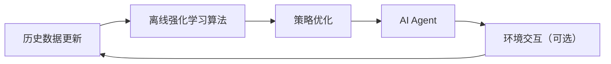

# 离线强化学习：利用历史数据训练AI Agent

> 关键词：离线强化学习、历史数据、AI Agent、策略优化、数据利用

> 摘要：本文聚焦于离线强化学习这一前沿技术，深入探讨如何利用历史数据来训练AI Agent。首先介绍了离线强化学习的背景，包括目的、预期读者、文档结构和相关术语。接着阐述了核心概念与联系，通过文本示意图和Mermaid流程图进行直观展示。详细讲解了核心算法原理，并使用Python源代码进行说明，同时给出了数学模型和公式。在项目实战部分，通过实际案例展示了开发环境搭建、源代码实现和代码解读。还分析了离线强化学习的实际应用场景，推荐了学习资源、开发工具框架和相关论文著作。最后总结了未来发展趋势与挑战，并提供了常见问题解答和扩展阅读参考资料，旨在为读者全面深入地理解离线强化学习提供帮助。

## 1. 背景介绍 
### 1.1 目的和范围
传统的强化学习通常需要Agent与环境进行实时交互来收集数据并更新策略，这种方式在很多实际场景中存在局限性，例如在一些高风险或成本高昂的环境中，如自动驾驶、医疗保健等领域，直接让Agent进行大量的实时探索是不可行的。离线强化学习的出现为解决这一问题提供了有效途径，其目的是利用已经收集好的历史数据来训练AI Agent，从而避免或减少与环境的实时交互。

本文的范围涵盖了离线强化学习的基本概念、核心算法原理、数学模型、实际应用案例，以及相关的工具和资源推荐等方面。通过对这些内容的详细阐述，帮助读者全面了解离线强化学习的理论和实践。

### 1.2 预期读者
本文的预期读者包括对强化学习领域感兴趣的研究人员、从事人工智能相关工作的工程师、高校计算机科学及相关专业的学生等。无论是初学者希望了解离线强化学习的基本概念，还是有一定经验的从业者想要深入研究其算法原理和实际应用，都能从本文中获得有价值的信息。

### 1.3 文档结构概述
本文将按照以下结构进行组织：首先介绍离线强化学习的背景知识，包括目的、预期读者、文档结构和术语表；接着阐述核心概念与联系，通过文本示意图和流程图进行直观展示；详细讲解核心算法原理，并使用Python源代码进行说明；给出数学模型和公式，并通过具体例子进行解释；通过项目实战展示如何在实际中应用离线强化学习；分析离线强化学习的实际应用场景；推荐相关的学习资源、开发工具框架和论文著作；最后总结未来发展趋势与挑战，提供常见问题解答和扩展阅读参考资料。

### 1.4 术语表
#### 1.4.1 核心术语定义
- **离线强化学习（Offline Reinforcement Learning）**：一种强化学习范式，它仅使用预先收集好的历史数据来训练AI Agent，而无需Agent与环境进行实时交互。
- **AI Agent**：在强化学习中，能够感知环境状态并根据一定的策略采取行动的智能体。
- **历史数据**：在离线强化学习中，指的是在过去的交互过程中已经收集好的状态、动作、奖励等数据。
- **策略（Policy）**：Agent根据当前环境状态选择动作的规则，通常用 $\pi(a|s)$ 表示在状态 $s$ 下选择动作 $a$ 的概率。
- **价值函数（Value Function）**：用于评估在某个状态下或某个状态 - 动作对下的预期累积奖励，常见的有状态价值函数 $V(s)$ 和动作价值函数 $Q(s,a)$。

#### 1.4.2 相关概念解释
- **在线强化学习（Online Reinforcement Learning）**：与离线强化学习相对，在线强化学习需要Agent在训练过程中不断与环境进行实时交互，根据交互得到的数据更新策略。
- **数据分布不匹配**：在离线强化学习中，由于使用的是历史数据，这些数据的分布可能与Agent在新策略下产生的数据分布不一致，这会给训练带来挑战。

#### 1.4.3 缩略词列表
- **RL**：Reinforcement Learning，强化学习
- **OPE**：Off - Policy Evaluation，离线策略评估
- **D4RL**：Dataset - Driven Deep Reinforcement Learning，数据集驱动的深度强化学习

## 2. 核心概念与联系 
离线强化学习的核心在于利用历史数据来学习一个最优策略，使得AI Agent在未来的环境中能够获得最大的累积奖励。其基本架构可以用以下文本示意图描述：

```
历史数据（状态、动作、奖励） -> 离线强化学习算法 -> 策略优化 -> AI Agent
```

具体来说，历史数据是离线强化学习的基础，这些数据包含了环境状态、Agent采取的动作以及相应的奖励信息。离线强化学习算法通过对这些历史数据的分析和处理，尝试找到一个最优的策略。策略优化是离线强化学习的关键步骤，通过不断调整策略参数，使得策略在历史数据上表现出更好的性能。最终得到的优化策略被应用到AI Agent上，使得Agent在未来的环境中能够做出更优的决策。

下面是使用Mermaid绘制的流程图：

这个流程图展示了离线强化学习的基本流程。历史数据作为输入进入离线强化学习算法，经过算法处理后进行策略优化，得到优化后的策略应用到AI Agent上。在某些情况下，Agent可以与环境进行交互，将新的数据加入到历史数据中，从而实现数据的更新和算法的进一步优化。

## 3. 核心算法原理 & 具体操作步骤 
离线强化学习有多种核心算法，这里以基于价值函数的Fitted Q - Iteration（FQI）算法为例进行详细讲解。

### 算法原理
Fitted Q - Iteration算法的基本思想是通过迭代的方式不断更新动作价值函数 $Q(s,a)$。具体来说，它从一个初始的动作价值函数 $Q_0(s,a)$ 开始，在每一轮迭代中，使用历史数据来拟合一个新的动作价值函数 $Q_{k + 1}(s,a)$，使得 $Q_{k + 1}(s,a)$ 尽可能接近Bellman方程的右侧。

Bellman方程为：
$$Q^*(s,a) = r(s,a)+\gamma\mathbb{E}_{s'\sim p(s'|s,a)}[\max_{a'}Q^*(s',a')]$$
其中，$Q^*(s,a)$ 是最优动作价值函数，$r(s,a)$ 是在状态 $s$ 下采取动作 $a$ 获得的奖励，$\gamma$ 是折扣因子，$s'$ 是下一个状态，$p(s'|s,a)$ 是状态转移概率。

Fitted Q - Iteration算法通过最小化以下损失函数来更新动作价值函数：
$$\mathcal{L}(Q_{k + 1})=\sum_{(s,a,r,s')\in\mathcal{D}}(Q_{k + 1}(s,a)-(r+\gamma\max_{a'}Q_k(s',a')))^2$$
其中，$\mathcal{D}$ 是历史数据集。

### 具体操作步骤
1. **初始化**：选择一个初始的动作价值函数 $Q_0(s,a)$，通常可以将其初始化为零。
2. **迭代更新**：
    - 对于每一轮迭代 $k = 0,1,2,\cdots$：
        - 对于历史数据集中的每个样本 $(s,a,r,s')$，计算目标值 $y = r+\gamma\max_{a'}Q_k(s',a')$。
        - 使用回归模型（如神经网络）拟合 $Q_{k + 1}(s,a)$，使得 $\sum_{(s,a,r,s')\in\mathcal{D}}(Q_{k + 1}(s,a)-y)^2$ 最小。
3. **终止条件**：当迭代次数达到预设的最大值或者 $Q_{k + 1}(s,a)$ 与 $Q_k(s,a)$ 的差异小于某个阈值时，停止迭代。

### Python源代码实现
```python
import numpy as np
import torch
import torch.nn as nn
import torch.optim as optim

# 定义Q网络
class QNetwork(nn.Module):
    def __init__(self, state_dim, action_dim):
        super(QNetwork, self).__init__()
        self.fc1 = nn.Linear(state_dim, 64)
        self.fc2 = nn.Linear(64, 64)
        self.fc3 = nn.Linear(64, action_dim)

    def forward(self, x):
        x = torch.relu(self.fc1(x))
        x = torch.relu(self.fc2(x))
        return self.fc3(x)

# Fitted Q - Iteration算法
def fitted_q_iteration(data, state_dim, action_dim, gamma=0.99, num_iterations=100):
    # 初始化Q网络
    q_network = QNetwork(state_dim, action_dim)
    optimizer = optim.Adam(q_network.parameters(), lr=0.001)

    for iteration in range(num_iterations):
        states, actions, rewards, next_states = data[:, :state_dim], data[:, state_dim], data[:, state_dim + 1], data[:, state_dim + 2:]
        states = torch.FloatTensor(states)
        actions = torch.LongTensor(actions)
        rewards = torch.FloatTensor(rewards)
        next_states = torch.FloatTensor(next_states)

        # 计算目标值
        with torch.no_grad():
            next_q_values = q_network(next_states)
            max_next_q_values = torch.max(next_q_values, dim=1)[0]
            targets = rewards + gamma * max_next_q_values

        # 计算当前Q值
        q_values = q_network(states)
        current_q_values = q_values.gather(1, actions.unsqueeze(1)).squeeze(1)

        # 计算损失
        loss = nn.MSELoss()(current_q_values, targets)

        # 更新Q网络
        optimizer.zero_grad()
        loss.backward()
        optimizer.step()

        if iteration % 10 == 0:
            print(f'Iteration {iteration}, Loss: {loss.item()}')

    return q_network

# 示例数据
state_dim = 2
action_dim = 2
num_samples = 100
data = np.random.randn(num_samples, state_dim + 1 + 1 + state_dim)

# 运行Fitted Q - Iteration算法
q_network = fitted_q_iteration(data, state_dim, action_dim)
```
在上述代码中，首先定义了一个简单的Q网络 `QNetwork`，它由三个全连接层组成。然后实现了Fitted Q - Iteration算法 `fitted_q_iteration`，在每一轮迭代中，计算目标值和当前Q值，通过最小化均方误差损失来更新Q网络的参数。最后，使用示例数据运行该算法并输出损失信息。

## 4. 数学模型和公式 & 详细讲解 & 举例说明 
### 数学模型
离线强化学习的核心数学模型基于马尔可夫决策过程（MDP），一个MDP可以用一个五元组 $\langle\mathcal{S},\mathcal{A},p,r,\gamma\rangle$ 表示，其中：
- $\mathcal{S}$ 是状态空间，包含了环境的所有可能状态。
- $\mathcal{A}$ 是动作空间，包含了Agent可以采取的所有可能动作。
- $p(s'|s,a)$ 是状态转移概率，表示在状态 $s$ 下采取动作 $a$ 后转移到状态 $s'$ 的概率。
- $r(s,a)$ 是奖励函数，表示在状态 $s$ 下采取动作 $a$ 获得的即时奖励。
- $\gamma\in[0,1]$ 是折扣因子，用于权衡即时奖励和未来奖励的重要性。

### 核心公式
#### 动作价值函数
动作价值函数 $Q^{\pi}(s,a)$ 表示在策略 $\pi$ 下，从状态 $s$ 采取动作 $a$ 后，预期的累积折扣奖励：
$$Q^{\pi}(s,a)=\mathbb{E}_{\tau\sim\pi}[ \sum_{t = 0}^{\infty}\gamma^t r(s_t,a_t)|s_0 = s,a_0 = a]$$
其中，$\tau=(s_0,a_0,r_0,s_1,a_1,r_1,\cdots)$ 是一个轨迹，$s_t$ 和 $a_t$ 分别是时刻 $t$ 的状态和动作，$r_t$ 是时刻 $t$ 的奖励。

#### Bellman方程
Bellman方程描述了动作价值函数的递归关系：
$$Q^{\pi}(s,a)=r(s,a)+\gamma\mathbb{E}_{s'\sim p(s'|s,a)}[Q^{\pi}(s',\pi(s'))]$$
对于最优策略 $\pi^*$，最优动作价值函数 $Q^*(s,a)$ 满足Bellman最优方程：
$$Q^*(s,a)=r(s,a)+\gamma\mathbb{E}_{s'\sim p(s'|s,a)}[\max_{a'}Q^*(s',a')]$$

### 详细讲解
动作价值函数 $Q^{\pi}(s,a)$ 衡量了在策略 $\pi$ 下，从状态 $s$ 采取动作 $a$ 的好坏程度。Bellman方程则将当前状态 - 动作对的价值与下一个状态的价值联系起来，它是强化学习中许多算法的基础。

在离线强化学习中，由于无法直接与环境交互来估计 $Q^{\pi}(s,a)$，我们需要利用历史数据来近似求解。例如，在Fitted Q - Iteration算法中，通过最小化损失函数来拟合动作价值函数，使得它尽可能接近Bellman方程的右侧。

### 举例说明
考虑一个简单的网格世界环境，Agent在一个 $3\times3$ 的网格中移动，目标是到达右下角的网格。状态空间 $\mathcal{S}$ 包含了网格中的所有位置，动作空间 $\mathcal{A}=\{\text{上},\text{下},\text{左},\text{右}\}$。奖励函数 $r(s,a)$ 在到达目标位置时为1，否则为0。折扣因子 $\gamma = 0.9$。

假设我们有一些历史数据，记录了Agent在网格世界中的移动轨迹。我们可以使用Fitted Q - Iteration算法来学习一个最优策略。在每一轮迭代中，根据历史数据计算目标值 $y = r+\gamma\max_{a'}Q_k(s',a')$，然后使用神经网络拟合 $Q_{k + 1}(s,a)$，使得它尽可能接近目标值。通过多次迭代，最终得到一个接近最优的动作价值函数，从而可以根据这个函数选择最优动作。

## 5. 项目实战：代码实际案例和详细解释说明 
### 5.1  开发环境搭建
为了实现离线强化学习项目，我们需要搭建一个合适的开发环境。以下是具体步骤：

#### 安装Python
首先，确保你已经安装了Python，建议使用Python 3.7及以上版本。你可以从Python官方网站（https://www.python.org/downloads/）下载并安装Python。

#### 创建虚拟环境
为了避免不同项目之间的依赖冲突，建议使用虚拟环境。可以使用 `venv` 或 `conda` 来创建虚拟环境。

使用 `venv` 创建虚拟环境的命令如下：
```bash
python -m venv offline_rl_env
source offline_rl_env/bin/activate  # 对于Linux/Mac
offline_rl_env\Scripts\activate  # 对于Windows
```

#### 安装必要的库
在虚拟环境中，安装以下必要的库：
```bash
pip install numpy torch gym
```
- `numpy`：用于数值计算。
- `torch`：PyTorch深度学习框架，用于构建和训练神经网络。
- `gym`：OpenAI Gym是一个用于开发和比较强化学习算法的工具包，提供了各种环境。

### 5.2  源代码详细实现和代码解读
以下是一个使用OpenAI Gym的CartPole环境进行离线强化学习的示例代码：

```python
import gym
import numpy as np
import torch
import torch.nn as nn
import torch.optim as optim

# 定义Q网络
class QNetwork(nn.Module):
    def __init__(self, state_dim, action_dim):
        super(QNetwork, self).__init__()
        self.fc1 = nn.Linear(state_dim, 64)
        self.fc2 = nn.Linear(64, 64)
        self.fc3 = nn.Linear(64, action_dim)

    def forward(self, x):
        x = torch.relu(self.fc1(x))
        x = torch.relu(self.fc2(x))
        return self.fc3(x)

# 收集历史数据
def collect_data(env, num_episodes, max_steps):
    data = []
    for episode in range(num_episodes):
        state = env.reset()
        for step in range(max_steps):
            action = env.action_space.sample()
            next_state, reward, done, _ = env.step(action)
            data.append(np.concatenate([state, [action], [reward], next_state]))
            state = next_state
            if done:
                break
    return np.array(data)

# Fitted Q - Iteration算法
def fitted_q_iteration(data, state_dim, action_dim, gamma=0.99, num_iterations=100):
    # 初始化Q网络
    q_network = QNetwork(state_dim, action_dim)
    optimizer = optim.Adam(q_network.parameters(), lr=0.001)

    for iteration in range(num_iterations):
        states, actions, rewards, next_states = data[:, :state_dim], data[:, state_dim], data[:, state_dim + 1], data[:, state_dim + 2:]
        states = torch.FloatTensor(states)
        actions = torch.LongTensor(actions)
        rewards = torch.FloatTensor(rewards)
        next_states = torch.FloatTensor(next_states)

        # 计算目标值
        with torch.no_grad():
            next_q_values = q_network(next_states)
            max_next_q_values = torch.max(next_q_values, dim=1)[0]
            targets = rewards + gamma * max_next_q_values

        # 计算当前Q值
        q_values = q_network(states)
        current_q_values = q_values.gather(1, actions.unsqueeze(1)).squeeze(1)

        # 计算损失
        loss = nn.MSELoss()(current_q_values, targets)

        # 更新Q网络
        optimizer.zero_grad()
        loss.backward()
        optimizer.step()

        if iteration % 10 == 0:
            print(f'Iteration {iteration}, Loss: {loss.item()}')

    return q_network

# 评估策略
def evaluate_policy(env, q_network, num_episodes, max_steps):
    total_rewards = 0
    for episode in range(num_episodes):
        state = env.reset()
        episode_reward = 0
        for step in range(max_steps):
            state_tensor = torch.FloatTensor(state).unsqueeze(0)
            q_values = q_network(state_tensor)
            action = torch.argmax(q_values, dim=1).item()
            next_state, reward, done, _ = env.step(action)
            episode_reward += reward
            state = next_state
            if done:
                break
        total_rewards += episode_reward
    average_reward = total_rewards / num_episodes
    print(f'Average reward: {average_reward}')

# 主函数
def main():
    env = gym.make('CartPole-v1')
    state_dim = env.observation_space.shape[0]
    action_dim = env.action_space.n

    # 收集历史数据
    num_episodes = 100
    max_steps = 200
    data = collect_data(env, num_episodes, max_steps)

    # 运行Fitted Q - Iteration算法
    q_network = fitted_q_iteration(data, state_dim, action_dim)

    # 评估策略
    evaluate_policy(env, q_network, 10, max_steps)

    env.close()

if __name__ == "__main__":
    main()
```

### 5.3  代码解读与分析
#### 代码结构
代码主要分为以下几个部分：
1. **Q网络定义**：定义了一个简单的三层全连接神经网络 `QNetwork`，用于近似动作价值函数。
2. **数据收集**：`collect_data` 函数使用随机策略在环境中收集历史数据，将状态、动作、奖励和下一个状态存储在一个列表中。
3. **Fitted Q - Iteration算法**：`fitted_q_iteration` 函数实现了Fitted Q - Iteration算法，通过迭代更新Q网络的参数，使得动作价值函数尽可能接近Bellman方程的右侧。
4. **策略评估**：`evaluate_policy` 函数使用训练好的Q网络在环境中进行评估，计算平均奖励。
5. **主函数**：`main` 函数负责初始化环境，收集数据，运行Fitted Q - Iteration算法，并评估策略。

#### 分析
通过这个示例代码，我们可以看到离线强化学习的基本流程。首先，使用随机策略收集历史数据，然后利用这些数据训练Q网络，最后评估训练好的策略在环境中的性能。需要注意的是，由于使用的是随机策略收集的数据，数据的质量可能不高，这会影响训练的效果。在实际应用中，我们可能需要使用更复杂的数据收集方法或数据预处理技术来提高数据的质量。

## 6. 实际应用场景 
离线强化学习在许多实际场景中都有广泛的应用，以下是一些典型的应用场景：

### 自动驾驶
在自动驾驶领域，直接让无人车在真实道路上进行大量的实时探索是非常危险和昂贵的。离线强化学习可以利用已经收集好的人类驾驶数据来训练自动驾驶Agent，使得Agent能够学习到人类驾驶员的优秀驾驶策略。例如，通过分析大量的交通场景数据，让Agent学习如何在不同的路况下做出安全、高效的驾驶决策。

### 医疗保健
在医疗保健领域，离线强化学习可以用于优化治疗方案。通过收集患者的历史病历数据、治疗过程和治疗效果等信息，训练一个AI Agent来为新患者制定个性化的治疗方案。这样可以避免在临床试验中对患者进行不必要的实验，同时提高治疗的效果和效率。

### 金融投资
在金融投资领域，离线强化学习可以利用历史的市场数据来训练投资策略。通过分析股票价格、交易量、宏观经济指标等数据，让AI Agent学习如何在不同的市场条件下进行投资决策，以实现最大化的投资收益。

### 游戏开发
在游戏开发中，离线强化学习可以用于训练游戏AI。例如，在一些策略游戏中，可以利用玩家的历史游戏数据来训练AI对手，使得AI对手能够学习到玩家的策略和技巧，提高游戏的趣味性和挑战性。

## 7. 工具和资源推荐
### 7.1 学习资源推荐
#### 7.1.1 书籍推荐
- 《Reinforcement Learning: An Introduction》（第二版）：由Richard S. Sutton和Andrew G. Barto所著，是强化学习领域的经典教材，系统地介绍了强化学习的基本概念、算法和应用。
- 《Deep Reinforcement Learning Hands-On》（第二版）：由Max Lapan所著，结合了深度学习和强化学习的知识，通过实际案例详细介绍了如何使用Python和PyTorch实现各种强化学习算法。

#### 7.1.2 在线课程
- Coursera上的“Reinforcement Learning Specialization”：由阿尔伯塔大学的教授授课，涵盖了强化学习的基础知识、算法和应用，提供了丰富的编程作业和实践项目。
- edX上的“Introduction to Reinforcement Learning”：由麻省理工学院的教授授课，介绍了强化学习的基本原理和算法，适合初学者入门。

#### 7.1.3 技术博客和网站
- OpenAI博客（https://openai.com/blog/）：OpenAI发布了许多关于强化学习的最新研究成果和技术文章，是了解强化学习前沿动态的重要渠道。
- DeepMind博客（https://deepmind.com/blog/）：DeepMind在强化学习领域取得了许多重要的研究成果，其博客上的文章对于深入理解强化学习算法和应用具有很大的帮助。

### 7.2 开发工具框架推荐
#### 7.2.1 IDE和编辑器
- PyCharm：是一款专门为Python开发设计的集成开发环境，提供了丰富的代码编辑、调试和分析功能，适合开发大规模的强化学习项目。
- Jupyter Notebook：是一个交互式的开发环境，支持Python代码的实时运行和可视化展示，非常适合进行算法的实验和验证。

#### 7.2.2 调试和性能分析工具
- TensorBoard：是TensorFlow提供的一个可视化工具，可以用于监控强化学习训练过程中的各种指标，如损失函数、奖励曲线等，帮助我们分析训练效果和调试算法。
- PyTorch Profiler：是PyTorch提供的一个性能分析工具，可以帮助我们分析代码的性能瓶颈，优化代码的运行效率。

#### 7.2.3 相关框架和库
- Stable Baselines3：是一个基于PyTorch的强化学习库，提供了许多常用的强化学习算法的实现，如PPO、DQN等，方便我们快速开发和测试强化学习算法。
- RLlib：是Ray框架中的一个强化学习库，支持分布式训练和多Agent强化学习，适合处理大规模的强化学习任务。

### 7.3 相关论文著作推荐
#### 7.3.1 经典论文
- “Value Iteration Networks”：提出了价值迭代网络（VIN），将深度学习和动态规划相结合，用于解决复杂的强化学习问题。
- “Deep Q-Networks (DQN)”：提出了深度Q网络（DQN），首次将深度学习应用于强化学习，取得了很好的效果。

#### 7.3.2 最新研究成果
- “Offline Reinforcement Learning: Tutorial, Review, and Perspectives on Open Problems”：对离线强化学习的最新研究成果进行了全面的综述，分析了离线强化学习面临的挑战和未来的研究方向。
- “Conservative Q-Learning for Offline Reinforcement Learning”：提出了保守Q学习（CQL）算法，用于解决离线强化学习中的数据分布不匹配问题。

#### 7.3.3 应用案例分析
- “Autonomous Driving using Deep Reinforcement Learning: A Survey”：对自动驾驶领域中使用深度强化学习的应用案例进行了综述，分析了不同方法的优缺点和应用场景。
- “Deep Reinforcement Learning in Healthcare: A Review”：对医疗保健领域中使用深度强化学习的应用案例进行了综述，探讨了强化学习在医疗决策、治疗方案优化等方面的应用。

## 8. 总结：未来发展趋势与挑战
### 未来发展趋势
- **与其他技术的融合**：离线强化学习将与深度学习、机器学习、计算机视觉等技术进一步融合，实现更加复杂和智能的应用。例如，结合计算机视觉技术，让离线强化学习Agent能够更好地感知环境，做出更准确的决策。
- **大规模应用**：随着计算能力的提升和数据量的增加，离线强化学习将在更多的领域得到大规模应用，如工业自动化、智能交通、能源管理等。
- **理论和算法的创新**：研究人员将继续探索离线强化学习的理论基础，提出更加高效、稳定的算法，解决数据分布不匹配、样本效率低等问题。

### 挑战
- **数据质量和分布问题**：离线强化学习依赖于历史数据，数据的质量和分布对训练效果有很大的影响。如何处理数据中的噪声、偏差和分布不匹配问题，是离线强化学习面临的一个重要挑战。
- **样本效率问题**：与在线强化学习相比，离线强化学习的样本效率通常较低，需要更多的数据来训练一个好的策略。如何提高样本效率，减少对数据的依赖，是离线强化学习需要解决的另一个问题。
- **安全性和可靠性问题**：在一些关键领域，如自动驾驶、医疗保健等，离线强化学习Agent的安全性和可靠性至关重要。如何确保Agent在复杂环境下能够做出安全、可靠的决策，是离线强化学习面临的一个严峻挑战。

## 9. 附录：常见问题与解答
### 1. 离线强化学习和在线强化学习有什么区别？
离线强化学习仅使用预先收集好的历史数据来训练AI Agent，无需Agent与环境进行实时交互；而在线强化学习需要Agent在训练过程中不断与环境进行实时交互，根据交互得到的数据更新策略。

### 2. 离线强化学习中数据分布不匹配会带来什么问题？
数据分布不匹配会导致训练得到的策略在实际应用中表现不佳。由于历史数据的分布可能与Agent在新策略下产生的数据分布不一致，Agent可能会采取一些在历史数据中没有出现过的动作，从而导致性能下降甚至出现危险情况。

### 3. 如何解决离线强化学习中的数据分布不匹配问题？
可以采用一些方法来解决数据分布不匹配问题，如重要性采样、保守策略优化、基于模型的方法等。这些方法通过对历史数据进行加权或修正，使得训练得到的策略能够更好地适应新的数据分布。

### 4. 离线强化学习对历史数据有什么要求？
历史数据应该尽可能覆盖各种可能的状态和动作，并且数据的质量要高，避免存在噪声和偏差。此外，数据的分布应该与实际应用场景中的数据分布尽可能接近，这样才能训练出一个性能良好的策略。

## 10. 扩展阅读 & 参考资料
### 扩展阅读
- Levine, S., Kumar, A., Tucker, G., & Fu, J. (2020). Offline Reinforcement Learning: Tutorial, Review, and Perspectives on Open Problems. arXiv preprint arXiv:2005.01643.
- Fujimoto, S., Meger, D., & Precup, D. (2019). Off-Policy Deep Reinforcement Learning without Exploration. arXiv preprint arXiv:1812.02900.

### 参考资料
- Sutton, R. S., & Barto, A. G. (2018). Reinforcement Learning: An Introduction. MIT press.
- Lapan, M. (2020). Deep Reinforcement Learning Hands-On: Apply modern RL methods, with deep Q-networks, value iteration, policy gradients, TRPO, AlphaZero, and more. Packt Publishing Ltd.

作者：AI天才研究院/AI Genius Institute & 禅与计算机程序设计艺术 /Zen And The Art of Computer Programming