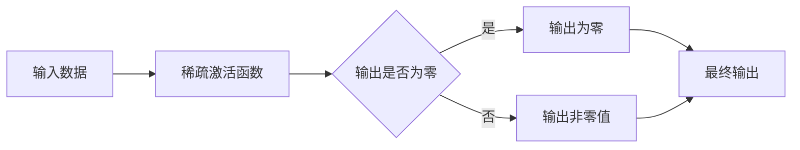

# 稀疏激活在大规模自然语言处理中的高效实现

> 关键词：稀疏激活、大规模自然语言处理、高效实现、神经网络、激活函数

> 摘要：本文聚焦于稀疏激活在大规模自然语言处理中的高效实现。首先介绍了相关背景，包括目的、预期读者等内容。接着详细阐述了稀疏激活的核心概念与联系，通过文本示意图和Mermaid流程图进行清晰展示。深入探讨了核心算法原理，并给出Python源代码示例。同时，介绍了相关的数学模型和公式，并举例说明。通过项目实战，展示了代码的实际案例和详细解释。分析了稀疏激活在自然语言处理中的实际应用场景，推荐了学习资源、开发工具框架以及相关论文著作。最后总结了未来发展趋势与挑战，还给出了常见问题解答和扩展阅读参考资料，旨在为相关领域的研究者和开发者提供全面且深入的技术指导。

## 1. 背景介绍 
### 1.1 目的和范围
在大规模自然语言处理（NLP）任务中，如机器翻译、文本生成、问答系统等，模型的规模和计算复杂度不断增加。传统的激活函数在处理大规模数据时，会带来较高的计算成本和内存开销。稀疏激活作为一种新型的激活机制，能够有效地减少计算量和内存占用，提高模型的训练和推理效率。本文的目的在于深入探讨稀疏激活在大规模NLP中的高效实现方法，涵盖从理论原理到实际应用的各个方面，为相关领域的研究和开发提供全面的指导。

### 1.2 预期读者
本文主要面向对自然语言处理、深度学习算法感兴趣的研究人员、工程师和开发者。无论您是初学者希望了解稀疏激活的基本概念，还是有一定经验的专业人士想要探索其在大规模NLP中的高效实现技巧，都能从本文中获得有价值的信息。

### 1.3 文档结构概述
本文将按照以下结构进行组织：首先介绍核心概念与联系，包括稀疏激活的定义、原理以及与其他相关概念的关系；接着详细阐述核心算法原理和具体操作步骤，并给出Python代码示例；然后介绍相关的数学模型和公式，并通过具体例子进行说明；之后通过项目实战展示稀疏激活在实际中的应用，包括开发环境搭建、源代码实现和代码解读；分析稀疏激活在自然语言处理中的实际应用场景；推荐学习资源、开发工具框架以及相关论文著作；最后总结未来发展趋势与挑战，给出常见问题解答和扩展阅读参考资料。

### 1.4 术语表
#### 1.4.1 核心术语定义
- **稀疏激活**：一种激活机制，在神经网络中使得大部分神经元的输出为零，只有少数神经元被激活，从而减少计算量和内存占用。
- **自然语言处理（NLP）**：研究计算机与人类语言之间交互的领域，旨在让计算机能够理解、处理和生成自然语言文本。
- **激活函数**：神经网络中用于引入非线性因素的函数，将神经元的输入转换为输出。
- **神经网络**：一种模仿人类神经系统的计算模型，由大量的神经元组成，用于解决各种机器学习任务。

#### 1.4.2 相关概念解释
- **计算复杂度**：衡量算法执行所需的计算资源，通常用时间复杂度和空间复杂度来表示。
- **内存开销**：算法或程序在运行过程中占用的内存空间大小。
- **模型训练**：通过大量的数据对神经网络模型进行参数调整，使其能够学习到数据中的模式和规律。
- **模型推理**：使用训练好的模型对新的数据进行预测或分类。

#### 1.4.3 缩略词列表
- **NLP**：自然语言处理（Natural Language Processing）
- **ReLU**：修正线性单元（Rectified Linear Unit）
- **SReLU**：稀疏修正线性单元（Sparse Rectified Linear Unit）

## 2. 核心概念与联系 

### 2.1 稀疏激活的定义
稀疏激活是一种特殊的激活机制，其核心思想是在神经网络的神经元输出中，大部分值为零，只有少数值是非零的。这种稀疏性可以通过特定的激活函数来实现，使得网络在处理信息时更加高效。与传统的激活函数（如Sigmoid、Tanh等）不同，稀疏激活函数能够选择性地激活神经元，减少不必要的计算和内存开销。

### 2.2 稀疏激活与传统激活函数的关系
传统的激活函数，如Sigmoid和Tanh，会对所有输入进行非线性变换，输出值通常在一个连续的范围内。而稀疏激活函数则会根据输入的大小，将大部分输出置为零，只保留少数非零值。例如，ReLU（修正线性单元）是一种常见的稀疏激活函数，其定义为：
$$
ReLU(x) = \max(0, x)
$$
当输入 $x$ 小于零时，输出为零；当输入 $x$ 大于零时，输出等于输入。这种特性使得ReLU能够有效地引入稀疏性，减少计算量。

### 2.3 稀疏激活在大规模NLP中的作用
在大规模NLP任务中，模型的参数数量和计算复杂度通常非常高。使用稀疏激活可以显著减少模型的计算量和内存占用，提高训练和推理效率。例如，在Transformer架构中，多头注意力机制需要进行大量的矩阵乘法运算，使用稀疏激活可以减少这些运算的数量，从而加快模型的运行速度。

### 2.4 文本示意图
```plaintext
输入层 -> 稀疏激活层 -> 隐藏层 -> 输出层
|             |
|  输入数据   |  稀疏激活输出
```

### 2.5 Mermaid流程图


## 3. 核心算法原理 & 具体操作步骤 

### 3.1 稀疏激活函数的原理
以SReLU（稀疏修正线性单元）为例，其原理是在ReLU的基础上，引入了一个阈值参数 $\tau$。当输入 $x$ 小于 $\tau$ 时，输出为零；当输入 $x$ 大于 $\tau$ 时，输出等于输入。SReLU的数学表达式为：
$$
SReLU(x) = 
\begin{cases}
0, & x \leq \tau \\
x, & x > \tau
\end{cases}
$$

### 3.2 具体操作步骤
1. **初始化阈值参数 $\tau$**：可以根据具体的任务和数据集进行调整。
2. **输入数据 $x$**：将输入数据传递给稀疏激活函数。
3. **计算输出**：根据SReLU的定义，判断输入 $x$ 是否大于阈值 $\tau$，如果大于则输出 $x$，否则输出零。

### 3.3 Python源代码示例
```python
import numpy as np

def srelu(x, tau):
    """
    稀疏修正线性单元（SReLU）激活函数
    :param x: 输入数据
    :param tau: 阈值参数
    :return: 激活后的输出
    """
    return np.where(x > tau, x, 0)

# 示例输入
x = np.array([-1, 0, 1, 2, 3])
tau = 1

# 计算激活后的输出
output = srelu(x, tau)
print("输入数据:", x)
print("阈值参数:", tau)
print("激活后的输出:", output)
```

### 3.4 代码解释
- `srelu` 函数接受输入数据 `x` 和阈值参数 `tau` 作为输入。
- 使用 `np.where` 函数根据条件判断输入数据是否大于阈值 `tau`，如果大于则输出输入数据，否则输出零。
- 最后，通过示例输入数据和阈值参数调用 `srelu` 函数，并打印输入数据、阈值参数和激活后的输出。

## 4. 数学模型和公式 & 详细讲解 & 举例说明 

### 4.1 稀疏激活函数的数学模型
除了SReLU，还有其他一些常见的稀疏激活函数，如Leaky ReLU和ELU（指数线性单元）。

#### Leaky ReLU
Leaky ReLU的定义为：
$$
LeakyReLU(x) = 
\begin{cases}
\alpha x, & x < 0 \\
x, & x \geq 0
\end{cases}
$$
其中，$\alpha$ 是一个小的正数，通常取值为0.01。Leaky ReLU的作用是在输入为负数时，避免神经元的输出为零，从而缓解了ReLU的“神经元死亡”问题。

#### ELU
ELU的定义为：
$$
ELU(x) = 
\begin{cases}
\alpha (e^x - 1), & x < 0 \\
x, & x \geq 0
\end{cases}
$$
其中，$\alpha$ 是一个正数，通常取值为1。ELU的优点是能够输出负值，使得输出的均值接近零，从而加快模型的收敛速度。

### 4.2 详细讲解
- **SReLU**：通过引入阈值参数 $\tau$，SReLU能够更加灵活地控制神经元的激活程度。当 $\tau$ 较大时，只有输入值较大的神经元才会被激活，从而增加了稀疏性；当 $\tau$ 较小时，更多的神经元会被激活。
- **Leaky ReLU**：通过引入一个小的斜率 $\alpha$，Leaky ReLU解决了ReLU在输入为负数时输出为零的问题。这样，即使输入为负数，神经元也能有一定的输出，避免了“神经元死亡”的情况。
- **ELU**：ELU在输入为负数时，使用指数函数进行变换，使得输出值在负数区间内有一个平滑的过渡。这种特性使得ELU能够输出负值，有助于加快模型的收敛速度。

### 4.3 举例说明
假设输入数据 $x = [-2, -1, 0, 1, 2]$，分别计算SReLU、Leaky ReLU和ELU的输出。

#### SReLU
设阈值参数 $\tau = 1$，则：
$$
SReLU(-2) = 0 \\
SReLU(-1) = 0 \\
SReLU(0) = 0 \\
SReLU(1) = 0 \\
SReLU(2) = 2
$$

#### Leaky ReLU
设 $\alpha = 0.01$，则：
$$
LeakyReLU(-2) = 0.01 \times (-2) = -0.02 \\
LeakyReLU(-1) = 0.01 \times (-1) = -0.01 \\
LeakyReLU(0) = 0 \\
LeakyReLU(1) = 1 \\
LeakyReLU(2) = 2
$$

#### ELU
设 $\alpha = 1$，则：
$$
ELU(-2) = 1 \times (e^{-2} - 1) \approx -0.8647 \\
ELU(-1) = 1 \times (e^{-1} - 1) \approx -0.6321 \\
ELU(0) = 0 \\
ELU(1) = 1 \\
ELU(2) = 2
$$

## 5. 项目实战：代码实际案例和详细解释说明 

### 5.1  开发环境搭建
#### 5.1.1 安装Python
首先，确保你已经安装了Python 3.x版本。可以从Python官方网站（https://www.python.org/downloads/）下载并安装。

#### 5.1.2 安装深度学习框架
本文使用PyTorch作为深度学习框架，可以使用以下命令进行安装：
```bash
pip install torch torchvision
```

#### 5.1.3 安装其他依赖库
还需要安装一些其他的依赖库，如NumPy、Matplotlib等，可以使用以下命令进行安装：
```bash
pip install numpy matplotlib
```

### 5.2  源代码详细实现和代码解读
以下是一个使用PyTorch实现的简单的神经网络模型，其中使用了SReLU作为激活函数。

```python
import torch
import torch.nn as nn

# 定义SReLU激活函数
class SReLU(nn.Module):
    def __init__(self, tau):
        super(SReLU, self).__init__()
        self.tau = tau

    def forward(self, x):
        return torch.where(x > self.tau, x, torch.zeros_like(x))

# 定义神经网络模型
class SimpleNet(nn.Module):
    def __init__(self, input_size, hidden_size, output_size, tau):
        super(SimpleNet, self).__init__()
        self.fc1 = nn.Linear(input_size, hidden_size)
        self.srelu = SReLU(tau)
        self.fc2 = nn.Linear(hidden_size, output_size)

    def forward(self, x):
        out = self.fc1(x)
        out = self.srelu(out)
        out = self.fc2(out)
        return out

# 初始化模型参数
input_size = 10
hidden_size = 20
output_size = 1
tau = 0.5

# 创建模型实例
model = SimpleNet(input_size, hidden_size, output_size, tau)

# 生成随机输入数据
x = torch.randn(1, input_size)

# 前向传播
output = model(x)
print("输入数据:", x)
print("模型输出:", output)
```

### 5.3  代码解读与分析
- **SReLU类**：继承自 `nn.Module`，实现了SReLU激活函数。在 `__init__` 方法中，初始化阈值参数 `tau`；在 `forward` 方法中，使用 `torch.where` 函数根据条件判断输入数据是否大于阈值 `tau`，如果大于则输出输入数据，否则输出零。
- **SimpleNet类**：定义了一个简单的两层神经网络模型。在 `__init__` 方法中，初始化全连接层 `fc1` 和 `fc2`，以及SReLU激活函数；在 `forward` 方法中，实现了前向传播过程，包括线性变换、SReLU激活和最终的线性变换。
- **主程序**：初始化模型参数，创建模型实例，生成随机输入数据，并进行前向传播，最后打印输入数据和模型输出。

## 6. 实际应用场景 
### 6.1 机器翻译
在机器翻译任务中，模型需要处理大量的文本数据，计算复杂度较高。使用稀疏激活可以减少模型的计算量和内存占用，提高翻译的效率。例如，在Transformer架构中，使用稀疏激活可以加速多头注意力机制的计算，从而提高翻译的速度。

### 6.2 文本生成
文本生成任务，如故事生成、诗歌生成等，需要模型能够生成连贯、有意义的文本。稀疏激活可以帮助模型更好地捕捉文本中的重要信息，减少冗余计算，提高生成文本的质量和效率。

### 6.3 问答系统
问答系统需要能够快速准确地回答用户的问题。使用稀疏激活可以提高模型的推理速度，使得问答系统能够更快地给出答案，提升用户体验。

### 6.4 情感分析
情感分析任务旨在判断文本的情感倾向，如积极、消极或中性。稀疏激活可以帮助模型聚焦于文本中的关键信息，提高情感分析的准确性和效率。

## 7. 工具和资源推荐
### 7.1 学习资源推荐
#### 7.1.1 书籍推荐
- 《深度学习》（Deep Learning）：由Ian Goodfellow、Yoshua Bengio和Aaron Courville合著，是深度学习领域的经典教材，涵盖了神经网络、深度学习算法等方面的知识。
- 《自然语言处理入门》（Natural Language Processing with Python）：由Steven Bird、Ewan Klein和Edward Loper合著，介绍了使用Python进行自然语言处理的基本方法和技术。
- 《动手学深度学习》（Dive into Deep Learning）：由 Aston Zhang、Zachary C. Lipton、Mu Li和Alexander J. Smola合著，提供了丰富的代码示例和实践项目，适合初学者学习深度学习。

#### 7.1.2 在线课程
- Coursera上的“深度学习专项课程”（Deep Learning Specialization）：由Andrew Ng教授讲授，包括神经网络、卷积神经网络、循环神经网络等多个课程，是学习深度学习的优质资源。
- edX上的“自然语言处理基础”（Foundations of Natural Language Processing）：介绍了自然语言处理的基本概念、方法和技术，适合初学者入门。
- 哔哩哔哩（Bilibili）上的“深度学习之Pytorch实战”：提供了详细的Pytorch教程和实践项目，帮助学习者快速掌握Pytorch的使用。

#### 7.1.3 技术博客和网站
- Medium上的“Towards Data Science”：汇集了大量的数据科学和机器学习相关的文章，包括深度学习、自然语言处理等领域的最新研究成果和实践经验。
- arXiv.org：一个预印本服务器，提供了大量的学术论文，包括深度学习、自然语言处理等领域的最新研究成果。
- 机器之心（https://www.alpaca.ai/）：专注于人工智能领域的技术资讯和研究成果报道，提供了丰富的技术文章和案例分析。

### 7.2 开发工具框架推荐
#### 7.2.1 IDE和编辑器
- PyCharm：一款专门为Python开发设计的集成开发环境（IDE），提供了丰富的代码编辑、调试、版本控制等功能，适合专业开发者使用。
- Jupyter Notebook：一个交互式的开发环境，支持Python、R等多种编程语言，适合数据科学和机器学习领域的研究和开发。
- Visual Studio Code：一款轻量级的代码编辑器，支持多种编程语言和插件扩展，适合初学者和快速开发。

#### 7.2.2 调试和性能分析工具
- PyTorch Profiler：PyTorch提供的性能分析工具，可以帮助开发者分析模型的计算性能和内存使用情况，找出性能瓶颈。
- TensorBoard：一个可视化工具，支持TensorFlow和PyTorch等深度学习框架，可以帮助开发者可视化模型的训练过程、性能指标等信息。
- cProfile：Python自带的性能分析工具，可以帮助开发者分析Python代码的执行时间和函数调用情况。

#### 7.2.3 相关框架和库
- PyTorch：一个开源的深度学习框架，提供了丰富的神经网络层、优化器和损失函数等组件，支持GPU加速，适合自然语言处理和深度学习研究。
- TensorFlow：另一个流行的开源深度学习框架，提供了高度可扩展的计算图和分布式训练功能，广泛应用于工业界和学术界。
- Hugging Face Transformers：一个开源的自然语言处理库，提供了预训练的模型和工具，如BERT、GPT等，方便开发者进行自然语言处理任务的开发。

### 7.3 相关论文著作推荐
#### 7.3.1 经典论文
- “Rectified Linear Units Improve Restricted Boltzmann Machines”：介绍了ReLU激活函数的基本原理和优点，开启了ReLU在深度学习中的广泛应用。
- “Attention Is All You Need”：提出了Transformer架构，是自然语言处理领域的重要突破，引入了多头注意力机制和位置编码等概念。
- “BERT: Pre-training of Deep Bidirectional Transformers for Language Understanding”：提出了BERT模型，通过预训练和微调的方式，在多个自然语言处理任务中取得了优异的成绩。

#### 7.3.2 最新研究成果
- “Sparse Transformers”：研究了稀疏注意力机制在Transformer架构中的应用，进一步提高了模型的计算效率。
- “Efficient Transformers: A Survey”：对高效Transformer架构进行了全面的综述，介绍了各种提高Transformer计算效率的方法和技术。
- “Training Language Models to Follow Instructions with Human Feedback”：介绍了使用人类反馈进行指令学习的方法，提高了语言模型的可控性和实用性。

#### 7.3.3 应用案例分析
- “Neural Machine Translation by Jointly Learning to Align and Translate”：提出了基于注意力机制的神经机器翻译模型，为机器翻译领域的发展奠定了基础。
- “Generating Long and Coherent Text with Pointer-Generator Networks”：介绍了指针生成网络在文本生成任务中的应用，提高了生成文本的质量和连贯性。
- “Question Answering over Knowledge Bases and Text using Universal Schema and Memory Networks”：研究了使用通用模式和记忆网络进行知识库和文本问答的方法，提高了问答系统的性能。

## 8. 总结：未来发展趋势与挑战
### 8.1 未来发展趋势
- **更高效的稀疏激活算法**：随着大规模自然语言处理任务的不断发展，对稀疏激活算法的效率要求也越来越高。未来，可能会出现更加高效的稀疏激活算法，进一步减少计算量和内存占用。
- **与其他技术的融合**：稀疏激活可能会与其他技术，如量子计算、强化学习等进行融合，为自然语言处理带来新的突破。
- **在工业界的广泛应用**：随着稀疏激活技术的不断成熟，其在工业界的应用将会越来越广泛，如智能客服、智能写作等领域。

### 8.2 挑战
- **稀疏性的控制**：如何准确地控制神经元的稀疏性是一个挑战。如果稀疏性过高，可能会导致模型的表达能力下降；如果稀疏性过低，则无法充分发挥稀疏激活的优势。
- **模型的稳定性**：稀疏激活可能会导致模型的训练过程不稳定，出现梯度消失或梯度爆炸等问题。如何提高模型的稳定性是需要解决的问题之一。
- **与现有模型的兼容性**：将稀疏激活应用到现有的自然语言处理模型中，需要考虑其与现有模型的兼容性问题，可能需要对模型进行一定的修改和调整。

## 9. 附录：常见问题与解答
### 9.1 稀疏激活和传统激活函数有什么区别？
稀疏激活函数能够使得大部分神经元的输出为零，只有少数神经元被激活，从而减少计算量和内存占用。而传统激活函数（如Sigmoid、Tanh等）会对所有输入进行非线性变换，输出值通常在一个连续的范围内。

### 9.2 如何选择合适的稀疏激活函数？
选择合适的稀疏激活函数需要考虑具体的任务和数据集。例如，如果任务对计算效率要求较高，可以选择SReLU；如果需要避免“神经元死亡”问题，可以选择Leaky ReLU；如果希望加快模型的收敛速度，可以选择ELU。

### 9.3 稀疏激活会影响模型的性能吗？
在一定程度上，稀疏激活可以提高模型的性能。通过减少计算量和内存占用，稀疏激活可以加快模型的训练和推理速度。但是，如果稀疏性过高，可能会导致模型的表达能力下降，从而影响模型的性能。因此，需要在稀疏性和模型性能之间进行权衡。

### 9.4 如何在实际项目中应用稀疏激活？
可以在神经网络模型中使用稀疏激活函数代替传统的激活函数。例如，在PyTorch中，可以自定义稀疏激活函数类，并将其应用到模型的相应层中。具体实现方法可以参考本文的项目实战部分。

## 10. 扩展阅读 & 参考资料
- Goodfellow, I., Bengio, Y., & Courville, A. (2016). Deep Learning. MIT Press.
- Bird, S., Klein, E., & Loper, E. (2009). Natural Language Processing with Python. O'Reilly Media.
- Zhang, A., Lipton, Z. C., Li, M., & Smola, A. J. (2020). Dive into Deep Learning. 
- Nair, V., & Hinton, G. E. (2010). Rectified Linear Units Improve Restricted Boltzmann Machines. Proceedings of the 27th International Conference on Machine Learning.
- Vaswani, A., Shazeer, N., Parmar, N., Uszkoreit, J., Jones, L., Gomez, A. N.,... & Polosukhin, I. (2017). Attention Is All You Need. Advances in Neural Information Processing Systems.
- Devlin, J., Chang, M. W., Lee, K., & Toutanova, K. (2018). BERT: Pre-training of Deep Bidirectional Transformers for Language Understanding. arXiv preprint arXiv:1810.04805.

作者：AI天才研究院/AI Genius Institute & 禅与计算机程序设计艺术 /Zen And The Art of Computer Programming