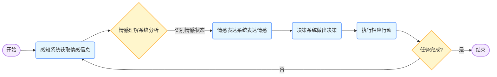

# 类脑计算在情感智能机器人中的创新应用

> 关键词：类脑计算、情感智能机器人、神经形态工程、机器学习、人工智能、情感计算、机器人创新应用

> 摘要：本文聚焦于类脑计算在情感智能机器人中的创新应用。随着人工智能的快速发展，情感智能机器人成为研究热点，而类脑计算为其发展提供了新的思路和方法。文章首先介绍了类脑计算和情感智能机器人的背景知识，包括目的、预期读者、文档结构和相关术语。接着阐述了类脑计算与情感智能机器人的核心概念及联系，通过文本示意图和Mermaid流程图进行清晰展示。详细讲解了类脑计算的核心算法原理，并用Python代码进行说明，同时给出了相关数学模型和公式。在项目实战部分，从开发环境搭建到源代码实现与解读进行了全面分析。探讨了类脑计算在情感智能机器人中的实际应用场景，推荐了相关的学习资源、开发工具框架和论文著作。最后总结了未来发展趋势与挑战，并提供常见问题解答和扩展阅读参考资料，旨在为相关领域的研究和实践提供全面且深入的指导。

## 1. 背景介绍 
### 1.1 目的和范围
类脑计算在情感智能机器人中的创新应用旨在突破传统机器人的局限性，使机器人能够更好地理解和响应人类情感，实现更加自然和人性化的交互。本研究的范围涵盖了类脑计算的基本原理、情感智能机器人的构建、相关算法和技术的实现，以及在不同领域的应用案例分析。通过对这些内容的深入探讨，为类脑计算在情感智能机器人领域的进一步发展提供理论支持和实践指导。

### 1.2 预期读者
本文预期读者包括人工智能、机器人技术、计算机科学等领域的研究人员、工程师和学生，以及对类脑计算和情感智能机器人感兴趣的科技爱好者。希望本文能够为他们提供有价值的信息和启发，促进相关领域的研究和创新。

### 1.3 文档结构概述
本文将按照以下结构进行阐述：首先介绍背景知识，包括目的、预期读者、文档结构和术语表；接着阐述类脑计算与情感智能机器人的核心概念及联系；详细讲解类脑计算的核心算法原理和具体操作步骤；给出相关数学模型和公式并举例说明；通过项目实战展示代码实际案例和详细解释；探讨实际应用场景；推荐相关的学习资源、开发工具框架和论文著作；总结未来发展趋势与挑战；提供常见问题解答和扩展阅读参考资料。

### 1.4 术语表
#### 1.4.1 核心术语定义
- **类脑计算**：借鉴人脑的结构和工作原理，开发新型计算模型和算法，以实现高效、智能的计算。
- **情感智能机器人**：能够感知、理解和表达人类情感，并根据情感信息做出相应反应的机器人。
- **神经形态工程**：研究如何设计和制造模仿生物神经系统功能的硬件和软件系统。
- **情感计算**：研究如何让计算机感知、理解和生成人类情感的技术。

#### 1.4.2 相关概念解释
- **人工智能**：使计算机能够模拟人类智能的技术和方法。
- **机器学习**：让计算机通过数据学习模式和规律，从而实现预测和决策的技术。
- **深度学习**：一种基于人工神经网络的机器学习方法，具有强大的特征提取和模式识别能力。

#### 1.4.3 缩略词列表
- **ANN**：Artificial Neural Network，人工神经网络
- **SNN**：Spiking Neural Network，脉冲神经网络
- **AI**：Artificial Intelligence，人工智能
- **ML**：Machine Learning，机器学习
- **DL**：Deep Learning，深度学习

## 2. 核心概念与联系 
### 2.1 类脑计算的原理和架构
类脑计算的核心思想是模仿人脑的结构和工作方式。人脑由大量的神经元组成，这些神经元通过突触相互连接，形成复杂的神经网络。神经元之间通过电信号和化学信号进行信息传递和处理。类脑计算借鉴了这些原理，开发了人工神经网络和脉冲神经网络等计算模型。

人工神经网络由多个神经元层组成，包括输入层、隐藏层和输出层。神经元之间通过权重连接，权重表示神经元之间的连接强度。在训练过程中，通过调整权重来优化网络的性能。

脉冲神经网络是一种更加接近生物神经系统的计算模型。脉冲神经元通过发放脉冲来传递信息，脉冲的时间和频率包含了重要的信息。脉冲神经网络能够更好地模拟生物神经系统的动态特性和信息处理方式。

以下是类脑计算架构的文本示意图：

类脑计算架构包括硬件层、模型层和应用层。硬件层采用神经形态芯片等硬件设备，模拟生物神经元和突触的功能。模型层包括人工神经网络和脉冲神经网络等计算模型，用于实现信息处理和学习。应用层将类脑计算应用于各种领域，如情感智能机器人、智能医疗、智能交通等。

### 2.2 情感智能机器人的组成和功能
情感智能机器人主要由感知系统、情感理解系统、情感表达系统和决策系统组成。

感知系统通过各种传感器，如摄像头、麦克风、触觉传感器等，获取人类的情感信息，包括面部表情、语音语调、肢体动作等。

情感理解系统对感知到的情感信息进行分析和处理，识别出人类的情感状态，如高兴、悲伤、愤怒等。

情感表达系统根据情感理解系统的结果，通过机器人的面部表情、语音、肢体动作等方式表达相应的情感。

决策系统根据情感信息和任务需求，做出相应的决策和行动，以实现与人类的有效交互。

### 2.3 类脑计算与情感智能机器人的联系
类脑计算为情感智能机器人的发展提供了强大的技术支持。类脑计算的计算模型和算法能够更好地模拟人类的认知和情感处理过程，使情感智能机器人能够更加准确地感知、理解和表达人类情感。

例如，脉冲神经网络能够模拟生物神经元的脉冲发放机制，更好地处理时间序列信息，对于情感识别和理解具有重要意义。同时，类脑计算的硬件实现，如神经形态芯片，能够提高情感智能机器人的计算效率和能源效率，使其更加适合实际应用。

### 2.4 Mermaid流程图


## 3. 核心算法原理 & 具体操作步骤 
### 3.1 脉冲神经网络算法原理
脉冲神经网络（SNN）是类脑计算中的一种重要模型。SNN的基本单元是脉冲神经元，脉冲神经元通过发放脉冲来传递信息。脉冲神经元的状态由膜电位 $V(t)$ 表示，当膜电位超过阈值 $\theta$ 时，神经元发放一个脉冲。

脉冲神经元的膜电位更新公式如下：
$$
\frac{dV(t)}{dt} = -\frac{V(t)}{\tau} + I(t)
$$
其中，$\tau$ 是膜时间常数，$I(t)$ 是输入电流。

### 3.2 Python代码实现脉冲神经网络
```python
import numpy as np

class SpikingNeuron:
    def __init__(self, tau, theta):
        self.tau = tau
        self.theta = theta
        self.V = 0.0
        self.spike = 0

    def update(self, I, dt):
        dV = (-self.V / self.tau + I) * dt
        self.V += dV
        if self.V >= self.theta:
            self.spike = 1
            self.V = 0.0
        else:
            self.spike = 0
        return self.spike

# 示例使用
tau = 10.0
theta = 1.0
dt = 0.1
neuron = SpikingNeuron(tau, theta)
input_current = 0.2
for t in np.arange(0, 100, dt):
    spike = neuron.update(input_current, dt)
    if spike:
        print(f"Spike at time {t}")
```

### 3.3 具体操作步骤
1. **初始化脉冲神经元**：设置膜时间常数 $\tau$ 和阈值 $\theta$，并将膜电位 $V$ 初始化为 0。
2. **输入电流**：给定输入电流 $I(t)$。
3. **更新膜电位**：根据膜电位更新公式计算膜电位的变化，并更新膜电位。
4. **判断是否发放脉冲**：如果膜电位超过阈值，则发放一个脉冲，并将膜电位重置为 0；否则，不发放脉冲。
5. **重复步骤 2 - 4**：直到达到指定的时间步长。

## 4. 数学模型和公式 & 详细讲解 & 举例说明 
### 4.1 脉冲神经网络的数学模型
脉冲神经网络的数学模型主要基于神经元的动力学方程。除了前面提到的膜电位更新公式外，还有突触的动力学方程。

突触的作用是将一个神经元的脉冲传递到另一个神经元。突触的强度由突触权重 $w$ 表示。当一个神经元发放脉冲时，会通过突触向与之连接的神经元发送一个突触电流。

突触电流的计算公式如下：
$$
I_{syn}(t) = w \sum_{i} \delta(t - t_i)
$$
其中，$\delta(t - t_i)$ 是狄拉克函数，表示在时间 $t_i$ 发放的脉冲，$w$ 是突触权重。

### 4.2 情感识别的数学模型
情感识别可以看作是一个分类问题。假设有 $C$ 个情感类别，输入特征向量为 $\mathbf{x}$，情感类别标签为 $y$。

常用的情感识别模型是基于机器学习的分类器，如支持向量机（SVM）、神经网络等。以神经网络为例，神经网络的输出可以表示为：
$$
\mathbf{y} = f(W \mathbf{x} + \mathbf{b})
$$
其中，$W$ 是权重矩阵，$\mathbf{b}$ 是偏置向量，$f$ 是激活函数。

通过训练神经网络，调整权重矩阵 $W$ 和偏置向量 $\mathbf{b}$，使得神经网络的输出 $\mathbf{y}$ 尽可能接近真实的情感类别标签。

### 4.3 举例说明
假设我们要进行面部表情识别，识别的情感类别包括高兴、悲伤、愤怒三种。我们提取面部的特征向量，如眼睛、嘴巴的形状和位置等。

我们使用一个简单的神经网络进行训练，输入层有 10 个神经元，隐藏层有 5 个神经元，输出层有 3 个神经元。激活函数使用 softmax 函数，将输出转换为概率分布。

训练数据包括 1000 张面部表情图片，其中 800 张用于训练，200 张用于测试。通过训练神经网络，我们可以得到一个能够准确识别面部表情的模型。

## 5. 项目实战：代码实际案例和详细解释说明 
### 5.1  开发环境搭建
1. **安装Python**：推荐使用 Python 3.7 及以上版本。可以从 Python 官方网站（https://www.python.org/downloads/） 下载并安装。
2. **安装深度学习框架**：推荐使用 PyTorch 或 TensorFlow。以 PyTorch 为例，可以使用以下命令安装：
```sh
pip install torch torchvision
```
3. **安装其他依赖库**：根据项目需求，安装其他必要的库，如 numpy、matplotlib 等。
```sh
pip install numpy matplotlib
```

### 5.2  源代码详细实现和代码解读
以下是一个基于 PyTorch 实现的简单情感识别神经网络的代码示例：
```python
import torch
import torch.nn as nn
import torch.optim as optim
from torch.utils.data import DataLoader, Dataset
import numpy as np

# 定义数据集类
class EmotionDataset(Dataset):
    def __init__(self, data, labels):
        self.data = torch.tensor(data, dtype=torch.float32)
        self.labels = torch.tensor(labels, dtype=torch.long)

    def __len__(self):
        return len(self.data)

    def __getitem__(self, idx):
        return self.data[idx], self.labels[idx]

# 定义神经网络模型
class EmotionNet(nn.Module):
    def __init__(self, input_size, hidden_size, num_classes):
        super(EmotionNet, self).__init__()
        self.fc1 = nn.Linear(input_size, hidden_size)
        self.relu = nn.ReLU()
        self.fc2 = nn.Linear(hidden_size, num_classes)

    def forward(self, x):
        out = self.fc1(x)
        out = self.relu(out)
        out = self.fc2(out)
        return out

# 生成示例数据
input_size = 10
hidden_size = 5
num_classes = 3
num_samples = 1000

data = np.random.randn(num_samples, input_size)
labels = np.random.randint(0, num_classes, num_samples)

# 划分训练集和测试集
train_data = data[:800]
train_labels = labels[:800]
test_data = data[800:]
test_labels = labels[800:]

# 创建数据集和数据加载器
train_dataset = EmotionDataset(train_data, train_labels)
train_loader = DataLoader(train_dataset, batch_size=32, shuffle=True)

test_dataset = EmotionDataset(test_data, test_labels)
test_loader = DataLoader(test_dataset, batch_size=32, shuffle=False)

# 初始化模型、损失函数和优化器
model = EmotionNet(input_size, hidden_size, num_classes)
criterion = nn.CrossEntropyLoss()
optimizer = optim.Adam(model.parameters(), lr=0.001)

# 训练模型
num_epochs = 10
for epoch in range(num_epochs):
    running_loss = 0.0
    for i, (inputs, labels) in enumerate(train_loader):
        optimizer.zero_grad()
        outputs = model(inputs)
        loss = criterion(outputs, labels)
        loss.backward()
        optimizer.step()
        running_loss += loss.item()
    print(f'Epoch {epoch + 1}, Loss: {running_loss / len(train_loader)}')

# 测试模型
correct = 0
total = 0
with torch.no_grad():
    for inputs, labels in test_loader:
        outputs = model(inputs)
        _, predicted = torch.max(outputs.data, 1)
        total += labels.size(0)
        correct += (predicted == labels).sum().item()

print(f'Accuracy: {100 * correct / total}%')
```

### 5.3  代码解读与分析
1. **数据集类**：`EmotionDataset` 类继承自 `torch.utils.data.Dataset`，用于封装数据集。`__len__` 方法返回数据集的长度，`__getitem__` 方法返回指定索引的数据和标签。
2. **神经网络模型**：`EmotionNet` 类继承自 `nn.Module`，定义了一个简单的两层神经网络。`forward` 方法定义了前向传播过程。
3. **数据加载**：使用 `DataLoader` 类将数据集封装成可迭代的数据加载器，方便批量训练和测试。
4. **训练过程**：使用交叉熵损失函数和 Adam 优化器进行训练。在每个 epoch 中，遍历训练数据加载器，计算损失并进行反向传播和参数更新。
5. **测试过程**：在测试阶段，使用 `torch.no_grad()` 上下文管理器关闭梯度计算，提高计算效率。计算模型的准确率。

## 6. 实际应用场景 
### 6.1 医疗护理
在医疗护理领域，情感智能机器人可以陪伴患者，尤其是长期住院的患者和老年人。类脑计算使机器人能够更好地理解患者的情感需求，给予情感支持和心理安慰。例如，机器人可以通过分析患者的面部表情和语音语调，判断患者的情绪状态，当患者感到孤独或焦虑时，机器人可以通过陪伴聊天、播放音乐等方式缓解患者的情绪。

### 6.2 教育领域
在教育领域，情感智能机器人可以作为智能学习伙伴。机器人能够感知学生的学习状态和情绪变化，根据学生的情感信息调整教学策略。例如，当学生遇到困难而感到沮丧时，机器人可以给予鼓励和引导，帮助学生克服困难。同时，机器人还可以通过与学生的互动，激发学生的学习兴趣和积极性。

### 6.3 客服服务
在客服服务领域，情感智能机器人可以提高客户服务的质量和效率。机器人能够理解客户的情感需求，快速准确地回应客户的问题。例如，当客户感到不满或愤怒时，机器人可以通过温和的语气和合适的表达方式安抚客户的情绪，解决客户的问题，提高客户的满意度。

### 6.4 家庭陪伴
在家庭场景中，情感智能机器人可以成为家庭成员的陪伴伙伴。机器人可以与家庭成员进行情感交流，了解他们的喜好和需求，提供个性化的服务。例如，机器人可以根据家庭成员的情绪状态推荐合适的娱乐内容，如电影、音乐等，增强家庭的情感氛围。

## 7. 工具和资源推荐
### 7.1 学习资源推荐
#### 7.1.1 书籍推荐
- 《深度学习》（Deep Learning