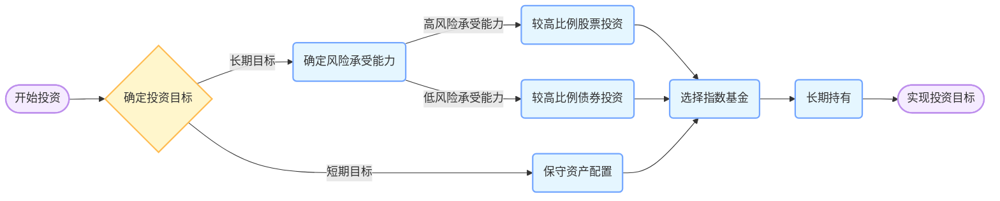

# 约翰·伯格的简单投资法则

> 关键词：约翰·伯格、简单投资法则、指数基金、长期投资、资产配置

> 摘要：本文深入探讨了约翰·伯格的简单投资法则。约翰·伯格作为投资领域的传奇人物，其倡导的投资理念以简单、有效而著称。文章将详细介绍这些法则的核心概念、算法原理、数学模型，通过实际案例展示其在投资中的应用，分析其适用的场景，推荐相关的学习工具和资源，最后总结该法则面临的未来发展趋势与挑战，并对常见问题进行解答。旨在帮助投资者更好地理解和运用约翰·伯格的投资法则，实现稳健的投资收益。

## 1. 背景介绍 
### 1.1 目的和范围
本文的目的在于全面、深入地剖析约翰·伯格的简单投资法则，帮助投资者理解这些法则的原理、应用方法以及实际效果。通过对法则的详细讲解和实际案例分析，使投资者能够掌握如何运用这些法则进行合理的投资决策，实现资产的保值增值。范围涵盖了约翰·伯格投资法则的核心概念、算法原理、数学模型、实际应用场景以及相关的学习资源等方面。

### 1.2 预期读者
本文预期读者为广大投资者，包括但不限于个人投资者、投资新手、有一定投资经验但希望优化投资策略的人群，以及对投资理论和实践感兴趣的学者和研究人员。无论您是初涉投资领域，还是寻求更稳健投资方法的专业人士，都能从本文中获得有价值的信息。

### 1.3 文档结构概述
本文将按照以下结构展开：首先介绍核心概念与联系，阐述约翰·伯格投资法则的基本原理和架构；接着讲解核心算法原理和具体操作步骤，并通过 Python 代码进行详细阐述；然后介绍相关的数学模型和公式，并举例说明；再通过项目实战展示代码实际案例和详细解释；分析实际应用场景；推荐相关的工具和资源；总结未来发展趋势与挑战；解答常见问题；最后提供扩展阅读和参考资料。

### 1.4 术语表
#### 1.4.1 核心术语定义
- **指数基金**：一种按照特定指数构成规则，购买该指数包含的全部或部分证券的基金，其目的是跟踪指数表现，获取与指数相近的收益。
- **长期投资**：指投资者将资金投入到资产中，并持有较长时间，通常为数年甚至数十年，以获得资产增值和分红收益。
- **资产配置**：根据投资者的风险承受能力、投资目标等因素，将资金分配到不同类型的资产（如股票、债券、现金等）中，以实现风险和收益的平衡。

#### 1.4.2 相关概念解释
- **市场效率**：指市场能够迅速、准确地反映所有可用信息，使得资产价格能够合理反映其内在价值。在有效市场中，很难通过主动投资策略获得超额收益。
- **被动投资**：指投资者不试图通过预测市场走势或选择个别证券来获取超额收益，而是通过跟踪市场指数来获取市场平均收益的投资策略。

#### 1.4.3 缩略词列表
- **ETF**：交易型开放式指数基金（Exchange Traded Fund），是一种在证券交易所上市交易的、基金份额可变的开放式基金，通常跟踪特定的指数。

## 2. 核心概念与联系 
约翰·伯格的简单投资法则主要基于以下几个核心概念：

### 核心概念原理
- **指数基金的优势**：指数基金具有低成本、广泛分散投资、透明度高、税收效率高等优点。由于其跟踪市场指数，不需要基金经理进行主动选股和市场时机选择，因此管理费用较低。同时，指数基金通常投资于一篮子证券，能够有效分散非系统性风险。
- **长期投资的价值**：长期投资可以平滑市场波动的影响，让投资者充分享受复利的力量。历史数据表明，股票市场在长期内呈现上涨趋势，尽管短期内会有波动，但通过长期持有，投资者有更大的机会获得正收益。
- **资产配置的重要性**：不同类型的资产在不同的市场环境下表现不同，通过合理的资产配置，可以降低投资组合的整体风险，提高风险调整后的收益。投资者可以根据自己的风险承受能力和投资目标，将资金分配到股票、债券、现金等不同资产类别中。

### 架构的文本示意图
```plaintext
约翰·伯格简单投资法则
|-- 指数基金投资
|   |-- 低成本优势
|   |-- 分散风险
|   |-- 跟踪市场指数
|-- 长期投资策略
|   |-- 平滑市场波动
|   |-- 享受复利效应
|-- 合理资产配置
|   |-- 平衡风险与收益
|   |-- 根据风险承受能力分配资产
```

### Mermaid 流程图


## 3. 核心算法原理 & 具体操作步骤 
### 核心算法原理
约翰·伯格的投资法则核心算法可以简化为以下几个步骤：

1. **确定投资目标和风险承受能力**：投资者首先需要明确自己的投资目标，如短期储蓄、长期养老等，并评估自己的风险承受能力。风险承受能力通常与投资者的年龄、收入、财务状况等因素有关。
2. **进行资产配置**：根据投资目标和风险承受能力，将资金分配到不同类型的资产中。一般来说，风险承受能力较高的投资者可以将较高比例的资金投资于股票，而风险承受能力较低的投资者可以将较高比例的资金投资于债券。
3. **选择指数基金**：在每个资产类别中，选择合适的指数基金进行投资。选择指数基金时，需要考虑基金的跟踪误差、管理费用、流动性等因素。
4. **长期持有**：一旦确定了投资组合，投资者应该长期持有，避免频繁交易。频繁交易不仅会增加交易成本，还可能因为市场波动而做出错误的决策。

### 具体操作步骤的 Python 代码实现
```python
# 步骤 1: 确定投资目标和风险承受能力
def determine_risk_tolerance(age, income, financial_status):
    """
    根据年龄、收入和财务状况确定风险承受能力
    :param age: 投资者年龄
    :param income: 投资者年收入
    :param financial_status: 投资者财务状况（0: 较差, 1: 一般, 2: 较好）
    :return: 风险承受能力得分（0-100）
    """
    risk_score = 0
    # 年龄因素：年龄越小，风险承受能力越高
    risk_score += (100 - age) * 0.3
    # 收入因素：收入越高，风险承受能力越高
    risk_score += (income / 100000) * 0.3
    # 财务状况因素：财务状况越好，风险承受能力越高
    risk_score += financial_status * 0.4
    return risk_score

# 步骤 2: 进行资产配置
def asset_allocation(risk_score):
    """
    根据风险承受能力进行资产配置
    :param risk_score: 风险承受能力得分
    :return: 股票和债券的投资比例
    """
    stock_ratio = risk_score / 100
    bond_ratio = 1 - stock_ratio
    return stock_ratio, bond_ratio

# 步骤 3: 选择指数基金（此处简化为模拟选择）
def select_index_funds(stock_ratio, bond_ratio):
    """
    根据资产配置比例选择指数基金
    :param stock_ratio: 股票投资比例
    :param bond_ratio: 债券投资比例
    :return: 选择的股票指数基金和债券指数基金
    """
    stock_fund = "Stock Index Fund" if stock_ratio > 0 else None
    bond_fund = "Bond Index Fund" if bond_ratio > 0 else None
    return stock_fund, bond_fund

# 步骤 4: 模拟长期投资
def long_term_investment(initial_investment, stock_ratio, bond_ratio, years, stock_return_rate, bond_return_rate):
    """
    模拟长期投资收益
    :param initial_investment: 初始投资金额
    :param stock_ratio: 股票投资比例
    :param bond_ratio: 债券投资比例
    :param years: 投资年限
    :param stock_return_rate: 股票年均收益率
    :param bond_return_rate: 债券年均收益率
    :return: 最终投资收益
    """
    stock_investment = initial_investment * stock_ratio
    bond_investment = initial_investment * bond_ratio
    final_stock_value = stock_investment * (1 + stock_return_rate) ** years
    final_bond_value = bond_investment * (1 + bond_return_rate) ** years
    final_value = final_stock_value + final_bond_value
    return final_value

# 示例使用
age = 30
income = 80000
financial_status = 1
initial_investment = 100000
years = 20
stock_return_rate = 0.08
bond_return_rate = 0.03

risk_score = determine_risk_tolerance(age, income, financial_status)
stock_ratio, bond_ratio = asset_allocation(risk_score)
stock_fund, bond_fund = select_index_funds(stock_ratio, bond_ratio)
final_value = long_term_investment(initial_investment, stock_ratio, bond_ratio, years, stock_return_rate, bond_return_rate)

print(f"风险承受能力得分: {risk_score}")
print(f"股票投资比例: {stock_ratio * 100}%")
print(f"债券投资比例: {bond_ratio * 100}%")
print(f"选择的股票指数基金: {stock_fund}")
print(f"选择的债券指数基金: {bond_fund}")
print(f"20 年后的最终投资收益: {final_value}")
```

### 代码解释
1. **`determine_risk_tolerance` 函数**：根据投资者的年龄、收入和财务状况计算风险承受能力得分。年龄越小、收入越高、财务状况越好，风险承受能力得分越高。
2. **`asset_allocation` 函数**：根据风险承受能力得分确定股票和债券的投资比例。风险承受能力得分越高，股票投资比例越高，债券投资比例越低。
3. **`select_index_funds` 函数**：根据股票和债券的投资比例选择相应的指数基金。如果投资比例为 0，则不选择该类型的指数基金。
4. **`long_term_investment` 函数**：模拟长期投资收益，根据初始投资金额、股票和债券的投资比例、投资年限以及年均收益率计算最终投资收益。

## 4. 数学模型和公式 & 详细讲解 & 举例说明 
### 资产配置的数学模型
资产配置的目标是在给定风险水平下最大化投资组合的预期收益，或者在给定预期收益水平下最小化投资组合的风险。常用的资产配置模型是马科维茨的现代投资组合理论（Modern Portfolio Theory, MPT）。

设投资组合中有 $n$ 种资产，第 $i$ 种资产的预期收益率为 $E(R_i)$，投资比例为 $w_i$，资产之间的协方差矩阵为 $\Sigma$，则投资组合的预期收益率 $E(R_p)$ 和方差 $\sigma_p^2$ 分别为：

$$E(R_p) = \sum_{i=1}^{n} w_i E(R_i)$$

$$\sigma_p^2 = \sum_{i=1}^{n} \sum_{j=1}^{n} w_i w_j \sigma_{ij}$$

其中，$\sigma_{ij}$ 是资产 $i$ 和资产 $j$ 之间的协方差。

### 举例说明
假设投资组合中有两种资产：股票和债券。股票的预期收益率为 $E(R_s) = 0.1$，标准差为 $\sigma_s = 0.2$；债券的预期收益率为 $E(R_b) = 0.05$，标准差为 $\sigma_b = 0.1$；股票和债券之间的相关系数为 $\rho_{sb} = 0.2$。投资者希望将资金按照 $w_s = 0.6$ 和 $w_b = 0.4$ 的比例分配到股票和债券中。

首先计算投资组合的预期收益率：

$$E(R_p) = w_s E(R_s) + w_b E(R_b) = 0.6 \times 0.1 + 0.4 \times 0.05 = 0.08$$

然后计算资产之间的协方差：

$$\sigma_{sb} = \rho_{sb} \sigma_s \sigma_b = 0.2 \times 0.2 \times 0.1 = 0.004$$

最后计算投资组合的方差：

$$\sigma_p^2 = w_s^2 \sigma_s^2 + w_b^2 \sigma_b^2 + 2 w_s w_b \sigma_{sb}$$

$$= 0.6^2 \times 0.2^2 + 0.4^2 \times 0.1^2 + 2 \times 0.6 \times 0.4 \times 0.004$$

$$= 0.0144 + 0.0016 + 0.00192 = 0.01792$$

投资组合的标准差为 $\sigma_p = \sqrt{0.01792} \approx 0.134$。

通过这个例子可以看出，通过合理的资产配置，可以在一定程度上降低投资组合的风险，同时获得一定的预期收益。

### 复利计算的数学模型
复利是指在每一个计息期后，将所生利息加入本金再计利息。复利计算公式为：

$$A = P(1 + r)^n$$

其中，$A$ 是最终的本利和，$P$ 是初始本金，$r$ 是年利率，$n$ 是投资年限。

### 举例说明
假设投资者初始投资 $P = 10000$ 元，年利率 $r = 0.08$，投资年限 $n = 20$ 年。则 20 年后的本利和为：

$$A = 10000(1 + 0.08)^{20} \approx 46609.57$$

可以看到，通过复利的作用，初始投资在 20 年后实现了显著的增长。这也体现了长期投资的价值。

## 5. 项目实战：代码实际案例和详细解释说明 
### 5.1  开发环境搭建
为了运行上述 Python 代码，需要搭建以下开发环境：

1. **Python 安装**：建议安装 Python 3.6 及以上版本。可以从 Python 官方网站（https://www.python.org/downloads/）下载安装包进行安装。
2. **开发工具**：可以使用任意 Python 开发工具，如 PyCharm、VS Code 等。这里以 VS Code 为例，安装 VS Code 后，需要安装 Python 扩展，以便进行代码编辑和调试。

### 5.2  源代码详细实现和代码解读
以下是完整的源代码及详细解读：

```python
# 步骤 1: 确定投资目标和风险承受能力
def determine_risk_tolerance(age, income, financial_status):
    """
    根据年龄、收入和财务状况确定风险承受能力
    :param age: 投资者年龄
    :param income: 投资者年收入
    :param financial_status: 投资者财务状况（0: 较差, 1: 一般, 2: 较好）
    :return: 风险承受能力得分（0-100）
    """
    risk_score = 0
    # 年龄因素：年龄越小，风险承受能力越高
    risk_score += (100 - age) * 0.3
    # 收入因素：收入越高，风险承受能力越高
    risk_score += (income / 100000) * 0.3
    # 财务状况因素：财务状况越好，风险承受能力越高
    risk_score += financial_status * 0.4
    return risk_score

# 步骤 2: 进行资产配置
def asset_allocation(risk_score):
    """
    根据风险承受能力进行资产配置
    :param risk_score: 风险承受能力得分
    :return: 股票和债券的投资比例
    """
    stock_ratio = risk_score / 100
    bond_ratio = 1 - stock_ratio
    return stock_ratio, bond_ratio

# 步骤 3: 选择指数基金（此处简化为模拟选择）
def select_index_funds(stock_ratio, bond_ratio):
    """
    根据资产配置比例选择指数基金
    :param stock_ratio: 股票投资比例
    :param bond_ratio: 债券投资比例
    :return: 选择的股票指数基金和债券指数基金
    """
    stock_fund = "Stock Index Fund" if stock_ratio > 0 else None
    bond_fund = "Bond Index Fund" if bond_ratio > 0 else None
    return stock_fund, bond_fund

# 步骤 4: 模拟长期投资
def long_term_investment(initial_investment, stock_ratio, bond_ratio, years, stock_return_rate, bond_return_rate):
    """
    模拟长期投资收益
    :param initial_investment: 初始投资金额
    :param stock_ratio: 股票投资比例
    :param bond_ratio: 债券投资比例
    :param years: 投资年限
    :param stock_return_rate: 股票年均收益率
    :param bond_return_rate: 债券年均收益率
    :return: 最终投资收益
    """
    stock_investment = initial_investment * stock_ratio
    bond_investment = initial_investment * bond_ratio
    final_stock_value = stock_investment * (1 + stock_return_rate) ** years
    final_bond_value = bond_investment * (1 + bond_return_rate) ** years
    final_value = final_stock_value + final_bond_value
    return final_value

# 示例使用
age = 30
income = 80000
financial_status = 1
initial_investment = 100000
years = 20
stock_return_rate = 0.08
bond_return_rate = 0.03

risk_score = determine_risk_tolerance(age, income, financial_status)
stock_ratio, bond_ratio = asset_allocation(risk_score)
stock_fund, bond_fund = select_index_funds(stock_ratio, bond_ratio)
final_value = long_term_investment(initial_investment, stock_ratio, bond_ratio, years, stock_return_rate, bond_return_rate)

print(f"风险承受能力得分: {risk_score}")
print(f"股票投资比例: {stock_ratio * 100}%")
print(f"债券投资比例: {bond_ratio * 100}%")
print(f"选择的股票指数基金: {stock_fund}")
print(f"选择的债券指数基金: {bond_fund}")
print(f"20 年后的最终投资收益: {final_value}")
```

### 代码解读与分析
1. **`determine_risk_tolerance` 函数**：该函数通过考虑投资者的年龄、收入和财务状况来计算风险承受能力得分。年龄越小、收入越高、财务状况越好，风险承受能力得分越高。这种计算方式综合考虑了投资者的多个因素，较为合理地评估了投资者的风险承受能力。
2. **`asset_allocation` 函数**：根据风险承受能力得分确定股票和债券的投资比例。风险承受能力得分越高，股票投资比例越高，债券投资比例越低。这种资产配置方式符合风险与收益相匹配的原则，即风险承受能力高的投资者可以承担更多的风险，从而获得更高的潜在收益。
3. **`select_index_funds` 函数**：根据股票和债券的投资比例选择相应的指数基金。如果投资比例为 0，则不选择该类型的指数基金。在实际应用中，选择指数基金需要考虑更多因素，如基金的跟踪误差、管理费用、流动性等。这里只是进行了简化模拟。
4. **`long_term_investment` 函数**：模拟长期投资收益，根据初始投资金额、股票和债券的投资比例、投资年限以及年均收益率计算最终投资收益。该函数使用了复利计算的原理，体现了长期投资的价值。
5. **示例使用部分**：设置了投资者的相关参数，调用上述函数进行计算，并输出结果。通过这个示例，投资者可以直观地看到根据自己的情况如何进行投资决策以及最终的投资收益情况。

## 6. 实际应用场景 
### 个人养老规划
对于个人养老规划，约翰·伯格的简单投资法则非常适用。投资者可以在年轻时根据自己的风险承受能力，将较大比例的资金投资于股票指数基金，以获取较高的长期收益。随着年龄的增长，逐渐增加债券指数基金的投资比例，降低投资组合的风险。通过长期持有指数基金，投资者可以在退休时积累足够的资金用于养老。

### 子女教育基金
为子女教育储备资金也可以运用约翰·伯格的投资法则。投资者可以根据子女的年龄和教育目标，确定投资期限和风险承受能力。在投资初期，由于投资期限较长，可以将较高比例的资金投资于股票指数基金。随着子女接近入学年龄，逐渐减少股票投资比例，增加债券投资比例，确保资金的安全性。

### 普通投资者的资产保值增值
对于普通投资者来说，没有专业的投资知识和时间进行主动投资。约翰·伯格的简单投资法则提供了一种简单、有效的投资方式。投资者只需要根据自己的风险承受能力进行资产配置，选择合适的指数基金进行长期投资，就可以获得市场平均收益，实现资产的保值增值。

### 机构投资者的资产配置
机构投资者如养老金、保险公司等，也可以借鉴约翰·伯格的投资法则进行资产配置。通过合理的资产配置和长期投资，降低投资组合的风险，提高风险调整后的收益。同时，指数基金的低成本优势也可以为机构投资者节省大量的管理费用。

## 7. 工具和资源推荐
### 7.1 学习资源推荐
#### 7.1.1 书籍推荐
- 《共同基金常识》（*Common Sense on Mutual Funds*）：约翰·伯格的经典著作，详细阐述了他的投资理念和方法，是投资者必读的书籍之一。
- 《漫步华尔街》（*A Random Walk Down Wall Street*）：该书介绍了有效市场假说和指数基金投资的优势，对投资者理解市场和投资策略有很大帮助。
- 《聪明的投资者》（*The Intelligent Investor*）：本杰明·格雷厄姆的经典著作，强调了价值投资和长期投资的重要性，对投资者的投资理念和方法有深远影响。

#### 7.1.2 在线课程
- Coursera 上的“投资学原理”（*Principles of Investment*）：该课程由知名大学教授授课，系统介绍了投资学的基本原理和方法，包括资产配置、证券分析等内容。
- edX 上的“金融市场”（*Financial Markets*）：由耶鲁大学教授罗伯特·席勒授课，深入探讨了金融市场的运作机制和投资策略。

#### 7.1.3 技术博客和网站
- 晨星网（Morningstar）：提供基金评级、分析和研究报告，帮助投资者选择合适的基金。
- 雪球网：国内知名的投资社区，投资者可以在上面交流投资经验、分享投资观点。
- 金融界（JRJ.com）：提供丰富的金融资讯和投资工具，帮助投资者了解市场动态和进行投资决策。

### 7.2 开发工具框架推荐
#### 7.2.1 IDE和编辑器
- PyCharm：专业的 Python 集成开发环境，具有代码编辑、调试、自动补全、代码分析等功能，适合开发复杂的 Python 项目。
- VS Code：轻量级的代码编辑器，支持多种编程语言，通过安装 Python 扩展可以进行 Python 开发，具有丰富的插件生态系统。

#### 7.2.2 调试和性能分析工具
- PDB：Python 内置的调试器，可以帮助开发者逐行调试代码，查找代码中的错误。
- cProfile：Python 内置的性能分析工具，可以分析代码的执行时间和函数调用次数，帮助开发者优化代码性能。

#### 7.2.3 相关框架和库
- Pandas：用于数据处理和分析的 Python 库，提供了高效的数据结构和数据分析工具，适合处理金融数据。
- NumPy：用于科学计算的 Python 库，提供了高效的多维数组对象和数学函数，在金融计算中广泛应用。
- Matplotlib：用于数据可视化的 Python 库，可以绘制各种类型的图表，帮助投资者直观地展示投资数据。

### 7.3 相关论文著作推荐
#### 7.3.1 经典论文
- 《资产组合选择》（*Portfolio Selection*）：哈里·马科维茨的经典论文，提出了现代投资组合理论，为资产配置提供了理论基础。
- 《有效资本市场：理论与实证研究回顾》（*Efficient Capital Markets: A Review of Theory and Empirical Work*）：尤金·法玛的论文，阐述了有效市场假说，对投资策略的制定有重要影响。

#### 7.3.2 最新研究成果
- 《行为金融学》相关研究：行为金融学结合了心理学和金融学的知识，研究投资者的行为偏差和市场异常现象，为投资决策提供了新的视角。
- 《量化投资》相关研究：量化投资利用数学模型和计算机技术进行投资决策，提高了投资的效率和准确性。

#### 7.3.3 应用案例分析
- 一些金融机构和学者会发布关于指数基金投资和资产配置的应用案例分析，投资者可以通过阅读这些案例，了解实际应用中的经验和教训。

## 8. 总结：未来发展趋势与挑战
### 未来发展趋势
- **指数基金市场的持续增长**：随着投资者对指数基金优势的认识不断提高，指数基金市场有望继续保持增长。同时，指数基金的种类也将不断丰富，涵盖更多的市场和行业。
- **智能化投资顾问的兴起**：人工智能和大数据技术的发展将推动智能化投资顾问的兴起。智能化投资顾问可以根据投资者的风险承受能力、投资目标等因素，为投资者提供个性化的投资建议和资产配置方案。
- **社会责任投资的发展**：越来越多的投资者开始关注社会责任投资，即投资于那些在环境保护、社会责任和公司治理方面表现良好的企业。未来，社会责任投资有望成为投资领域的一个重要发展方向。

### 挑战
- **市场波动和不确定性**：尽管长期投资可以平滑市场波动的影响，但市场的短期波动和不确定性仍然会对投资者的心理和投资决策产生影响。投资者需要具备较强的心理素质和风险承受能力，避免因市场波动而做出错误的决策。
- **指数基金的同质化竞争**：随着指数基金市场的竞争加剧，指数基金的同质化现象越来越严重。投资者在选择指数基金时需要更加谨慎，考虑基金的跟踪误差、管理费用、流动性等因素。
- **技术风险**：智能化投资顾问和量化投资等新技术的应用也带来了一定的技术风险。例如，算法错误、数据泄露等问题可能会影响投资决策的准确性和安全性。投资者需要关注技术风险，并选择可靠的投资平台和工具。

## 9. 附录：常见问题与解答
### 1. 指数基金一定能获得市场平均收益吗？
指数基金的目标是跟踪市场指数，获取与指数相近的收益。但由于存在跟踪误差、管理费用等因素，指数基金的实际收益可能会与市场指数有所差异。一般来说，跟踪误差越小、管理费用越低的指数基金，越有可能获得接近市场平均的收益。

### 2. 如何确定自己的风险承受能力？
确定自己的风险承受能力需要考虑多个因素，如年龄、收入、财务状况、投资经验、投资目标等。可以通过一些风险承受能力测试问卷来初步评估自己的风险承受能力，但最终的决策还需要结合自己的实际情况进行综合考虑。

### 3. 长期投资是否意味着一直持有，不进行任何调整？
长期投资并不意味着一直持有，不进行任何调整。在投资过程中，投资者需要根据市场情况、自身财务状况和投资目标的变化，适时调整投资组合。例如，随着年龄的增长，投资者可以逐渐降低股票投资比例，增加债券投资比例，以降低投资组合的风险。

### 4. 指数基金和主动管理型基金哪个更好？
指数基金和主动管理型基金各有优缺点。指数基金具有低成本、广泛分散投资、透明度高、税收效率高等优点，适合大多数投资者。主动管理型基金则依赖基金经理的投资能力和市场判断，如果基金经理能够做出正确的投资决策，可能会获得超过市场平均的收益。但主动管理型基金的管理费用较高，且并非所有基金经理都能持续获得超额收益。因此，投资者可以根据自己的投资目标、风险承受能力和投资经验等因素，选择适合自己的基金类型。

### 5. 智能化投资顾问可靠吗？
智能化投资顾问可以根据投资者的风险承受能力、投资目标等因素，为投资者提供个性化的投资建议和资产配置方案。但智能化投资顾问也存在一定的局限性，例如算法错误、数据不准确等问题可能会影响投资决策的准确性。因此，投资者在使用智能化投资顾问时，需要选择可靠的平台和工具，并结合自己的判断进行投资决策。

## 10. 扩展阅读 & 参考资料
- 约翰·伯格的其他著作，如《投资稳赚》（*Enough: True Measures of Money, Business, and Life*）等。
- 金融领域的学术期刊，如《金融研究》《经济学季刊》等，上面有很多关于投资理论和实践的研究论文。
- 各大金融机构和投资公司发布的研究报告和市场分析。

作者：AI天才研究院/AI Genius Institute & 禅与计算机程序设计艺术 /Zen And The Art of Computer Programming