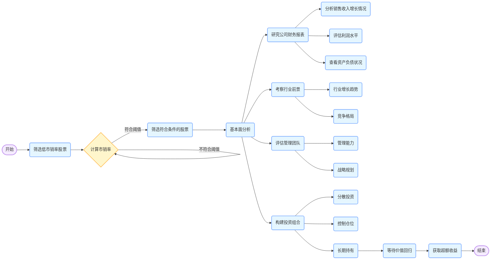

# 约翰·内夫的低市销率投资：另一种价值投资视角

> 关键词：约翰·内夫、低市销率投资、价值投资、财务分析、投资策略

> 摘要：本文深入探讨了约翰·内夫所倡导的低市销率投资这一独特的价值投资视角。首先介绍了相关背景知识，包括目的、预期读者、文档结构和术语表等。接着阐述了低市销率投资的核心概念及其联系，通过文本示意图和 Mermaid 流程图进行直观展示。详细讲解了核心算法原理，并给出 Python 源代码。同时，对涉及的数学模型和公式进行了详细说明与举例。通过项目实战，展示了低市销率投资在实际中的应用，包括开发环境搭建、源代码实现与解读。分析了其实际应用场景，并推荐了相关的工具和资源。最后总结了低市销率投资的未来发展趋势与挑战，还提供了常见问题解答和扩展阅读参考资料，帮助读者全面理解和运用这一投资策略。

## 1. 背景介绍 
### 1.1 目的和范围
本文章的主要目的是全面剖析约翰·内夫的低市销率投资策略，为投资者提供一种有别于传统价值投资的新思路。通过详细阐述该策略的核心概念、算法原理、数学模型以及实际应用案例，帮助读者深入理解低市销率投资的本质和操作方法。同时，分析其在不同市场环境下的适用性和局限性，为投资者在制定投资决策时提供参考。范围涵盖了从理论基础到实际操作的各个方面，包括对财务指标的分析、投资组合的构建以及风险控制等内容。

### 1.2 预期读者
本文预期读者主要包括对价值投资感兴趣的个人投资者、金融专业学生、投资顾问以及从事金融研究的专业人士。无论是初学者希望了解投资的基本概念和方法，还是有一定经验的投资者寻求优化投资策略，都能从本文中获得有价值的信息。

### 1.3 文档结构概述
本文将按照以下结构进行阐述：首先介绍相关背景知识，包括目的、读者群体、文档结构和术语表。接着深入探讨低市销率投资的核心概念及其联系，通过示意图和流程图进行直观呈现。然后详细讲解核心算法原理，并给出 Python 代码示例。之后介绍相关的数学模型和公式，并结合实际案例进行说明。通过项目实战展示低市销率投资在实际中的应用，包括环境搭建、代码实现和解读。分析其实际应用场景，推荐相关的工具和资源。最后总结未来发展趋势与挑战，提供常见问题解答和扩展阅读参考资料。

### 1.4 术语表
#### 1.4.1 核心术语定义
- **低市销率投资**：指投资者通过筛选市销率较低的股票进行投资的策略。市销率是衡量股票估值的一个重要指标，低市销率意味着公司的市值相对其销售收入较低，可能存在被低估的情况。
- **市销率（PS）**：市销率是指公司市值与主营业务收入的比率，计算公式为 $PS = \frac{总市值}{主营业务收入}$。它反映了市场对公司销售收入的估值水平。
- **价值投资**：一种投资理念，强调通过分析公司的基本面，寻找被市场低估的股票，以长期持有获取价值回归带来的收益。

#### 1.4.2 相关概念解释
- **基本面分析**：通过研究公司的财务报表、行业前景、管理团队等因素，评估公司的内在价值。在低市销率投资中，基本面分析是筛选股票的重要依据，用于判断公司的销售收入质量和增长潜力。
- **投资组合**：投资者将资金分散投资于多种不同的资产或股票，以降低风险。在低市销率投资中，构建合理的投资组合可以平衡不同股票的风险和收益。

#### 1.4.3 缩略词列表
- **PS**：市销率（Price - to - Sales Ratio）
- **ROE**：净资产收益率（Return on Equity）

## 2. 核心概念与联系 

### 核心概念原理
约翰·内夫的低市销率投资策略基于价值投资的基本理念，认为市场有时会对某些公司的价值产生误判。市销率作为一个重要的估值指标，能够反映公司市值与销售收入之间的关系。当市销率较低时，意味着公司的市值相对其销售收入较低，可能存在被低估的情况。

低市销率投资的核心在于寻找那些销售收入稳定或增长，但市值被市场低估的公司。通过投资这些公司的股票，投资者有望在公司价值回归时获得超额收益。同时，低市销率的公司通常具有一定的安全边际，即使公司的盈利情况不佳，其销售收入也能为股票提供一定的支撑。

### 架构的文本示意图
```plaintext
低市销率投资策略
|
|-- 筛选低市销率股票
|   |-- 计算市销率
|   |-- 设定市销率阈值
|   |-- 筛选符合条件的股票
|
|-- 基本面分析
|   |-- 研究公司财务报表
|   |   |-- 分析销售收入增长情况
|   |   |-- 评估利润水平
|   |   |-- 查看资产负债状况
|   |-- 考察行业前景
|   |   |-- 行业增长趋势
|   |   |-- 竞争格局
|   |-- 评估管理团队
|       |-- 管理能力
|       |-- 战略规划
|
|-- 构建投资组合
|   |-- 分散投资
|   |-- 控制仓位
|
|-- 长期持有
|   |-- 等待价值回归
|   |-- 获取超额收益
```

### Mermaid 流程图


## 3. 核心算法原理 & 具体操作步骤 

### 核心算法原理
低市销率投资的核心算法主要围绕市销率的计算和股票筛选展开。市销率的计算公式为：

$PS = \frac{总市值}{主营业务收入}$

其中，总市值等于公司当前股价乘以总股本，主营业务收入可以从公司的财务报表中获取。

在筛选股票时，我们需要设定一个市销率阈值，将市销率低于该阈值的股票筛选出来。然后，对这些股票进行基本面分析，进一步评估其投资价值。

### 具体操作步骤
1. **数据收集**：收集上市公司的股价、总股本和主营业务收入等数据。可以通过金融数据提供商（如东方财富、同花顺等）或公司的官方财务报表获取这些数据。
2. **计算市销率**：根据上述公式计算每只股票的市销率。
3. **设定阈值**：根据市场情况和个人投资偏好，设定一个市销率阈值。一般来说，市销率低于 1 的股票被认为具有较低的估值。
4. **筛选股票**：将市销率低于阈值的股票筛选出来，形成一个初步的股票池。
5. **基本面分析**：对股票池中的股票进行基本面分析，包括分析销售收入增长情况、利润水平、资产负债状况、行业前景和管理团队等因素。
6. **构建投资组合**：根据基本面分析的结果，选择部分股票构建投资组合，并合理控制仓位。
7. **长期持有**：长期持有投资组合中的股票，等待公司价值回归，获取超额收益。

### Python 源代码实现
```python
import pandas as pd

# 模拟数据，实际应用中需要从金融数据提供商获取
data = {
    '股票代码': ['000001', '000002', '000003', '000004', '000005'],
    '股价': [10, 20, 15, 25, 30],
    '总股本': [1000, 2000, 1500, 2500, 3000],
    '主营业务收入': [15000, 35000, 20000, 40000, 50000]
}

df = pd.DataFrame(data)

# 计算总市值
df['总市值'] = df['股价'] * df['总股本']

# 计算市销率
df['市销率'] = df['总市值'] / df['主营业务收入']

# 设定市销率阈值
ps_threshold = 1

# 筛选市销率低于阈值的股票
filtered_df = df[df['市销率'] < ps_threshold]

print("筛选后的股票：")
print(filtered_df)
```

### 代码解释
1. **数据模拟**：使用 `pandas` 库创建一个包含股票代码、股价、总股本和主营业务收入的 DataFrame。
2. **计算总市值**：通过将股价乘以总股本，计算每只股票的总市值。
3. **计算市销率**：根据市销率的计算公式，计算每只股票的市销率。
4. **设定阈值**：设定市销率阈值为 1。
5. **筛选股票**：使用布尔索引筛选出市销率低于阈值的股票。
6. **输出结果**：打印筛选后的股票信息。

## 4. 数学模型和公式 & 详细讲解 & 举例说明 

### 市销率公式
市销率的计算公式为：

$$PS = \frac{总市值}{主营业务收入}$$

其中，总市值 $M$ 可以表示为股价 $P$ 乘以总股本 $N$，即 $M = P \times N$。因此，市销率公式也可以写成：

$$PS = \frac{P \times N}{主营业务收入}$$

### 详细讲解
市销率反映了市场对公司销售收入的估值水平。市销率越低，说明公司的市值相对其销售收入越低，可能存在被低估的情况。例如，一家公司的总市值为 1 亿元，主营业务收入为 2 亿元，则其市销率为 $PS = \frac{1}{2} = 0.5$。这意味着市场愿意为该公司每 1 元的销售收入支付 0.5 元的市值。

市销率的优点在于它不受公司盈利水平的影响，即使公司当前处于亏损状态，只要有销售收入，就可以计算市销率。因此，市销率可以作为评估那些尚未盈利但有销售收入增长潜力的公司的一个重要指标。

### 举例说明
假设我们有两家公司 A 和 B，它们的相关财务数据如下：

| 公司 | 股价（元） | 总股本（万股） | 主营业务收入（万元） |
| ---- | ---- | ---- | ---- |
| A | 10 | 1000 | 5000 |
| B | 20 | 2000 | 20000 |

首先，计算两家公司的总市值：
- 公司 A 的总市值 $M_A = 10 \times 1000 = 10000$（万元）
- 公司 B 的总市值 $M_B = 20 \times 2000 = 40000$（万元）

然后，计算两家公司的市销率：
- 公司 A 的市销率 $PS_A = \frac{10000}{5000} = 2$
- 公司 B 的市销率 $PS_B = \frac{40000}{20000} = 2$

从市销率来看，两家公司的估值水平相同。但如果进一步分析公司的销售收入增长情况、利润水平等因素，可能会发现其中一家公司更具有投资价值。

## 5. 项目实战：代码实际案例和详细解释说明 

### 5.1  开发环境搭建
#### 操作系统
本项目可以在 Windows、Linux 或 macOS 等主流操作系统上进行开发。建议使用 64 位操作系统以获得更好的性能。

#### 编程语言和环境
- **Python**：选择 Python 3.7 及以上版本。Python 是一种功能强大、易于学习的编程语言，拥有丰富的数据分析和金融计算库。
- **Anaconda**：推荐使用 Anaconda 来管理 Python 环境。Anaconda 包含了 Python 解释器以及许多常用的科学计算和数据分析库，安装方便。

#### 安装必要的库
在命令行中使用 `pip` 或 `conda` 安装以下必要的库：
```bash
pip install pandas
pip install numpy
pip install yfinance  # 用于获取金融数据
```

### 5.2  源代码详细实现和代码解读
```python
import pandas as pd
import yfinance as yf

# 定义股票列表
stock_list = ['AAPL', 'MSFT', 'GOOG', 'AMZN', 'FB']

# 获取股票数据
data = yf.download(stock_list, start='2020-01-01', end='2021-01-01')

# 获取最新股价
latest_prices = data['Close'].iloc[-1]

# 获取公司基本信息
company_info = {}
for stock in stock_list:
    ticker = yf.Ticker(stock)
    company_info[stock] = ticker.info

# 计算总股本和主营业务收入
shares_outstanding = {}
total_revenue = {}
for stock in stock_list:
    shares_outstanding[stock] = company_info[stock]['sharesOutstanding']
    total_revenue[stock] = company_info[stock]['totalRevenue']

# 计算总市值
market_cap = {}
for stock in stock_list:
    market_cap[stock] = latest_prices[stock] * shares_outstanding[stock]

# 计算市销率
ps_ratio = {}
for stock in stock_list:
    ps_ratio[stock] = market_cap[stock] / total_revenue[stock]

# 将结果转换为 DataFrame
result_df = pd.DataFrame({
    '股价': latest_prices,
    '总股本': shares_outstanding,
    '主营业务收入': total_revenue,
    '总市值': market_cap,
    '市销率': ps_ratio
})

# 设定市销率阈值
ps_threshold = 5

# 筛选市销率低于阈值的股票
filtered_df = result_df[result_df['市销率'] < ps_threshold]

print("筛选后的股票：")
print(filtered_df)
```

### 5.3  代码解读与分析
1. **导入必要的库**：导入 `pandas` 用于数据处理和分析，`yfinance` 用于获取金融数据。
2. **定义股票列表**：定义要分析的股票列表，这里选择了苹果（AAPL）、微软（MSFT）、谷歌（GOOG）、亚马逊（AMZN）和脸书（FB）。
3. **获取股票数据**：使用 `yfinance` 的 `download` 函数获取指定时间范围内的股票数据，包括开盘价、收盘价、最高价、最低价等。
4. **获取最新股价**：从股票数据中提取最新的收盘价作为最新股价。
5. **获取公司基本信息**：使用 `yfinance` 的 `Ticker` 类获取每家公司的基本信息，包括总股本和主营业务收入。
6. **计算总市值**：将最新股价乘以总股本，计算每家公司的总市值。
7. **计算市销率**：根据市销率的计算公式，计算每家公司的市销率。
8. **将结果转换为 DataFrame**：将计算结果存储在 `pandas` 的 DataFrame 中，方便后续处理和分析。
9. **设定市销率阈值**：设定市销率阈值为 5。
10. **筛选股票**：使用布尔索引筛选出市销率低于阈值的股票。
11. **输出结果**：打印筛选后的股票信息。

## 6. 实际应用场景 
### 股票投资
低市销率投资策略可以用于股票投资，帮助投资者筛选出被市场低估的股票。通过分析公司的市销率和基本面情况，投资者可以选择具有投资价值的股票构建投资组合，长期持有以获取价值回归带来的收益。

### 基金投资
基金经理也可以运用低市销率投资策略来构建基金组合。通过筛选低市销率的股票，基金可以在一定程度上降低投资风险，提高投资回报。

### 行业分析
低市销率投资策略还可以用于行业分析。通过比较不同行业的市销率水平，投资者可以了解各个行业的估值情况，发现被低估的行业。同时，也可以分析行业内不同公司的市销率差异，找出具有竞争优势的公司。

### 风险控制
在投资过程中，低市销率的股票通常具有一定的安全边际。即使公司的盈利情况不佳，其销售收入也能为股票提供一定的支撑。因此，低市销率投资策略可以作为一种风险控制手段，帮助投资者降低投资组合的波动性。

## 7. 工具和资源推荐
### 7.1 学习资源推荐
#### 7.1.1 书籍推荐
- 《约翰·内夫的成功投资》：本书是约翰·内夫的投资经验总结，详细介绍了他的低市销率投资策略和投资理念。
- 《聪明的投资者》：本杰明·格雷厄姆的经典著作，价值投资的奠基之作，对低市销率投资有重要的指导意义。
- 《财务报表分析与证券定价》：帮助读者掌握财务报表分析的方法和技巧，对于理解低市销率投资中的基本面分析至关重要。

#### 7.1.2 在线课程
- Coursera 上的“投资学原理”：该课程涵盖了投资的基本概念、理论和方法，包括价值投资和低市销率投资等内容。
- 网易云课堂上的“财务报表分析实战”：通过实际案例讲解财务报表分析的方法和技巧，有助于提高投资者的基本面分析能力。

#### 7.1.3 技术博客和网站
- 雪球网：国内知名的投资社区，有大量的投资者分享投资经验和研究成果，包括低市销率投资的相关讨论。
- Seeking Alpha：国外知名的金融投资网站，提供丰富的股票分析和投资建议，对低市销率投资有深入的研究。

### 7.2 开发工具框架推荐
#### 7.2.1 IDE和编辑器
- PyCharm：一款专业的 Python 集成开发环境，功能强大，提供代码编辑、调试、版本控制等功能，适合开发复杂的 Python 程序。
- Jupyter Notebook：一种交互式的开发环境，支持 Python 代码的编写、运行和可视化展示，适合进行数据分析和实验。

#### 7.2.2 调试和性能分析工具
- `pdb`：Python 自带的调试工具，可以帮助开发者定位和解决代码中的问题。
- `cProfile`：Python 的性能分析工具，可以分析代码的运行时间和函数调用情况，帮助开发者优化代码性能。

#### 7.2.3 相关框架和库
- `pandas`：用于数据处理和分析的 Python 库，提供了丰富的数据结构和函数，方便进行金融数据的处理和分析。
- `numpy`：Python 的数值计算库，提供了高效的数组操作和数学函数，是许多数据分析和机器学习库的基础。
- `yfinance`：用于获取金融数据的 Python 库，可以方便地获取股票、基金等金融产品的历史数据和基本信息。

### 7.3 相关论文著作推荐
#### 7.3.1 经典论文
- Fama, E. F., & French, K. R. (1992). The cross - section of expected stock returns. The Journal of Finance, 47(2), 427 - 465. 该论文提出了著名的 Fama - French 三因子模型，对股票收益的影响因素进行了深入研究，对低市销率投资有一定的理论支持。
- Graham, B., & Dodd, D. L. (1934). Security Analysis. 本杰明·格雷厄姆和大卫·多德的经典著作，奠定了价值投资的理论基础，对低市销率投资的发展有重要影响。

#### 7.3.2 最新研究成果
- Novy - Marx, R. (2013). The other side of value: The gross profitability premium. The Journal of Financial Economics, 108(1), 1 - 28. 该论文研究了公司盈利能力对股票收益的影响，为低市销率投资提供了新的视角。

#### 7.3.3 应用案例分析
- Asness, C. S., Frazzini, A., & Pedersen, L. H. (2019). Quality minus junk. The Journal of Financial Economics, 131(2), 349 - 378. 该论文通过实证研究分析了质量因子和低市销率等价值因子在投资组合中的应用效果。

## 8. 总结：未来发展趋势与挑战
### 未来发展趋势
- **与其他投资策略融合**：低市销率投资策略可能会与其他投资策略如成长投资、动量投资等进行融合，形成更加多元化的投资策略。通过结合不同策略的优势，可以提高投资组合的收益和风险控制能力。
- **大数据和人工智能的应用**：随着大数据和人工智能技术的发展，投资者可以利用更多的数据和先进的算法来筛选低市销率股票。例如，通过分析社交媒体数据、新闻舆情等非结构化数据，挖掘公司的潜在价值，提高投资决策的准确性。
- **国际化投资**：低市销率投资策略将不仅仅局限于国内市场，投资者可能会更加关注国际市场上的低市销率股票。随着全球经济一体化的发展，国际市场上的投资机会也越来越多，通过国际化投资可以进一步分散风险，提高投资回报。

### 挑战
- **市场有效性的挑战**：在有效市场中，股票价格已经反映了所有可用的信息，低市销率股票可能并不一定被低估。因此，投资者需要更加深入地分析公司的基本面和市场情况，以识别真正具有投资价值的低市销率股票。
- **行业差异的挑战**：不同行业的市销率水平存在较大差异，一些新兴行业的市销率可能普遍较高，而传统行业的市销率可能较低。因此，在使用低市销率投资策略时，需要考虑行业因素，不能简单地以市销率作为唯一的筛选标准。
- **宏观经济环境的挑战**：宏观经济环境的变化会对公司的销售收入和市值产生影响，从而影响低市销率投资策略的有效性。例如，在经济衰退期间，许多公司的销售收入会下降，市销率可能会上升，这增加了筛选低市销率股票的难度。

## 9. 附录：常见问题与解答
### 问题 1：市销率越低越好吗？
市销率越低通常意味着公司的市值相对其销售收入越低，可能存在被低估的情况。但市销率并不是越低越好，还需要结合公司的基本面情况进行分析。例如，一些公司的市销率较低可能是由于其销售收入增长乏力或盈利能力较差。因此，在使用市销率筛选股票时，需要综合考虑其他因素。

### 问题 2：低市销率投资策略适合短期投资吗？
低市销率投资策略更适合长期投资。该策略的核心是寻找被市场低估的股票，等待公司价值回归。公司价值的回归通常需要一定的时间，因此需要投资者有足够的耐心和长期投资的理念。短期投资可能会受到市场波动的影响，难以实现价值回归带来的收益。

### 问题 3：如何确定市销率阈值？
市销率阈值的确定需要考虑市场情况、行业特点和个人投资偏好等因素。一般来说，市销率低于 1 的股票被认为具有较低的估值，但不同行业的市销率水平存在较大差异。投资者可以通过分析行业平均市销率和历史市销率数据，结合自己的投资目标和风险承受能力，确定一个合适的市销率阈值。

### 问题 4：低市销率投资策略有哪些风险？
低市销率投资策略的风险主要包括：
- **公司基本面恶化的风险**：如果公司的销售收入持续下降或盈利能力恶化，即使市销率较低，股票价格也可能继续下跌。
- **市场风格转变的风险**：市场风格可能会发生转变，导致低市销率股票不再受到市场青睐。
- **行业竞争加剧的风险**：如果行业竞争加剧，公司的市场份额可能会下降，销售收入和市值也会受到影响。

## 10. 扩展阅读 & 参考资料
### 扩展阅读
- 《彼得·林奇的成功投资》：介绍了彼得·林奇的投资方法和理念，对投资者有很大的启发。
- 《巴菲特致股东的信》：巴菲特历年致股东的信，包含了他的投资思想和经验，是价值投资者的必读之作。

### 参考资料
- 东方财富网：提供丰富的金融数据和资讯，是投资者获取信息的重要渠道。
- 同花顺财经：国内知名的金融财经网站，提供股票行情、财务分析等服务。

作者：AI天才研究院/AI Genius Institute & 禅与计算机程序设计艺术 /Zen And The Art of Computer Programming