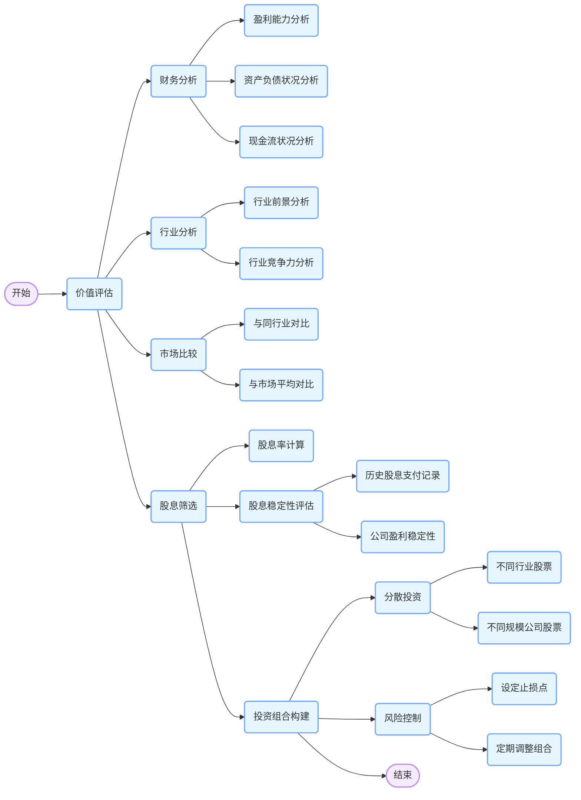

# 约翰·奈夫的高股息价值投资：稳定收益的来源

> 关键词：约翰·奈夫、高股息价值投资、稳定收益、投资策略、股息率

> 摘要：本文深入探讨了约翰·奈夫的高股息价值投资策略，旨在揭示稳定收益的来源。首先介绍了该投资理念的背景，包括目的、预期读者等信息。接着详细阐述了核心概念，通过文本示意图和 Mermaid 流程图展示其架构。深入分析了核心算法原理，并给出 Python 代码示例。同时讲解了相关数学模型和公式，结合实际案例进行说明。通过项目实战部分，展示了开发环境搭建、源代码实现及解读。探讨了该投资策略的实际应用场景，推荐了学习资源、开发工具框架和相关论文著作。最后总结了未来发展趋势与挑战，还提供了常见问题解答和扩展阅读参考资料。

## 1. 背景介绍 
### 1.1 目的和范围
本文章的主要目的是全面解析约翰·奈夫的高股息价值投资策略，深入探究其作为稳定收益来源的内在逻辑和运行机制。我们将详细分析该投资策略的核心概念、算法原理、数学模型等理论层面的内容，同时通过实际案例和项目实战，展示如何在实际投资中运用这一策略。范围涵盖了从理论到实践的多个方面，包括投资策略的基本原理、实际操作步骤、应用场景以及相关的工具和资源等。

### 1.2 预期读者
本文预期读者包括对投资领域感兴趣的初学者，希望通过学习专业的投资策略来开启自己的投资之旅；有一定投资经验的投资者，他们可以从本文中获取新的投资思路和方法，优化自己的投资组合；金融专业的学生和研究人员，他们可以将本文作为研究投资理论和实践的参考资料；以及从事金融投资相关工作的从业者，如基金经理、投资顾问等，他们可以从本文中获取灵感，提升自己的专业能力。

### 1.3 文档结构概述
本文将按照以下结构进行阐述：首先介绍约翰·奈夫高股息价值投资策略的背景信息，包括目的、预期读者和文档结构概述等；接着深入探讨核心概念，通过文本示意图和 Mermaid 流程图展示其架构；然后详细讲解核心算法原理，并给出 Python 代码示例；随后介绍相关的数学模型和公式，并结合实际案例进行说明；通过项目实战部分，展示开发环境搭建、源代码实现及解读；探讨该投资策略的实际应用场景；推荐学习资源、开发工具框架和相关论文著作；最后总结未来发展趋势与挑战，提供常见问题解答和扩展阅读参考资料。

### 1.4 术语表
#### 1.4.1 核心术语定义
- **高股息价值投资**：这是一种投资策略，强调寻找那些股息率较高且具有一定内在价值的股票进行投资。投资者期望通过股息收入和股票价值的增长来获得稳定的收益。
- **股息率**：指的是股息与股票价格之间的比率，通常以百分比表示。它反映了投资者从股票中获得的股息收益与股票投资成本的比例关系。计算公式为：股息率 = （年度股息 / 股票价格）× 100%。
- **内在价值**：是指股票本身所具有的真实价值，它基于公司的基本面因素，如盈利能力、资产状况、行业前景等。内在价值是投资者判断股票是否被低估或高估的重要依据。
- **市盈率（P/E）**：是指股票价格与每股收益之间的比率。它反映了投资者为获得公司每一元盈利所愿意支付的价格。计算公式为：市盈率 = 股票价格 / 每股收益。

#### 1.4.2 相关概念解释
- **价值投资**：是一种基于股票内在价值进行投资的理念。价值投资者认为，市场有时会对股票的价值做出错误的定价，通过深入研究公司的基本面，寻找那些被低估的股票进行投资，等待市场发现其真实价值并实现价格回归，从而获得投资收益。
- **股息**：是指公司按照一定的比例向股东分配的利润。股息是股东投资股票的一种重要收益来源，通常以现金或股票的形式发放。
- **股票价格波动**：股票价格会受到多种因素的影响，如市场供求关系、宏观经济环境、公司业绩等，从而导致价格在不同时间点上发生变化。这种价格的变化被称为股票价格波动。

#### 1.4.3 缩略词列表
- **P/E**：市盈率（Price-to-Earnings Ratio）
- **EPS**：每股收益（Earnings Per Share）

## 2. 核心概念与联系 

### 核心概念原理
约翰·奈夫的高股息价值投资策略核心在于寻找那些被市场低估但具有稳定股息支付能力的股票。其基本原理基于以下几点：
- **价值发现**：市场并非总是有效的，有时会对某些公司的股票定价过低。通过深入研究公司的基本面，如财务报表、行业竞争力等，寻找那些内在价值高于市场价格的股票。
- **股息收益**：股息是投资者从股票投资中获得的直接现金回报。高股息率的股票意味着投资者可以在持有股票的过程中获得相对稳定的现金流入，即使股票价格短期内波动，股息收益也能为投资者提供一定的保障。
- **长期投资**：高股息价值投资强调长期持有股票，通过时间的积累，让公司的内在价值逐渐被市场认可，股票价格实现回归，同时持续获得股息收益。

### 架构的文本示意图
```plaintext
高股息价值投资策略
|
|-- 价值评估
|   |-- 财务分析
|   |   |-- 盈利能力（如净利润、ROE）
|   |   |-- 资产负债状况（如资产负债率）
|   |   |-- 现金流状况（如经营现金流）
|   |-- 行业分析
|   |   |-- 行业前景
|   |   |-- 行业竞争力
|   |-- 市场比较
|       |-- 与同行业其他公司对比
|       |-- 与市场平均水平对比
|
|-- 股息筛选
|   |-- 股息率计算
|   |-- 股息稳定性评估
|       |-- 历史股息支付记录
|       |-- 公司盈利稳定性
|
|-- 投资组合构建
|   |-- 分散投资
|   |   |-- 不同行业股票
|   |   |-- 不同规模公司股票
|   |-- 风险控制
|       |-- 设定止损点
|       |-- 定期调整组合
```

### Mermaid 流程图


## 3. 核心算法原理 & 具体操作步骤 

### 核心算法原理
在高股息价值投资中，核心算法主要涉及到股票的价值评估和股息筛选。下面我们将详细介绍这些算法的原理，并给出 Python 代码示例。

#### 价值评估算法
价值评估的核心是计算股票的内在价值，并与市场价格进行比较。常用的方法是基于公司的财务指标，如市盈率（P/E）、市净率（P/B）等。这里我们以市盈率为例，假设我们认为合理的市盈率为 $P/E_{合理}$，公司的每股收益为 $EPS$，则股票的内在价值 $V$ 可以通过以下公式计算：

$V = EPS \times P/E_{合理}$

如果市场价格 $P_{市场}$ 低于内在价值 $V$，则认为该股票被低估。

#### 股息筛选算法
股息筛选的核心是计算股票的股息率，并评估股息的稳定性。股息率的计算公式为：

$股息率 = \frac{年度股息}{股票价格} \times 100\%$

同时，我们可以通过分析公司的历史股息支付记录和盈利稳定性来评估股息的稳定性。

### Python 代码示例
```python
import pandas as pd

# 假设我们有一个包含股票信息的 DataFrame
# 列名包括：'股票代码', '股票名称', '每股收益', '市场价格', '年度股息', '历史股息支付次数', '盈利稳定性评分'
stock_data = pd.DataFrame({
    '股票代码': ['000001', '000002', '000003'],
    '股票名称': ['股票 A', '股票 B', '股票 C'],
    '每股收益': [2.0, 1.5, 1.2],
    '市场价格': [20, 15, 10],
    '年度股息': [1.0, 0.8, 0.6],
    '历史股息支付次数': [5, 4, 3],
    '盈利稳定性评分': [8, 7, 6]
})

# 合理市盈率
PE_reasonable = 10

# 计算内在价值
stock_data['内在价值'] = stock_data['每股收益'] * PE_reasonable

# 计算股息率
stock_data['股息率'] = (stock_data['年度股息'] / stock_data['市场价格']) * 100

# 筛选被低估且股息率较高、股息稳定的股票
# 假设被低估的条件是市场价格低于内在价值
# 股息率较高的条件是股息率大于 5%
# 股息稳定的条件是历史股息支付次数大于 3 且盈利稳定性评分大于 6
selected_stocks = stock_data[
    (stock_data['市场价格'] < stock_data['内在价值']) &
    (stock_data['股息率'] > 5) &
    (stock_data['历史股息支付次数'] > 3) &
    (stock_data['盈利稳定性评分'] > 6)
]

print(selected_stocks)
```

### 具体操作步骤
1. **数据收集**：收集股票的相关信息，包括每股收益、市场价格、年度股息、历史股息支付记录、盈利稳定性评分等。可以通过金融数据提供商、公司财报等渠道获取这些数据。
2. **价值评估**：根据收集到的数据，计算股票的内在价值，并与市场价格进行比较，筛选出被低估的股票。
3. **股息筛选**：计算股票的股息率，并评估股息的稳定性，筛选出股息率较高且股息稳定的股票。
4. **投资组合构建**：从筛选出的股票中选择合适的股票构建投资组合，注意分散投资和风险控制。
5. **定期监控和调整**：定期监控投资组合中股票的表现，根据市场变化和公司基本面的变化，及时调整投资组合。

## 4. 数学模型和公式 & 详细讲解 & 举例说明 

### 数学模型和公式
#### 内在价值计算
如前面所述，基于市盈率的内在价值计算公式为：

$$V = EPS \times P/E_{合理}$$

其中，$V$ 表示股票的内在价值，$EPS$ 表示每股收益，$P/E_{合理}$ 表示合理的市盈率。

#### 股息率计算
股息率的计算公式为：

$$股息率 = \frac{年度股息}{股票价格} \times 100\%$$

#### 投资组合收益率计算
假设投资组合中有 $n$ 只股票，第 $i$ 只股票的投资比例为 $w_i$，收益率为 $r_i$，则投资组合的收益率 $R_p$ 可以通过以下公式计算：

$$R_p = \sum_{i=1}^{n} w_i r_i$$

### 详细讲解
#### 内在价值计算
内在价值是股票的真实价值，它反映了公司的基本面情况。合理的市盈率 $P/E_{合理}$ 可以根据行业平均水平、公司的成长前景等因素来确定。例如，对于成熟行业的公司，合理的市盈率可能相对较低；而对于高成长行业的公司，合理的市盈率可能相对较高。通过计算内在价值，并与市场价格进行比较，我们可以判断股票是否被低估或高估。

#### 股息率计算
股息率是衡量股票股息收益的重要指标。较高的股息率意味着投资者可以获得更多的现金回报。但是，股息率并不是越高越好，还需要考虑股息的稳定性。如果公司的股息支付不稳定，即使股息率较高，也可能存在风险。

#### 投资组合收益率计算
投资组合收益率反映了整个投资组合的收益情况。通过合理分配投资比例 $w_i$，可以实现风险分散和收益优化。例如，如果我们将更多的资金分配给收益率较高且风险较低的股票，可以提高投资组合的整体收益率。

### 举例说明
假设我们有两只股票 A 和 B，相关信息如下：

| 股票 | 每股收益（$EPS$） | 合理市盈率（$P/E_{合理}$） | 市场价格 | 年度股息 | 投资比例 | 预期收益率 |
| ---- | ---- | ---- | ---- | ---- | ---- | ---- |
| A | 2.0 | 10 | 15 | 1.0 | 0.6 | 10% |
| B | 1.5 | 12 | 20 | 0.8 | 0.4 | 8% |

#### 内在价值计算
股票 A 的内在价值：

$$V_A = EPS_A \times P/E_{合理,A} = 2.0 \times 10 = 20$$

股票 B 的内在价值：

$$V_B = EPS_B \times P/E_{合理,B} = 1.5 \times 12 = 18$$

可以看出，股票 A 的市场价格低于内在价值，被低估；股票 B 的市场价格高于内在价值，被高估。

#### 股息率计算
股票 A 的股息率：

$$股息率_A = \frac{年度股息_A}{股票价格_A} \times 100\% = \frac{1.0}{15} \times 100\% \approx 6.67\%$$

股票 B 的股息率：

$$股息率_B = \frac{年度股息_B}{股票价格_B} \times 100\% = \frac{0.8}{20} \times 100\% = 4\%$$

#### 投资组合收益率计算
投资组合的收益率：

$$R_p = w_A r_A + w_B r_B = 0.6 \times 10\% + 0.4 \times 8\% = 6\% + 3.2\% = 9.2\%$$

## 5. 项目实战：代码实际案例和详细解释说明 

### 5.1  开发环境搭建
#### 安装 Python
首先，需要安装 Python 环境。可以从 Python 官方网站（https://www.python.org/downloads/）下载适合自己操作系统的 Python 安装包，并按照安装向导进行安装。

#### 安装必要的库
在高股息价值投资的项目实战中，我们需要使用一些 Python 库来处理数据和进行分析。常用的库包括 `pandas`、`numpy` 等。可以使用以下命令来安装这些库：

```bash
pip install pandas numpy
```

### 5.2  源代码详细实现和代码解读
```python
import pandas as pd
import numpy as np

# 模拟股票数据
stock_data = pd.DataFrame({
    '股票代码': ['000001', '000002', '000003', '000004', '000005'],
    '股票名称': ['股票 A', '股票 B', '股票 C', '股票 D', '股票 E'],
    '每股收益': [2.0, 1.5, 1.2, 1.8, 2.2],
    '市场价格': [20, 15, 10, 25, 30],
    '年度股息': [1.0, 0.8, 0.6, 1.2, 1.5],
    '历史股息支付次数': [5, 4, 3, 6, 5],
    '盈利稳定性评分': [8, 7, 6, 9, 8]
})

# 合理市盈率
PE_reasonable = 10

# 计算内在价值
stock_data['内在价值'] = stock_data['每股收益'] * PE_reasonable

# 计算股息率
stock_data['股息率'] = (stock_data['年度股息'] / stock_data['市场价格']) * 100

# 筛选被低估且股息率较高、股息稳定的股票
# 假设被低估的条件是市场价格低于内在价值
# 股息率较高的条件是股息率大于 5%
# 股息稳定的条件是历史股息支付次数大于 3 且盈利稳定性评分大于 6
selected_stocks = stock_data[
    (stock_data['市场价格'] < stock_data['内在价值']) &
    (stock_data['股息率'] > 5) &
    (stock_data['历史股息支付次数'] > 3) &
    (stock_data['盈利稳定性评分'] > 6)
]

# 构建投资组合
# 假设平均分配资金
num_stocks = len(selected_stocks)
if num_stocks > 0:
    selected_stocks['投资比例'] = 1 / num_stocks

    # 模拟预期收益率
    selected_stocks['预期收益率'] = np.random.uniform(0.05, 0.15, num_stocks)

    # 计算投资组合收益率
    portfolio_return = np.sum(selected_stocks['投资比例'] * selected_stocks['预期收益率'])
    print("投资组合收益率:", portfolio_return)
else:
    print("没有符合条件的股票。")

print(selected_stocks)
```

### 代码解读与分析
1. **数据模拟**：使用 `pandas` 库创建一个包含股票信息的 DataFrame，模拟真实的股票数据。
2. **内在价值计算**：根据每股收益和合理市盈率计算股票的内在价值，并将结果添加到 DataFrame 中。
3. **股息率计算**：根据年度股息和市场价格计算股票的股息率，并将结果添加到 DataFrame 中。
4. **股票筛选**：根据被低估、股息率较高和股息稳定的条件筛选出符合要求的股票。
5. **投资组合构建**：如果有符合条件的股票，平均分配资金构建投资组合，并模拟预期收益率。
6. **投资组合收益率计算**：根据投资比例和预期收益率计算投资组合的收益率。

通过这个项目实战，我们可以看到如何使用 Python 代码实现高股息价值投资的策略，从数据处理到股票筛选，再到投资组合构建和收益率计算，整个过程清晰明了。

## 6. 实际应用场景 
### 个人投资者
对于个人投资者来说，约翰·奈夫的高股息价值投资策略是一种较为稳健的投资方式。个人投资者通常资金规模相对较小，风险承受能力有限。高股息价值投资可以为他们提供稳定的股息收入，降低投资风险。例如，一位退休老人将自己的一部分积蓄投资于高股息股票，每月可以获得固定的股息收入，用于日常生活开销。同时，随着公司的发展和股票价值的提升，还可以获得资本增值收益。

### 机构投资者
机构投资者，如基金公司、保险公司等，也广泛应用高股息价值投资策略。基金公司可以通过构建高股息价值投资组合，吸引那些追求稳定收益的投资者。保险公司则可以将高股息股票作为资产配置的一部分，以满足其长期负债的资金需求。例如，某基金公司推出了一只高股息价值基金，通过筛选具有高股息率和低估值的股票，为投资者提供了稳定的收益。

### 长期投资规划
高股息价值投资适合长期投资规划。投资者可以将其作为一种资产配置的方式，将一部分资金长期投资于高股息股票。随着时间的推移，股息的复利效应会逐渐显现，为投资者带来可观的收益。例如，投资者在年轻时开始投资高股息股票，通过几十年的积累，不仅可以获得丰厚的股息收入，还可以实现资产的大幅增值，为退休后的生活提供保障。

### 市场波动期间的避险策略
在市场波动较大的时期，高股息价值投资可以作为一种避险策略。当市场下跌时，高股息股票通常具有一定的抗跌性，因为其股息收益可以在一定程度上弥补股票价格的下跌。例如，在金融危机期间，许多高股息股票的价格虽然也有所下跌，但由于其稳定的股息支付，投资者仍然可以获得一定的收益，降低了投资损失。

## 7. 工具和资源推荐
### 7.1 学习资源推荐
#### 7.1.1 书籍推荐
- 《约翰·奈夫的成功投资》：这是约翰·奈夫本人撰写的著作，详细介绍了他的投资理念、策略和方法。通过阅读这本书，读者可以深入了解高股息价值投资的精髓。
- 《聪明的投资者》：本杰明·格雷厄姆的经典著作，被誉为投资界的圣经。书中阐述了价值投资的基本原理和方法，对高股息价值投资具有重要的指导意义。
- 《巴菲特致股东的信：股份公司教程》：沃伦·巴菲特的书信集，包含了他多年来的投资经验和智慧。虽然巴菲特的投资风格与约翰·奈夫有所不同，但其中关于价值投资和股息的观点对高股息价值投资也有一定的启示。

#### 7.1.2 在线课程
- Coursera 上的“投资学原理”：该课程由知名大学的教授授课，系统地介绍了投资学的基本原理和方法，包括价值投资、股息投资等内容。
- Udemy 上的“高股息价值投资实战课程”：这是一门专门针对高股息价值投资的实战课程，通过实际案例和操作演示，帮助学员掌握高股息价值投资的技巧。

#### 7.1.3 技术博客和网站
- 雪球网：国内知名的投资社区，有大量的投资者分享自己的投资经验和观点。在雪球网上可以找到关于高股息价值投资的讨论和分析。
- Seeking Alpha：国外的投资研究网站，提供专业的股票分析和投资建议。该网站上有很多关于高股息股票的研究报告和分析文章。

### 7.2 开发工具框架推荐
#### 7.2.1 IDE和编辑器
- PyCharm：一款专业的 Python 集成开发环境，具有强大的代码编辑、调试和分析功能。对于使用 Python 进行高股息价值投资数据分析和策略实现的开发者来说，是一个不错的选择。
- Jupyter Notebook：一个交互式的开发环境，适合进行数据探索和分析。通过 Jupyter Notebook，开发者可以方便地编写和运行 Python 代码，并实时查看代码的运行结果。

#### 7.2.2 调试和性能分析工具
- pdb：Python 自带的调试工具，可以帮助开发者定位代码中的错误和问题。通过设置断点、单步执行等操作，开发者可以深入了解代码的执行过程。
- cProfile：Python 标准库中的性能分析工具，可以分析代码的运行时间和函数调用情况。通过使用 cProfile，开发者可以找出代码中的性能瓶颈，并进行优化。

#### 7.2.3 相关框架和库
- pandas：一个强大的数据处理和分析库，提供了丰富的数据结构和函数，方便开发者进行数据清洗、转换和分析。在高股息价值投资中，可以使用 pandas 处理股票数据。
- numpy：一个用于科学计算的库，提供了高效的数组和矩阵运算功能。在计算投资组合收益率等数学模型时，可以使用 numpy 进行数值计算。

### 7.3 相关论文著作推荐
#### 7.3.1 经典论文
- 《The Dividend Puzzle》：这篇论文探讨了股息政策的谜题，分析了公司为什么要支付股息以及股息政策对公司价值的影响。对于理解高股息价值投资的理论基础具有重要意义。
- 《Value Investing: The Use of Historical Financial Statement Information to Separate Winners from Losers》：该论文研究了如何利用历史财务报表信息筛选出有投资价值的股票，为高股息价值投资的股票筛选提供了理论支持。

#### 7.3.2 最新研究成果
- 关注金融领域的顶级学术期刊，如《Journal of Finance》、《Review of Financial Studies》等，这些期刊会发表关于投资策略、股息政策等方面的最新研究成果。
- 参加金融学术会议，如美国金融协会年会（AFA）、西部金融协会年会（WFA）等，在会议上可以了解到最新的研究动态和前沿观点。

#### 7.3.3 应用案例分析
- 研究一些知名基金公司的高股息价值投资组合案例，分析它们的选股策略、投资组合构建方法和业绩表现。可以通过基金公司的官方网站、年报等渠道获取相关信息。
- 关注一些成功的个人投资者的投资案例，了解他们在高股息价值投资中的实践经验和技巧。可以通过投资社区、财经媒体等渠道获取相关信息。

## 8. 总结：未来发展趋势与挑战
### 未来发展趋势
#### 科技与投资的融合
随着科技的不断发展，人工智能、大数据等技术将在高股息价值投资中得到更广泛的应用。通过利用这些技术，可以更高效地收集和分析股票数据，提高投资决策的准确性和效率。例如，利用人工智能算法对公司的财务报表进行分析，挖掘潜在的投资机会；利用大数据技术对市场情绪和投资者行为进行监测，及时调整投资组合。

#### 可持续投资的兴起
可持续投资已经成为全球投资领域的一个重要趋势。投资者越来越关注公司的环境、社会和治理（ESG）表现，将其作为投资决策的重要因素之一。在高股息价值投资中，也将更加注重选择那些具有良好 ESG 表现的公司。这些公司通常具有更强的竞争力和稳定性，能够为投资者提供更可持续的股息收益。

#### 全球投资机会的增加
随着全球经济的一体化和金融市场的开放，投资者将有更多的机会投资于全球范围内的高股息股票。不同国家和地区的经济发展阶段、行业结构和政策环境存在差异，这为投资者提供了更多的投资选择和分散风险的机会。例如，投资者可以通过投资新兴市场的高股息股票，分享这些地区经济快速发展的红利。

### 挑战
#### 市场不确定性增加
全球经济和政治环境的不确定性增加，如贸易摩擦、地缘政治冲突、货币政策变化等，将对股票市场产生较大的影响。高股息股票也难以完全避免市场波动的风险，投资者需要更加谨慎地进行投资决策。例如，在贸易摩擦期间，一些出口型企业的业绩可能受到影响，导致其股息支付能力下降。

#### 股息政策的变化
公司的股息政策受到多种因素的影响，如盈利状况、发展战略、资金需求等。一些公司可能会根据自身情况调整股息政策，减少或暂停股息支付。这将给高股息价值投资者带来一定的风险。投资者需要密切关注公司的基本面变化，及时调整投资组合。

#### 竞争加剧
随着高股息价值投资策略的普及，越来越多的投资者开始关注和应用这一策略，导致市场竞争加剧。这可能会使一些高股息股票的价格被高估，投资回报率下降。投资者需要更加深入地研究和分析，寻找那些真正被低估且具有高股息潜力的股票。

## 9. 附录：常见问题与解答
### 高股息股票一定是好的投资选择吗？
不一定。虽然高股息股票可以为投资者提供稳定的股息收入，但股息率并不是衡量股票投资价值的唯一标准。投资者还需要考虑公司的基本面情况，如盈利能力、资产负债状况、行业前景等。如果公司的业绩不佳，即使股息率较高，也可能存在股息支付不稳定或股票价格下跌的风险。

### 如何确定合理的市盈率？
合理的市盈率可以根据行业平均水平、公司的成长前景等因素来确定。一般来说，成熟行业的公司合理市盈率相对较低，而高成长行业的公司合理市盈率相对较高。投资者可以参考同行业其他公司的市盈率，结合公司的具体情况进行判断。此外，还可以使用一些估值模型，如现金流折现模型等，来计算公司的内在价值，从而确定合理的市盈率。

### 投资高股息股票需要注意哪些风险？
投资高股息股票需要注意以下风险：
- **股息政策变化风险**：公司可能会根据自身情况调整股息政策，减少或暂停股息支付。
- **市场波动风险**：股票价格会受到市场供求关系、宏观经济环境等因素的影响，可能会出现波动。
- **公司基本面风险**：如果公司的业绩不佳、财务状况恶化等，可能会影响其股息支付能力和股票价值。
- **行业竞争风险**：所处行业竞争激烈可能会导致公司的市场份额下降、盈利能力减弱，从而影响股息支付和股票价格。

### 如何构建高股息价值投资组合？
构建高股息价值投资组合可以按照以下步骤进行：
1. **筛选股票**：根据股息率、内在价值、股息稳定性等指标筛选出符合要求的股票。
2. **分散投资**：选择不同行业、不同规模的股票进行投资，以降低投资组合的风险。
3. **确定投资比例**：根据自己的风险承受能力和投资目标，确定每只股票的投资比例。
4. **定期调整**：定期监控投资组合中股票的表现，根据市场变化和公司基本面的变化，及时调整投资组合。

## 10. 扩展阅读 & 参考资料
### 扩展阅读
- 《投资中最简单的事》：邱国鹭的著作，结合中国市场的实际情况，阐述了价值投资的理念和方法，对高股息价值投资有一定的借鉴意义。
- 《财务自由之路》：博多·舍费尔的书籍，提供了关于个人理财和投资的实用建议，帮助读者实现财务自由的目标。
### 参考资料
- 《约翰·奈夫的成功投资》，约翰·奈夫著
- 《聪明的投资者》，本杰明·格雷厄姆著
- 《The Dividend Puzzle》，作者：Frankfurter, George M.; Wood, Gary E.
- 《Value Investing: The Use of Historical Financial Statement Information to Separate Winners from Losers》，作者：Joseph D. Piotroski

作者：AI天才研究院/AI Genius Institute & 禅与计算机程序设计艺术 /Zen And The Art of Computer Programming