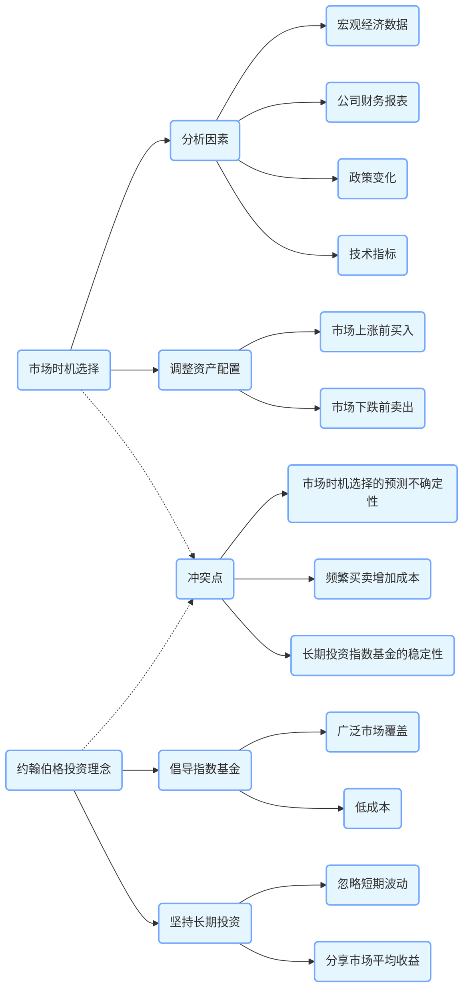

# 约翰伯格对市场时机选择的看法

> 关键词：约翰伯格、市场时机选择、投资理念、指数基金、长期投资

> 摘要：本文深入探讨了约翰伯格对市场时机选择的看法。约翰伯格作为投资界的传奇人物，其观点对投资者产生了深远影响。市场时机选择一直是投资领域的关键问题，约翰伯格对此持有独特且具有开创性的见解。他强调长期投资和指数基金的重要性，反对过度依赖市场时机选择来获取投资收益。通过对其观点的详细剖析，有助于投资者更好地理解投资的本质和正确的投资策略，从而在复杂多变的市场环境中做出更明智的决策。

## 1. 背景介绍 
### 1.1 目的和范围
本文旨在全面、深入地研究约翰伯格对市场时机选择的看法。通过对其相关著作、言论和投资理念的分析，探讨他为何对市场时机选择持有特定观点，以及这些观点对投资者的实际指导意义。研究范围涵盖约翰伯格的主要投资理论、市场时机选择的相关概念和实践，以及其观点在不同市场环境下的适用性和局限性。

### 1.2 预期读者
本文预期读者包括对投资领域感兴趣的普通投资者、专业投资人士、金融研究人员以及相关专业的学生。对于普通投资者，本文可以帮助他们了解更科学的投资理念，避免在市场时机选择上的盲目性；专业投资人士可以从约翰伯格的观点中获得新的启发，完善自己的投资策略；金融研究人员可以将本文作为研究投资理论和市场行为的参考资料；学生则可以通过本文加深对投资学相关知识的理解。

### 1.3 文档结构概述
本文将首先介绍约翰伯格的背景和投资成就，引出他对市场时机选择的看法。接着详细阐述市场时机选择的核心概念以及与其他投资理念的联系。然后深入分析约翰伯格反对市场时机选择的理论依据和具体理由。通过数学模型和公式进一步说明市场时机选择的难度和不确定性。再结合实际案例展示遵循约翰伯格理念的投资效果。探讨其观点在不同实际应用场景中的表现。推荐相关的学习资源、开发工具和研究论文，帮助读者进一步深入学习。最后总结约翰伯格观点的未来发展趋势与挑战，并解答常见问题，提供扩展阅读和参考资料。

### 1.4 术语表
#### 1.4.1 核心术语定义
- **市场时机选择**：指投资者试图通过预测市场的走势，在市场上涨之前买入资产，在市场下跌之前卖出资产，以获取最大收益的投资策略。
- **指数基金**：一种按照特定指数的成分股组成及其权重进行投资的基金，旨在复制指数的表现，通常具有较低的管理费用和广泛的市场覆盖。
- **长期投资**：指投资者将资金投入资产后，持有较长时间，通常为数年甚至数十年，以获取资产的长期增值收益，而不被短期市场波动所影响。

#### 1.4.2 相关概念解释
- **有效市场假说**：该理论认为在有效市场中，资产价格已经反映了所有可用的信息，因此投资者无法通过分析公开信息来获得超额收益。这与市场时机选择的理念存在冲突，因为市场时机选择假设投资者可以预测市场走势并获得超额收益。
- **随机漫步理论**：该理论认为股票价格的变动是随机的，无法通过历史数据或其他信息来预测。这也对市场时机选择的可行性提出了质疑。

#### 1.4.3 缩略词列表
- **ETF**：交易型开放式指数基金（Exchange - Traded Fund），是一种在交易所上市交易的、基金份额可变的开放式基金，通常跟踪特定的指数。

## 2. 核心概念与联系 

### 2.1 市场时机选择的原理
市场时机选择的核心原理基于投资者对市场趋势的预测。投资者通过分析各种因素，如宏观经济数据、公司财务报表、政策变化、技术指标等，试图判断市场的未来走势。如果预测市场将上涨，投资者会增加股票等风险资产的配置；如果预测市场将下跌，投资者会减少风险资产的配置，甚至持有现金或其他避险资产。

### 2.2 约翰伯格的投资理念
约翰伯格是指数基金的倡导者和长期投资理念的坚定支持者。他认为普通投资者很难准确预测市场的走势，因此不应该将精力放在市场时机选择上。他主张投资者通过投资低成本的指数基金，长期持有，分享市场的平均收益。指数基金由于其广泛的市场覆盖和较低的管理费用，能够在长期内为投资者提供较为稳定的回报。

### 2.3 两者的联系与冲突
市场时机选择和约翰伯格的投资理念存在明显的冲突。市场时机选择强调通过精准的市场预测来获取超额收益，而约翰伯格认为这种预测是几乎不可能实现的，并且频繁的买卖操作会增加交易成本，降低投资收益。他认为长期投资指数基金可以避免市场时机选择的不确定性，通过时间的积累实现资产的增值。

### 2.4 文本示意图
```plaintext
市场时机选择
|-- 依据各种因素预测市场走势
|   |-- 宏观经济数据
|   |-- 公司财务报表
|   |-- 政策变化
|   |-- 技术指标
|-- 调整资产配置
|   |-- 市场上涨前买入
|   |-- 市场下跌前卖出

约翰伯格投资理念
|-- 倡导指数基金
|   |-- 广泛市场覆盖
|   |-- 低成本
|-- 坚持长期投资
|   |-- 忽略短期波动
|   |-- 分享市场平均收益

冲突点
|-- 市场时机选择的预测不确定性
|-- 频繁买卖增加成本
|-- 长期投资指数基金的稳定性
```

### 2.5 Mermaid 流程图


## 3. 核心算法原理 & 具体操作步骤 

### 3.1 市场时机选择的算法原理
市场时机选择的算法原理通常基于技术分析和基本面分析。以下是一个简单的基于移动平均线的市场时机选择示例代码：

```python
import pandas as pd
import yfinance as yf
import matplotlib.pyplot as plt

# 下载股票数据
def download_data(ticker, start_date, end_date):
    data = yf.download(ticker, start=start_date, end=end_date)
    return data

# 计算短期和长期移动平均线
def calculate_moving_averages(data, short_window, long_window):
    data['short_ma'] = data['Close'].rolling(window=short_window).mean()
    data['long_ma'] = data['Close'].rolling(window=long_window).mean()
    return data

# 生成交易信号
def generate_signals(data):
    data['signal'] = 0
    data.loc[data['short_ma'] > data['long_ma'], 'signal'] = 1
    data.loc[data['short_ma'] < data['long_ma'], 'signal'] = -1
    data['position'] = data['signal'].diff()
    return data

# 回测策略
def backtest(data):
    initial_capital = float(100000.0)
    positions = pd.DataFrame(index=data.index).fillna(0.0)
    positions['Stock'] = data['signal']
    portfolio = positions.multiply(data['Close'], axis=0)
    pos_diff = positions.diff()
    portfolio['holdings'] = (positions.multiply(data['Close'], axis=0)).sum(axis=1)
    portfolio['cash'] = initial_capital - (pos_diff.multiply(data['Close'], axis=0)).sum(axis=1).cumsum()
    portfolio['total'] = portfolio['cash'] + portfolio['holdings']
    portfolio['returns'] = portfolio['total'].pct_change()
    return portfolio

# 主函数
def main():
    ticker = 'AAPL'
    start_date = '2010-01-01'
    end_date = '2020-12-31'
    short_window = 50
    long_window = 200

    data = download_data(ticker, start_date, end_date)
    data = calculate_moving_averages(data, short_window, long_window)
    data = generate_signals(data)
    portfolio = backtest(data)

    # 绘制图表
    fig = plt.figure(figsize=(14, 7))
    ax1 = fig.add_subplot(111, ylabel='Price in $')
    data['Close'].plot(ax=ax1, color='r', lw=2.)
    data[['short_ma', 'long_ma']].plot(ax=ax1, lw=2.)
    ax1.plot(data[data['position'] == 1.0].index,
             data['short_ma'][data['position'] == 1.0],
             '^', markersize=10, color='m')
    ax1.plot(data[data['position'] == -1.0].index,
             data['short_ma'][data['position'] == -1.0],
             'v', markersize=10, color='k')
    plt.show()

if __name__ == "__main__":
    main()
```

### 3.2 具体操作步骤
1. **数据下载**：使用 `yfinance` 库从雅虎财经下载指定股票的历史数据。
2. **计算移动平均线**：计算短期和长期移动平均线，短期移动平均线反映短期市场趋势，长期移动平均线反映长期市场趋势。
3. **生成交易信号**：当短期移动平均线大于长期移动平均线时，生成买入信号；当短期移动平均线小于长期移动平均线时，生成卖出信号。
4. **回测策略**：根据交易信号进行模拟交易，计算投资组合的价值和收益率。
5. **绘制图表**：绘制股票价格、移动平均线和交易信号的图表，直观展示策略的执行情况。

### 3.3 约翰伯格理念的操作步骤
约翰伯格理念强调长期投资指数基金，具体操作步骤如下：
1. **选择指数基金**：根据自己的投资目标和风险承受能力，选择合适的指数基金，如沪深 300 指数基金、标普 500 指数基金等。
2. **定期投资**：设定一个固定的投资金额和投资周期，如每月投资 1000 元，定期买入指数基金。
3. **长期持有**：忽略短期市场波动，坚持长期持有指数基金，分享市场的长期增长。

## 4. 数学模型和公式 & 详细讲解 & 举例说明 

### 4.1 市场时机选择的数学模型
市场时机选择的数学模型通常基于概率论和统计学。假设市场的涨跌是一个随机事件，上涨的概率为 $p$，下跌的概率为 $1 - p$。投资者进行市场时机选择的收益可以用以下公式表示：

设投资者初始资金为 $V_0$，在市场上涨时的收益率为 $r_1$，在市场下跌时的收益率为 $r_2$。如果投资者正确预测市场上涨并买入，其资产变为 $V_1 = V_0(1 + r_1)$；如果投资者正确预测市场下跌并卖出，其资产仍为 $V_0$；如果投资者预测错误，在市场上涨时卖出，其资产仍为 $V_0$，在市场下跌时买入，其资产变为 $V_2 = V_0(1 + r_2)$。

投资者进行 $n$ 次市场时机选择的期望收益 $E(V)$ 为：

$$E(V)=p\times\left[p\times V_0(1 + r_1)+(1 - p)\times V_0\right]+(1 - p)\times\left[p\times V_0+(1 - p)\times V_0(1 + r_2)\right]$$

### 4.2 详细讲解
- **概率 $p$ 的确定**：$p$ 是市场上涨的概率，在实际中很难准确确定。不同的投资者可能根据不同的分析方法得出不同的 $p$ 值。
- **收益率 $r_1$ 和 $r_2$ 的影响**：$r_1$ 和 $r_2$ 分别表示市场上涨和下跌时的收益率，它们受到市场环境、行业因素、公司基本面等多种因素的影响。
- **期望收益 $E(V)$ 的意义**：期望收益 $E(V)$ 表示投资者在多次市场时机选择后的平均收益。如果 $E(V)>V_0$，则说明市场时机选择策略在平均意义上是盈利的；如果 $E(V)<V_0$，则说明市场时机选择策略在平均意义上是亏损的。

### 4.3 举例说明
假设市场上涨的概率 $p = 0.5$，市场上涨时的收益率 $r_1 = 0.1$，市场下跌时的收益率 $r_2=-0.1$，投资者初始资金 $V_0 = 10000$ 元。

代入公式可得：

$$
\begin{align*}
E(V)&=0.5\times\left[0.5\times10000\times(1 + 0.1)+(0.5)\times10000\right]+(0.5)\times\left[0.5\times10000+(0.5)\times10000\times(1 - 0.1)\right]\\
&=0.5\times(0.5\times11000 + 5000)+0.5\times(5000+0.5\times9000)\\
&=0.5\times(5500 + 5000)+0.5\times(5000 + 4500)\\
&=0.5\times10500+0.5\times9500\\
&=5250+4750\\
&=10000
\end{align*}
$$

在这个例子中，投资者进行市场时机选择的期望收益等于初始资金，说明在这种情况下，市场时机选择策略并没有带来额外的收益。

### 4.4 约翰伯格理念的数学模型
约翰伯格的长期投资指数基金理念基于复利原理。假设投资者每年的投资收益率为 $r$，初始投资金额为 $P$，投资期限为 $n$ 年，则投资期末的资产价值 $A$ 可以用以下公式表示：

$$A = P(1 + r)^n$$

例如，投资者初始投资 10000 元，每年的投资收益率为 8%，投资期限为 30 年，则 30 年后的资产价值为：

$$A = 10000\times(1 + 0.08)^{30}\approx100626.57$$

这说明通过长期投资，即使收益率不高，也能实现资产的显著增值。

## 5. 项目实战：代码实际案例和详细解释说明 

### 5.1  开发环境搭建
1. **安装 Python**：从 Python 官方网站（https://www.python.org/downloads/）下载并安装 Python 3.x 版本。
2. **安装必要的库**：使用 `pip` 命令安装所需的库，如 `yfinance`、`pandas`、`matplotlib` 等。

```sh
pip install yfinance pandas matplotlib
```

### 5.2  源代码详细实现和代码解读
以下是一个完整的基于约翰伯格理念的长期投资指数基金模拟代码：

```python
import pandas as pd
import yfinance as yf
import matplotlib.pyplot as plt

# 下载指数基金数据
def download_index_fund_data(ticker, start_date, end_date):
    data = yf.download(ticker, start=start_date, end=end_date)
    return data

# 定期投资模拟
def periodic_investment(data, investment_amount, investment_frequency):
    portfolio_value = 0
    shares_owned = 0
    investment_dates = pd.date_range(start=data.index[0], end=data.index[-1], freq=investment_frequency)
    for date in investment_dates:
        if date in data.index:
            price = data.loc[date, 'Close']
            shares_bought = investment_amount / price
            shares_owned += shares_bought
            portfolio_value = shares_owned * price
    return portfolio_value

# 主函数
def main():
    ticker = 'SPY'  # 标普 500 指数基金
    start_date = '2010-01-01'
    end_date = '2020-12-31'
    investment_amount = 1000
    investment