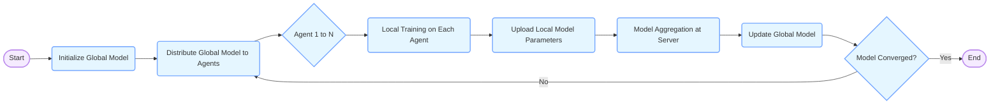

# 联邦学习在分布式AI Agent中的应用

> 关键词：联邦学习、分布式AI Agent、隐私保护、模型训练、协作学习

> 摘要：本文深入探讨了联邦学习在分布式AI Agent中的应用。首先介绍了联邦学习和分布式AI Agent的背景知识，包括目的、预期读者、文档结构和相关术语。接着阐述了核心概念及其联系，通过文本示意图和Mermaid流程图进行清晰展示。详细讲解了核心算法原理，给出Python源代码示例，并介绍了相关数学模型和公式。通过项目实战案例，从开发环境搭建到源代码实现和解读，全面展示了联邦学习在分布式AI Agent中的应用过程。还探讨了实际应用场景，推荐了学习资源、开发工具框架和相关论文著作。最后总结了未来发展趋势与挑战，提供了常见问题解答和扩展阅读参考资料，旨在为读者全面了解和应用该技术提供深入的指导。

## 1. 背景介绍 
### 1.1 目的和范围
随着人工智能技术的飞速发展，数据隐私和安全问题日益受到关注。传统的集中式数据处理和模型训练方式面临着数据泄露、隐私侵犯等风险。联邦学习作为一种新兴的机器学习范式，旨在解决数据隐私保护和模型训练效率之间的矛盾。分布式AI Agent是指分布在不同位置、具有自主决策和学习能力的智能体。本文章的目的是深入探讨联邦学习在分布式AI Agent中的应用，包括其原理、算法、实际应用场景等方面。范围涵盖了从理论基础到实际项目开发的各个环节，旨在为读者提供全面而深入的技术指导。

### 1.2 预期读者
本文预期读者包括人工智能领域的研究人员、开发者、数据科学家、软件架构师等。对于那些对联邦学习和分布式AI Agent感兴趣，希望深入了解其技术原理和应用实践的专业人士，以及正在从事相关项目开发的人员具有较高的参考价值。同时，对于对新兴技术有探索欲望的初学者，也可以通过本文初步了解联邦学习在分布式AI Agent中的应用情况。

### 1.3 文档结构概述
本文将按照以下结构进行阐述：首先介绍相关背景知识，包括目的、读者群体和文档结构等；接着详细讲解联邦学习和分布式AI Agent的核心概念及其联系，通过示意图和流程图进行直观展示；然后深入分析核心算法原理，给出Python代码示例，并介绍相关数学模型和公式；通过项目实战案例，展示如何在实际开发中应用联邦学习于分布式AI Agent；探讨实际应用场景；推荐学习资源、开发工具框架和相关论文著作；最后总结未来发展趋势与挑战，提供常见问题解答和扩展阅读参考资料。

### 1.4 术语表
#### 1.4.1 核心术语定义
- **联邦学习（Federated Learning）**：一种机器学习技术，允许在多个参与方（如设备、组织等）之间进行协作模型训练，而无需将原始数据集中到一个中心节点。每个参与方在本地进行模型训练，并将模型参数或梯度信息上传到中心服务器进行聚合，从而实现模型的全局优化。
- **分布式AI Agent（Distributed AI Agent）**：分布在不同地理位置或计算节点上的智能体，它们具有自主感知、决策和学习能力，能够在本地环境中独立运行，并通过网络与其他智能体进行通信和协作。
- **模型聚合（Model Aggregation）**：在联邦学习中，将各个参与方上传的模型参数或梯度信息进行整合，生成一个全局模型的过程。常见的聚合方法包括加权平均等。
- **本地训练（Local Training）**：参与方在本地设备上使用自己的数据集对模型进行训练的过程，不与其他参与方共享原始数据。

#### 1.4.2 相关概念解释
- **数据隐私保护**：联邦学习的核心目标之一，通过避免原始数据的集中存储和传输，减少数据泄露的风险，保护用户的隐私信息。
- **协作学习**：多个分布式AI Agent通过联邦学习的方式进行协作，共同训练一个更强大的模型，提高模型的性能和泛化能力。
- **异构数据**：不同参与方的数据可能具有不同的特征、分布和规模，联邦学习需要处理这种异构数据，以实现有效的模型训练。

#### 1.4.3 缩略词列表
- **FL**：Federated Learning（联邦学习）
- **AI**：Artificial Intelligence（人工智能）
- **SGD**：Stochastic Gradient Descent（随机梯度下降）

## 2. 核心概念与联系 
### 核心概念原理
#### 联邦学习原理
联邦学习的基本原理是在多个参与方之间进行协作模型训练，同时保护数据隐私。其主要流程如下：
1. 中心服务器初始化一个全局模型，并将其分发给各个参与方。
2. 每个参与方在本地使用自己的数据集对模型进行训练，得到本地模型参数。
3. 参与方将本地模型参数或梯度信息上传到中心服务器。
4. 中心服务器对收到的参数进行聚合，生成一个新的全局模型。
5. 中心服务器将新的全局模型分发给各个参与方，重复步骤2 - 4，直到模型收敛。

#### 分布式AI Agent原理
分布式AI Agent是具有自主决策和学习能力的智能体，分布在不同的计算节点上。每个AI Agent可以在本地环境中感知信息、做出决策，并根据环境反馈进行学习。多个AI Agent之间可以通过网络进行通信和协作，共同完成复杂的任务。

### 架构的文本示意图
```plaintext
+----------------------+       +----------------------+
|    Central Server    |       |    Central Server    |
|                      |       |                      |
| - Global Model       |       | - Aggregated Model   |
| - Model Aggregation  | <---- | - Parameter Updates  |
| - Model Distribution |       |                      |
+----------------------+       +----------------------+
       ^                        ^
       |                        |
       |                        |
+----------------------+       +----------------------+
|   Local AI Agent 1   |       |   Local AI Agent N   |
|                      |       |                      |
| - Local Data         |       | - Local Data         |
| - Local Training     |       | - Local Training     |
| - Parameter Upload   |       | - Parameter Upload   |
+----------------------+       +----------------------+
```

### Mermaid流程图


## 3. 核心算法原理 & 具体操作步骤 
### 核心算法原理
联邦学习中常用的算法是联邦平均算法（Federated Averaging，FedAvg）。其核心思想是通过加权平均的方式将各个参与方的本地模型参数进行聚合，得到全局模型参数。

### Python源代码示例
```python
import numpy as np

# 模拟本地模型参数
num_agents = 3
local_models = [np.random.rand(10) for _ in range(num_agents)]
# 模拟参与方的样本数量，用于加权平均
sample_sizes = [100, 200, 150]
total_samples = sum(sample_sizes)

# 联邦平均算法实现
def federated_averaging(local_models, sample_sizes):
    total_samples = sum(sample_sizes)
    global_model = np.zeros_like(local_models[0])
    for i in range(len(local_models)):
        weight = sample_sizes[i] / total_samples
        global_model += weight * local_models[i]
    return global_model

# 执行联邦平均
global_model = federated_averaging(local_models, sample_sizes)
print("Global Model:", global_model)
```

### 具体操作步骤
1. **初始化全局模型**：中心服务器随机初始化一个全局模型。
2. **分发全局模型**：中心服务器将全局模型分发给各个参与方（分布式AI Agent）。
3. **本地训练**：每个参与方在本地使用自己的数据集对模型进行训练，更新本地模型参数。
4. **上传本地模型参数**：参与方将本地模型参数上传到中心服务器。
5. **模型聚合**：中心服务器根据参与方的样本数量对上传的本地模型参数进行加权平均，得到新的全局模型参数。
6. **更新全局模型**：中心服务器用新的全局模型参数替换旧的全局模型。
7. **重复步骤2 - 6**：直到模型收敛或达到预设的训练轮数。

## 4. 数学模型和公式 & 详细讲解 & 举例说明 
### 数学模型和公式
#### 联邦平均算法公式
设共有 $K$ 个参与方，第 $k$ 个参与方的本地模型参数为 $\theta_k$，样本数量为 $n_k$，则全局模型参数 $\theta_{global}$ 的更新公式为：
$$
\theta_{global} = \sum_{k=1}^{K} \frac{n_k}{N} \theta_k
$$
其中 $N = \sum_{k=1}^{K} n_k$ 是所有参与方的样本总数。

### 详细讲解
上述公式的含义是，全局模型参数是各个参与方本地模型参数的加权平均，权重为每个参与方的样本数量占总样本数量的比例。这样做的目的是让样本数量多的参与方对全局模型的影响更大，从而保证模型的准确性和泛化能力。

### 举例说明
假设有三个参与方，其本地模型参数分别为 $\theta_1 = [0.1, 0.2, 0.3]$，$\theta_2 = [0.4, 0.5, 0.6]$，$\theta_3 = [0.7, 0.8, 0.9]$，样本数量分别为 $n_1 = 100$，$n_2 = 200$，$n_3 = 150$。则总样本数量 $N = 100 + 200 + 150 = 450$。

根据联邦平均算法公式，全局模型参数的第一个元素计算如下：
$$
\begin{align*}
\theta_{global}[0] &= \frac{100}{450} \times 0.1 + \frac{200}{450} \times 0.4 + \frac{150}{450} \times 0.7 \\
&= \frac{10}{450} + \frac{80}{450} + \frac{105}{450} \\
&= \frac{195}{450} \\
&\approx 0.433
\end{align*}
$$
同理可计算出全局模型参数的其他元素。

## 5. 项目实战：代码实际案例和详细解释说明 
### 5.1  开发环境搭建
#### 硬件环境
- 一台或多台服务器或计算机，具有足够的计算资源（CPU、GPU）和内存。
- 网络连接稳定，能够支持多个节点之间的通信。

#### 软件环境
- **操作系统**：Linux（如Ubuntu）或Windows。
- **编程语言**：Python 3.x。
- **深度学习框架**：TensorFlow 或 PyTorch。
- **联邦学习框架**：TensorFlow Federated 或 Flower。

#### 安装步骤
以下以TensorFlow Federated为例，介绍安装步骤：
```bash
# 创建虚拟环境
python -m venv federated_env
source federated_env/bin/activate

# 安装TensorFlow Federated
pip install tensorflow-federated
```

### 5.2  源代码详细实现和代码解读
```python
import tensorflow as tf
import tensorflow_federated as tff

# 加载MNIST数据集
emnist_train, emnist_test = tff.simulation.datasets.emnist.load_data()

# 预处理数据
def preprocess(dataset):
    def batch_format_fn(element):
        return (tf.reshape(element['pixels'], [-1, 784]),
                tf.reshape(element['label'], [-1, 1]))
    return dataset.batch(20).map(batch_format_fn)

# 构建本地数据集
def make_federated_data(client_data, client_ids):
    return [preprocess(client_data.create_tf_dataset_for_client(x))
            for x in client_ids]

# 选择部分客户端
sample_clients = emnist_train.client_ids[:3]
federated_train_data = make_federated_data(emnist_train, sample_clients)

# 定义模型
def create_keras_model():
    return tf.keras.models.Sequential([
        tf.keras.layers.Dense(10, activation='relu', input_shape=(784,)),
        tf.keras.layers.Dense(1)
    ])

# 将Keras模型转换为TFF模型
def model_fn():
    keras_model = create_keras_model()
    return tff.learning.from_keras_model(
        keras_model,
        input_spec=federated_train_data[0].element_spec,
        loss=tf.keras.losses.MeanSquaredError(),
        metrics=[tf.keras.metrics.MeanSquaredError()])

# 构建联邦学习过程
iterative_process = tff.learning.build_federated_averaging_process(model_fn)

# 初始化全局模型
state = iterative_process.initialize()

# 进行联邦学习训练
for round_num in range(10):
    state, metrics = iterative_process.next(state, federated_train_data)
    print(f'Round {round_num}: {metrics}')
```

### 代码解读与分析
1. **数据加载与预处理**：使用`tff.simulation.datasets.emnist.load_data()`加载MNIST数据集，并对数据进行预处理，包括批量处理和格式转换。
2. **构建本地数据集**：选择部分客户端，为每个客户端创建本地数据集。
3. **定义模型**：使用`tf.keras.models.Sequential()`定义一个简单的神经网络模型。
4. **转换为TFF模型**：使用`tff.learning.from_keras_model()`将Keras模型转换为TFF模型，以便在联邦学习环境中使用。
5. **构建联邦学习过程**：使用`tff.learning.build_federated_averaging_process()`构建联邦平均算法的迭代过程。
6. **初始化全局模型**：调用`iterative_process.initialize()`初始化全局模型。
7. **进行联邦学习训练**：在多个训练轮次中，不断调用`iterative_process.next()`进行本地训练和模型聚合，更新全局模型。

## 6. 实际应用场景 
### 医疗领域
在医疗领域，各个医院拥有大量的患者数据，但出于隐私和安全考虑，这些数据不能随意共享。通过联邦学习，各个医院可以在本地使用自己的患者数据训练模型，然后将模型参数上传到中心服务器进行聚合。这样可以在保护患者隐私的前提下，利用多个医院的数据训练出更准确的疾病诊断模型。

### 金融领域
金融机构拥有大量的客户交易数据，这些数据包含了客户的敏感信息。联邦学习可以使不同金融机构在不共享原始数据的情况下，共同训练风险评估模型、欺诈检测模型等。通过协作学习，提高模型的性能和准确性，同时保护客户的隐私。

### 物联网领域
在物联网环境中，大量的设备（如传感器、智能家居设备等）产生了海量的数据。由于数据的分散性和隐私性，将这些数据集中到一个中心节点进行处理是不现实的。联邦学习可以让每个设备在本地进行模型训练，然后将模型参数上传到云端进行聚合。这样可以实现设备之间的协作学习，提高物联网系统的智能化水平。

### 自动驾驶领域
自动驾驶汽车需要处理大量的传感器数据，这些数据包含了车辆周围的环境信息。为了提高自动驾驶模型的性能，不同的汽车制造商可以通过联邦学习的方式进行协作。每辆汽车在本地使用自己的传感器数据训练模型，然后将模型参数上传到云端进行聚合。这样可以在保护数据隐私的前提下，利用更多的数据来训练更强大的自动驾驶模型。

## 7. 工具和资源推荐
### 7.1 学习资源推荐
#### 7.1.1 书籍推荐
- 《Federated Learning: Foundations and Trends® in Machine Learning》：这本书全面介绍了联邦学习的理论基础、算法和应用场景，是学习联邦学习的经典教材。
- 《Artificial Intelligence: A Modern Approach》：虽然不是专门针对联邦学习的书籍，但它涵盖了人工智能的各个方面，包括机器学习、深度学习等，对于理解联邦学习的背景知识非常有帮助。

#### 7.1.2 在线课程
- Coursera上的“Federated Learning for Data Privacy and Confidentiality”：由知名专家授课，系统地介绍了联邦学习的原理、算法和实际应用。
- edX上的“Deep Learning Specialization”：虽然主要是关于深度学习的课程，但其中的一些内容也与联邦学习相关，如模型训练和优化等。

#### 7.1.3 技术博客和网站
- TensorFlow官方博客：提供了关于TensorFlow Federated的最新技术文章和案例分享。
- Medium上的“Towards Data Science”：有很多关于联邦学习和人工智能的技术文章，涵盖了从基础概念到实际应用的各个方面。

### 7.2 开发工具框架推荐
#### 7.2.1 IDE和编辑器
- PyCharm：一款功能强大的Python集成开发环境，支持代码编辑、调试、版本控制等功能，非常适合开发联邦学习项目。
- Jupyter Notebook：一种交互式的开发环境，适合进行数据探索、模型实验和代码演示，在联邦学习的研究和开发中经常使用。

#### 7.2.2 调试和性能分析工具
- TensorBoard：TensorFlow的可视化工具，可以帮助开发者监控模型训练过程、查看模型性能指标等。
- Py-Spy：一个Python性能分析工具，可以帮助开发者找出代码中的性能瓶颈，优化代码性能。

#### 7.2.3 相关框架和库
- TensorFlow Federated：TensorFlow官方提供的联邦学习框架，支持多种联邦学习算法，易于集成到TensorFlow项目中。
- Flower：一个开源的联邦学习框架，具有高度的可扩展性和灵活性，支持多种深度学习框架。

### 7.3 相关论文著作推荐
#### 7.3.1 经典论文
- 《Communication-Efficient Learning of Deep Networks from Decentralized Data》：这篇论文首次提出了联邦平均算法（FedAvg），是联邦学习领域的经典之作。
- 《Federated Learning: Strategies for Improving Communication Efficiency》：该论文探讨了如何提高联邦学习中的通信效率，提出了一些有效的方法和策略。

#### 7.3.2 最新研究成果
- 《Advances and Open Problems in Federated Learning》：对联邦学习领域的最新研究进展进行了全面总结，提出了一些开放问题和未来研究方向。
- 《Federated Learning with Non-IID Data》：研究了在非独立同分布（Non-IID）数据情况下的联邦学习问题，提出了一些解决方案。

#### 7.3.3 应用案例分析
- 《Federated Learning in Healthcare: Opportunities and Challenges》：分析了联邦学习在医疗领域的应用机会和挑战，通过实际案例展示了联邦学习在医疗数据隐私保护和模型训练方面的优势。
- 《Federated Learning for Smart Cities: A Survey》：对联邦学习在智慧城市建设中的应用进行了综述，介绍了一些成功的应用案例和实践经验。

## 8. 总结：未来发展趋势与挑战
### 未来发展趋势
#### 跨领域融合
联邦学习将与其他技术（如区块链、边缘计算、物联网等）进行更深入的融合，创造出更多的应用场景和商业价值。例如，结合区块链技术可以进一步增强联邦学习中的数据安全和可信性；与边缘计算结合可以实现更高效的本地模型训练和推理。

#### 模型优化与个性化
未来的研究将更加关注联邦学习中的模型优化和个性化问题。例如，如何在保证数据隐私的前提下，提高模型的训练效率和准确性；如何根据不同参与方的需求和特点，实现个性化的模型训练和推理。

#### 标准与规范制定
随着联邦学习的广泛应用，制定相关的标准和规范将变得越来越重要。这包括数据隐私保护标准、模型评估标准、通信协议标准等，以确保联邦学习系统的安全性、可靠性和互操作性。

### 挑战
#### 数据异构性
不同参与方的数据可能具有不同的特征、分布和规模，这给联邦学习带来了数据异构性的挑战。如何处理异构数据，提高模型的性能和泛化能力，是未来需要解决的重要问题。

#### 通信开销
在联邦学习中，参与方需要频繁地与中心服务器进行通信，上传和下载模型参数，这会产生较大的通信开销。如何降低通信开销，提高通信效率，是联邦学习面临的另一个挑战。

#### 安全与隐私保护
虽然联邦学习的初衷是保护数据隐私，但在实际应用中，仍然存在一些安全和隐私风险。例如，模型参数的上传和下载过程中可能会被攻击，导致数据泄露；恶意参与方可能会故意上传错误的模型参数，影响全局模型的性能。如何加强安全和隐私保护，是联邦学习需要解决的核心问题。

## 9. 附录：常见问题与解答
### 1. 联邦学习和传统机器学习有什么区别？
传统机器学习通常需要将所有数据集中到一个中心节点进行模型训练，而联邦学习允许在多个参与方之间进行协作模型训练，无需将原始数据集中到一个中心节点，从而保护了数据隐私。

### 2. 联邦学习中如何处理数据异构性问题？
可以采用一些方法来处理数据异构性问题，如使用个性化的模型架构、调整学习率、进行数据预处理等。此外，还可以通过设计更复杂的聚合算法，考虑不同参与方的数据分布和特征，来提高模型的性能和泛化能力。

### 3. 联邦学习的通信开销主要来自哪些方面？
联邦学习的通信开销主要来自于参与方与中心服务器之间的模型参数上传和下载。在每次训练轮次中，参与方需要将本地模型参数上传到中心服务器，中心服务器将聚合后的全局模型参数分发给各个参与方，这会产生大量的通信数据。

### 4. 如何保证联邦学习中的数据安全和隐私？
可以采用多种技术手段来保证联邦学习中的数据安全和隐私，如差分隐私、同态加密、安全多方计算等。这些技术可以在不泄露原始数据的情况下，实现模型的训练和推理。

## 10. 扩展阅读 & 参考资料
### 扩展阅读
- 《Federated Learning for Edge Computing: A Comprehensive Survey》
- 《Secure Federated Learning with Differential Privacy》

### 参考资料
- [TensorFlow Federated官方文档](https://www.tensorflow.org/federated)
- [Flower官方文档](https://flower.dev/)
- 《Federated Learning: Foundations and Trends® in Machine Learning》

作者：AI天才研究院/AI Genius Institute & 禅与计算机程序设计艺术 /Zen And The Art of Computer Programming