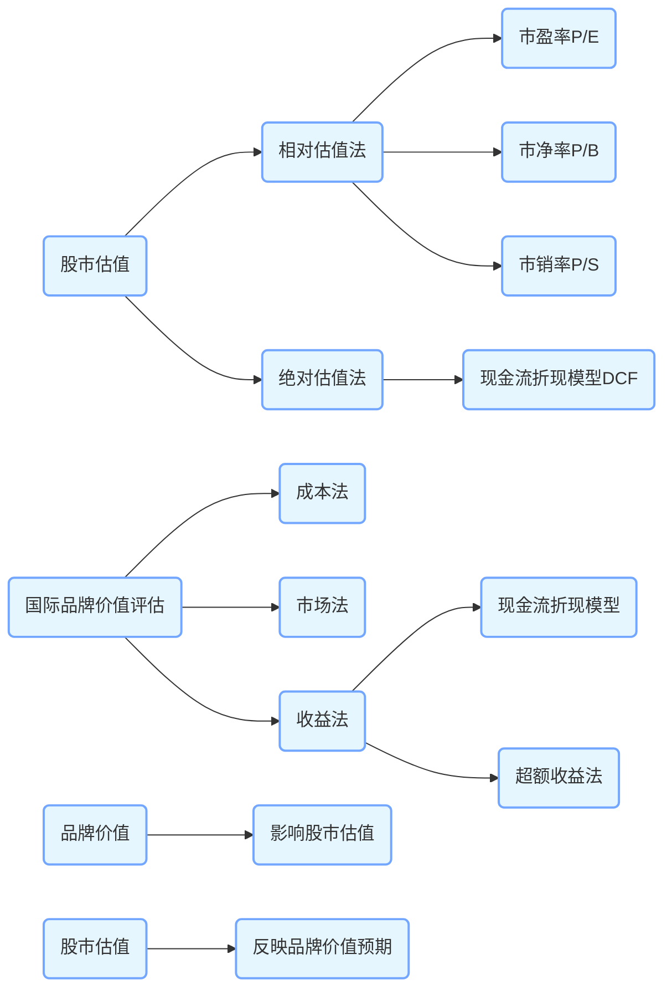

# 股市估值在国际品牌价值评估中的应用

> 关键词：股市估值、国际品牌价值评估、金融模型、市场数据、品牌影响力

> 摘要：本文聚焦于股市估值在国际品牌价值评估中的应用。首先介绍了相关背景，包括研究目的、预期读者、文档结构和术语表。接着阐述了核心概念，分析了股市估值与品牌价值评估的联系，并给出了相应的原理和架构示意图及流程图。详细讲解了核心算法原理和具体操作步骤，结合 Python 代码进行说明。深入探讨了数学模型和公式，并举例说明其在实际中的应用。通过项目实战，展示了如何搭建开发环境、实现源代码及对代码进行解读分析。探讨了股市估值在国际品牌价值评估中的实际应用场景，推荐了学习资源、开发工具框架和相关论文著作。最后总结了未来发展趋势与挑战，解答了常见问题，并提供了扩展阅读和参考资料，旨在为相关领域的研究者和从业者提供全面深入的指导。

## 1. 背景介绍 
### 1.1 目的和范围
在当今全球化的商业环境中，品牌已经成为企业最重要的资产之一。国际品牌的价值不仅影响着企业的市场竞争力，还对投资者的决策产生重要影响。股市估值作为一种基于市场数据的评估方法，能够反映市场对企业未来盈利能力的预期。本研究的目的在于探讨如何将股市估值方法应用于国际品牌价值评估中，以提供一种更科学、客观的品牌价值评估方式。

研究范围涵盖了不同行业的国际知名品牌，分析股市估值指标与品牌价值之间的关系，并通过实际案例验证应用的可行性和有效性。

### 1.2 预期读者
本文的预期读者包括金融分析师、品牌管理专家、市场营销人员、投资者以及对品牌价值评估和股市估值感兴趣的研究人员。对于金融分析师和投资者来说，了解股市估值在品牌价值评估中的应用有助于更准确地评估企业的投资价值；品牌管理专家和市场营销人员可以借助这种方法更好地衡量品牌建设的成效；研究人员则可以在此基础上开展进一步的学术研究。

### 1.3 文档结构概述
本文将按照以下结构进行阐述：首先介绍核心概念，包括股市估值和国际品牌价值评估的定义、原理以及它们之间的联系；然后详细讲解核心算法原理和具体操作步骤，通过 Python 代码实现；接着介绍相关的数学模型和公式，并举例说明；通过项目实战展示如何应用这些方法进行品牌价值评估；探讨实际应用场景；推荐相关的学习资源、开发工具框架和论文著作；最后总结未来发展趋势与挑战，解答常见问题，并提供扩展阅读和参考资料。

### 1.4 术语表
#### 1.4.1 核心术语定义
- **股市估值**：是指对上市公司股票的价值进行评估的过程，通常基于公司的财务数据、市场表现等因素，采用不同的估值方法来确定股票的合理价格。
- **国际品牌价值评估**：是对在国际市场上具有一定影响力的品牌的经济价值进行评估的过程，考虑品牌的知名度、美誉度、市场份额、盈利能力等因素。
- **品牌溢价**：指消费者愿意为某一品牌产品支付的价格高于同类无品牌产品的价格部分，是品牌价值的重要体现。

#### 1.4.2 相关概念解释
- **市盈率（P/E）**：是指股票价格除以每股收益的比率，反映了市场对公司盈利的预期和估值水平。
- **市净率（P/B）**：是指股票价格除以每股净资产的比率，衡量了市场对公司净资产的估值。
- **现金流折现模型（DCF）**：是一种通过预测公司未来的现金流，并将其折现到当前的估值方法，用于评估公司的内在价值。

#### 1.4.3 缩略词列表
- **P/E**：Price-to-Earnings Ratio（市盈率）
- **P/B**：Price-to-Book Ratio（市净率）
- **DCF**：Discounted Cash Flow（现金流折现模型）

## 2. 核心概念与联系 

### 2.1 股市估值的原理和方法
股市估值的核心目标是确定股票的内在价值，以便投资者判断股票是否被高估或低估。常见的股市估值方法包括相对估值法和绝对估值法。

相对估值法是通过比较同行业其他公司的估值指标来评估目标公司的价值。常用的相对估值指标有市盈率（P/E）、市净率（P/B）、市销率（P/S）等。例如，市盈率法是将目标公司的每股收益乘以同行业的平均市盈率，得到目标公司的股票估值。

绝对估值法是基于公司的基本面数据，通过预测公司未来的现金流或盈利，并将其折现到当前来计算公司的内在价值。现金流折现模型（DCF）是最常用的绝对估值方法之一，其基本原理是将公司未来各期的自由现金流按照一定的折现率折现到当前，得到公司的现值。

### 2.2 国际品牌价值评估的原理和方法
国际品牌价值评估的目的是衡量品牌对企业的经济贡献。常见的品牌价值评估方法包括成本法、市场法和收益法。

成本法是通过计算创建和维护品牌所花费的成本来评估品牌价值，包括品牌的研发成本、营销成本等。市场法是通过比较类似品牌在市场上的交易价格来评估目标品牌的价值。收益法是基于品牌未来的收益能力来评估品牌价值，通常采用现金流折现模型或超额收益法。

### 2.3 股市估值与国际品牌价值评估的联系
股市估值和国际品牌价值评估之间存在着密切的联系。一方面，品牌价值是企业价值的重要组成部分，一个具有高价值的品牌可以提高企业的市场竞争力和盈利能力，从而影响股市对企业的估值。另一方面，股市估值指标可以反映市场对品牌价值的预期，例如市盈率和市净率较高的公司，往往意味着市场对其品牌价值和未来发展前景有较高的认可。

通过分析股市估值指标与品牌价值之间的关系，可以将股市估值方法应用于国际品牌价值评估中，为品牌价值评估提供一种新的视角和方法。

### 2.4 核心概念原理和架构的文本示意图
```plaintext
股市估值
|-- 相对估值法
|   |-- 市盈率（P/E）
|   |-- 市净率（P/B）
|   |-- 市销率（P/S）
|-- 绝对估值法
|   |-- 现金流折现模型（DCF）

国际品牌价值评估
|-- 成本法
|-- 市场法
|-- 收益法
|   |-- 现金流折现模型
|   |-- 超额收益法

联系
|-- 品牌价值影响股市估值
|-- 股市估值反映品牌价值预期
```

### 2.5 Mermaid 流程图


## 3. 核心算法原理 & 具体操作步骤 

### 3.1 市盈率法在品牌价值评估中的应用
#### 3.1.1 算法原理
市盈率法是一种相对估值方法，其基本原理是通过比较目标公司与同行业其他公司的市盈率，来评估目标公司的股票价值。在品牌价值评估中，可以利用市盈率与品牌盈利能力之间的关系，来估算品牌的价值。

假设目标公司的每股收益为 $EPS$，同行业的平均市盈率为 $P/E_{avg}$，则目标公司的股票估值为 $V = EPS \times P/E_{avg}$。品牌价值可以通过计算目标公司的市场价值与无品牌状态下的公司价值之差来估算。

#### 3.1.2 具体操作步骤
1. 收集同行业其他公司的市盈率数据，计算平均市盈率 $P/E_{avg}$。
2. 获取目标公司的每股收益 $EPS$。
3. 计算目标公司的股票估值 $V = EPS \times P/E_{avg}$。
4. 估算无品牌状态下目标公司的价值 $V_{non - brand}$，可以通过分析同行业无品牌企业的盈利水平和估值情况来确定。
5. 计算品牌价值 $BV = V - V_{non - brand}$。

#### 3.1.3 Python 代码实现
```python
# 假设同行业平均市盈率为 20
pe_avg = 20
# 目标公司每股收益为 2
eps = 2
# 计算目标公司股票估值
stock_value = eps * pe_avg
# 假设无品牌状态下公司价值为 30
non_brand_value = 30
# 计算品牌价值
brand_value = stock_value - non_brand_value

print(f"目标公司股票估值: {stock_value}")
print(f"品牌价值: {brand_value}")
```

### 3.2 现金流折现模型在品牌价值评估中的应用
#### 3.2.1 算法原理
现金流折现模型（DCF）是一种绝对估值方法，其基本原理是将公司未来各期的自由现金流按照一定的折现率折现到当前，得到公司的现值。在品牌价值评估中，可以将品牌带来的额外现金流单独进行预测和折现，从而估算品牌的价值。

假设品牌在未来 $n$ 期内产生的额外自由现金流为 $FCF_1, FCF_2, \cdots, FCF_n$，折现率为 $r$，则品牌的价值 $BV$ 可以通过以下公式计算：

$$BV = \sum_{i = 1}^{n} \frac{FCF_i}{(1 + r)^i}$$

#### 3.2.2 具体操作步骤
1. 预测品牌在未来 $n$ 期内产生的额外自由现金流 $FCF_1, FCF_2, \cdots, FCF_n$。这需要分析品牌的市场份额、品牌溢价、成本节约等因素对现金流的影响。
2. 确定折现率 $r$。折现率通常反映了投资者对品牌投资的风险要求，可以参考市场利率、行业平均收益率等因素来确定。
3. 根据上述公式计算品牌的价值 $BV$。

#### 3.2.3 Python 代码实现
```python
import numpy as np

# 预测未来 5 期的额外自由现金流
fcf = np.array([10, 12, 15, 18, 20])
# 折现率为 10%
r = 0.1
# 期数
n = len(fcf)
# 计算品牌价值
brand_value = np.sum([fcf[i] / (1 + r)**(i + 1) for i in range(n)])

print(f"品牌价值: {brand_value}")
```

## 4. 数学模型和公式 & 详细讲解 & 举例说明 

### 4.1 市盈率法的数学模型和公式
#### 4.1.1 数学模型
市盈率法的数学模型可以表示为：

$$V = EPS \times P/E$$

其中，$V$ 表示目标公司的股票估值，$EPS$ 表示目标公司的每股收益，$P/E$ 表示市盈率。

#### 4.1.2 详细讲解
市盈率反映了市场对公司盈利的预期和估值水平。较高的市盈率意味着市场对公司未来的盈利增长有较高的预期，或者认为公司具有较强的竞争优势和品牌价值。在品牌价值评估中，通过比较目标公司与同行业其他公司的市盈率，可以判断目标公司的品牌价值是否被市场高估或低估。

#### 4.1.3 举例说明
假设同行业平均市盈率为 15，目标公司每股收益为 3 元，则目标公司的股票估值为：

$$V = 3 \times 15 = 45 \text{（元）}$$

如果无品牌状态下目标公司的价值估算为 30 元，则品牌价值为：

$$BV = 45 - 30 = 15 \text{（元）}$$

### 4.2 现金流折现模型的数学模型和公式
#### 4.2.1 数学模型
现金流折现模型的数学模型可以表示为：

$$V = \sum_{i = 1}^{n} \frac{FCF_i}{(1 + r)^i}$$

其中，$V$ 表示公司或品牌的现值，$FCF_i$ 表示第 $i$ 期的自由现金流，$r$ 表示折现率，$n$ 表示期数。

#### 4.2.2 详细讲解
现金流折现模型的核心思想是将未来的现金流按照一定的折现率折现到当前，考虑了货币的时间价值和投资的风险。折现率 $r$ 反映了投资者对投资的风险要求，折现率越高，未来现金流的现值越低。在品牌价值评估中，需要准确预测品牌带来的额外现金流，并合理确定折现率，以得到较为准确的品牌价值估算。

#### 4.2.3 举例说明
假设某品牌在未来 3 年内产生的额外自由现金流分别为 20 万元、25 万元和 30 万元，折现率为 8%，则品牌的价值为：

$$
\begin{align*}
BV &= \frac{20}{(1 + 0.08)^1} + \frac{25}{(1 + 0.08)^2} + \frac{30}{(1 + 0.08)^3}\\
&= \frac{20}{1.08} + \frac{25}{1.1664} + \frac{30}{1.259712}\\
&\approx 18.52 + 21.43 + 23.82\\
&= 63.77 \text{（万元）}
\end{align*}
$$

### 4.3 品牌溢价模型
#### 4.3.1 数学模型
品牌溢价模型可以表示为：

$$BP = P - P_{non - brand}$$

其中，$BP$ 表示品牌溢价，$P$ 表示品牌产品的价格，$P_{non - brand}$ 表示无品牌同类产品的价格。

品牌价值可以通过品牌溢价与销售量的乘积来估算：

$$BV = BP \times Q$$

其中，$Q$ 表示品牌产品的销售量。

#### 4.3.2 详细讲解
品牌溢价是品牌价值的重要体现，它反映了消费者对品牌的认可和信任。通过计算品牌溢价，可以直观地了解品牌在市场上的竞争力。在估算品牌价值时，需要准确确定品牌溢价和销售量，以得到合理的结果。

#### 4.3.3 举例说明
假设某品牌手机的价格为 5000 元，无品牌同类手机的价格为 3000 元，该品牌手机的年销售量为 100 万部，则品牌溢价为：

$$BP = 5000 - 3000 = 2000 \text{（元）}$$

品牌价值为：

$$BV = 2000 \times 1000000 = 2000000000 \text{（元）}= 20 \text{（亿元）}$$

## 5. 项目实战：代码实际案例和详细解释说明 

### 5.1  开发环境搭建
#### 5.1.1 安装 Python
首先需要安装 Python 编程语言，建议使用 Python 3.7 及以上版本。可以从 Python 官方网站（https://www.python.org/downloads/）下载并安装适合自己操作系统的版本。

#### 5.1.2 安装必要的库
在进行股市估值和品牌价值评估的项目实战中，需要使用一些 Python 库，如 `pandas` 用于数据处理，`numpy` 用于数值计算，`matplotlib` 用于数据可视化。可以使用以下命令安装这些库：

```sh
pip install pandas numpy matplotlib
```

### 5.2  源代码详细实现和代码解读
#### 5.2.1 数据获取和处理
```python
import pandas as pd

# 假设从 CSV 文件中读取同行业公司的市盈率数据
pe_data = pd.read_csv('pe_data.csv')
# 计算同行业平均市盈率
pe_avg = pe_data['P/E'].mean()

# 假设从 CSV 文件中读取目标公司的财务数据
target_data = pd.read_csv('target_data.csv')
# 获取目标公司的每股收益
eps = target_data['EPS'].values[0]

print(f"同行业平均市盈率: {pe_avg}")
print(f"目标公司每股收益: {eps}")
```
代码解读：
- 使用 `pandas` 库的 `read_csv` 函数从 CSV 文件中读取同行业公司的市盈率数据和目标公司的财务数据。
- 计算同行业平均市盈率和目标公司的每股收益，并打印输出。

#### 5.2.2 市盈率法计算品牌价值
```python
# 计算目标公司股票估值
stock_value = eps * pe_avg
# 假设无品牌状态下公司价值为 50
non_brand_value = 50
# 计算品牌价值
brand_value = stock_value - non_brand_value

print(f"目标公司股票估值: {stock_value}")
print(f"品牌价值: {brand_value}")
```
代码解读：
- 根据市盈率法的公式计算目标公司的股票估值。
- 假设无品牌状态下公司的价值，计算品牌价值并打印输出。

#### 5.2.3 现金流折现模型计算品牌价值
```python
import numpy as np

# 假设预测未来 4 期的额外自由现金流
fcf = np.array([15, 18, 22, 25])
# 折现率为 9%
r = 0.09
# 期数
n = len(fcf)
# 计算品牌价值
brand_value_dcf = np.sum([fcf[i] / (1 + r)**(i + 1) for i in range(n)])

print(f"现金流折现模型计算的品牌价值: {brand_value_dcf}")
```
代码解读：
- 定义未来 4 期的额外自由现金流和折现率。
- 使用现金流折现模型的公式计算品牌价值并打印输出。

### 5.3  代码解读与分析
#### 5.3.1 数据获取和处理部分
通过 `pandas` 库读取 CSV 文件中的数据，方便进行数据处理和分析。计算同行业平均市盈率和目标公司的每股收益是市盈率法计算品牌价值的基础步骤。

#### 5.3.2 市盈率法计算品牌价值部分
根据市盈率法的公式，将目标公司的每股收益乘以同行业平均市盈率得到股票估值，再减去无品牌状态下公司的价值，得到品牌价值。这种方法简单直观，但需要准确估算无品牌状态下公司的价值。

#### 5.3.3 现金流折现模型计算品牌价值部分
使用 `numpy` 库进行数值计算，通过循环和公式计算未来各期额外自由现金流的现值，并求和得到品牌价值。现金流折现模型考虑了货币的时间价值和投资的风险，但需要准确预测未来的现金流和合理确定折现率。

## 6. 实际应用场景 
### 6.1 企业并购与重组
在企业并购与重组过程中，准确评估目标企业的品牌价值至关重要。股市估值方法可以为品牌价值评估提供客观的参考依据，帮助收购方确定合理的收购价格。通过分析目标企业的股市估值指标和品牌影响力，可以更好地评估品牌对企业未来盈利能力的贡献，从而做出更明智的决策。

### 6.2 品牌投资决策
投资者在进行品牌投资时，需要了解品牌的价值和潜力。股市估值方法可以帮助投资者评估品牌的市场价值和投资回报率。例如，通过比较不同品牌的市盈率和市净率，投资者可以选择具有较高投资价值的品牌进行投资。

### 6.3 品牌战略规划
企业在制定品牌战略时，需要了解自身品牌的价值和市场地位。股市估值方法可以为品牌战略规划提供数据支持，帮助企业确定品牌建设的重点和方向。例如，如果品牌的股市估值较低，企业可以分析原因，采取相应的措施提升品牌价值，如加强品牌营销、提高产品质量等。

### 6.4 品牌许可与合作
在品牌许可与合作中，双方需要确定品牌使用的费用和合作的利益分配。股市估值方法可以为品牌许可费用的确定提供参考，通过评估品牌的价值和市场影响力，双方可以协商出合理的许可费用和合作方案。

## 7. 工具和资源推荐
### 7.1 学习资源推荐
#### 7.1.1 书籍推荐
- 《估值：难点、解决方案及相关案例》：这本书详细介绍了各种估值方法和技巧，包括股市估值和品牌价值评估，通过大量的案例分析帮助读者理解和应用这些方法。
- 《品牌资产管理》：深入探讨了品牌价值评估的理论和实践，介绍了多种品牌价值评估模型和方法，对品牌管理和评估具有重要的指导意义。
- 《财务报表分析与证券定价》：讲解了如何通过分析财务报表来进行股票估值，为股市估值提供了理论基础和实践方法。

#### 7.1.2 在线课程
- Coursera 上的“Financial Markets”：由耶鲁大学教授 Robert Shiller 授课，介绍了金融市场的基本原理和估值方法，对股市估值和品牌价值评估有一定的帮助。
- edX 上的“Brand Management: Building Strong Brands”：该课程从品牌战略、品牌定位、品牌传播等方面介绍了品牌管理的知识和方法，包括品牌价值评估的相关内容。

#### 7.1.3 技术博客和网站
- Seeking Alpha：提供了大量的股票分析和估值报告，投资者可以从中获取有关股市估值和品牌价值评估的信息和观点。
- Brand Finance：是一家专业的品牌价值评估机构，其官方网站发布了全球品牌价值排行榜和相关的研究报告，对了解品牌价值评估的最新动态和方法有很大的帮助。

### 7.2 开发工具框架推荐
#### 7.2.1 IDE和编辑器
- PyCharm：是一款专业的 Python 集成开发环境，具有代码编辑、调试、自动补全、版本控制等功能，适合进行 Python 代码的开发和项目管理。
- Jupyter Notebook：是一个交互式的开发环境，支持 Python、R 等多种编程语言，方便进行数据处理、分析和可视化，适合进行股市估值和品牌价值评估的实验和研究。

#### 7.2.2 调试和性能分析工具
- `pdb`：是 Python 自带的调试工具，可以帮助开发者定位代码中的错误和问题。
- `cProfile`：是 Python 的性能分析工具，可以分析代码的运行时间和性能瓶颈，帮助开发者优化代码。

#### 7.2.3 相关框架和库
- `pandas`：是一个强大的数据处理和分析库，提供了丰富的数据结构和函数，方便进行数据清洗、整理和分析。
- `numpy`：是 Python 的数值计算库，提供了高效的数组和矩阵运算功能，在股市估值和品牌价值评估的数值计算中非常有用。
- `scikit-learn`：是一个机器学习库，提供了多种机器学习算法和工具，可用于股市估值和品牌价值评估的模型构建和预测。

### 7.3 相关论文著作推荐
#### 7.3.1 经典论文
- “The Theory of Rational Option Pricing” by Fischer Black and Myron Scholes：这篇论文提出了著名的布莱克 - 斯科尔斯期权定价模型，对金融估值理论的发展产生了深远的影响。
- “Valuing Brands” by David Aaker：介绍了品牌价值评估的理论和方法，强调了品牌资产的重要性和评估的复杂性。

#### 7.3.2 最新研究成果
- 近年来，关于股市估值和品牌价值评估的研究不断涌现，许多学者和研究机构通过实证研究和案例分析，提出了新的估值方法和模型。可以关注《Journal of Financial Economics》、《Journal of Marketing》等学术期刊上的相关研究论文。

#### 7.3.3 应用案例分析
- 《Brand Valuation Case Studies》：收集了多个品牌价值评估的实际案例，详细分析了不同行业、不同品牌的估值方法和过程，对实际应用具有重要的参考价值。

## 8. 总结：未来发展趋势与挑战
### 8.1 未来发展趋势
#### 8.1.1 多维度数据融合
未来，股市估值和品牌价值评估将不仅仅依赖于财务数据和市场数据，还将融合更多的非财务数据，如社交媒体数据、消费者行为数据等。通过多维度数据的融合，可以更全面、准确地评估品牌的价值和市场影响力。

#### 8.1.2 人工智能和机器学习的应用
人工智能和机器学习技术将在股市估值和品牌价值评估中得到更广泛的应用。例如，利用深度学习算法对大量的历史数据进行分析和建模，提高估值的准确性和预测能力；使用自然语言处理技术分析新闻报道和社交媒体评论，了解市场对品牌的情绪和预期。

#### 8.1.3 国际化和全球化趋势
随着全球经济一体化的发展，国际品牌的竞争日益激烈。股市估值和品牌价值评估将更加注重国际化和全球化的视角，考虑不同国家和地区的市场环境、文化差异和政策法规等因素，为国际品牌的价值评估提供更科学、合理的方法。

### 8.2 挑战
#### 8.2.1 数据质量和可靠性
股市估值和品牌价值评估依赖于大量的数据，数据的质量和可靠性直接影响评估结果的准确性。然而，现实中数据可能存在缺失、错误、不完整等问题，如何获取高质量的数据并进行有效的清洗和处理是一个挑战。

#### 8.2.2 模型的复杂性和不确定性
股市估值和品牌价值评估涉及到多种模型和方法，不同的模型和方法可能会得出不同的结果。而且，市场环境和品牌情况是不断变化的，模型的参数和假设也需要不断调整和更新，如何选择合适的模型和方法，并处理模型的复杂性和不确定性是一个难题。

#### 8.2.3 品牌价值的动态变化
品牌价值是一个动态的概念，会随着市场竞争、消费者需求、技术创新等因素的变化而变化。如何及时、准确地评估品牌价值的动态变化，并为企业的决策提供有效的支持是一个挑战。

## 9. 附录：常见问题与解答
### 9.1 股市估值方法在品牌价值评估中的准确性如何？
股市估值方法在品牌价值评估中具有一定的参考价值，但准确性受到多种因素的影响。例如，市场的有效性、数据的质量、估值模型的选择等。在实际应用中，需要结合多种方法和数据进行综合评估，以提高评估结果的准确性。

### 9.2 如何确定无品牌状态下公司的价值？
确定无品牌状态下公司的价值可以通过以下几种方法：分析同行业无品牌企业的盈利水平和估值情况；采用成本法估算公司的资产价值；通过模拟无品牌状态下公司的经营情况，预测其未来的现金流并进行折现。

### 9.3 现金流折现模型中折现率如何确定？
折现率的确定需要考虑多种因素，包括市场利率、行业平均收益率、品牌投资的风险等。一般来说，可以参考市场上类似投资的收益率，结合品牌的风险特征进行调整。也可以采用资本资产定价模型（CAPM）等方法来计算折现率。

### 9.4 品牌价值评估结果可以直接用于企业决策吗？
品牌价值评估结果可以为企业决策提供重要的参考依据，但不能直接用于决策。企业决策还需要考虑其他因素，如市场战略、竞争环境、财务状况等。品牌价值评估结果应该与企业的战略目标和实际情况相结合，进行综合分析和判断。

## 10. 扩展阅读 & 参考资料
### 10.1 扩展阅读
- 《竞争优势》：迈克尔·波特的经典著作，介绍了企业竞争优势的来源和构建方法，对理解品牌价值的形成和提升具有重要的启示。
- 《创新者的窘境》：探讨了企业在面对技术创新和市场变革时的挑战和机遇，对于品牌在市场中的发展和竞争具有一定的借鉴意义。

### 10.2 参考资料
- 《金融市场学》：作为金融领域的基础教材，为股市估值提供了理论基础和方法指导。
- 《品牌学概论》：系统介绍了品牌的基本概念、理论和方法，是学习品牌价值评估的重要参考书籍。

作者：AI天才研究院/AI Genius Institute & 禅与计算机程序设计艺术 /Zen And The Art of Computer Programming