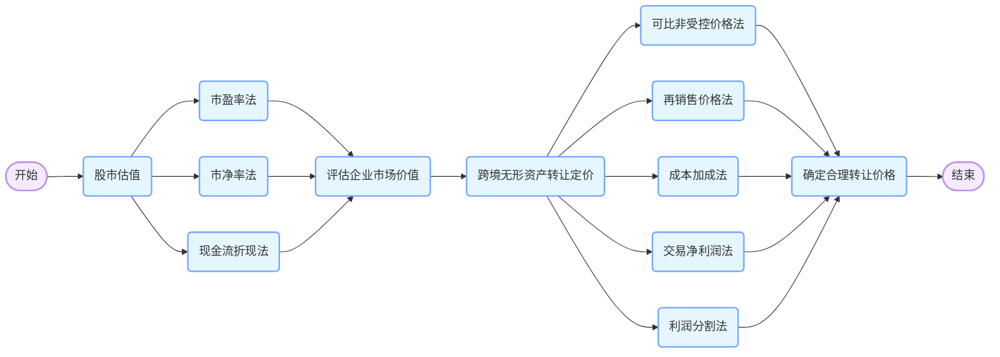

# 股市估值在跨境无形资产转让定价中的应用

> 关键词：股市估值、跨境无形资产、转让定价、应用、经济分析

> 摘要：本文聚焦于股市估值在跨境无形资产转让定价中的应用。首先介绍了研究的背景、目的、范围、预期读者和文档结构等内容。接着阐述了股市估值和跨境无形资产转让定价的核心概念及相互联系，并给出了相应的原理和架构示意图以及流程图。详细讲解了相关的核心算法原理和具体操作步骤，同时运用数学模型和公式进行深入分析并举例说明。通过项目实战，展示了如何在实际中运用这些理论和方法，包括开发环境搭建、源代码实现及解读。探讨了股市估值在跨境无形资产转让定价中的实际应用场景，推荐了学习、开发相关的工具和资源，以及相关的论文著作。最后总结了未来发展趋势与挑战，还设置了附录解答常见问题，并提供了扩展阅读和参考资料，旨在为相关领域的研究和实践提供全面且深入的指导。

## 1. 背景介绍 
### 1.1 目的和范围
在全球化经济的大背景下，跨境无形资产转让日益频繁。无形资产如专利、商标、版权等在企业的价值创造中扮演着越来越重要的角色。然而，跨境无形资产转让定价一直是一个复杂且具有挑战性的问题，合理的定价不仅关系到企业的经济效益，还涉及到国家税收等多方面的利益。

股市估值作为一种衡量企业市场价值的方法，能够反映市场对企业未来盈利能力和风险的预期。本研究的目的在于探讨如何将股市估值方法应用于跨境无形资产转让定价中，以提供一种更加科学、合理、客观的定价思路和方法。

本研究的范围主要涵盖了常见的股市估值方法，如市盈率法、市净率法、现金流折现法等，以及跨境无形资产转让定价的主要类型，包括专利转让、商标许可、技术合作等。同时，会结合实际案例，分析股市估值在不同场景下的应用效果和局限性。

### 1.2 预期读者
本文的预期读者包括从事国际税收、转让定价、财务管理、资产评估等领域的专业人士，如税务顾问、会计师、评估师、企业财务管理人员等。此外，对于对跨境投资、无形资产交易感兴趣的研究人员和学者，以及相关政府监管部门的工作人员也具有一定的参考价值。

### 1.3 文档结构概述
本文共分为十个部分。第一部分为背景介绍，阐述了研究的目的、范围、预期读者和文档结构。第二部分介绍核心概念与联系，包括股市估值和跨境无形资产转让定价的原理、架构，并给出示意图和流程图。第三部分详细讲解核心算法原理和具体操作步骤，通过Python代码进行说明。第四部分运用数学模型和公式对相关内容进行深入分析，并举例说明。第五部分是项目实战，包括开发环境搭建、源代码实现和代码解读。第六部分探讨实际应用场景。第七部分推荐学习、开发相关的工具和资源以及论文著作。第八部分总结未来发展趋势与挑战。第九部分为附录，解答常见问题。第十部分提供扩展阅读和参考资料。

### 1.4 术语表
#### 1.4.1 核心术语定义
- **股市估值**：是指通过一定的方法和模型，对上市公司的股票价值进行评估和预测的过程。常见的股市估值方法包括市盈率法、市净率法、现金流折现法等。
- **跨境无形资产转让定价**：是指跨国企业在进行无形资产（如专利、商标、版权等）的跨境转让或许可使用时，确定交易价格的过程。合理的转让定价对于企业的税务筹划、利润分配等具有重要意义。
- **无形资产**：是指企业拥有或者控制的没有实物形态的可辨认非货币性资产，包括专利权、非专利技术、商标权、著作权、土地使用权、特许权等。

#### 1.4.2 相关概念解释
- **可比公司**：在股市估值中，可比公司是指与被估值公司在业务模式、行业地位、财务状况等方面具有相似性的其他上市公司。通过对比可比公司的估值指标，可以对被估值公司的价值进行评估。
- **转让定价调整**：当税务机关认为企业的跨境无形资产转让定价不符合独立交易原则时，会对其进行调整，以确保企业按照合理的价格进行交易，避免税收流失。

#### 1.4.3 缩略词列表
- **PE**：市盈率（Price - Earnings Ratio），是指股票价格除以每股收益的比率，反映了市场对公司盈利能力的预期。
- **PB**：市净率（Price - Book Ratio），是指股票价格除以每股净资产的比率，反映了市场对公司净资产价值的评估。
- **DCF**：现金流折现法（Discounted Cash Flow），是一种通过预测企业未来的现金流，并将其折现到当前的估值方法。

## 2. 核心概念与联系 

### 核心概念原理
#### 股市估值原理
股市估值的基本原理是基于市场对企业未来盈利能力和风险的预期。不同的估值方法从不同的角度对企业价值进行评估。
- **市盈率法**：市盈率（PE）是最常用的估值指标之一。其原理是将公司的股票价格与每股收益进行对比，反映了投资者为获取公司每一元盈利所愿意支付的价格。公式为 $PE=\frac{P}{EPS}$，其中 $P$ 为股票价格，$EPS$ 为每股收益。通过对比同行业可比公司的市盈率，可以对目标公司的股票价值进行评估。
- **市净率法**：市净率（PB）反映了公司股票价格与每股净资产的关系。公式为 $PB=\frac{P}{BVPS}$，其中 $BVPS$ 为每股净资产。市净率法适用于那些资产主要由有形资产构成的公司，它可以衡量公司的净资产价值是否被低估或高估。
- **现金流折现法**：现金流折现法（DCF）是一种基于未来现金流的估值方法。其原理是将企业未来的自由现金流折现到当前，以确定企业的内在价值。公式为 $V=\sum_{t = 1}^{n}\frac{FCF_t}{(1 + r)^t}$，其中 $V$ 为企业价值，$FCF_t$ 为第 $t$ 期的自由现金流，$r$ 为折现率，$n$ 为预测期数。

#### 跨境无形资产转让定价原理
跨境无形资产转让定价的核心原则是独立交易原则，即跨国企业之间的无形资产转让价格应该与在相同或类似情况下，独立企业之间进行的交易价格相一致。为了确定合理的转让定价，通常需要考虑无形资产的开发成本、预期收益、市场需求、可比交易等因素。常见的转让定价方法包括可比非受控价格法、再销售价格法、成本加成法、交易净利润法和利润分割法等。

### 架构的文本示意图
```plaintext
              股市估值
            /    |    \
市盈率法  市净率法  现金流折现法
            |
  评估企业市场价值
            |
            |
跨境无形资产转让定价
  |    |    |    |    |
可比非受控价格法 再销售价格法 成本加成法 交易净利润法 利润分割法
            |
  确定合理转让价格
```

### Mermaid 流程图


## 3. 核心算法原理 & 具体操作步骤 

### 市盈率法核心算法原理及 Python 代码实现
#### 原理
市盈率法的核心是通过对比可比公司的市盈率，来确定目标公司的合理股票价格。具体步骤如下：
1. 选择一组与目标公司业务相似、规模相近的可比公司。
2. 计算可比公司的平均市盈率。
3. 获取目标公司的每股收益。
4. 用可比公司的平均市盈率乘以目标公司的每股收益，得到目标公司的合理股票价格。

#### Python 代码实现
```python
# 可比公司市盈率列表
comparable_pe_ratios = [15, 16, 18, 20]
# 计算可比公司平均市盈率
average_pe = sum(comparable_pe_ratios) / len(comparable_pe_ratios)
# 目标公司每股收益
target_eps = 2.5
# 计算目标公司合理股票价格
target_stock_price = average_pe * target_eps

print(f"可比公司平均市盈率: {average_pe}")
print(f"目标公司每股收益: {target_eps}")
print(f"目标公司合理股票价格: {target_stock_price}")
```

### 市净率法核心算法原理及 Python 代码实现
#### 原理
市净率法的原理与市盈率法类似，通过对比可比公司的市净率，来确定目标公司的合理股票价格。具体步骤如下：
1. 选择可比公司。
2. 计算可比公司的平均市净率。
3. 获取目标公司的每股净资产。
4. 用可比公司的平均市净率乘以目标公司的每股净资产，得到目标公司的合理股票价格。

#### Python 代码实现
```python
# 可比公司市净率列表
comparable_pb_ratios = [2, 2.2, 2.5, 2.3]
# 计算可比公司平均市净率
average_pb = sum(comparable_pb_ratios) / len(comparable_pb_ratios)
# 目标公司每股净资产
target_bvps = 10
# 计算目标公司合理股票价格
target_stock_price = average_pb * target_bvps

print(f"可比公司平均市净率: {average_pb}")
print(f"目标公司每股净资产: {target_bvps}")
print(f"目标公司合理股票价格: {target_stock_price}")
```

### 现金流折现法核心算法原理及 Python 代码实现
#### 原理
现金流折现法的核心是预测企业未来的自由现金流，并将其折现到当前。具体步骤如下：
1. 预测企业未来 $n$ 年的自由现金流 $FCF_t$。
2. 确定折现率 $r$。
3. 计算未来自由现金流的现值 $PV_t=\frac{FCF_t}{(1 + r)^t}$。
4. 将各期现值相加，得到企业的内在价值 $V=\sum_{t = 1}^{n}PV_t$。

#### Python 代码实现
```python
# 预测未来 5 年的自由现金流
fcfs = [100, 120, 130, 140, 150]
# 折现率
discount_rate = 0.1
# 计算现值
present_values = []
for i, fcf in enumerate(fcfs):
    pv = fcf / ((1 + discount_rate) ** (i + 1))
    present_values.append(pv)
# 计算企业内在价值
enterprise_value = sum(present_values)

print(f"预测的自由现金流: {fcfs}")
print(f"折现率: {discount_rate}")
print(f"各期现值: {present_values}")
print(f"企业内在价值: {enterprise_value}")
```

## 4. 数学模型和公式 & 详细讲解 & 举例说明 

### 市盈率法
#### 数学公式
$P = PE\times EPS$
其中，$P$ 为目标公司的合理股票价格，$PE$ 为可比公司的平均市盈率，$EPS$ 为目标公司的每股收益。

#### 详细讲解
市盈率反映了市场对公司盈利能力的预期。通过对比可比公司的市盈率，可以了解市场对同行业公司的估值水平。如果目标公司的盈利能力与可比公司相似，那么可以用可比公司的平均市盈率来估算目标公司的股票价格。

#### 举例说明
假设可比公司 A、B、C 的市盈率分别为 15、16、17，目标公司 D 的每股收益为 3 元。则可比公司的平均市盈率为 $(15 + 16 + 17)\div3 = 16$，目标公司 D 的合理股票价格为 $16\times3 = 48$ 元。

### 市净率法
#### 数学公式
$P = PB\times BVPS$
其中，$P$ 为目标公司的合理股票价格，$PB$ 为可比公司的平均市净率，$BVPS$ 为目标公司的每股净资产。

#### 详细讲解
市净率反映了公司股票价格与每股净资产的关系。对于一些资产主要由有形资产构成的公司，市净率法可以衡量公司的净资产价值是否被低估或高估。如果目标公司的资产结构与可比公司相似，那么可以用可比公司的平均市净率来估算目标公司的股票价格。

#### 举例说明
假设可比公司 X、Y、Z 的市净率分别为 2、2.2、2.4，目标公司 W 的每股净资产为 8 元。则可比公司的平均市净率为 $(2 + 2.2 + 2.4)\div3 = 2.2$，目标公司 W 的合理股票价格为 $2.2\times8 = 17.6$ 元。

### 现金流折现法
#### 数学公式
$V=\sum_{t = 1}^{n}\frac{FCF_t}{(1 + r)^t}$
其中，$V$ 为企业的内在价值，$FCF_t$ 为第 $t$ 期的自由现金流，$r$ 为折现率，$n$ 为预测期数。

#### 详细讲解
现金流折现法基于未来现金流的现值来评估企业的价值。自由现金流是指企业在满足了所有运营成本和资本支出后剩余的现金流量，它反映了企业的实际盈利能力和现金创造能力。折现率反映了资金的时间价值和投资风险，通常可以用加权平均资本成本（WACC）来表示。

#### 举例说明
假设某企业未来 3 年的自由现金流分别为 100 万元、120 万元、150 万元，折现率为 10%。则：
- 第 1 年自由现金流的现值为 $\frac{100}{(1 + 0.1)^1}\approx90.91$ 万元。
- 第 2 年自由现金流的现值为 $\frac{120}{(1 + 0.1)^2}\approx99.17$ 万元。
- 第 3 年自由现金流的现值为 $\frac{150}{(1 + 0.1)^3}\approx112.70$ 万元。
企业的内在价值为 $90.91 + 99.17 + 112.70 = 302.78$ 万元。

## 5. 项目实战：代码实际案例和详细解释说明 

### 5.1  开发环境搭建
#### 操作系统
可以选择 Windows、Linux 或 macOS 操作系统，这里以 Windows 10 为例。

#### 编程语言和开发工具
- **Python**：选择 Python 3.7 及以上版本，可以从 Python 官方网站（https://www.python.org/downloads/）下载安装。
- **集成开发环境（IDE）**：推荐使用 PyCharm，它是一款功能强大的 Python 开发工具，可以从 JetBrains 官方网站（https://www.jetbrains.com/pycharm/download/）下载安装。

#### 安装必要的库
在命令行中使用以下命令安装所需的库：
```sh
pip install numpy pandas matplotlib
```
- **numpy**：用于数值计算。
- **pandas**：用于数据处理和分析。
- **matplotlib**：用于数据可视化。

### 5.2  源代码详细实现和代码解读
#### 项目需求
我们要实现一个简单的股市估值系统，通过输入可比公司的相关数据和目标公司的财务数据，计算目标公司的合理股票价格。

#### 源代码实现
```python
import numpy as np

# 定义市盈率法函数
def pe_valuation(comparable_pe_ratios, target_eps):
    average_pe = np.mean(comparable_pe_ratios)
    target_stock_price = average_pe * target_eps
    return target_stock_price

# 定义市净率法函数
def pb_valuation(comparable_pb_ratios, target_bvps):
    average_pb = np.mean(comparable_pb_ratios)
    target_stock_price = average_pb * target_bvps
    return target_stock_price

# 定义现金流折现法函数
def dcf_valuation(fcfs, discount_rate):
    present_values = []
    for i, fcf in enumerate(fcfs):
        pv = fcf / ((1 + discount_rate) ** (i + 1))
        present_values.append(pv)
    enterprise_value = sum(present_values)
    return enterprise_value

# 示例数据
comparable_pe_ratios = [15, 16, 18, 20]
target_eps = 2.5
comparable_pb_ratios = [2, 2.2, 2.5, 2.3]
target_bvps = 10
fcfs = [100, 120, 130, 140, 150]
discount_rate = 0.1

# 计算估值结果
pe_price = pe_valuation(comparable_pe_ratios, target_eps)
pb_price = pb_valuation(comparable_pb_ratios, target_bvps)
dcf_value = dcf_valuation(fcfs, discount_rate)

print(f"市盈率法计算的目标公司股票价格: {pe_price}")
print(f"市净率法计算的目标公司股票价格: {pb_price}")
print(f"现金流折现法计算的企业内在价值: {dcf_value}")
```

#### 代码解读
- **pe_valuation 函数**：该函数接受可比公司的市盈率列表和目标公司的每股收益作为输入，计算可比公司的平均市盈率，并乘以目标公司的每股收益，得到目标公司的合理股票价格。
- **pb_valuation 函数**：该函数接受可比公司的市净率列表和目标公司的每股净资产作为输入，计算可比公司的平均市净率，并乘以目标公司的每股净资产，得到目标公司的合理股票价格。
- **dcf_valuation 函数**：该函数接受预测的自由现金流列表和折现率作为输入，计算各期自由现金流的现值，并将其相加，得到企业的内在价值。

### 5.3  代码解读与分析
#### 优点
- **代码结构清晰**：通过将不同的估值方法封装成函数，使代码具有良好的可读性和可维护性。
- **灵活性高**：可以根据不同的需求修改输入数据，如可比公司的估值指标、目标公司的财务数据等，方便进行不同场景下的估值计算。

#### 局限性
- **数据准确性依赖**：估值结果的准确性高度依赖于输入数据的准确性。如果可比公司选择不当或财务数据不准确，可能会导致估值结果偏差较大。
- **缺乏考虑复杂因素**：代码中没有考虑到市场波动、行业竞争、宏观经济环境等复杂因素对估值的影响，在实际应用中可能需要进一步完善。

## 6. 实际应用场景 
### 跨国企业跨境无形资产转让
在跨国企业进行跨境无形资产转让时，如专利技术的转让、商标的许可使用等，可以运用股市估值方法来确定合理的转让价格。例如，一家美国的科技公司将其拥有的一项专利技术转让给其在中国的子公司。可以通过分析同行业可比上市公司的股市估值情况，结合该专利技术对企业未来盈利能力的影响，来确定专利技术的合理转让价格。这样可以避免转让价格过高或过低，保证交易的公平性和合理性，同时也有助于企业进行税务筹划，避免税务风险。

### 跨境并购中的无形资产评估
在跨境并购交易中，目标企业的无形资产价值评估是一个关键环节。股市估值方法可以为无形资产的评估提供参考。例如，一家中国企业计划收购一家欧洲的时尚品牌公司，该品牌具有较高的市场知名度和品牌价值。通过分析同行业可比上市公司的市盈率、市净率等估值指标，结合该时尚品牌的市场份额、未来盈利预期等因素，可以评估该品牌的价值，从而确定合理的并购价格。

### 国际税收征管中的转让定价调整
税务机关在进行国际税收征管时，会关注跨国企业的跨境无形资产转让定价是否符合独立交易原则。股市估值方法可以作为税务机关进行转让定价调整的参考依据。如果税务机关发现企业的转让定价明显偏离市场水平，可以运用股市估值方法来评估无形资产的合理价值，并进行相应的调整，以确保企业按照合理的价格进行交易，避免税收流失。

## 7. 工具和资源推荐
### 7.1 学习资源推荐
#### 7.1.1 书籍推荐
- 《估值：难点、解决方案及相关案例》：本书详细介绍了各种估值方法和技术，包括股市估值和无形资产估值，通过大量的实际案例帮助读者理解和应用这些方法。
- 《财务报表分析与证券定价》：从财务报表分析的角度出发，阐述了如何通过分析企业的财务数据来进行股票估值，对于理解股市估值的基本原理和方法具有重要的参考价值。
- 《无形资产评估》：专门针对无形资产评估的书籍，介绍了无形资产的分类、评估方法和应用场景，对于跨境无形资产转让定价的研究具有重要的指导意义。

#### 7.1.2 在线课程
- Coursera 上的“Financial Markets”：由耶鲁大学教授 Robert Shiller 主讲，课程涵盖了金融市场的基本原理、资产定价、风险管理等内容，对于理解股市估值和金融市场的运行机制具有很大的帮助。
- edX 上的“Valuation for Mergers, Acquisitions, and Restructuring”：该课程详细介绍了企业估值的方法和技术，包括现金流折现法、可比公司分析法等，对于跨境并购和无形资产转让定价的估值具有重要的指导作用。

#### 7.1.3 技术博客和网站
- Seeking Alpha：是一个知名的金融投资博客网站，提供了大量的股票分析、估值报告和市场评论，对于了解股市估值的最新动态和方法具有重要的参考价值。
- Investopedia：是一个专业的金融教育网站，提供了丰富的金融术语解释、投资教程和市场分析，对于初学者来说是一个很好的学习资源。

### 7.2 开发工具框架推荐
#### 7.2.1 IDE和编辑器
- PyCharm：如前面所述，是一款功能强大的 Python 开发工具，具有代码自动补全、调试、版本控制等功能，适合用于开发股市估值和跨境无形资产转让定价相关的 Python 程序。
- Jupyter Notebook：是一个基于网页的交互式开发环境，支持多种编程语言，如 Python、R 等。它可以方便地进行数据处理、分析和可视化，对于探索性数据分析和模型开发非常有用。

#### 7.2.2 调试和性能分析工具
- PDB：是 Python 自带的调试器，可以帮助开发者在程序运行过程中进行调试，查找和解决代码中的问题。
- cProfile：是 Python 的性能分析工具，可以统计程序中各个函数的执行时间和调用次数，帮助开发者找出程序中的性能瓶颈。

#### 7.2.3 相关框架和库
- Scikit - learn：是一个强大的机器学习库，提供了各种机器学习算法和工具，如线性回归、决策树、聚类分析等。可以用于股市估值中的数据建模和预测。
- Statsmodels：是一个用于统计建模和数据分析的 Python 库，提供了各种统计模型和方法，如线性回归、时间序列分析等。可以用于股市估值中的数据建模和分析。

### 7.3 相关论文著作推荐
#### 7.3.1 经典论文
- “The Capital Asset Pricing Model: Theory and Evidence”：由 Eugene F. Fama 和 Kenneth R. French 撰写，该论文对资本资产定价模型（CAPM）进行了深入的研究和分析，对于理解股市估值中的风险和收益关系具有重要的意义。
- “Valuation of Intangible Assets”：该论文详细介绍了无形资产估值的方法和技术，包括成本法、市场法和收益法等，对于跨境无形资产转让定价的研究具有重要的参考价值。

#### 7.3.2 最新研究成果
- 可以关注《Journal of Financial Economics》、《Review of Financial Studies》等国际知名金融学术期刊，这些期刊经常发表关于股市估值、无形资产评估和转让定价等方面的最新研究成果。

#### 7.3.3 应用案例分析
- 可以参考国际税收案例数据库，如 OECD 转让定价案例数据库，其中包含了大量的跨境无形资产转让定价案例分析，对于了解实际应用中的问题和解决方案具有重要的参考价值。

## 8. 总结：未来发展趋势与挑战
### 未来发展趋势
#### 技术创新推动估值方法改进
随着人工智能、大数据、区块链等技术的不断发展，股市估值和跨境无形资产转让定价的方法将不断改进。例如，人工智能算法可以用于更准确地预测企业的未来现金流和盈利能力，大数据技术可以提供更丰富的市场数据和可比交易信息，区块链技术可以保证数据的真实性和不可篡改，从而提高估值的准确性和可靠性。

#### 国际合作加强规范转让定价
在全球化经济的背景下，国际税收合作将不断加强。各国税务机关将加强信息交流和协作，共同制定和完善跨境无形资产转让定价的规则和标准，以避免国际税收竞争和税收流失。例如，OECD 等国际组织将继续推动转让定价指南的修订和完善，促进各国在转让定价领域的协调和统一。

#### 无形资产价值重要性日益凸显
随着知识经济的发展，无形资产在企业的价值创造中扮演着越来越重要的角色。未来，跨境无形资产转让将更加频繁，其价值评估和转让定价将受到更多的关注。企业将更加重视无形资产的管理和保护，同时也需要更加科学、合理的方法来确定无形资产的价值和转让价格。

### 挑战
#### 数据质量和获取难度
股市估值和跨境无形资产转让定价需要大量的准确数据，包括企业的财务数据、市场数据、可比交易信息等。然而，数据的质量和获取难度是一个挑战。一方面，数据可能存在不准确、不完整的问题，影响估值的准确性；另一方面，一些数据可能受到保密和隐私的限制，难以获取。

#### 复杂的经济环境和市场波动
全球经济环境日益复杂，市场波动频繁，这给股市估值和跨境无形资产转让定价带来了很大的挑战。例如，宏观经济政策的变化、行业竞争的加剧、地缘政治风险等因素都可能影响企业的未来盈利能力和市场价值，从而增加了估值的不确定性。

#### 不同国家和地区的法律和税收差异
不同国家和地区的法律和税收制度存在差异，这给跨境无形资产转让定价带来了很大的复杂性。企业需要了解和遵守不同国家和地区的法律和税收规定，同时还要考虑如何在合法合规的前提下进行税务筹划，降低税务成本。

## 9. 附录：常见问题与解答
### 1. 股市估值方法在跨境无形资产转让定价中的准确性如何保证？
要保证股市估值方法在跨境无形资产转让定价中的准确性，需要注意以下几点：
- **选择合适的可比公司**：可比公司应与目标公司在业务模式、行业地位、财务状况等方面具有相似性，以确保估值指标具有可比性。
- **确保数据准确性**：使用准确、完整的财务数据和市场数据，避免因数据误差导致估值结果偏差。
- **考虑多种估值方法**：结合不同的估值方法进行综合评估，以减少单一方法的局限性。
- **考虑特殊因素**：考虑目标公司的特殊情况，如无形资产的独特性、市场竞争状况、宏观经济环境等因素对估值的影响。

### 2. 跨境无形资产转让定价与国内无形资产转让定价有什么区别？
跨境无形资产转让定价与国内无形资产转让定价的主要区别在于：
- **法律和税收环境不同**：跨境转让涉及不同国家和地区的法律和税收制度，需要考虑国际税收规则和双边税收协定的影响，而国内转让主要遵循国内的法律法规。
- **市场环境差异**：跨境转让需要考虑不同国家和地区的市场需求、竞争状况、经济发展水平等因素，而国内转让主要考虑国内市场的情况。
- **货币汇率波动**：跨境转让涉及不同货币之间的兑换，货币汇率的波动会影响转让价格和企业的财务状况，而国内转让不存在货币汇率问题。

### 3. 如何应对不同国家和地区的法律和税收差异对跨境无形资产转让定价的影响？
可以采取以下措施应对不同国家和地区的法律和税收差异对跨境无形资产转让定价的影响：
- **加强税务筹划**：了解不同国家和地区的税收政策，合理安排转让定价，以降低税务成本。同时，要确保税务筹划方案符合相关法律法规的要求，避免税务风险。
- **寻求专业咨询**：聘请专业的税务顾问和律师，为跨境无形资产转让定价提供专业的建议和指导，帮助企业遵守不同国家和地区的法律和税收规定。
- **建立合理的转让定价文档**：按照相关法律法规的要求，建立完善的转让定价文档，证明转让定价的合理性和合规性。文档应包括可比分析、定价方法选择、数据来源等内容。

## 10. 扩展阅读 & 参考资料
### 扩展阅读
- 《国际税收》：深入了解国际税收规则和政策，对于理解跨境无形资产转让定价的税务影响具有重要的帮助。
- 《企业价值评估》：全面介绍企业价值评估的理论和方法，包括股市估值和无形资产评估等内容，有助于进一步提升对估值方法的理解和应用能力。

### 参考资料
- OECD Transfer Pricing Guidelines for Multinational Enterprises and Tax Administrations：是国际上关于转让定价的权威指南，为跨境无形资产转让定价提供了重要的参考依据。
- Financial Accounting Standards Board (FASB) Accounting Standards Codification：是美国财务会计准则的官方汇编，对于理解企业财务报表的编制和披露要求具有重要的参考价值。

作者：AI天才研究院/AI Genius Institute & 禅与计算机程序设计艺术 /Zen And The Art of Computer Programming