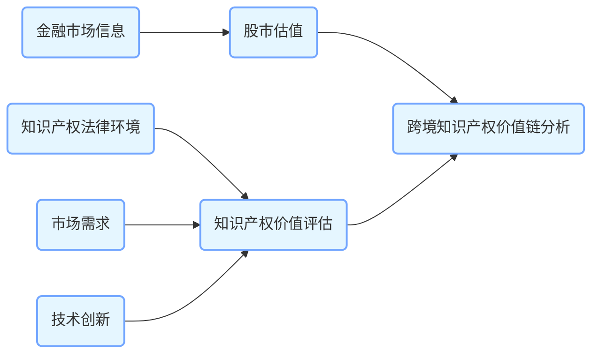

# 股市估值在跨境知识产权价值链分析中的应用

> 关键词：股市估值、跨境知识产权、价值链分析、知识产权价值评估、金融市场

> 摘要：本文深入探讨了股市估值在跨境知识产权价值链分析中的应用。首先介绍了研究的背景、目的、预期读者和文档结构，明确了相关术语。接着阐述了股市估值、跨境知识产权和价值链分析的核心概念及它们之间的联系，并给出了相应的原理和架构示意图。详细讲解了股市估值的核心算法原理，通过 Python 代码进行说明，同时介绍了相关的数学模型和公式。在项目实战部分，提供了开发环境搭建步骤、源代码实现及解读。分析了股市估值在跨境知识产权价值链分析中的实际应用场景，推荐了学习资源、开发工具框架和相关论文著作。最后总结了未来发展趋势与挑战，解答了常见问题，并提供了扩展阅读和参考资料。旨在为读者全面呈现股市估值在跨境知识产权价值链分析中的重要作用和应用方法。

## 1. 背景介绍 
### 1.1 目的和范围
随着全球经济一体化的深入发展，跨境知识产权交易日益频繁。知识产权作为企业的重要资产，其价值评估对于企业的战略决策、投资融资等活动至关重要。股市估值作为一种成熟的金融评估方法，能够反映市场对企业整体价值的预期。本研究的目的在于探讨如何将股市估值方法应用于跨境知识产权价值链分析中，为跨境知识产权的价值评估提供新的思路和方法。

研究范围涵盖了不同行业的跨境知识产权交易，包括专利、商标、著作权等多种知识产权类型。同时，考虑到不同国家和地区的金融市场特点和知识产权保护法律差异，分析股市估值在跨境环境下的适用性和局限性。

### 1.2 预期读者
本文的预期读者包括金融分析师、知识产权专家、企业战略决策者、投资者以及相关领域的研究人员。金融分析师可以从本文中了解如何将股市估值方法应用于跨境知识产权价值评估，为投资决策提供更全面的依据；知识产权专家可以借助股市估值的视角，深入分析跨境知识产权的市场价值和潜在收益；企业战略决策者可以根据本文的研究结果，制定更合理的知识产权战略和跨境投资策略；投资者可以通过了解股市估值在跨境知识产权价值链分析中的应用，发现潜在的投资机会；研究人员可以将本文作为进一步研究的参考，推动该领域的学术发展。

### 1.3 文档结构概述
本文共分为十个部分。第一部分为背景介绍，阐述了研究的目的、范围、预期读者和文档结构。第二部分介绍了股市估值、跨境知识产权和价值链分析的核心概念及它们之间的联系，并给出了相应的原理和架构示意图。第三部分详细讲解了股市估值的核心算法原理，通过 Python 代码进行说明。第四部分介绍了相关的数学模型和公式，并通过具体例子进行详细讲解。第五部分为项目实战，包括开发环境搭建、源代码实现及解读。第六部分分析了股市估值在跨境知识产权价值链分析中的实际应用场景。第七部分推荐了学习资源、开发工具框架和相关论文著作。第八部分总结了未来发展趋势与挑战。第九部分解答了常见问题。第十部分提供了扩展阅读和参考资料。

### 1.4 术语表
#### 1.4.1 核心术语定义
- **股市估值**：是指通过一定的方法和模型，对股票的内在价值进行评估，以判断股票价格是否合理。常见的股市估值方法包括市盈率法、市净率法、现金流折现法等。
- **跨境知识产权**：是指跨越国界的知识产权，包括专利、商标、著作权等。跨境知识产权交易涉及不同国家和地区的法律、文化和市场环境，具有较高的复杂性和风险性。
- **价值链分析**：是一种战略管理工具，通过分析企业的各项活动，识别企业的价值创造环节和竞争优势。在跨境知识产权领域，价值链分析可以帮助企业了解知识产权在不同环节的价值贡献，优化知识产权管理和运营策略。

#### 1.4.2 相关概念解释
- **知识产权价值评估**：是指对知识产权的经济价值进行评估的过程。知识产权的价值受到多种因素的影响，如技术创新程度、市场需求、法律保护等。
- **金融市场**：是指资金融通的市场，包括股票市场、债券市场、期货市场等。金融市场的价格波动反映了市场参与者对企业未来收益的预期。

#### 1.4.3 缩略词列表
- **PE**：市盈率（Price-to-Earnings Ratio），是指股票价格与每股收益的比率，用于衡量股票的估值水平。
- **PB**：市净率（Price-to-Book Ratio），是指股票价格与每股净资产的比率，用于评估股票的投资价值。
- **DCF**：现金流折现法（Discounted Cash Flow），是一种通过预测企业未来现金流并将其折现到当前的估值方法。

## 2. 核心概念与联系 

### 核心概念原理
#### 股市估值原理
股市估值的基本原理是基于企业的未来收益预期。不同的估值方法从不同的角度对企业的价值进行评估。例如，市盈率法通过比较股票价格与每股收益，反映市场对企业盈利能力的预期；市净率法通过比较股票价格与每股净资产，评估企业的资产价值；现金流折现法通过预测企业未来的现金流，并将其折现到当前，计算企业的内在价值。

#### 跨境知识产权原理
跨境知识产权是知识产权在国际范围内的延伸和拓展。其原理基于知识产权的法律保护和市场价值。不同国家和地区对知识产权的保护程度和法律规定存在差异，这影响了跨境知识产权的价值和交易风险。同时，跨境知识产权的市场价值受到技术创新、市场需求、竞争状况等多种因素的影响。

#### 价值链分析原理
价值链分析的原理是将企业的活动分解为一系列相互关联的价值创造环节，包括研发、生产、销售、售后服务等。通过分析每个环节的价值贡献和成本消耗，企业可以识别出自身的竞争优势和劣势，优化业务流程，提高运营效率。

### 架构示意图


该示意图展示了股市估值、跨境知识产权价值链分析、知识产权价值评估、金融市场信息、知识产权法律环境、市场需求和技术创新之间的关系。股市估值为跨境知识产权价值链分析提供了金融视角的评估方法；知识产权价值评估是跨境知识产权价值链分析的核心环节；金融市场信息影响股市估值；知识产权法律环境、市场需求和技术创新影响知识产权的价值评估。

## 3. 核心算法原理 & 具体操作步骤 

### 市盈率法
#### 算法原理
市盈率法是一种常用的股市估值方法，其基本公式为：

$$PE = \frac{P}{EPS}$$

其中，$PE$ 表示市盈率，$P$ 表示股票价格，$EPS$ 表示每股收益。通过已知的市盈率和每股收益，可以计算出股票的合理价格：

$$P = PE \times EPS$$

#### Python 代码实现
```python
def pe_valuation(pe_ratio, eps):
    """
    市盈率法计算股票价格
    :param pe_ratio: 市盈率
    :param eps: 每股收益
    :return: 股票价格
    """
    price = pe_ratio * eps
    return price

# 示例
pe_ratio = 20
eps = 2
stock_price = pe_valuation(pe_ratio, eps)
print(f"根据市盈率法计算的股票价格为: {stock_price}")
```

### 市净率法
#### 算法原理
市净率法通过比较股票价格与每股净资产来评估股票的投资价值，其公式为：

$$PB = \frac{P}{BVPS}$$

其中，$PB$ 表示市净率，$P$ 表示股票价格，$BVPS$ 表示每股净资产。股票的合理价格可以通过市净率和每股净资产计算得出：

$$P = PB \times BVPS$$

#### Python 代码实现
```python
def pb_valuation(pb_ratio, bvps):
    """
    市净率法计算股票价格
    :param pb_ratio: 市净率
    :param bvps: 每股净资产
    :return: 股票价格
    """
    price = pb_ratio * bvps
    return price

# 示例
pb_ratio = 1.5
bvps = 10
stock_price = pb_valuation(pb_ratio, bvps)
print(f"根据市净率法计算的股票价格为: {stock_price}")
```

### 现金流折现法
#### 算法原理
现金流折现法是一种基于企业未来现金流的估值方法。其基本思想是将企业未来的现金流按照一定的折现率折现到当前，计算企业的内在价值。具体步骤如下：
1. 预测企业未来的自由现金流（FCF）。
2. 确定折现率（r），通常可以使用资本资产定价模型（CAPM）来计算。
3. 将未来的自由现金流折现到当前：

$$V = \sum_{t=1}^{n} \frac{FCF_t}{(1 + r)^t} + \frac{TV}{(1 + r)^n}$$

其中，$V$ 表示企业的内在价值，$FCF_t$ 表示第 $t$ 期的自由现金流，$r$ 表示折现率，$n$ 表示预测期数，$TV$ 表示终值。

#### Python 代码实现
```python
def dcf_valuation(fcf_list, discount_rate, terminal_value):
    """
    现金流折现法计算企业内在价值
    :param fcf_list: 未来自由现金流列表
    :param discount_rate: 折现率
    :param terminal_value: 终值
    :return: 企业内在价值
    """
    present_value = 0
    n = len(fcf_list)
    for t in range(n):
        present_value += fcf_list[t] / ((1 + discount_rate) ** (t + 1))
    present_value += terminal_value / ((1 + discount_rate) ** n)
    return present_value

# 示例
fcf_list = [100, 120, 150, 180, 200]
discount_rate = 0.1
terminal_value = 3000
enterprise_value = dcf_valuation(fcf_list, discount_rate, terminal_value)
print(f"根据现金流折现法计算的企业内在价值为: {enterprise_value}")
```

## 4. 数学模型和公式 & 详细讲解 & 举例说明 

### 市盈率法
#### 数学公式
$$PE = \frac{P}{EPS}$$

#### 详细讲解
市盈率是衡量股票估值水平的重要指标。较高的市盈率通常表示市场对企业的未来发展前景较为乐观，愿意为每股收益支付较高的价格；较低的市盈率则可能表示市场对企业的预期较低，或者股票被低估。

#### 举例说明
假设某公司的股票价格为 $50$ 元，每股收益为 $2$ 元，则该公司的市盈率为：

$$PE = \frac{50}{2} = 25$$

这意味着投资者愿意为该公司每股 $1$ 元的收益支付 $25$ 元的价格。如果同行业的平均市盈率为 $20$，则该公司的股票可能被高估。

### 市净率法
#### 数学公式
$$PB = \frac{P}{BVPS}$$

#### 详细讲解
市净率反映了股票价格与每股净资产的关系。市净率小于 $1$ 表示股票价格低于每股净资产，可能被低估；市净率大于 $1$ 表示股票价格高于每股净资产，可能被高估。

#### 举例说明
假设某公司的股票价格为 $15$ 元，每股净资产为 $10$ 元，则该公司的市净率为：

$$PB = \frac{15}{10} = 1.5$$

这表明该公司的股票价格是每股净资产的 $1.5$ 倍。如果同行业的平均市净率为 $1.2$，则该公司的股票可能被高估。

### 现金流折现法
#### 数学公式
$$V = \sum_{t=1}^{n} \frac{FCF_t}{(1 + r)^t} + \frac{TV}{(1 + r)^n}$$

#### 详细讲解
现金流折现法的核心思想是将企业未来的现金流折现到当前，考虑了资金的时间价值。预测期内的自由现金流反映了企业在未来一段时间内的经营活动产生的现金流量；终值则表示预测期结束后企业的持续经营价值。折现率反映了投资者对投资风险的要求，风险越高，折现率越高。

#### 举例说明
假设某企业未来 $5$ 年的自由现金流分别为 $100$ 万元、$120$ 万元、$150$ 万元、$180$ 万元和 $200$ 万元，折现率为 $10\%$，预测期结束后的终值为 $3000$ 万元。则该企业的内在价值为：

$$V = \frac{100}{(1 + 0.1)^1} + \frac{120}{(1 + 0.1)^2} + \frac{150}{(1 + 0.1)^3} + \frac{180}{(1 + 0.1)^4} + \frac{200}{(1 + 0.1)^5} + \frac{3000}{(1 + 0.1)^5}$$

$$V \approx 90.91 + 99.17 + 112.69 + 122.94 + 124.18 + 1862.76 = 2312.65$$（万元）

## 5. 项目实战：代码实际案例和详细解释说明 

### 5.1  开发环境搭建
#### 操作系统
本项目可以在 Windows、Linux 或 macOS 操作系统上进行开发。建议使用 Linux 或 macOS 系统，因为它们在开发环境的配置和管理方面更加方便。

#### Python 环境
使用 Python 3.7 及以上版本。可以从 Python 官方网站（https://www.python.org/downloads/）下载并安装 Python。

#### 开发工具
推荐使用 PyCharm 作为开发工具，它是一款功能强大的 Python IDE，提供了代码编辑、调试、版本控制等丰富的功能。

#### 安装依赖库
在项目中，我们需要使用一些 Python 库来实现股市估值和数据处理。可以使用以下命令安装所需的库：
```sh
pip install pandas numpy matplotlib
```

### 5.2  源代码详细实现和代码解读
```python
import pandas as pd
import numpy as np
import matplotlib.pyplot as plt

# 假设我们有某公司的财务数据
data = {
    'Year': [2016, 2017, 2018, 2019, 2020],
    'EPS': [1.2, 1.5, 1.8, 2.0, 2.2],
    'BVPS': [8, 9, 10, 11, 12],
    'FCF': [100, 120, 150, 180, 200]
}

df = pd.DataFrame(data)

# 市盈率法估值
pe_ratio = 20
df['PE_Valuation'] = df['EPS'] * pe_ratio

# 市净率法估值
pb_ratio = 1.5
df['PB_Valuation'] = df['BVPS'] * pb_ratio

# 现金流折现法估值
discount_rate = 0.1
terminal_growth_rate = 0.03
terminal_value = df['FCF'].iloc[-1] * (1 + terminal_growth_rate) / (discount_rate - terminal_growth_rate)
present_values = []
for i in range(len(df)):
    fcf = df['FCF'].iloc[i]
    pv = fcf / ((1 + discount_rate) ** (i + 1))
    present_values.append(pv)
dcf_valuation = sum(present_values) + terminal_value / ((1 + discount_rate) ** len(df))

# 可视化估值结果
plt.figure(figsize=(10, 6))
plt.plot(df['Year'], df['PE_Valuation'], label='PE Valuation')
plt.plot(df['Year'], df['PB_Valuation'], label='PB Valuation')
plt.axhline(y=dcf_valuation, color='r', linestyle='--', label='DCF Valuation')
plt.xlabel('Year')
plt.ylabel('Valuation')
plt.title('Stock Valuation of the Company')
plt.legend()
plt.show()
```

### 5.3  代码解读与分析
1. **数据准备**：使用 Pandas 库创建一个包含公司财务数据的 DataFrame，包括年份、每股收益（EPS）、每股净资产（BVPS）和自由现金流（FCF）。
2. **市盈率法估值**：假设市盈率为 $20$，根据每股收益计算每年的股票估值，并将结果添加到 DataFrame 中。
3. **市净率法估值**：假设市净率为 $1.5$，根据每股净资产计算每年的股票估值，并将结果添加到 DataFrame 中。
4. **现金流折现法估值**：首先确定折现率和终值增长率，计算终值。然后将每年的自由现金流折现到当前，求和得到企业的内在价值。
5. **可视化**：使用 Matplotlib 库绘制三种估值方法的结果，直观展示不同年份的股票估值变化。

## 6. 实际应用场景 
### 跨境知识产权投资决策
在跨境知识产权投资中，投资者可以利用股市估值方法评估拥有相关知识产权的企业的价值。例如，通过市盈率法和市净率法比较不同企业的估值水平，选择被低估的企业进行投资。同时，现金流折现法可以帮助投资者预测企业未来的现金流，评估知识产权带来的长期收益。

### 跨境知识产权交易定价
在跨境知识产权交易中，买卖双方可以参考股市估值方法确定知识产权的交易价格。例如，卖方可以根据企业的股市估值和知识产权在企业价值中的占比，确定知识产权的合理售价；买方可以通过评估目标企业的价值，判断知识产权的购买价格是否合理。

### 企业知识产权战略规划
企业在制定跨境知识产权战略时，可以利用股市估值方法评估知识产权的市场价值和潜在收益。例如，通过分析不同知识产权对企业股市估值的影响，确定重点发展的知识产权领域；根据股市估值的变化，调整知识产权的研发、运营和保护策略。

### 金融机构信贷评估
金融机构在为拥有跨境知识产权的企业提供信贷时，可以利用股市估值方法评估企业的还款能力和信用风险。例如，通过分析企业的股市估值和现金流状况，判断企业是否有足够的能力偿还贷款；根据股市估值的波动情况，调整信贷额度和利率。

## 7. 工具和资源推荐
### 7.1 学习资源推荐
#### 7.1.1 书籍推荐
- 《证券分析》（Security Analysis）：由本杰明·格雷厄姆（Benjamin Graham）和戴维·多德（David Dodd）所著，是股市估值领域的经典著作，介绍了多种股市估值方法和投资分析技巧。
- 《估值：难点、解决方案及相关案例》（Valuation: Measuring and Managing the Value of Companies）：作者为蒂姆·科勒（Tim Koller）、马克·戈德哈特（Marc Goedhart）和戴维·韦塞尔（David Wessels），详细讲解了企业估值的理论和实践方法，包括现金流折现法、市盈率法等。
- 《知识产权经济学》（The Economics of Intellectual Property）：由理查德·波斯纳（Richard A. Posner）所著，探讨了知识产权的经济原理和价值评估方法，对理解跨境知识产权的价值具有重要参考意义。

#### 7.1.2 在线课程
- Coursera 上的“Financial Markets”课程：由耶鲁大学的罗伯特·席勒（Robert Shiller）教授授课，介绍了金融市场的基本原理和股市估值方法。
- edX 上的“Valuation for Mergers, Acquisitions, and Restructuring”课程：由纽约大学的阿斯沃思·达摩达兰（Aswath Damodaran）教授授课，深入讲解了企业估值在并购和重组中的应用。
- Udemy 上的“Intellectual Property Law and Strategy”课程：介绍了知识产权的法律保护和战略管理，帮助学员了解跨境知识产权的相关知识。

#### 7.1.3 技术博客和网站
- Seeking Alpha（https://seekingalpha.com/）：提供股票分析、投资策略和市场评论等内容，是投资者获取股市估值信息的重要平台。
- IPWatchdog（https://www.ipwatchdog.com/）：专注于知识产权领域的新闻、分析和评论，提供跨境知识产权的最新动态和研究成果。
- Investopedia（https://www.investopedia.com/）：是一个金融知识学习网站，提供股市估值、投资分析等方面的教程和解释。

### 7.2 开发工具框架推荐
#### 7.2.1 IDE和编辑器
- PyCharm：是一款功能强大的 Python IDE，提供了代码编辑、调试、版本控制等丰富的功能，适合开发股市估值和数据分析相关的 Python 项目。
- Jupyter Notebook：是一个交互式的开发环境，支持 Python、R 等多种编程语言，方便进行数据探索、可视化和模型验证。

#### 7.2.2 调试和性能分析工具
- PDB：是 Python 自带的调试器，可以帮助开发者定位代码中的错误和问题。
- cProfile：是 Python 的性能分析工具，可以分析代码的运行时间和函数调用情况，帮助优化代码性能。

#### 7.2.3 相关框架和库
- Pandas：是一个用于数据处理和分析的 Python 库，提供了 DataFrame 等数据结构，方便处理和分析财务数据。
- NumPy：是 Python 的科学计算库，提供了高效的数组操作和数学函数，用于实现股市估值算法。
- Matplotlib：是 Python 的绘图库，用于可视化股市估值结果和数据趋势。

### 7.3 相关论文著作推荐
#### 7.3.1 经典论文
- “The Theory of Rational Option Pricing” by Fischer Black and Myron Scholes：提出了著名的布莱克 - 斯科尔斯期权定价模型，对金融估值理论产生了深远影响。
- “Dividend Policy, Growth, and the Valuation of Shares” by Merton H. Miller and Franco Modigliani：探讨了股利政策与企业估值的关系，是企业财务领域的经典论文。
- “Intellectual Property Rights and Economic Development: Evidence from Cross - Country Analysis” by Keith E. Maskus：研究了知识产权保护与经济发展之间的关系，为跨境知识产权价值评估提供了理论支持。

#### 7.3.2 最新研究成果
- 关注《Journal of Financial Economics》、《Review of Financial Studies》等金融领域的顶级期刊，以及《Journal of Intellectual Property Law & Practice》等知识产权领域的专业期刊，获取股市估值和跨境知识产权研究的最新成果。

#### 7.3.3 应用案例分析
- 可以参考一些咨询公司和研究机构发布的报告，如麦肯锡（McKinsey）、波士顿咨询集团（BCG）等，了解股市估值在跨境知识产权投资、交易等实际应用中的案例分析和经验总结。

## 8. 总结：未来发展趋势与挑战
### 未来发展趋势
#### 数据驱动的估值方法创新
随着大数据、人工智能和机器学习技术的发展，未来股市估值和跨境知识产权价值评估将更加依赖数据驱动的方法。通过收集和分析大量的财务数据、市场数据和知识产权数据，可以建立更加准确和个性化的估值模型，提高估值的精度和效率。

#### 跨境知识产权价值链的整合与优化
企业将更加注重跨境知识产权价值链的整合与优化，通过加强知识产权的研发、运营和保护，提高知识产权的价值创造能力。同时，股市估值将在跨境知识产权价值链的各个环节发挥更加重要的作用，为企业的战略决策提供更加全面的支持。

#### 国际合作与标准制定
随着跨境知识产权交易的日益频繁，国际合作和标准制定将成为未来的发展趋势。各国政府和国际组织将加强合作，制定统一的知识产权保护法律和估值标准，降低跨境知识产权交易的风险和成本。

### 挑战
#### 数据质量和隐私问题
数据质量和隐私问题是数据驱动的估值方法面临的主要挑战。在收集和分析大量数据的过程中，如何保证数据的准确性、完整性和一致性是一个关键问题。同时，如何保护数据隐私和安全，避免数据泄露和滥用也是需要解决的难题。

#### 跨境法律和文化差异
跨境知识产权交易涉及不同国家和地区的法律、文化和市场环境，存在较大的法律和文化差异。如何在跨境环境下准确评估知识产权的价值，以及如何处理知识产权纠纷和法律风险是一个挑战。

#### 技术创新的不确定性
技术创新的不确定性是跨境知识产权价值评估的另一个挑战。随着科技的快速发展，新的技术和商业模式不断涌现，知识产权的价值也随之发生变化。如何准确预测技术创新的趋势和影响，以及如何评估新技术和新商业模式下的知识产权价值是一个难题。

## 9. 附录：常见问题与解答
### 股市估值方法在跨境知识产权价值评估中的准确性如何？
股市估值方法在跨境知识产权价值评估中具有一定的参考价值，但准确性受到多种因素的影响。例如，股市估值方法通常基于企业的整体财务数据，而知识产权的价值可能难以单独从企业财务数据中分离出来。此外，不同国家和地区的金融市场和法律环境存在差异，也会影响股市估值方法的准确性。因此，在使用股市估值方法进行跨境知识产权价值评估时，需要结合其他方法和因素进行综合分析。

### 如何选择合适的股市估值方法？
选择合适的股市估值方法需要考虑多个因素，包括企业的行业特点、财务状况、发展阶段和市场环境等。例如，对于盈利稳定的企业，可以使用市盈率法进行估值；对于资产价值较高的企业，可以使用市净率法进行估值；对于具有明确现金流预测的企业，可以使用现金流折现法进行估值。在实际应用中，通常需要结合多种估值方法进行综合评估，以提高估值的准确性。

### 跨境知识产权的法律风险如何影响股市估值？
跨境知识产权的法律风险会对股市估值产生负面影响。如果企业面临知识产权侵权纠纷、专利无效宣告等法律风险，可能会导致企业的声誉受损、市场份额下降和经济损失增加，从而影响企业的未来收益预期和股市估值。因此，在进行跨境知识产权价值评估时，需要充分考虑法律风险因素，并对其进行合理的量化和评估。

### 如何获取跨境知识产权的相关数据？
获取跨境知识产权的相关数据可以通过多种途径，包括企业公开披露的财务报告、知识产权数据库、行业研究报告和政府统计数据等。此外，还可以通过专业的咨询机构和数据提供商获取更加详细和准确的知识产权数据。在获取数据时，需要注意数据的准确性、完整性和时效性，并进行合理的分析和处理。

## 10. 扩展阅读 & 参考资料
### 扩展阅读
- 《金融炼金术》（The Alchemy of Finance）：乔治·索罗斯（George Soros）所著，探讨了金融市场的运行规律和投资者的心理行为，对理解股市估值和金融市场波动具有重要启示。
- 《创新者的窘境》（The Innovator's Dilemma）：克莱顿·克里斯坦森（Clayton M. Christensen）所著，分析了企业在技术创新和市场竞争中的困境和挑战，对跨境知识产权的战略管理具有参考价值。

### 参考资料
- 相关的学术期刊文章，如《Journal of Financial Economics》、《Review of Financial Studies》、《Journal of Intellectual Property Law & Practice》等。
- 咨询公司和研究机构发布的报告，如麦肯锡（McKinsey）、波士顿咨询集团（BCG）等。
- 各国政府和国际组织发布的知识产权政策和统计数据，如世界知识产权组织（WIPO）、美国专利商标局（USPTO）等。

作者：AI天才研究院/AI Genius Institute & 禅与计算机程序设计艺术 /Zen And The Art of Computer Programming