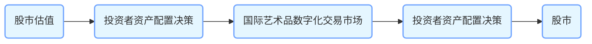

# 股市估值对国际艺术品数字化交易的影响

> 关键词：股市估值、国际艺术品数字化交易、金融市场、艺术市场、资产配置、市场趋势、数字资产

> 摘要：本文旨在深入探讨股市估值对国际艺术品数字化交易的影响。通过对股市估值和国际艺术品数字化交易核心概念的阐述，分析两者之间的内在联系。详细讲解相关算法原理、数学模型，结合项目实战案例进行代码实现与分析。探讨股市估值在国际艺术品数字化交易中的实际应用场景，推荐学习、开发工具和相关论文著作。最后总结未来发展趋势与挑战，为该领域的研究和实践提供全面且深入的参考。

## 1. 背景介绍 
### 1.1 目的和范围
本研究的目的在于全面且深入地探究股市估值与国际艺术品数字化交易之间的复杂关系。通过对两者内在联系的剖析，揭示股市估值如何影响国际艺术品数字化交易的各个环节，包括市场趋势、交易规模、价格波动等。研究范围涵盖全球主要金融市场的股市估值情况，以及国际上具有代表性的艺术品数字化交易平台和市场动态，旨在为投资者、艺术品从业者和相关研究人员提供有价值的参考。

### 1.2 预期读者
本文预期读者包括金融领域的投资者、分析师、研究人员，他们可以通过本文深入了解股市估值与艺术品数字化交易之间的关联，为投资决策提供依据；艺术市场的从业者，如画廊经营者、艺术品经纪人、拍卖行工作人员等，能够借助本文洞察市场趋势，制定合理的经营策略；计算机科学和信息技术领域的专业人士，可从中获取关于艺术品数字化交易技术实现的相关信息；此外，对金融市场和艺术市场交叉领域感兴趣的普通读者也能通过本文拓宽知识面，增进对这一新兴领域的理解。

### 1.3 文档结构概述
本文首先介绍背景信息，包括研究目的、预期读者和文档结构概述，以及相关术语的定义和解释。接着阐述股市估值和国际艺术品数字化交易的核心概念及其联系，并通过文本示意图和 Mermaid 流程图进行直观展示。然后详细讲解核心算法原理和具体操作步骤，结合 Python 源代码进行说明。再介绍相关的数学模型和公式，并举例说明其应用。通过项目实战案例，展示开发环境搭建、源代码实现和代码解读。探讨股市估值对国际艺术品数字化交易的实际应用场景。推荐学习资源、开发工具框架和相关论文著作。最后总结未来发展趋势与挑战，提供常见问题解答和扩展阅读参考资料。

### 1.4 术语表
#### 1.4.1 核心术语定义
- **股市估值**：指对股票市场整体或个别股票的价值进行评估的过程和结果。通常基于公司的财务状况、盈利能力、行业前景等多种因素，运用不同的估值方法来确定股票的合理价格范围，以判断股票是否被高估或低估。
- **国际艺术品数字化交易**：借助现代信息技术，将艺术品以数字化形式呈现，并在国际范围内进行的交易活动。包括艺术品的数字化存储、展示、拍卖、投资等环节，利用区块链、大数据、人工智能等技术实现交易的高效、透明和安全。
- **数字资产**：以数字形式存在的资产，如数字货币、数字化艺术品、虚拟财产等。在国际艺术品数字化交易中，数字资产是艺术品数字化后的表现形式，具有独特的价值和交易属性。

#### 1.4.2 相关概念解释
- **资产配置**：投资者根据自身的风险承受能力、投资目标和市场情况，将资金分配到不同类型资产（如股票、债券、艺术品等）的过程。资产配置的目的是在风险和收益之间寻求平衡，实现投资组合的优化。
- **市场趋势**：指市场在一段时间内的发展方向和变化态势。包括上升趋势、下降趋势和盘整趋势等。股市估值和国际艺术品数字化交易市场都受到市场趋势的影响，同时也相互影响。
- **价格波动**：指资产价格在一定时期内的上下变动情况。价格波动是市场供求关系、宏观经济环境、投资者情绪等多种因素共同作用的结果。在国际艺术品数字化交易中，价格波动会影响投资者的决策和市场的稳定性。

#### 1.4.3 缩略词列表
- **NFT**：Non - Fungible Token，非同质化代币，是一种基于区块链技术的数字资产凭证，具有唯一性和不可替代性，常用于标记数字化艺术品的所有权。
- **AI**：Artificial Intelligence，人工智能，在国际艺术品数字化交易中可用于艺术品真伪鉴定、市场趋势预测等方面。
- **BD**：Big Data，大数据，通过对大量交易数据的分析，为国际艺术品数字化交易提供决策支持和市场洞察。

## 2. 核心概念与联系 
### 2.1 股市估值的核心概念
股市估值是金融领域的重要概念，它是对股票市场价值的评估过程。其目的在于确定股票的合理价格，帮助投资者做出明智的投资决策。常见的股市估值方法包括市盈率法（P/E）、市净率法（P/B）、现金流折现法（DCF）等。

市盈率法是通过将股票价格除以每股收益来计算市盈率，市盈率反映了投资者为获取公司每一元盈利所愿意支付的价格。市净率法则是将股票价格除以每股净资产，市净率体现了股票价格与公司账面价值的关系。现金流折现法是通过预测公司未来的现金流，并将其折现到当前，以确定公司的内在价值。

### 2.2 国际艺术品数字化交易的核心概念
国际艺术品数字化交易是艺术市场与信息技术融合的产物。它将传统艺术品通过数字化技术转化为数字资产，利用区块链技术实现数字资产的唯一性和不可篡改，确保艺术品的所有权和交易记录的真实性。

在国际艺术品数字化交易中，NFT 技术发挥了关键作用。NFT 作为一种非同质化代币，为数字化艺术品赋予了独特的身份标识，使得每一件数字化艺术品都具有独一无二的价值。同时，借助互联网平台，国际艺术品数字化交易打破了地域限制，实现了全球范围内的交易和流通。

### 2.3 两者的联系
股市估值和国际艺术品数字化交易之间存在着密切的联系。一方面，股市估值反映了金融市场的整体状况和投资者的情绪。当股市估值较高，市场处于牛市时，投资者的财富增加，风险偏好上升，可能会将部分资金从股市转移到艺术品市场，推动国际艺术品数字化交易的发展。反之，当股市估值较低，市场处于熊市时，投资者的财富缩水，风险偏好下降，可能会减少对艺术品的投资，导致国际艺术品数字化交易市场的低迷。

另一方面，国际艺术品数字化交易市场的发展也会对股市产生影响。艺术品市场的繁荣可能会吸引一部分投资者的关注，从而减少对股票市场的资金投入。同时，艺术品数字化交易相关企业的上市和发展，也会影响股市中相关板块的表现。

### 2.4 文本示意图
股市估值与国际艺术品数字化交易的联系可以用以下文本示意图表示：

股市估值（金融市场状况、投资者情绪） -- 影响 --> 投资者资产配置决策 -- 影响 --> 国际艺术品数字化交易市场（交易规模、价格波动）

国际艺术品数字化交易市场（市场繁荣程度、相关企业发展） -- 影响 --> 投资者资产配置决策 -- 影响 --> 股市（资金流向、相关板块表现）

### 2.5 Mermaid 流程图


## 3. 核心算法原理 & 具体操作步骤 
### 3.1 股市估值算法原理
#### 3.1.1 市盈率法（P/E）
市盈率法是一种简单而常用的股市估值方法。其原理是通过比较股票的市盈率与同行业平均市盈率或历史市盈率，来判断股票是否被高估或低估。

Python 代码实现：
```python
def pe_ratio(stock_price, earnings_per_share):
    """
    计算市盈率
    :param stock_price: 股票价格
    :param earnings_per_share: 每股收益
    :return: 市盈率
    """
    if earnings_per_share == 0:
        return None
    return stock_price / earnings_per_share
```
#### 3.1.2 市净率法（P/B）
市净率法是通过比较股票的市净率与同行业平均市净率或历史市净率，来评估股票的价值。

Python 代码实现：
```python
def pb_ratio(stock_price, book_value_per_share):
    """
    计算市净率
    :param stock_price: 股票价格
    :param book_value_per_share: 每股净资产
    :return: 市净率
    """
    if book_value_per_share == 0:
        return None
    return stock_price / book_value_per_share
```
#### 3.1.3 现金流折现法（DCF）
现金流折现法是一种较为复杂的估值方法，它通过预测公司未来的现金流，并将其折现到当前，以确定公司的内在价值。

Python 代码实现：
```python
import numpy as np

def dcf_value(cash_flows, discount_rate):
    """
    计算现金流折现价值
    :param cash_flows: 未来现金流列表
    :param discount_rate: 折现率
    :return: 现金流折现价值
    """
    present_values = []
    for i, cf in enumerate(cash_flows):
        present_value = cf / (1 + discount_rate) ** (i + 1)
        present_values.append(present_value)
    return np.sum(present_values)
```
### 3.2 国际艺术品数字化交易中的算法原理
#### 3.2.1 NFT 生成算法
NFT 生成算法基于区块链技术，确保每个 NFT 的唯一性和不可篡改。以以太坊区块链为例，使用智能合约来创建和管理 NFT。

Python 代码实现（使用 Web3.py 库）：
```python
from web3 import Web3

# 连接到以太坊节点
w3 = Web3(Web3.HTTPProvider('https://mainnet.infura.io/v3/YOUR_INFURA_PROJECT_ID'))

# 定义 NFT 智能合约的 ABI 和地址
nft_abi = [...]  # 替换为实际的 ABI
nft_address = '0x1234567890abcdef1234567890abcdef12345678'  # 替换为实际的地址

# 加载智能合约
nft_contract = w3.eth.contract(address=nft_address, abi=nft_abi)

# 生成 NFT
def mint_nft(token_uri, recipient_address):
    """
    生成 NFT
    :param token_uri: NFT 的元数据 URI
    :param recipient_address: 接收者地址
    :return: 交易哈希
    """
    nonce = w3.eth.getTransactionCount(w3.eth.accounts[0])
    tx = nft_contract.functions.mint(recipient_address, token_uri).buildTransaction({
        'nonce': nonce,
        'gas': 2000000,
        'gasPrice': w3.toWei('50', 'gwei')
    })
    signed_tx = w3.eth.account.signTransaction(tx, private_key='YOUR_PRIVATE_KEY')
    tx_hash = w3.eth.sendRawTransaction(signed_tx.rawTransaction)
    return tx_hash
```
#### 3.2.2 艺术品真伪鉴定算法
可以使用深度学习算法进行艺术品真伪鉴定。以卷积神经网络（CNN）为例，通过训练模型来识别艺术品的特征。

Python 代码实现（使用 Keras 库）：
```python
from keras.models import Sequential
from keras.layers import Conv2D, MaxPooling2D, Flatten, Dense

# 构建 CNN 模型
model = Sequential()
model.add(Conv2D(32, (3, 3), activation='relu', input_shape=(224, 224, 3)))
model.add(MaxPooling2D((2, 2)))
model.add(Conv2D(64, (3, 3), activation='relu'))
model.add(MaxPooling2D((2, 2)))
model.add(Conv2D(128, (3, 3), activation='relu'))
model.add(MaxPooling2D((2, 2)))
model.add(Flatten())
model.add(Dense(128, activation='relu'))
model.add(Dense(1, activation='sigmoid'))

# 编译模型
model.compile(optimizer='adam', loss='binary_crossentropy', metrics=['accuracy'])

# 训练模型
# model.fit(x_train, y_train, epochs=10, batch_size=32)
```
### 3.3 具体操作步骤
#### 3.3.1 股市估值操作步骤
1. 收集股票的相关数据，包括股票价格、每股收益、每股净资产等。
2. 根据需要选择合适的估值方法，如市盈率法、市净率法或现金流折现法。
3. 使用相应的算法计算股票的估值指标。
4. 将计算结果与同行业平均水平或历史数据进行比较，判断股票是否被高估或低估。

#### 3.3.2 国际艺术品数字化交易操作步骤
1. 艺术品数字化：将传统艺术品进行数字化处理，生成数字图像或视频等。
2. 生成 NFT：使用区块链技术为数字化艺术品生成唯一的 NFT。
3. 上架交易：将带有 NFT 的数字化艺术品上架到国际艺术品数字化交易平台。
4. 交易和结算：买家通过平台购买数字化艺术品，完成交易和结算过程。

## 4. 数学模型和公式 & 详细讲解 & 举例说明 
### 4.1 股市估值数学模型和公式
#### 4.1.1 市盈率法（P/E）
市盈率（P/E）的计算公式为：
$$P/E = \frac{P}{E}$$
其中，$P$ 为股票价格，$E$ 为每股收益。

举例说明：假设某股票的价格为 50 元，每股收益为 5 元，则该股票的市盈率为：
$$P/E = \frac{50}{5} = 10$$

如果同行业平均市盈率为 15，则该股票可能被低估，具有投资价值。

#### 4.1.2 市净率法（P/B）
市净率（P/B）的计算公式为：
$$P/B = \frac{P}{B}$$
其中，$P$ 为股票价格，$B$ 为每股净资产。

举例说明：假设某股票的价格为 40 元，每股净资产为 20 元，则该股票的市净率为：
$$P/B = \frac{40}{20} = 2$$

如果同行业平均市净率为 3，则该股票可能被低估。

#### 4.1.3 现金流折现法（DCF）
现金流折现法的基本公式为：
$$V = \sum_{t=1}^{n} \frac{CF_t}{(1 + r)^t}$$
其中，$V$ 为公司的内在价值，$CF_t$ 为第 $t$ 期的现金流，$r$ 为折现率，$n$ 为预测期数。

举例说明：假设某公司未来三年的现金流分别为 100 万元、120 万元、150 万元，折现率为 10%，则该公司的内在价值为：
$$V = \frac{100}{(1 + 0.1)^1} + \frac{120}{(1 + 0.1)^2} + \frac{150}{(1 + 0.1)^3}$$
$$V \approx 90.91 + 99.17 + 112.70 = 302.78 \text{（万元）}$$

### 4.2 国际艺术品数字化交易中的数学模型和公式
#### 4.2.1 NFT 价值评估模型
NFT 的价值受到多种因素的影响，如艺术品的稀缺性、艺术家的知名度、市场需求等。一种简单的 NFT 价值评估模型可以表示为：
$$V_{NFT} = \alpha \times S + \beta \times A + \gamma \times D$$
其中，$V_{NFT}$ 为 NFT 的价值，$S$ 为艺术品的稀缺性指标，$A$ 为艺术家的知名度指标，$D$ 为市场需求指标，$\alpha$、$\beta$、$\gamma$ 为权重系数，且 $\alpha + \beta + \gamma = 1$。

举例说明：假设某 NFT 的稀缺性指标为 80，艺术家知名度指标为 70，市场需求指标为 60，权重系数 $\alpha = 0.4$，$\beta = 0.3$，$\gamma = 0.3$，则该 NFT 的价值为：
$$V_{NFT} = 0.4 \times 80 + 0.3 \times 70 + 0.3 \times 60$$
$$V_{NFT} = 32 + 21 + 18 = 71$$

#### 4.2.2 艺术品价格波动模型
艺术品价格波动可以用随机游走模型来描述：
$$P_{t+1} = P_t + \epsilon_t$$
其中，$P_t$ 为第 $t$ 期的艺术品价格，$\epsilon_t$ 为随机误差项，服从均值为 0、方差为 $\sigma^2$ 的正态分布。

举例说明：假设某艺术品当前价格为 1000 元，随机误差项 $\epsilon_t$ 为 10 元，则下一期的价格为：
$$P_{t+1} = 1000 +