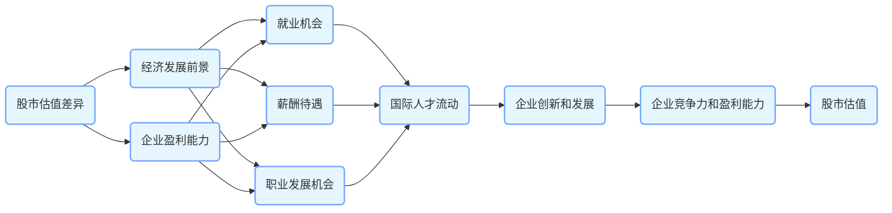

# 股市估值差异对国际人才流动的影响

> 关键词：股市估值差异、国际人才流动、经济因素、职业发展、人才吸引力

> 摘要：本文旨在深入探讨股市估值差异对国际人才流动的影响。通过分析股市估值差异背后的经济原理、其与人才流动的内在联系，结合相关数学模型和实际案例，揭示这一现象对人才在国际间流动的推动或阻碍作用。同时，阐述其在不同应用场景中的表现，推荐相关学习资源、开发工具和研究论文，最后对未来发展趋势与挑战进行总结，并解答常见问题，为理解和应对这一复杂问题提供全面的视角。

## 1. 背景介绍 
### 1.1 目的和范围
本研究的目的在于全面剖析股市估值差异如何影响国际人才流动，明确两者之间的因果关系和作用机制。范围涵盖全球主要经济体的股市情况以及相应的人才流动趋势，涉及不同行业、不同层次的人才群体，分析在宏观经济环境下股市估值差异对人才跨国流动决策的影响。

### 1.2 预期读者
本文预期读者包括经济领域的研究者、政策制定者、企业管理者、人力资源专家以及对国际人才流动和股市经济感兴趣的人士。通过阅读本文，读者能够深入了解股市估值差异与国际人才流动之间的关联，为其相关决策和研究提供参考依据。

### 1.3 文档结构概述
本文首先介绍背景信息，包括目的、预期读者和文档结构概述等内容。接着阐述核心概念与联系，分析股市估值差异和国际人才流动的原理及两者之间的逻辑关系。然后详细讲解核心算法原理和具体操作步骤，通过数学模型和公式进一步阐释其内在规律，并举例说明。之后通过项目实战，展示实际案例和代码实现，进行代码解读与分析。再探讨实际应用场景，推荐相关工具和资源。最后总结未来发展趋势与挑战，解答常见问题并提供扩展阅读和参考资料。

### 1.4 术语表
#### 1.4.1 核心术语定义
- **股市估值差异**：指不同国家或地区股票市场对上市公司价值评估的差异，通常通过市盈率、市净率等指标来衡量。这种差异反映了市场对企业未来盈利预期、风险偏好等因素的不同看法。
- **国际人才流动**：指人才跨越国界，从一个国家或地区向另一个国家或地区的迁移和流动，包括短期的商务交流、学术访问以及长期的就业、定居等形式。

#### 1.4.2 相关概念解释
- **市盈率（P/E）**：是股票价格与每股收益的比率，反映了投资者为获取公司每一元盈利所愿意支付的价格。较高的市盈率可能表示市场对公司未来盈利增长有较高预期，也可能意味着股票被高估。
- **市净率（P/B）**：是股票价格与每股净资产的比率，衡量了市场对公司净资产的估值水平。市净率大于1表示市场对公司资产的估值高于其账面价值，反之则低于账面价值。

#### 1.4.3 缩略词列表
- **P/E**：市盈率（Price-to-Earnings Ratio）
- **P/B**：市净率（Price-to-Book Ratio）

## 2. 核心概念与联系 

### 2.1 股市估值差异的原理
股市估值差异的形成受到多种因素的影响。从宏观经济层面来看，不同国家的经济增长速度、通货膨胀率、利率水平等因素会导致市场对企业未来盈利的预期不同。例如，经济增长较快的国家，企业的盈利增长空间相对较大，市场可能会给予较高的估值；而通货膨胀率较高的国家，投资者可能会要求更高的回报率，从而压低股票估值。

从行业层面来看，不同国家的产业结构和发展阶段不同，对不同行业的需求和重视程度也存在差异。一些新兴产业在发展较快的国家可能会受到更多的关注和资本投入，其相关企业的估值也会相对较高；而传统产业在某些国家可能面临产能过剩等问题，估值相对较低。

从市场情绪和投资者偏好来看，不同国家的投资者对风险的承受能力和投资风格不同，也会影响股市估值。例如，一些国家的投资者更倾向于短期投机，而另一些国家的投资者更注重长期价值投资，这会导致股票价格的波动和估值的差异。

### 2.2 国际人才流动的原理
国际人才流动是多种因素共同作用的结果。经济因素是推动人才流动的重要动力之一。人才往往会流向经济发展水平较高、就业机会较多、薪酬待遇较好的国家或地区。例如，发达国家通常具有更完善的产业体系和更高的劳动生产率，能够提供更多高薪的工作岗位，吸引了大量发展中国家的人才。

职业发展机会也是影响人才流动的关键因素。一些国家或地区在特定领域具有先进的技术和研究设施，能够为人才提供更广阔的职业发展空间和学习成长机会。例如，美国在信息技术、生物科技等领域处于世界领先地位，吸引了全球大量相关专业的人才前往。

生活环境和文化因素也会对人才流动产生影响。一些国家具有优美的自然环境、良好的社会福利和多元包容的文化氛围，这些因素也会增加其对人才的吸引力。

### 2.3 股市估值差异与国际人才流动的联系
股市估值差异与国际人才流动之间存在着密切的联系。一方面，股市估值较高的国家或地区往往意味着经济发展前景较好、企业盈利能力较强，能够提供更多的就业机会和更高的薪酬待遇，从而吸引更多的人才流入。例如，在科技股估值较高的美国硅谷地区，众多科技企业发展迅速，吸引了全球大量的科技人才。

另一方面，人才的流动也会对股市估值产生影响。高素质的人才能够推动企业的创新和发展，提高企业的竞争力和盈利能力，进而提升企业的估值。例如，大量优秀的科技人才涌入一家科技企业，可能会带来新的技术和产品，使企业的市场前景更加广阔，股票价格上涨，估值提高。

### 2.4 文本示意图
股市估值差异与国际人才流动的关系可以用以下示意图表示：

股市估值差异（宏观经济、行业、市场情绪等因素影响） -> 影响经济发展前景、企业盈利能力 -> 影响就业机会、薪酬待遇、职业发展机会 -> 吸引或阻碍国际人才流动

国际人才流动 -> 影响企业创新和发展 -> 影响企业竞争力和盈利能力 -> 影响股市估值

### 2.5 Mermaid 流程图


## 3. 核心算法原理 & 具体操作步骤 

### 3.1 股市估值差异的量化方法
为了量化股市估值差异，我们可以使用市盈率（P/E）和市净率（P/B）等指标。以下是使用 Python 计算不同国家或地区股市平均市盈率和市净率的示例代码：

```python
import pandas as pd

# 假设我们有一个包含不同国家股市数据的 DataFrame
# 数据包含 'country'（国家）、'pe_ratio'（市盈率）、'pb_ratio'（市净率） 列
data = {
    'country': ['A', 'B', 'C'],
    'pe_ratio': [20, 25, 18],
    'pb_ratio': [2.5, 3, 2]
}
df = pd.DataFrame(data)

# 计算每个国家的平均市盈率和市净率
average_pe = df.groupby('country')['pe_ratio'].mean()
average_pb = df.groupby('country')['pb_ratio'].mean()

print("平均市盈率：")
print(average_pe)
print("平均市净率：")
print(average_pb)
```

### 3.2 国际人才流动的量化方法
国际人才流动可以通过统计不同国家或地区的人才流入和流出数量来量化。以下是一个简单的 Python 示例，用于计算人才流动净数量：

```python
# 假设我们有一个包含不同国家人才流入和流出数据的 DataFrame
# 数据包含 'country'（国家）、'inflow'（流入人数）、'outflow'（流出人数） 列
data = {
    'country': ['A', 'B', 'C'],
    'inflow': [1000, 800, 1200],
    'outflow': [800, 1000, 900]
}
df = pd.DataFrame(data)

# 计算人才流动净数量
df['net_flow'] = df['inflow'] - df['outflow']

print("人才流动净数量：")
print(df[['country', 'net_flow']])
```

### 3.3 分析股市估值差异与国际人才流动关系的步骤
1. **数据收集**：收集不同国家或地区的股市数据（包括市盈率、市净率等）和人才流动数据（包括流入、流出人数等）。
2. **数据清洗和预处理**：对收集到的数据进行清洗，处理缺失值、异常值等，确保数据的准确性和一致性。
3. **量化股市估值差异和国际人才流动**：使用上述方法计算股市估值差异和人才流动净数量等指标。
4. **相关性分析**：使用统计方法（如皮尔逊相关系数）分析股市估值差异和国际人才流动之间的相关性。以下是使用 Python 进行相关性分析的示例代码：

```python
import numpy as np
import pandas as pd
from scipy.stats import pearsonr

# 假设我们有两个 Series，分别表示股市估值差异和人才流动净数量
pe_difference = pd.Series([2, 3, 1])
net_flow = pd.Series([200, -200, 300])

# 计算皮尔逊相关系数和 p 值
corr, p_value = pearsonr(pe_difference, net_flow)

print("皮尔逊相关系数：", corr)
print("p 值：", p_value)
```

5. **建立回归模型**：如果相关性显著，可以建立回归模型来进一步分析股市估值差异对国际人才流动的影响程度。以下是使用 Python 建立简单线性回归模型的示例代码：

```python
from sklearn.linear_model import LinearRegression

# 准备数据
X = pe_difference.values.reshape(-1, 1)
y = net_flow.values

# 建立线性回归模型
model = LinearRegression()
model.fit(X, y)

# 输出回归系数和截距
print("回归系数：", model.coef_[0])
print("截距：", model.intercept_)
```

## 4. 数学模型和公式 & 详细讲解 & 举例说明 

### 4.1 皮尔逊相关系数公式
皮尔逊相关系数 $r$ 用于衡量两个变量之间的线性相关性，其公式为：

$$r = \frac{\sum_{i=1}^{n}(x_i - \bar{x})(y_i - \bar{y})}{\sqrt{\sum_{i=1}^{n}(x_i - \bar{x})^2 \sum_{i=1}^{n}(y_i - \bar{y})^2}}$$

其中，$x_i$ 和 $y_i$ 分别是两个变量的第 $i$ 个观测值，$\bar{x}$ 和 $\bar{y}$ 分别是两个变量的均值，$n$ 是观测值的数量。

皮尔逊相关系数的取值范围为 $[-1, 1]$。$r = 1$ 表示两个变量完全正相关，$r = -1$ 表示两个变量完全负相关，$r = 0$ 表示两个变量之间不存在线性相关性。

### 4.2 线性回归模型公式
简单线性回归模型的公式为：

$$y = \beta_0 + \beta_1 x + \epsilon$$

其中，$y$ 是因变量（国际人才流动净数量），$x$ 是自变量（股市估值差异），$\beta_0$ 是截距，$\beta_1$ 是回归系数，$\epsilon$ 是误差项。

回归系数 $\beta_1$ 表示自变量 $x$ 每变化一个单位，因变量 $y$ 的平均变化量。截距 $\beta_0$ 表示当自变量 $x$ 为 0 时，因变量 $y$ 的取值。

### 4.3 举例说明
假设我们收集了三个国家的股市市盈率差异和人才流动净数量数据如下：

| 国家 | 市盈率差异 | 人才流动净数量 |
| ---- | ---- | ---- |
| A | 2 | 200 |
| B | 3 | -200 |
| C | 1 | 300 |

首先，计算均值：
$\bar{x} = \frac{2 + 3 + 1}{3} = 2$
$\bar{y} = \frac{200 - 200 + 300}{3} = \frac{300}{3} = 100$

然后，计算分子和分母：
分子：
$\sum_{i=1}^{3}(x_i - \bar{x})(y_i - \bar{y}) = (2 - 2)(200 - 100) + (3 - 2)(-200 - 100) + (1 - 2)(300 - 100)$
$= 0 + 1 \times (-300) + (-1) \times 200 = -300 - 200 = -500$

分母：
$\sqrt{\sum_{i=1}^{3}(x_i - \bar{x})^2 \sum_{i=1}^{3}(y_i - \bar{y})^2} = \sqrt{((2 - 2)^2 + (3 - 2)^2 + (1 - 2)^2) \times ((200 - 100)^2 + (-200 - 100)^2 + (300 - 100)^2)}$
$= \sqrt{(0 + 1 + 1) \times (100^2 + (-300)^2 + 200^2)} = \sqrt{2 \times (10000 + 90000 + 40000)} = \sqrt{2 \times 140000} = \sqrt{280000}$

皮尔逊相关系数：
$r = \frac{-500}{\sqrt{280000}} \approx -0.94$

这表明股市市盈率差异和人才流动净数量之间存在较强的负相关关系。

接下来，使用线性回归模型：
$X = \begin{bmatrix} 2 \\ 3 \\ 1 \end{bmatrix}$，$y = \begin{bmatrix} 200 \\ -200 \\ 300 \end{bmatrix}$

使用 Python 代码计算得到回归系数 $\beta_1 \approx -500$，截距 $\beta_0 \approx 1200$。这意味着股市市盈率差异每增加 1 个单位，人才流动净数量平均减少 500 人，当股市市盈率差异为 0 时，人才流动净数量约为 1200 人。

## 5. 项目实战：代码实际案例和详细解释说明 

### 5.1  开发环境搭建
本项目使用 Python 进行开发，需要安装以下库：
- `pandas`：用于数据处理和分析。
- `numpy`：用于数值计算。
- `scipy`：用于统计分析。
- `sklearn`：用于机器学习模型的构建。

可以使用以下命令安装这些库：
```sh
pip install pandas numpy scipy scikit-learn
```

### 5.2  源代码详细实现和代码解读
以下是一个完整的 Python 代码示例，用于分析股市估值差异与国际人才流动之间的关系：

```python
import pandas as pd
import numpy as np
from scipy.stats import pearsonr
from sklearn.linear_model import LinearRegression

# 数据收集和预处理
# 假设我们有一个包含不同国家股市数据和人才流动数据的 CSV 文件
data = pd.read_csv('stock_and_talent.csv')

# 提取股市估值差异和人才流动净数量数据
pe_difference = data['pe_difference']
net_flow = data['net_flow']

# 量化股市估值差异和国际人才流动
# 这里数据已经在 CSV 文件中处理好，无需额外计算

# 相关性分析
corr, p_value = pearsonr(pe_difference, net_flow)
print("皮尔逊相关系数：", corr)
print("p 值：", p_value)

# 建立回归模型
X = pe_difference.values.reshape(-1, 1)
y = net_flow.values

model = LinearRegression()
model.fit(X, y)

# 输出回归系数和截距
print("回归系数：", model.coef_[0])
print("截距：", model.intercept_)
```

### 5.3  代码解读与分析
1. **数据收集和预处理**：使用 `pandas` 库的 `read_csv` 函数读取包含股市估值差异和人才流动数据的 CSV 文件。
2. **量化股市估值差异和国际人才流动**：这里假设数据已经在 CSV 文件中处理好，直接提取所需数据。
3. **相关性分析**：使用 `scipy` 库的