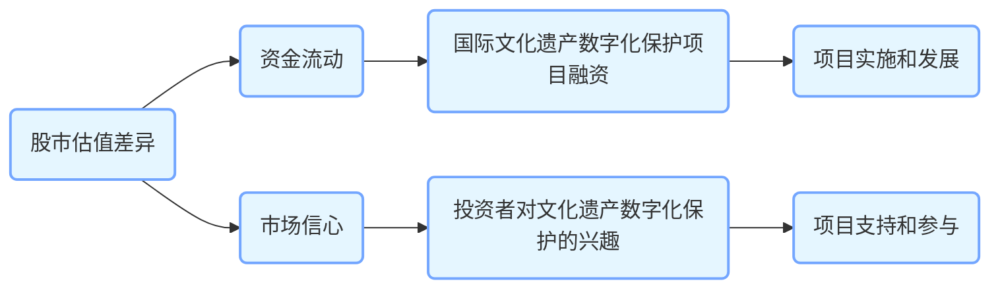

# 股市估值差异对国际文化遗产数字化保护的影响

> 关键词：股市估值差异、国际文化遗产数字化保护、资金流动、市场信心、技术创新

> 摘要：本文深入探讨了股市估值差异对国际文化遗产数字化保护的影响。通过分析股市估值差异产生的原因及其表现形式，研究其如何通过资金流动、市场信心等方面作用于国际文化遗产数字化保护工作。详细阐述了核心概念之间的联系，介绍了相关算法原理和数学模型，并结合实际案例进行分析。同时，探讨了股市估值差异在不同应用场景下对文化遗产数字化保护的具体影响，推荐了相关的学习资源、开发工具和研究论文。最后对未来发展趋势与挑战进行总结，旨在为更好地推动国际文化遗产数字化保护提供理论支持和实践指导。

## 1. 背景介绍 
### 1.1 目的和范围
本研究旨在全面剖析股市估值差异对国际文化遗产数字化保护的影响机制。股市作为金融市场的重要组成部分，其估值的波动和差异会对各类经济活动产生广泛影响。国际文化遗产数字化保护是一个具有重要文化和历史意义的领域，需要大量的资金投入、技术支持和市场信心。通过研究股市估值差异与国际文化遗产数字化保护之间的关系，我们可以更好地理解金融市场与文化保护领域的相互作用，为制定相关政策和决策提供依据。研究范围涵盖了全球股市的估值情况以及不同国家和地区的国际文化遗产数字化保护项目。

### 1.2 预期读者
本文的预期读者包括金融领域的专业人士，如投资者、分析师、基金经理等，他们可以从中了解股市估值差异对文化遗产相关投资的影响；文化遗产保护领域的工作者，包括博物馆馆长、考古学家、文化遗产数字化专家等，有助于他们认识到金融市场因素对保护工作的作用；政策制定者和决策者，能够为他们制定促进文化遗产数字化保护的政策提供参考；此外，对金融和文化遗产感兴趣的学者和普通读者也可以从本文中获取有价值的信息。

### 1.3 文档结构概述
本文首先介绍了研究的背景信息，包括目的、预期读者和文档结构。接着阐述了股市估值差异和国际文化遗产数字化保护的核心概念及其联系，并通过文本示意图和 Mermaid 流程图进行直观展示。然后详细讲解了核心算法原理和具体操作步骤，给出了相关的 Python 源代码。之后介绍了数学模型和公式，并通过举例进行说明。在项目实战部分，提供了代码实际案例和详细的解释说明。随后探讨了股市估值差异在实际应用场景中的影响。接着推荐了相关的工具和资源，包括学习资源、开发工具框架和论文著作。最后总结了未来发展趋势与挑战，并提供了常见问题的解答和扩展阅读参考资料。

### 1.4 术语表
#### 1.4.1 核心术语定义
- **股市估值差异**：指不同股票或不同股票市场之间在估值水平上的差异。估值通常基于公司的财务状况、盈利能力、市场前景等因素，常用的估值指标包括市盈率（P/E）、市净率（P/B）等。股市估值差异可能由于行业特性、宏观经济环境、公司竞争力等多种因素引起。
- **国际文化遗产数字化保护**：将国际范围内的文化遗产，如古建筑、文物、非物质文化遗产等，通过数字化技术进行记录、存储、展示和传承的过程。数字化技术包括三维扫描、虚拟现实、多媒体展示等，旨在保护文化遗产的完整性和真实性，同时提高公众对文化遗产的认知和参与度。

#### 1.4.2 相关概念解释
- **资金流动**：指资金在不同金融市场、行业和项目之间的转移。股市估值差异会影响投资者的决策，从而导致资金在不同股票和市场之间流动。在文化遗产数字化保护领域，资金流动表现为资金从股市流入或流出相关的投资项目。
- **市场信心**：投资者对市场整体或特定行业、项目的信心程度。股市估值差异会影响市场信心，当股市估值较高时，投资者可能更有信心进行投资；反之，当估值较低时，投资者可能会持谨慎态度。市场信心对国际文化遗产数字化保护项目的融资和发展具有重要影响。

#### 1.4.3 缩略词列表
- **P/E**：市盈率（Price-to-Earnings Ratio），是股票价格与每股收益的比率，用于衡量股票的估值水平。
- **P/B**：市净率（Price-to-Book Ratio），是股票价格与每股净资产的比率，也是常用的估值指标之一。
- **3D**：三维（Three-Dimensional），在文化遗产数字化保护中常用于三维扫描和建模技术。
- **VR**：虚拟现实（Virtual Reality），一种通过计算机技术创建的模拟环境，可用于文化遗产的沉浸式展示。

## 2. 核心概念与联系 

### 核心概念原理
股市估值差异的产生主要基于以下原理：不同行业的发展前景和盈利能力不同，导致其股票的估值水平存在差异。例如，科技行业通常具有较高的增长潜力，其股票的市盈率可能较高；而传统制造业的增长相对较慢，市盈率可能较低。宏观经济环境也会对股市估值产生影响，经济增长强劲时，股市整体估值可能上升；经济衰退时，估值则可能下降。此外，公司的竞争力、财务状况、管理水平等因素也会影响其股票的估值。

国际文化遗产数字化保护的原理是利用现代数字化技术对文化遗产进行全方位的记录和保存。三维扫描技术可以精确地获取文化遗产的几何形状和表面信息，建立高精度的三维模型；虚拟现实技术可以让用户身临其境地感受文化遗产的魅力，增强公众的参与和体验。通过数字化保护，可以避免文化遗产因自然因素、人为破坏等原因而遭受损失，同时也便于文化遗产的传播和研究。

### 架构的文本示意图
股市估值差异与国际文化遗产数字化保护之间的联系可以通过以下文本示意图来表示：

股市估值差异 -> 资金流动 -> 国际文化遗产数字化保护项目融资 -> 项目实施和发展
股市估值差异 -> 市场信心 -> 投资者对文化遗产数字化保护的兴趣 -> 项目支持和参与

### Mermaid 流程图


从流程图可以看出，股市估值差异通过资金流动和市场信心两个主要途径影响国际文化遗产数字化保护项目。资金流动直接影响项目的融资情况，而市场信心则影响投资者对项目的兴趣和支持程度。

## 3. 核心算法原理 & 具体操作步骤 

### 股市估值差异的计算算法
股市估值差异可以通过比较不同股票或市场的估值指标来计算。以市盈率为例，计算步骤如下：

1. 收集不同股票或市场的股价和每股收益数据。
2. 计算每只股票或市场的市盈率，公式为：$P/E = \frac{股价}{每股收益}$
3. 比较不同股票或市场的市盈率，计算市盈率差异。

以下是使用 Python 实现的示例代码：
```python
# 定义股票数据
stock_prices = [100, 200, 150]
earnings_per_share = [5, 10, 7]

# 计算市盈率
pe_ratios = []
for price, eps in zip(stock_prices, earnings_per_share):
    pe = price / eps
    pe_ratios.append(pe)

# 计算市盈率差异
max_pe = max(pe_ratios)
min_pe = min(pe_ratios)
pe_difference = max_pe - min_pe

print("市盈率列表:", pe_ratios)
print("市盈率差异:", pe_difference)
```

### 资金流动对文化遗产数字化保护项目融资影响的模拟算法
为了模拟资金流动对文化遗产数字化保护项目融资的影响，我们可以建立一个简单的模型。假设资金流动与股市估值差异成正比，项目融资额与资金流入量成正比。具体步骤如下：

1. 设定初始的股市估值差异和项目融资额。
2. 根据股市估值差异计算资金流入量，公式为：$资金流入量 = 估值差异系数 \times 股市估值差异$
3. 根据资金流入量计算项目融资额的变化，公式为：$新融资额 = 原融资额 + 融资系数 \times 资金流入量$

以下是使用 Python 实现的示例代码：
```python
# 设定初始参数
initial_valuation_difference = 20
initial_funding = 100000
valuation_difference_coefficient = 0.5
funding_coefficient = 0.2

# 计算资金流入量
funding_inflow = valuation_difference_coefficient * initial_valuation_difference

# 计算新的融资额
new_funding = initial_funding + funding_coefficient * funding_inflow

print("初始融资额:", initial_funding)
print("资金流入量:", funding_inflow)
print("新的融资额:", new_funding)
```

### 具体操作步骤
1. **数据收集**：收集股市相关数据，包括股价、每股收益等，以及文化遗产数字化保护项目的融资数据。
2. **算法实现**：根据上述算法，使用 Python 编写代码进行计算和模拟。
3. **结果分析**：分析计算和模拟的结果，了解股市估值差异对资金流动和项目融资的影响。
4. **决策建议**：根据分析结果，为文化遗产数字化保护项目的融资和发展提供决策建议。

## 4. 数学模型和公式 & 详细讲解 & 举例说明 

### 股市估值差异的数学模型
股市估值差异可以用以下数学模型表示：

设 $P_{i}$ 为第 $i$ 只股票的价格，$E_{i}$ 为第 $i$ 只股票的每股收益，$P/E_{i}$ 为第 $i$ 只股票的市盈率，则第 $j$ 只股票与第 $k$ 只股票的市盈率差异 $\Delta (P/E)$ 为：

$$\Delta (P/E) = |P/E_{j} - P/E_{k}| = \left|\frac{P_{j}}{E_{j}} - \frac{P_{k}}{E_{k}}\right|$$

例如，股票 A 的股价为 100 元，每股收益为 5 元，股票 B 的股价为 200 元，每股收益为 10 元。则股票 A 的市盈率为 $P/E_{A} = \frac{100}{5} = 20$，股票 B 的市盈率为 $P/E_{B} = \frac{200}{10} = 20$，两者的市盈率差异为 $\Delta (P/E) = |20 - 20| = 0$。

### 资金流动对项目融资影响的数学模型
设 $V$ 为股市估值差异，$F_{in}$ 为资金流入量，$F_{0}$ 为项目的初始融资额，$F_{1}$ 为项目的新融资额，$\alpha$ 为估值差异系数，$\beta$ 为融资系数。则资金流入量和新融资额的计算公式分别为：

$$F_{in} = \alpha V$$

$$F_{1} = F_{0} + \beta F_{in} = F_{0} + \beta \alpha V$$

例如，设初始融资额 $F_{0} = 100000$ 元，估值差异系数 $\alpha = 0.5$，融资系数 $\beta = 0.2$，股市估值差异 $V = 20$。则资金流入量 $F_{in} = 0.5 \times 20 = 10$，新融资额 $F_{1} = 100000 + 0.2 \times 10 = 100002$ 元。

### 市场信心对投资者兴趣影响的数学模型
设 $C$ 为市场信心指数，$I$ 为投资者对文化遗产数字化保护项目的兴趣指数，$\gamma$ 为信心影响系数。则投资者兴趣指数的计算公式为：

$$I = \gamma C$$

市场信心指数可以通过问卷调查、市场情绪分析等方法获得。例如，设市场信心指数 $C = 0.8$，信心影响系数 $\gamma = 0.6$，则投资者兴趣指数 $I = 0.6 \times 0.8 = 0.48$。

## 5. 项目实战：代码实际案例和详细解释说明 

### 5.1  开发环境搭建
为了实现上述算法和模型，我们需要搭建一个 Python 开发环境。以下是具体步骤：

1. **安装 Python**：从 Python 官方网站（https://www.python.org/downloads/）下载并安装适合你操作系统的 Python 版本。建议安装 Python 3.7 及以上版本。
2. **安装开发工具**：可以选择使用 PyCharm、Jupyter Notebook 等开发工具。PyCharm 是一个功能强大的 Python 集成开发环境（IDE），适合大型项目的开发；Jupyter Notebook 则是一个交互式的开发环境，适合进行数据分析和代码演示。
3. **安装必要的库**：在命令行中使用以下命令安装必要的库：
```sh
pip install numpy pandas matplotlib
```
这些库分别用于数值计算、数据处理和数据可视化。

### 5.2  源代码详细实现和代码解读
以下是一个完整的 Python 代码示例，用于模拟股市估值差异对国际文化遗产数字化保护项目融资的影响：

```python
import numpy as np
import matplotlib.pyplot as plt

# 设定初始参数
num_stocks = 10
stock_prices = np.random.randint(50, 200, num_stocks)
earnings_per_share = np.random.randint(2, 10, num_stocks)
initial_funding = 100000
valuation_difference_coefficient = 0.5
funding_coefficient = 0.2

# 计算市盈率
pe_ratios = stock_prices / earnings_per_share

# 计算市盈率差异
max_pe = np.max(pe_ratios)
min_pe = np.min(pe_ratios)
valuation_difference = max_pe - min_pe

# 计算资金流入量
funding_inflow = valuation_difference_coefficient * valuation_difference

# 计算新的融资额
new_funding = initial_funding + funding_coefficient * funding_inflow

# 输出结果
print("股票市盈率列表:", pe_ratios)
print("市盈率差异:", valuation_difference)
print("资金流入量:", funding_inflow)
print("初始融资额:", initial_funding)
print("新的融资额:", new_funding)

# 可视化市盈率分布
plt.hist(pe_ratios, bins=20)
plt.xlabel('市盈率')
plt.ylabel('股票数量')
plt.title('股票市盈率分布')
plt.show()
```

### 代码解读与分析
1. **参数设定**：首先设定了股票的数量、随机生成的股价和每股收益，以及项目的初始融资额、估值差异系数和融资系数。
2. **市盈率计算**：使用 `np.random.randint` 函数随机生成股价和每股收益，然后计算每只股票的市盈率。
3. **市盈率差异计算**：找出最大和最小的市盈率，计算它们的差值作为市盈率差异。
4. **资金流入量和新融资额计算**：根据市盈率差异计算资金流入量，再根据资金流入量计算新的融资额。
5. **结果输出**：打印出股票市盈率列表、市盈率差异、资金流入量、初始融资额和新的融资额。
6. **可视化**：使用 `matplotlib` 库绘制股票市盈率的分布直方图，直观展示市盈率的分布情况。

通过这个代码示例，我们可以模拟股市估值差异对文化遗产数字化保护项目融资的影响，并通过可视化工具更好地理解数据的分布和变化。

## 6. 实际应用场景 
### 资金支持文化遗产数字化项目
当股市估值差异较大时，投资者可能会将资金从估值较高的股票转移到估值较低的股票或其他领域。如果文化遗产数字化保护项目具有较好的发展前景和投资价值，可能会吸引部分资金流入。例如，一些新兴的文化遗产数字化技术公司，如专注于三维扫描和虚拟现实展示的企业，可能会在股市估值差异的影响下获得更多的资金支持，从而推动其技术研发和项目实施。

### 影响文化遗产保护机构的融资决策
文化遗产保护机构在进行融资时，需要考虑股市的估值情况。如果股市整体估值较高，投资者的风险偏好可能较高，保护机构可以更容易地通过发行股票、债券等方式获得资金。相反，如果股市估值较低，投资者可能更倾向于保守投资，保护机构可能需要寻找其他融资渠道，如政府补贴、慈善捐赠等。

### 促进文化遗产数字化产业的发展
股市估值差异会影响文化遗产数字化产业的竞争格局。估值较高的企业可能更容易获得资金进行扩张和创新，从而提高市场竞争力；而估值较低的企业可能面临资金压力，需要通过提高效率、降低成本等方式来生存。这种竞争机制有助于推动整个文化遗产数字化产业的发展，促进技术创新和资源优化配置。

### 增强公众对文化遗产保护的关注
股市估值差异可能会引起公众对文化遗产数字化保护的关注。当相关企业的股价表现良好时，会吸引媒体和公众的目光，提高文化遗产保护的知名度和影响力。例如，一些文化遗产数字化旅游项目的成功上市，可能会激发公众对文化遗产的兴趣，促进文化旅游的发展。

## 7. 工具和资源推荐
### 7.1 学习资源推荐
#### 7.1.1 书籍推荐
- 《金融市场学》：全面介绍了金融市场的基本概念、理论和运行机制，包括股票市场、债券市场等。对于理解股市估值差异的产生原因和影响因素有很大帮助。
- 《文化遗产保护与数字化技术》：详细阐述了文化遗产数字化保护的技术原理、方法和应用案例，是文化遗产保护领域的经典著作。
- 《Python 数据分析实战》：适合初学者学习 Python 在数据分析领域的应用，书中包含了大量的实际案例和代码示例，有助于提高编程能力。

#### 7.1.2 在线课程
- Coursera 上的“金融市场”课程：由知名大学的教授授课，讲解金融市场的基本原理和分析方法，对股市估值有深入的探讨。
- edX 上的“文化遗产数字化保护”课程：提供了文化遗产数字化保护的最新技术和实践经验，通过在线视频、作业和讨论等方式进行学习。
- 慕课网上的“Python 数据分析入门”课程：系统地介绍了 Python 数据分析的基础知识和常用工具，适合零基础的学习者。

#### 7.1.3 技术博客和网站
- 雪球网：是一个专业的财经网站，提供股票行情、估值分析、投资策略等信息，有很多关于股市估值差异的讨论和分析文章。
- 中国文化遗产研究院官网：发布了文化遗产保护领域的最新政策、研究成果和项目动态，是了解文化遗产数字化保护的重要渠道。
- Python 官方文档：提供了 Python 语言的详细文档和教程，是学习 Python 编程的权威资源。

### 7.2 开发工具框架推荐
#### 7.2.1 IDE和编辑器
- PyCharm：功能强大的 Python 集成开发环境，支持代码调试、自动补全、版本控制等功能，适合大型项目的开发。
- Jupyter Notebook：交互式的开发环境，支持 Markdown 文本和代码的混合编写，方便进行数据分析和代码演示。
- Visual Studio Code：轻量级的代码编辑器，具有丰富的插件和扩展功能，支持多种编程语言，也可以用于 Python 开发。

#### 7.2.2 调试和性能分析工具
- PDB：Python 自带的调试工具，可以在代码中设置断点，逐步执行代码，查看变量的值和程序的执行流程。
- cProfile：Python 的性能分析工具，可以分析代码的运行时间和函数调用情况，帮助优化代码性能。
- Py-Spy：一个用于分析 Python 程序性能的工具，可以实时查看 Python 程序的 CPU 使用率和函数调用情况。

#### 7.2.3 相关框架和库
- NumPy：用于数值计算的 Python 库，提供了高效的数组操作和数学函数，是数据分析和科学计算的基础库。
- Pandas：用于数据处理和分析的 Python 库，提供了数据结构（如 DataFrame）和数据操作方法，方便进行数据清洗、转换和分析。
- Matplotlib：用于数据可视化的 Python 库，可以绘制各种类型的图表，如折线图、柱状图、散点图等，帮助直观展示数据。

### 7.3 相关论文著作推荐
#### 7.3.1 经典论文
- "The Capital Asset Pricing Model: Theory and Evidence"：该论文介绍了资本资产定价模型（CAPM），是金融领域的经典论文之一，对于理解股票估值和风险定价有重要意义。
- "Digital Preservation of Cultural Heritage: Technologies and Challenges"：探讨了文化遗产数字化保护的技术和面临的挑战，为文化遗产数字化保护的研究提供了理论基础。

#### 7.3.2 最新研究成果
- 关注国际知名学术期刊，如《Journal of Cultural Heritage》《Financial Analysts Journal》等，这些期刊会发表关于文化遗产保护和金融市场的最新研究成果。
- 参加相关的学术会议，如国际文化遗产保护大会、金融学术年会等，了解最新的研究动态和前沿技术。

#### 7.3.3 应用案例分析
- 分析国内外成功的文化遗产数字化保护项目案例，如故宫博物院的数字化展示项目、敦煌莫高窟的数字化保护工程等，学习它们的经验和做法。
- 研究一些文化遗产数字化企业的发展历程和商业模式，如法国的 CyArk 公司，该公司专注于文化遗产的三维数字化记录和保护，通过与全球各地的文化机构合作，积累了丰富的实践经验。

## 8. 总结：未来发展趋势与挑战
### 未来发展趋势
- **金融与文化遗产保护的深度融合**：随着金融市场的不断发展和文化遗产保护意识的提高，股市估值差异与国际文化遗产数字化保护之间的联系将更加紧密。金融机构可能会开发更多针对文化遗产保护项目的金融产品和服务，如文化遗产基金、文化债券等，为项目提供更丰富的融资渠道。
- **技术创新推动数字化保护**：人工智能、大数据、区块链等新兴技术将在文化遗产数字化保护中得到更广泛的应用。这些技术可以提高数字化保护的效率和质量，同时也为股市估值带来新的影响因素。例如，利用人工智能技术进行文物识别和修复，可能会提升相关企业的市场价值。
- **国际合作加强**：国际文化遗产数字化保护是一个全球性的问题，需要各国共同合作。未来，不同国家和地区之间的文化遗产保护机构、金融机构和科技企业可能会加强合作，共同开展项目研究和开发，促进文化遗产的全球共享和传承。

### 挑战
- **估值的不确定性**：股市估值受到多种因素的影响，包括宏观经济环境、政策变化、市场情绪等，具有较大的不确定性。这种不确定性会增加文化遗产数字化保护项目融资的难度和风险，保护机构和投资者需要更加谨慎地进行决策。
- **技术应用的难题**：虽然新兴技术为文化遗产数字化保护带来了机遇，但也面临着技术应用的难题。例如，人工智能技术在文物识别和修复中的准确性和可靠性还需要进一步提高；区块链技术在文化遗产数据存储和共享中的应用还需要解决隐私保护和安全等问题。
- **文化差异和政策障碍**：不同国家和地区的文化差异和政策法规不同，会对国际文化遗产数字化保护项目的开展带来一定的障碍。例如，一些国家对文化遗产的所有权和保护标准有严格的规定，可能会影响项目的合作和实施。

## 9. 附录：常见问题与解答
### 股市估值差异是如何产生的？
股市估值差异主要由行业特性、宏观经济环境、公司竞争力等因素引起。不同行业的发展前景和盈利能力不同，导致其股票的估值水平存在差异。宏观经济环境的变化也会影响股市整体估值，经济增长强劲时，股市估值可能上升；经济衰退时，估值则可能下降。此外，公司的财务状况、管理水平等因素也会影响其股票的估值。

### 股市估值差异对文化遗产数字化保护项目融资有哪些具体影响？
股市估值差异会影响资金流动和市场信心，从而对文化遗产数字化保护项目融资产生影响。当股市估值差异较大时，投资者可能会将资金从估值较高的股票转移到估值较低的股票或其他领域。如果文化遗产数字化保护项目具有较好的发展前景和投资价值，可能会吸引部分资金流入。同时，市场信心也会影响投资者对项目的兴趣和支持程度，当股市估值较高时，投资者可能更有信心进行投资。

### 如何利用股市估值差异促进文化遗产数字化保护？
可以通过以下方式利用股市估值差异促进文化遗产数字化保护：
1. 吸引资金流入：当股市估值差异有利于文化遗产数字化保护领域时，积极宣传项目的投资价值，吸引投资者的资金。
2. 优化融资策略：根据股市估值情况，选择合适的融资渠道和方式，如在股市估值较高时发行股票或债券。
3. 推动产业发展：利用资金支持文化遗产数字化产业的技术创新和企业发展，提高产业的竞争力和市场价值。

### 文化遗产数字化保护项目面临哪些金融风险？
文化遗产数字化保护项目面临的金融风险包括：
1. 融资风险：由于股市估值的不确定性，项目可能难以获得足够的资金支持。
2. 市场风险：市场需求的变化、技术的更新换代等因素可能导致项目的市场价值下降。
3. 信用风险：项目合作方的信用状况不佳可能导致项目无法按时完成或出现质量问题。

### 如何降低文化遗产数字化保护项目的金融风险？
可以通过以下措施降低文化遗产数字化保护项目的金融风险：
1. 多元化融资：拓宽融资渠道，减少对单一融资方式的依赖，如同时争取政府补贴、慈善捐赠和商业投资。
2. 市场调研：充分了解市场需求和技术发展趋势，确保项目具有良好的市场前景。
3. 信用评估：对项目合作方进行信用评估，选择信誉良好的合作伙伴。
4. 风险管理：建立风险管理体系，对项目的金融风险进行监测和控制。

## 10. 扩展阅读 & 参考资料
### 扩展阅读
- 《金融炼金术》：乔治·索罗斯的经典著作，探讨了金融市场的运行规律和投资者的心理行为，对理解股市估值和市场波动有很大帮助。
- 《数字化时代的文化遗产保护》：深入分析了数字化技术在文化遗产保护中的应用和发展趋势，为文化遗产数字化保护提供了新的思路和方法。
- 《投资学》：系统介绍了投资的基本理论和方法，包括股票投资、债券投资、基金投资等，有助于提高投资者的投资水平。

### 参考资料
- 中国证券监督管理委员会官方网站：提供了股市相关的政策法规、市场数据和监管信息。
- 联合国教科文组织官网：发布了国际文化遗产保护的相关政策、标准和项目信息。
- 相关学术数据库，如知网、万方、Web of Science 等：可以查找关于股市估值差异和国际文化遗产数字化保护的学术论文和研究报告。

作者：AI天才研究院/AI Genius Institute & 禅与计算机程序设计艺术 /Zen And The Art of Computer Programming