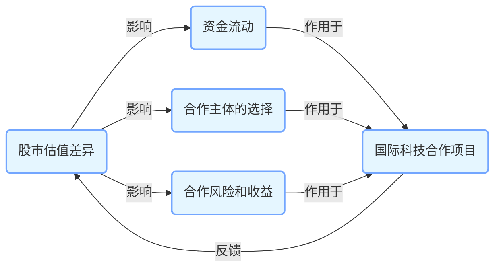

# 股市估值差异对国际科技合作项目的影响

> 关键词：股市估值差异、国际科技合作项目、金融市场、科技产业、合作风险、合作机遇、经济环境

> 摘要：本文深入探讨了股市估值差异对国际科技合作项目的多方面影响。在经济全球化背景下，国际科技合作日益频繁，而股市估值作为金融市场的重要指标，其差异会在合作的各个阶段产生作用。文章首先介绍了研究的背景、目的、预期读者等内容，接着阐述了股市估值差异和国际科技合作项目的核心概念与联系，分析了相关算法原理，通过数学模型和公式进行理论支持，结合项目实战案例详细解读代码实现过程，探讨了实际应用场景，推荐了相关工具和资源，最后总结了未来发展趋势与挑战，并对常见问题进行解答，旨在为理解和应对股市估值差异对国际科技合作项目的影响提供全面且深入的参考。

## 1. 背景介绍 
### 1.1 目的和范围
随着全球经济一体化的不断推进，国际科技合作项目在促进技术交流、资源共享和经济发展等方面发挥着越来越重要的作用。股市作为金融市场的核心组成部分，其估值情况反映了市场对企业价值的预期和判断。不同国家和地区的股市估值存在差异，这种差异会对国际科技合作项目产生多方面的影响。本研究的目的在于深入分析股市估值差异对国际科技合作项目的影响机制、作用路径以及可能带来的机遇和挑战，为参与国际科技合作的企业、投资者和政策制定者提供决策参考。研究范围涵盖了全球主要金融市场的股市估值情况以及各类国际科技合作项目，包括但不限于研发合作、技术转让、战略联盟等。

### 1.2 预期读者
本文的预期读者包括从事国际科技合作项目的企业管理人员、技术专家、投资机构的分析师和决策者、政府相关部门的政策制定者以及对金融市场和科技产业感兴趣的研究人员和学者。这些读者可以从本文中获取关于股市估值差异对国际科技合作项目影响的全面信息，从而更好地制定合作策略、评估投资风险和制定相关政策。

### 1.3 文档结构概述
本文共分为十个部分。第一部分为背景介绍，阐述了研究的目的、范围、预期读者和文档结构概述，并对相关术语进行解释。第二部分介绍股市估值差异和国际科技合作项目的核心概念与联系，通过文本示意图和 Mermaid 流程图进行说明。第三部分分析核心算法原理，并给出具体操作步骤，使用 Python 源代码详细阐述。第四部分介绍数学模型和公式，并进行详细讲解和举例说明。第五部分通过项目实战案例，介绍开发环境搭建、源代码详细实现和代码解读。第六部分探讨实际应用场景。第七部分推荐相关工具和资源，包括学习资源、开发工具框架和相关论文著作。第八部分总结未来发展趋势与挑战。第九部分为附录，解答常见问题。第十部分提供扩展阅读和参考资料。

### 1.4 术语表
#### 1.4.1 核心术语定义
- **股市估值**：指对股票市场中上市公司价值的评估，通常通过市盈率（P/E）、市净率（P/B）等指标来衡量。
- **股市估值差异**：不同国家或地区股票市场之间在估值水平上的差异，这种差异可能由于经济发展水平、市场环境、政策法规等因素导致。
- **国际科技合作项目**：指不同国家或地区的企业、科研机构、高校等主体之间开展的涉及科技研发、技术转让、创新合作等方面的项目。

#### 1.4.2 相关概念解释
- **金融市场**：是资金融通的市场，包括股票市场、债券市场、期货市场等，股市是金融市场的重要组成部分。
- **科技产业**：指从事科学技术研究、开发、应用和推广的产业，具有高创新性、高风险性和高附加值等特点。
- **合作风险**：指在国际科技合作项目中可能面临的各种风险，如技术风险、市场风险、法律风险等。
- **合作机遇**：指在国际科技合作项目中可能获得的各种机会，如技术创新、市场拓展、资源共享等。

#### 1.4.3 缩略词列表
- **P/E**：市盈率（Price-to-Earnings Ratio）
- **P/B**：市净率（Price-to-Book Ratio）

## 2. 核心概念与联系 

### 股市估值差异的原理
股市估值是投资者对上市公司未来盈利能力和成长潜力的预期体现。不同国家和地区的股市估值存在差异，主要原因包括以下几个方面：
- **经济发展水平**：经济发展较快的国家或地区，企业的盈利增长预期较高，股市估值可能相对较高；而经济发展较慢或不稳定的地区，股市估值可能较低。
- **市场环境**：成熟的金融市场具有较高的透明度、流动性和监管水平，投资者对市场的信心较高，股市估值也可能较高；而新兴市场可能存在信息不对称、市场波动较大等问题，股市估值相对较低。
- **政策法规**：不同国家和地区的政策法规对股市的影响不同。例如，税收政策、货币政策、产业政策等都会影响企业的盈利和市场的资金供求关系，从而影响股市估值。

### 国际科技合作项目的架构
国际科技合作项目通常涉及多个参与主体，包括企业、科研机构、高校等。项目的架构一般包括以下几个方面：
- **合作目标**：明确项目的研究方向、技术创新目标和商业目标。
- **合作模式**：常见的合作模式包括研发合作、技术转让、战略联盟等。
- **合作流程**：包括项目的发起、立项、实施、验收等阶段。
- **利益分配**：确定各参与主体在项目中的权益和收益分配方式。

### 两者的联系
股市估值差异对国际科技合作项目的影响主要体现在以下几个方面：
- **资金流动**：股市估值较高的地区，企业的融资成本相对较低，更容易获得资金支持，可能吸引更多的国际科技合作项目；而股市估值较低的地区，企业的融资难度较大，可能影响项目的开展。
- **合作主体的选择**：参与国际科技合作项目的企业会考虑对方所在地区的股市估值情况。股市估值较高的企业可能更倾向于与同类型的企业合作，以实现资源共享和优势互补；而股市估值较低的企业可能更希望通过合作提升自身的价值。
- **合作风险和收益**：股市估值差异可能导致合作双方对项目的风险和收益预期不同。估值较高的企业可能对项目的收益预期较高，而估值较低的企业可能更关注项目的风险控制。

### 文本示意图
```plaintext
股市估值差异
|-- 经济发展水平
|-- 市场环境
|-- 政策法规

国际科技合作项目
|-- 合作目标
|-- 合作模式
|-- 合作流程
|-- 利益分配

股市估值差异与国际科技合作项目的联系
|-- 资金流动
|-- 合作主体的选择
|-- 合作风险和收益
```

### Mermaid 流程图


## 3. 核心算法原理 & 具体操作步骤 

### 股市估值差异的计算算法
股市估值差异可以通过比较不同国家或地区的股市估值指标来计算。常用的估值指标包括市盈率（P/E）和市净率（P/B）。以下是计算两个地区股市估值差异的 Python 代码示例：

```python
def calculate_valuation_difference(pe1, pb1, pe2, pb2):
    """
    计算两个地区股市估值差异
    :param pe1: 地区 1 的市盈率
    :param pb1: 地区 1 的市净率
    :param pe2: 地区 2 的市盈率
    :param pb2: 地区 2 的市净率
    :return: 估值差异得分
    """
    pe_difference = abs(pe1 - pe2)
    pb_difference = abs(pb1 - pb2)
    # 简单加权平均计算估值差异得分
    valuation_difference = (pe_difference + pb_difference) / 2
    return valuation_difference

# 示例数据
pe1 = 20  # 地区 1 的市盈率
pb1 = 2.5  # 地区 1 的市净率
pe2 = 15  # 地区 2 的市盈率
pb2 = 2.0  # 地区 2 的市净率

valuation_difference = calculate_valuation_difference(pe1, pb1, pe2, pb2)
print(f"两个地区的股市估值差异得分为: {valuation_difference}")
```

### 具体操作步骤
1. **数据收集**：收集不同国家或地区股票市场的市盈率和市净率数据。这些数据可以从金融数据提供商、证券交易所网站等渠道获取。
2. **数据清洗**：对收集到的数据进行清洗，去除缺失值、异常值等。
3. **计算估值差异**：使用上述算法计算不同地区之间的股市估值差异。
4. **分析结果**：根据计算结果，分析股市估值差异的大小和趋势，以及对国际科技合作项目的可能影响。

## 4. 数学模型和公式 & 详细讲解 & 举例说明 

### 股市估值差异的数学模型
设 $PE_i$ 和 $PB_i$ 分别表示第 $i$ 个地区的市盈率和市净率，$i = 1, 2$。则两个地区的股市估值差异 $V$ 可以用以下公式表示：

$$V = \frac{\vert PE_1 - PE_2\vert+\vert PB_1 - PB_2\vert}{2}$$

### 详细讲解
- **市盈率差异**：$\vert PE_1 - PE_2\vert$ 表示两个地区市盈率的绝对差值。市盈率反映了市场对企业盈利的预期，市盈率差异越大，说明两个地区市场对企业盈利预期的差异越大。
- **市净率差异**：$\vert PB_1 - PB_2\vert$ 表示两个地区市净率的绝对差值。市净率反映了市场对企业净资产的估值，市净率差异越大，说明两个地区市场对企业净资产估值的差异越大。
- **估值差异得分**：将市盈率差异和市净率差异的平均值作为估值差异得分，综合考虑了两个指标的影响。

### 举例说明
假设地区 A 的市盈率 $PE_A = 25$，市净率 $PB_A = 3.0$；地区 B 的市盈率 $PE_B = 20$，市净率 $PB_B = 2.5$。则两个地区的股市估值差异为：

$$V=\frac{\vert 25 - 20\vert+\vert 3.0 - 2.5\vert}{2}=\frac{5 + 0.5}{2}=2.75$$

这表明地区 A 和地区 B 之间存在一定的股市估值差异。这种差异可能会对两个地区之间的国际科技合作项目产生影响，例如在资金流动、合作主体选择等方面。

## 5. 项目实战：代码实际案例和详细解释说明 

### 5.1  开发环境搭建
- **Python 安装**：确保系统中安装了 Python 3.x 版本。可以从 Python 官方网站（https://www.python.org/downloads/）下载并安装。
- **开发工具**：推荐使用 PyCharm 作为开发工具。可以从 JetBrains 官方网站（https://www.jetbrains.com/pycharm/download/）下载并安装。
- **依赖库安装**：本项目需要使用 `pandas`、`numpy` 等库。可以使用以下命令进行安装：
```sh
pip install pandas numpy
```

### 5.2  源代码详细实现和代码解读
以下是一个完整的 Python 代码示例，用于分析股市估值差异对国际科技合作项目的影响。代码主要包括数据读取、数据处理、估值差异计算和结果可视化等步骤。

```python
import pandas as pd
import numpy as np
import matplotlib.pyplot as plt

# 读取股市估值数据
def read_valuation_data(file_path):
    """
    读取股市估值数据
    :param file_path: 数据文件路径
    :return: 包含股市估值数据的 DataFrame
    """
    data = pd.read_csv(file_path)
    return data

# 计算估值差异
def calculate_valuation_differences(data):
    """
    计算不同地区之间的股市估值差异
    :param data: 包含股市估值数据的 DataFrame
    :return: 包含估值差异的 DataFrame
    """
    regions = data['Region'].unique()
    num_regions = len(regions)
    differences = []

    for i in range(num_regions):
        for j in range(i + 1, num_regions):
            region1 = regions[i]
            region2 = regions[j]
            pe1 = data[data['Region'] == region1]['PE'].values[0]
            pb1 = data[data['Region'] == region1]['PB'].values[0]
            pe2 = data[data['Region'] == region2]['PE'].values[0]
            pb2 = data[data['Region'] == region2]['PB'].values[0]

            pe_difference = abs(pe1 - pe2)
            pb_difference = abs(pb1 - pb2)
            valuation_difference = (pe_difference + pb_difference) / 2

            differences.append({
                'Region1': region1,
                'Region2': region2,
                'Valuation_Difference': valuation_difference
            })

    differences_df = pd.DataFrame(differences)
    return differences_df

# 可视化估值差异
def visualize_valuation_differences(differences_df):
    """
    可视化不同地区之间的股市估值差异
    :param differences_df: 包含估值差异的 DataFrame
    """
    plt.figure(figsize=(10, 6))
    plt.bar(differences_df['Region1'] + ' - ' + differences_df['Region2'], differences_df['Valuation_Difference'])
    plt.xlabel('Region Pairs')
    plt.ylabel('Valuation Difference')
    plt.title('Stock Market Valuation Differences between Regions')
    plt.xticks(rotation=45)
    plt.show()

# 主函数
def main():
    file_path = 'valuation_data.csv'  # 数据文件路径
    data = read_valuation_data(file_path)
    differences_df = calculate_valuation_differences(data)
    visualize_valuation_differences(differences_df)

if __name__ == "__main__":
    main()
```

### 5.3  代码解读与分析
- **数据读取**：`read_valuation_data` 函数用于读取包含股市估值数据的 CSV 文件，并将其转换为 Pandas DataFrame。
- **估值差异计算**：`calculate_valuation_differences` 函数遍历所有地区对，计算每对地区之间的股市估值差异，并将结果存储在一个新的 DataFrame 中。
- **可视化**：`visualize_valuation_differences` 函数使用 Matplotlib 库将估值差异以柱状图的形式进行可视化，方便用户直观地观察不同地区之间的估值差异。
- **主函数**：`main` 函数调用上述三个函数，完成数据读取、估值差异计算和可视化的整个流程。

## 6. 实际应用场景 
### 企业决策
- **合作对象选择**：企业在选择国际科技合作对象时，可以参考股市估值差异。如果两个地区的股市估值差异较大，企业可以考虑利用这种差异实现资源互补。例如，估值较高的企业可以与估值较低的企业合作，获取低成本的技术和资源；估值较低的企业可以借助估值较高企业的品牌和市场优势，提升自身价值。
- **投资决策**：企业在进行国际科技合作项目投资时，需要考虑股市估值差异对项目收益和风险的影响。如果合作双方所在地区的股市估值差异较大，可能会导致双方对项目的预期收益和风险评估不同。企业需要综合考虑各种因素，制定合理的投资策略。

### 政府政策制定
- **吸引外资**：政府可以通过改善金融市场环境，提高股市估值水平，吸引更多的国际科技合作项目和外资投入。例如，加强金融监管、提高市场透明度、完善法律法规等措施可以提升投资者对市场的信心，从而提高股市估值。
- **促进科技合作**：政府可以制定相关政策，鼓励不同地区之间的企业开展国际科技合作。例如，提供税收优惠、财政补贴、项目支持等政策措施，降低企业的合作成本，促进科技资源的共享和优化配置。

### 投资者决策
- **资产配置**：投资者在进行资产配置时，可以考虑股市估值差异对国际科技合作项目相关企业的影响。如果某个地区的股市估值较低，但具有较高的科技发展潜力，投资者可以适当增加对该地区相关企业的投资，以获取更高的收益。
- **风险分散**：投资者可以通过投资不同地区的国际科技合作项目相关企业，分散投资风险。由于不同地区的股市估值差异可能导致企业股价的波动不同，通过分散投资可以降低单一地区市场波动对投资组合的影响。

## 7. 工具和资源推荐
### 7.1 学习资源推荐
#### 7.1.1 书籍推荐
- 《金融市场学》：全面介绍了金融市场的基本理论、运行机制和主要金融工具，有助于读者深入理解股市估值的原理和方法。
- 《国际科技合作管理》：系统阐述了国际科技合作的基本概念、模式、流程和管理方法，为读者提供了国际科技合作项目的全面知识。
- 《Python 数据分析实战》：详细介绍了使用 Python 进行数据分析的方法和技巧，包括数据处理、数据可视化等内容，对本项目的代码实现有很大帮助。

#### 7.1.2 在线课程
- Coursera 上的“金融市场”课程：由知名高校教授授课，讲解金融市场的基本原理和分析方法。
- edX 上的“国际科技合作与创新”课程：介绍国际科技合作的前沿理论和实践案例。
- 中国大学 MOOC 上的“Python 语言程序设计”课程：适合初学者学习 Python 编程基础。

#### 7.1.3 技术博客和网站
- 雪球网：提供丰富的股市行情、分析和讨论，有助于了解股市估值情况。
- 科技日报：关注科技领域的最新动态和政策，提供国际科技合作的相关信息。
- Medium 上的技术博客：有很多关于金融数据分析和科技合作的优秀文章。

### 7.2 开发工具框架推荐
#### 7.2.1 IDE和编辑器
- PyCharm：功能强大的 Python 集成开发环境，提供代码编辑、调试、版本控制等功能。
- Jupyter Notebook：交互式编程环境，适合进行数据分析和实验，方便代码的展示和分享。

#### 7.2.2 调试和性能分析工具
- PySnooper：简单易用的 Python 调试工具，可以自动记录函数的调用过程和变量的值。
- cProfile：Python 内置的性能分析工具，用于分析代码的运行时间和性能瓶颈。

#### 7.2.3 相关框架和库
- Pandas：强大的数据处理和分析库，提供了高效的数据结构和数据操作方法。
- Numpy：用于科学计算的基础库，提供了多维数组和数学函数。
- Matplotlib：常用的数据可视化库，可用于绘制各种图表。

### 7.3 相关论文著作推荐
#### 7.3.1 经典论文
- Fama, E. F., & French, K. R. (1992). The cross-section of expected stock returns. The Journal of Finance, 47(2), 427-465. 该论文提出了著名的 Fama-French 三因子模型，对股市估值和资产定价有重要影响。
- Grossman, S. J., & Stiglitz, J. E. (1980). On the impossibility of informationally efficient markets. The American Economic Review, 70(3), 393-408. 探讨了信息效率和市场均衡的关系，对理解股市估值差异的原因有启示作用。

#### 7.3.2 最新研究成果
- 近年来，关于股市估值差异和国际科技合作的研究不断涌现。可以通过学术数据库（如 Web of Science、IEEE Xplore 等）搜索相关的最新研究论文，了解该领域的前沿动态。

#### 7.3.3 应用案例分析
- 一些国际知名企业的国际科技合作案例可以为我们提供实际应用的参考。例如，苹果公司与供应商在全球范围内的科技合作案例，分析其如何考虑股市估值差异等因素进行合作决策。

## 8. 总结：未来发展趋势与挑战
### 未来发展趋势
- **数字化和智能化**：随着信息技术的不断发展，金融市场和科技产业将越来越数字化和智能化。股市估值的计算和分析将更加精准和高效，国际科技合作项目的管理和协调也将更加智能化。
- **全球化和区域化并存**：经济全球化的趋势仍将继续，国际科技合作项目将更加广泛和深入。同时，区域经济合作也将不断加强，形成一些具有区域特色的科技合作联盟。
- **绿色科技合作**：随着全球对环境保护和可持续发展的重视，绿色科技合作将成为未来国际科技合作的重要方向。股市估值也将更加关注企业的环境、社会和治理（ESG）表现。

### 挑战
- **市场不确定性**：全球经济和金融市场的不确定性增加，股市估值波动较大，这给国际科技合作项目的决策和实施带来了困难。企业和投资者需要更加谨慎地评估风险，制定应对策略。
- **政策差异**：不同国家和地区的政策法规存在差异，这可能导致国际科技合作项目在审批、税收、知识产权保护等方面面临挑战。需要加强国际政策协调和合作，营造良好的合作环境。
- **文化差异**：国际科技合作项目涉及不同国家和地区的企业和人员，文化差异可能导致沟通障碍、合作冲突等问题。需要加强跨文化交流和培训，提高团队的协作能力。

## 9. 附录：常见问题与解答
### 问题 1：股市估值差异的计算方法是否准确？
解答：股市估值差异的计算方法是基于市盈率和市净率等指标，这些指标是常用的股市估值指标。但股市估值是一个复杂的问题，受到多种因素的影响，计算方法只能提供一个大致的参考。在实际应用中，还需要结合其他因素进行综合分析。

### 问题 2：股市估值差异对国际科技合作项目的影响是绝对的吗？
解答：不是绝对的。股市估值差异只是影响国际科技合作项目的一个因素，其他因素如技术实力、市场需求、政策环境等也会对项目产生重要影响。在进行国际科技合作项目决策时，需要综合考虑各种因素。

### 问题 3：如何降低股市估值差异带来的合作风险？
解答：可以采取以下措施降低合作风险：一是加强对合作对象的尽职调查，了解其财务状况、技术实力和市场信誉；二是制定合理的合作协议，明确双方的权利和义务，约定风险分担机制；三是加强项目的风险管理，建立风险预警和应对机制。

## 10. 扩展阅读 & 参考资料
- [1] 张维迎. 博弈论与信息经济学[M]. 上海人民出版社, 2012.
- [2] 约瑟夫·斯蒂格利茨. 经济学（第四版）[M]. 中国人民大学出版社, 2017.
- [3] 雪球网. https://xueqiu.com/
- [4] 科技日报. https://www.stdaily.com/
- [5] Coursera. https://www.coursera.org/
- [6] edX. https://www.edx.org/
- [7] 中国大学 MOOC. https://www.icourse163.org/

作者：AI天才研究院/AI Genius Institute & 禅与计算机程序设计艺术 /Zen And The Art of Computer Programming