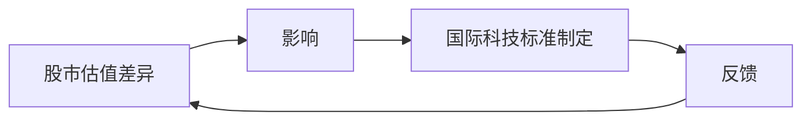

# 股市估值差异对国际科技标准制定的影响

> 关键词：股市估值差异、国际科技标准制定、科技企业、市场力量、技术创新

> 摘要：本文深入探讨了股市估值差异对国际科技标准制定的影响。首先介绍了研究的背景、目的、预期读者和文档结构等内容。接着阐述了股市估值差异和国际科技标准制定的核心概念及两者之间的联系，并通过示意图和流程图进行展示。然后详细讲解了相关算法原理、数学模型和公式。在项目实战部分，给出代码案例并进行解读。之后分析了实际应用场景，推荐了学习资源、开发工具框架和相关论文著作。最后总结了未来发展趋势与挑战，解答常见问题，并提供扩展阅读和参考资料。旨在全面剖析股市估值差异在国际科技标准制定过程中所起到的作用，为相关领域的研究和实践提供参考。

## 1. 背景介绍 
### 1.1 目的和范围
本研究的目的在于全面且深入地探究股市估值差异对国际科技标准制定所产生的影响。随着全球科技产业的迅速发展，国际科技标准在规范市场、推动技术创新以及促进国际贸易等方面发挥着至关重要的作用。而股市作为经济的重要组成部分，其估值差异反映了不同科技企业在市场中的地位和投资者对其未来发展的预期。了解股市估值差异如何影响国际科技标准的制定，有助于揭示市场力量在科技标准形成过程中的作用机制，为科技企业的战略决策、政策制定者的监管措施以及投资者的投资策略提供有价值的参考。

本研究的范围涵盖了全球主要科技市场，包括但不限于美国、中国、欧盟等地区的股市。研究对象主要聚焦于科技行业，特别是在人工智能、半导体、通信技术等前沿领域有重大影响力的企业。同时，我们将关注国际上主要的科技标准制定组织，如国际标准化组织（ISO）、电气和电子工程师协会（IEEE）等所制定的标准。

### 1.2 预期读者
本文的预期读者包括科技企业的管理人员和战略规划者，他们可以通过了解股市估值差异与国际科技标准制定之间的关系，更好地制定企业的发展战略，提高企业在国际市场的竞争力。政策制定者和监管机构人员也可以从本文中获取相关信息，以制定更加合理的产业政策和监管措施，促进科技产业的健康发展。此外，金融投资者、研究机构的学者以及对科技和金融领域感兴趣的人士也能从本文中获得有价值的见解。

### 1.3 文档结构概述
本文将按照以下结构进行阐述：首先介绍背景信息，包括研究的目的、范围、预期读者和文档结构概述等内容。接着深入讲解股市估值差异和国际科技标准制定的核心概念以及两者之间的联系，并通过示意图和流程图进行直观展示。然后详细分析核心算法原理和具体操作步骤，运用Python代码进行说明，同时介绍相关的数学模型和公式，并举例进行详细讲解。在项目实战部分，提供代码实际案例并进行详细解释说明，包括开发环境搭建、源代码实现和代码解读等内容。之后探讨实际应用场景，推荐学习资源、开发工具框架和相关论文著作。最后总结未来发展趋势与挑战，解答常见问题，并提供扩展阅读和参考资料。

### 1.4 术语表
#### 1.4.1 核心术语定义
- **股市估值差异**：指不同科技企业在股票市场上的估值存在的差异。估值通常是通过各种估值方法，如市盈率（P/E）、市净率（P/B）等计算得出，反映了市场对企业未来盈利能力和发展潜力的预期。
- **国际科技标准制定**：由国际标准化组织或相关行业协会等机构，根据科技发展的需求和市场的共识，制定的一系列技术规范和准则，旨在促进科技产品和服务的互操作性、安全性和质量提升。
- **科技企业**：从事科技研发、生产和销售的企业，涵盖了信息技术、生物技术、新能源等多个领域。

#### 1.4.2 相关概念解释
- **市场力量**：在股票市场中，市场力量表现为投资者的买卖行为对股票价格和企业估值的影响。在国际科技标准制定过程中，市场力量则体现为科技企业凭借其市场地位和资源，对标准制定过程施加的影响力。
- **技术创新**：指企业通过研发投入和创新活动，开发出新技术、新产品或新服务的过程。技术创新是推动科技产业发展和国际科技标准更新的重要动力。

#### 1.4.3 缩略词列表
- **ISO**：International Organization for Standardization，国际标准化组织
- **IEEE**：Institute of Electrical and Electronics Engineers，电气和电子工程师协会
- **P/E**：Price-to-Earnings Ratio，市盈率
- **P/B**：Price-to-Book Ratio，市净率

## 2. 核心概念与联系 

### 2.1 股市估值差异的原理
股市估值差异主要源于以下几个方面。首先，企业的基本面因素是影响估值的重要因素之一。科技企业的盈利能力、资产质量、市场份额等指标会直接影响投资者对其的估值。例如，一家具有高盈利能力和稳定市场份额的科技企业，往往会获得较高的估值。其次，行业发展前景也会对企业估值产生影响。处于新兴科技领域且具有广阔发展前景的企业，可能会获得投资者的青睐，从而拥有较高的估值。此外，市场情绪和投资者预期也会导致股市估值差异。在市场乐观情绪高涨时，投资者可能会给予科技企业更高的估值；而在市场低迷时，估值则可能会下降。

### 2.2 国际科技标准制定的架构
国际科技标准制定通常由国际标准化组织或相关行业协会主导。这些组织会成立专门的技术委员会，负责制定和修订科技标准。技术委员会的成员通常包括来自科技企业、科研机构、政府部门等各方面的专家。在标准制定过程中，需要经过立项、起草、征求意见、审查、批准等多个环节，以确保标准的科学性、合理性和实用性。

### 2.3 两者之间的联系
股市估值差异与国际科技标准制定之间存在着密切的联系。一方面，高估值的科技企业往往具有更强的经济实力和资源优势，能够投入更多的资金进行研发和标准制定活动。这些企业在国际科技标准制定过程中具有更大的话语权，能够将自己的技术和理念融入到标准中。另一方面，国际科技标准的制定也会影响科技企业的股市估值。如果企业的技术被纳入国际科技标准，将提高企业的市场竞争力和声誉，从而可能导致其股市估值上升。

### 2.4 文本示意图
```plaintext
股市估值差异
    |
    | 影响
    |
国际科技标准制定
    |
    | 反馈
    |
股市估值差异
```

### 2.5 Mermaid 流程图


## 3. 核心算法原理 & 具体操作步骤 

### 3.1 股市估值计算算法
股市估值常用的方法之一是市盈率法。市盈率（P/E）是指股票价格与每股收益的比率，计算公式为：

```python
def calculate_pe_ratio(stock_price, earnings_per_share):
    """
    计算市盈率
    :param stock_price: 股票价格
    :param earnings_per_share: 每股收益
    :return: 市盈率
    """
    if earnings_per_share == 0:
        return float('inf')
    return stock_price / earnings_per_share

# 示例
stock_price = 100
earnings_per_share = 5
pe_ratio = calculate_pe_ratio(stock_price, earnings_per_share)
print(f"市盈率: {pe_ratio}")
```

### 3.2 标准影响力评估算法
为了评估科技企业在国际科技标准制定中的影响力，我们可以采用以下算法。首先，我们可以定义一个标准影响力得分，该得分由企业参与标准制定的次数、在标准制定过程中的贡献度等因素决定。

```python
def calculate_standard_influence(participation_times, contribution_degree):
    """
    计算标准影响力得分
    :param participation_times: 参与标准制定的次数
    :param contribution_degree: 在标准制定过程中的贡献度（0-1之间）
    :return: 标准影响力得分
    """
    return participation_times * contribution_degree

# 示例
participation_times = 5
contribution_degree = 0.8
standard_influence = calculate_standard_influence(participation_times, contribution_degree)
print(f"标准影响力得分: {standard_influence}")
```

### 3.3 两者关联分析算法
为了分析股市估值差异与国际科技标准制定之间的关联，我们可以采用线性回归分析方法。以下是一个简单的Python代码示例：

```python
import numpy as np
from sklearn.linear_model import LinearRegression

# 假设我们有一组股市估值数据和标准影响力得分数据
stock_valuations = np.array([100, 200, 300, 400, 500]).reshape(-1, 1)
standard_influences = np.array([2, 4, 6, 8, 10])

# 创建线性回归模型
model = LinearRegression()
model.fit(stock_valuations, standard_influences)

# 预测
new_stock_valuation = np.array([600]).reshape(-1, 1)
predicted_standard_influence = model.predict(new_stock_valuation)
print(f"预测的标准影响力得分: {predicted_standard_influence[0]}")
```

## 4. 数学模型和公式 & 详细讲解 & 举例说明 

### 4.1 市盈率公式
市盈率（P/E）的计算公式为：
$$P/E = \frac{P}{EPS}$$
其中，$P$ 表示股票价格，$EPS$ 表示每股收益。

例如，某科技企业的股票价格为 50 元，每股收益为 2 元，则该企业的市盈率为：
$$P/E = \frac{50}{2} = 25$$

### 4.2 标准影响力得分公式
标准影响力得分（$S$）的计算公式为：
$$S = N \times C$$
其中，$N$ 表示企业参与标准制定的次数，$C$ 表示企业在标准制定过程中的贡献度（取值范围为 0 到 1）。

例如，某科技企业参与标准制定的次数为 3 次，在标准制定过程中的贡献度为 0.7，则该企业的标准影响力得分计算如下：
$$S = 3 \times 0.7 = 2.1$$

### 4.3 线性回归模型公式
线性回归模型的一般形式为：
$$y = \beta_0 + \beta_1x + \epsilon$$
其中，$y$ 是因变量（如标准影响力得分），$x$ 是自变量（如股市估值），$\beta_0$ 是截距，$\beta_1$ 是斜率，$\epsilon$ 是误差项。

通过最小二乘法可以估计出 $\beta_0$ 和 $\beta_1$ 的值。在上述Python代码示例中，`model.intercept_` 表示 $\beta_0$，`model.coef_` 表示 $\beta_1$。

例如，根据上述代码示例，拟合得到的线性回归模型为：
$$y = \beta_0 + \beta_1x$$
其中，$\beta_0$ 和 $\beta_1$ 的值可以通过 `model.intercept_` 和 `model.coef_` 得到。当 $x = 600$ 时，代入模型即可预测出 $y$ 的值。

## 5. 项目实战：代码实际案例和详细解释说明 

### 5.1  开发环境搭建
为了运行上述代码，我们需要搭建以下开发环境：
- **Python 环境**：建议使用 Python 3.7 及以上版本。可以从 Python 官方网站（https://www.python.org/downloads/）下载并安装。
- **第三方库**：需要安装 `numpy` 和 `scikit-learn` 库。可以使用以下命令进行安装：
```sh
pip install numpy scikit-learn
```

### 5.2  源代码详细实现和代码解读
以下是一个完整的代码示例，将上述算法整合在一起：

```python
import numpy as np
from sklearn.linear_model import LinearRegression

def calculate_pe_ratio(stock_price, earnings_per_share):
    """
    计算市盈率
    :param stock_price: 股票价格
    :param earnings_per_share: 每股收益
    :return: 市盈率
    """
    if earnings_per_share == 0:
        return float('inf')
    return stock_price / earnings_per_share

def calculate_standard_influence(participation_times, contribution_degree):
    """
    计算标准影响力得分
    :param participation_times: 参与标准制定的次数
    :param contribution_degree: 在标准制定过程中的贡献度（0-1之间）
    :return: 标准影响力得分
    """
    return participation_times * contribution_degree

# 示例数据
stock_prices = [100, 200, 300, 400, 500]
earnings_per_shares = [5, 10, 15, 20, 25]
participation_times_list = [2, 4, 6, 8, 10]
contribution_degree_list = [0.6, 0.7, 0.8, 0.9, 1.0]

# 计算市盈率和标准影响力得分
pe_ratios = []
standard_influences = []
for i in range(len(stock_prices)):
    pe_ratio = calculate_pe_ratio(stock_prices[i], earnings_per_shares[i])
    pe_ratios.append(pe_ratio)
    standard_influence = calculate_standard_influence(participation_times_list[i], contribution_degree_list[i])
    standard_influences.append(standard_influence)

# 转换为 numpy 数组
pe_ratios = np.array(pe_ratios).reshape(-1, 1)
standard_influences = np.array(standard_influences)

# 创建线性回归模型
model = LinearRegression()
model.fit(pe_ratios, standard_influences)

# 预测
new_stock_price = 600
new_earnings_per_share = 30
new_pe_ratio = calculate_pe_ratio(new_stock_price, new_earnings_per_share)
new_pe_ratio = np.array([new_pe_ratio]).reshape(-1, 1)
predicted_standard_influence = model.predict(new_pe_ratio)

print(f"新的市盈率: {new_pe_ratio[0][0]}")
print(f"预测的标准影响力得分: {predicted_standard_influence[0]}")
```

### 5.3  代码解读与分析
- **市盈率计算函数**：`calculate_pe_ratio` 函数用于计算市盈率。当每股收益为 0 时，返回无穷大。
- **标准影响力得分计算函数**：`calculate_standard_influence` 函数根据参与标准制定的次数和贡献度计算标准影响力得分。
- **数据处理**：通过循环计算每个示例的市盈率和标准影响力得分，并将结果存储在列表中。然后将列表转换为 `numpy` 数组，以便进行线性回归分析。
- **线性回归模型**：使用 `sklearn` 库中的 `LinearRegression` 类创建线性回归模型，并使用拟合数据进行训练。
- **预测**：计算新的市盈率，并使用训练好的模型预测对应的标准影响力得分。

通过这个代码示例，我们可以看到如何计算股市估值和标准影响力得分，并分析两者之间的关联。

## 6. 实际应用场景 
### 6.1 科技企业战略决策
科技企业可以根据自身的股市估值情况，制定合理的标准制定战略。高估值的企业可以加大在标准制定方面的投入，积极参与国际科技标准的制定，将自己的技术优势转化为标准优势，进一步巩固市场地位。例如，苹果公司凭借其在智能手机领域的高估值和强大的技术实力，积极参与相关国际标准的制定，推动了智能手机行业的发展。

### 6.2 投资者投资决策
投资者可以将企业在国际科技标准制定中的影响力作为投资决策的参考因素之一。具有较高标准影响力的企业，往往具有更强的市场竞争力和发展潜力，其股市估值可能会随着标准的推广而上升。因此，投资者可以关注这些企业的股票，以获取更好的投资回报。

### 6.3 政策制定者监管措施
政策制定者可以通过了解股市估值差异与国际科技标准制定之间的关系，制定更加合理的产业政策和监管措施。例如，对于高估值但在标准制定方面缺乏积极参与的企业，可以通过政策引导其加大投入；对于在标准制定中发挥重要作用的企业，可以给予一定的政策支持和奖励，以促进科技产业的健康发展。

### 6.4 行业发展推动
股市估值差异和国际科技标准制定之间的相互作用可以推动整个科技行业的发展。高估值企业的积极参与可以加速标准的制定和推广，促进技术的普及和应用；而标准的完善又可以提高行业的整体水平，吸引更多的投资和创新，形成良性循环。

## 7. 工具和资源推荐
### 7.1 学习资源推荐
#### 7.1.1 书籍推荐
- 《估值：难点、解决方案及相关案例》：这本书详细介绍了各种估值方法和技巧，对于理解股市估值差异具有重要的参考价值。
- 《标准战略：企业市场竞争新利器》：深入探讨了企业在标准制定中的战略和方法，有助于了解国际科技标准制定的过程和影响。
- 《科技行业投资分析》：提供了科技行业的投资分析方法和案例，对于投资者和企业管理人员具有一定的指导意义。

#### 7.1.2 在线课程
- Coursera 上的“Financial Markets”课程：由耶鲁大学教授 Robert Shiller 授课，介绍了金融市场的基本原理和估值方法。
- edX 上的“Technology Standards and Innovation”课程：探讨了技术标准与创新之间的关系，以及标准制定的过程和影响。
- Udemy 上的“Investing in Technology Stocks”课程：专门针对科技股票投资进行讲解，包括估值分析和投资策略等内容。

#### 7.1.3 技术博客和网站
- Seeking Alpha：提供了大量的股票分析和估值文章，涵盖了科技行业的各个领域。
- IEEE Standards Association：国际电气和电子工程师协会的标准制定组织的官方网站，提供了最新的科技标准信息和相关研究报告。
- ISO Online Browsing Platform：国际标准化组织的在线浏览平台，可查询和下载各种国际标准。

### 7.2 开发工具框架推荐
#### 7.2.1 IDE和编辑器
- PyCharm：一款功能强大的 Python 集成开发环境，提供了代码编辑、调试、版本控制等功能，适合进行数据分析和机器学习相关的开发。
- Jupyter Notebook：一种交互式的开发环境，支持 Python、R 等多种编程语言，方便进行数据探索和可视化分析。
- Visual Studio Code：一款轻量级的代码编辑器，具有丰富的插件生态系统，可用于多种编程语言的开发。

#### 7.2.2 调试和性能分析工具
- PDB：Python 自带的调试器，可用于调试 Python 代码。
- cProfile：Python 标准库中的性能分析工具，可用于分析代码的运行时间和函数调用次数。
- Scikit-learn 的交叉验证功能：可用于评估机器学习模型的性能和选择最优的模型参数。

#### 7.2.3 相关框架和库
- Numpy：Python 中用于科学计算的基础库，提供了高效的数组操作和数学函数。
- Pandas：用于数据处理和分析的库，提供了灵活的数据结构和数据操作方法。
- Scikit-learn：Python 中常用的机器学习库，提供了各种机器学习算法和工具，可用于数据建模和分析。

### 7.3 相关论文著作推荐
#### 7.3.1 经典论文
- "The Economics of Standards"：这篇论文从经济学的角度探讨了标准的形成和影响，为理解国际科技标准制定提供了理论基础。
- "Technological Innovation and Standardization"：分析了技术创新与标准制定之间的相互关系，以及标准在技术扩散和市场竞争中的作用。
- "Stock Market Valuation and Corporate Innovation"：研究了股市估值与企业创新之间的关系，对于理解股市估值差异对科技企业创新和标准制定的影响具有重要意义。

#### 7.3.2 最新研究成果
- 关注顶级学术期刊，如《Management Science》、《Strategic Management Journal》等，这些期刊经常发表关于科技产业、标准制定和股市估值等方面的最新研究成果。
- 参加国际学术会议，如 IEEE International Conference on Technology Management 等，与领域内的专家和学者交流最新的研究进展。

#### 7.3.3 应用案例分析
- 研究知名科技企业在标准制定和股市估值方面的案例，如华为、谷歌、微软等。分析这些企业的战略决策、技术创新和市场表现，从中汲取经验和教训。
- 关注行业报告和研究机构发布的案例分析，如 Gartner、IDC 等机构的报告，了解科技行业的最新动态和发展趋势。

## 8. 总结：未来发展趋势与挑战
### 8.1 未来发展趋势
- **科技标准制定的全球化趋势加强**：随着全球科技产业的融合和发展，国际科技标准的制定将越来越多地涉及到不同国家和地区的企业和机构。股市估值差异将促使各国科技企业在全球范围内展开竞争和合作，共同推动科技标准的制定和统一。
- **新兴技术标准的快速发展**：人工智能、区块链、量子计算等新兴技术的不断涌现，将催生大量新的科技标准。高估值的科技企业将在这些新兴技术标准的制定中发挥重要作用，通过掌握标准话语权来抢占市场先机。
- **股市估值与标准制定的互动更加紧密**：未来，股市估值将更加敏锐地反映企业在标准制定中的影响力，而标准的制定也将更加直接地影响企业的股市估值。两者之间的互动将形成更加复杂和紧密的关系。

### 8.2 挑战
- **标准制定的利益博弈加剧**：随着股市估值差异的扩大，不同科技企业在标准制定过程中的利益诉求也将更加多样化。企业之间可能会为了争夺标准话语权而展开激烈的竞争，导致标准制定过程中的利益博弈加剧，增加标准制定的难度和成本。
- **技术更新换代速度加快**：科技行业的技术更新换代速度越来越快，这给国际科技标准的制定带来了巨大的挑战。标准制定机构需要及时跟上技术发展的步伐，制定出适应新技术发展的标准，否则可能会导致标准滞后，影响行业的发展。
- **国际政治和贸易因素的影响**：国际政治和贸易因素可能会对股市估值和国际科技标准制定产生干扰。例如，贸易保护主义政策可能会限制科技企业的国际合作，影响标准的制定和推广；政治因素也可能会导致不同国家和地区在标准制定上的分歧和冲突。

## 9. 附录：常见问题与解答
### 9.1 股市估值差异一定能反映企业在标准制定中的影响力吗？
不一定。股市估值差异受到多种因素的影响，包括企业的基本面、市场情绪、行业发展前景等。虽然高估值的企业通常具有更强的经济实力和资源优势，但在标准制定中的影响力还取决于企业的战略决策、技术创新能力和对标准制定的重视程度等因素。因此，股市估值差异只是一个参考因素，不能完全反映企业在标准制定中的影响力。

### 9.2 如何衡量企业在国际科技标准制定中的贡献度？
衡量企业在国际科技标准制定中的贡献度可以从多个方面进行考虑。例如，企业参与标准制定的次数、在标准制定过程中提出的技术提案数量和质量、对标准文本的修改建议和贡献等。此外，企业在标准推广和应用过程中的作用，如推动标准的实施和采用等，也可以作为衡量贡献度的指标。

### 9.3 股市估值差异对国际科技标准制定的影响是短期还是长期的？
股市估值差异对国际科技标准制定的影响既有短期的也有长期的。在短期内，高估值的企业可能会凭借其资金优势和市场影响力，在标准制定过程中迅速占据主导地位，推动有利于自己的标准的制定。但从长期来看，标准的制定还需要考虑技术的发展趋势、市场的需求和行业的共识等因素。如果企业的技术不能持续创新和满足市场需求，即使其短期内具有较高的股市估值，也难以在标准制定中保持长期的影响力。

### 9.4 政策制定者可以采取哪些措施来平衡股市估值差异对国际科技标准制定的影响？
政策制定者可以采取以下措施来平衡股市估值差异对国际科技标准制定的影响：
- 加强对标准制定过程的监管，确保标准制定的公平、公正和透明，避免高估值企业垄断标准制定话语权。
- 鼓励不同规模和估值的企业参与标准制定，提供平等的机会和平台，促进标准制定的多元化和民主化。
- 加大对科技研发和标准制定的投入，支持中小企业和创新型企业的发展，提高整个行业的技术水平和标准制定能力。
- 推动国际合作和交流，加强不同国家和地区在标准制定方面的协调和统一，减少因股市估值差异和地区差异导致的标准分歧。

## 10. 扩展阅读 & 参考资料
### 10.1 扩展阅读
- 《创新者的窘境》：探讨了企业在面对技术创新和市场变化时的困境和应对策略，对于理解科技企业在标准制定和市场竞争中的行为具有一定的启示作用。
- 《科技与标准》：深入分析了科技与标准之间的关系，以及标准在科技产业发展中的重要作用。
- 《金融市场与金融机构》：介绍了金融市场的基本原理和金融机构的运作机制，有助于理解股市估值的形成和影响因素。

### 10.2 参考资料
- 国际标准化组织（ISO）官方网站：https://www.iso.org/
- 电气和电子工程师协会（IEEE）官方网站：https://www.ieee.org/
- 中国证券监督管理委员会（CSRC）官方网站：http://www.csrc.gov.cn/
- 美国证券交易委员会（SEC）官方网站：https://www.sec.gov/

作者：AI天才研究院/AI Genius Institute & 禅与计算机程序设计艺术 /Zen And The Art of Computer Programming